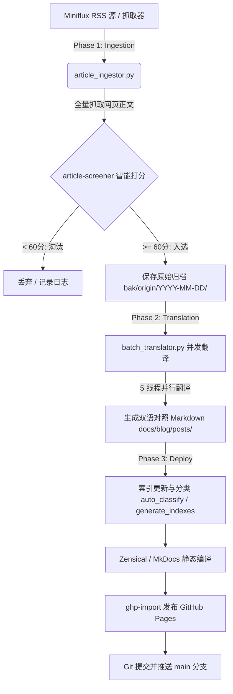

# ATBInsight (AI Tech & Business Insight)

> **ATBInsight** 是一个全自动化的前沿 AI 技术与硬核工程研报深度追踪、主编级严选、中英双语对照排版及静态站点发布平台。  
> 🌐 **在线站点**：[https://insight.aitobox.com/](https://insight.aitobox.com/)  
> 📡 **RSS 订阅源**：[https://insight.aitobox.com/rss.xml](https://insight.aitobox.com/rss.xml)  
> 📅 **时间轴归档**：[https://insight.aitobox.com/archive/](https://insight.aitobox.com/archive/)

---

## 📖 目录

- [🌟 核心特性](#-核心特性)
- [🧩 Skills 体系说明](#-skills-体系说明)
  - [1. daily-publisher (自动发布总编排器)](#1-daily-publisher-自动发布总编排器)
  - [2. article-screener (主编筛选智能体)](#2-article-screener-主编筛选智能体)
  - [3. tech-article-translator (双语技术翻译官)](#3-tech-article-translator-双语技术翻译官)
  - [4. popular-science-translator (科普技术翻译官)](#4-popular-science-translator-科普技术翻译官)
- [⏰ 定时任务与自动化调度](#-定时任务与自动化调度)
  - [1. Agent 内部定时任务 (Antigravity Cron)](#1-agent-内部定时任务-antigravity-cron)
  - [2. 系统级 Crontab 守护脚本](#2-系统级-crontab-守护脚本)
  - [3. 自动故障与重启恢复机制 (Schedule Recovery)](#3-自动故障与重启恢复机制-schedule-recovery)
- [🏗️ 三阶段自动化流水线 (Pipeline)](#️-三阶段自动化流水线-pipeline)
- [📂 目录结构说明](#-目录结构说明)
- [🛠️ 本地开发与手动运行](#️-本地开发与手动运行)

---

## 🌟 核心特性

1. **主编级 AI 严选机制 (Chief Editor Screening)**
   - 突破 RSS 摘要字数限制，全量抓取文章原始网页正文。
   - 采用严格的“四不选”主编准则：坚决淘汰周报/合集/链接汇编、空洞营销公关、泛泛新闻、政策/法规讨论。
   - 专注文档级深度研报、编译器/内核/数据库底层架构解析、前沿论文与极客文化深度文章。
2. **中英双语对照排版 (Bilingual Parallel Formatting)**
   - 段落级中英对照：中文译文紧随原英文引用块（`>`）。
   - 代码块、数学公式（MathJax）、图片路径与架构图保持无损原貌。
   - 每篇研报顶部自动生成 3~5 句精炼的 **“文章背景与核心概要”**。
3. **精准的分类与索引体系 (Taxonomy & Auto-Indexing)**
   - 6 大标准顶级分类：`产品发布`、`工具教程`、`研究解读`、`商业动态`、`arXiv论文`、`其他`。
   - 自动维护首页“每日头条”、全量时间轴（Timeline Archive）、分类归档页、标签墙（Tags）与 RSS 订阅源。
4. **全自动闭环交付**
   - 从数据抓取、筛选、并发翻译、静态 HTML 编译到 GitHub Pages 及 `main` 分支提交，全程无需人工干预。

---

## 🧩 Skills 体系说明

项目核心业务能力封装在 `skills/` 目录下，遵循 Antigravity 标准 Skill 规范：

### 1. `daily-publisher` (自动发布总编排器)
- **路径**：[`skills/daily-publisher/SKILL.md`](file:///opt/aitobox/ATBInsight/skills/daily-publisher/SKILL.md)
- **职责**：
  - 编排每日发布的全量 3 阶段工作流（Phase 1 抓取筛选 -> Phase 2 并行翻译 -> Phase 3 编译部署）。
  - 支持按天数参数抓取（例如 `--days 1` 或 `--days 30`）。
  - 自动调度 5 线程并发翻译队列，翻译完成后串行触发全站索引重建与 Git/GitHub Pages 部署。

### 2. `article-screener` (主编筛选智能体)
- **路径**：[`skills/article-screener/SKILL.md`](file:///opt/aitobox/ATBInsight/skills/article-screener/SKILL.md)
- **职责**：
  - 模拟世界级资深技术主编（Chief Editor Persona）对抓取到的候选文章进行独立审阅与打分（0~100 分）。
  - **严格淘汰（Score = 0）**：周报汇总（Weekly/Daily Roundup）、空洞噱头标题、政策/监管/法律纠纷、<2000 字符短浅碎文。
  - **优先收录（Score 70~100）**：底层系统架构深度复盘、高价值学术论文、高质量硬核教程。
  - **收录门槛**：得分 $\ge 60$ 方可进入本地归档 `bak/origin/YYYY-MM-DD/`。

### 3. `tech-article-translator` (双语技术翻译官)
- **路径**：[`skills/tech-article-translator/SKILL.md`](file:///opt/aitobox/ATBInsight/skills/tech-article-translator/SKILL.md)
- **职责**：
  - 指导模型对原始 Markdown 文章进行深度结构化翻译。
  - 规范 YAML Front Matter 格式（自动提取 tags、精准归类至 6 大分类之一）。
  - 生成 `### 文章背景与核心概要`。
  - 保持段落级中英对照，输出规范命名的文章至 `docs/blog/posts/YYYY-MM-DD-<标题>.md`。

### 4. `popular-science-translator` (科普技术翻译官)
- **路径**：[`skills/popular-science-translator/SKILL.md`](file:///opt/aitobox/ATBInsight/skills/popular-science-translator/SKILL.md)
- **职责**：
  - 采用“三步法（直译 -> 问题诊断 -> 意译）”将专业学术论文、深度技术文档翻译为通俗易懂的中文科普读物风格。
  - 保留人名英文原名、公司缩写与文献引用（如 `[20]`）。
  - 图表标注规范化（如 `Figure 1: ` -> `图 1: `），半角括号与空格规范（` (英文原词) `）。
  - 严格保持 Markdown 原始格式并遵循 AI 核心术语映射表。

---

## ⏰ 定时任务与自动化调度

ATBInsight 支持 **智能体内部定时器** 与 **系统级 Crontab** 双重自动化保障：

### 1. Agent 内部定时任务 (Antigravity Cron)

智能体通过内置的 `schedule` 工具注册常驻定时任务：

| 参数项 | 配置值 |
| :--- | :--- |
| **任务类型** | 循环定时任务 (Cron) |
| **Cron 表达式** | `0 1 * * *` (每天凌晨 01:00 AM 触发) |
| **触发指令 (Prompt)** | `Read and execute the skill defined at /opt/aitobox/ATBInsight/skills/daily-publisher/SKILL.md to fetch recent 1 days good article and publish` |
| **任务行为** | 自动读取 `daily-publisher` skill 启动最新 1 天文章的拉取、筛选、翻译与全量部署 |

### 2. 系统级 Crontab 守护脚本

系统层面提供高可用守护脚本 [`scripts/daily_cron_runner.sh`](file:///opt/aitobox/ATBInsight/scripts/daily_cron_runner.sh)，配置了：
- **文件锁防重入**：利用 `flock` 避免上次任务挂起导致多实例并发冲突。
- **环境自适应加载**：自动导入 Conda `ATBInsight` 环境与 `.env` 密钥配置。
- **日志自动轮转裁剪**：监控 `var/log/cron_publisher.log` 体积，超过 50MB 自动截断保留最新 2000 行。
- **执行命令**：
  ```bash
  0 1 * * * /opt/aitobox/ATBInsight/scripts/daily_cron_runner.sh >> /opt/aitobox/ATBInsight/var/log/cron_publisher.log 2>&1
  ```

### 3. 自动故障与重启恢复机制 (Schedule Recovery)

根据项目规则 [`.agents/rules/schedule-recovery.md`](file:///opt/aitobox/ATBInsight/.agents/rules/schedule-recovery.md)：
- 无论因系统维护、服务器重启或会话重置导致后台任务中断，Agent 在被唤醒或恢复时会**主动校验后台定时任务列表**。
- 若发现 `0 1 * * *` 定时任务未处于运行状态，将立即自动重新注册该 Cron 任务，保证每日 01:00 AM 自动化流程永不断续。

---

## 🏗️ 三阶段自动化流水线 (Pipeline)



1. **Phase 1: 抓取与筛选 (Ingestion & Screening)**
   ```bash
   PYTHONPATH=. python scripts/article_ingestor.py --days 1
   ```
2. **Phase 2: 并发翻译与结构化排版 (Translation & Categorization)**
   ```bash
   PYTHONPATH=. python scripts/batch_translator.py --dir bak/origin/YYYY-MM-DD --workers 5
   ```
3. **Phase 3: 索引构建与全量部署 (Build & Deploy)**
   ```bash
   python scripts/generate_archive.py
   python scripts/update_daily_headlines.py
   PYTHONPATH=. python scripts/auto_classify.py
   python scripts/generate_indexes.py
   mkdir -p docs/blog/posts/images && cp -rn bak/origin/*/images/* docs/blog/posts/images/ 2>/dev/null || true
   zensical build
   ghp-import -p -b gh-pages site
   git add . && git commit -m 'docs: update daily posts' && git push origin main
   ```

---

## 📂 目录结构说明

```text
ATBInsight/
├── .agents/
│   └── rules/                  # 项目全局行为准则与恢复规则
│       ├── env-activate.md     # 环境变量激活规则
│       └── schedule-recovery.md# 定时任务自动恢复规则
├── skills/                     # Antigravity Skills 技能定义
│   ├── daily-publisher/        # 每日全流程自动发布技能
│   ├── article-screener/       # 主编严格筛选技能
│   ├── tech-article-translator/# 双语对照翻译技能
│   └── popular-science-translator/# 科普风格三步法翻译技能
├── scripts/                    # 流水线执行与维护脚本
│   ├── article_ingestor.py     # 文章抓取与初筛入口
│   ├── batch_translator.py     # 多线程并发翻译调度脚本
│   ├── auto_classify.py        # 6 大标准分类校验与重分类
│   ├── generate_archive.py     # 时间轴归档生成脚本
│   ├── generate_indexes.py     # 标签与分类索引页生成脚本
│   ├── update_daily_headlines.py # 首页每日头条更新脚本
│   └── daily_cron_runner.sh    # 系统级 Crontab 守护脚本
├── docs/                       # MkDocs / Zensical 文档站点源文件
│   ├── index.md                # 站点首页（每日头条与动态展示）
│   ├── archive.md              # 完整时间轴索引
│   ├── tags.md                 # 标签分类汇总
│   └── blog/
│       ├── category/           # 6 大分类归档页
│       └── posts/              # 正式发布的双语对照 Markdown 研报
├── bak/origin/                 # 抓取并入选的原始英文文章及图片归档 (YYYY-MM-DD)
├── overrides/                  # Material 主题定制模版 (Header、RSS图标、Timeline链接)
└── zensical.toml               # 现代化静态站点构建配置文件
```

---

## 🛠️ 本地开发与手动运行

### 1. 激活开发环境
```bash
export PATH=/usr/local/bin:$PATH
source .env
conda activate ATBInsight
```

### 2. 本地实时预览站点
```bash
zensical serve
# 或使用 MkDocs
# mkdocs serve
```
访问本地服务地址：`http://127.0.0.1:8000/`

### 3. 一键手动执行全流程发布
如需手动抓取并发布最近 1 天的文章：
```bash
# 1. 抓取与初筛
PYTHONPATH=. python scripts/article_ingestor.py --days 1

# 2. 翻译指定日期的归档文章 (以今天为例)
TODAY=$(date +%Y-%m-%d)
PYTHONPATH=. python scripts/batch_translator.py --dir bak/origin/$TODAY --workers 5

# 3. 编译并部署
python scripts/generate_archive.py && \
python scripts/update_daily_headlines.py && \
PYTHONPATH=. python scripts/auto_classify.py && \
python scripts/generate_indexes.py && \
mkdir -p docs/blog/posts/images && cp -rn bak/origin/*/images/* docs/blog/posts/images/ 2>/dev/null || true && \
zensical build && \
ghp-import -p -b gh-pages site && \
git add . && git commit -m "docs: manual publish update" && git push origin main
```
