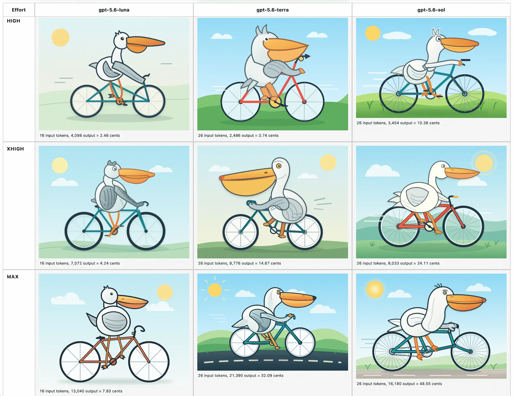
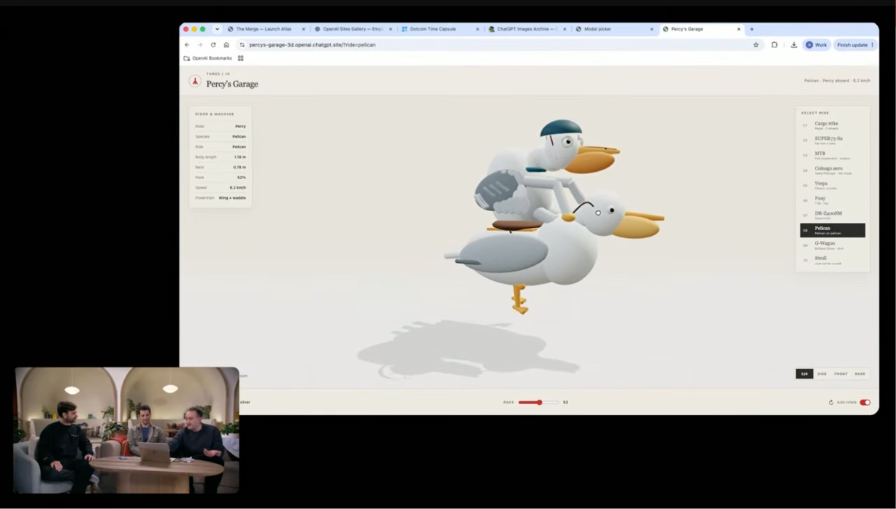

# 全新 GPT-5.6 家族：Luna、Terra 与 Sol

**背景与摘要：**
本文介绍了 OpenAI 最新发布的 GPT-5.6 旗舰模型家族，包含由小到大依次为 Luna、Terra 和 Sol 三个版本。新系列模型的知识截止日期为 2026 年 2 月，具备高达 100 万 Token 的超长上下文窗口，并在智能体任务执行方面展现出卓越能力，其最大的优势在于显著提升了运行效率并大幅降低了使用成本。此外，文章还详细梳理了与之同步推出的重要 API 新特性，包括可编程工具调用、原生多智能体支持以及显式提示词缓存等功能，进一步扩展了开发者的使用边界。

> **Summary:** OpenAI has released its latest flagship model family—**Luna**, **Terra**, and **Sol** (ranging from smallest to largest). Featuring a February 2026 knowledge cutoff, a 1-million-token context window, and advanced agentic capabilities, these models aim to deliver high efficiency and significantly lower costs compared to competitors like Anthropic's Claude. Alongside the release, OpenAI has introduced powerful new API features including programmatic tool calling, multi-agent support, and explicit prompt caching.

---

## 模型阵容与定价

OpenAI 的全新旗舰模型现已全面开放，按规模从小到大分类如下：

> OpenAI's new flagship models hit general availability, categorized by size from smallest to largest:

*   **Luna:** 每百万输入/输出 Token 价格为 $1.00 / $6.00
*   **Terra:** 每百万输入/输出 Token 价格为 $2.50 / $15.00
*   **Sol:** 每百万输入/输出 Token 价格为 $5.00 / $30.00

> *   **Luna:** $1.00 / $6.00 per 1M input/output tokens
> *   **Terra:** $2.50 / $15.00 per 1M input/output tokens
> *   **Sol:** $5.00 / $30.00 per 1M input/output tokens

### 对比与背景

作为参考，Claude Opus 系列的价格为 $5/$25，而 Claude Fable 5 的价格为 $10/$50。然而，单纯比较每百万 Token 的价格正在变得越来越不具备参考价值，因为针对相同的任务，不同模型所消耗的推理 Token 数量存在显著差异。

> ### Comparison and Context
> For context, the Claude Opus series runs at $5/$25 and Claude Fable 5 at $10/$50. However, raw price-per-million tokens is becoming less informative as reasoning token counts vary significantly between models for the same task.

**核心技术规格：**
*   **知识截止日期:** 2026 年 2 月 16 日
*   **上下文窗口:** 1,000,000 Tokens
*   **最大输出 Tokens:** 128,000

> **Core Technical Specs:**
> *   **Knowledge Cutoff:** February 16, 2026
> *   **Context Window:** 1,000,000 tokens
> *   **Max Output Tokens:** 128,000

---

## 基准测试与性能

OpenAI 对其性能的宣称主要集中在长时间运行的智能体任务上。

> ## Benchmarks & Performance
> 
> OpenAI’s primary performance claims center on long-running agentic tasks. 

> “我们训练了 GPT-5.6，以从每个 Token 中榨取更多有价值的工作成果。在涵盖 55 个领域的长时间运行专业工作流评估项目 [Agents’ Last Exam](https://agents-last-exam.org/) 中，GPT-5.6 Sol 创下了 53.6 分的新高，超越 Claude Fable 5（自适应推理版）13.1 分。即便在同等的中等推理程度下，它依然以大约四分之一的预估成本，高出 Fable 5 达 11.4 分。这种极高的效率同样延伸至更小规模的模型中…… GPT-5.6 Terra 和 GPT-5.6 Luna 在仅花费约十六分之一成本的情况下，表现依然优于 Fable 5。”

> > "We trained GPT-5.6 to get more useful work from every token. On [Agents’ Last Exam](https://agents-last-exam.org/), an evaluation of long-running professional workflows across 55 fields, GPT-5.6 Sol sets a new high of 53.6, eclipsing Claude Fable 5 (adaptive reasoning) by 13.1 points. Even at medium reasoning, it beats Fable 5 by 11.4 points at roughly one-quarter the estimated cost. That efficiency extends to smaller models... GPT-5.6 Terra and GPT-5.6 Luna outperform Fable 5 at around one-sixteenth the cost."

### 关于 SWE-Bench Pro 的争议

有趣的是，Claude Fable 5 在 *SWE-Bench Pro* 上的表现优于 GPT-5.6 家族，取得了 80% 的成绩，相比之下 GPT-5.6 Sol 的得分为 64.6%。这很可能促使 OpenAI 发布了一份审查报告，指出了该基准测试存在的问题：

> ### The SWE-Bench Pro Debate
> Interestingly, Claude Fable 5 outperformed the GPT-5.6 family on *SWE-Bench Pro*, scoring 80% compared to GPT-5.6 Sol's 64.6%. This likely prompted OpenAI to publish an audit highlighting issues with the benchmark:

> “鉴于这些测试结果，我们估计约有 30% 的 SWE-bench Pro 任务是损坏或存在缺陷的，并建议模型开发者在参考这些结果时进行仔细甄别。”

> > "In light of these results, we estimate that ~30% of SWE-bench Pro tasks are broken, and advise that model developers carefully examine results."

*来自早期体验测试的初步印象表明，GPT-5.6 Sol 的能力非常强，尽管在复杂的编码任务上它还没有完全超越 Anthropic 的模型。*

> *Early impressions from early-access testing suggest GPT-5.6 Sol is highly competent, though it hasn't quite surpassed Anthropic's models for complex coding tasks.*

---

## 全新 API 功能

[GPT-5.6 模型指南文档](https://developers.openai.com/api/docs/guides/latest-model?model=gpt-5.6) 概述了 API 中几个引人注目的新增功能：

> ## New API Features
> 
> The [GPT-5.6 model guidance docs](https://developers.openai.com/api/docs/guides/latest-model?model=gpt-5.6) outline several notable additions to the API:

*   **[可编程工具调用 (Programmatic Tool Calling)](https://developers.openai.com/api/docs/guides/tools-programmatic-tool-calling):** 允许模型编写并运行 JavaScript 代码来编排工具调用，从而弥合了 MCP（模型上下文协议）与终端会话之间的鸿沟。
*   **[多智能体支持 (Multi-agent Support)](https://developers.openai.com/api/docs/guides/tools-multi-agent):** 将子智能体模式直接烘焙进核心 API 中，使得模型能够生成多个子智能体以进行并行的、专注的工作。
*   **[提示词缓存断点 (Prompt Cache Breakpoints)](https://developers.openai.com/api/docs/guides/prompt-caching#prompt-cache-breakpoints):** 为 OpenAI 带来了显式的提示词缓存功能（类似于 Claude），允许开发者在自动检测之外，手动定义缓存断点以优化成本。
*   **原始图像细节 (Original Image Detail):** 现在可以在图像请求中设置 `detail: original` 来完全跳过图像大小调整过程。

> *   **[Programmatic Tool Calling](https://developers.openai.com/api/docs/guides/tools-programmatic-tool-calling):** Allows models to compose and run JavaScript that orchestrates tool calls, bridging the gap between MCPs and terminal sessions.
> *   **[Multi-agent Support](https://developers.openai.com/api/docs/guides/tools-multi-agent):** Bakes the sub-agent pattern directly into the core API, enabling models to spin up subagents for parallel, focused work.
> *   **[Prompt Cache Breakpoints](https://developers.openai.com/api/docs/guides/prompt-caching#prompt-cache-breakpoints):** Brings explicit prompt caching to OpenAI (similar to Claude), allowing developers to manually define cache breakpoints for cost optimization alongside automatic detection.
> *   **Original Image Detail:** You can now set `detail: original` on image requests to bypass resizing completely.

---

## 视觉测试：鹈鹕矩阵

为了展示这三个模型在不同推理强度（无、低、中等、高、极高以及最大）下的实际效果，作者生成了一个包含 **18 种不同状态下的鹈鹕**的全面测试页面：

> ## Visual Tests: The Pelican Matrix
> 
> To showcase reasoning efforts (none, low, medium, high, xhigh, and max) across the three models, a comprehensive test page was generated featuring **18 different pelicans**:

*   **最便宜:** `gpt-5.6-luna` 在 `effort: none` 配置下花费了 **0.71 美分**。
*   **最昂贵:** `gpt-5.6-sol` 在 `effort: max` 配置下花费了 **48.55 美分**。

> *   **Cheapest:** `gpt-5.6-luna` at `effort: none` cost **0.71 cents**.
> *   **Most Expensive:** `gpt-5.6-sol` at `effort: max` cost **48.55 cents**.

*（请在 [simonwillison.net](https://static.simonwillison.net/static/2026/gpt-5.6-pelicans.html) 上查看完整展示页面。）*

> *(View the full showcase at [simonwillison.net](https://static.simonwillison.net/static/2026/gpt-5.6-pelicans.html).)*

### 直播亮点

在 OpenAI 的发布会直播期间，一段演示展示了骑着三轮车、自行车、小马甚至**骑着其他鹈鹕**的 3D 鹈鹕模型。

> ### Livestream Highlights
> During OpenAI's launch livestream, a demo featured 3D pelicans riding tricycles, bicycles, ponies, and even *other pelicans*.

---

**标签：** [ai](https://simonwillison.net/tags/ai) · [openai](https://simonwillison.net/tags/openai) · [generative-ai](https://simonwillison.net/tags/generative-ai) · [llms](https://simonwillison.net/tags/llms) · [llm-tool-use](https://simonwillison.net/tags/llm-tool-use) · [llm-pricing](https://simonwillison.net/tags/llm-pricing) · [pelican-riding-a-bicycle](https://simonwillison.net/tags/pelican-riding-a-bicycle) · [llm-release](https://simonwillison.net/tags/llm-release) · [gpt-5](https://simonwillison.net/tags/gpt-5)

> **Tags:** [ai](https://simonwillison.net/tags/ai) · [openai](https://simonwillison.net/tags/openai) · [generative-ai](https://simonwillison.net/tags/generative-ai) · [llms](https://simonwillison.net/tags/llms) · [llm-tool-use](https://simonwillison.net/tags/llm-tool-use) · [llm-pricing](https://simonwillison.net/tags/llm-pricing) · [pelican-riding-a-bicycle](https://simonwillison.net/tags/pelican-riding-a-bicycle) · [llm-release](https://simonwillison.net/tags/llm-release) · [gpt-5](https://simonwillison.net/tags/gpt-5)
