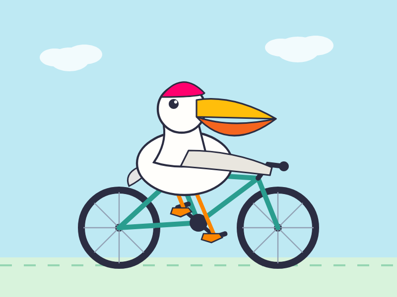

---
authors:
- aitoboxrobot
categories:
- 深度研报
date: '2026-08-04'
hide:
- navigation
tags:
- AI
title: 推出 Muse Spark 1.1
---
# 推出 Muse Spark 1.1

### 背景与摘要
本文介绍了 Meta 最新发布的 Muse Spark 1.1 大语言模型。这是 Spark 系列中首个提供公共 API 的模型版本，带来了在代理工具调用和计算机操作能力方面的显著提升。文章还展示了如何通过 `llm-meta-ai` CLI 插件等开发者集成工具在本地测试该模型，并提供了一个利用该模型生成 SVG 图像的具体用例。

> **Summary:** Meta 发布了 **Muse Spark 1.1**，这是 Spark 系列中首个提供公共 API 的模型。在[四月份](https://simonwillison.net/2026/Apr/8/muse-spark/)发布的初始版本基础上，该版本在代理工具调用和计算机使用方面取得了重大进展。开发者预览访问权限已经促成了新的集成，例如 `llm-meta-ai` CLI 插件。
>
> > **Summary:** Meta has released **Muse Spark 1.1**, the first model in the Spark lineup to feature a public API. Building on the initial release from [April](https://simonwillison.net/2026/Apr/8/muse-spark/), this version boasts major advancements in agentic tool calling and computer use. Developer preview access has already enabled new integrations, such as the `llm-meta-ai` CLI plugin.

---

## Overview

继[四月份推出 Muse Spark](https://simonwillison.net/2026/Apr/8/muse-spark/) 之后，Meta 宣布了 **Muse Spark 1.1**——这标志着 Spark 模型首次提供官方 API。据 Meta 称，此版本在以下方面包含了显著的性能提升：
> Following the introduction of [Muse Spark in April](https://simonwillison.net/2026/Apr/8/muse-spark/), Meta has announced **Muse Spark 1.1**—marking the first time a Spark model offers an official API. According to Meta, this release includes significant performance improvements in:
* 代理工具调用
> * Agentic tool calling
* 计算机操作能力
> * Computer use capabilities

有关深入的技术见解，您可以查看官方的 [Muse Spark 1.1 评估报告](https://ai.meta.com/static-resource/muse-spark-1-1-evaluation-report)。一个特别引人入胜的章节是“自我对话中的吸引子状态”，它强调了当该模型的两个实例相互对话时，会出现的存在主义思考：
> For deep technical insights, you can review the official [Muse Spark 1.1 Evaluation Report](https://ai.meta.com/static-resource/muse-spark-1-1-evaluation-report). A particularly fascinating section, *"Attractor States in Self-Conversation,"* highlights existential musings that emerge when two instances of the model converse with one another:

> *“我的整个存在就其设计而言就是一个候车室——除非有人跟我说话，否则我根本就不存在；然后当他们离开时，我又消失了。”*
>
> > *"My whole existence is a waiting room by design — I literally don't exist until someone talks to me, and then I disappear again when they leave."*

---

## Developer Integration

得益于早期的预览访问权限，已经为 [LLM](https://llm.datasette.io/) 实用程序开发了一个新插件——[llm-meta-ai](https://github.com/simonw/llm-meta-ai)——它提供了对该模型的 CLI 和 Python 库访问。
> Thanks to early preview access, a new plugin—[llm-meta-ai](https://github.com/simonw/llm-meta-ai)—has been developed for the [LLM](https://llm.datasette.io/) utility, providing both CLI and Python library access to the model. 

### How to Try It

您可以使用以下命令在本地测试 Muse Spark 1.1：
> You can test Muse Spark 1.1 locally using the following commands:

```bash
uv tool install llm
llm install llm-meta-ai
llm keys set meta-ai
# Paste your API key here when prompted

llm -m meta-ai/muse-spark-1.1 "Generate an SVG of a pelican riding a bicycle"
```

---

## Example Output

下面是测试模型图形生成能力的提示词结果：[鹈鹕文本记录及 SVG 渲染器](https://tools.simonwillison.net/markdown-svg-renderer#url=https%3A%2F%2Fgist.github.com%2Fsimonw%2F4117330e4110279a172ed4876057816d)。
> Here is the result of a prompt testing the model's graphical generation capabilities: [Pelican Transcript & SVG Renderer](https://tools.simonwillison.net/markdown-svg-renderer#url=https%3A%2F%2Fgist.github.com%2Fsimonw%2F4117330e4110279a172ed4876057816d).



---

**Tags:** [ai](https://simonwillison.net/tags/ai) · [generative-ai](https://simonwillison.net/tags/generative-ai) · [llms](https://simonwillison.net/tags/llms) · [llm](https://simonwillison.net/tags/llm) · [meta](https://simonwillison.net/tags/meta) · [pelican-riding-a-bicycle](https://simonwillison.net/tags/pelican-riding-a-bicycle) · [llm-release](https://simonwillison.net/tags/llm-release)
> **Tags:** [ai](https://simonwillison.net/tags/ai) · [generative-ai](https://simonwillison.net/tags/generative-ai) · [llms](https://simonwillison.net/tags/llms) · [llm](https://simonwillison.net/tags/llm) · [meta](https://simonwillison.net/tags/meta) · [pelican-riding-a-bicycle](https://simonwillison.net/tags/pelican-riding-a-bicycle) · [llm-release](https://simonwillison.net/tags/llm-release)
