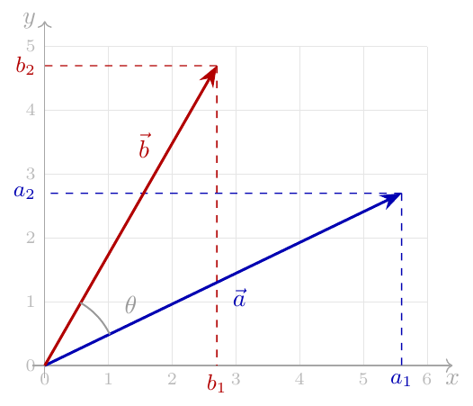
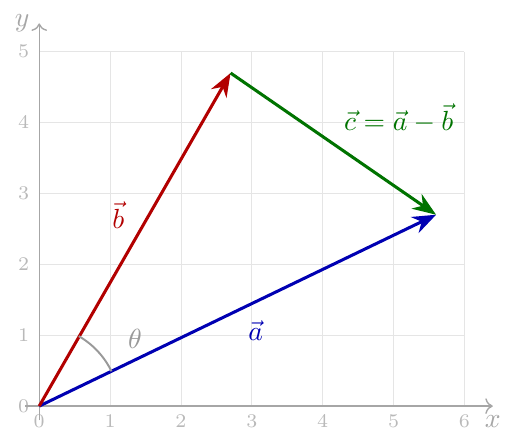
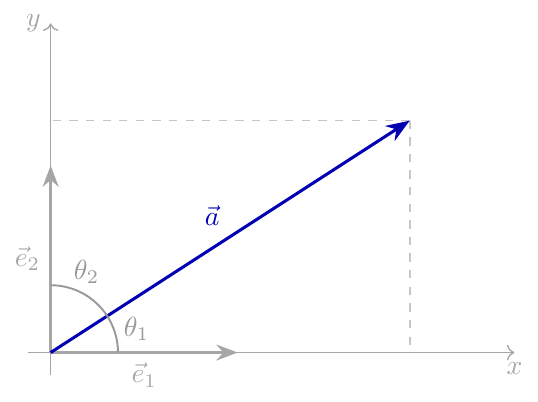

# 点积：分量与几何定义

### 背景与摘要
本文探讨了欧几里得空间中向量点积的两种常见定义——分量定义和几何定义——为什么是等价的。文章提供了两种主要的证明方法：一种是利用余弦定理的几何证明，另一种是使用正交基向量的投影证明。此外，附录部分还回顾了内积空间、范数等基础概念及其基本性质，为理解点积提供了更为严密的数学背景。

## Summary

这篇文章探讨了欧几里得空间中向量点积的两种常见定义——**分量定义**和**几何定义**——为什么是等价的。它提出了两种主要的证明方法：**几何证明**（利用余弦定理）和**投影证明**（使用标准正交基向量）。此外，附录回顾了内积空间、范数及其潜在属性的基础概念。
> This post explores why the two common definitions of the vector dot product in Euclidean space—the **component definition** and the **geometric definition**—are equivalent. It presents two primary methods of proof: the **geometric proof** (leveraging the law of cosines) and the **projection proof** (using orthonormal basis vectors). Additionally, an appendix reviews the foundational concepts of inner product spaces, norms, and their underlying properties.

---

## Introduction

这篇文章的目的是回答一个简单的问题：为什么以下两种在欧几里得空间 [1] 中的向量点积定义对于向量 $\vec{a}$ 和 $\vec{b}$ 是等价的：
> The goal of this post is to answer a simple question: why are the following two definitions of the vector dot product in Euclidean space [1] equivalent for vectors $\vec{a}$ and $\vec{b}$:

* **分量定义：**
> * **Component definition:** 
  $$\vec{a}\cdot\vec{b}=\sum_{i=1}^{n}a_i b_i$$

* **几何定义：**
> * **Geometric definition:** 
  $$\vec{a}\cdot\vec{b}=|\vec{a}||\vec{b}|\cos(\theta)$$
  其中 $|\vec{a}|$ 是 $\vec{a}$ 的大小，$\theta$ 是向量方向之间的夹角。
>   where $|\vec{a}|$ is the magnitude of $\vec{a}$ and $\theta$ is the angle between the vectors’ directions.

下面是我们向量的图形描述（为了清楚起见，重点放在 $\mathbb{R}^2$ 上，尽管这也适用于任何维度的向量）。它显示了向量的分量以及它们之间的夹角。$\vec{a}$ 箭头的*长度*是 $|\vec{a}|$。
> Here’s a graphical depiction of our vectors (focusing on $\mathbb{R}^2$ for clarity, though this applies to any-dimensional vectors). It shows both the components of the vectors and the angle between them. The *length* of the arrow for $\vec{a}$ is $|\vec{a}|$.

我们将在此展示等价性的两种证明，即*几何证明*和*投影证明*。附录描述了有助于这些证明的点积的一些属性。
> We’ll show two proofs of the equivalence here, the *geometric proof* and the *projection proof*. The Appendix describes some properties of dot products that facilitate these proofs.

---

## Geometric Proof

我们将使用我们的向量 $\vec{a}$ 和 $\vec{b}$ 以及向量 $\vec{c}=\vec{a}-\vec{b}$ 的此图表：
> We’ll be using this diagram of our vectors $\vec{a}$ and $\vec{b}$, as well as the vector $\vec{c}=\vec{a}-\vec{b}$:

对这三个向量组成的三角形使用余弦定理 [2]：
> Using the law of cosines [2] on the triangle formed by the three vectors:

$$|\vec{c}|^2=|\vec{a}|^2+|\vec{b}|^2-2|\vec{a}||\vec{b}|\cos(\theta)$$

由于对于任何向量 $\vec{a}$，我们都有 $\vec{a}\cdot\vec{a}=|\vec{a}|^2$（见附录），让我们把这个方程重写为：
> Since for any vector $\vec{a}$, we have $\vec{a}\cdot\vec{a}=|\vec{a}|^2$ (see Appendix), let’s rewrite this equation as:

$$\vec{c}\cdot\vec{c}=\vec{a}\cdot\vec{a}+\vec{b}\cdot\vec{b}-2|\vec{a}||\vec{b}|\cos(\theta)$$

但是 $\vec{c}=\vec{a}-\vec{b}$，并且点积服从分配律（见附录）。因此：
> But $\vec{c}=\vec{a}-\vec{b}$ and the dot product obeys the distributive property (see Appendix). Therefore:

$$\begin{aligned}
(\vec{a}-\vec{b})\cdot(\vec{a}-\vec{b})&=\vec{a}\cdot\vec{a}+\vec{b}\cdot\vec{b}-2|\vec{a}||\vec{b}|\cos(\theta)\\
\vec{a}\cdot\vec{a}-2\vec{a}\cdot\vec{b}+\vec{b}\cdot\vec{b}&=\vec{a}\cdot\vec{a}+\vec{b}\cdot\vec{b}-2|\vec{a}||\vec{b}|\cos(\theta)\\
-2\vec{a}\cdot\vec{b}&=-2|\vec{a}||\vec{b}|\cos(\theta)\\
\vec{a}\cdot\vec{b}&=|\vec{a}||\vec{b}|\cos(\theta)
\end{aligned}$$

---

## Projection Proof

对于此证明，我们将假设几何定义是正确的，并将展示它如何推导出分量定义。首先，我们将向量 $\vec{e}_1, \vec{e}_2 \dots \vec{e}_n$ 表示为 $\mathbb{R}^n$ 的标准正交基。例如，在 2D 空间中，这些基向量是 $\vec{e}_1=[1\ 0]$ 和 $\vec{e}_2=[0\ 1]$，如图所示：
> For this proof, we’ll assume the geometric definition is correct and will see how it leads to the component definition. We’ll begin by denoting vectors $\vec{e}_1, \vec{e}_2 \dots \vec{e}_n$ as the standard orthonormal basis for $\mathbb{R}^n$. For example, in 2D space, these basis vectors are $\vec{e}_1=[1\ 0]$ and $\vec{e}_2=[0\ 1]$, shown in this diagram:

如果我们取一个任意的 $\vec{a}\in\mathbb{R}^n$ 并计算它与基向量的点积，我们可以使用几何定义：
> If we take an arbitrary $\vec{a}\in\mathbb{R}^n$ and calculate its dot product with a basis vector, we can use the geometric definition:

$$\vec{a}\cdot\vec{e}_i=|\vec{a}||\vec{e}_i|\cos(\theta_i)=|\vec{a}|\cos(\theta_i)=a_i$$

其中 $a_i$ 是 $\vec{a}$ 在 $\vec{e}_i$ 方向上的分量。从基础三角学中很容易看出为什么这是成立的，但在更一般的情况下，这只是一个[向量投影](https://eli.thegreenplace.net/2024/projections-and-projection-matrices/)。
> where $a_i$ is the component of $\vec{a}$ in the direction of $\vec{e}_i$. The diagram makes it easy to see why this is true from basic trigonometry, but in the more general case this is just a [vector projection](https://eli.thegreenplace.net/2024/projections-and-projection-matrices/).

现在让我们将向量 $\vec{a}$ 和 $\vec{b}$ 表示为基向量的线性组合：
> Now let’s represent vectors $\vec{a}$ and $\vec{b}$ as linear combinations of the basis vectors:

$$\begin{aligned}
    \vec{a}&=\sum_{i=1}^{n}a_i\vec{e}_i\\
    \vec{b}&=\sum_{i=1}^{n}b_i\vec{e}_i\\
\end{aligned}$$

并计算点积 $\vec{a}\cdot\vec{b}$，首先使用其基向量表示的线性组合来重写 $\vec{b}$：
> And calculate the dot product $\vec{a}\cdot\vec{b}$, beginning by rewriting $\vec{b}$ with its linear combination of basis vectors representation:

$$\vec{a}\cdot\vec{b}=\vec{a}\cdot\sum_{i=1}^{n}b_i\vec{e}_i$$

利用点积对线性组合具有分配律的性质：
> Using the fact that the dot product distributes over linear combinations:

$$\vec{a}\cdot\vec{b}=\sum_{i=1}^{n}b_i(\vec{a}\cdot\vec{e}_i)$$

但前面我们已经证明了 $\vec{a}\cdot\vec{e}_i=a_i$。因此：
> But earlier we’ve shown that $\vec{a}\cdot\vec{e}_i=a_i$. Therefore:

$$\vec{a}\cdot\vec{b}=\sum_{i=1}^{n}b_i a_i=\sum_{i=1}^{n}a_i b_i$$

这就是分量定义 $\blacksquare$。
> Which is the component definition $\blacksquare$.

---

## Appendix A: Inner Product Space

$\mathbb{R}^n$ 中点积的一个推广是*内积*，它是定义在向量空间上并满足一些特定要求的一种运算。
> A generalization of dot products in $\mathbb{R}^n$ is the *inner product*, which is an operation meeting some specific requirements, defined on a vector space.

内积表示为 $\langle x,y\rangle:\mathbb{R}^n\times\mathbb{R}^n\to\mathbb{R}$，并且对于所有的向量 $x,y,z\in\mathbb{R}^n$ 和标量 $a,b\in\mathbb{R}$ 必须满足以下要求：
> The inner product is denoted as $\langle x,y\rangle:\mathbb{R}^n\times\mathbb{R}^n\to\mathbb{R}$, and must satisfy the following requirements for all vectors $x,y,z\in\mathbb{R}^n$ and scalars $a,b\in\mathbb{R}$:

* **对称性：** $\langle x,y\rangle=\langle y,x\rangle$
> * **Symmetry:** $\langle x,y\rangle=\langle y,x\rangle$
* **第一参数的线性性：** $\langle ax+by,z\rangle=a\langle x,z\rangle+b\langle y,z\rangle$
> * **Linearity in the first argument:** $\langle ax+by,z\rangle=a\langle x,z\rangle+b\langle y,z\rangle$
* **正定性：** 如果 $x\ne 0$ 则 $\langle x,x\rangle>0$
> * **Positive-definiteness:** if $x\ne 0$ then $\langle x,x\rangle>0$

对于 $\mathbb{R}^n$，我们将内积运算的分量形式定义为：
> For $\mathbb{R}^n$, we define the inner product operation in its component formulation as:

$$\langle x,y\rangle=\sum_{i=1}^{n}x_i\cdot y_i$$

让我们来证明该运算的上述要求；考虑到众所周知的 $\mathbb{R}$ 上标量乘法和加法的性质，这是非常直接的：
> Let’s prove the requirements listed above for this operation; this is fairly straightforward, given the well-known properties of scalar multiplication and addition on $\mathbb{R}$:

### Symmetry
$$\langle x,y\rangle=\sum_{i=1}^{n}x_i\cdot y_i=\sum_{i=1}^{n}y_i\cdot x_i=\langle y,x\rangle$$

### Linearity in the First Argument
$$\begin{aligned}
\langle ax+by,z\rangle&=\sum_{i=1}^{n}(ax+by)_i\cdot z_i\\
&=\sum_{i=1}^{n}a x_i\cdot z_i+b y_i\cdot z_i\\
&=a\sum_{i=1}^{n}x_i\cdot z_i+b\sum_{i=1}^{n}y_i\cdot z_i=a\langle x,z\rangle+b\langle y,z\rangle
\end{aligned}$$

### Positive-Definiteness
考虑向量 $x$ 的分量 $x_i$。显然，$\forall i\quad x_i\cdot x_i=x_i^2\ge 0$。由于向量 $x$ 不是零向量，至少有一个分量 $x_i$ 是非零的，且对于该分量 $x_i\cdot x_i>0$。因此：
> Consider the components $x_i$ of vector $x$. Clearly, $\forall i\quad x_i\cdot x_i=x_i^2\ge 0$. Since the vector $x$ is not the zero vector, at least one of its components $x_i$ is nonzero, and for that component $x_i\cdot x_i>0$. Therefore:

$$\langle x,x\rangle=\sum_{i=1}^{n}x_i\cdot x_i>0$$

现在我们已经证明了我们的运算 $\langle x,y\rangle$ 的所有内积要求，我们可以说 $\mathbb{R}^n$ 是一个带有此运算的*内积空间*。
> Now that we’ve proved all the inner product requirements on our operation $\langle x,y\rangle$, we can say that $\mathbb{R}^n$ is an *inner product space* with this operation.

通过满足这些要求，可以很容易地证明我们的内积运算还具有其他有用的属性：
> By meeting these requirements, it can be readily shown that our inner product operation has additional useful properties:
* $\langle x,0\rangle=\langle 0,x\rangle=0$
* $\langle x,x\rangle=0$ if and only if $x=0$
* $\langle x,ay+bz\rangle=a\langle x,y\rangle+b\langle x,z\rangle$
* $\langle x+y,x+y\rangle=\langle x,x\rangle+2\langle x,y\rangle+\langle y,y\rangle$

第三个属性特别有帮助，因为它意味着内积是*双线性*的，因此对加法具有分配律。
> The third property is particularly helpful, because it means the inner product is *bilinear*, and thus is distributive over addition.

> **注意：** 这些是针对点积的分量定义展示的。使用投影的概念及其累加方式，不难证明几何定义的分配律。
>
> > **Note:** These are shown for the component definition of dot product. It’s not too hard to prove distributivity for the geometric definition using the notion of projections and how they add up.

---

### Norm

内积空间中向量 $x$ 的*范数*定义为 $|x|=\sqrt{\langle x,x\rangle}$。因此，范数的平方为 $|x|^2=\langle x,x\rangle$。
> The *norm* of a vector $x$ in an inner product space is defined as $|x|=\sqrt{\langle x,x\rangle}$. Therefore, the square of the norm is $|x|^2=\langle x,x\rangle$.

范数用于表达*大小*，或者说向量的*长度*的概念。如果您在笛卡尔坐标系中考虑向量 $x\in\mathbb{R}^n$，范数的定义实际上是毕达哥拉斯定理的推广。
> The norm is used to express the notion of *magnitude*, or *length* of a vector. If you think of a vector $x\in\mathbb{R}^n$ in Cartesian coordinates, the definition of the norm is a generalization of the Pythagorean theorem.

---

## Footnotes

* **[1]** 这里的指代是 $\mathbb{R}^n$，其中每个向量是 $n$ 个实数构成的元组，与常规的数学运算一起使其构成了一个向量空间。
> * **[1]** By this we mean $\mathbb{R}^n$, where each vector is an $n$-tuple of real numbers, with the usual mathematical operations making this a vector space.
* **[2]** 这是几何学中一个非常基础的定理；其非三角学形式在《几何原本》中从基本欧几里得公理推导而出。
> * **[2]** Which is a very fundamental theorem in geometry; its non-trigonometric version is proven from the basic Euclidean axioms in *The Elements*.
