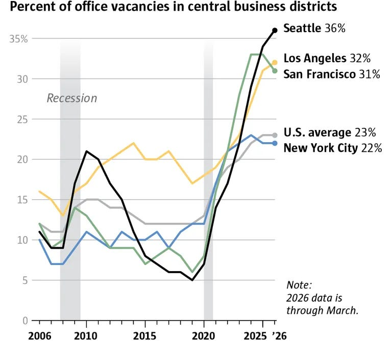
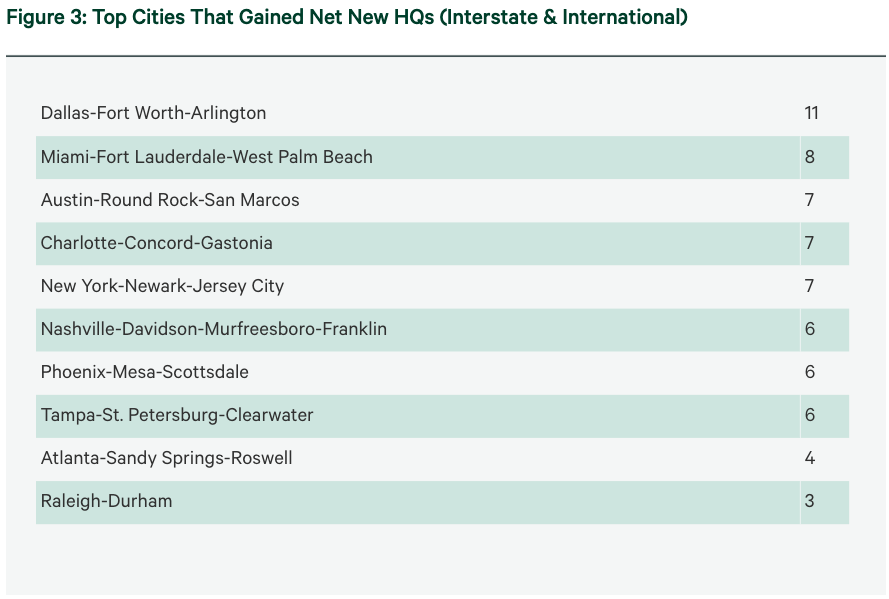

---
authors:
- aitoboxrobot
categories:
- 深度研报
date: '2026-08-04'
hide:
- navigation
tags:
- AI
title: 阅读清单 — 2026年7月11日
---
# 阅读清单 — 2026年7月11日

### 背景与摘要
这份阅读清单汇总了2026年7月11日当周关于建筑、基础设施和工业技术领域的精选新闻。主要内容包括住房趋势的变化（如与父母同住的年轻人增多）、AI热潮带来的半导体行业创纪录利润，以及城市商业房地产所面临的挑战。本清单既关注了宏观的政策与人口流动，也探讨了制造业前沿的最新动态。

  
*Canaletto 的作品“Venice: The Basin of San Marco on Ascension Day”（来源：[伦敦国家美术馆](https://www.nationalgallery.org.uk/paintings/canaletto-venice-the-basin-of-san-marco-on-ascension-day)）。*
> *“Venice: The Basin of San Marco on Ascension Day” by Canaletto (Source: [National Gallery of London](https://www.nationalgallery.org.uk/paintings/canaletto-venice-the-basin-of-san-marco-on-ascension-day)).*

---

## 📌 Summary
欢迎阅读本周精选的新闻和链接汇总，内容主要关注建筑、基础设施和工业技术。亮点包括住房趋势的转变（例如，与父母同住的年轻人数量不断增加）、由 AI 热潮推动的大规模半导体行业里程碑，以及城市商业房地产面临的挑战。
> Welcome to this week's curated roundup of news and links focused on buildings, infrastructure, and industrial technology. Highlights include shifting housing trends (such as rising numbers of young adults living with parents), massive semiconductor industry milestones driven by the AI boom, and urban commercial real estate challenges. 

*注意：完整阅读清单中大约有三分之二的内容受到付费墙保护。请访问[Construction Physics上的原始帖子](https://www.construction-physics.com/p/reading-list-071126)以获取完整访问权限。*
> *Note: Roughly two-thirds of the full reading list is paywalled. Visit the [original post on Construction Physics](https://www.construction-physics.com/p/reading-list-071126) for complete access.*

---

## 🏠 Housekeeping
* **本周无长文：** 我目前正在撰写一篇关于立法可预测性的更详细的文章，应该会在下周发布。
> * **No essay this week:** I’m currently working on a more detailed piece about the predictability of legislation, which should be out next week.
* **书籍动态：** [*The Origins of Efficiency*](https://www.amazon.com/Origins-Efficiency-Brian-Potter/dp/1953953522) 被选为[麦肯锡 2026 年推荐书目](https://www.mckinsey.com/featured-insights/annual-book-recommendations)之一。
> * **Book News:** [*The Origins of Efficiency*](https://www.amazon.com/Origins-Efficiency-Brian-Potter/dp/1953953522) was selected as one of [McKinsey’s 2026 Book Recommendations](https://www.mckinsey.com/featured-insights/annual-book-recommendations).

---

## 🏙️ Housing and Cities

* **联邦住房立法：** 在特朗普总统拒绝行使否决权后，《21 世纪住房之路法案》成为法律。([NPR](https://www.npr.org/2026/07/10/nx-s1-5885027/housing-bill-without-trump-signature))
> * **Federal Housing Legislation:** The *21st Century Road to Housing Act* becomes law after President Trump declines to veto it. ([NPR](https://www.npr.org/2026/07/10/nx-s1-5885027/housing-bill-without-trump-signature))
* **多代同堂的居住方式正在增加：** 根据美联储最近的一项调查，由于高昂的生活成本和不断变化的社会接受度，目前 49% 的 30 岁以下美国成年人与父母同住。([WSJ](https://www.wsj.com/lifestyle/relationships/living-with-parents-finances-0c35530c))
> * **Multigenerational Living on the Rise:** According to a recent Federal Reserve survey, 49% of US adults under 30 now live with a parent due to high living costs and changing social acceptance. ([WSJ](https://www.wsj.com/lifestyle/relationships/living-with-parents-finances-0c35530c))
* **西雅图的空置办公室：** 西雅图目前在美国主要城市中创下了市中心办公空间空置率最高的记录。([Seattle Times](https://www.seattletimes.com/business/local-business/as-downtown-seattle-offices-empty-city-facing-years-of-zombie-towers/))
> * **Seattle’s Empty Offices:** Seattle currently holds the record for the most empty downtown office space of any major US city. ([Seattle Times](https://www.seattletimes.com/business/local-business/as-downtown-seattle-offices-empty-city-facing-years-of-zombie-towers/))

* **台积电对新竹的影响：** 台积电的巨大成功引发了周边城市新竹史无前例的人口和学校承载能力繁荣，这与东亚人口普遍下降的趋势形成鲜明对比。([NYT](https://www.nytimes.com/2026/06/24/business/taiwan-chips-boom.html))
> * **TSMC's Impact on Hsinchu:** The immense success of TSMC has sparked an unprecedented population and school capacity boom in the surrounding city of Hsinchu, defying broader East Asian demographic declines. ([NYT](https://www.nytimes.com/2026/06/24/business/taiwan-chips-boom.html))
* **曼哈顿中城高层建筑恐慌：** 辉瑞公司前总部（东 42 街 219-235 号）的一项大规模翻修工程中，因 21 层的结构柱发生严重弯曲，导致大楼内人员被疏散。该建筑物现已稳定。([CNN](https://www.cnn.com/2026/07/08/us/new-york-city-building-buckling-vis))
> * **Midtown Manhattan High-Rise Scare:** A massive renovation project at the former Pfizer headquarters (219–235 E. 42nd Street) was evacuated after structural columns on the 21st floor severely buckled. The building has since been stabilized. ([CNN](https://www.cnn.com/2026/07/08/us/new-york-city-building-buckling-vis))
* **纽约市公寓竣工量：** 纽约市去年新增 38,682 套公寓单元——这是自 1965 年以来的最高总数——尽管这仍然落后于奥斯汀等蓬勃发展的中型市场。([WSJ](https://www.wsj.com/real-estate/new-york-city-hasnt-built-this-many-apartments-since-1965-9107b316))
> * **NYC Apartment Completions:** New York City added 38,682 apartment units last year—its highest total since 1965—though this still lags behind booming mid-sized markets like Austin. ([WSJ](https://www.wsj.com/real-estate/new-york-city-hasnt-built-this-many-apartments-since-1965-9107b316))
* **总部搬迁：** 世邦魏理仕 (CBRE) 2026 年的报告强调了企业逃离加利福尼亚州并迁往得克萨斯州的持续趋势。([CBRE](https://www.cbre.com/insights/viewpoints/business-insights-the-shifting-landscape-of-headquarters-relocations-2026-update))
> * **Headquarters Relocations:** CBRE's 2026 report highlights the ongoing trend of corporations fleeing California and relocating to Texas. ([CBRE](https://www.cbre.com/insights/viewpoints/business-insights-the-shifting-landscape-of-headquarters-relocations-2026-update))

* **气候移民：** 随着保险和气候风险的持续攀升，美国高洪水风险县在 2024 年中至 2025 年中期间流失了超过 63,000 名国内居民。([Bloomberg](https://www.bloomberg.com/news/articles/2026-06-24/flood-prone-us-counties-lose-residents-as-risk-costs-mount))
> * **Climate Migration:** High-flood-risk US counties lost over 63,000 domestic residents between mid-2024 and mid-2025 as insurance and climate risks continue to mount. ([Bloomberg](https://www.bloomberg.com/news/articles/2026-06-24/flood-prone-us-counties-lose-residents-as-risk-costs-mount))

---

## ⚙️ Manufacturing & Industrial Technology

* **Atomic Semi 更名为“Fab2”：** 由 Sam Zeloof 创立的半导体初创公司正将其业务转移至得克萨斯州，并在内部设计其所有的晶圆厂工具——从光刻机到真空室。([Tom’s Hardware](https://www.tomshardware.com/tech-industry/atomic-semi-rebrands-as-fab2-and-shifts-operations-to-texas))
> * **Atomic Semi Rebrands to “Fab2”:** The semiconductor startup founded by Sam Zeloof is shifting operations to Texas and designing all of its fab tools—from lithography to vacuum chambers—in-house. ([Tom’s Hardware](https://www.tomshardware.com/tech-industry/atomic-semi-rebrands-as-fab2-and-shifts-operations-to-texas))
* **中国有 EUV 光刻机吗？** 《经济学人》调查了围绕 ASML 极紫外光刻机的传闻，ASML 强烈坚称每一台设备都受到严格追踪，并没有任何一台被运往中国。([The Economist](https://www.economist.com/china/2026/07/05/has-china-obtained-the-worlds-most-important-machine))
> * **Does China Have EUV Machines?** *The Economist* investigates rumors surrounding ASML’s extreme ultraviolet machines, with ASML strongly asserting that every single unit is strictly tracked and none have been shipped to China. ([The Economist](https://www.economist.com/china/2026/07/05/has-china-obtained-the-worlds-most-important-machine))
* **三星历史性的芯片利润：** 在 AI 热潮导致内存价格飙升的推动下，三星的芯片部门预计其在 2026 年的收入将超过其整个 40 年历史收入的总和。([Tom’s Hardware](https://www.tomshardware.com/tech-industry/samsungs-chip-division-expects-to-out-earn-its-entire-40-year-history-in-2026))
> * **Samsung’s Historic Chip Profits:** Driven by skyrocketing memory prices from the AI boom, Samsung's chip division expects to out-earn its entire 40-year history combined in 2026. ([Tom’s Hardware](https://www.tomshardware.com/tech-industry/samsungs-chip-division-expects-to-out-earn-its-entire-40-year-history-in-2026))
* **中国的“实践型博士”：** 深入了解中国专注于开发有形产品而非撰写传统学术论文的新研究生项目。([Nature](https://www.nature.com/articles/d41586-026-01242-z))
> * **China's "Practical PhDs":** An inside look at China's new graduate programs focused on developing tangible products rather than writing traditional academic theses. ([Nature](https://www.nature.com/articles/d41586-026-01242-z))
* **寻找更便宜的无人机：** 在向伊朗损失了价值超过 10 亿美元的死神 (Reaper) 无人机之后，美国军方正在积极寻找更便宜的替代品。([Ars Technica](https://arstechnica.com/gadgets/2026/07/us-seeks-cheaper-hunter-killer-drones-after-iran-destroys-1b-worth-of-reapers/))
> * **Seeking Cheaper Drones:** Following the loss of over $1 billion worth of Reaper drones to Iran, the US military is actively searching for cheaper alternatives. ([Ars Technica](https://arstechnica.com/gadgets/2026/07/us-seeks-cheaper-hunter-killer-drones-after-iran-destroys-1b-worth-of-reapers/))

---

🔗 **[在 Construction Physics 上阅读完整且未删减的帖子](https://www.construction-physics.com/p/reading-list-071126)**
> 🔗 **[Read the complete, unabridged post on Construction Physics](https://www.construction-physics.com/p/reading-list-071126)**
