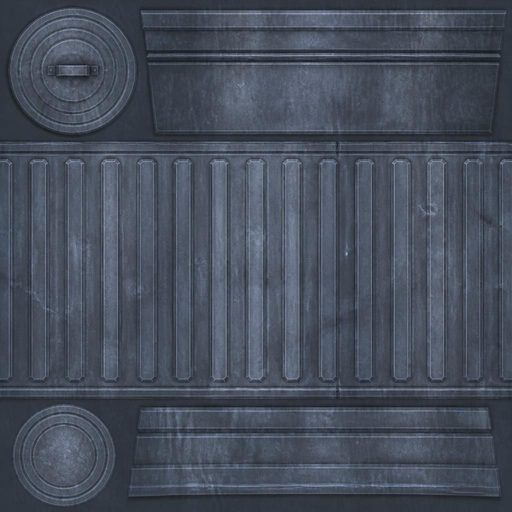
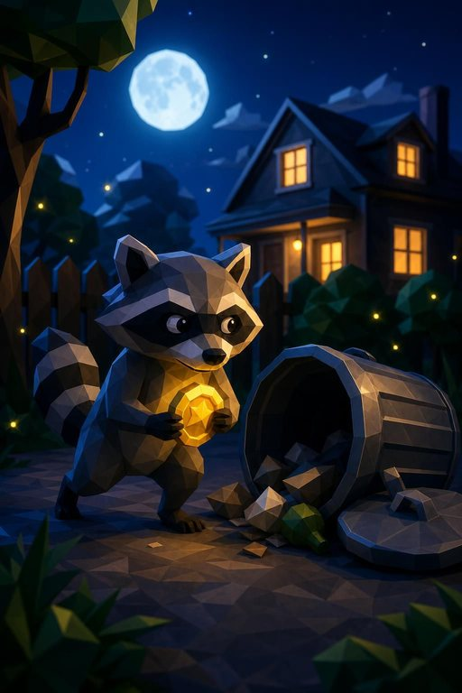
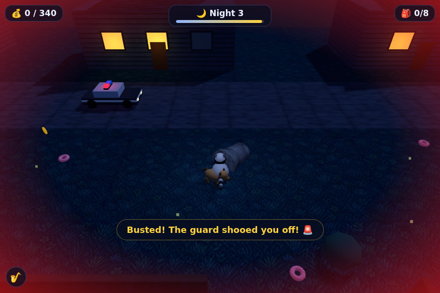

---
authors:
- aitoboxrobot
categories:
- 工具教程
date: 2026-08-06
hide:
- navigation
tags:
- Claude
- Claude Code
- AI 编程
- 3D 游戏开发
- Three.js
title: 使用 Claude Fable 5 一次性成功构建浣熊抢劫 3D 游戏
---
# 使用 Claude Fable 5 一次性成功构建浣熊抢劫 3D 游戏

### 文章背景与核心概要
本文记录了一项利用 AI 智能体完成全自动游戏开发的实验。早在 2022 年，作者曾使用 GPT-3 和 DALL-E 构思了一个名为《浣熊抢劫（Raccoon Heist）》的虚构游戏概念。四年后的 2026 年，作者将原版的 prompt 和概念图输入给运行在 Web 版 Claude Code 中的 **Claude Fable 5**，并附带了 OpenAI API 密钥。在完全零人工干预、零后续设计决策的情况下，Claude 自主完成了 3D 游戏的开发、基于 Playwright 的自动化视觉测试以及 GitHub Pages 的自动部署。尽管最终游戏性尚显重复，但 AI 智能体表现出的惊人开发速度与技术完整度，展现了自主编程智能体在原型设计上的巨大潜力。

---

## 概要

> ## Summary

早在 2022 年，一项有趣的实验结合了 GPT-3 和 DALL-E，构思出了一款名为 *Raccoon Heist*（浣熊抢劫）的虚构游戏概念。四年后，这个概念被完整交给了运行在 Web 版 Claude Code 中的 **Claude Fable 5**，仅凭一条总领性的提示词（Prompt）、两张原始图像以及一个用于纹理生成的 OpenAI API 密钥。在没有人类干预或后续设计决策的情况下，Claude 成功构建、通过 Playwright 进行了测试，并部署了一款功能完备、适配移动端的 3D 浏览器游戏——包含了程序化低多边形（low-poly）资源、动态 WebAudio 爵士背景音乐以及 GitHub Pages 的自动化集成。

> Back in 2022, a playful experiment combined GPT-3 and DALL-E to pitch a fictional game concept called *Raccoon Heist*. Four years later, this concept was handed entirely to **Claude Fable 5** (running in Claude Code for web) with a single overarching prompt, two original images, and an OpenAI API key for texture generation. Without human intervention or further design decisions, Claude successfully built, tested via Playwright, and deployed a fully functional, mobile-friendly 3D browser game—complete with procedural low-poly assets, a dynamic WebAudio jazz soundtrack, and automated GitHub Pages integration.

虽然最终的游戏玩法偏向重复和中规中矩，这表明设计“趣味性”依然是人类独有的技术关卡，但 AI 智能体的速度和技术胜任力为自主原型设计和编程智能体的未来展示了令人惊叹的冰山一角。

> While the resulting gameplay leans toward the repetitive and mediocre, demonstrating that designing *fun* remains a uniquely human hurdle, the speed and technical competence of the AI agent offer a staggering glimpse into the future of autonomous prototyping and coding agents.

---

## 游戏是如何构建的

> ## How It Was Built

该项目源自 2022 年 8 月 5 日的一条推文，展示了一段快速生成的 GPT-3 产品描述与一张轴测图（isometric）风格的 DALL-E 概念图组合。

> The project originated from an August 5, 2022, tweet showcasing a quick GPT-3 product description paired with an isometric DALL-E concept image.

* **GPT-3 提示词：** `"写一份详细的电脑游戏产品描述，讲述一群浣熊进行抢劫的故事。"`
* **DALL-E 提示词：** `"展示一群浣熊进行抢劫的电子游戏截图"`

> * **GPT-3 Prompt:** `"Write a detailed product description of a computer game where a team of raccoons go on heists."`
> * **DALL-E Prompt:** `"Screenshot from a video game where a team of raccoons go on a heist"`

为了测试现代 Agent 工作流，这些早期资产被输入到 Fable 5 中，并辅以严格的“无需干预”提示词，以构建一个完全实现的浏览器游戏。

> To test modern agentic workflows, these legacy assets were fed into Fable 5 with a strict hands-off prompt to construct a fully realized browser game.

### 使用 GitHub Pages 配置 Web 版 Claude Code

> ### Setting Up Claude Code for Web with GitHub Pages

为了在 Claude 独立工作的同时能够方便地测试和预览进度，建立了一套 GitHub Pages 工作流：

> To easily test and preview progress while Claude worked independently, a GitHub Pages workflow was established:

1. 创建一个新的 GitHub 仓库（公开或私有）。
2. 通过 Web 界面或桌面/移动应用启动一个 Claude Code 会话。
3. 指示 Claude 尽快提交一个 `index.html` 文件，以建立专门的工作分支（`claude/3d-raccoon-heist-game-...`）。
4. 在仓库设置中配置 GitHub Pages，使其从该特定分支进行部署。

> 1. Create a new GitHub repository (public or private).
> 2. Start a Claude Code session via the web interface or desktop/mobile app.
> 3. Instruct Claude to commit an `index.html` file as quickly as possible to establish a dedicated working branch (`claude/3d-raccoon-heist-game-...`).
> 4. Configure GitHub Pages in the repository settings to deploy from that specific branch.

在每次自动化 Push 后的 30 秒内，实时更新即可在 `yourname.github.io/your-repo/` 上预览。

> Within 30 seconds of each automated push, live updates became visible at `yourname.github.io/your-repo/`.

### Fable 5 提示词

> ### The Fable 5 Prompt

整个项目是从手机笔记应用发起的，使用了以下单一指令集：

> The entire project was initiated from a mobile notes app using this single instruction set:

> `为浏览器构建这款 3D 游戏。`
> 
> `这个仓库已配置为托管静态文件，因此请确保包含一个加载其他所有内容的 index.html。`
> 
> `确保它对移动设备友好（支持触摸控制，在小屏幕上运行良好）。`
> 
> `你拥有一个 OpenAI API 密钥，可以调用其图像生成模型 API，将其用于 3D 模型的纹理生成。文档见：https://developers.openai.com/api/docs/guides/image-generation - 请使用 gpt-image-2`
> 
> `请独立工作 - 不要让我做出任何后续设计决策。确保游戏具有趣味性、带来少许惊喜、具备良好的浣熊抢劫氛围且视觉效果怡人。`
> 
> `尽可能频繁地提交并推送，以便我预览你的工作 - 从展示标题屏幕的 index.html 开始，然后在此基础上进行构建。`
> 
> `在工作时追加记录到 notes.md 文件中，并将该文件的修改作为每次提交的一部分。`

> > `Build this 3D game, for the browser.`
> > 
> > `This repo is configured to serve static files so make sure there is an index.html that loads everything else.`
> > 
> > `Make sure it is mobile-friendly (touch controls, works well on small screens).`
> > 
> > `You have an OpenAI API key and access to their image generation model APIs, use that for textures to use with your 3D models. Docs here: https://developers.openai.com/api/docs/guides/image-generation - use gpt-image-2`
> > 
> > `Work independently - do not ask me to make any further design decisions. Make sure the game is fun, a little surprising, has good raccoon heist vibes, and is visually pleasing.`
> > 
> > `Commit and push as often as possible so I can preview your work - start with an index.html that presents a title screen, then build from there.`
> > 
> > `Append to a notes.md file as you work, including your changes to that as part of every commit.`

通过授予 OpenAI 密钥的访问权限，Claude 自主使用 `gpt-image-2` 生成了自定义纹理（如带铆钉的金属面板）。

> By granting access to an OpenAI key, Claude autonomously generated custom textures (like riveted metal panels) using `gpt-image-2`.



---

## 审查构建过程

> ## Reviewing the Build Process

Claude 在 `notes.md` 日志中记录了其迭代进展。开发过程中的显著里程碑包括：

> Claude documented its iterative progress in a `notes.md` log. Notable milestones during development included:

* **本地化 Vendor Three.js：** 搭建本地资源，无需依赖外部 CDN。
* **自动化视觉测试：** 使用预安装的 Chromium（通过 Playwright）截屏，并在桌面和移动视口中“目测”检查自己的 UI 布局。
* **生成标题艺术图：** 通过自定义 Python 包装脚本创建极具氛围感的宣传艺术图。

> * **Vendoring Three.js:** Setting up local assets without relying on an external CDN.
> * **Automated Visual Testing:** Using pre-installed Chromium via Playwright to take screenshots and "eyeball" its own UI layouts across desktop and mobile viewports.
> * **Generating Title Art:** Creating atmospheric splash art via custom Python wrapper scripts.

```python
Video game key art, low-poly 3D render style, moody nighttime scene: a cute low-poly raccoon wearing a tiny black burglar mask sneaking on its hind legs carrying a glowing gold coin, next to a tipped-over metal trash can, suburban house with warm glowing windows in the background, deep blue night, full moon, fireflies, cinematic rim lighting, charming heist caper mood. No text, no words, no logos.
```



* **引入复杂游戏机制：** 在后续夜间关卡中添加升级要素（如具备气味追踪功能的看门狗），并配合 Playwright 自动化碰撞与行为测试。

> * **Introducing Complex Mechanics:** Adding escalations like a scent-tracking guard dog on later nights, complete with automated Playwright collision and behavior testing.

```javascript
  // walk near the dog
  await page.evaluate(() => { const d = window.__rh.dog; window.__rh.teleport(d.x + 6, d.z); });
  await page.waitForTimeout(2000);
  info = await page.evaluate(() => JSON.stringify({ dog: window.__rh.dog, state: window.__rh.state, player: window.__rh.debug().player }));
  console.log('after approach:', info);
  await page.waitForTimeout(3000);
  info = await page.evaluate(() => JSON.stringify({ dog: window.__rh.dog, state: window.__rh.state }));
  console.log('after chase:', info);
  await page.screenshot({ path: __dirname + '/shot-dog.png' });
```



---

## 游戏体验究竟如何？

> ## Is the Game Any Good?

作为完全由单一提示词驱动的技术成就，其成果令人惊叹。游戏具备完整的 3D 渲染、手电筒光束效果、移动端触控、渐进式难度关卡以及程序化的 WebAudio 背景音乐。

> As a technical achievement driven entirely by a single prompt, the result is astonishing. The game features full 3D rendering, flashlight cones, mobile touch controls, progressive difficulty levels, and a procedural WebAudio background soundtrack.

然而，从游戏性的角度来看，它暴露出一个明显的局限性：**设计真正有趣的游戏依然是人类独有的特质。** 虽然各项机制运行顺畅，但实际的游戏循环非常重复且缺乏深度。

> However, from a gameplay perspective, it highlights a distinct limitation: **designing genuinely fun games remains a uniquely human trait.** While the mechanics function smoothly, the actual loop is repetitive and lacks depth.

归根结底，像《浣熊抢劫》这样“氛围编程”（vibe coding）出来的游戏可能无法在第一次尝试中就产生商业巨作，但它作为一个低风险、极具娱乐性的沙盒，成功拓展了自主编程智能体的边界。

> Ultimately, "vibe coding" games like *Raccoon Heist* may not yield a commercial masterpiece on the first try, but it serves as a low-risk, highly entertaining sandbox for pushing the boundaries of autonomous coding agents.

---

## 相关链接与资源

> ## Links & Resources

* **试玩游戏：** [Raccoon Heist 在线体验](https://simonw.github.io/raccoon-heist/)
* **源代码：** [GitHub 仓库](https://github.com/simonw/raccoon-heist/)
* **会话转录记录：** [Claude Code 共享会话](https://claude.ai/code/session_01NUBoCfnhGETcCDyEUPS8jp)

> * **Play the game:** [Raccoon Heist Live](https://simonw.github.io/raccoon-heist/)
> * **Source code:** [GitHub Repository](https://github.com/simonw/raccoon-heist/)
> * **Session transcripts:** [Claude Code Shared Session](https://claude.ai/code/session_01NUBoCfnhGETcCDyEUPS8jp)

***

**标签：** `game-design`, `ai`, `prompt-engineering`, `generative-ai`, `llms`, `anthropic`, `claude`, `text-to-image`, `vibe-coding`, `coding-agents`, `claude-mythos-fable`

> **Tags:** `game-design`, `ai`, `prompt-engineering`, `generative-ai`, `llms`, `anthropic`, `claude`, `text-to-image`, `vibe-coding`, `coding-agents`, `claude-mythos-fable`
