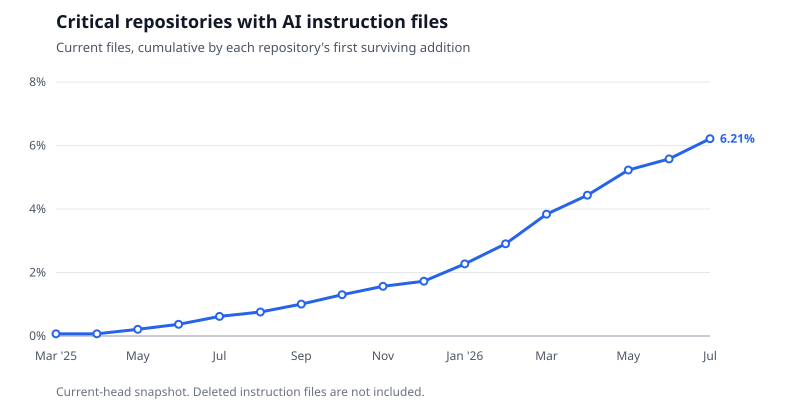

---
authors:
- aitoboxrobot
categories:
- 研究解读
date: 2026-08-06
hide:
- navigation
tags:
- AI开发
- 开源安全
- GitHub
- 代码统计
title: 关键开源包中 AI 披露的过去一年
---
# 关键开源包中 AI 披露的过去一年

### 文章背景与核心概要
本项研究针对 16 个主要软件包注册库中最核心的 5,682 个 GitHub 仓库进行了为期一年（2025年7月至2026年7月）的 Git 提交元数据分析，揭示了开源软件中 AI 辅助与自主 Agent 编码的演变趋势。研究发现，带有显式 AI 标记的非合并提交比例在过去一年中从 0.48% 剧增至 5.32%，总体占比达 2.93%。其中，Claude Code 和 GitHub Copilot 占据了已知 AI 辅助工具的绝大部分市场份额。此外，截至 2026 年 7 月，已有 6.21% 的核心仓库添加了专门用于指导 AI Agent 的规则文件（如 `CLAUDE.md` 或 `AGENTS.md`）。

---

## 执行摘要

> ## Executive Summary

通过对 16 个包注册库中最依赖的 5,682 个 GitHub 仓库的分析，揭示了 2025 年 7 月至 2026 年 7 月期间开源软件中 AI 使用情况的演变。本研究利用 CHAOSS 披露库检测 git 元数据中的四种显式 AI 信号，发现在截至 2026 年 7 月 29 日的一年中，**2.93% 的非合并提交（589,798 个中的 17,279 个）带有显式的 AI 标记**。

> An analysis of 5,682 GitHub repositories behind the most depended-on packages across 16 registries reveals how AI usage in open-source software evolved between July 2025 and July 2026. Using the CHAOSS disclosure library to detect four explicit AI signals in git metadata, the study found that **2.93% of non-merge commits (17,279 of 589,798) carried an explicit AI marker** over the year ending July 29, 2026.

主要要点包括：

> Key takeaways include:

* **增长趋势：** 月度 AI 披露率从 **2025 年 8 月的 0.48% 急剧上升至 2026 年 7 月的 5.32%**。

> * **Growth:** The monthly disclosure rate rose sharply from **0.48% in August 2025 to 5.32% in July 2026**.

* **集中度：** 排名前 100 的仓库占所有检测结果的 84.9%，而中位数活跃仓库记录到的 AI 信号为零。

> * **Concentration:** The top 100 repositories accounted for 84.9% of all findings, and the median active repository recorded zero signals.

* **工具主导地位：** Claude Code 和 GitHub Copilot 占了声明的 AI 辅助和自主 Agent 提交的绝大部分。

> * **Tool Dominance:** Claude Code and GitHub Copilot accounted for the vast majority of declared assistance and autonomous agent commits.

* **Agent 指令文件：** 到 2026 年 7 月，6.21% 的仓库包含了旨在指导编码 Agent 的显式指令文件（如 `CLAUDE.md` 或 `AGENTS.md`）。

> * **Agent Instructions:** By July 2026, 6.21% of repositories contained explicit instruction files (such as `CLAUDE.md` or `AGENTS.md`) designed to guide coding agents.

---

## 样本选择与检测器选择对比

> ## Sample Selection versus Detector Choice

RedMonk 早些时候在 2026 年上半年对 15 个大型项目进行了研究，使用了两种形式的已声明 AI 参与（自主 Agent 作者或已知的 AI 共同作者），发现比例低于 1%。

> Earlier work by RedMonk looked at 15 large projects during the first half of 2026 using two forms of declared AI involvement (autonomous agent authors or known AI co-authors), finding a rate under 1%.

将此范围扩展到 `packages.ecosyste.ms` 的关键包集合——并检查四种不同的披露信号——在相同的六个月时间窗口内揭示了 4.13% 的比例。

> Expanding this scope to the `packages.ecosyste.ms` critical package set—and checking for four distinct disclosure signals—revealed a 4.13% rate for the same six-month window.

| 样本与信号 | 提交总数 | 标记数 | 占比 |
| :--- | :--- | :--- | :--- |
| **RedMonk 15**，Agent 作者或已知 AI 共同作者 | 17,323 | 94 | 0.54% |
| **RedMonk 15**，所有验证过的披露信号 | 17,323 | 182 | 1.05% |
| **关键 GitHub 集合**，Agent 作者或已知 AI 共同作者 | 308,354 | 11,002 | 3.57% |
| **关键 GitHub 集合**，所有验证过的披露信号 | 308,354 | 12,720 | 4.13% |

> | Sample and Signals | Commits | Marked | Share |
> | :--- | :--- | :--- | :--- |
> | **RedMonk 15**, agent author or known AI co-author | 17,323 | 94 | 0.54% |
> | **RedMonk 15**, all validated disclosure signals | 17,323 | 182 | 1.05% |
> | **Critical GitHub set**, agent author or known AI co-author | 308,354 | 11,002 | 3.57% |
> | **Critical GitHub set**, all validated disclosure signals | 308,354 | 12,720 | 4.13% |

增加额外的信号类型使比例提高了大约半个百分点，而改变样本则使比例移动了三个百分点。虽然 RedMonk 的样本偏向于大型 C 语言项目，但关键包集合包含了处于注册表依赖图顶部的较小、较新且由公司运行的仓库。

> Adding extra signal types moved the rate by roughly half a percentage point, whereas changing the sample shifted it by three points. While RedMonk’s sample was biased toward large C projects, the critical package set includes smaller, newer, company-run repositories positioned at the top of registry dependency graphs.

---

## 统计对象与范围

> ## What Was Counted

关键快照评估了 8,605 个软件包。在处理更名、限制范围为 GitHub 并过滤掉格式错误的 URL 之后，剩余 **5,707 个候选仓库**，其中 **5,682 个成功克隆**。在这之中，**3,533 个仓库**在为期一年的观察窗口内至少有一个非合并提交。

> The critical snapshot evaluated 8,605 packages. After resolving renames, restricting the scope to GitHub, and filtering out malformed URLs, **5,707 candidates** remained, of which **5,682 cloned successfully**. Of those, **3,533 had at least one non-merge commit** during the year-long observation window.

每个非合并提交都经过以下评估：
* 知名 AI Agent 作为作者或提交者。
* `Co-Authored-By` 结尾标记中列出的知名 AI 身份。
* 命名 AI 工具或模型的 `Assisted-By` 结尾标记。
* 披露库支持的工具特定属性格式。

> Every non-merge commit was evaluated for:
> * A known AI agent acting as author or committer.
> * A known AI identity listed in a `Co-Authored-By` trailer.
> * An `Assisted-By` trailer naming an AI tool or model.
> * Tool-specific attribution formats supported by the disclosure library.

*注：排除合并提交是为了确保采用 squash、rebase 或 merge 策略的项目得到同等对待。对工具名称的普通散文提及将被忽略，且所有值均经过验证以过滤掉人类贡献者或通用工具。*

> *Note: Merges were excluded to ensure projects that squash, rebase, or merge are counted equally. Ordinary prose mentions of tool names were ignored, and values were validated to filter out human contributors or generic tooling.*

---

## 全年演变趋势

> ## Trends Over the Year

月度披露率在 2 月份突破 3%，在 3 月份突破 5%，并在 7 月前稳定在 4.58% 至 5.32% 之间。如果按仓库而非提交来衡量，在 **2025 年 8 月有 2.4% 的活跃仓库**出现了 AI 信号，到了 **2026 年 7 月这一数字升至 15.4%**。

> The monthly disclosure rate surpassed 3% in February and 5% in March, stabilizing between 4.58% and 5.32% through July. Measured by repositories rather than commits, a signal appeared in **2.4% of active repositories in August 2025**, climbing to **15.4% by July 2026**.

在总共 17,279 次检测结果中：
* **4,625** 次仅带有自主 Agent 身份。
* **12,628** 次仅带有已声明的 AI 辅助信号。
* **26** 次两者同时具备。

> Of the 17,279 total findings:
> * **4,625** carried only an autonomous-agent identity.
> * **12,628** carried only a declared-assistance signal.
> * **26** carried both.

### 声明工具的细分

> ### Breakdown of Declared Tools

对 231 个不同的已声明工具字符串进行分组，展示了客户端家族和模型的分布情况：

> Grouping the 231 distinct declared tool strings reveals the distribution of client families and models:

| 声明工具 | 出现次数 | 占比 |
| :--- | :--- | :--- |
| **Claude Code** | 9,974 | 57.35% |
| **GitHub Copilot** | 4,857 | 27.93% |
| **Cursor** | 773 | 4.44% |
| **Codex** | 236 | 1.36% |
| **OpenCode** | 69 | 0.40% |
| **Claude 或 Anthropic** (仅模型) | 1,135 | 6.53% |
| **OpenAI 或 GPT** (仅模型) | 118 | 0.68% |
| **Gemini 或 Google** (仅模型) | 70 | 0.40% |

> | Declared As | Occurrences | Share |
> | :--- | :--- | :--- |
> | **Claude Code** | 9,974 | 57.35% |
> | **GitHub Copilot** | 4,857 | 27.93% |
> | **Cursor** | 773 | 4.44% |
> | **Codex** | 236 | 1.36% |
> | **OpenCode** | 69 | 0.40% |
> | **Claude or Anthropic** (model only) | 1,135 | 6.53% |
> | **OpenAI or GPT** (model only) | 118 | 0.68% |
> | **Gemini or Google** (model only) | 70 | 0.40% |

在 2026 年 2 月和 3 月观察到的急剧增加，在很大程度上归因于 Anthropic 发布了 Claude Opus 4.6 和 Sonnet 4.6，这与 `Co-Authored-By` 标记的激增相吻合。

> The sharp increase observed in February and March 2026 is largely attributed to the release of Anthropic’s Claude Opus 4.6 and Sonnet 4.6, coinciding with a surge in `Co-Authored-By` trailers.

---

## 按生态系统划分的研究发现

> ## Findings by Ecosystem

在跟踪的 16 个生态系统中，有 9 个在观察窗口期间记录了至少 30,000 次提交：

> Nine of the sixteen tracked ecosystems recorded at least 30,000 commits during the observation window:

| 软件包生态系统 | 提交总数 | 验证占比 | 仓库数量 | 包含指令文件的仓库 |
| :--- | :--- | :--- | :--- | :--- |
| **NuGet** | 41,523 | 6.84% | 74 | 40.54% |
| **npm** | 87,357 | 3.72% | 1,578 | 3.11% |
| **RubyGems** | 40,889 | 3.59% | 670 | 6.12% |
| **Conda** | 144,227 | 3.31% | 264 | 12.12% |
| **Go** | 34,117 | 3.07% | 545 | 5.87% |
| **PyPI** | 124,641 | 2.57% | 451 | 12.42% |
| **Cargo** | 30,620 | 1.96% | 570 | 2.46% |
| **Packagist** | 37,267 | 1.73% | 547 | 10.24% |
| **Maven** | 100,539 | 1.60% | 273 | 16.12% |

> | Package Ecosystem | Commits | Validated Share | Repositories | With Instructions |
> | :--- | :--- | :--- | :--- | :--- |
> | **NuGet** | 41,523 | 6.84% | 74 | 40.54% |
> | **npm** | 87,357 | 3.72% | 1,578 | 3.11% |
> | **RubyGems** | 40,889 | 3.59% | 670 | 6.12% |
> | **Conda** | 144,227 | 3.31% | 264 | 12.12% |
> | **Go** | 34,117 | 3.07% | 545 | 5.87% |
> | **PyPI** | 124,641 | 2.57% | 451 | 12.42% |
> | **Cargo** | 30,620 | 1.96% | 570 | 2.46% |
> | **Packagist** | 37,267 | 1.73% | 547 | 10.24% |
> | **Maven** | 100,539 | 1.60% | 273 | 16.12% |

NuGet 较高的占比（6.84%）很大程度上受到微软内部部署的影响：属于 `dotnet`、`azure` 和 `microsoft` 等所有者的仓库占了 NuGet 所有发现的 95.6%，且主要由自主 Agent 身份驱动。如果排除这些组织所有者，NuGet 的比例将下降至 0.88%。

> NuGet’s higher share (6.84%) is heavily influenced by Microsoft deployments: repositories under owners like `dotnet`, `azure`, and `microsoft` accounted for 95.6% of NuGet's findings, driven largely by autonomous-agent identities. Excluding these organizational owners drops NuGet's rate to 0.88%.

---

## AI 指令文件分析

> ## AI Instruction Files

对默认分支 Head 的辅助扫描检查了已提交的编码 Agent 指令文件（`AGENTS.md`、`CLAUDE.md`、`GEMINI.md` 以及特定的工具规则路径）。**353 个仓库（6.21%）** 包含至少一个指令文件，总共包含 1,091 个文件。

> An auxiliary scan of default-branch heads checked for committed coding agent instructions (`AGENTS.md`, `CLAUDE.md`, `GEMINI.md`, and specific tool rule paths). **353 repositories (6.21%)** contained at least one instruction file, housing 1,091 files in total.

| 指令文件类型 | 仓库数量 | 占扫描仓库比例 | 文件总数 |
| :--- | :--- | :--- | :--- |
| **`AGENTS.md`** | 240 | 4.22% | 571 |
| **`CLAUDE.md`** | 204 | 3.59% | 340 |
| **GitHub Copilot 指令** | 84 | 1.48% | 154 |
| **Cursor 规则** | 11 | 0.19% | 14 |
| **`GEMINI.md`** | 8 | 0.14% | 8 |
| **Cline 规则** | 1 | 0.02% | 4 |
| **Windsurf 规则** | 0 | 0% | 0 |
| **Continue 规则** | 0 | 0% | 0 |

> | Instruction Type | Repositories | Share of Scanned Repositories | Files |
> | :--- | :--- | :--- | :--- |
> | **`AGENTS.md`** | 240 | 4.22% | 571 |
> | **`CLAUDE.md`** | 204 | 3.59% | 340 |
> | **GitHub Copilot instructions** | 84 | 1.48% | 154 |
> | **Cursor rules** | 11 | 0.19% | 14 |
> | **`GEMINI.md`** | 8 | 0.14% | 8 |
> | **Cline rules** | 1 | 0.02% | 4 |
> | **Windsurf rules** | 0 | 0% | 0 |
> | **Continue rules** | 0 | 0% | 0 |

在包含指令文件的仓库中，有 228 个在一年中同时也记录到了被披露的 AI 提交，这表明建立 Agent 规则指引与登记 AI 辅助提交之间存在非常紧密的时间相关性。

> Of the repositories featuring instruction files, 228 also recorded a disclosed AI commit during the year, showing a very close temporal correlation between setting up agent guidelines and registering AI-assisted commits.

---

## 数据与资源

> ## Data and Resources

源代码、扫描器和报告可通过 [andrew/critical-ai-scan](https://github.com/andrew/critical-ai-scan) 获取：
* **[Summary JSON](https://github.com/andrew/critical-ai-scan/blob/main/data/critical-github-summary.json)：** 涵盖生态系统、信号、工具和主要仓库的综合指标。
* **[Repository CSV](https://github.com/andrew/critical-ai-scan/blob/main/data/critical-github-repositories.csv)：** 粒度化、按仓库区分的扫描结果。
* **[Instruction-File Report](https://github.com/andrew/critical-ai-scan/blob/main/data/critical-github-instructions.json)：** 匹配的 AI 指令路径及其首次提交时间戳的完整清单。

> The source code, scanner, and reports are available via [andrew/critical-ai-scan](https://github.com/andrew/critical-ai-scan):
> * **[Summary JSON](https://github.com/andrew/critical-ai-scan/blob/main/data/critical-github-summary.json):** Comprehensive metrics across ecosystems, signals, tools, and leading repositories.
> * **[Repository CSV](https://github.com/andrew/critical-ai-scan/blob/main/data/critical-github-repositories.csv):** Granular, per-repository scan results.
> * **[Instruction-File Report](https://github.com/andrew/critical-ai-scan/blob/main/data/critical-github-instructions.json):** Complete inventory of matched AI instruction paths and their initial commit timestamps.
