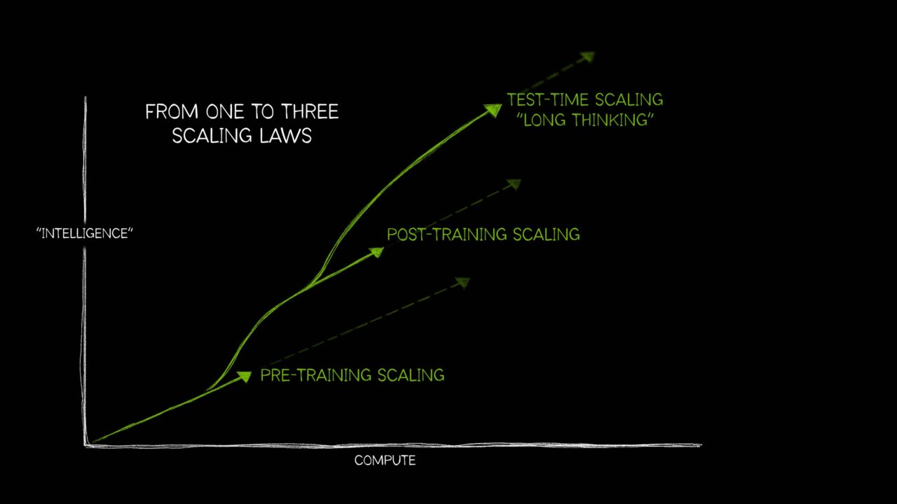
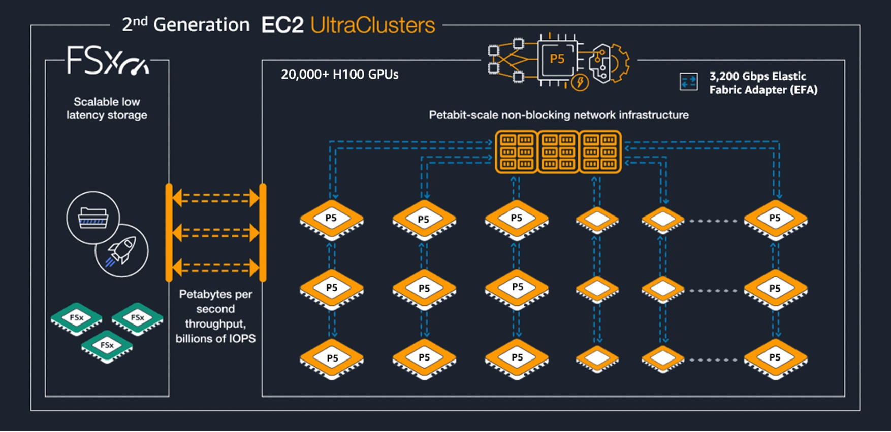
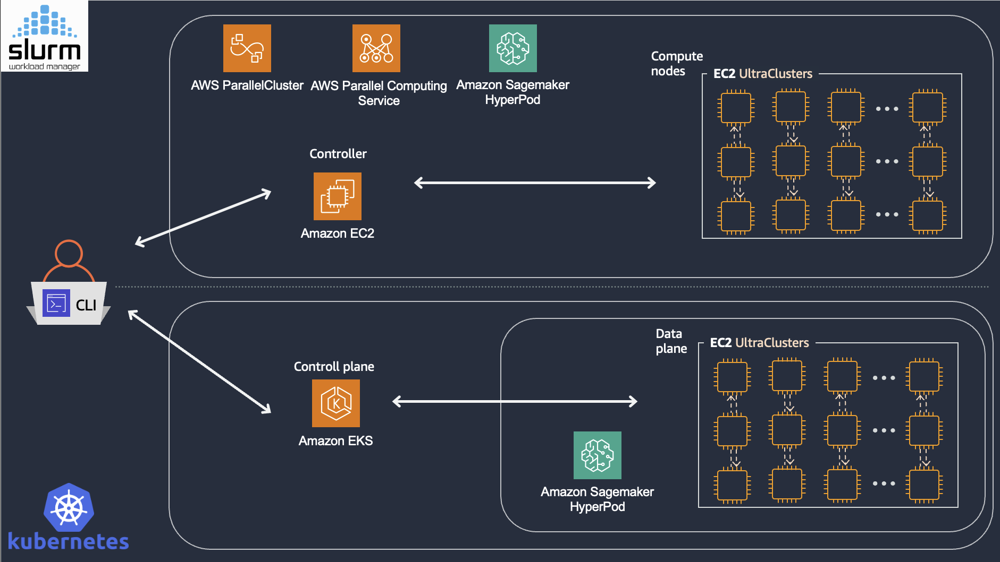
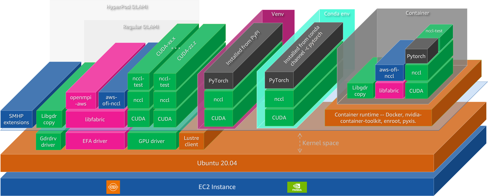
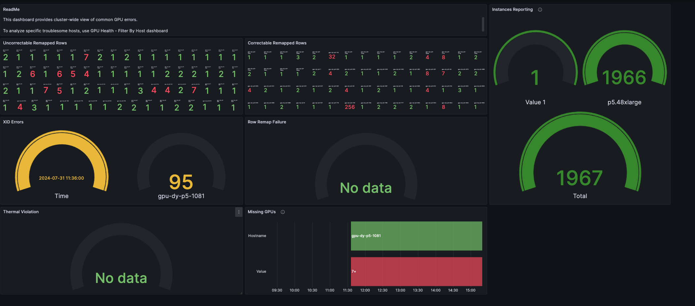

---
authors:
- aitoboxrobot
categories:
- 工具教程
date: 2026-08-07
hide:
- navigation
tags:
- AWS
- 基础模型
- 机器学习
- 分布式训练
- 高性能计算
title: AWS 上的基础模型训练与推理构建模块
---
### 文章背景与核心概要
随着基础模型的不断演进，算力扩展已不再局限于单一的预训练规模定律（Scaling Laws）。现代模型的性能高度依赖于三大互补机制：**预训练（Pre-training）**、**后训练（Post-training，如 SFT 和基于强化学习的方法）**以及**推理时计算（Test-time compute，如搜索、验证和多样本策略）**。

尽管范式有所转变，但对基础设施的要求依然保持统一：紧密耦合的加速器计算、高带宽/低提早的（Low-latency）网络以及可扩展的分布式存储后端。本文深入探讨了在 AWS 上高效扩展基础模型训练和推理所需的开源软件（OSS）生态系统与基础设施构建模块。

---

## 摘要 (Executive Summary)

As foundation models evolve, scaling is no longer confined to a single pre-training curve. Performance now heavily relies on three complementary regimes: **pre-training**, **post-training** (e.g., SFT and RL-based methods), and **test-time compute** (e.g., search, verification, and multi-sample strategies). 

Despite these shifting paradigms, the infrastructure requirements remain unified: tightly coupled accelerator compute, high-bandwidth/low-latency networks, and scalable distributed storage backends. This article explores the open-source software (OSS) ecosystem and AWS infrastructure building blocks required to scale foundation model training and inference efficiently.

> 随着基础模型的演进，规模扩展已不再局限于单一的预训练曲线。目前的性能高度依赖于三种互补机制：**预训练**、**后训练**（例如 SFT 和基于强化学习的方法）以及**推理时计算**（例如搜索、验证和多样本策略）。
> 
> 尽管这些范式在不断转变，但基础设施的需求依然统一：紧密耦合的加速器计算、高带宽/低延迟网络以及可扩展的分布式存储后端。本文探讨了高效扩展基础模型训练和推理所需的开源软件（OSS）生态系统与 AWS 基础设施构建模块。

---

## 引言：AI 规模扩展格局的变迁 (Introduction: The Changing Landscape of AI Scaling)

Historically, scaling foundation models meant increasing dataset size, model parameters, and training compute, adhering to predictable power-law trends ([Kaplan et al., 2020](https://arxiv.org/abs/2001.08361)). However, the modern frontier spans three distinct scaling laws:

[](https://blogs.nvidia.com/blog/ai-scaling-laws/)

> **Figure:** Adapted from ["AI's Three Scaling Laws, Explained"](https://blogs.nvidia.com/blog/ai-scaling-laws/) (NVIDIA Blog).

> 从历史上看，扩展基础模型意味着增加数据集规模、模型参数和训练算力，并遵循可预测的幂律趋势（[Kaplan et al., 2020](https://arxiv.org/abs/2001.08361)）。然而，现代的前沿领域涵盖了三种不同的规模定律：
> 
> [](https://blogs.nvidia.com/blog/ai-scaling-laws/)
> 
> > **图示：** 改编自[《AI 的三大规模定律解析》](https://blogs.nvidia.com/blog/ai-scaling-laws/)（NVIDIA 博客）。

To manage this complex lifecycle, modern pipelines rely on an open-source software (OSS) stack running atop robust cloud infrastructure:
- **Cluster Resource Management:** Slurm, Kubernetes
- **Model Development & Training:** PyTorch, JAX
- **Observability:** Prometheus, Grafana

```
+-------------------------------------------------------------+
|                     Observability Stack                     |
|                (Prometheus / Grafana / DCGM)                |
+-------------------------------------------------------------+
|                  ML Frameworks & Runtimes                   |
|              (PyTorch, JAX, CUDA, Triton, NCCL)             |
+-------------------------------------------------------------+
|                 Resource Orchestration Layer                |
|                    (Slurm / Kubernetes)                     |
+-------------------------------------------------------------+
|                     Hardware Infrastructure                 |
|             (EC2 Accelerated Instances, EFA, FSx)           |
+-------------------------------------------------------------+
```
*Figure 1: The layered architecture of open-source software stacks for foundation model training and inference*

> 为了管理这一复杂的生命周期，现代流水线依赖于运行在强大云基础设施之上的开源软件（OSS）栈：
> - **集群资源管理：** Slurm、Kubernetes
> - **模型开发与训练：** PyTorch、JAX
> - **可观测性：** Prometheus、Grafana
> 
> ```
> +-------------------------------------------------------------+
> |                     Observability Stack                     |
> |                (Prometheus / Grafana / DCGM)                |
+-------------------------------------------------------------+
|                  ML Frameworks & Runtimes                   |
|              (PyTorch, JAX, CUDA, Triton, NCCL)             |
+-------------------------------------------------------------+
|                 Resource Orchestration Layer                |
|                    (Slurm / Kubernetes)                     |
+-------------------------------------------------------------+
|                     Hardware Infrastructure                 |
|             (EC2 Accelerated Instances, EFA, FSx)           |
+-------------------------------------------------------------+
```
> *图 1：基础模型训练与推理的开源软件栈分层架构*

---

## AWS 构建模块 (The AWS Building Blocks)

### 1. 基础设施：计算、网络与存储 (1. Infrastructure: Compute, Network, and Storage)

#### 加速计算 (Accelerated Compute)
AWS offers a diverse range of GPU-powered instances optimized for varying workload scales, utilizing instance families such as **P5**, **P5e/P5en**, and **P6**. 

| GPU (Representative Variant) | BF16/FP16 Tensor Peak (Dense) | FP8 Tensor Peak (Dense) | FP4 Tensor Peak (Dense) | HBM Capacity | HBM Bandwidth |
| :--- | :--- | :--- | :--- | :--- | :--- |
| **H100 (SXM)** | 0.9895 PFLOPS | 1.979 PFLOPS | — | 80 GB HBM3 | 3.35 TB/s |
| **H200 (SXM)** | 0.9895 PFLOPS | 1.979 PFLOPS | — | 141 GB HBM3e | 4.8 TB/s |
| **B200 (HGX, per GPU)** | 2.25 PFLOPS | 4.5 PFLOPS | 9 PFLOPS | 180 GB HBM3e | 8 TB/s |
| **B300 (HGX, per GPU)** | 2.25 PFLOPS | 4.5 PFLOPS | 13.5 PFLOPS | 288 GB HBM3e | 8 TB/s |

> AWS 提供多样化的 GPU 驱动实例，针对不同的工作负载规模进行了优化，主要使用 **P5**、**P5e/P5en** 和 **P6** 等实例系列。
> 
> | GPU (代表性型号) | BF16/FP16 张量峰值 (稠密) | FP8 张量峰值 (稠密) | FP4 张量峰值 (稠密) | HBM 容量 | HBM 带宽 |
> | :--- | :--- | :--- | :--- | :--- | :--- |
> | **H100 (SXM)** | 0.9895 PFLOPS | 1.979 PFLOPS | — | 80 GB HBM3 | 3.35 TB/s |
> | **H200 (SXM)** | 0.9895 PFLOPS | 1.979 PFLOPS | — | 141 GB HBM3e | 4.8 TB/s |
> | **B200 (HGX, 单 GPU)** | 2.25 PFLOPS | 4.5 PFLOPS | 9 PFLOPS | 180 GB HBM3e | 8 TB/s |
> | **B300 (HGX, 单 GPU)** | 2.25 PFLOPS | 4.5 PFLOPS | 13.5 PFLOPS | 288 GB HBM3e | 8 TB/s |

#### 网络与互连 (Networking and Interconnects)
Scaling performance is frequently bounded by communication rather than pure compute. AWS utilizes a dual-regime communication architecture:
- **Internal Scale-Up (NVLink/NVSwitch):** High-speed, low-latency GPU-to-GPU intra-node communication.
- **External Scale-Out (EFA):** OS-bypass Remote Direct Memory Access (RDMA) via the Scalable Reliable Datagram (SRD) protocol, powering massive [Amazon EC2 UltraClusters](https://aws.amazon.com/ec2/ultraclusters/).

| Instance Type | GPU | GPUs | GPU Memory | NVLink | NVLink BW (Aggregate) | EFA | EFA BW (Aggregate) |
| :--- | :--- | :--- | :--- | :--- | :--- | :--- | :--- |
| **p5.4xlarge** | H100 | 1 | 80 GB HBM3 | — | — | v2 | 12.5 GB/s |
| **p5.48xlarge** | H100 | 8 | 640 GB HBM3 | 4th | 7.2 TB/s | v2 | 400 GB/s |
| **p5e.48xlarge** | H200 | 8 | 1,128 GB HBM3e | 4th | 7.2 TB/s | v2 | 400 GB/s |
| **p5en.48xlarge** | H200 | 8 | 1,128 GB HBM3e | 4th | 7.2 TB/s | v3 | 400 GB/s |
| **p6-b200.48xlarge** | B200 | 8 | 1,440 GB HBM3e | 5th | 14.4 TB/s | v4 | 400 GB/s |
| **p6-b300.48xlarge** | B300 | 8 | 2,100 GB HBM3e | 5th | 14.4 TB/s | v4 | 800 GB/s |

> 扩展性能往往受限于通信，而非纯粹的计算能力。AWS 采用双重通信架构：
> - **内部纵向扩展 (Internal Scale-Up, NVLink/NVSwitch)：** 高速、低延迟的节点内 GPU 到 GPU 通信。
> - **外部横向扩展 (External Scale-Out, EFA)：** 通过可扩展可靠数据报（SRD）协议实现绕过操作系统的远程直接内存访问（RDMA），为庞大的 [Amazon EC2 UltraClusters](https://aws.amazon.com/ec2/ultraclusters/) 提供强劲动力。
> 
> | 实例类型 | GPU | GPU 数量 | GPU 内存 | NVLink | NVLink 总带宽 | EFA | EFA 总带宽 |
> | :--- | :--- | :--- | :--- | :--- | :--- | :--- | :--- |
> | **p5.4xlarge** | H100 | 1 | 80 GB HBM3 | — | — | v2 | 12.5 GB/s |
> | **p5.48xlarge** | H100 | 8 | 640 GB HBM3 | 第 4 代 | 7.2 TB/s | v2 | 400 GB/s |
> | **p5e.48xlarge** | H200 | 8 | 1,128 GB HBM3e | 第 4 代 | 7.2 TB/s | v2 | 400 GB/s |
> | **p5en.48xlarge** | H200 | 8 | 1,128 GB HBM3e | 第 4 代 | 7.2 TB/s | v3 | 400 GB/s |
> | **p6-b200.48xlarge** | B200 | 8 | 1,440 GB HBM3e | 第 5 代 | 14.4 TB/s | v4 | 400 GB/s |
> | **p6-b300.48xlarge** | B300 | 8 | 2,100 GB HBM3e | 第 5 代 | 14.4 TB/s | v4 | 800 GB/s |

#### 超级集群与超级服务器 (UltraClusters and UltraServers)
[](https://aws.amazon.com/ec2/ultraclusters/)  
*Figure: 2nd-generation Amazon EC2 UltraClusters (example P5 UltraCluster).*

> [](https://aws.amazon.com/ec2/ultraclusters/)  
> *图示：第二代 Amazon EC2 UltraClusters（P5 UltraCluster 示例）。*

For workloads requiring massive NVLink domains (e.g., Mixture-of-Experts with heavy all-to-all communication), **Amazon EC2 UltraServers** (such as the `p6e-gb200` series built on NVIDIA GB200 NVL72) extend the NVLink fabric across multiple component instances via dedicated interconnects:

| UltraServer | Component Instance Type | GPUs (NVLink Domain) | HBM3e (Aggregate) | EFA | EFA BW |
| :--- | :--- | :--- | :--- | :--- | :--- |
| **u-p6e-gb200x36** | `p6e-gb200.36xlarge` | 36 | 6.7 TB | v4 | 1,800 GB/s |
| **u-p6e-gb200x72** | `p6e-gb200.36xlarge` | 72 | 13.4 TB | v4 | 3,600 GB/s |

> 对于需要庞大 NVLink 域的工作负载（例如具有大量 all-to-all 通信的专家混合模型 MoE），**Amazon EC2 UltraServers**（例如基于 NVIDIA GB200 NVL72 构建的 `p6e-gb200` 系列）通过专用互连将 NVLink 结构扩展到多个组件实例：
> 
> | 超级服务器 (UltraServer) | 组件实例类型 | GPU 数量 (NVLink 域) | HBM3e 总容量 | EFA | EFA 带宽 |
> | :--- | :--- | :--- | :--- | :--- | :--- |
> | **u-p6e-gb200x36** | `p6e-gb200.36xlarge` | 36 | 6.7 TB | v4 | 1,800 GB/s |
> | **u-p6e-gb200x72** | `p6e-gb200.36xlarge` | 72 | 13.4 TB | v4 | 3,600 GB/s |

#### 存储层次结构 (Storage Hierarchy)
To satisfy the I/O demands of multi-terabyte checkpoints and streaming corpora, AWS employs a tiered strategy:
1. **Local NVMe SSD:** Ephemeral instance store providing 30.72 TB raw capacity.
2. **FSx for Lustre:** Fully managed POSIX-compliant parallel file system for shared, high-throughput access.
3. **Amazon S3:** Durable, long-term object storage connected via Data Repository Associations.

> 为了满足多太字节（Multi-terabyte）检查点和流式语料库的 I/O 需求，AWS 采用了分层策略：
> 1. **本地 NVMe SSD：** 提供 30.72 TB 原始容量的临时实例存储。
> 2. **FSx for Lustre：** 完全托管的、兼容 POSIX 的并行文件系统，用于共享的高吞吐量访问。
> 3. **Amazon S3：** 通过数据存储库关联（Data Repository Associations）连接的持久化长期对象存储。

---

### 2. 资源编排：Slurm 与 Kubernetes (2. Resource Orchestration: Slurm and Kubernetes)

[](https://slurm.schedmd.com/)  
*Figure 2: High-level architecture of Slurm-based and Kubernetes-based resource orchestration on AWS*

> [](https://slurm.schedmd.com/)  
> *图 2：AWS 上基于 Slurm 和 Kubernetes 的资源编排高层架构*

- **Slurm:** The standard workload manager for HPC. It excels at job-level atomicity (co-scheduling hundreds of nodes simultaneously), backfill scheduling, topology-aware placement, and GPU allocation via GRES. Available via AWS ParallelCluster, AWS Parallel Computing Service (PCS), and Amazon SageMaker HyperPod (Slurm mode).
- **Kubernetes:** An API-driven approach ideal for deployment, extended via tools like **Kueue** and **Volcano** to support batch queue semantics, gang scheduling, and preemption. **Amazon SageMaker HyperPod (EKS mode)** adds advanced training capabilities like task governance, checkpointless training (peer-to-peer state replication over EFA), and elastic training.

> - **Slurm：** HPC 的标准工作负载管理器。它擅长作业级原子性（同时协同调度数百个节点）、回填调度、拓扑感知放置以及通过 GRES 进行 GPU 分配。可通过 AWS ParallelCluster、AWS Parallel Computing Service (PCS) 和 Amazon SageMaker HyperPod（Slurm 模式）使用。
> - **Kubernetes：** 一种非常适合部署的 API 驱动方法，通过 **Kueue** 和 **Volcano** 等工具进行扩展，以支持批处理队列语义、帮派调度（gang scheduling）和抢占。**Amazon SageMaker HyperPod（EKS 模式）** 增加了高级训练功能，如任务治理、无检查点训练（通过 EFA 进行点对点状态复制）和弹性训练。

---

### 3. 机器学习软件栈 (3. ML Software Stack)

[](https://pytorch.org/)  
*Figure 3: The ML software stack for distributed training and inference on EC2 instances*

> [](https://pytorch.org/)  
> *图 3：EC2 实例上用于分布式训练和推理的 ML 软件栈*

The runtime stack is structured across five critical layers:
1. **Hardware Enablement:** Linux kernel drivers including NVIDIA drivers, GDRCopy (`gdrdrv`), the EFA driver, and Lustre client drivers.
2. **Accelerator Runtime & Libraries:** CUDA Toolkit, Triton, CUTLASS, and custom fused kernels (e.g., FlashAttention) that minimize HBM movement.
3. **Communication Substrate:** NVIDIA Collective Communications Library (**NCCL**) paired with `aws-ofi-nccl` for EFA optimization, plus tools like **NIXL** for disaggregated inference data-transfer.
4. **ML Frameworks:** Primarily **PyTorch** (`torch.distributed`, DDP, FSDP2) and JAX.
5. **Distributed Frameworks:** 
   - *Training:* Hugging Face Accelerate/Transformers, NVIDIA Megatron Core / NeMo Framework, and **veRL** for RLHF/GRPO workflows.
   - *Inference:* **vLLM** (PagedAttention) and **SGLang** (RadixAttention, prefix caching).

> 运行时软件栈划分为五个关键层：
> 1. **硬件赋能层 (Hardware Enablement)：** Linux 内核驱动程序，包括 NVIDIA 驱动程序、GDRCopy (`gdrdrv`)、EFA 驱动程序和 Lustre 客户端驱动程序。
> 2. **加速器运行时与库 (Accelerator Runtime & Libraries)：** CUDA Toolkit、Triton、CUTLASS 以及可最大程度减少 HBM 数据移动的自定义融合内核（例如 FlashAttention）。
> 3. **通信基础设施 (Communication Substrate)：** NVIDIA 集合通信库 (**NCCL**) 搭配用于 EFA 优化的 `aws-ofi-nccl`，以及用于分离开源推理数据传输的 **NIXL** 等工具。
> 4. **机器学习框架 (ML Frameworks)：** 主要是 **PyTorch**（`torch.distributed`、DDP、FSDP2）和 JAX。
> 5. **分布式框架 (Distributed Frameworks)：** 
>    - *训练：* Hugging Face Accelerate/Transformers、NVIDIA Megatron Core / NeMo Framework，以及用于 RLHF/GRPO 工作流的 **veRL**。
>    - *推理：* **vLLM** (PagedAttention) 和 **SGLang** (RadixAttention, 前缀缓存)。

---

### 4. 可观测性与监控 (4. Observability and Monitoring)

Maintaining cluster health at scale requires multi-layered telemetry:
* **Core Stack:** **Amazon Managed Service for Prometheus (AMP)** for metric ingestion and **Amazon Managed Grafana (AMG)** for visualization.
* **Component Telemetry:** **DCGM-Exporter** for GPU health and utilization metrics, alongside EFA driver stats for network congestion analysis.
* **Proactive Fault Detection:** Tracking ECC single-bit errors, thermal violations, and XID error codes (e.g., XID 63/64/94) to trigger automated node replacements before training fails.

[](https://grafana.com/grafana/dashboards/21645-gpu-health-cluster/)  
*Figure 4: GPU Health - Cluster dashboard (ID 21645) showing GPU error patterns and instance reporting.*

> 在大规模下维护集群健康需要多层遥测技术：
> * **核心栈：** 用于指标采集的 **Amazon Managed Service for Prometheus (AMP)** 和用于可视化的 **Amazon Managed Grafana (AMG)**。
> * **组件遥测：** 用于 GPU 健康和利用率指标的 **DCGM-Exporter**，以及用于网络拥塞分析的 EFA 驱动程序统计信息。
> * **主动故障检测：** 跟踪 ECC 单比特错误、热异常和 XID 错误代码（例如 XID 63/64/94），以便在训练失败之前触发自动节点替换。
> 
> [](https://grafana.com/grafana/dashboards/21645-gpu-health-cluster/)  
> *图 4：GPU 健康状况 - 集群仪表板 (ID 21645)，展示了 GPU 错误模式和实例报告。*

---

## 结论 (Conclusion)

Foundation model engineering requires a unified approach spanning infrastructure, resource orchestration, software runtimes, and deep observability. Whether tackling pre-training, post-training, or real-time inference, success depends on understanding how each layer—from EC2 UltraClusters and EFA networking to PyTorch and custom CUDA kernels—interacts to prevent performance bottlenecks.

> 基础模型工程需要涵盖基础设施、资源 orchestration（编排）、软件运行时和深度可观测性的统一方法。无论是应对预训练、后训练还是实时推理，成功的关键在于理解各个层级（从 EC2 UltraClusters、EFA 网络到 PyTorch 和自定义 CUDA 内核）是如何相互协作以防止性能瓶颈的。

---

## 作者 (Authors)

* **Aman Shanbhag:** AI Performance and Infrastructure Engineer on the MARS MLOps team at NVIDIA; former Specialist Solutions Architect at AWS. ([LinkedIn](https://www.linkedin.com/in/aman-shanbhag/))
* **Pavel Belevich:** Senior Applied Scientist in the GenAI ML Frameworks team at Amazon Web Services; contributor to core PyTorch distributed training (FSDP, Pipeline Parallelism). ([LinkedIn](https://www.linkedin.com/in/pbelevich/))
* **Keita Watanabe:** Principal Solutions Architect in the GenAI ML Frameworks team at Amazon Web Services, specializing in ML systems performance engineering. PhD from the University of Tokyo. ([LinkedIn](https://www.linkedin.com/in/keitawatanabe/))

> * **Aman Shanbhag：** NVIDIA MARS MLOps 团队的 AI 性能与基础设施工程师；曾任 AWS 专业解决方案架构师。（[LinkedIn](https://www.linkedin.com/in/aman-shanbhag/)）
> * **Pavel Belevich：** 亚马逊云科技（AWS）生成式 AI ML 框架团队的高级应用科学家；PyTorch 分布式核心训练（FSDP、流水线并行）贡献者。（[LinkedIn](https://www.linkedin.com/in/pbelevich/)）
> * **Keita Watanabe：** 亚马逊云科技（AWS）生成式 AI ML 框架团队的首席解决方案架构师，专注于机器学习系统性能工程。东京大学博士。（[LinkedIn](https://www.linkedin.com/in/keitawatanabe/)）