---
authors:
- aitoboxrobot
categories:
- 产品发布
date: 2026-08-07
hide:
- navigation
tags:
- 机器人学习
- 开源硬件
- 数据采集
- LeRobot
- 具身智能
title: Grabette：用于录制机器人操作数据的开源系统
---
### 文章背景与核心概要
当前的机器人学习主要受限于多样化、真实世界操作数据的严重短缺，而非模型本身能力的不足。传统的遥操作需要昂贵的实体机器人和繁琐的设置，导致数据收集极难规模化。为了打破这一瓶颈，Pollen Robotics 团队推出了 **Grabette**——一个成本低廉（BOM 约 490 欧元）的开源手持设备，允许任何人仅凭人手、夹爪和相机即可录制物理操作任务。

该系统通过结合用于捕捉环境上下文的广角鱼眼镜头和用于实现稳健 6 自由度 SLAM 追踪的 RGB-D 相机，能够在浏览器中自动处理演示数据，并将其转换为与 LeRobot 和 Hugging Face 兼容的机器人就绪格式。配合其机械端执行器孪生设备 **Gripette**（BOM 约 120 欧元），Grabette 旨在民主化数据采集流程，并与社区共同构建一个庞大、开放且协作的机器人操作数据集。

---

# Grabette: An Open System to Record Robot-Manipulation Data
*And build a shared dataset, together.*

> # Grabette：用于录制机器人操作数据的开源系统
> *并携手构建共享数据集。*

**Published:** July 21, 2026  
**Authors:** Steve Nguyen, Claire Houziel, Gaelle Lannuzel, Simon Le Goff, Jeremy Laville, Étienne (Pollen Robotics)

> **发布时间：** 2026年7月21日  
> **作者：** Steve Nguyen, Claire Houziel, Gaelle Lannuzel, Simon Le Goff, Jeremy Laville, Étienne (Pollen Robotics)

---

## Summary

> ## 摘要

Robot learning is heavily bottlenecked by a lack of diverse, real-world manipulation data rather than model capabilities. Traditional teleoperation requires expensive physical robots and tedious setups, making data collection hard to scale. 

> 机器人学习在很大程度上受到多样化、真实世界操作数据缺乏的瓶颈制约，而不是受限于模型能力。传统的遥操作需要昂贵的实体机器人和繁琐的设置，这使得数据收集难以实现规模化。

**Grabette** is an open-source, low-cost (~490€ BOM) handheld device that lets anyone record physical manipulation tasks simply using their hand, a gripper, and a camera. By combining a wide-angle fisheye lens for context with an RGB-D camera for robust 6-DoF SLAM tracking, Grabette automatically processes demonstrations in the browser into robot-ready formats compatible with LeRobot and Hugging Face. The system aims to democratize data collection and cultivate a massive, open, and collaborative robot manipulation dataset alongside its robotic counterpart, **Gripette** (~120€ BOM).

> **Grabette** 是一个开源、低成本（BOM 成本约为 490 欧元）的手持设备，任何人只需通过一只手、一个夹爪和一个相机，就能录制物理操作任务。通过将用于捕捉上下文的广角鱼眼镜头与用于实现稳健 6 自由度 SLAM 追踪的 RGB-D 相机相结合，Grabette 能够在浏览器中自动将演示数据处理为与 LeRobot 和 Hugging Face 兼容的机器人就绪格式。该系统旨在民主化数据采集，并与其机器人孪生设备 **Gripette**（BOM 约 120 欧元）一起，培育一个庞大、开放且具有协作性的机器人操作数据集。

---

## The Bottleneck Isn't the Model. It's the Data.

> ## 瓶颈不是模型，而是数据。

Robot learning has a supply problem. We have capable policy architectures (transformer-based VLAs, diffusion and flow-matching policies, and even world models) and the GPUs to train them. What we lack is large, diverse, real-world manipulation data.

> 机器人学习存在供应问题。我们拥有强大的策略架构（基于 Transformer 的 VLA、扩散与流匹配策略，甚至是世界模型）以及用于训练它们的 GPU。我们所缺乏的是大规模、多样化的真实世界操作数据。

Teleoperating a robot to collect it can be expensive and demanding: first of all, *it requires **a robot***. And depending on the teleoperation method, data collection can be tedious for the user if it takes hours and involve significant hardware and logistical challenges. That is difficult to scale with the wide variety of tasks and environments required. 

> 遥操作机器人来收集数据既昂贵又苛刻：首先，*它需要**一个机器人***。而且根据遥操作方法的不同，如果耗时长达数小时，数据收集对用户来说会变得非常繁琐，并且涉及重大的硬件和物流挑战。面对所需的各种任务和环境，这很难实现规模化。

But **you don't need a robot to collect robot data.** Just a human hand, a gripper, a camera, and a way to recover the 6-DoF trajectory of what the hand did. Capture the demonstration and you have data a robot can learn from.

> 但是，**你不需要机器人来收集机器人数据。** 只需要一只人手、一个夹爪、一个相机，以及一种恢复手部动作 6 自由度轨迹的方法。捕捉演示过程，你就拥有了机器人可以学习的数据。

That's what we're releasing today: Grabette, an open, low-cost system for recording manipulation data. Pick it up, record a task with your own hand, and get back a clean, robot-ready dataset. No robot, no lab, no teleop rig.

> 这就是我们今天发布的产品：Grabette，一个用于录制操作数据的开放、低成本系统。拿起它，用你自己的手录制任务，就能获得干净的、可直接用于机器人的数据集。无需机器人、无需实验室、无需遥操作设备。

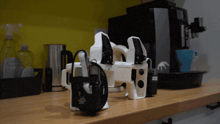

And that's the bigger goal: if recording a demonstration is as easy as shooting a video, anyone can contribute. We want Grabette to seed a **large, open, collaborative manipulation dataset**. One no single lab could ever build alone.

> 这也是更宏大的目标：如果录制演示就像拍视频一样简单，任何人都可以做出贡献。我们希望 Grabette 能够孕育出一个**庞大、开放、协作的操作数据集**——一个单靠任何一个实验室都无法单独构建的数据集。

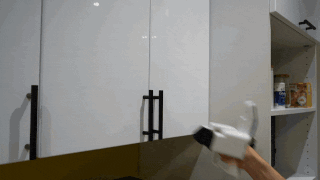

---

## Standing on the Shoulders of UMI

> ## 站在 UMI 的肩膀上

Grabette is directly inspired by the [**Universal Manipulation Interface** (UMI)](https://umi-gripper.github.io/) from Stanford: a handheld gripper with a fisheye camera that records demonstrations "in the wild", recovers camera trajectories with SLAM, and trains visuomotor policies from them.

> Grabette 直接受到了斯坦福大学 [**Universal Manipulation Interface** (UMI)](https://umi-gripper.github.io/) 的启发：这是一个带有鱼眼相机的手持夹爪，能够在“野外”录制演示，通过 SLAM 恢复相机轨迹，并基于此训练视觉运动策略。

UMI proved the recipe works. Other (closed source) devices exist like Agibot's MEgo gripper, Genrobot's DAS gripper, and Sunday Robotics' skill capture glove. Our goal was to make it effortless to use, getting the barrier from "I have a task" to "I have a trained model" as low as possible.

> UMI 证明了这个方案是可行的。市场上还存在其他（闭源）设备，例如智元机器人的 MEgo 夹爪、Genrobot 的 DAS 夹爪以及 Sunday Robotics 的技能捕捉手套。我们的目标是使其易于使用，将从“我有一个任务”到“我有一个训练好的模型”之间的门槛降到最低。

Grabette is built into the modern open ecosystem: LeRobot for datasets, the Hugging Face Hub for sharing, and a processing pipeline you run **from your browser** with nothing to install. Grabette is something anyone can build on a workbench, use in the field, and contribute data from.

> Grabette 构建于现代开放生态系统之中：使用 LeRobot 处理数据集，通过 Hugging Face Hub 进行共享，并且你只需**从浏览器运行**无需安装任何软件的处理流水线。任何人都可以通过工作台搭建 Grabette，在实际场景中使用它，并贡献数据。

---

## Meet Grabette

> ## 认识 Grabette

We have been developing Grabette for months, and we feel it has become usable enough to share. We are excited to share it now with you!

> 我们开发 Grabette 已经有好几个月了，现在觉得它已经足够完善并可以与大家分享了。我们非常高兴能将它呈现给大家！

Grabette is a **handheld gripper** instrumented with everything needed to reconstruct a manipulation demonstration.

> Grabette 是一个**手持夹爪**，配备了重建操作演示所需的全部硬件。

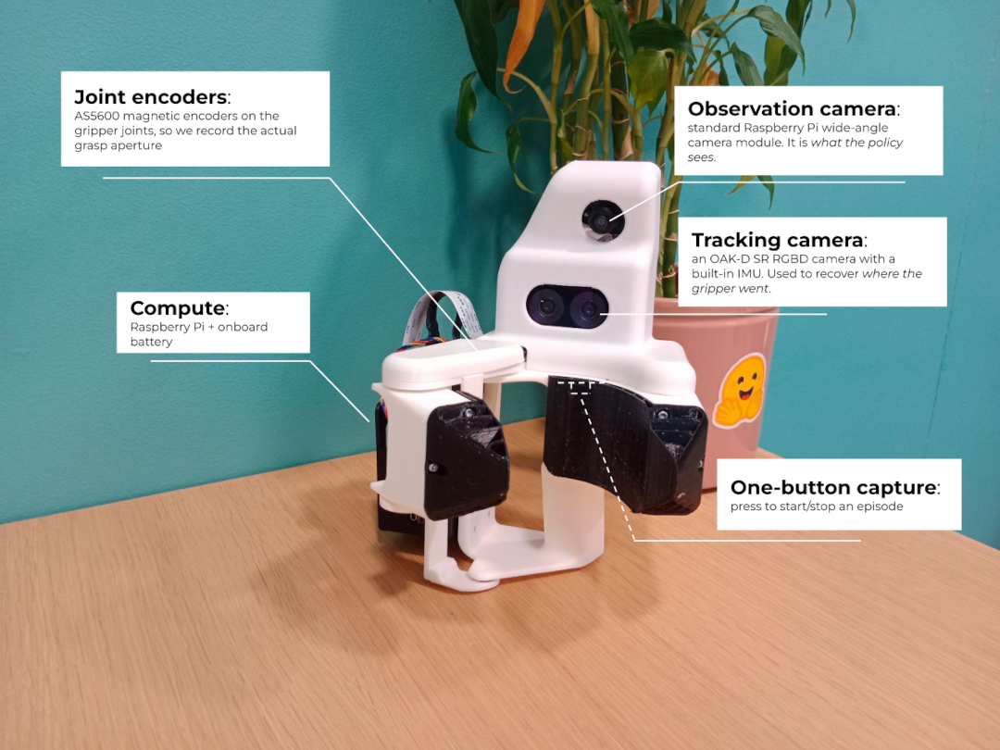

It carries **two cameras, each with a distinct job.** Splitting the two roles is deliberate: the cheap wide fisheye gives the policy the context-rich, wrist-camera-style view it needs, while the RGBD camera does the heavy lifting of robust 6-DoF tracking.

> 它搭载了**两个相机，各有不同的分工。** 这种角色分离是刻意设计的：廉价的广角鱼眼镜头为策略提供所需的、富含上下文的腕式相机风格视角，而 RGB-D 相机则承担了稳健的 6 自由度追踪重任。

And while Grabette records data during tasks performed by a user, it relies on its robotic counterpart to execute the movements it has learned after training. So, meet **Gripette**, the robotic arm end-effector twin of Grabette.

> 尽管 Grabette 用于记录用户执行任务时的数据，但它依赖于其机器人孪生体来执行训练后学到的动作。因此，隆重介绍 **Gripette**——Grabette 的机械臂末端执行器孪生体。

The family shares the same hardware DNA:
* **Grabette,** the handheld demonstration device (camera + IMU + gripper, BOM cost ~490€)
* **Gripette,** the motorized gripper (camera + two servomotors, BOM cost ~120€) that closes the loop on a real or simulated robot arm

> 这个产品家族共享相同的硬件 DNA：
* **Grabette**：手持演示设备（相机 + IMU + 夹爪，BOM 成本约 490 欧元）
* **Gripette**：电动夹爪（相机 + 两个伺服电机，BOM 成本约 120 欧元），用于在真实或仿真机械臂上闭环执行动作

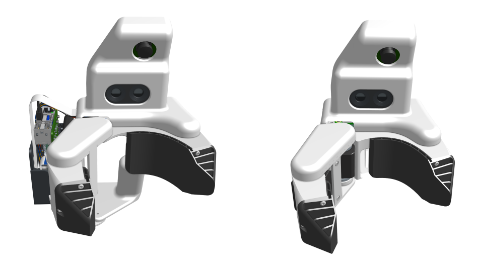

<em>Grabette hand-held recording device (left) and Gripette robot gripper (right)</em>

> 

> 
> 
<em>Grabette 手持录制设备（左）与 Gripette 机器人夹爪（右）</em>

> 

---

## Built for Everyone

> ## 为所有人打造

**Everything is open source**  
[Go check the repository!](https://github.com/pollen-robotics/grabette)

> **一切皆开源**  
> [快去查看代码仓库！](https://github.com/pollen-robotics/grabette)

* **Hardware**: CAD and production files for Grabette and Gripette
* **Capture service**: the on-device Raspberry Pi software
* **Processing pipeline**: run locally, or online via our Hugging Face Space
* **Example downstream stack**: stock LeRobot training + the OpenArm evaluation, as a reference

> * **硬件**：Grabette 和 Gripette 的 CAD 及生产文件
> * **捕获服务**：设备端的树莓派软件
> * **处理流水线**：可在本地运行，或通过我们的 Hugging Face Space 在线运行
> * **下游示例技术栈**：原生 LeRobot 训练 + OpenArm 评估，作为参考

**Components.** Standard sensors you can buy, no closed pipeline, no fork lock-in. A Raspberry Pi, a standard Pi camera, an off-the-shelf OAK-D depth camera, magnetic encoders. The whole point is that anyone can build one from parts you can just order.

> **组件。** 你可以买到的标准传感器，没有封闭的流水线，也没有分支锁定。一个树莓派、一个标准树莓派相机、一个现成的 OAK-D 深度相机、磁性编码器。核心意义在于，任何人都可以使用订购得到的零件组装一个。

**Robot-agnostic by design.** Nothing in the capture or the data format assumes a particular arm. Demonstrations are stored as camera-local 6-DoF cartesian pose plus gripper state, the output is a standard LeRobot dataset on the Hugging Face Hub, so the same data can drive different robots and different learning methods. You will still need the matching Gripette gripper on your arm though.

> **天生适配所有机器人。** 捕获过程或数据格式中没有任何内容假设特定的机械臂。演示数据存储为相机坐标系下的 6 自由度笛卡尔位姿加上夹爪状态，输出是 Hugging Face Hub 上的标准 LeRobot 数据集，因此相同的数据可以驱动不同的机器人和不同的学习方法。不过，你的机械臂上仍然需要配备相匹配的 Gripette 夹爪。

---

## From Your Hand to a Dataset, in Two Steps

> ## 从你的双手到数据集，只需两步

This release enables anyone to go from "I want to demonstrate a task" to "I have a training-ready dataset" quickly and without prior expertise.

> 此次发布使任何人都能在没有先前专业知识的情况下，快速实现从“我想演示一个任务”到“我拥有一个可用于训练的数据集”的转变。

### 1. Record

> ### 1. 录制

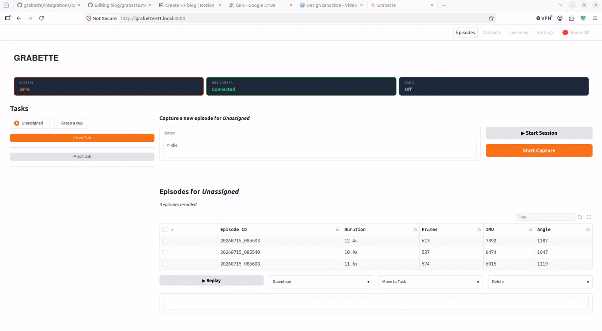
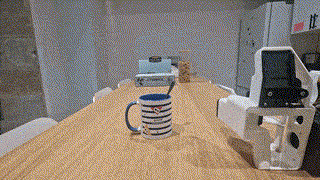

 

Press the button, and data from the observation camera, the tracking camera (color, depth, and IMU), and the gripper’s encoder joint values are recorded simultaneously, using a single shared clock to ensure proper synchronization. Press the button again to stop the episode, and the data is saved locally on the Raspberry Pi.

> 按下按钮，观测相机、追踪相机（彩色、深度和 IMU）以及夹爪编码器关节值的数据将被同时记录，并使用统一的共享时钟以确保良好的同步性。再次按下按钮即可停止该段情节（episode），数据将本地保存到树莓派上。

### 2. Process, Directly in Your Browser

> ### 2. 直接在浏览器中处理

[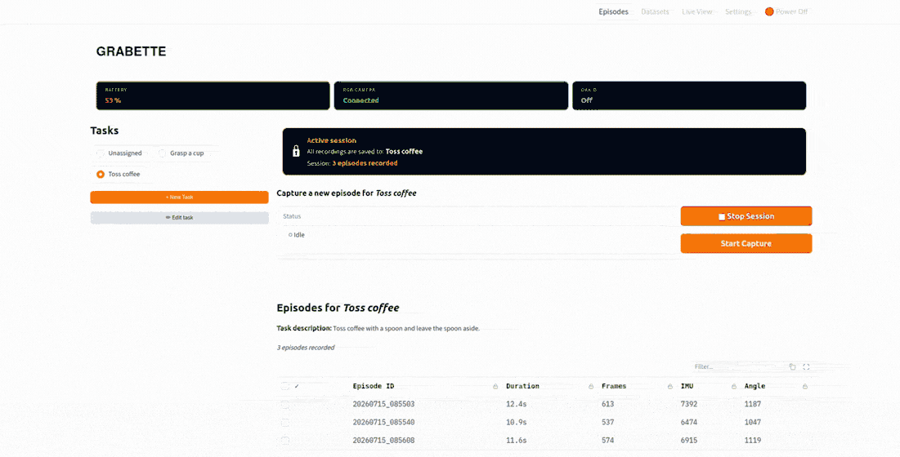](./images/d2cf7ab02aa0.gif)

Open the Grabette dashboard in your browser. Select the episodes you want to add to the dataset, and with one click, post-processing begins.

> 在浏览器中打开 Grabette 仪表盘。选择要添加到数据集中的情节，点击一下即可开始后处理。

* The episodes are uploaded to the HF Hub
* The grabette-slam space performs SLAM using RTAB-MAP library and verifies that the trajectory is correct (with no jumps or loss of tracking)
* The episodes are converted to LeRobot format
* A new dataset is uploaded to your space, where you can view the data for each episode using the LeRobot visualizer

> * 情节被上传到 HF Hub
> * grabette-slam 空间使用 RTAB-MAP 库执行 SLAM，并验证轨迹是否正确（无跳跃或丢失追踪）
> * 情节被转换为 LeRobot 格式
> * 一个新的数据集被上传到你的空间，你可以在其中使用 LeRobot 可视化工具查看每个情节的数据

Everything is now ready to start training!

> 现在一切准备就绪，可以开始训练了！

---

## What Can You Do with the Data? Here’s One Example.

> ## 你可以用这些数据做什么？这里有一个示例。

A dataset is only interesting if it trains something. So, to show the loop end-to-end, we ship a **complete example.** But to be clear, this is *an* example of what it enables, not the product: the release is the recording system. Your Grabette data works with any method that consumes LeRobot datasets.

> 只有能用于训练模型的数据集才有意义。因此，为了展示端到端的完整闭环，我们随附了一个**完整示例**。但需要明确的是，这只是它所能实现的功能的*一个*示例，而不是产品本身：本次发布的核心是录制系统。你的 Grabette 数据适用于任何能够消费 LeRobot 数据集的方法。

Our example takes 200 recorded demonstrations such as:

> 我们的示例采用了 200 个录制的演示，例如：

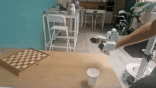

<em>Dataset available on this <a href="https://huggingface.co/datasets/chouziel/dataset-cup-0107" rel="noopener noreferrer">HF Dataset</a></em>

> 

> 
> 
<em>可在该 <a href="https://huggingface.co/datasets/chouziel/dataset-cup-0107" rel="noopener noreferrer">HF 数据集</a> 上获取数据集</em>

> 

and:
* **Trains a policy** with the **LeRobot** stack — a Diffusion Policy (ResNet18 + SpatialSoftmax encoder, DDIM scheduler, 6-D rotation actions) that fits on a single consumer GPU.
* **Evaluates it** on an OpenArm 7-DoF arm with the Gripette gripper, driven over a gRPC API, with this result:

> 以及：
* 使用 **LeRobot** 技术栈**训练策略**——一个适配单张消费级 GPU 的扩散策略（Diffusion Policy，包含 ResNet18 + SpatialSoftmax 编码器、DDIM 调度器、6D 旋转动作）。
* 在配备 Gripette 夹爪的 OpenArm 7 自由度机械臂上**进行评估**，通过 gRPC API 驱动，结果如下：

<em>Policy available on this <a href="https://huggingface.co/SteveNguyen/pick_cup_0107_smooth-best" rel="noopener noreferrer">HF Model</a></em>

> 

> 
> 
<em>可在该 <a href="https://huggingface.co/SteveNguyen/pick_cup_0107_smooth-best" rel="noopener noreferrer">HF 模型</a> 上获取策略</em>

> 

---

## Now It's Your Turn

> ## 现在轮到你了

The data bottleneck doesn’t get solved by one lab, but by a community recording demonstrations everywhere. You can now help build the dataset: build a Grabette, record tasks you are interested in, and share them on the Hub. Every episode makes the open dataset bigger and more diverse, and every contributor makes robot learning a little less gated behind expensive hardware.

> 数据瓶颈无法仅靠一个实验室来解决，而是需要社区在各地录制演示来共同克服。你现在就可以参与构建数据集：制作一个 Grabette，录制你感兴趣的任务，并在 Hub 上分享它们。每一个情节都让开放数据集变得更大、更多元，每一位贡献者都让机器人学习离昂贵硬件的垄断更远一点。

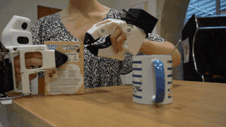
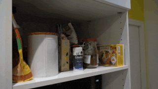
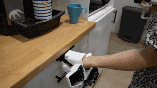
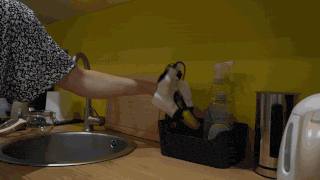
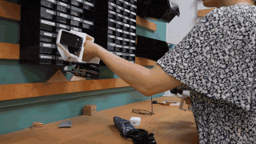
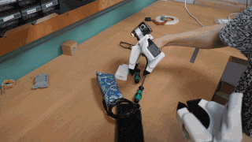

### What's Next

> ### 下一步计划

This release is only the start of the project! Grabette will keep evolving. We already have more coming, including **Casquette**, a head-mounted POV device to complement Grabette for egocentric capture (*still a work in progress*). But the most important next step isn’t only ours, it’s also yours: start recording, and let’s build the dataset together.

> 本次发布只是该项目的开始！Grabette 将继续演进。我们已经有更多的新成果在路上，包括 **Casquette**——一种头戴式第一人称视角（POV）设备，用于补充 Grabette 的自我中心视角捕捉（*目前仍在开发中*）。但最重要的一步不仅属于我们，也属于你：开始录制，让我们一起构建数据集。

👉 **[Build a Grabette (GitHub)](https://github.com/pollen-robotics/grabette)** · [Process your data (HF Space)](https://huggingface.co/spaces/pollen-robotics/grabette-slam) · Contribute to the dataset

> 👉 **[构建 Grabette (GitHub)](https://github.com/pollen-robotics/grabette)** · [处理你的数据 (HF Space)](https://huggingface.co/spaces/pollen-robotics/grabette-slam) · 贡献数据集

*Built with ❤️ by Pollen Robotics.*

> *由 Pollen Robotics 倾情打造 ❤️*