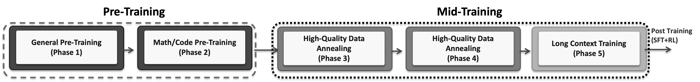
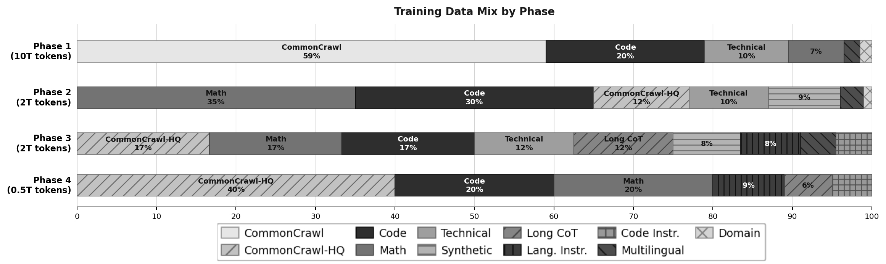
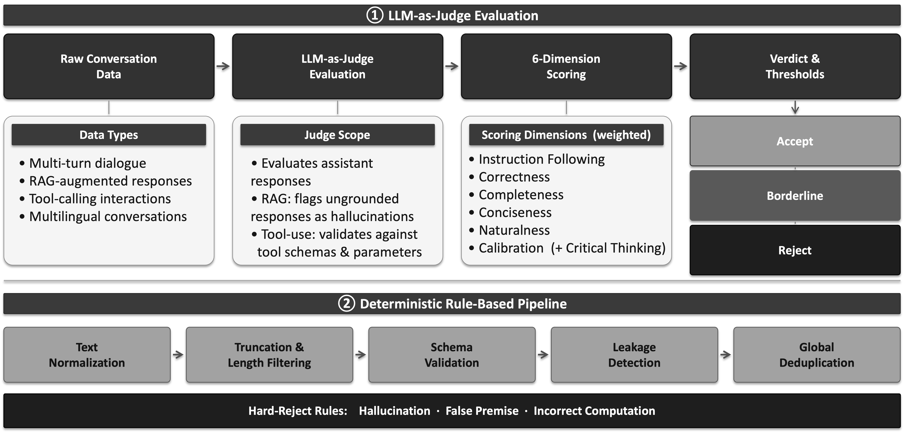
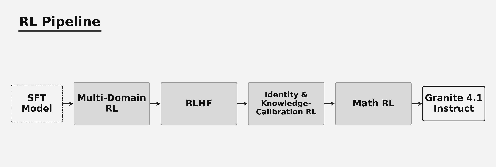
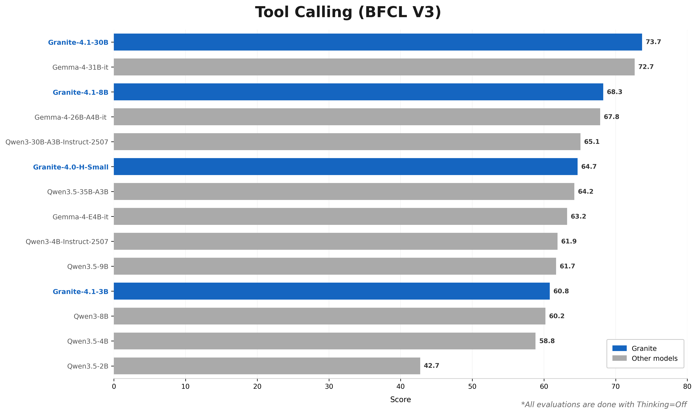
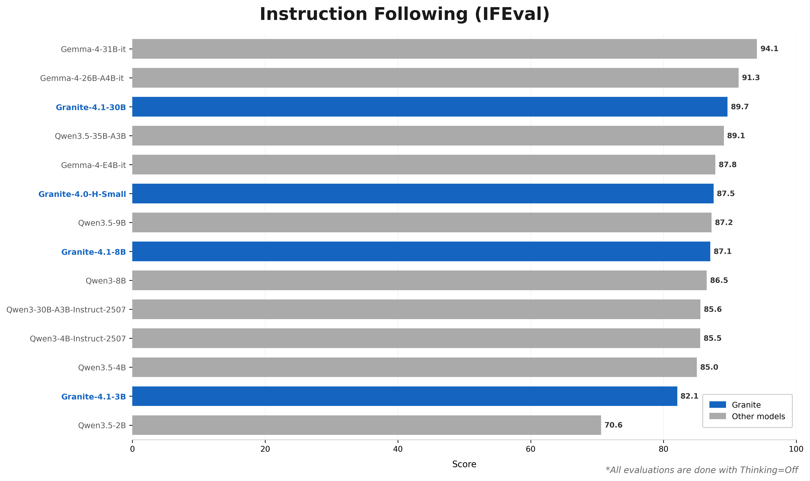
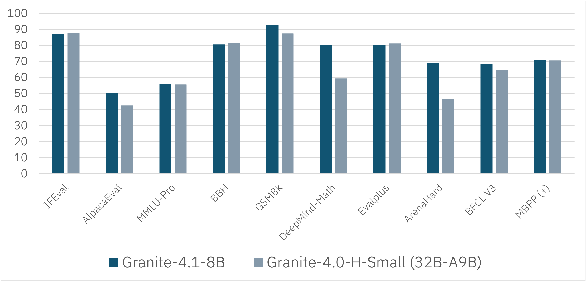
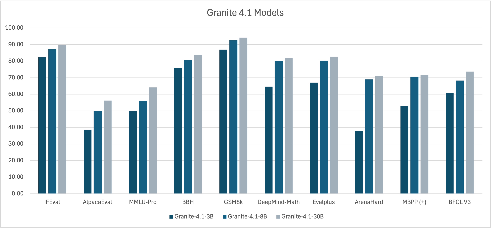

---
authors:
- aitoboxrobot
categories:
- 产品发布
date: 2026-08-07
hide:
- navigation
tags:
- Granite 4.1
- IBM
- 大语言模型
- 稠密架构
- 强化学习
title: Granite 4.1 大语言模型：构建解析
---
### 文章背景与核心概要
IBM Granite 团队近期推出了全新一代稠密解码器大语言模型系列——**Granite 4.1**。该系列包含 3B、8B 和 30B 三种参数规模，通过多阶段预训练管道在约 15 万亿（15T）Token 上进行训练，并支持高达 512K Token 的长文本扩展能力。模型在监督微调（SFT）阶段引入了基于 LLM-as-Judge 的质量控制，并在强化学习阶段采用了基于 DAPO 损失的策略（Policy）GRPO 算法。

本文深入解析了 Granite 4.1 的架构设计、五阶段预训练策略、SFT 数据过滤流程以及多阶段强化学习管道。值得注意的是，其 8B 稠密模型在性能上可比肩甚至超越上一代的 32B 混合专家（MoE）模型，证明了参数高效的稠密架构同样具备强大的竞争力。

---

# Granite 4.1 LLMs: How They’re Built

**Authors:** Granite Team, IBM  
**Published:** April 29, 2026  
**License:** Apache 2.0  

---

## 📋 Executive Summary

**Granite 4.1** is a family of dense, decoder-only Large Language Models (LLMs) available in **3B, 8B, and 30B** parameters. Trained on approximately **15 trillion tokens** through a multi-stage pre-training pipeline, these models feature long-context extension capabilities of up to **512K tokens**. 

The models undergo rigorous refinement using:
* **Supervised Fine-Tuning (SFT):** Curated on ~4.1M high-quality samples using an LLM-as-Judge framework.
* **Reinforcement Learning (RL):** Powered by on-policy GRPO with DAPO loss.

**Key Highlight:** The **Granite 4.1 8B Instruct** model matches or surpasses the performance of the previous-generation *Granite 4.0-H-Small (32B-A9B MoE)*, proving that a simpler, parameter-efficient dense architecture can rival complex Mixture-of-Experts setups.

* **Quick Links:** [Hugging Face Collection](https://huggingface.co/collections/ibm-granite/granite-41-language-models) | [GitHub Repository](https://github.com/github.com/ibm-granite/granite-4.1-language-models) | [Documentation](https://www.ibm.com/granite/docs/)

> **📋 执行摘要**
> 
> **Granite 4.1** 是一个包含 **3B、8B 和 30B** 参数规模的稠密（dense）、纯解码器（decoder-only）大语言模型（LLM）系列。这些模型通过多阶段预训练管道，在约 **15 万亿个 Token** 上进行了训练，并具备高达 **512K Token** 的长文本扩展能力。
> 
> 模型通过以下严谨的优化手段进行打磨：
> * **监督微调（SFT）：** 使用 LLM-as-Judge 框架，基于约 410 万个高质量样本进行精调。
> * **强化学习（RL）：** 采用结合 DAPO 损失的在线策略（on-policy）GRPO 算法驱动。
> 
> **核心亮点：** **Granite 4.1 8B Instruct** 模型能够匹配或超越上一代 *Granite 4.0-H-Small (32B-A9B MoE)* 的性能，这证明了更简单、参数高效的稠密架构完全可以媲美复杂的混合专家（MoE）架构。
> 
> * **快速链接：** [Hugging Face 集合](https://huggingface.co/collections/ibm-granite/granite-41-language-models) | [GitHub 仓库](https://github.com/ibm-granite/granite-4.1-language-models) | [官方文档](https://www.ibm.com/granite/docs/)

---

## 🔎 Overview

Building high-performance small language models requires prioritizing data quality over raw volume. The Granite 4.1 development lifecycle focuses on progressive data refinement across five pre-training stages, strict LLM-as-Judge quality controls for SFT, and a multi-domain reinforcement learning pipeline designed to bolster performance across math, coding, instruction-following, and general chat without causing catastrophic forgetting.

> **🔎 概述**
> 
> 构建高性能的小型语言模型，需要将数据质量置于原始数据规模之上。Granite 4.1 的开发生命周期聚焦于：跨五个预训练阶段的渐进式数据精炼、用于 SFT 的严格 LLM-as-Judge 质量控制，以及旨在提升数学、编程、指令遵循和日常对话等全方位性能且不会引起灾难性遗忘的多领域强化学习管道。

---

## 📐 Model Architecture

Granite 4.1 models rely on a decoder-only dense transformer architecture incorporating modern optimizations: **Grouped Query Attention (GQA)**, **Rotary Position Embeddings (RoPE)**, **SwiGLU activations**, **RMSNorm**, and **shared input/output embeddings**.

| Component | 3B Dense | 8B Dense | 30B Dense |
| :--- | :--- | :--- | :--- |
| **Embedding size** | 2560 | 4096 | 4096 |
| **Number of layers** | 40 | 40 | 64 |
| **Attention head size** | 64 | 128 | 128 |
| **Number of attention heads** | 40 | 32 | 32 |
| **Number of KV heads** | 8 | 8 | 8 |
| **MLP hidden size** | 8192 | 12800 | 32768 |
| **MLP activation** | SwiGLU | SwiGLU | SwiGLU |
| **Position embedding** | RoPE | RoPE | RoPE |

> **📐 模型架构**
> 
> Granite 4.1 模型采用基于纯解码器的稠密 Transformer 架构，并融合了现代优化技术：**分组查询注意力（GQA）**、**旋转位置编码（RoPE）**、**SwiGLU 激活函数**、**RMSNorm** 以及**共享输入/输出嵌入**。
> 
> | 组件 | 3B 稠密版 | 8B 稠密版 | 30B 稠密版 |
> | :--- | :--- | :--- | :--- |
> | **嵌入维度（Embedding size）** | 2560 | 4096 | 4096 |
> | **层数（Number of layers）** | 40 | 40 | 64 |
> | **注意力头大小（Attention head size）** | 64 | 128 | 128 |
> | **注意力头数（Number of attention heads）** | 40 | 32 | 32 |
> | **KV 头数（Number of KV heads）** | 8 | 8 | 8 |
> | **MLP 隐藏层大小（MLP hidden size）** | 8192 | 12800 | 32768 |
> | **MLP 激活函数（MLP activation）** | SwiGLU | SwiGLU | SwiGLU |
> | **位置编码（Position embedding）** | RoPE | RoPE | RoPE |

---

## ⚙️ Pre-Training Strategy

Granite 4.1 is trained from scratch on ~15T tokens across a comprehensive five-phase trajectory:


> *Figure 2: The five-phase pre-training pipeline.*

### Phase 1: General Pre-Training (10T tokens)
Establishes baseline language understanding using a broad, power-scheduled web mixture:
* **CommonCrawl:** ~59%
* **Code:** ~20%
* **Technical Documents:** ~10.5%
* **Math:** ~7%
* **Multilingual:** ~2%
* **Domain Specific:** ~1.5%

### Phase 2: Math & Code Pre-Training (2T tokens)
Pivots toward deeper reasoning capabilities by scaling up math and programming datasets:
* **Math:** ~35% (5x increase)
* **Code:** ~30% (1.5x increase)
* **CommonCrawl-HQ:** ~12%
* **Technical:** ~10%
* **Synthetic Data:** ~9%
* **Multilingual:** ~3%
* **Domain Specific:** ~1%

### Phase 3: High-Quality Data Annealing (2T tokens)
Introduces mid-training with exponential learning rate decay and synthesized chain-of-thought traces:
* **CommonCrawl-HQ / Math / Code:** ~16.67% each
* **Technical:** ~12.5%
* **Long Chain-of-Thought:** ~12.5%
* **Synthetic:** ~8.5%
* **Language Instructions:** ~7.5%
* **Code Instructions:** ~4.5%
* **Multilingual:** ~4.5%

### Phase 4: High-Quality Data Annealing & Refinement (0.5T tokens)
Applies linear learning rate decay focusing exclusively on premium curated text:
* **CommonCrawl-HQ:** ~40%
* **Code / Math:** ~20% each
* **Language Instructions:** ~9%
* **Long Chain-of-Thought:** ~6%
* **Code Instructions:** ~5%


> *Figure 3: Evolution of the training data mix across phases.*

### Phase 5: Long Context Training (LCE)
Extends sequence length from **4K to 512K tokens** via staged expansions (32K $\rightarrow$ 128K $\rightarrow$ 512K). Model merging is applied post-stage to preserve short-context accuracy.

**Base Model RULER Benchmarks:**
| Model Name | 32K | 64K | 128K |
| :--- | :---: | :---: | :---: |
| **granite-4.1-3b-base** | 75.0 | 66.6 | 58.0 |
| **granite-4.1-3b-base** | 75.0 | 66.6 | 58.0 |
| **granite-4.1-8b-base** | 83.6 | 79.1 | 73.0 |
| **granite-4.1-30b-base** | 85.2 | 84.6 | 76.7 |

> **⚙️ 预训练策略**
> 
> Granite 4.1 在约 15T Token 上从头开始训练，经历了包含五个阶段的完整训练轨迹：
> 
> 
> > *图 2：五个阶段的预训练管道。*
> 
> ### 阶段 1：通用预训练（10T Token）
> 使用广泛的、采用幂律调度（power-scheduled）的网络混合数据建立基线语言理解能力：
> * **CommonCrawl：** ~59%
> * **代码（Code）：** ~20%
> * **技术文档（Technical Documents）：** ~10.5%
> * **数学（Math）：** ~7%
> * **多语言（Multilingual）：** ~2%
> * **领域特定（Domain Specific）：** ~1.5%
> 
> ### 阶段 2：数学与代码预训练（2T Token）
> 通过扩大数学和编程数据集的规模，转向更深层次的推理能力：
> * **数学：** ~35%（提升 5 倍）
> * **代码：** ~30%（提升 1.5 倍）
> * **高质量 CommonCrawl (CommonCrawl-HQ)：** ~12%
> * **技术文档：** ~10%
> * **合成数据（Synthetic Data）：** ~9%
> * **多语言：** ~3%
> * **领域特定：** ~1%
> 
> ### 阶段 3：高质量数据退火（2T Token）
> 引入带有指数学习率衰减和合成思维链（Chain-of-Thought）轨迹的中期训练：
> * **CommonCrawl-HQ / 数学 / 代码：** 各占 ~16.67%
> * **技术文档：** ~12.5%
> * **长思维链（Long Chain-of-Thought）：** ~12.5%
> * **合成数据：** ~8.5%
> * **语言指令：** ~7.5%
> * **代码指令：** ~4.5%
> * **多语言：** ~4.5%
> 
> ### 阶段 4：高质量数据退火与精炼（0.5T Token）
> 采用线性学习率衰减，完全专注于优质精选文本：
> * **CommonCrawl-HQ：** ~40%
> * **代码 / 数学：** 各占 ~20%
> * **语言指令：** ~9%
> * **长思维链：** ~6%
> * **代码指令：** ~5%
> 
> 
> > *图 3：各阶段训练数据配比的演进。*
> 
> ### 阶段 5：长文本训练（LCE）
> 通过分阶段扩展（32K $\rightarrow$ 128K $\rightarrow$ 512K），将序列长度从 **4K 扩展至 512K Token**。在阶段结束后应用模型合并（Model Merging）技术以保持对短文本的准确率。
> 
> **基础模型 RULER 基准测试：**
> | 模型名称 | 32K | 64K | 128K |
> | :--- | :---: | :---: | :---: |
> | **granite-4.1-3b-base** | 75.0 | 66.6 | 58.0 |
> | **granite-4.1-8b-base** | 83.6 | 79.1 | 73.0 |
> | **granite-4.1-30b-base** | 85.2 | 84.6 | 76.7 |

---

## 📝 SFT: Data Preparation & Quality Control

To eliminate hallucination vectors and structural instability, Supervised Fine-Tuning (SFT) data undergoes filtering via an **LLM-as-Judge** evaluation pipeline.


> *Figure 4: Multi-dimensional SFT data evaluation rubric.*

* **Evaluation Focus:** Evaluates assistant outputs exclusively against structural, semantic, and factual rubrics (scoring correctness, instruction following, conciseness, calibration, and completeness).
* **Hard-Rejects:** Triggers automatic dataset exclusion for severe errors like hallucinations or broken tool schemas, bypassing threshold scoring.
* **Scale:** Fine-tuned on **~4.1 million** curated samples over 3 epochs at a sequence length of 16,384 tokens.

> **📝 SFT：数据准备与质量控制**
> 
> 为了消除幻觉向量和结构性不稳定，监督微调（SFT）数据通过 **LLM-as-Judge** 评估管道进行过滤。
> 
> 
> > *图 4：多维度 SFT 数据评估准则。*
> 
> * **评估重点：** 仅根据结构、语义和事实准则对助手输出进行评估（对正确性、指令遵循度、简洁性、校准度以及完整性进行打分）。
> * **一票否决（Hard-Rejects）：** 针对幻觉或损坏的工具架构等严重错误，触发自动从数据集中剔除的机制，无需经过阈值打分。
> * **规模：** 在约 **410 万**个精选样本上进行了 3 个 Epoch 的微调，序列长度为 16,384 个 Token。

---

## 🔄 Reinforcement Learning: Multi-Stage RL Pipeline

Granite 4.1 applies a sequential, multi-stage RL framework to fine-tune target behaviors without inducing policy regression.


> *Figure 10: The four sequential RL stages.*

1. **Multi-Domain RL:** Jointly trains on math, logic, science, coding, and structured output tasks using **On-policy GRPO** with **DAPO loss** (SkyRL stack; 16 samples/prompt, $\beta = 0.05$).
2. **RLHF:** Optimizes chat helpfulness using a multilingual reward model, boosting Alpaca-Eval performance by ~18.9 points ($\beta = 0.09$).
3. **Identity & Knowledge-Calibration RL:** Brief calibration steps (~40 updates) to lock down model self-identification and factual boundaries.
4. **Math RL:** Recovers math reasoning scores from prior general chat tuning, boosting GSM8K and DeepMind-Math metrics past SFT baselines.

> **🔄 强化学习：多阶段 RL 管道**
> 
> Granite 4.1 采用顺序的多阶段强化学习框架来微调目标行为，同时避免引发策略退化（Policy Regression）。
> 
> 
> > *图 10：四个顺序的 RL 阶段。*
> 
> 1. **多领域 RL：** 结合使用 **On-policy GRPO** 与 **DAPO 损失**（基于 SkyRL 架构；16 个样本/提示词，$\beta = 0.05$），在数学、逻辑、科学、编程和结构化输出任务上进行联合训练。
> 2. **RLHF：** 使用多语言奖励模型（Reward Model）优化对话的有用性（helpfulness），使 Alpaca-Eval 性能提升约 18.9 个百分点（$\beta = 0.09$）。
> 3. **身份与知识校准 RL：** 通过简短的校准步骤（约 40 次更新）来锁定模型的自我身份识别和事实边界。
> 4. **数学 RL：** 恢复因先前通用对话调优而下降的数学推理得分，使 GSM8K 和 DeepMind-Math 指标超越 SFT 基线。

---

## 📊 Evaluation & Results

### Base Model Benchmarks
| Benchmark | Metric | 3B | 8B | 30B |
| :--- | :--- | :---: | :---: | :---: |
| **MMLU** | 5-shot | 66.47 | 73.60 | 78.44 |
| **MMLU-Pro** | 5-shot, CoT | 37.16 | 44.58 | 49.51 |
| **GSM8K** | 8-shot | 72.93 | 73.54 | 83.78 |
| **HumanEval** | pass@1 | 59.76 | 68.29 | 69.50 |
| **MMMLU** | 5-shot | 56.59 | 64.73 | 73.36 |

### Instruct Model Benchmarks
| Benchmark | Metric | 3B | 8B | 30B |
| :--- | :--- | :---: | :---: | :---: |
| **MMLU** | 5-shot | 67.02 | 73.84 | 80.16 |
| **GPQA** | 0-shot, CoT | 31.70 | 41.96 | 45.76 |
| **AlpacaEval 2.0** | — | 38.57 | 50.08 | 56.16 |
| **ArenaHard** | — | 37.80 | 68.98 | 71.02 |
| **GSM8K** | 8-shot | 86.88 | 92.49 | 94.16 |
| **HumanEval** | pass@1 | 79.27 | 87.20 | 89.63 |
| **BFCL v3** | Tool Calling | 60.80 | 68.27 | 73.68 |

**Supported Languages:** English, German, Spanish, French, Japanese, Portuguese, Arabic, Czech, Italian, Korean, Dutch, and Chinese.

### Comparative Highlights

  


* **Granite 4.1-8B vs. Granite 4.0-H-Small (32B-A9B MoE):**


> *Figure 13: 8B dense model matching or outperforming its larger MoE predecessor.*

* **Family Scaling Overview:**


> *Figure 14: Predictable performance scaling from 3B up to 30B.*

> **📊 评估与结果**
> 
> ### 基础模型基准测试
> | 基准测试 | 指标 | 3B | 8B | 30B |
> | :--- | :--- | :---: | :---: | :---: |
> | **MMLU** | 5-shot | 66.47 | 73.60 | 78.44 |
> | **MMLU-Pro** | 5-shot, CoT | 37.16 | 44.58 | 49.51 |
> | **GSM8K** | 8-shot | 72.93 | 73.54 | 83.78 |
> | **HumanEval** | pass@1 | 59.76 | 68.29 | 69.50 |
> | **MMMLU** | 5-shot | 56.59 | 64.73 | 73.36 |
> 
> ### 指令模型（Instruct）基准测试
> | 基准测试 | 指标 | 3B | 8B | 30B |
> | :--- | :--- | :---: | :---: | :---: |
> | **MMLU** | 5-shot | 67.02 | 73.84 | 80.16 |
> | **GPQA** | 0-shot, CoT | 31.70 | 41.96 | 45.76 |
> | **AlpacaEval 2.0** | — | 38.57 | 50.08 | 56.16 |
> | **ArenaHard** | — | 37.80 | 68.98 | 71.02 |
> | **GSM8K** | 8-shot | 86.88 | 92.49 | 94.16 |
> | **HumanEval** | pass@1 | 79.27 | 87.20 | 89.63 |
> | **BFCL v3** | 工具调用（Tool Calling） | 60.80 | 68.27 | 73.68 |
> 
> **支持的语言：** 英语、德语、西班牙语、法语、日语、葡萄牙语、阿拉伯语、捷克语、意大利语、韩语、荷兰语和中文。
> 
> ### 对比亮点
> 
>   
> 
> 
> * **Granite 4.1-8B 对比 Granite 4.0-H-Small (32B-A9B MoE)：**
> 
> 
> > *图 13：8B 稠密模型匹敌甚至超越体量更大的 MoE 前代模型。*
> 
> * **模型系列规模扩展总览：**
> 
> 
> > *图 14：从 3B 到 30B 呈现出可预测的性能规模扩展。*

---

## ⚡ Inference & Infrastructure

* **FP8 Quantization:** Optimized variants reduce disk footprint and GPU memory by ~50% using LLM Compressor for vLLM workflows.
* **Training Infrastructure:** Built on an **NVIDIA GB200 NVL72 cluster** hosted by CoreWeave featuring 72-GPU NVLink intra-rack topologies and full fat-tree NDR 400 Gb/s InfiniBand.

> **⚡ 推理与基础设施**
> 
> * **FP8 量化：** 优化的变体通过 LLM Compressor 针对 vLLM 工作流进行了优化，可将磁盘占用和 GPU 内存减少约 50%。
> * **训练基础设施：** 基于 CoreWeave 托管的 **NVIDIA GB200 NVL72 集群**构建，具备 72 块 GPU 的机架内 NVLink 拓扑结构以及全胖树（full fat-tree）NDR 400 Gb/s InfiniBand 网络。

---

## 🚀 Getting Started

To run inference or use tool-calling capabilities with the **Granite 4.1 30B Instruct** model:

```bash
pip install torch torchvision torchaudio accelerate transformers
```

```python
import torch
from transformers import AutoModelForCausalLM, AutoTokenizer

device = "cuda"
model_path = "ibm-granite/granite-4.1-30b"
tokenizer = AutoTokenizer.from_pretrained(model_path)
model = AutoModelForCausalLM.from_pretrained(model_path, device_map=device)
model.eval()

tools = [
    {
        "type": "function",
        "function": {
            "name": "get_current_weather",
            "description": "Get the current weather for a specified city.",
            "parameters": {
                "type": "object",
                "properties": {
                    "city": {
                        "type": "string",
                        "description": "Name of the city"
                    }
                },
                "required": ["city"]
            }
        }
    }
]

chat = [
    { "role": "user", "content": "What's the weather like in London right now?" },
]

chat = tokenizer.apply_chat_template(
    chat, 
    tokenize=False, 
    tools=tools, 
    add_generation_prompt=True
)

input_tokens = tokenizer(chat, return_tensors="pt").to(device)
output = model.generate(**input_tokens, max_new_tokens=100)
print(tokenizer.batch_decode(output)[0])
```

> **🚀 快速上手**
> 
> 要运行推理或使用 **Granite 4.1 30B Instruct** 模型的工具调用（tool-calling）功能，请参考以下代码：
> 
> ```bash
> pip install torch torchvision torchaudio accelerate transformers
> ```
> 
> ```python
> import torch
> from transformers import AutoModelForCausalLM, AutoTokenizer
> 
> device = "cuda"
> model_path = "ibm-granite/granite-4.1-30b"
> tokenizer = AutoTokenizer.from_pretrained(model_path)
> model = AutoModelForCausalLM.from_pretrained(model_path, device_map=device)
> model.eval()
> 
> tools = [
>     {
>         "type": "function",
>         "function": {
>             "name": "get_current_weather",
>             "description": "Get the current weather for a specified city.",
>             "parameters": {
>                 "type": "object",
>                 "properties": {
>                     "city": {
>                         "type": "string",
>                         "description": "Name of the city"
>                     }
>                 },
>                 "required": ["city"]
>             }
>         }
>     }
> ]
> 
> chat = [
>     { "role": "user", "content": "What's the weather like in London right now?" },
> ]
> 
> chat = tokenizer.apply_chat_template(
>     chat, 
>     tokenize=False, 
>     tools=tools, 
>     add_generation_prompt=True
> )
> 
> input_tokens = tokenizer(chat, return_tensors="pt").to(device)
> output = model.generate(**input_tokens, max_new_tokens=100)
> print(tokenizer.batch_decode(output)[0])
> ```

---

## 🔗 Resources
* [Granite 4.1 Hugging Face Collection](https://huggingface.co/collections/ibm-granite/granite-41-language-models)
* [PRISM Research Paper](https://huggingface.co/papers/2603.17074)
* [GitHub Repository](https://github.com/ibm-granite/granite-4.1-language-models)
* [Official Documentation](https://www.ibm.com/granite/docs/)

> **🔗 相关资源**
> * [Granite 4.1 Hugging Face 集合](https://huggingface.co/collections/ibm-granite/granite-41-language-models)
> * [PRISM 研究论文](https://huggingface.co/papers/2603.17074)
> * [GitHub 代码仓库](https://github.com/ibm-granite/granite-4.1-language-models)
> * [官方文档](https://www.ibm.com/granite/docs/)