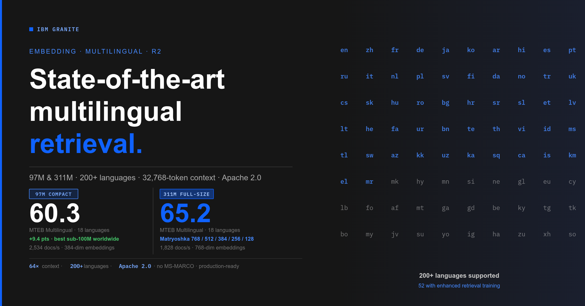
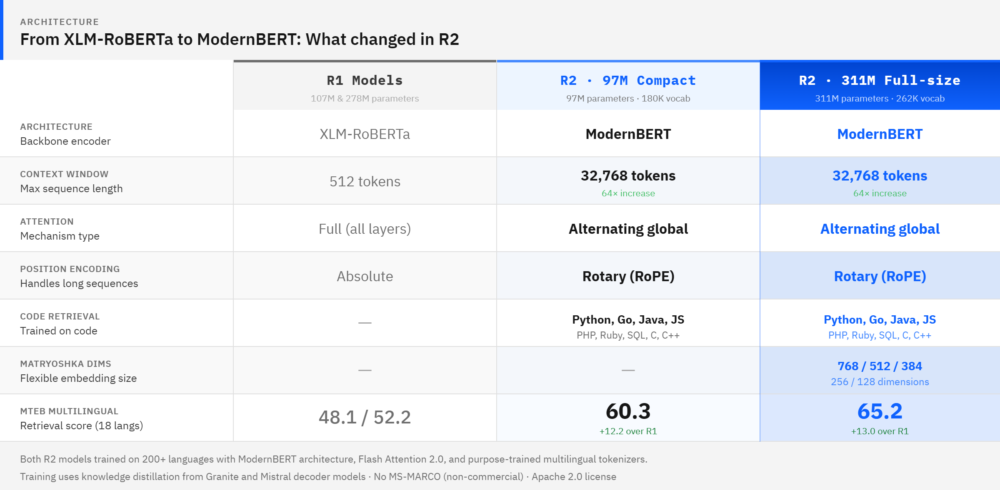
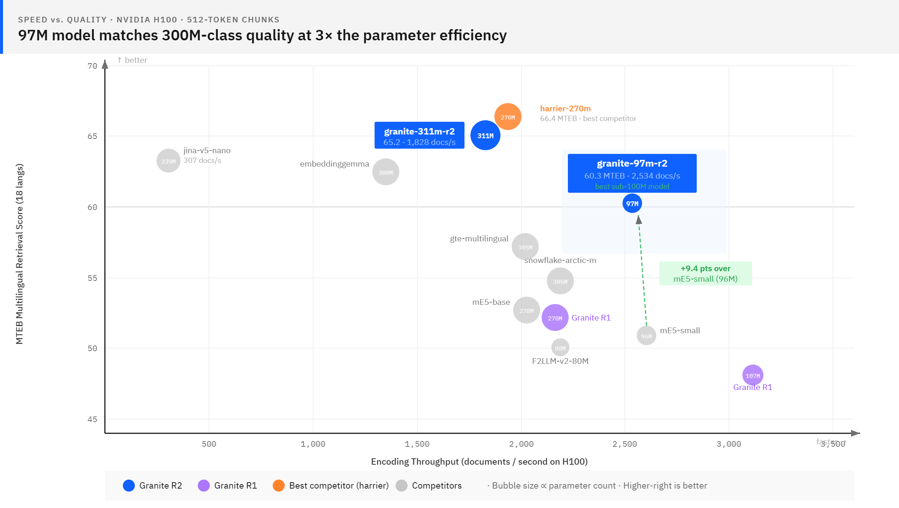
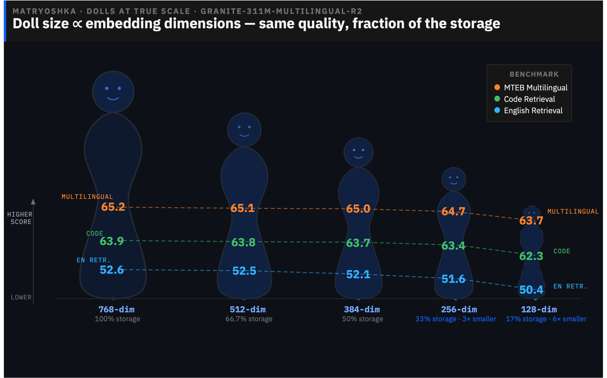

---
authors:
- aitoboxrobot
categories:
- arXiv论文
date: 2026-08-07
hide:
- navigation
tags:
- 嵌入模型
- 多语言
- ModernBERT
- 开源
- RAG
title: Granite Embedding Multilingual R2：开源 Apache 2.0 多语言嵌入模型，支持 32K 上下文——百兆参数以下最佳检索质量
---
### 文章背景与核心概要
IBM Granite 推出了新一代开源 Apache 2.0 多语言嵌入模型——Granite Embedding Multilingual R2。该系列基于 ModernBERT 构建，包含 97M 和 311M 两个核心模型。其中 97M 轻量模型在 MTEB 多语言检索基准测试中创下了 60.3 的顶尖成绩，大幅超越同量级开源模型；311M 全尺寸模型则斩获 65.2 分，并支持用于灵活降维的“套娃”表征学习（Matryoshka Representation Learning）。

两款模型均支持 200 多种语言（对 52 种语言及编程代码进行了增强训练），上下文窗口扩展至 32,768 个 Token（相比 R1 提升 64 倍）。它们作为 Sentence Transformers、LangChain、LlamaIndex 等主流框架的即插即用替代品，能够帮助开发者无缝实现多语言检索和长文档处理，并在企业级应用中具备高度的合规性和高效的 CPU/GPU 推理性能。

---

# Granite Embedding Multilingual R2: Open Apache 2.0 Multilingual Embeddings with 32K Context — Best Sub-100M Retrieval Quality

**Published:** May 14, 2026  
**Authors:** Radu Florian, Parul Awasthy, Aashka Trivedi, Madison Lee (IBM Granite)  

---

## 📌 Summary

IBM Granite has released **Granite Embedding Multilingual R2**, a new generation of open Apache 2.0 multilingual embedding models built on ModernBERT. The release features two standout models:
1. **`granite-embedding-97m-multilingual-r2` (97M parameters):** A compact powerhouse that achieves a state-of-the-art **60.3** on MTEB Multilingual Retrieval, outperforming all other open sub-100M multilingual models by a wide margin.
2. **`granite-embedding-311m-multilingual-r2` (311M parameters):** A full-size model scoring **65.2** on MTEB Multilingual Retrieval, featuring **Matryoshka representation learning** for flexible dimension reduction.

Both models support **200+ languages** (with enhanced training for 52 languages and code), scale up to a **32,768-token context window** (a 64x increase over R1), and are designed as drop-in replacements for frameworks like Sentence Transformers, LangChain, LlamaIndex, Haystack, and Milvus.

---

> **一句话总结：** 基于 ModernBERT 构建的两款全新 Apache 2.0 多语言嵌入模型——97M 参数的紧凑型模型在 MTEB 多语言检索中击败了所有 100M 以下的开源多语言嵌入器（得分 60.3），而 311M 全尺寸模型在 MTEB 多语言检索中得分 65.2（在 500M 参数以下的开源模型中排名第二），并支持套娃（Matryoshka）降维。两者均覆盖 200 多种语言，针对 52 种语言进行了精细调优，支持 32K Token 上下文（为 R1 的 64 倍），并新增了覆盖 9 种编程语言的代码检索能力。

> **TL;DR:** Two new Apache 2.0 multilingual embedding models built on ModernBERT — a 97M-parameter compact model that beats every open sub-100M multilingual embedder on MTEB Multilingual Retrieval (60.3), and a 311M full-size model that scores 65.2 on MTEB Multilingual Retrieval (#2 among open models under 500M parameters) with Matryoshka support. Both cover 200+ languages, are tuned on 52 languages, handle 32K-token context (64x R1), and add code retrieval across 9 programming languages.



---

## Introduction

Multilingual embedding models face a persistent tension: broad language coverage usually comes at the cost of model size, and small models usually sacrifice languages. If you work across languages — retrieval-augmented generation over multilingual corpora, cross-lingual search, code retrieval in international teams — you've likely had to choose between a model that's fast enough and one that's good enough.

The Granite Embedding Multilingual R2 release narrows that gap considerably. We're releasing two new multilingual embedding models:

* [**granite-embedding-311m-multilingual-r2**](https://huggingface.co/ibm-granite/granite-embedding-311m-multilingual-r2) — A 311M-parameter full-size model with 768-dimensional embeddings, Matryoshka dimension support, and top-tier multilingual retrieval quality.
* [**granite-embedding-97m-multilingual-r2**](https://huggingface.co/ibm-granite/granite-embedding-97m-multilingual-r2) — A 97M-parameter compact model with 384-dimensional embeddings that delivers strong retrieval quality for its size.

Both models support **200+ languages** with enhanced retrieval quality for **52 languages and programming code**, handle context lengths up to **32,768 tokens** (a 64x increase over their R1 predecessors), and are released under the **Apache 2.0** license. They work out of the box with `sentence-transformers` and `transformers`, require no task-specific instructions, and are compatible as drop-in replacements in **LangChain**, **LlamaIndex**, **Haystack**, and **Milvus** with a one-line model name change. For frameworks currently using an English-only default, that one line gives every user in your community support for 200+ languages — no API changes, no new dependencies, no code changes required on their end. Both models ship with ONNX and OpenVINO weights for CPU-optimized inference.

<details>
<summary><b>52 enhanced-support languages</b> (click to expand)</summary>

The underlying encoder was pretrained on text from 200+ languages, producing general-purpose embeddings for any of them. The following 52 languages receive explicit retrieval-pair and cross-lingual training for higher-quality retrieval:

Albanian (sq), Arabic (ar), Azerbaijani (az), Bengali (bn), Bulgarian (bg), Catalan (ca), Chinese (zh), Croatian (hr), Czech (cs), Danish (da), Dutch (nl), English (en), Estonian (et), Finnish (fi), French (fr), Georgian (ka), German (de), Greek (el), Hebrew (he), Hindi (hi), Hungarian (hu), Icelandic (is), Indonesian (id), Italian (it), Japanese (ja), Kazakh (kk), Khmer (km), Korean (ko), Latvian (lv), Lithuanian (lt), Malay (ms), Marathi (mr), Norwegian (no), Persian (fa), Polish (pl), Portuguese (pt), Romanian (ro), Russian (ru), Serbian (sr), Slovak (sk), Slovenian (sl), Spanish (es), Swahili (sw), Swedish (sv), Tagalog (tl), Telugu (te), Thai (th), Turkish (tr), Ukrainian (uk), Urdu (ur), Uzbek (uz), Vietnamese (vi).

Additionally, the models are trained on **programming code** (Python, Go, Java, JavaScript, PHP, Ruby, SQL, C, C++) and support cross-lingual code retrieval.
</details>

---

## 引言

多语言嵌入模型一直面临一个永恒的矛盾：广泛的语言覆盖通常以牺牲模型规模为代价，而小模型往往又会牺牲语言性能。如果你从事跨语言工作——例如在多语言语料库上进行检索增强生成（RAG）、跨语言搜索、或是在国际化团队中进行代码检索——你很可能不得不在“速度足够快”和“效果足够好”的模型之间做出妥协。

Granite Embedding Multilingual R2 的发布大大缩小了这一差距。我们此次发布了两款全新的多语言嵌入模型：

* [**granite-embedding-311m-multilingual-r2**](https://huggingface.co/ibm-granite/granite-embedding-311m-multilingual-r2) — 具有 311M 参数的全尺寸模型，拥有 768 维嵌入、支持套娃降维（Matryoshka dimensions），并具备顶级多语言检索质量。
* [**granite-embedding-97m-multilingual-r2**](https://huggingface.co/ibm-granite/granite-embedding-97m-multilingual-r2) — 具有 97M 参数的紧凑型模型，拥有 384 维嵌入，在同等体量下提供了强大的检索质量。

> [**granite-embedding-311m-multilingual-r2**](https://huggingface.co/ibm-granite/granite-embedding-311m-multilingual-r2) — A 311M-parameter full-size model with 768-dimensional embeddings, Matryoshka dimension support, and top-tier multilingual retrieval quality.
> [**granite-embedding-97m-multilingual-r2**](https://huggingface.co/ibm-granite/granite-embedding-97m-multilingual-r2) — A 97M-parameter compact model with 384-dimensional embeddings that delivers strong retrieval quality for its size.

两款模型均支持 **200 多种语言**，并对 **52 种语言及编程代码** 进行了检索质量增强，支持高达 **32,768 个 Token** 的上下文长度（比其 R1 前代产品提升了 64 倍），并以 **Apache 2.0** 许可证开源。它们开箱即用（支持 `sentence-transformers` 和 `transformers`），无需任务特定的指令，并且只需修改一行模型名称，即可作为 **LangChain**、**LlamaIndex**、**Haystack** 和 **Milvus** 中的即插即用替代品。对于当前默认使用仅支持英文的框架来说，这短短的一行代码就能让社区中的每个用户获得对 200 多种语言的支持——无需更改 API，无需新依赖，用户端也无需修改任何代码。两款模型均随附用于 CPU 优化推理的 ONNX 和 OpenVINO 权重。

<details>
<summary><b>52 个增强支持的语言</b>（点击展开）</summary>

底层编码器在来自 200 多种语言的文本上进行了预训练，能够为其中任何一种语言生成通用嵌入。以下 52 种语言接受了明确的检索对训练和跨语言训练，以实现更高质量的检索：

阿尔巴尼亚语 (sq)、阿拉伯语 (ar)、阿塞拜疆语 (az)、孟加拉语 (bn)、保加利亚语 (bg)、加泰罗尼亚语 (ca)、中文 (zh)、克罗地亚语 (hr)、捷克语 (cs)、丹麦语 (da)、荷兰语 (nl)、英语 (en)、爱沙尼亚语 (et)、芬兰语 (fi)、法语 (fr)、格鲁吉亚语 (ka)、德语 (de)、希腊语 (el)、希伯来语 (he)、印地语 (hi)、匈牙利语 (hu)、冰岛语 (id)、印尼语 (id)、意大利语 (it)、日语 (ja)、哈萨克语 (kk)、高棉语 (km)、韩语 (ko)、拉脱维亚语 (lv)、立陶宛语 (lt)、马来语 (ms)、马拉地语 (mr)、挪威语 (no)、波斯语 (no)、波兰语 (pl)、葡萄牙语 (pt)、罗马尼亚语 (ro)、俄语 (ru)、塞尔维亚语 (sr)、斯洛伐克语 (sk)、斯洛文尼亚语 (sl)、西班牙语 (es)、斯瓦希里语 (sw)、瑞典语 (sv)、他加禄语 (tl)、泰卢固语 (te)、泰语 (th)、土耳其语 (tr)、乌克兰语 (uk)、乌尔都语 (ur)、乌兹别克语 (uz)、越南语 (vi)。

此外，这些模型还针对**编程代码**（Python、Go、Java、JavaScript、PHP、Ruby、SQL、C、C++）进行了训练，并支持跨语言代码检索。
</details>

---

## Enterprise-Ready by Design

Both embedding models are trained on a mixture of IBM‑curated datasets, publicly available data, and internally generated or synthetic data. Public web‑derived data used in training is selected and filtered using IBM‑developed quality, deduplication, and governance processes intended to reduce risk in downstream commercial use. We intentionally avoid the use of the MS‑MARCO training dataset and datasets with explicit non‑commercial licensing restrictions. The models are pretrained using [GneissWeb](https://huggingface.co/datasets/ibm-granite/GneissWeb), an IBM‑curated dataset derived from publicly available web content and processed using IBM’s data preparation and governance tooling—along with additional IBM‑curated and other publicly available sources. Datasets undergo IBM governance review to assess licensing considerations, ownership signals, and personal data risks. These processes are designed to contribute to responsible use and enterprise deployment.

---

## 专为企业级应用设计

这两款嵌入模型均使用 IBM 精选数据集、公开可用数据以及内部生成或合成数据的混合体进行训练。训练中使用的公共网络衍生数据经过 IBM 开发的质量、去重和治理流程进行选择和过滤，旨在降低下游商业使用的风险。我们有意避免使用 MS-MARCO 训练数据集以及具有明确非商业许可限制的数据集。这些模型使用 [GneissWeb](https://huggingface.co/datasets/ibm-granite/GneissWeb) 进行预训练，这是一个由 IBM 精选的数据集，源自公开可用的网络内容，并使用 IBM 的数据准备和治理工具进行处理——同时结合了其他 IBM 精选来源以及其他公开可用来源。数据集需通过 IBM 的治理审查，以评估许可考量、所有权信号和个人数据风险。这些流程旨在促进负责任的使用和企业级部署。

> Both embedding models are trained on a mixture of IBM‑curated datasets, publicly available data, and internally generated or synthetic data. Public web‑derived data used in training is selected and filtered using IBM‑developed quality, deduplication, and governance processes intended to reduce risk in downstream commercial use. We intentionally avoid the use of the MS‑MARCO training dataset and datasets with explicit non‑commercial licensing restrictions. The models are pretrained using [GneissWeb](https://huggingface.co/datasets/ibm-granite/GneissWeb), an IBM‑curated dataset derived from publicly available web content and processed using IBM’s data preparation and governance tooling—along with additional IBM‑curated and other publicly available sources. Datasets undergo IBM governance review to assess licensing considerations, ownership signals, and personal data risks. These processes are designed to contribute to responsible use and enterprise deployment.

---

## A Strong Sub-100M Multilingual Model

The standout of this release is **granite-embedding-97m-multilingual-r2**. At 97 million parameters, it scores **60.3 on Multilingual MTEB Retrieval** across 18 languages — the highest retrieval score we've found for any open multilingual embedding model under 100M parameters. The next-best model in that size class, multilingual-e5-small, scores 50.9 on the same benchmark — a **+9.4 point gap** on a mature benchmark.

At roughly one-third the size of the 311M full-size model, it retains the majority of its retrieval quality across multilingual, code, and long-document benchmarks — a **+12.2 point gain on MTEB Multilingual Retrieval** over its direct predecessor, driven by a new architecture, better training data, and a novel pruning methodology (more on that below). The full-size **granite-embedding-311m-multilingual-r2** scores **65.2** on the same benchmark, a **+13.0 point gain** over its R1 predecessor.

---

## 强劲的百兆参数以下多语言模型

本次发布的亮点是 **granite-embedding-97m-multilingual-r2**。凭借 9700 万参数，它在 18 种语言的“MTEB 多语言检索”中获得了 **60.3** 的高分——这是我们在 100M 参数以下的所有开源多语言嵌入模型中发现的最高检索分数。同体量下的次优模型 `multilingual-e5-small` 在同一基准测试中的得分为 50.9——在一个成熟的基准测试中拉开了 **+9.4 分**的差距。

> The standout of this release is **granite-embedding-97m-multilingual-r2**. At 97 million parameters, it scores **60.3 on Multilingual MTEB Retrieval** across 18 languages — the highest retrieval score we've found for any open multilingual embedding model under 100M parameters. The next-best model in that size class, multilingual-e5-small, scores 50.9 on the same benchmark — a **+9.4 point gap** on a mature benchmark.

它的体积大约是 311M 全尺寸模型的三分之一，却在多语言、代码和长文档基准测试中保留了绝大部分检索质量。得益于新架构、更优的训练数据和新颖的剪枝方法（详见下文），它在 MTEB 多语言检索上的得分比其直接前代产品提升了 **+12.2 分**。全尺寸的 **granite-embedding-311m-multilingual-r2** 在同一基准测试中的得分为 **65.2**，比 R1 前代产品提升了 **+13.0 分**。

> At roughly one-third the size of the 311M full-size model, it retains the majority of its retrieval quality across multilingual, code, and long-document benchmarks — a **+12.2 point gain on MTEB Multilingual Retrieval** over its direct predecessor, driven by a new architecture, better training data, and a novel pruning methodology (more on that below). The full-size **granite-embedding-311m-multilingual-r2** scores **65.2** on the same benchmark, a **+13.0 point gain** over its R1 predecessor.

---

## What Changed from R1

The Granite Embedding Multilingual R1 models were built on XLM-RoBERTa encoders with a 512-token context window. The R2 generation is a ground-up rebuild:



[ModernBERT](https://huggingface.co/blog/modernbert) is a recent encoder architecture that revisits the original BERT design with techniques from the last five years of transformer research. The shift brings several practical benefits: alternating attention lengths reduce computation on long sequences (improves throughput on long sequences significantly), rotary position embeddings allow the 32K context window without the positional interpolation hacks that plague older architectures, and Flash Attention 2.0 support speeds up encoding on modern GPUs.

The new multilingual tokenizers are worth highlighting. Rather than reusing XLM-RoBERTa's 250K-token vocabulary, we adopted existing tokenizers with strong multilingual and code coverage. The 311M model uses the Gemma 3 tokenizer (262K tokens); the 97M model starts from the GPT-OSS tokenizer and prunes it down to a compact 180K-token vocabulary that preserves broad multilingual coverage while reducing the embedding table's parameter footprint. Tokenizer efficiency matters more than people realize — a 32K-token window sounds impressive until your tokenizer burns half of it encoding a single paragraph of Thai.

---

## 相比 R1 的改变

Granite Embedding Multilingual R1 模型构建于具有 512 个 Token 上下文窗口的 XLM-RoBERTa 编码器之上。而 R2 代则是从头开始重新构建的：

> The Granite Embedding Multilingual R1 models were built on XLM-RoBERTa encoders with a 512-token context window. The R2 generation is a ground-up rebuild:

[ModernBERT](https://huggingface.co/blog/modernbert) 是一种近期的编码器架构，它结合了过去五年 Transformer 研究的技术，重新审视了最初的 BERT 设计。这种转变带来了几个实际优势：交替注意力长度减少了对长序列的计算（显著提高了长序列的吞吐量）；旋转位置嵌入（RoPE）支持 32K 上下文窗口，而无需困扰旧架构的位置内插技巧；对 Flash Attention 2.0 的支持加快了现代 GPU 上的编码速度。

> [ModernBERT](https://huggingface.co/blog/modernbert) is a recent encoder architecture that revisits the original BERT design with techniques from the last five years of transformer research. The shift brings several practical benefits: alternating attention lengths reduce computation on long sequences (improves throughput on long sequences significantly), rotary position embeddings allow the 32K context window without the positional interpolation hacks that plague older architectures, and Flash Attention 2.0 support speeds up encoding on modern GPUs.

值得一提的是全新的多语言分词器（Tokenizer）。我们没有复用 XLM-RoBERTa 的 250K 词表，而是采用了在多语言和代码覆盖率方面表现出色的现有分词器。311M 模型使用的是 Gemma 3 分词器（262K 词表）；97M 模型则以 GPT-OSS 分词器为基础，将其剪枝为紧凑的 180K 词表，在保留广泛多语言覆盖率的同时减少了嵌入表（embedding table）的参数占用。分词器的效率比人们想象的要重要得多——32K 的上下文窗口听起来令人印象深刻，直到你的分词器光是编码一段泰语就烧掉了其中一半。

> The new multilingual tokenizers are worth highlighting. Rather than reusing XLM-RoBERTa's 250K-token vocabulary, we adopted existing tokenizers with strong multilingual and code coverage. The 311M model uses the Gemma 3 tokenizer (262K tokens); the 97M model starts from the GPT-OSS tokenizer and prunes it down to a compact 180K-token vocabulary that preserves broad multilingual coverage while reducing the embedding table's parameter footprint. Tokenizer efficiency matters more than people realize — a 32K-token window sounds impressive until your tokenizer burns half of it encoding a single paragraph of Thai.

---

## Training the Full-Size 311M Model

The 311M model is a 22-layer ModernBERT encoder with a 262K-token multilingual vocabulary, trained through a multi-stage pipeline:

1. **Knowledge distillation**: The model learns from multiple teacher models simultaneously. The teachers are Granite 3.3 Instruct and Mistral v0.2 Instruct decoder models, further finetuned for text embeddings, which transfer retrieval-specific knowledge into the 311M encoder architecture.
2. **Contrastive fine-tuning**: Standard contrastive training on multilingual retrieval pairs — queries matched with relevant and hard-negative passages across 52 languages and code — sharpens the model's ability to distinguish relevant from irrelevant results.
3. **Model merging**: After training, we merge checkpoints from different training stages and configurations. This combines the strengths of models optimized for different objectives (e.g., multilingual breadth vs. English depth) into a single set of weights without additional training compute.
4. **Matryoshka Representation Learning**: The model is trained with Matryoshka objectives so that its 768-dimensional embeddings can be truncated to 512, 384, 256, or 128 dimensions with minimal quality loss (see [Matryoshka Embeddings](#matryoshka-embeddings-311m) below).

The result is a model that scores 65.2 on MTEB Multilingual Retrieval and 56.3 on the overall average — a +14.5 point average gain over its R1 predecessor.

---

## 训练 311M 全尺寸模型

311M 模型是一个拥有 22 层、262K 多语言词表的 ModernBERT 编码器，通过多阶段流水线进行训练：

> The 311M model is a 22-layer ModernBERT encoder with a 262K-token multilingual vocabulary, trained through a multi-stage pipeline:

1. **知识蒸馏（Knowledge distillation）**：模型同时向多个教师模型学习。教师模型为 Granite 3.3 Instruct 和 Mistral v0.2 Instruct 解码器模型，并针对文本嵌入进行了进一步微调，从而将检索特定的知识迁移到 311M 编码器架构中。
2. **对比微调（Contrastive fine-tuning）**：在多语言检索对上进行标准的对比训练——将查询与跨 52 种语言及代码的相关段落和困难负例（hard-negative）进行匹配，从而增强模型区分相关结果与无关结果的能力。
3. **模型合并（Model merging）**：训练完成后，我们合并来自不同训练阶段和配置的检查点。这无需额外的训练计算量，就能将针对不同目标优化的模型优势（例如多语言广度与英语深度）结合到单一权重集中。
4. **套娃表征学习（Matryoshka Representation Learning）**：模型使用套娃目标进行训练，使其 768 维嵌入可以截断为 512、384、256 或 128 维，且质量损失极小（参见下文 [套娃嵌入](#matryoshka-embeddings-311m)）。

> 1. **Knowledge distillation**: The model learns from multiple teacher models simultaneously. The teachers are Granite 3.3 Instruct and Mistral v0.2 Instruct decoder models, further finetuned for text embeddings, which transfer retrieval-specific knowledge into the 311M encoder architecture.
> 2. **Contrastive fine-tuning**: Standard contrastive training on multilingual retrieval pairs — queries matched with relevant and hard-negative passages across 52 languages and code — sharpens the model's ability to distinguish relevant from irrelevant results.
> 3. **Model merging**: After training, we merge checkpoints from different training stages and configurations. This combines the strengths of models optimized for different objectives (e.g., multilingual breadth vs. English depth) into a single set of weights without additional training compute.
> 4. **Matryoshka Representation Learning**: The model is trained with Matryoshka objectives so that its 768-dimensional embeddings can be truncated to 512, 384, 256, or 128 dimensions with minimal quality loss (see [Matryoshka Embeddings](#matryoshka-embeddings-311m) below).

其结果是一个在 MTEB 多语言检索中得分 65.2、总体平均分达 56.3 的模型——相比其 R1 前代产品，平均分大幅提升了 +14.5 分。

> The result is a model that scores 65.2 on MTEB Multilingual Retrieval and 56.3 on the overall average — a +14.5 point average gain over its R1 predecessor.

---

## Building the Compact 97M Multilingual Model

The 97M model is trained through a combination of **vocabulary selection** and **knowledge distillation**:

1. **Vocabulary selection**: The 262K-token vocabulary is reduced to a purpose-trained 180K-token vocabulary that preserves broad multilingual coverage while cutting the embedding table size substantially.
2. **Knowledge distillation**: The pruned model is then finetuned using knowledge distillation from multiple teacher models (including a [Granite 4.1 8B](https://huggingface.co/ibm-granite/granite-4.1-8b) and Mistral Instruct decoder-based teacher) and contrastive training to improve retrieval quality.

This approach transfers retrieval-specific knowledge from multiple strong teachers, while reducing the model parameters without sacrificing language coverage. The result is a highly efficient compact model  — scoring 60.3 on MTEB Multilingual Retrieval vs. 65.2 for the full-size model, while being approximately 3x smaller. 

---

## 构建 97M 紧凑型多语言模型

97M 模型通过**词表选择**与**知识蒸馏**相结合的方式进行训练：

> The 97M model is trained through a combination of **vocabulary selection** and **knowledge distillation**:

1. **词表选择（Vocabulary selection）**：将 262K 的词表精简为经过专门训练的 180K 词表，在保持广泛多语言覆盖的同时，大幅削减了嵌入表的大小。
2. **知识蒸馏（Knowledge distillation）**：随后，通过从多个教师模型（包括 [Granite 4.1 8B](https://huggingface.co/ibm-granite/granite-4.1-8b) 以及基于 Mistral Instruct 解码器的教师）进行知识蒸馏，并结合对比训练来微调剪枝后的模型，以提升检索质量。

> 1. **Vocabulary selection**: The 262K-token vocabulary is reduced to a purpose-trained 180K-token vocabulary that preserves broad multilingual coverage while cutting the embedding table size substantially.
> 2. **Knowledge distillation**: The pruned model is then finetuned using knowledge distillation from multiple teacher models (including a [Granite 4.1 8B](https://huggingface.co/ibm-granite/granite-4.1-8b) and Mistral Instruct decoder-based teacher) and contrastive training to improve retrieval quality.

这种方法从多个强力教师那里迁移了检索特定知识，同时在不牺牲语言覆盖率的前提下减少了模型参数。其结果是一个高效的紧凑型模型——在 MTEB 多语言检索中得分 60.3（全尺寸模型为 65.2），而体积缩小了约 3 倍。

> This approach transfers retrieval-specific knowledge from multiple strong teachers, while reducing the model parameters without sacrificing language coverage. The result is a highly efficient compact model  — scoring 60.3 on MTEB Multilingual Retrieval vs. 65.2 for the full-size model, while being approximately 3x smaller. 

---

## Benchmark Results

### Multilingual Retrieval

Performance across the main benchmark suite sorted by model size. Scores are averages across tasks within each benchmark (higher is better):

| Model | Params | Active Params | Embed Dim | MTEB Multilingual Retrieval (18) | Code (12) | English Retrieval (10) | LongEmbed (6) | RaR-b (17) |
| :--- | :--- | :--- | :--- | :--- | :--- | :--- | :--- | :--- |
| F2LLM-v2-80M | 80M | 32M | 320 | 50.1 | 68.0 | 47.5 | 31.7 | 17.9 |
| multilingual-e5-small | 118M | 22M | 384 | 50.9 | 53.5 | 46.5 | 38.8 | 20.3 |
| granite-embedding-107m-multilingual (R1) | 107M | 11M | 384 | 48.1 | 40.7 | 47.9 | 34.3 | 17.1 |
| paraphrase-multilingual-MiniLM-L12-v2 | 118M | 22M | 384 | 36.6 | 23.5 | 35.9 | 20.9 | 10.9 |
| jina-embeddings-v5-text-nano | 212M | 113M | 768 | 63.3 | 71.2 | 58.8 | 63.6 | 25.2 |
| harrier-oss-v1-270m | 268M | 100M | 640 | 66.4 | 62.4 | 52.1 | 64.9 | 32.9 |
| multilingual-e5-base | 278M | 86M | 768 | 52.7 | 52.6 | 49.0 | 40.5 | 23.4 |
| granite-embedding-278m-multilingual (R1) | 278M | 86M | 768 | 52.2 | 48.5 | 51.5 | 37.7 | 18.9 |
| embeddinggemma-300m | 308M | 106M | 768 | 62.5 | 68.7 | 54.6 | 55.4 | 26.1 |
| gte-multilingual-base | 305M | 113M | 768 | 57.2 | 57.5 | 50.8 | 62.1 | 19.0 |
| snowflake-arctic-embed-m-v2.0 | 305M | 113M | 768 | 54.8 | 55.2 | 58.4 | 55.4 | 23.3 |
| multilingual-e5-large | 560M | 304M | 1024 | 53.7 | 55.8 | 51.5 | 40.4 | 25.4 |
| text-embedding-3-small (OpenAI, API only) | — | — | 1536 | 50.7 | — | 53.8 | 53.6 | 23.2 |
| | | | | | | | | |
| **granite-embedding-97m-multilingual-r2** | **97M** | **28M** | **384** | **60.3** | **60.4** | **50.1** | **65.6** | **24.9** |
| **granite-embedding-311m-multilingual-r2** | **311M** | **110M** | **768** | **65.2 (#2)** | **63.8 (#3)** | **52.6 (#5)** | **71.7 (#1)** | **28.0 (#2)** |

A few things stand out:
* **The 97M R2 model beats multilingual-e5-base and gte-multilingual-base** (~300M parameter models) on average and on most individual benchmarks, despite being roughly 3x smaller.
* **`paraphrase-multilingual-MiniLM-L12-v2` — a widely-used framework default — scores 36.6**, a full **+23.7 points** behind the 97M R2 model, which is also slightly smaller (97M vs 110M parameters) with the same 384-dimensional output.
* **LongEmbed is the biggest R1-to-R2 gain**: +31.3 points for the 97M model, +34.0 for the 311M. This is the direct payoff of the 32K context window — R1's 512-token limit meant your legal contract was being judged by its first page. Many practical multilingual workloads involve long documents (legal contracts, technical manuals, research papers, multi-page reports) that R1 simply could not see in full.
* **Code retrieval improves dramatically**: +19.7 (97M) and +15.3 (311M) over R1, reflecting the new code training set, larger context window, and better training methodology.
* **In the broader competitive field**, harrier-oss-v1-270m leads on MTEB Multilingual Retrieval (66.4) and RaR-b (32.9), while jina-embeddings-v5-text-nano leads on Code (71.2) and English Retrieval (58.8). The 311M Granite model is competitive on average (56.3) and leads on LongEmbed (71.7), while offering substantially higher encoding throughput than jina-embeddings-v5-text-nano (see speed table below).

### Speed and Throughput

Encoding speed matters for production workloads, especially when you're indexing millions of documents or need low-latency query encoding. We measured latency and throughput on a single NVIDIA H100 GPU using 512-token chunks:



The 97M model encodes over 2,500 documents per second — comparable throughput to multilingual-e5-small — while delivering substantially higher retrieval quality. The 311M model, at ~1,800 docs/sec, performs better than jina-embeddings-v5-text-nano on retrieval quality (65.2 vs. 63.3) at over 5.5x the encoding speed (note: speed numbers are computed with the latest transformer code, which had a speed regression vs the last 4.57 version - for both the Jina and granite models - see our technical report for details). harrier-oss-v1-270m offers the best combination of speed and retrieval score among the competitors listed here.

---

## 基准测试结果

### 多语言检索

按模型大小排序的主流基准测试套件性能表现。得分为各基准内任务的平均值（分越高越好）：

> Performance across the main benchmark suite sorted by model size. Scores are averages across tasks within each benchmark (higher is better):

| Model | Params | Active Params | Embed Dim | MTEB Multilingual Retrieval (18) | Code (12) | English Retrieval (10) | LongEmbed (6) | RaR-b (17) |
| :--- | :--- | :--- | :--- | :--- | :--- | :--- | :--- | :--- |
| F2LLM-v2-80M | 80M | 32M | 320 | 50.1 | 68.0 | 47.5 | 31.7 | 17.9 |
| multilingual-e5-small | 118M | 22M | 384 | 50.9 | 53.5 | 46.5 | 38.8 | 20.3 |
| granite-embedding-107m-multilingual (R1) | 107M | 11M | 384 | 48.1 | 40.7 | 47.9 | 34.3 | 17.1 |
| paraphrase-multilingual-MiniLM-L12-v2 | 118M | 22M | 384 | 36.6 | 23.5 | 35.9 | 20.9 | 10.9 |
| jina-embeddings-v5-text-nano | 212M | 113M | 768 | 63.3 | 71.2 | 58.8 | 63.6 | 25.2 |
| harrier-oss-v1-270m | 268M | 100M | 640 | 66.4 | 62.4 | 52.1 | 64.9 | 32.9 |
| multilingual-e5-base | 278M | 86M | 768 | 52.7 | 52.6 | 49.0 | 40.5 | 23.4 |
| granite-embedding-278m-multilingual (R1) | 278M | 86M | 768 | 52.2 | 48.5 | 51.5 | 37.7 | 18.9 |
| embeddinggemma-300m | 308M | 106M | 768 | 62.5 | 68.7 | 54.6 | 55.4 | 26.1 |
| gte-multilingual-base | 305M | 113M | 768 | 57.2 | 57.5 | 50.8 | 62.1 | 19.0 |
| snowflake-arctic-embed-m-v2.0 | 305M | 113M | 768 | 54.8 | 55.2 | 58.4 | 55.4 | 23.3 |
| multilingual-e5-large | 560M | 304M | 1024 | 53.7 | 55.8 | 51.5 | 40.4 | 25.4 |
| text-embedding-3-small (OpenAI, API only) | — | — | 1536 | 50.7 | — | 53.8 | 53.6 | 23.2 |
| | | | | | | | | |
| **granite-embedding-97m-multilingual-r2** | **97M** | **28M** | **384** | **60.3** | **60.4** | **50.1** | **65.6** | **24.9** |
| **granite-embedding-311m-multilingual-r2** | **311M** | **110M** | **768** | **65.2 (#2)** | **63.8 (#3)** | **52.6 (#5)** | **71.7 (#1)** | **28.0 (#2)** |

几点显而易见的优势：
* **97M R2 模型在平均性能及多数单项基准上击败了 `multilingual-e5-base` 和 `gte-multilingual-base`**（约 300M 参数模型），尽管其体积缩减了约 3 倍。
* **`paraphrase-multilingual-MiniLM-L12-v2`（许多框架广泛使用的默认模型）得分为 36.6**，足足落后 97M R2 模型 **+23.7 分**；而 97M R2 模型的尺寸甚至更小（97M 对比 110M 参数），且具有相同的 384 维输出。
* **LongEmbed 是从 R1 到 R2 提升幅度最大的部分**：97M 模型提升了 +31.3 分，311M 模型提升了 +34.0 分。这是 32K 上下文窗口带来的直接回报——R1 的 512-token 限制意味着你的法律合同只能通过第一页来被评估。许多实际的多语言工作负载涉及长文档（法律合同、技术手册、研究论文、多页报告），而 R1 根本无法完整“看到”它们。
* **代码检索能力大幅提升**：相比 R1 分别提升了 +19.7（97M）和 +15.3（311M），这归功于全新的代码训练集、更大的上下文窗口以及更优的训练方法。
* **在更广泛的竞争领域中**，`harrier-oss-v1-270m` 在 MTEB 多语言检索（66.4）和 RaR-b（32.9）上领先，而 `jina-embeddings-v5-text-nano` 在代码（71.2）和英文检索（58.8）上领先。311M Granite 模型平均性能极具竞争力（56.3）并在 LongEmbed 上夺冠（71.7），同时提供了远超 `jina-embeddings-v5-text-nano` 的编码吞吐量（见下方速度表）。

> A few things stand out:
> * **The 97M R2 model beats multilingual-e5-base and gte-multilingual-base** (~300M parameter models) on average and on most individual benchmarks, despite being roughly 3x smaller.
> * **`paraphrase-multilingual-MiniLM-L12-v2` — a widely-used framework default — scores 36.6**, a full **+23.7 points** behind the 97M R2 model, which is also slightly smaller (97M vs 110M parameters) with the same 384-dimensional output.
> * **LongEmbed is the biggest R1-to-R2 gain**: +31.3 points for the 97M model, +34.0 for the 311M. This is the direct payoff of the 32K context window — R1's 512-token limit meant your legal contract was being judged by its first page. Many practical multilingual workloads involve long documents (legal contracts, technical manuals, research papers, multi-page reports) that R1 simply could not see in full.
> * **Code retrieval improves dramatically**: +19.7 (97M) and +15.3 (311M) over R1, reflecting the new code training set, larger context window, and better training methodology.
> * **In the broader competitive field**, harrier-oss-v1-270m leads on MTEB Multilingual Retrieval (66.4) and RaR-b (32.9), while jina-embeddings-v5-text-nano leads on Code (71.2) and English Retrieval (58.8). The 311M Granite model is competitive on average (56.3) and leads on LongEmbed (71.7), while offering substantially higher encoding throughput than jina-embeddings-v5-text-nano (see speed table below).

### 速度与吞吐量

编码速度对于生产工作负载至关重要，特别是当你需要索引数百万文档或需要低延迟查询编码时。我们在单张 NVIDIA H100 GPU 上使用 512-token 分块测量了延迟和吞吐量：

> Encoding speed matters for production workloads, especially when you're indexing millions of documents or need low-latency query encoding. We measured latency and throughput on a single NVIDIA H100 GPU using 512-token chunks:


97M 模型的编码速度超过每秒 2,500 个文档——吞吐量与 `multilingual-e5-small` 相当——同时提供了显著更高的检索质量。311M 模型在每秒约 1,800 个文档的吞吐量下，检索质量（65.2 对 63.3）优于 `jina-embeddings-v5-text-nano`，且编码速度是其 5.5 倍以上（注：速度数据使用最新的 transformer 代码计算得出，相比最新的 4.57 版本，Jina 和 Granite 模型均存在速度回归——详情请参阅我们的技术报告）。在列出的竞争对手中，`harrier-oss-v1-270m` 提供了速度与检索得分的最佳组合。

> The 97M model encodes over 2,500 documents per second — comparable throughput to multilingual-e5-small — while delivering substantially higher retrieval quality. The 311M model, at ~1,800 docs/sec, performs better than jina-embeddings-v5-text-nano on retrieval quality (65.2 vs. 63.3) at over 5.5x the encoding speed (note: speed numbers are computed with the latest transformer code, which had a speed regression vs the last 4.57 version - for both the Jina and granite models - see our technical report for details). harrier-oss-v1-270m offers the best combination of speed and retrieval score among the competitors listed here.

---

## Matryoshka Embeddings (311M)

The 311M model supports [Matryoshka Representation Learning](https://arxiv.org/abs/2205.13147), which lets you truncate embeddings from the full 768 dimensions down to 512, 384, 256, or 128 with graceful quality degradation. This is useful when storage, memory, or similarity-computation cost is a concern — a 256-dimensional embedding takes one-third the storage of a 768-dimensional one, and cosine similarity is proportionally cheaper to compute.

Here's how retrieval quality holds up across embedding dimensions:



The quality loss from dimension reduction is remarkably small. Cutting from 768 to 256 dimensions — a **3x reduction** in storage and similarity-computation cost — drops MTEB Multilingual Retrieval by just 0.5 points (65.2 → 64.7) and Code Retrieval by 0.5 points (63.9 → 63.4). Even at 128 dimensions (a **6x reduction**), the model still scores 63.7 on MTEB Multilingual Retrieval and 62.3 on Code — retaining over **97%** of its full-dimension performance. In practice, this means you can substantially reduce your index size and search latency with minimal impact on result quality. (Note, results in the above picture were evaluated with a context length of 1024 for English and Multilingual Retrieval, and 8192 for Code).

For comparison, the 311M model truncated to 384 dimensions (the same dimensionality as the 97M model's native output) still outperforms the 97M model across all three benchmarks. If you need 384-dimensional embeddings and can afford the 311M model's encoding cost, Matryoshka truncation is the stronger option.

```python
from sentence_transformers import SentenceTransformer

model = SentenceTransformer("ibm-granite/granite-embedding-311m-multilingual-r2")

# Full 768-dimensional embeddings
full = model.encode(["example text"])
print(full.shape)  # (1, 768)

# Truncated to 384 dimensions
small = model.encode(["example text"], truncate_dim=384)
print(small.shape)  # (1, 384)
```

The 97M model does not support Matryoshka — 384 dimensions is already compact.

### Cross-lingual Retrieval

Average performance on cross-lingual tasks within MTEB Retrieval. [Belebele](https://huggingface.co/datasets/facebook/belebele) measures cross-lingual passage matching across 122 languages; MLQA measures extractive cross-lingual question answering retrieval across 7 languages.

| Model | Belebele Retrieval | MLQA Retrieval |
| :--- | :--- | :--- |
| granite-embedding-107m-multilingual (R1) | 55.1 | 60.5 |
| granite-embedding-278m-multilingual (R1) | 62.2 | 63.0 |
| granite-embedding-97m-multilingual-r2 | 52.9 | 60.5 |
| **granite-embedding-311m-multilingual-r2** | **66.5** | **67.1** |

The 311M R2 model gains +4.3 on Belebele and +4.1 on MLQA over its R1 predecessor, showing improved cross-lingual transfer at the larger scale across both benchmarks.

The 97M R2 model scores lower on Belebele (52.9 vs 55.1, −2.2) while matching its R1 predecessor on MLQA (60.5). The Belebele gap is a tradeoff inherent in the pruning and vocabulary reduction process — the R2 model's training prioritized the broader 18-language MTEB Multilingual Retrieval set (where it gains +12.2 over R1) and long-document retrieval (+31.3), while the smaller vocabulary (180K vs. 250K tokens) and reduced layer count (12 vs. 22) affect narrow cross-lingual transfer tasks. If cross-lingual transfer across many language pairs is your primary use case, the full-size 311M model is the better choice.

---

## 套娃嵌入（Matryoshka Embeddings，311M）

311M 模型支持[套娃表征学习（Matryoshka Representation Learning）](https://arxiv.org/abs/2205.13147)，允许你将嵌入从完整的 768 维截断为 512、384、256 或 128 维，且性能下降非常平缓。当存储、内存或相似度计算成本是首要考量时，这非常有用——256 维的嵌入只需 768 维三分之一的存储空间，并且余弦相似度的计算成本也按比例降低。

> The 311M model supports [Matryoshka Representation Learning](https://arxiv.org/abs/2205.13147), which lets you truncate embeddings from the full 768 dimensions down to 512, 384, 256, or 128 with graceful quality degradation. This is useful when storage, memory, or similarity-computation cost is a concern — a 256-dimensional embedding takes one-third the storage of a 768-dimensional one, and cosine similarity is proportionally cheaper to compute.

以下是跨嵌入维度的检索质量保持情况：

> Here's how retrieval quality holds up across embedding dimensions:


降维带来的质量损失小得惊人。从 768 维削减到 256 维——存储和相似度计算成本**降低了 3 倍**——MTEB 多语言检索分数仅下降了 0.5 分（65.2 → 64.7），代码检索下降了 0.5 分（63.9 → 63.4）。即使在 128 维（**降低 6 倍**），该模型在 MTEB 多语言检索上的得分仍达 63.7，在代码检索上达 62.3——保留了全维度性能的 **97% 以上**。在实践中，这意味着你可以在对结果质量影响极小的情况下，大幅减少索引大小并降低搜索延迟。（注：上图中的结果评估环境为：英文和多语言检索的上下文长度为 1024，代码检索为 8192）。

> The quality loss from dimension reduction is remarkably small. Cutting from 768 to 256 dimensions — a **3x reduction** in storage and similarity-computation cost — drops MTEB Multilingual Retrieval by just 0.5 points (65.2 → 64.7) and Code Retrieval by 0.5 points (63.9 → 63.4). Even at 128 dimensions (a **6x reduction**), the model still scores 63.7 on MTEB Multilingual Retrieval and 62.3 on Code — retaining over **97%** of its full-dimension performance. In practice, this means you can substantially reduce your index size and search latency with minimal impact on result quality. (Note, results in the above picture were evaluated with a context length of 1024 for English and Multilingual Retrieval, and 8192 for Code).

相比之下，截断至 384 维的 311M 模型（与 97M 模型原生输出维度相同）在所有三个基准测试中依然表现优于 97M 模型。如果你需要 384 维嵌入且能承担 311M 模型的编码成本，套娃截断是更强劲的选择。

> For comparison, the 311M model truncated to 384 dimensions (the same dimensionality as the 97M model's native output) still outperforms the 97M model across all three benchmarks. If you need 384-dimensional embeddings and can afford the 311M model's encoding cost, Matryoshka truncation is the stronger option.

```python
from sentence_transformers import SentenceTransformer

model = SentenceTransformer("ibm-granite/granite-embedding-311m-multilingual-r2")

# Full 768-dimensional embeddings
full = model.encode(["example text"])
print(full.shape)  # (1, 768)

# Truncated to 384 dimensions
small = model.encode(["example text"], truncate_dim=384)
print(small.shape)  # (1, 384)
```

97M 模型不支持套娃降维——384 维本身已经足够紧凑。

> The 97M model does not support Matryoshka — 384 dimensions is already compact.

### 跨语言检索

MTEB 检索中跨语言任务的平均性能。[Belebele](https://huggingface.co/datasets/facebook/belebele) 衡量 122 种语言的跨语言段落匹配；MLQA 衡量 7 种语言的抽取式跨语言问答检索。

> Average performance on cross-lingual tasks within MTEB Retrieval. [Belebele](https://huggingface.co/datasets/facebook/belebele) measures cross-lingual passage matching across 122 languages; MLQA measures extractive cross-lingual question answering retrieval across 7 languages.

| Model | Belebele Retrieval | MLQA Retrieval |
| :--- | :--- | :--- |
| granite-embedding-107m-multilingual (R1) | 55.1 | 60.5 |
| granite-embedding-278m-multilingual (R1) | 62.2 | 63.0 |
| granite-embedding-97m-multilingual-r2 | 52.9 | 60.5 |
| **granite-embedding-311m-multilingual-r2** | **66.5** | **67.1** |

311M R2 模型在 Belebele 上比 R1 前代提升了 +4.3，在 MLQA 上提升了 +4.1，这表明在更大规模下，两个基准测试的跨语言迁移能力均得到了改善。

> The 311M R2 model gains +4.3 on Belebele and +4.1 on MLQA over its R1 predecessor, showing improved cross-lingual transfer at the larger scale across both benchmarks.

97M R2 模型在 Belebele 上的得分较低（52.9 对 55.1，−2.2），而在 MLQA 上则与 R1 前代持平（60.5）。Belebele 的差距是剪枝和词表缩减过程中固有的权衡——R2 模型的训练优先考虑了更广泛的 18 语言 MTEB 多语言检索集（在此项上比 R1 提升了 +12.2）以及长文档检索（+31.3），而较小的词表（180K 对比 250K 词条）和较少的层数（12 对比 22 层）对狭窄的跨语言迁移任务产生了一定影响。如果跨许多语言对的跨语言迁移是你的主要用例，全尺寸的 311M 模型是更好的选择。

> The 97M R2 model scores lower on Belebele (52.9 vs 55.1, −2.2) while matching its R1 predecessor on MLQA (60.5). The Belebele gap is a tradeoff inherent in the pruning and vocabulary reduction process — the R2 model's training prioritized the broader 18-language MTEB Multilingual Retrieval set (where it gains +12.2 over R1) and long-document retrieval (+31.3), while the smaller vocabulary (180K vs. 250K tokens) and reduced layer count (12 vs. 22) affect narrow cross-lingual transfer tasks. If cross-lingual transfer across many language pairs is your primary use case, the full-size 311M model is the better choice.

---

## Deployment Options

Both models ship with multiple deployment paths for production use. Install the core library with:

```bash
pip install sentence-transformers
```

**Sentence Transformers** (recommended for most users):

```python
from sentence_transformers import SentenceTransformer, util

model = SentenceTransformer("ibm-granite/granite-embedding-97m-multilingual-r2")

queries = [
    "What is the tallest mountain in Japan?",          # English
    "Wer hat das Lied Achy Breaky Heart geschrieben?", # German
    "ドイツの首都はどこですか？",                            # Japanese
]

passages = [
    "富士山は、静岡県と山梨県にまたがる活火山で、標高3776.12 mで日本最高峰の独立峰である。",  # Japanese
    "Achy Breaky Heart is a country song written by Don Von Tress.",                        # English
    "Berlin ist die Hauptstadt und ein Land der Bundesrepublik Deutschland.",                # German
]

q_emb = model.encode(queries)
p_emb = model.encode(passages)
print(util.cos_sim(q_emb, p_emb))
# Each query scores highest against its matching passage — across languages
```

**LangChain** (`pip install langchain-huggingface`):

```python
from langchain_huggingface import HuggingFaceEmbeddings

embeddings = HuggingFaceEmbeddings(
    model_name="ibm-granite/granite-embedding-97m-multilingual-r2"
)

docs = embeddings.embed_documents([
    "富士山は日本最高峰の独立峰です。",
    "Mount Fuji is Japan's highest peak.",
])
query = embeddings.embed_query("What is Japan's tallest mountain?")
# Drop-in replacement anywhere LangChain accepts an Embeddings object
```

**LlamaIndex** (`pip install llama-index-embeddings-huggingface`):

```python
from llama_index.embeddings.huggingface import HuggingFaceEmbedding
from llama_index.core import Settings

embed_model = HuggingFaceEmbedding(
    model_name="ibm-granite/granite-embedding-97m-multilingual-r2"
)
Settings.embed_model = embed_model  # applies globally to any index or pipeline
```

<details>
<summary><b>Haystack</b> (<code>pip install sentence-transformers haystack-ai</code>)</summary>

```python
from haystack.components.embedders import (
    SentenceTransformersDocumentEmbedder,
    SentenceTransformersTextEmbedder,
)
from haystack.components.retrievers.in_memory import InMemoryEmbeddingRetriever
from haystack.dataclasses import Document
from haystack.document_stores.in_memory import InMemoryDocumentStore

doc_embedder = SentenceTransformersDocumentEmbedder(
    model="ibm-granite/granite-embedding-97m-multilingual-r2"
)
query_embedder = SentenceTransformersTextEmbedder(
    model="ibm-granite/granite-embedding-97m-multilingual-r2"
)
doc_embedder.warm_up()
query_embedder.warm_up()

# Embed and index documents
document_store = InMemoryDocumentStore()
result_docs = doc_embedder.run(documents=[
    Document(content="富士山は日本最高峰の独立峰です。"),
    Document(content="Mount Fuji is Japan's highest peak."),
    Document(content="Achy Breaky Heart is a country song written by Don Von Tress."),
    Document(content="Berlin ist die Hauptstadt und ein Land der Bundesrepublik Deutschland."),
])
document_store.write_documents(result_docs["documents"])

# Embed query and retrieve
result_query = query_embedder.run(text="What is Japan's tallest mountain?")
retriever = InMemoryEmbeddingRetriever(document_store=document_store)
results = retriever.run(query_embedding=result_query["embedding"], top_k=2)
for doc in results["documents"]:
    print(f"{doc.score:.3f}  {doc.content}")
# 0.961  Mount Fuji is Japan's highest peak.
# 0.913  富士山は日本最高峰の独立峰です。
```
</details>

<details>
<summary><b>Milvus</b> (<code>pip install pymilvus sentence-transformers</code>)</summary>

```python
from pymilvus import MilvusClient
from sentence_transformers import SentenceTransformer

model = SentenceTransformer("ibm-granite/granite-embedding-97m-multilingual-r2")

# Use "./milvus.db" for local persistence or a server URI for production
client = MilvusClient(":memory:")
client.create_collection(collection_name="multilingual_docs", dimension=384)

docs = [
    "富士山は日本最高峰の独立峰です。",
    "Mount Fuji is Japan's highest peak.",
    "Achy Breaky Heart is a country song written by Don Von Tress.",
    "Berlin ist die Hauptstadt und ein Land der Bundesrepublik Deutschland.",
]
embeddings = model.encode(docs).tolist()
client.insert(
    collection_name="multilingual_docs",
    data=[{"id": i, "vector": emb, "text": doc} for i, (emb, doc) in enumerate(zip(embeddings, docs))],
)

query_emb = model.encode(["What is Japan's tallest mountain?"]).tolist()
results = client.search(
    collection_name="multilingual_docs",
    data=query_emb,
    limit=2,
    output_fields=["text"],
)
for hit in results[0]:
    print(f"{hit['distance']:.3f}  {hit['entity']['text']}")
# 0.961  Mount Fuji is Japan's highest peak.
# 0.913  富士山は日本最高峰の独立峰です。
```
</details>

Both models also ship with pre-converted **ONNX** and **OpenVINO** weights for optimized CPU/accelerator inference, work as embedding endpoints via **[vLLM](https://docs.vllm.ai/)** (`vllm serve ... --task embed`), and can be converted to GGUF for **[Ollama](https://ollama.com/)** using [llama.cpp](https://github.com/ggerganov/llama.cpp). See the model cards for full deployment examples.

---

## 部署选项

这两款模型均提供多种用于生产环境的部署路径。通过以下命令安装核心库：

> Both models ship with multiple deployment paths for production use. Install the core library with:

```bash
pip install sentence-transformers
```

**Sentence Transformers**（推荐给大多数用户）：

> **Sentence Transformers** (recommended for most users):

```python
from sentence_transformers import SentenceTransformer, util

model = SentenceTransformer("ibm-granite/granite-embedding-97m-multilingual-r2")

queries = [
    "What is the tallest mountain in Japan?",          # English
    "Wer hat das Lied Achy Breaky Heart geschrieben?", # German
    "ドイツの首都はどこですか？",                            # Japanese
]

passages = [
    "富士山は、静岡県と山梨県にまたがる活火山で、標高3776.12 mで日本最高峰の独立峰である。",  # Japanese
    "Achy Breaky Heart is a country song written by Don Von Tress.",                        # English
    "Berlin ist die Hauptstadt und ein Land der Bundesrepublik Deutschland.",                # German
]

q_emb = model.encode(queries)
p_emb = model.encode(passages)
print(util.cos_sim(q_emb, p_emb))
# Each query scores highest against its matching passage — across languages
```

**LangChain**（`pip install langchain-huggingface`）：

> **LangChain** (`pip install langchain-huggingface`):

```python
from langchain_huggingface import HuggingFaceEmbeddings

embeddings = HuggingFaceEmbeddings(
    model_name="ibm-granite/granite-embedding-97m-multilingual-r2"
)

docs = embeddings.embed_documents([
    "富士山は日本最高峰の独立峰です。",
    "Mount Fuji is Japan's highest peak.",
])
query = embeddings.embed_query("What is Japan's tallest mountain?")
# Drop-in replacement anywhere LangChain accepts an Embeddings object
```

**LlamaIndex**（`pip install llama-index-embeddings-huggingface`）：

> **LlamaIndex** (`pip install llama-index-embeddings-huggingface`):

```python
from llama_index.embeddings.huggingface import HuggingFaceEmbedding
from llama_index.core import Settings

embed_model = HuggingFaceEmbedding(
    model_name="ibm-granite/granite-embedding-97m-multilingual-r2"
)
Settings.embed_model = embed_model  # applies globally to any index or pipeline
```

<details>
<summary><b>Haystack</b>（<code>pip install sentence-transformers haystack-ai</code>）</summary>

```python
from haystack.components.embedders import (
    SentenceTransformersDocumentEmbedder,
    SentenceTransformersTextEmbedder,
)
from haystack.components.retrievers.in_memory import InMemoryEmbeddingRetriever
from haystack.dataclasses import Document
from haystack.document_stores.in_memory import InMemoryDocumentStore

doc_embedder = SentenceTransformersDocumentEmbedder(
    model="ibm-granite/granite-embedding-97m-multilingual-r2"
)
query_embedder = SentenceTransformersTextEmbedder(
    model="ibm-granite/granite-embedding-97m-multilingual-r2"
)
doc_embedder.warm_up()
query_embedder.warm_up()

# Embed and index documents
document_store = InMemoryDocumentStore()
result_docs = doc_embedder.run(documents=[
    Document(content="富士山は日本最高峰の独立峰です。"),
    Document(content="Mount Fuji is Japan's highest peak."),
    Document(content="Achy Breaky Heart is a country song written by Don Von Tress."),
    Document(content="Berlin ist die Hauptstadt und ein Land der Bundesrepublik Deutschland."),
])
document_store.write_documents(result_docs["documents"])

# Embed query and retrieve
result_query = query_embedder.run(text="What is Japan's tallest mountain?")
retriever = InMemoryEmbeddingRetriever(document_store=document_store)
results = retriever.run(query_embedding=result_query["embedding"], top_k=2)
for doc in results["documents"]:
    print(f"{doc.score:.3f}  {doc.content}")
# 0.961  Mount Fuji is Japan's highest peak.
# 0.913  富士山は日本最高峰の独立峰です。
```
</details>

<details>
<summary><b>Milvus</b>（<code>pip install pymilvus sentence-transformers</code>）</summary>

```python
from pymilvus import MilvusClient
from sentence_transformers import SentenceTransformer

model = SentenceTransformer("ibm-granite/granite-embedding-97m-multilingual-r2")

# Use "./milvus.db" for local persistence or a server URI for production
client = MilvusClient(":memory:")
client.create_collection(collection_name="multilingual_docs", dimension=384)

docs = [
    "富士山は日本最高峰の独立峰です。",
    "Mount Fuji is Japan's highest peak.",
    "Achy Breaky Heart is a country song written by Don Von Tress.",
    "Berlin ist die Hauptstadt und ein Land der Bundesrepublik Deutschland.",
]
embeddings = model.encode(docs).tolist()
client.insert(
    collection_name="multilingual_docs",
    data=[{"id": i, "vector": emb, "text": doc} for i, (emb, doc) in enumerate(zip(embeddings, docs))],
)

query_emb = model.encode(["What is Japan's tallest mountain?"]).tolist()
results = client.search(
    collection_name="multilingual_docs",
    data=query_emb,
    limit=2,
    output_fields=["text"],
)
for hit in results[0]:
    print(f"{hit['distance']:.3f}  {hit['entity']['text']}")
# 0.961  Mount Fuji is Japan's highest peak.
# 0.913  富士山は日本最高峰の独立峰です。
```
</details>

两款模型均随附预转换的 **ONNX** 和 **OpenVINO** 权重，用于优化的 CPU/加速器推理；可通过 **[vLLM](https://docs.vllm.ai/)**（`vllm serve ... --task embed`）作为嵌入端点运行；并且可以使用 [llama.cpp](https://github.com/ggerganov/llama.cpp) 转换为 GGUF 以用于 **[Ollama](https://ollama.com/)**。有关完整的部署示例，请参阅模型卡片。

> Both models also ship with pre-converted **ONNX** and **OpenVINO** weights for optimized CPU/accelerator inference, work as embedding endpoints via **[vLLM](https://docs.vllm.ai/)** (`vllm serve ... --task embed`), and can be converted to GGUF for **[Ollama](https://ollama.com/)** using [llama.cpp](https://github.com/ggerganov/llama.cpp). See the model cards for full deployment examples.

---

## For Framework Integrators

If you maintain an embedding framework, vector store, or RAG pipeline library and are evaluating these models as a default, here's what you need to know:

* **License**: Apache 2.0, trained without MS-MARCO 
* **Drop-in behavior**: No task-specific instruction prefix required — behaves like `all-MiniLM-L6-v2` at the API level. Existing code that calls `.encode()` works unchanged.
* **Dimensionality**: 384-dimensional output (97M) and 768-dimensional output (311M), matching the most common existing defaults. No index migration required.
* **Model size**: The 97M model's weights are 195 MB (safetensors) — less than half the size of `paraphrase-multilingual-MiniLM-L12-v2` (471 MB), the most common multilingual default. The quantized ONNX weights are just 98 MB, comparable to `all-MiniLM-L6-v2` (91 MB) while covering 200+ languages.
* **CPU-friendly**: Ships with ONNX and OpenVINO weights for optimized CPU inference. No GPU dependency for a getting-started tutorial.
* **Multilingual by default**: If your current default is English-only, this is a one-line swap that gives every user in your community support for 200+ languages — without touching their code.
* **Stable identifier**: `ibm-granite/granite-embedding-97m-multilingual-r2` on Hugging Face, maintained by IBM under the Granite model family.

To discuss adopting these models as a default in your project, open an issue at [ibm-granite/granite-embedding-models](https://github.com/ibm-granite/granite-embedding-models).

---

## 致框架集成者

如果你维护着一个嵌入框架、向量数据库或 RAG 流水线库，并正在评估将这些模型作为默认选项，你需要了解以下信息：

> If you maintain an embedding framework, vector store, or RAG pipeline library and are evaluating these models as a default, here's what you need to know:

* **许可证**：Apache 2.0，在训练时未包含 MS-MARCO。
* **即插即用行为**：无需任务特定的指令前缀——在 API 级别表现得像 `all-MiniLM-L6-v2`。调用 `.encode()` 的现有代码无需修改即可运行。
* **维度**：384 维输出（97M）和 768 维输出（311M），与现有的最常见默认设置相匹配。无需进行索引迁移。
* **模型大小**：97M 模型的权重为 195 MB（safetensors）——不到最常见多语言默认模型 `paraphrase-multilingual-MiniLM-L12-v2`（471 MB）的一半大小。量化后的 ONNX 权重仅为 98 MB，与 `all-MiniLM-L6-v2`（91 MB）相当，同时却支持 200 多种语言。
* **对 CPU 友好**：随附用于优化 CPU 推理的 ONNX 和 OpenVINO 权重。运行入门教程无需 GPU 依赖。
* **默认多语言**：如果你当前的默认设置仅支持英语，只需替换一行代码，就能让社区中的每个用户获得对 200 多种语言的支持——且无需改动他们的代码。
* **稳定标识符**：Hugging Face 上的 `ibm-granite/granite-embedding-97m-multilingual-r2`，由 IBM 在 Granite 模型系列下进行维护。

> * **License**: Apache 2.0, trained without MS-MARCO 
> * **Drop-in behavior**: No task-specific instruction prefix required — behaves like `all-MiniLM-L6-v2` at the API level. Existing code that calls `.encode()` works unchanged.
> * **Dimensionality**: 384-dimensional output (97M) and 768-dimensional output (311M), matching the most common existing defaults. No index migration required.
> * **Model size**: The 97M model's weights are 195 MB (safetensors) — less than half the size of `paraphrase-multilingual-MiniLM-L12-v2` (471 MB), the most common multilingual default. The quantized ONNX weights are just 98 MB, comparable to `all-MiniLM-L6-v2` (91 MB) while covering 200+ languages.
> * **CPU-friendly**: Ships with ONNX and OpenVINO weights for optimized CPU inference. No GPU dependency for a getting-started tutorial.
> * **Multilingual by default**: If your current default is English-only, this is a one-line swap that gives every user in your community support for 200+ languages — without touching their code.
> * **Stable identifier**: `ibm-granite/granite-embedding-97m-multilingual-r2` on Hugging Face, maintained by IBM under the Granite model family.

如需讨论在你的项目中采用这些模型作为默认选项，请在 [ibm-granite/granite-embedding-models](https://github.com/ibm-granite/granite-embedding-models) 上开启一个 Issue。

> To discuss adopting these models as a default in your project, open an issue at [ibm-granite/granite-embedding-models](https://github.com/ibm-granite/granite-embedding-models).

---

## Which Model Should You Use?

These two multilingual models are part of the broader **Granite Embedding R2** family, which also includes two high-performing English-focused models: [granite-embedding-english-r2](https://huggingface.co/ibm-granite/granite-embedding-english-r2) (149M parameters) and [granite-embedding-small-english-r2](https://huggingface.co/ibm-granite/granite-embedding-small-english-r2) (47M parameters). If your data is predominantly English, the English models offer higher retrieval quality on English benchmarks at a smaller footprint, since they don't need to allocate capacity across 200+ languages.

| If you need... | Use |
| :--- | :--- |
| Best multilingual retrieval quality | [granite-embedding-311m-multilingual-r2](https://huggingface.co/ibm-granite/granite-embedding-311m-multilingual-r2) |
| Flexible embedding dimensions (storage/speed tradeoff) | granite-embedding-311m-multilingual-r2 (Matryoshka) |
| Maximum throughput / edge deployment / low latency | [granite-embedding-97m-multilingual-r2](https://huggingface.co/ibm-granite/granite-embedding-97m-multilingual-r2) |
| Best cross-lingual transfer across many language pairs | granite-embedding-311m-multilingual-r2 |
| Predominantly English data | [granite-embedding-english-r2](https://huggingface.co/ibm-granite/granite-embedding-english-r2) or [granite-embedding-small-english-r2](https://huggingface.co/ibm-granite/granite-embedding-small-english-r2) |

---

## 你应该选择哪个模型？

这两款多语言模型属于更广泛的 **Granite Embedding R2** 系列，该系列还包括两个高性能的纯英文模型：[granite-embedding-english-r2](https://huggingface.co/ibm-granite/granite-embedding-english-r2)（149M 参数）和 [granite-embedding-small-english-r2](https://huggingface.co/ibm-granite/granite-embedding-small-english-r2)（47M 参数）。如果你的数据主要以英语为主，纯英文模型在较小的占用空间下就能在英语基准测试中提供更高的检索质量，因为它们无需将模型容量分配给 200 多种语言。

> These two multilingual models are part of the broader **Granite Embedding R2** family, which also includes two high-performing English-focused models: [granite-embedding-english-r2](https://huggingface.co/ibm-granite/granite-embedding-english-r2) (149M parameters) and [granite-embedding-small-english-r2](https://huggingface.co/ibm-granite/granite-embedding-small-english-r2) (47M parameters). If your data is predominantly English, the English models offer higher retrieval quality on English benchmarks at a smaller footprint, since they don't need to allocate capacity across 200+ languages.

| 如果你需要…… | 请使用…… |
| :--- | :--- |
| 最佳多语言检索质量 | [granite-embedding-311m-multilingual-r2](https://huggingface.co/ibm-granite/granite-embedding-311m-multilingual-r2) |
| 灵活的嵌入维度（平衡存储/速度） | granite-embedding-311m-multilingual-r2（支持套娃降维） |
| 最大吞吐量 / 边缘设备部署 / 低延迟 | [granite-embedding-97m-multilingual-r2](https://huggingface.co/ibm-granite/granite-embedding-97m-multilingual-r2) |
| 跨多语言对的最佳跨语言迁移 | granite-embedding-311m-multilingual-r2 |
| 主要为纯英文的数据 | [granite-embedding-english-r2](https://huggingface.co/ibm-granite/granite-embedding-english-r2) 或 [granite-embedding-small-english-r2](https://huggingface.co/ibm-granite/granite-embedding-small-english-r2) |

---

## Try The Models

Both models are available now on Hugging Face under the [IBM Granite Embedding collection](https://huggingface.co/collections/ibm-granite/granite-embedding-models):

* [granite-embedding-311m-multilingual-r2](https://huggingface.co/ibm-granite/granite-embedding-311m-multilingual-r2)
* [granite-embedding-97m-multilingual-r2](https://huggingface.co/ibm-granite/granite-embedding-97m-multilingual-r2)

You can try the small models interactively (on CPU) via a Granite Embedding demo [here](https://huggingface.co/spaces/ibm-granite/granite-embedding) on Hugging Face Spaces, or run the full examples notebook in Google Colab: 

[](https://colab.research.google.com/github/ibm-granite/granite-embedding-models/blob/main/code/multilingual_r2_examples.ipynb)

You can access our detailed technical report covering the full training methodology, per-language evaluations, and pruning ablations here [Granite Multilingual Embedding R2 report](https://arxiv.org/abs/2605.13521). For questions, feedback, or issues, visit [ibm-granite/granite-embedding-models](https://github.com/ibm-granite/granite-embedding-models) on GitHub.

**Framework maintainers:** If you'd like to adopt these models as a default in your project, open an issue at [ibm-granite/granite-embedding-models](https://github.com/ibm-granite/granite-embedding-models) — we're happy to help with integration, testing, and any questions about licensing or deployment.

Give them a try, and if the embeddings spark joy, smash that ❤️ button on Hugging Face. Our models have feelings too, and every +1 keeps them warm at night.

---

## 体验模型

这两款模型现已在 Hugging Face 的 [IBM Granite Embedding 集合](https://huggingface.co/collections/ibm-granite/granite-embedding-models)中上架：

> Both models are available now on Hugging Face under the [IBM Granite Embedding collection](https://huggingface.co/collections/ibm-granite/granite-embedding-models):

* [granite-embedding-311m-multilingual-r2](https://huggingface.co/ibm-granite/granite-embedding-311m-multilingual-r2)
* [granite-embedding-97m-multilingual-r2](https://huggingface.co/ibm-granite/granite-embedding-97m-multilingual-r2)

你可以在 Hugging Face Spaces 的 [Granite Embedding 演示](https://huggingface.co/spaces/ibm-granite/granite-embedding)中交互式地体验这些小模型（在 CPU 上运行），或者在 Google Colab 中运行完整的示例 Notebook：

> You can try the small models interactively (on CPU) via a Granite Embedding demo [here](https://huggingface.co/spaces/ibm-granite/granite-embedding) on Hugging Face Spaces, or run the full examples notebook in Google Colab: 

[](https://colab.research.google.com/github/ibm-granite/granite-embedding-models/blob/main/code/multilingual_r2_examples.ipynb)

你可以访问我们的详细技术报告，其中涵盖了完整的训练方法、各语言评估以及剪枝消融实验：[Granite 多语言 Embedding R2 报告](https://arxiv.org/abs/2605.13521)。如有疑问、反馈或遇到问题，请访问 GitHub 上的 [ibm-granite/granite-embedding-models](https://github.com/ibm-granite/granite-embedding-models)。

> You can access our detailed technical report covering the full training methodology, per-language evaluations, and pruning ablations here [Granite Multilingual Embedding R2 report](https://arxiv.org/abs/2605.13521). For questions, feedback, or issues, visit [ibm-granite/granite-embedding-models](https://github.com/ibm-granite/granite-embedding-models) on GitHub.

**框架维护者：** 如果你希望在你的项目中将这些模型设为默认选项，请在 [ibm-granite/granite-embedding-models](https://github.com/ibm-granite/granite-embedding-models) 上开启一个 Issue——我们非常乐意协助你完成集成、测试，并解答有关许可或部署的任何问题。

> **Framework maintainers:** If you'd like to adopt these models as a default in your project, open an issue at [ibm-granite/granite-embedding-models](https://github.com/ibm-granite/granite-embedding-models) — we're happy to help with integration, testing, and any questions about licensing or deployment.

快来试用吧！如果这些嵌入模型让你感到惊艳，请狠狠点赞 Hugging Face 上的 ❤️ 按钮。我们的模型也是有感情的，每一个点赞都能在深夜温暖它们。

> Give them a try, and if the embeddings spark joy, smash that ❤️ button on Hugging Face. Our models have feelings too, and every +1 keeps them warm at night.