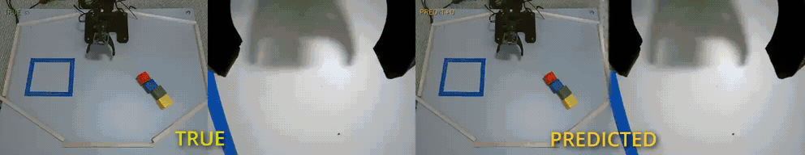
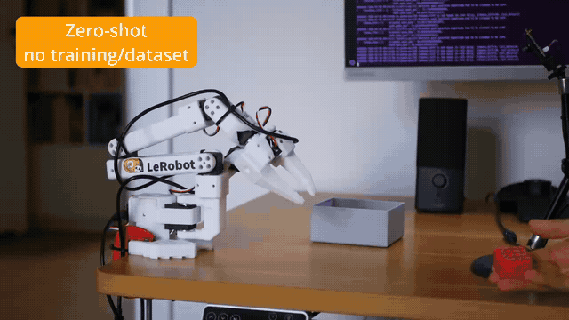
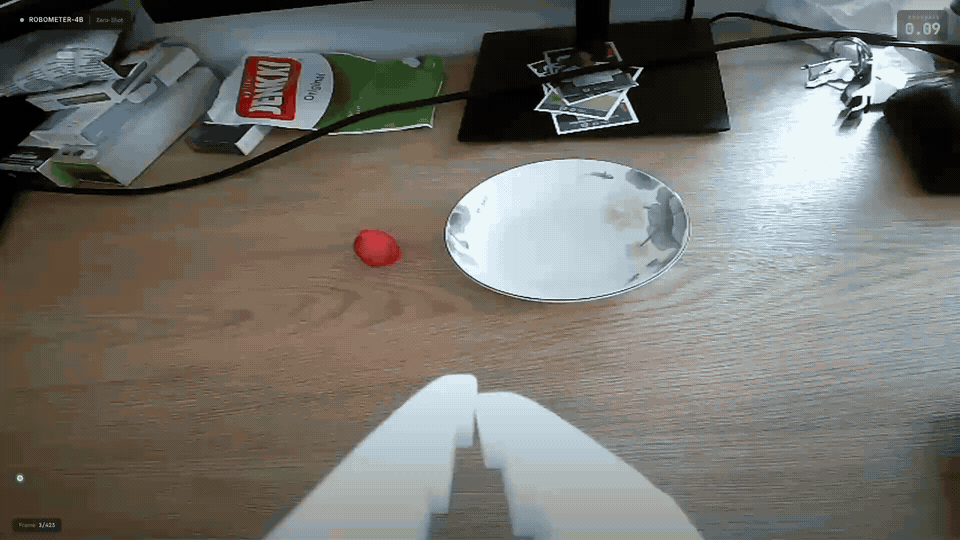
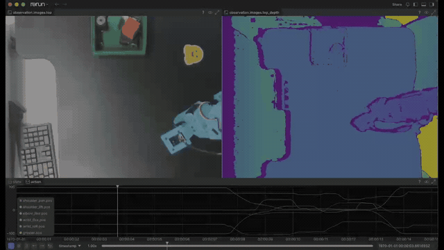
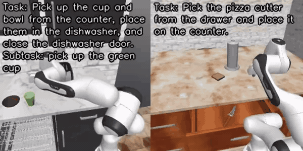
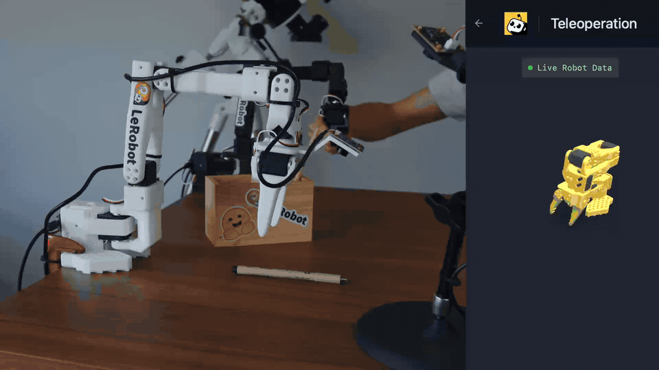

---
authors:
- aitoboxrobot
categories:
- arXiv论文
date: 2026-08-07
hide:
- navigation
tags:
- LeRobot
- 机器人学习
- 世界模型
- VLA模型
- 强化学习
title: LeRobot v0.6.0：想象、评估、改进
---
### 文章背景与核心概要
LeRobot v0.6.0 标志着机器人学习闭环的重大完善。通过引入在行动前模拟未来的世界模型、用于自动化成功检测的强大奖励模型，以及带有 DAgger 式人类纠错功能的全新部署命令行工具（`lerobot-rollout`），该版本显著提升了机器人的泛化与自适应能力。

此次更新集成了六大全新仿真基准测试、端到端深度感知、基于 VLM（视觉语言模型）的数据集自动标注、灵活的视频编码选项、FSDP 与 Hugging Face Jobs 云端训练，并带来了更精简、更快速的安装框架。无论是研究人员还是开发者，都能借助这套强大的工具链轻松训练、评估和部署新一代开源机器人模型。

---

## 📋 目录 (Table of Contents)

- [一分钟速览](#tldr)
- [世界模型：会想象未来的策略](#world-models-policies-that-imagine)
  - [VLA-JEPA](#vla-jepa)
  - [LingBot-VA](#lingbot-va)
  - [FastWAM](#fastwam)
- [VLA 模型：模型动物园不断扩充](#vlas-the-model-zoo-keeps-growing)
  - [GR00T N1.7](#gr00t-n17)
  - [MolmoAct2](#molmoact2)
  - [EO-1](#eo-1)
  - [多任务 DiT (Multitask DiT)](#multitask-dit)
  - [EVO1](#evo1)
- [奖励模型：让机器人知道何时成功](#reward-models-knowing-when-your-robot-succeeds)
  - [Robometer](#robometer)
  - [TOPReward](#topreward)
- [数据集：加载更快，数据更丰富](#datasets-faster-loading-richer-data)
  - [自定义编解码器](#your-codec-your-rules)
  - [端到端深度支持](#depth-support-end-to-end)
  - [大规模语言标注](#language-annotations-at-scale)
  - [高达 2 倍的数据加载速度](#up-to-2x-faster-data-loading)
- [基准测试：一个 CLI 评估所有模型](#benchmarks-one-cli-to-evaluate-them-all)
- [训练与推理](#training--inference)
  - [`lerobot-rollout`：专属的部署 CLI](#lerobot-rollout-deployment-gets-its-own-cli)
  - [FSDP：训练超出 GPU 容量的大模型](#fsdp-train-models-bigger-their-gpu)
  - [使用 HF Jobs 进行云端训练](#cloud-training-with-hf-jobs)
- [代码库、社区与生态系统](#codebase-community--ecosystem)

---

## 🚀 一分钟速览 (TL;DR)

LeRobot v0.6.0 引入了具备“想象”未来能力的具身世界模型策略（VLA-JEPA、FastWAM、LingBot-VA）、一大批全新的 VLA 模型（GR00T N1.7、MolmoAct2、EO-1、EVO1、Multitask DiT），以及全新的奖励模型 API（Robometer、TOPReward）。它内置了统一在 `lerobot-eval` 下的六大仿真基准测试、支持 DAgger 式人类纠错的 `lerobot-rollout` CLI、FSDP 训练以及 HF Jobs 云端训练。此外，数据集现已支持深度信息、自动语言标注管线、自定义视频编码，数据加载速度最高提升 2 倍，且安装过程更加轻量。


> ## 🚀 TL;DR
> 
> LeRobot v0.6.0 introduces world model policies (VLA-JEPA, FastWAM, LingBot-VA) that learn to imagine the future, a wave of new VLAs (GR00T N1.7, MolmoAct2, EO-1, EVO1, Multitask DiT), and a new reward models API (Robometer, TOPReward). It ships six new simulation benchmarks unified under `lerobot-eval`, the `lerobot-rollout` CLI with DAgger-style human-in-the-loop corrections, FSDP training, and cloud training on HF Jobs. Datasets get depth support, an automatic language annotation pipeline, custom video encoding, and up to 2x faster data loading, all on top of a leaner installation.
> 
> 

---

## 🌍 世界模型：会想象未来的策略

机器人学界正在探讨一个核心问题：世界模型究竟能否提升机器人的策略性能？v0.6.0 为 LeRobot 带来了三款策略模型来帮助回答这一问题。它们在训练过程中均会学习预测未来，并各自通过不同的技术路径降低了“想象”所需的计算开销。

> ## 🌍 World Models: Policies That Imagine
> 
> The robotics world is asking a big question: do world models actually help robot policies? v0.6.0 brings three policies to LeRobot to help answer that question. Each one learns to imagine the future as part of its training, and each takes a different path to keep that imagination affordable.

### VLA-JEPA
VLA-JEPA 教导紧凑型 VLA（基于 Qwen3-VL-2B 构建）在学习行动的同时在隐空间中预测未来：在训练期间，JEPA 世界模型必须根据模型自身的动作来预判接下来的画面。其精妙之处在于，世界模型在推理阶段会直接消失，从而在零额外推理开销的前提下获得世界模型的监督能力。目前 Hub 上已上线三个可直接使用的检查点（Checkpoints），包括用于微调的 DROID 预训练基础模型：

> ### VLA-JEPA
> VLA-JEPA teaches a compact VLA (built on Qwen3-VL-2B) to predict the future in latent space while it learns to act: during training, a JEPA world model has to anticipate upcoming frames from the model's own actions. The trick is that the world model then disappears at inference, so you get world-model supervision at zero extra inference cost. Three ready-to-use checkpoints are on the Hub, including a DROID-pretrained base for fine-tuning:

```bash
lerobot-train \
  --policy.path=lerobot/VLA-JEPA-Pretrain \
  --dataset.repo_id=${HF_USER}/my_dataset \
  --policy.repo_id=${HF_USER}/my_finetuned_policy
```

查阅 [VLA-JEPA 文档](https://huggingface.co/docs/lerobot/v0.6.0/vla_jepa) 和[论文](https://arxiv.org/abs/2602.10098)了解更多详情。

> Check out the [VLA-JEPA documentation](https://huggingface.co/docs/lerobot/v0.6.0/vla_jepa) and the [paper](https://arxiv.org/abs/2602.10098) to learn more.

### LingBot-VA
LingBot-VA 更进一步：它是一种自回归的视频-动作模型，能够按块（chunk）同时预测未来的视频和动作，并持续将真实观测反馈回来以确保其“想象”符合现实。你甚至可以保存机器人的想象画面（`--policy.save_predicted_video=true`）并将其与实际发生的情况进行对比。推理过程仅需单张 24–32 GB 的 GPU。欲了解技术细节，请参阅[文档](https://huggingface.co/docs/lerobot/v0.6.0/lingbot_va)和[论文](https://arxiv.org/pdf/2601.21998)。

> ### LingBot-VA
> LingBot-VA goes one step further: an autoregressive video-action model that predicts future video and actions together, chunk by chunk, and feeds real observations back in to keep its imagination grounded. You can even save what the robot imagined (`--policy.save_predicted_video=true`) and compare it with what actually happened. Inference runs on a single 24–32 GB GPU. Check out the [documentation](https://huggingface.co/docs/lerobot/v0.6.0/lingbot_va) and the [paper](https://arxiv.org/pdf/2601.21998) for the technical details.



> 

### FastWAM
FastWAM 在其论文标题中抛出了一个问题：世界动作模型真的需要在测试时进行对未来的想象吗？它将一个约 5B 参数的视频生成专家网络与一个紧凑的动作专家网络结合在同一个网络中，使模型能够真正地“构想”自己的 rollout。在推理时，它完全跳过了生成想象的过程，直接对动作块进行去噪。你可以从 [lerobot/fastwam_base](https://huggingface.co/lerobot/fastwam_base) 开始微调，并在[文档](https://huggingface.co/docs/lerobot/v0.6.0/fastwam)中阅读更多内容。

> ### FastWAM
> FastWAM asks the question in its paper title: do world action models need test-time future imagination? It pairs a ~5B video-generation expert with a compact action expert in a single network, so the model literally learns to dream its own rollouts. At inference it skips the dreaming entirely and directly denoises action chunks. Fine-tune it from [lerobot/fastwam_base](https://huggingface.co/lerobot/fastwam_base), and read more in the [documentation](https://huggingface.co/docs/lerobot/v0.6.0/fastwam).

---

## 🤖 VLA 模型：模型动物园不断扩充

> ## 🤖 VLAs: The Model Zoo Keeps Growing

### GR00T N1.7
我们已将 NVIDIA GR00T 集成升级至 GR00T N1.7——NVIDIA 跨具身基础模型的最新开源版本。N1.7 将之前的 VLM 替换为了 Cosmos-Reason2-2B（基于 Qwen3-VL 构建），并连接流匹配（flow-matching）动作头。我们的集成版本已通过与 NVIDIA 原始 Isaac-GR00T 实现的对等测试：输入相同，输出相同。Flash-attention 现在变更为可选依赖，因此直接执行 `pip install 'lerobot[groot]'` 即可开箱即用，并且你可以直接加载 [NVIDIA 发布的检查点](https://huggingface.co/nvidia/GR00T-N1.7-3B)。

> ### GR00T N1.7
> We upgraded our NVIDIA GR00T integration to GR00T N1.7, the newest open generation of NVIDIA's cross-embodiment foundation model. N1.7 swaps the previous VLM for Cosmos-Reason2-2B (built on Qwen3-VL) feeding a flow-matching action head, and our integration is parity-tested against NVIDIA's original Isaac-GR00T implementation: same inputs, same outputs. Flash-attention is now optional, so `pip install 'lerobot[groot]'` just works, and you can load [NVIDIA's published checkpoints](https://huggingface.co/nvidia/GR00T-N1.7-3B) directly.

> **注意：** GR00T N1.7 在 LeRobot 中取代了 N1.5。如果你仍需使用 N1.5，请锁定版本 `lerobot==0.5.1`。
> > **Note:** GR00T N1.7 replaces N1.5 in LeRobot. If you need N1.5, pin `lerobot==0.5.1`.

### MolmoAct2
AI 艾伦研究所（Allen Institute for AI）的视觉-语言-动作模型 MolmoAct2 现已移植到 LeRobot 中，涵盖完整的生命周期：微调（全量或 LoRA）、评估以及真实机器人部署。借助内置校准校正的现成检查点，你可以在 SO-100/101 上实现零样本（Zero-Shot）运行：

> ### MolmoAct2
> MolmoAct2, the Allen Institute for AI's vision-language-action model, is now ported into LeRobot with the full lifecycle covered: fine-tuning (full or LoRA), evaluation, and real-robot deployment. Ready-made checkpoints with calibration correction baked in mean you can run it zero-shot on an SO-100/101:

```bash
lerobot-rollout \
  --policy.path=lerobot/MolmoAct2-SO100_101-LeRobot \
  --robot.type=so100_follower \
  --robot.port=/dev/ttyACM0 \
  --robot.cameras='{cam0: {type: opencv, index_or_path: 0, width: 640, height: 480, fps: 30}, cam1: {type: opencv, index_or_path: 2, width: 640, height: 480, fps: 30}}' \
  --task="pick up the red cube" --duration=30
```

在 bf16 精度下，推理仅需约 12 GB 显存，而 LoRA 微调可在单张 24 GB GPU 上运行。完整部署指南请参阅 [MolmoAct2 文档](https://huggingface.co/docs/lerobot/v0.6.0/molmoact2)。

> Inference fits in ~12 GB at bf16, and LoRA fine-tuning fits on a single 24 GB GPU. See the [MolmoAct2 documentation](https://huggingface.co/docs/lerobot/v0.6.0/molmoact2) for the full deployment guide.



> 

### EO-1
EO-1 是一款在交错视觉-文本-动作数据上进行上游预训练的 VLA 模型，现已加入 LeRobot：它采用 Qwen2.5-VL-3B 骨干网络搭配流匹配动作头，由该论文的作者之一贡献。使用标准的 `--policy.type=eo1` 及 `lerobot-train` 工作流即可对其进行训练。详细信息请参阅[文档](https://huggingface.co/docs/lerobot/v0.6.0/eo1)与[论文](https://arxiv.org/abs/2508.21112)。

> ### EO-1
> EO-1, a VLA pretrained upstream on interleaved vision-text-action data, joins LeRobot: a Qwen2.5-VL-3B backbone with a flow-matching action head, contributed by one of the paper's own authors. Train it with the standard `lerobot-train` workflow using `--policy.type=eo1`. Details in the [documentation](https://huggingface.co/docs/lerobot/v0.6.0/eo1) and the [paper](https://arxiv.org/abs/2508.21112).

### 多任务 DiT (Multitask DiT)
多任务扩散 Transformer（Multitask Diffusion Transformer）策略将 TRI 大型行为模型（Large Behavior Models）的配方引入了 LeRobot：一个参数量约为 4.5 亿的扩散 Transformer，受 CLIP 视觉和语言嵌入的条件约束，使得单一模型能够通过自然语言选择来学习多种任务。它同时支持扩散（diffusion）和流匹配（flow-matching）目标，并且体积足够小，完全可以自行训练。详见[文档](https://huggingface.co/docs/lerobot/v0.6.0/multi_task_dit)。

> ### Multitask DiT
> The Multitask Diffusion Transformer policy brings the TRI Large Behavior Models recipe to LeRobot: a ~450M-parameter diffusion transformer conditioned on CLIP vision and language embeddings, so one model learns many tasks selected via natural language. It supports both diffusion and flow-matching objectives, and it is small enough to train yourself. See the [documentation](https://huggingface.co/docs/lerobot/v0.6.0/multi_task_dit).

### EVO1
VLA 模型并不一定非得体量庞大。EVO1 将其策略压缩至 7.7 亿参数，采用 InternVL3-1B 骨干网络搭配流匹配动作头，体量足够轻量，可在中端 GPU 上进行微调并实时运行。它开箱即用支持两阶段微调和实时分块（Real-Time Chunking）技术。请查阅 [EVO1 文档](https://huggingface.co/docs/lerobot/v0.6.0/evo1)和[论文](https://arxiv.org/abs/2511.04555)。

> ### EVO1
> VLAs don't have to be huge. EVO1 packs its policy into 0.77B parameters, an InternVL3-1B backbone with a flow-matching action head, small enough to fine-tune and run in real time on modest GPUs. It ships with two-stage fine-tuning and Real-Time Chunking support out of the box. See the [EVO1 documentation](https://huggingface.co/docs/lerobot/v0.6.0/evo1) and the [paper](https://arxiv.org/abs/2511.04555).

---

## 🎯 奖励模型：让机器人知道何时成功

> ## 🎯 Reward Models: Knowing When Your Robot Succeeds

成功检测与进度估计一直是机器人学习闭环中的缺失环节，而 v0.6.0 为它们找到了归宿。LeRobot 现在拥有了一个统一的奖励模型 API（`lerobot.rewards`），其设计与策略 API 相呼应。该接口整合了四个奖励模型——包括 HIL-SERL 奖励分类器、SARM，以及两个新成员：

> Success detection and progress estimation are missing pieces in the robot learning loop, and v0.6.0 give them a home. LeRobot now has a unified reward models API (`lerobot.rewards`), mirroring the policies API, with four reward models behind one interface - the HIL-SERL reward classifier, SARM, and two new additions:

### Robometer
Robometer 是一个预训练的通用奖励模型：将 [lerobot/Robometer-4B](https://huggingface.co/lerobot/Robometer-4B) 指向任何 LeRobot 数据集，它就能根据原始视频和语言指令对任务进度及成功率进行打分，无需进行特定任务的训练。它基于 Qwen3-VL-4B 构建，通过对包含超过一百万条机器人轨迹的数据集进行轨迹比较训练而成（[RSS 2026 论文](https://arxiv.org/abs/2603.02115)）。

> ### Robometer
> Robometer is a pretrained, general-purpose reward model: point [lerobot/Robometer-4B](https://huggingface.co/lerobot/Robometer-4B) at any LeRobot dataset and it scores task progress and success from raw video plus a language instruction, with no task-specific training required. It is built on Qwen3-VL-4B and trained via trajectory comparisons over a dataset of more than one million robot trajectories ([RSS 2026 paper](https://arxiv.org/abs/2603.02115)).



> 

### TOPReward
TOPReward 实现了完全的零样本：无需任何奖励权重。它封装了一个现成的 VLM（Qwen3-VL），并根据轨迹视频和任务指令读取词元（token）“True”的对数概率（log-probability）。任何有能力的 VLM 都可以变身为奖励函数。

> ### TOPReward
> TOPReward goes fully zero-shot: no reward weights at all. It wraps an off-the-shelf VLM (Qwen3-VL) and reads the log-probability of the token "True" given the trajectory video and the task instruction. Any capable VLM becomes a reward function.

这两者都附带了标注脚本，可将每帧的进度曲线写入数据集中，为奖励感知行为克隆（RA-BC）、数据集质量检查以及进度叠加视频做好准备。请查阅 [Robometer](https://huggingface.co/docs/lerobot/v0.6.0/robometer) 和 [TOPReward](https://huggingface.co/docs/lerobot/v0.6.0/topreward) 的官方文档。

> Both ship with labeling scripts that write per-frame progress curves into your dataset, ready for reward-aware behavior cloning (RA-BC), dataset quality inspection, and progress-overlay videos. Check the [Robometer](https://huggingface.co/docs/lerobot/v0.6.0/robometer) and [TOPReward](https://huggingface.co/docs/lerobot/v0.6.0/topreward) docs.

---

## 📦 数据集：加载更快，数据更丰富

> ## 📦 Datasets: Faster Loading, Richer Data

### 自定义编解码器
录制过程不再受限于单一的硬编码编解码器。全新的 `--dataset.rgb_encoder.*` 选项暴露了完整的编码配置面（编解码器、质量、像素格式、GOP、预设），且 `vcodec=auto` 会自动探测硬件编码器（如 NVENC、VideoToolbox、VAAPI 和 QSV），如果未找到则回退到默认的软件 AV1 编码器。对于现有数据集，只需一条命令即可完成全部重新编码：

> ### Your Codec, Your Rules
> Recording is no longer stuck with one hard-coded codec. The new `--dataset.rgb_encoder.*` options expose the full encoding surface (codec, quality, pixel format, GOP, presets), and `vcodec=auto` probes for hardware encoders like NVENC, VideoToolbox, VAAPI, and QSV before falling back to the default software AV1 encoder. For existing datasets, one command re-encodes everything:

```bash
lerobot-edit-dataset \
    --repo_id ${HF_USER}/my_dataset \
    --operation.type reencode_videos \
    --operation.rgb_encoder.vcodec h264 \
    --operation.rgb_encoder.crf 23
```

详细信息请参见[视频编码文档](https://huggingface.co/docs/lerobot/v0.6.0/video_encoding_parameters)。

> Full details in the [video encoding documentation](https://huggingface.co/docs/lerobot/v0.6.0/video_encoding_parameters).

### 端到端深度支持
接入 Intel RealSense，设置 `use_depth: true`，LeRobot 即可端到端记录深度图：以毫米为单位捕获，作为紧凑的 12 位深度视频流与 RGB 摄像头一同压缩，并在训练时解码回物理单位。深度图在录制期间以及 `lerobot-dataset-viz` 中均可实时渲染，且支持 SO-100/101、Koch、OpenArm、reBot、Unitree G1 等多种机型。

> ### Depth Support, End to End
> Plug in an Intel RealSense, set `use_depth: true`, and LeRobot records depth maps end to end: captured in millimeters, compressed as compact 12-bit depth video streams alongside your RGB cameras, and decoded back to physical units at training time. Depth renders live during recording and in `lerobot-dataset-viz`, and it works across SO-100/101, Koch, OpenArm, reBot, Unitree G1 and more.



> 

### 大规模语言标注
你的数据集不再局限于每个 Episode 仅有一个任务字符串。LeRobot 数据集现在原生支持存储丰富的语言标注（带时间戳的子任务、计划、记忆、纠错、语音以及每台相机的 VQA 对），并且全新的 `lerobot-annotate` CLI 可以利用监控你数据集的 VLM 自动完成这些标注：

> ### Language Annotations at Scale
> Your dataset stops being one task string per episode. LeRobot datasets now natively store rich language annotations (timestamped subtasks, plans, memory, corrections, speech, and per-camera VQA pairs), and the new `lerobot-annotate` CLI fills them in automatically using a VLM that watches your episodes:

```bash
lerobot-annotate \
    --repo_id=${HF_USER}/my_dataset \
    --new_repo_id=${HF_USER}/my_dataset_annotated \
    --vlm.model_id=Qwen/Qwen2.5-VL-7B-Instruct \
    --push_to_hub=true
```

随后，YAML 规则层会在采样时将这些标注渲染为聊天风格的训练消息——这正是未来长视距、具备对话能力的机器人策略所要训练的数据类型。借助 HF Jobs 还可以进行规模化处理，欲了解更多信息，请阅读[标注管线文档](https://huggingface.co/docs/lerobot/v0.6.0/annotation_pipeline)。

> A YAML recipe layer then renders these annotations into chat-style training messages at sample time: exactly the data tomorrow's long-horizon, talking robot policies will train on. Scale it up with HF Jobs, and read the [annotation pipeline docs](https://huggingface.co/docs/lerobot/v0.6.0/annotation_pipeline) to learn more.

### 高达 2 倍的数据加载速度
基于视频数据集的训练速度现已实现开箱约 2 倍的提升：多路摄像头帧支持并行解码，数据加载器工作进程传输紧凑的 uint8 帧（进程间内存占用减少 4 倍），且持久化工作进程（persistent workers）在各个 epoch 之间保持解码器缓存处于活跃状态。加载大型数据集的子集（`episodes=[...]`）耗时从数分钟缩短至毫秒级别（在我们的基准测试中从 275 秒降至 0.06 秒）。采样现在也具备确定性且可恢复，因此中断的训练可以准确从原采样点重启。

> ### Up to 2x Faster Data Loading
> Training on video datasets is now up to ~2x faster out of the box: multi-camera frames decode in parallel, dataloader workers ship compact uint8 frames (4x less memory between processes), and persistent workers keep decoder caches alive across epochs. Loading a subset of a large dataset (`episodes=[...]`) went from minutes to milliseconds (275 s down to 0.06 s in our benchmark). Sampling is also deterministic and resumable now, so interrupted trainings restart sample-exact.

---

## 📊 基准测试：一个 CLI 评估所有模型

> ## 📊 Benchmarks: One CLI to Evaluate Them All

v0.5.0 奠定了 LeRobot 作为 VLA 评估中心的地位，而 v0.6.0 则通过六大全新仿真基准测试让其名副其实。所有这些基准测试均可通过同一个 `lerobot-eval` CLI 运行，且每个基准测试都配有文档页面、Docker 镜像以及在 CI 中进行冒烟测试的 SmolVLA 基准检查点：

> v0.5.0 planted the flag on LeRobot as an evaluation hub for VLAs; v0.6.0 makes it the real deal with six new simulation benchmarks, all runnable through the same `lerobot-eval` CLI, each with a docs page, a Docker image, and a SmolVLA baseline checkpoint smoke-tested in CI:

- [LIBERO-plus](https://huggingface.co/docs/lerobot/v0.6.0/libero_plus) 从光照、相机视角到重写指令等七个维度，用大约 10,000 种 LIBERO 的扰动变体对 VLA 进行压力测试。它能告诉你策略在何时失效。
- [RoboTwin 2.0](https://huggingface.co/docs/lerobot/v0.6.0/robotwin) 涵盖了 SAPIEN 上的 50 个双臂操作任务，具有重大的域随机化（domain randomization），并在 Hub 上提供了[超过 10 万条可直接训练的轨迹](https://huggingface.co/datasets/lerobot/robotwin_unified)。
- [RoboCasa365](https://huggingface.co/docs/lerobot/v0.6.0/robocasa) 包含移动机械臂在 2,500 个程序化生成的厨房环境中的 365 项厨房任务，是我们产品线中任务面最广的基准。
- [RoboCerebra](https://huggingface.co/docs/lerobot/v0.6.0/robocerebra) 评估长视距（long-horizon）行为，其 Episode 在基于语言基础的中级指令下串联 3 到 6 个子目标，并附带一个 6,660-episode 的数据集。
- [RoboMME](https://huggingface.co/docs/lerobot/v0.6.0/robomme) 是一项记忆考试：你的策略能否计算重复次数、追踪隐藏物体并模仿所演示的流程？它包含 4 个记忆套件下的 16 个任务。
- [VLABench](https://huggingface.co/docs/lerobot/v0.6.0/vlabench) 测试操作中的知识与推理能力，从物理学问题到端到端冲咖啡等复合任务。

> - [LIBERO-plus](https://huggingface.co/docs/lerobot/v0.6.0/libero_plus) stress-tests VLAs with roughly 10,000 perturbed variants of LIBERO across seven axes, from lighting and camera viewpoints to rewritten instructions. It tells you when a policy breaks.
> - [RoboTwin 2.0](https://huggingface.co/docs/lerobot/v0.6.0/robotwin) covers 50 bimanual manipulation tasks on SAPIEN with heavy domain randomization, and comes with [more than 100k ready-to-train trajectories](https://huggingface.co/datasets/lerobot/robotwin_unified) on the Hub.
> - [RoboCasa365](https://huggingface.co/docs/lerobot/v0.6.0/robocasa) spans 365 kitchen tasks in 2,500 procedurally generated kitchens on a mobile manipulator, the largest task surface in our lineup.
> - [RoboCerebra](https://huggingface.co/docs/lerobot/v0.6.0/robocerebra) evaluates long-horizon behavior with episodes that chain 3 to 6 sub-goals under language-grounded intermediate instructions, plus a 6,660-episode dataset.
> - [RoboMME](https://huggingface.co/docs/lerobot/v0.6.0/robomme) is a memory exam: can your policy count repetitions, track hidden objects, and imitate demonstrated procedures? 16 tasks across 4 memory suites.
> - [VLABench](https://huggingface.co/docs/lerobot/v0.6.0/vlabench) tests knowledge and reasoning in manipulation, from physics questions to composite tasks like brewing coffee end to end.

```bash
lerobot-eval \
  --policy.path=lerobot/smolvla_robotwin \
  --env.type=robotwin \
  --env.task=beat_block_hammer \
  --eval.n_episodes=100 --eval.batch_size=1
```

模拟器后端需要特定的系统依赖以及各自的安装步骤；每个文档页面都提供了确切的操作指南，如果你想跳过配置，每个基准测试也都发布了现成的 Docker 镜像。

> Simulator backends require specific system dependencies with their own install steps; each docs page has the exact recipe, and every benchmark ships a ready-made Docker image if you'd rather skip the setup.

连同 LIBERO、Meta-World 和 NVIDIA IsaacLab-Arena 在内，这使得我们拥有了归于同一屋檐下的九大家族基准测试，并且全新的[添加新基准指南](https://huggingface.co/docs/lerobot/v0.6.0/adding_benchmarks)详细记录了如何接入你自己的基准。评估速度同样得到了提升：并行评估现在默认采用异步向量化环境，经基准测试速度最高提升达 2 倍。

> Together with LIBERO, Meta-World, and NVIDIA IsaacLab-Arena, that makes nine benchmark families under one roof, and a new [Adding a New Benchmark guide](https://huggingface.co/docs/lerobot/v0.6.0/adding_benchmarks) documents exactly how to plug in yours. Evaluation also got faster: parallel eval now defaults to async vectorized environments, benchmarked at up to 2x faster.



> 

---

## ⚡ 训练与推理

> ## ⚡ Training & Inference

### `lerobot-rollout`：专属的部署 CLI
过去，部署策略往往是在 `lerobot-record` 基础上的临时黑客做法。全新的 `lerobot-rollout` CLI 使部署成为一个独立的工作流，支持可插拔的策略和推理后端（包括针对运行较慢的兼容 VLA 的实时分块技术）。`base` 策略仅负责运行策略；`sentry` 持续录制，在运行过程中循环保存 episode 并上传至 Hub；`highlight` 维护一个环形缓冲区（ring buffer），在你按下按键时保存最后 N 秒的内容，确保精彩瞬间绝不丢失；`episodic` 则沿用了传统的 episode/reset 录制工作流；而 `dagger` 则将部署转变成了数据采集过程。

> ### `lerobot-rollout`: Deployment Gets Its Own CLI
> Deploying a policy used to be a hack on top of `lerobot-record`. The new `lerobot-rollout` CLI makes deployment its own workflow, with pluggable strategies and inference backends (including Real-Time Chunking for slow compatible VLAs). The `base` strategy just runs the policy. `sentry` records continuously, rotating episodes and uploading to the Hub as it goes. `highlight` keeps a ring buffer and saves the last N seconds when you hit a key, so an interesting moment is never lost. `episodic` mirrors the classic episode/reset recording workflow. And `dagger` turns deployment into data collection.

在 DAgger 策略下，你可以观察策略运行，在它出错的瞬间按下按键（或 USB 脚踏板），用你的主臂（leader arm）接管并录制纠正动作，然后再把控制权交还。在接管之前，具动主臂（actuated leaders）会被自动驱动至跟随臂（follower's pose）的姿态，从而实现无冲击的平滑交接。每个纠正帧都会被标记上 `intervention` 标志，生成的数据集可以直接用于下一次微调：

> With the DAgger strategy, you watch your policy run, hit a key (or a USB foot pedal) the moment it goes wrong, take over with your leader arm to record the correction, and hand control back. Actuated leaders are driven to the follower's pose before you take over, so the handover is jerk-free. Every correction frame is tagged with an `intervention` flag, and the resulting dataset is ready for the next fine-tune:

```bash
lerobot-rollout \
    --strategy.type=dagger \
    --policy.path=${HF_USER}/my_policy \
    --robot.type=so100_follower \
    --robot.port=/dev/ttyACM0 \
    --teleop.type=so101_leader \
    --teleop.port=/dev/ttyACM1 \
    --dataset.repo_id=${HF_USER}/dagger_corrections \
    --dataset.single_task="Grasp the block"
```

部署、收集纠正数据、微调、重复：机器人学习的飞轮现在只需一个 CLI 参数即可驱动。请阅读[部署文档](https://huggingface.co/docs/lerobot/v0.6.0/inference)。

> Deploy, collect corrections, fine-tune, repeat: the robot learning flywheel is now a CLI flag. Read the [deployment docs](https://huggingface.co/docs/lerobot/v0.6.0/inference).

### FSDP：训练超出 GPU 容量的大模型
机器人基础模型的体量正在超越单块 GPU 的显存极限。LeRobot 的训练现在通过 Accelerate 支持了 FSDP（完全分片数据并行，fully sharded data parallel）：参数、梯度和优化器状态在多块 GPU 之间进行分片，检查点会被重新聚合为标准的单文件 `model.safetensors`，像加载任何其他策略一样加载。你甚至可以在不同数量的 GPU 上恢复 FSDP 运行。请参阅[多 GPU 训练文档](https://huggingface.co/docs/lerobot/v0.6.0/multi_gpu_training)。

> ### FSDP: Train Models Bigger Than Your GPU
> Robot foundation models are outgrowing single GPUs. LeRobot training now supports FSDP (fully sharded data parallel) through Accelerate: parameters, gradients, and optimizer state are sharded across GPUs, and checkpoints are gathered back into a plain single-file `model.safetensors` that loads like any other policy. You can even resume an FSDP run on a different number of GPUs. See the [multi-GPU training docs](https://huggingface.co/docs/lerobot/v0.6.0/multi_gpu_training).

### 使用 HF Jobs 进行云端训练
没有 GPU？没问题。现在只需添加一个参数，完全相同的 `lerobot-train` 命令即可在云端运行：

> ### Cloud Training with HF Jobs
> No GPU? No problem. The exact same `lerobot-train` command now runs in the cloud by adding one flag:

```bash
lerobot-train \
  --dataset.repo_id=${HF_USER}/so101_test \
  --policy.type=act \
  --policy.repo_id=${HF_USER}/my_policy \
  --job.target=a10g-small
```

如有必要，LeRobot 会将你的本地数据集推送到私有的 Hub 仓库，提交任务，将日志实时输出到终端，并在结束时将训练好的策略推送到 Hub。通过 `--job.target`，你可以从 T4 一直选到 8x H200（计算费用按实际使用量计费）。[查看相关文档](https://huggingface.co/docs/lerobot/v0.6.0/hardware_guide#hugging-face-jobs)。

> LeRobot pushes your local dataset to a private Hub repo if needed, submits the job, streams logs to your terminal, and pushes the trained policy to the Hub at the end. Pick anything from a T4 to 8x H200 with `--job.target` (compute is billed pay-as-you-go). [Check out the documentation](https://huggingface.co/docs/lerobot/v0.6.0/hardware_guide#hugging-face-jobs).

---

## 🛠️ 代码库、社区与生态系统

> ## 🛠️ Codebase, Community & Ecosystem

- **更轻量的安装：** `pip install lerobot` 现在真正变得轻量，基础依赖项减少了约 40%。按功能划分的扩展包（如 `[training]`、`[core_scripts]`、`[evaluation]` 等）覆盖了其余需求。
- **PyTorch 与混合精度：** 支持的 PyTorch 版本更新至 2.7–2.11，并开箱锁定了 CUDA 12.8 版本的 wheel 包。`--policy.dtype=bfloat16` 可驱动真正的混合精度训练。
- **可视化：** `--display_mode=foxglove` 可将遥测数据直接流式传输至 [Foxglove](https://foxglove.dev)，且 `lerobot-dataset-viz` 获得了支持拖动定位的流畅回放功能。
- **LeLab：** 将整个 LeRobot 工作流（校准、遥操作、录制、本地或在 HF Jobs 上训练、部署）集成到面向 SO-ARM101 的浏览器 UI 中。[快来体验吧！](https://github.com/huggingface/leLab)
- **Isaac 遥操作：** 通过 CloudXR/OpenXR，利用[ NVIDIA 的 Isaac Teleop 栈](https://github.com/NVIDIA/IsaacTeleop)通过 VR 手柄遥操作 SO-101。

> - **Leaner Installation:** `pip install lerobot` is now genuinely lightweight, with roughly 40% fewer base dependencies. Feature-scoped extras (`[training]`, `[core_scripts]`, `[evaluation]`, ...) cover the rest.
> - **PyTorch & Mixed Precision:** Supported PyTorch moves to 2.7–2.11, with CUDA 12.8 wheels pinned out of the box. `--policy.dtype=bfloat16` drives real mixed-precision training.
> - **Visualization:** `--display_mode=foxglove` streams telemetry directly to [Foxglove](https://foxglove.dev), and `lerobot-dataset-viz` gets scrubbable playback.
> - **LeLab:** Puts the entire LeRobot workflow (calibrate, teleoperate, record, train locally or on HF Jobs, deploy) into a browser UI for the SO-ARM101. [Try it out!](https://github.com/huggingface/leLab)
> - **Isaac Teleop:** Teleoperate an SO-101 with a VR controller through [NVIDIA's Isaac Teleop stack](https://github.com/NVIDIA/IsaacTeleop) over CloudXR/OpenXR.



> 

---

## 🎉 结语

除了这些重磅功能外，v0.6.0 还包含整个代码库中的数百个错误修复、文档改进和用户体验升级，从更智能的默认配置到更可靠的 CI。

> ## 🎉 Final Thoughts
> 
> Beyond these headline features, v0.6.0 includes hundreds of bug fixes, documentation improvements, and quality-of-life upgrades across the codebase, from smarter defaults to more reliable CI.

我们要向社区中的每一个人表达由衷的感谢。本版本的发布凝聚了来自学术界、工业界以及爱好者团队的成果，他们选择将 LeRobot 作为其模型和基准的归宿。每一个 PR 和错误报告都在推动开源机器人技术不断向前发展。

> We want to extend a huge thank you to everyone in the community. This release includes work from academia, industry and hobbyist teams who chose LeRobot as the home for their models and benchmarks. Every PR and bug report pushes open-source robotics forward.

敬请期待更多精彩内容 🤗 立即[在此处](https://github.com/huggingface/lerobot)开始使用！  
– LeRobot 团队 ❤️

> Stay tuned for more to come 🤗 Get started [here](https://github.com/huggingface/lerobot)!  
> – The LeRobot team ❤️