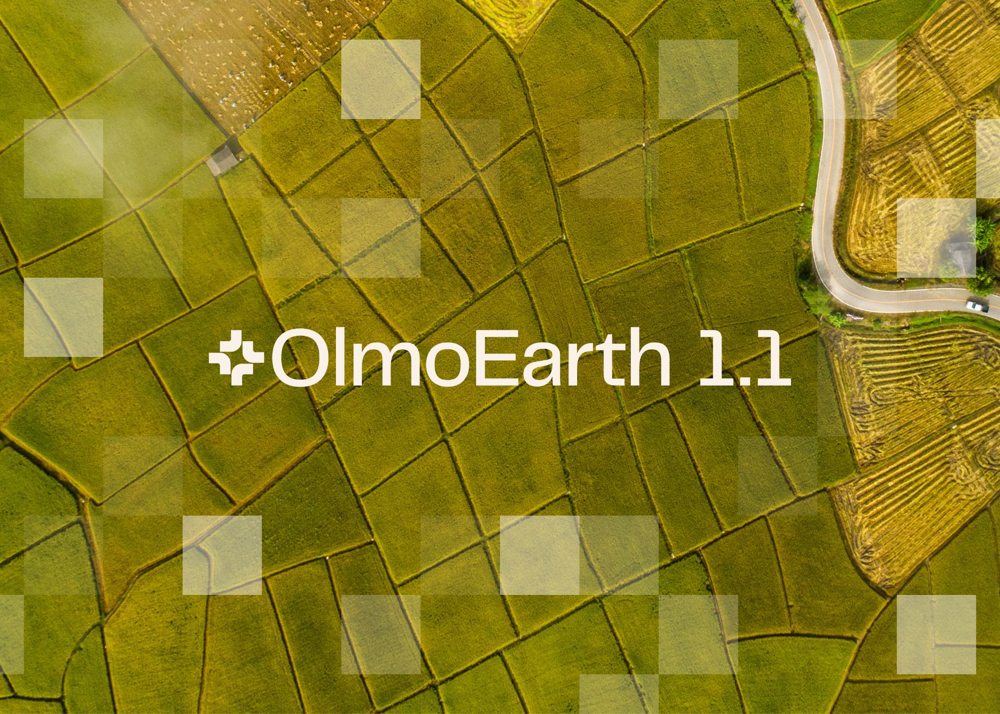
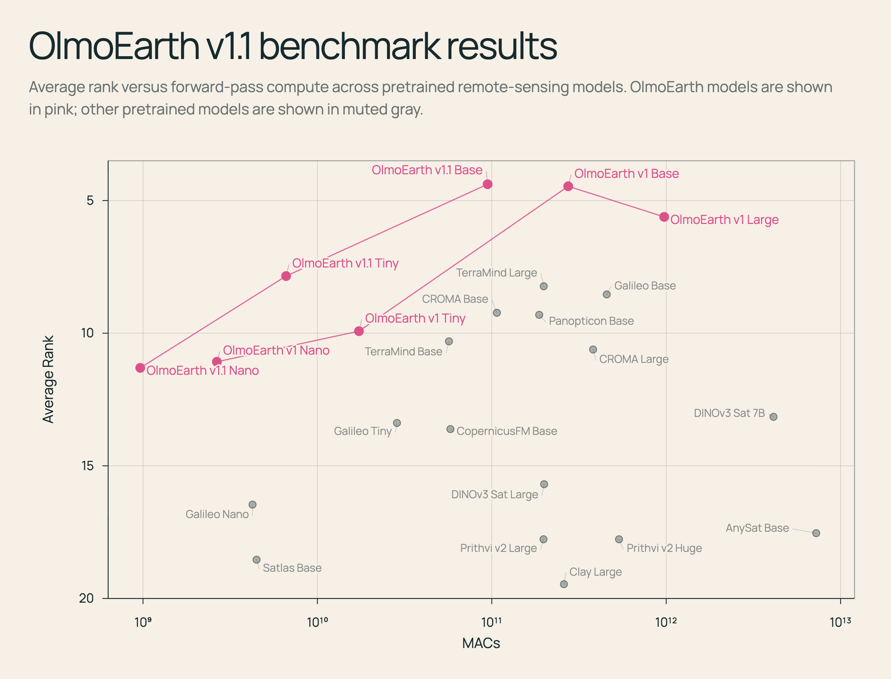
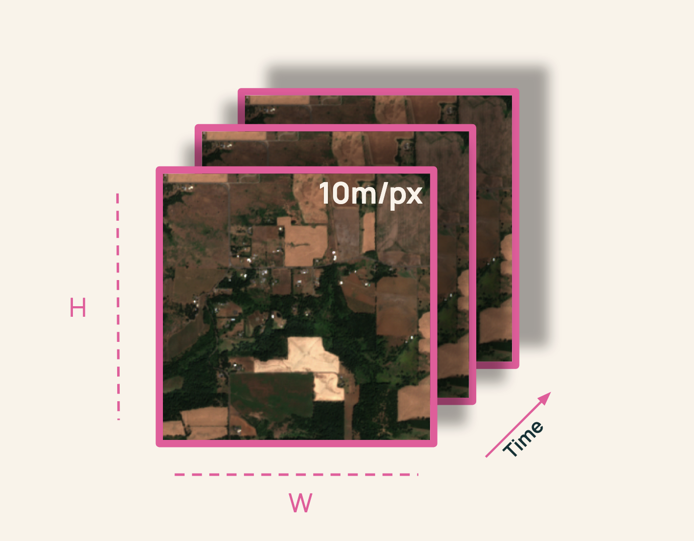
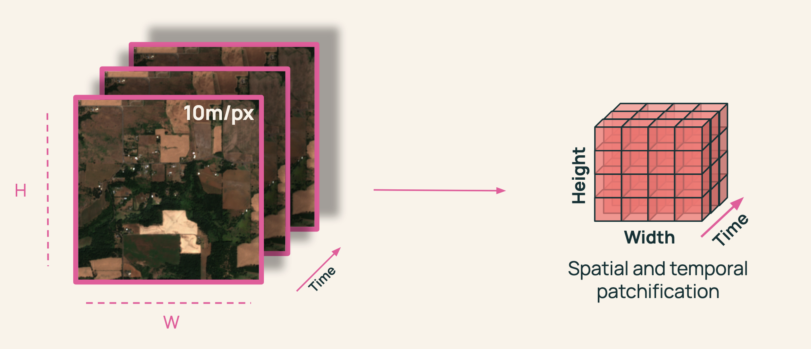

---
authors:
- aitoboxrobot
categories:
- arXiv论文
date: 2026-08-07
hide:
- navigation
tags:
- 地球观测
- 遥感
- 基础模型
- 人工智能
- 效率优化
title: OlmoEarth v1.1：一个更高效的地球观测模型家族
---
### 文章背景与核心概要
艾伦人工智能研究所（Allen Institute for AI）推出了 **OlmoEarth v1.1**，这是一个专为极致效率而设计的开源地球观测基础模型家族的更新版本。在继承 2025 年 11 月发布的 OlmoEarth v1 成功经验的基础上，1.1 版本在保持多个遥感基准测试和真实世界任务中具有竞争力的性能的同时，将计算成本降低了高达 **3 倍**。通过重新架构卫星数据 Token（标记）的处理方式并优化预训练方案，OlmoEarth v1.1 让全球规模的地理空间监测对于研究人员和开发者来说变得更快、更便宜且更易于访问。

本文深入探讨了 OlmoEarth v1.1 的技术改进，特别是通过减少序列长度来提高效率、优化 Token 设计的策略，以及这些改进如何惠及开发者和研究人员。

---

# OlmoEarth v1.1: A More Efficient Family of Earth Observation Models

**Published:** May 19, 2026 | **Author:** Kyle Wiggers (Ai2Comms / Allen Institute for AI)  
🧠 **Models:** [Hugging Face Collection](https://huggingface.co/collections/allenai/olmoearth) | 📄 **Tech Report:** [AllenAI Papers](https://allenai.org/papers/olmoearth_v1_1) | 💻 **Code:** [GitHub Repository](https://github.com/allenai/olmoearth_pretrain)

---

## Summary

艾伦人工智能研究所发布了 **OlmoEarth v1.1**，这是一个专为极致效率而设计的开源地球观测基础模型家族的更新版本。在继承 2025 年 11 月发布的 OlmoEarth v1 成功经验的基础上，1.1 版本在保持多个遥感基准测试和真实世界任务中具有竞争力的性能的同时，将计算成本降低了高达 **3 倍**。通过重新架构卫星数据 Token 的处理方式并优化预训练方案，OlmoEarth v1.1 让全球规模的地理空间监测对于研究人员和开发者来说变得更快、更便宜且更易于访问。

> The Allen Institute for AI has released **OlmoEarth v1.1**, an updated family of open-source Earth observation foundation models designed for extreme efficiency. Building on the success of OlmoEarth v1 (released in November 2025), version 1.1 cuts computing costs by up to **3x** while retaining competitive performance across a variety of remote sensing benchmarks and real-world tasks. By re-architecting how satellite data tokens are handled and optimizing the pre-training regimen, OlmoEarth v1.1 makes planetary-scale geospatial monitoring faster, cheaper, and more accessible for researchers and developers alike.

---

## Introduction

自 2025 年 11 月发布 OlmoEarth (v1) 以来，合作伙伴已将这些模型应用于广泛的任务中——从追踪红树林变化、对森林消失的驱动因素进行分类，到在几天内制作出国家尺度的农作物类型地图。这些部署跨越了国家、大陆和全球尺度，使我们离提供最先进的 AI 来保护我们星球的使命更近了一步。

> Since the release of OlmoEarth (v1) in November 2025, partners have applied the models to a wide range of tasks—from tracking mangrove changes and classifying drivers of forest loss to producing country-scale crop-type maps in a matter of days. These deployments span national, continental, and global scales, bringing us closer to our mission of providing state-of-the-art AI to communities protecting our planet.

当 [OlmoEarth](https://olmoearth.allenai.org/) 处理数万到数十万平方公里的卫星影像时，效率就是一切。在整个生命周期中——数据导出、预处理、推理和后处理——计算构成了最高的运营成本。更高效的模型使我们能够在 OlmoEarth 平台上支持更多的合作伙伴，并赋能独立用户更快、更经济地扩展地理空间工作流。

> When [OlmoEarth](https://olmoearth.allenai.org/) processes satellite imagery across tens to hundreds of thousands of square kilometers, efficiency is everything. Across the entire lifecycle—data export, preprocessing, inference, and post-processing—compute represents the highest operating cost. A more efficient model allows us to support more partners on the OlmoEarth Platform and empowers independent users to scale geospatial workflows faster and more economically.

为了实现这一点，我们构建了 **[OlmoEarth v1.1](https://huggingface.co/collections/allenai/olmoearth)**，这是一个新的模型家族，它在不牺牲 OlmoEarth v1 性能的前提下，将计算成本降低了高达 **3 倍**。

> To achieve this, we built **[OlmoEarth v1.1](https://huggingface.co/collections/allenai/olmoearth)**, a new model family that reduces compute costs by up to **3x** without sacrificing the performance of OlmoEarth v1.

---

## Increasing Efficiency by Decreasing Sequence Lengths

OlmoEarth 模型依赖于 Transformer 架构，通过首先将遥感输入转换为 *Token* 序列来处理它们。

> OlmoEarth models rely on the Transformer architecture, processing remote sensing inputs by first converting them into sequences of *tokens*. 

Transformer 中的效率主要受两个杠杆控制：
1. **模型大小：**（我们发布了多种尺寸，以便用户匹配其计算预算）。
2. **Token 序列长度：** 计算成本随序列长度呈二次方增长，这意味着即使是适度的缩减也能带来显着的性能和成本收益。

> Efficiency in transformers is primarily governed by two levers:
> 1. **Model size:** (We release multiple sizes so users can match their compute budget).
> 2. **Token sequence length:** Compute costs scale quadratically with sequence length, meaning even modest reductions yield significant performance and cost gains.

> *MACs（乘积累加运算）用于估计每个模型前向传递的计算量；较低的 MACs 意味着更便宜、更快的推理。Y 轴是倒置的（较低的平均排名更好）。*

> *MACs (multiply-accumulate operations) estimate computation per model forward pass; lower MACs mean cheaper, faster inference. The y-axis is inverted (lower average rank is better).*

---

## Designing the Token

对于基于 Transformer 的遥感模型来说，一个基本的架构选择是确定**单个 Token 应该代表什么**。

> A fundamental design choice for transformer-based remote sensing models is determining **what a single token should represent.**

考虑 Sentinel-2 影像，这是一种包含空间高度和宽度 ($H, W$)、时间维度 ($T$) 以及 12 个光谱通道（[*H, W, T, D=12*]）的主要输入模态。

> Consider Sentinel-2 imagery, a primary input modality containing a spatial height and width ($H, W$), a temporal dimension ($T$), and 12 spectral channels ([*H, W, T, D=12*]).

传统上，我们将数据分割成空间大小为 $p \times p$ 的*基于分辨率的补丁（patches）*：

> Traditionally, we split the data into *resolution-based patches* of spatial size $p \times p$:

对于每个补丁，以往的模型会为每个时间步、每个分辨率创建一个 Token（例如，2 个时间步 $\times$ 10m、20m 和 60m 的 3 种分辨率，每个补丁产生 6 个 Token）。

> For each patch, models historically created a token per timestep per resolution (e.g., 2 timesteps $\times$ 3 resolutions at 10m, 20m, and 60m yielding 6 tokens per patch). 

虽然像 [Galileo](https://arxiv.org/abs/2502.09356) 和 [SatMAE](https://arxiv.org/abs/2207.08051) 这样的模型为每个分辨率使用独特的 Token 并取得了出色的结果，但其他模型如 [CROMA](https://arxiv.org/abs/2311.00566) 将波段合并为单个 Token。由于 Token 数量呈乘法级数缩放，将分辨率合并为一个 Token 可以产生**少三倍的 Token**，从而在预训练、微调和推理过程中带来复合节约。

> While models like [Galileo](https://arxiv.org/abs/2502.09356) and [SatMAE](https://arxiv.org/abs/2207.08051) use unique tokens per resolution with strong results, others like [CROMA](https://arxiv.org/abs/2311.00566) collapse bands into a single token. Because token counts scale multiplicatively, merging resolutions into a single token produces **three times fewer tokens**, resulting in compounding savings across pre-training, fine-tuning, and inference.

然而，幼稚的 Token 合并会导致性能下降——例如在 m-eurosat kNN 基准测试上下降了 10 ppt。我们假设将 Sentinel-2 波段分离为不同的 Token 有助于模型学习关键的跨波段关系。

> However, a naive token merger leads to performance drops—such as a 10 ppt drop on the m-eurosat kNN benchmark. We hypothesize that separating Sentinel-2 bands into distinct tokens helps models learn critical cross-band relationships. 

正如我们的技术论文中所详细介绍的那样，要在**不牺牲**性能的情况下成功合并这些 Token，需要修改我们的预训练策略。

> Successfully merging these tokens **without** sacrificing performance required modifying our pre-training strategy, as detailed in our technical paper.

---

## For Developers

OlmoEarth v1.1 以更少的资源实现更多功能。在每个层级上，新模型的运行成本比 v1 便宜高达三倍，这使得频繁更新全球地图变得更加经济实惠。

> OlmoEarth v1.1 does more with less. At every tier, the new models operate up to three times cheaper than v1, making frequent planetary map updates vastly more affordable. 

如果您目前使用的是最初的 OlmoEarth 家族，我们鼓励您尝试 v1.1。它以三分之一的计算成本提供可比的性能（尽管在特定任务上可能会出现轻微的性能回归——请查阅我们的技术报告以了解详情）。成功的采用将在微调和推理过程中带来立竿见影的速度提升。

> If you currently use the original OlmoEarth family, we encourage you to try v1.1. It delivers comparable performance at one-third of the computational expense (though minor regressions may occur on specific tasks—consult our technical report for details). Successful adoption will yield immediate speedups during fine-tuning and inference.

---

## For Researchers

预训练的遥感模型具有许多自由度，这在历史上使科学隔离变得复杂。当性能发生变化时，是由架构、数据集还是预训练算法驱动的？

> Pretrained remote sensing models feature many degrees of freedom, which historically complicates scientific isolation. When performance shifts, is it driven by the architecture, the dataset, or the pre-training algorithm?

由于 OlmoEarth v1.1 使用与 v1 完全相同的数据集进行训练，因此任何性能差异都可以直接隔离出我们方法论改进的影响，从而推进对遥感预训练的科学理解。

> Because OlmoEarth v1.1 was trained on the exact same dataset as v1, any performance differentials directly isolate the impact of our methodological improvements, advancing the scientific understanding of remote sensing pre-training.

---

## Get Started

探索 **OlmoEarth v1.1** 生态系统：
* 🧠 **模型权重：** [Hugging Face Collection](https://huggingface.co/collections/allenai/olmoearth)（提供 Base、Tiny 和 Nano 变体）
* 💻 **训练代码与实现：** [GitHub Repository](https://github.com/allenai/olmoearth_pretrain)
* 📄 **技术报告：** [AllenAI Publications](https://allenai.org/papers/olmoearth_v1_1)

> Explore the **OlmoEarth v1.1** ecosystem:
> * 🧠 **Model Weights:** [Hugging Face Collection](https://huggingface.co/collections/allenai/olmoearth) (Base, Tiny, and Nano variants available)
> * 💻 **Training Code & Implementation:** [GitHub Repository](https://github.com/allenai/olmoearth_pretrain)
> * 📄 **Technical Report:** [AllenAI Publications](https://allenai.org/papers/olmoearth_v1_1)