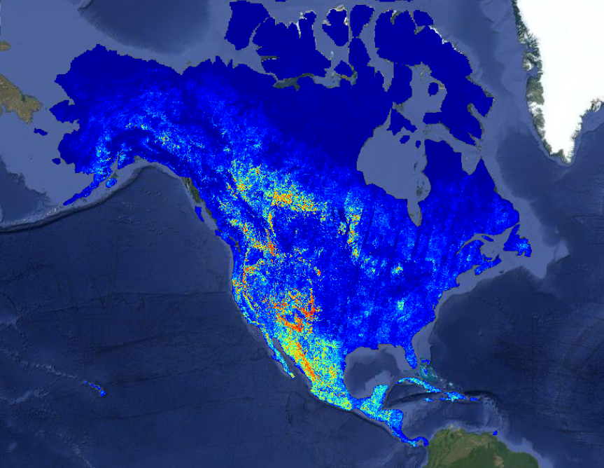
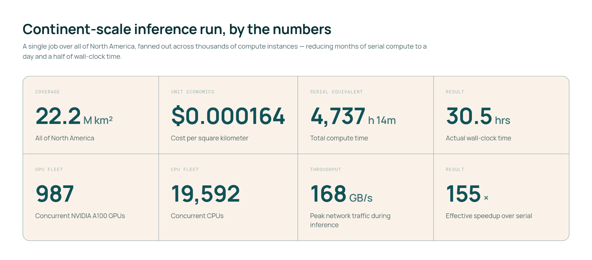
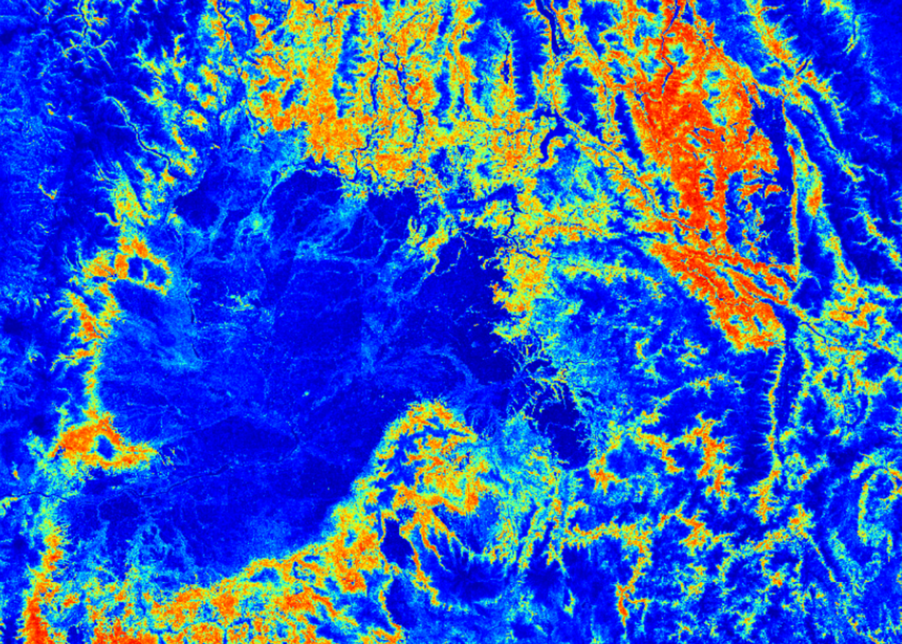
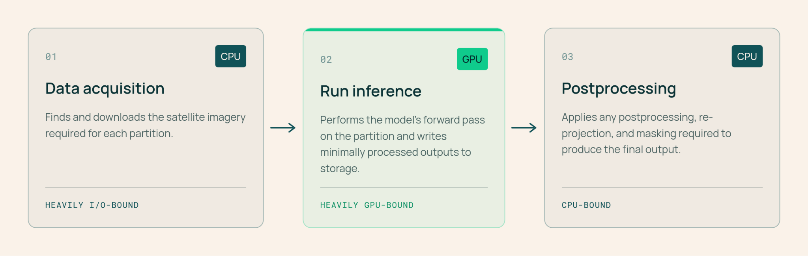
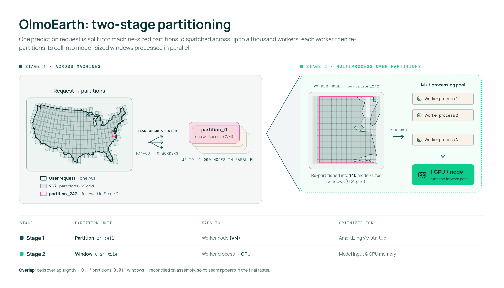
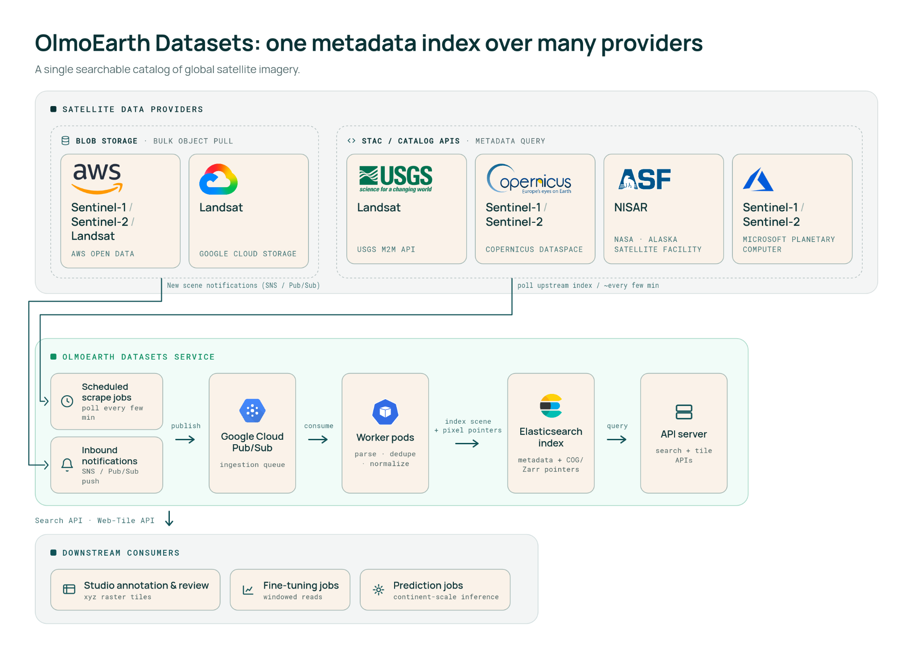
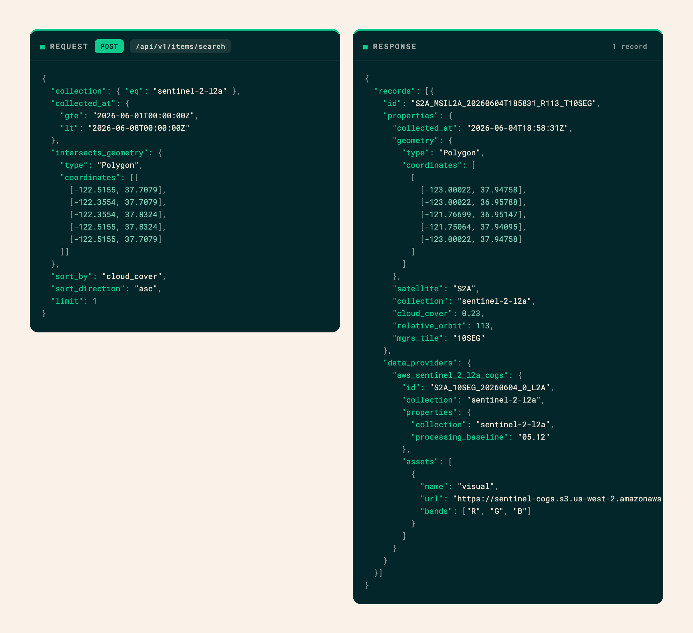

---
authors:
- aitoboxrobot
categories:
- 产品发布
date: 2026-08-07
hide:
- navigation
tags:
- 地理空间
- AI大模型
- 卫星遥感
- 行星级推理
- 基础设施
title: OlmoEarth 平台：行星级地理空间推理
---
### 文章背景与核心概要
本文介绍了由艾伦人工智能研究所（Ai2）推出的 OlmoEarth 平台。该平台旨在弥合强大地理空间基础模型（基于约 10 TB 多模态卫星数据预训练）与大规模实际业务推理之间的鸿沟。尽管开源基础模型赋予了技术实力雄厚的组织强大能力，但环保团体、非营利组织和公共机构往往缺乏复杂的数据标注、微调和海量推理流水线基础设施。

OlmoEarth 平台通过大幅缩短处理时间解决了这一痛点——利用数千个 CPU 和 GPU 并行运转，在大约 30.5 小时内即可完成整个北美洲 wildfire-risk（野火风险）地图等洲际规模的推理任务，成本更是低至每平方公里几美分。文章详细剖析了卫星推理面临的挑战、硬件优化流水线、大规模任务并行执行机制以及其独立的元数据索引方案。

---

## 📌 Executive Summary

> ## 📌 执行摘要
> 
> The **OlmoEarth Platform** is a robust infrastructure designed to bridge the gap between powerful geospatial foundation models (pretrained on ~10 terabytes of multimodal satellite data) and large-scale operational inference. While open-weight models empower engineering-heavy organizations, environmental groups, nonprofits, and public agencies often lack the complex infrastructure required for data labeling, fine-tuning, and massive inference pipelines. 
> 
> OlmoEarth solves this by cutting down processing times—enabling continent-scale inference runs (such as a North American wildfire-risk map) in roughly 30.5 hours using thousands of CPUs and GPUs in parallel—at a cost of fractions of a penny per square kilometer.

---

---

## Background & Motivation

> ## 背景与动机
> 
> [The OlmoEarth models](https://allenai.org/olmoearth/v1-1) are a family of Earth observation foundation models already deployed by governments and NGOs for applications like deforestation monitoring, food security, and wildfire risk assessment. 
> 
> [OlmoEarth 模型](https://allenai.org/olmoearth/v1-1)是一系列地球观测基础模型，已被各国政府和非政府组织部署用于森林砍伐监测、粮食安全和野火风险评估等应用场景。
> 
> Drawing from over a decade of operating reliable platforms like [Skylight](https://allenai.org/skylight) and [EarthRanger](https://allenai.org/earthranger), the Allen Institute for AI (Ai2) recognized that building an impactful platform requires more than just a great model—it demands running inference cost-effectively, monitoring performance reliably, and translating raw computational outputs into actionable environmental insights.
> 
> 凭借运营 [Skylight](https://allenai.org/skylight) 和 [EarthRanger](https://allenai.org/earthranger) 等可靠平台十多年的经验，艾伦人工智能研究所（Ai2）认识到，构建一个具有影响力的平台不仅仅需要一个优秀模型，还需要以最具成本效益的方式运行推理、可靠地监控性能，并将原始计算输出转化为可执行的环境洞察。
> 
> Inference at a planetary scale introduces unique obstacles:
> * Sourcing satellite imagery across fragmented providers.
> * Reconciling distinct projections and spatial resolutions.
> * Stitching predictions into seamless, geographically consistent maps.
> * Ensuring resilience against the routine failures of distributed cloud computing.
> 
> 行星级规模的推理带来了独一无二的挑战：
> * 从碎片化的供应商处采购卫星图像。
> * 协调不同的投影和空间分辨率。
> * 将预测结果拼接成无缝的、地理位置一致的地图。
> * 确保能够应对分布式云计算中司空见惯的故障。
> 
> Today, the platform processes dozens of terabytes of imagery to cover continent-scale regions in about a day.
> 
> 目前，该平台可以处理数十太字节（TB）的图像，在一天左右的时间内覆盖洲际规模的区域。

*A recent wildfire risk map generated on the OlmoEarth Platform, with statistics.*
*在 OlmoEarth 平台上生成的一张近期野火风险地图及其统计数据。*

*地形上野火风险热力图的特写。*

---

## Why Satellite Inference is Challenging

> ## 为什么卫星推理具有挑战性
> 
> Unlike standard machine learning tasks (such as LLMs processing text paragraphs or computer vision models analyzing a single photo), Earth observation workflows deal with immense spatial and temporal volume:
> * **Massive Data Footprints:** Single fine-tuning jobs move terabytes of data over hours of compute time.
> * **Multimodal Inputs:** Jobs ingest multi-band, multi-sensor data captured across varying time steps, frequently hindered by missing observations or cloud cover.
> * **Grid Consistency:** Outputs must align perfectly with standard coordinate grids and projections to prevent spatial artifacts.
> * **Heavy I/O Bottlenecks:** Preprocessing and downloading raw imagery often consume more runtime than the model's forward pass itself.
> 
> 与标准机器学习任务（如处理文本段落的大语言模型或分析单张照片的计算机视觉模型）不同，地球观测工作流涉及巨大的空间和时间数据量：
> * **海量数据占用：** 单次微调任务在数小时的计算时间内需要传输数 TB 的数据。
> * **多模态输入：** 任务需要摄取跨不同时间步捕获的多波段、多传感器数据，且经常受到观测数据缺失或云层覆盖的阻碍。
> * **网格一致性：** 输出必须与标准坐标网格和投影完全对齐，以防止出现空间伪影。
> * **沉重的 I/O 瓶颈：** 预处理和下载原始图像通常比模型的前向传递本身消耗更多的运行时间。

---

## The Right Hardware for the Right Task

> ## 为正确的任务匹配正确的硬件
> 
> To maximize efficiency and keep expensive GPU hardware fully utilized, the OlmoEarth Platform segments each job into a three-stage hardware-optimized pipeline:
> 
> 为了最大化效率并保持昂贵的 GPU 硬件得到充分利用，OlmoEarth 平台将每个任务细分为一个三阶段的硬件优化流水线：
> 
> 1. **Data Acquisition and Preprocessing (CPU, High I/O):** Fetches, reprocesses, aligns, and normalizes satellite imagery, writing it into formats engineered for rapid loading.
> 2. **Inference (GPU):** Executes the model's forward pass, writing minimally processed predictions directly to storage.
> 3. **Postprocessing (CPU):** Stitches per-window outputs together, applies scaling or masking, and exports formats like Zarr, GeoTIFF, or GeoJSON.
> 
> 1. **数据获取与预处理（CPU，高 I/O）：** 获取、重新处理、对齐并归一化卫星图像，将其写入专为快速加载而设计的格式。
> 2. **推理（GPU）：** 执行模型的前向传递，将经过极少处理的预测结果直接写入存储。
> 3. **后处理（CPU）：** 将各个窗口的输出拼接在一起，应用缩放或掩膜，并导出为 Zarr、GeoTIFF 或 GeoJSON 等格式。

---

## One Request, Hundreds of Workers, and Thousands of Processes

> ## 一个请求、数百个工作节点与数千个进程
> 
> **OlmoEarth Run** serves as the platform's large-scale execution layer. It partitions a target geographic zone into blocks sized for individual compute workers, then subdivides those partitions into granular windows handled concurrently by the model.
> 
> **OlmoEarth Run** 作为平台的大规模执行层，将目标地理区域划分为适合单个计算工作节点的区块，然后将这些分区细分为由模型并发处理的细粒度窗口。
> 
> * **Massive Parallelism:** A North American wildfire risk run peaked at roughly **19,600 CPUs and 994 GPUs** running simultaneously, achieving network throughputs exceeding **168 GB/s**. 
> * **Speedup:** This architecture collapsed an estimated 4,737 hours of serial compute into just **30.5 hours of wall-clock time**—a 155× speedup.
> * **Tunable Controls:** Parameters such as output resolution, model scale, and caching mechanisms allow operators to easily balance accuracy, data volume, and budget constraints.
> 
> * **海量并行：** 一次北美野火风险运行峰值时约有 **19,600 个 CPU 和 994 个 GPU** 同时运行，网络吞吐量超过 **168 GB/s**。
> * **速度提升：** 这种架构将估计 4,737 小时的串行计算缩短为仅 **30.5 小时的挂钟时间**——实现了 155 倍的加速。
> * **可调节控制：** 输出分辨率、模型规模和缓存机制等参数使操作员能够轻松平衡准确性、数据量和预算限制。

---

## Finding and Fetching the Right Pixels

> ## 寻找并获取正确的像素
> 
> Determining which satellite scenes should feed a model requires parsing massive catalogs across providers like AWS Open Data, Google Cloud, USGS, Copernicus, NASA/ASF, and Microsoft Planetary Computer.
> 
> 确定哪些卫星影像应该输入模型，需要解析来自 AWS Open Data、Google Cloud、USGS、Copernicus、NASA/ASF 和 Microsoft Planetary Computer 等提供商的海量目录。
> 
> ### The OlmoEarth Metadata Indexing Solution
> 
> ### OlmoEarth 元数据索引解决方案
> 
> To prevent overwhelming external STAC APIs with thousands of concurrent queries during a large inference job, the platform maintains its own **independent metadata index**:
> * **Automated Syncing:** AWS Open Data pushes are captured via SNS notifications, while other providers are polled every few minutes. 
> * **Windowed Reads:** Rather than downloading complete raw scenes, the platform relies on cloud-optimized formats (such as COG or Zarr) to read only the precise byte ranges required for a given partition.
> 
> 为了防止在大规模推理作业期间用数千个并发查询压垮外部 STAC API，该平台维护了自己**独立的元数据索引**：
> * **自动同步：** 通过 SNS 通知捕获 AWS Open Data 的推送，同时每隔几分钟轮询其他提供商。
> * **窗口化读取：** 平台不下载完整的原始影像，而是依靠云优化格式（如 COG 或 Zarr）仅读取给定分区所需的精准字节范围。

> **Example API Query:** Searching for the least-cloudy Sentinel-2 image over San Francisco during early June seamlessly targets specific cloud-optimized GeoTIFF pointers.
> 
> **示例 API 查询：** 搜索 6 月初旧金山上空云量最少的 Sentinel-2 影像，无缝定位到特定的云优化 GeoTIFF 指针。
> 
> *[`POST /api/v1/items/search`]*

*A sample query against the OlmoEarth satellite imagery index.*
*针对 OlmoEarth 卫星影像索引的示例查询。*

---

## Handling Failure at Scale

> ## 应对大规模故障
> 
> Distributed systems at planetary scale encounter frequent edge cases: dropped network connections, missing data bands, unexpected cloud coverage, or stalled virtual machines. 
> 
> 行星级规模的分布式系统会遇到频繁的边缘情况：网络连接中断、数据波段缺失、意外的云层覆盖或虚拟机停滞。
> 
> The OlmoEarth Platform enforces **reentrant and idempotent task patterns** using isolated runner Docker containers. If a task fails transiently, the platform automatically triggers retries, falls back to alternative data providers, or spins up monitoring daemons to restart stalled nodes without jeopardizing the overarching job.
> 
> OlmoEarth 平台利用隔离的运行器 Docker 容器执行**可重入且幂等的任务模式**。如果任务发生短暂失败，平台会自动触发重试、回退到替代数据提供商，或启动监控守护进程以重新启动停滞的节点，而不会危及整体宏观任务。

---

## Where We're Headed

> ## 未来展望
> 
> OlmoEarth continues to expand based on direct partner requirements in disaster response, conservation, and climate science:
> * **Automated Model Runs:** Triggering inferences automatically upon the ingestion of new regional imagery.
> * **Change Detection & Alerts:** Surface-level notifications for disruptions like deforestation or flooding rather than manual raster inspections.
> * **Agentic Tools & Interfaces:** Lowering technical barriers so non-ML experts can curate data and evaluate models naturally.
> * **Faster Models & Embeddings:** Precomputing global embeddings to drastically slash inference costs and accelerate workloads.
> * **Expanded Modalities:** Incorporating weather metrics (ERA-5) and additional sensor types.
> * **Run Anywhere Architecture:** Extending deployment capabilities beyond Google Cloud to support multi-cloud strategies and local partner environments.
> 
> OlmoEarth 将根据灾害响应、自然保护和气候科学领域的直接合作伙伴需求继续扩展：
> * **自动化模型运行：** 在摄入新区域影像时自动触发推理。
> * **变化检测与警报：** 针对森林砍伐或洪水等破坏进行表面级通知，而无需进行人工栅格检查。
> * **智能体工具与界面：** 降低技术门槛，使非机器学习专家能够自然地策划数据并评估模型。
> * **更快的模型与嵌入：** 预计算全局嵌入，大幅削减推理成本并加速工作负载。
> * **扩展模态：** 纳入气象指标（ERA-5）以及更多传感器类型。
> * **随处运行架构：** 将部署能力扩展到 Google Cloud 之外，以支持多云战略和本地合作伙伴环境。
> 
> OlmoEarth is building the foundational bridge to make planetary-scale geospatial intelligence accessible to the organizations that need it most.
> 
> OlmoEarth 正在构建基础桥梁，让最需要它的组织能够获取行星级的地理空间智能。