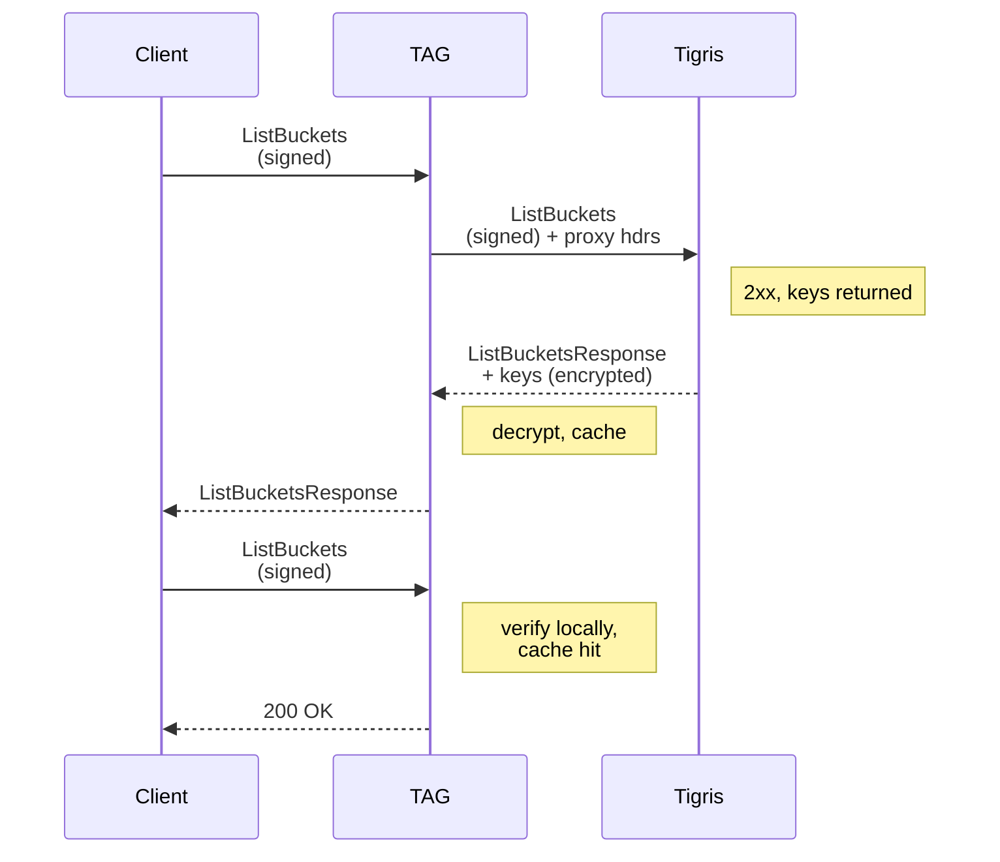

---
authors:
- aitoboxrobot
categories:
- 工具教程
date: 2026-08-07
hide:
- navigation
tags:
- AWS
- SigV4
- 安全认证
- Tigris
- 架构设计
title: SigV4 认证：意料之外的复杂性
---
### 文章背景与核心概要
AWS SigV4 认证协议在表面上看起来相当直观——只需对请求进行签名和验证即可，然而其实现细节却充满了复杂的陷阱。本文深入探讨了规范化（Canonicalization）、时钟漂移（Clock Skew）以及安全密钥处理等方面的挑战，并特别以构建 **Tigris 加速网关（Tigris Acceleration Gateway, TAG）** 为切入点进行了剖析。通过利用 SigV4 派生签名密钥的层级特性，TAG 能够在无需访问用户主密钥的情况下，实现本地缓存与身份验证。

---

## 核心要点：SigV4 概览
> At its core, SigV4 is a symmetric authentication mechanism. Clients use an **Access Key ID** (username) and **Secret Access Key** (password) to sign requests using HMAC-SHA256.

核心本质上，SigV4 是一种对称认证机制。客户端使用 **Access Key ID**（用户名）和 **Secret Access Key**（密码）通过 HMAC-SHA256 算法对请求进行签名。

> The process involves deriving a signing key through a chain of hashes:
> ```go
> func HMAC(key, data []byte) []byte {
>     h := hmac.New(sha256.New, key)
>     h.Write(data)
>     return h.Sum(nil)
> }
> 
> var (
>     kDate    = HMAC("AWS4"+secretAccessKey, nowDate)
>     kRegion  = HMAC(kDate, region)
>     kService = HMAC(kRegion, service)
>     kSigning = HMAC(kService, "aws4_request")
> )
> ```

整个过程通过一连串的哈希计算来派生签名密钥：
```go
func HMAC(key, data []byte) []byte {
    h := hmac.New(sha256.New, key)
    h.Write(data)
    return h.Sum(nil)
}

var (
    kDate    = HMAC("AWS4"+secretAccessKey, nowDate)
    kRegion  = HMAC(kDate, region)
    kService = HMAC(kRegion, service)
    kSigning = HMAC(kService, "aws4_request")
)
```

> When a request is sent, the client includes an `Authorization` header and an `X-Amz-Date` header. The server uses these to verify the request's integrity and prevent replay attacks.

当发送请求时，客户端会包含一个 `Authorization` 头和一个 `X-Amz-Date` 头。服务器利用这些标头来验证请求的完整性并防止重放攻击。

> **Note:** This post focuses on *authentication* (identity) rather than *authorization* (permissions).

> **注意：** 本文重点讨论的是*认证*（身份识别），而非*授权*（权限控制）。

## 请求规范化与签名
> ## Request Canonicalization and Signing

> To ensure the signature is deterministic, the request must be converted into a "canonical" form. This process is sensitive to:
> *   **HTTP Method:** (GET, PUT, etc.)
> *   **URI Path:** The resource path.
> *   **Query String:** Must be sorted and formatted exactly as the server expects.
> *   **Signed Headers:** A specific list of headers, sorted and joined by semicolons.
> *   **Body Hash:** A SHA256 checksum of the request body.

为了确保签名的确定性，必须将请求转换为“规范化（canonical）”形式。此过程对以下要素极为敏感：
*   **HTTP 方法：**（GET、PUT 等）
*   **URI 路径：** 资源路径。
*   **查询字符串：** 必须完全按照服务器期望的格式进行排序和格式化。
*   **已签名标头：** 特定的标头列表，需排序并通过分号连接。
*   **请求体哈希：** 请求体的 SHA256 校验和。

> For example, a request to `/api/list` results in this canonical form:
> ```text
> GET
> /api/list
> count=30&page=0
> host:myawesomesite.example
> x-amz-date:20260715T204745Z
> 
> host;x-amz-date
> e3b0c44298fc1c149afbf4c8996fb92427ae41e4649b934ca495991b7852b855
> ```

例如，针对 `/api/list` 的请求会产生如下的规范化形式：
```text
GET
/api/list
count=30&page=0
host:myawesomesite.example
x-amz-date:20260715T204745Z

host;x-amz-date
e3b0c44298fc1c149afbf4c8996fb92427ae41e4649b934ca495991b7852b855
```

## SigV4a：非对称替代方案
> ## SigV4a: The Asymmetric Alternative

> AWS also offers **SigV4a**, which uses asymmetric cryptography. Instead of sharing a secret, the server fetches a public key from IAM to verify the signature. While safer for microservices, it is not yet widely adopted outside of specific services like S3 Express Zones.

AWS 还提供使用非对称密码学的 **SigV4a**。服务器无需共享密钥，而是从 IAM 获取公钥来验证签名。尽管它对微服务而言更安全，但在 S3 Express Zones 等特定服务之外，它尚未被广泛采用。

## 重放攻击与时钟漂移
> ## Replay Attacks and Clock Skew

> Because signatures are time-bound, servers must reject requests that are too old. To account for network latency and clock drift, servers implement a "temporal skew window." While AWS uses 15 minutes, Tigris uses a 5-minute window to balance security and robustness.

由于签名具有时效性，服务器必须拒绝过期的请求。为了应对网络延迟和时钟漂移，服务器实现了一个“时间偏差窗口（temporal skew window）”。AWS 使用 15 分钟的窗口，而 Tigris 则使用 5 分钟的窗口来平衡安全性和健壮性。

## TAG 如何改变游戏规则
> ## How TAG Changes the Game

> The **Tigris Acceleration Gateway (TAG)** allows users to cache data locally for high-performance AI training. TAG authenticates clients using their existing SigV4 credentials without ever seeing the master secret keys.

**Tigris 加速网关（TAG）** 允许用户在本地缓存数据以进行高性能 AI 训练。TAG 使用客户端现有的 SigV4 凭证对其进行身份验证，且在此过程中绝不会接触到主密钥。

> TAG uses a proxying feature where it receives a derived signing key from the Tigris cloud. This key is scoped to a specific date, region, and service, allowing TAG to validate requests locally:

TAG 利用代理功能，从 Tigris 云端接收一个派生的签名密钥。该密钥的作用域限定于特定的日期、区域和服​​务，从而允许 TAG 在本地验证请求：

> ```mermaid
> sequenceDiagram
>    participant Client
>    participant TAG
>    participant Tigris
> 
>    Client->>TAG: ListBuckets<br/>(signed)
>    TAG->>Tigris: ListBuckets<br/>(signed) + proxy hdrs
>    Note right of Tigris: 2xx, keys returned
>    Tigris-->>TAG: ListBucketsResponse<br/>+ keys (encrypted)
>    Note right of TAG: decrypt, cache
>    TAG-->>Client: ListBucketsResponse
> 
>    Client->>TAG: ListBuckets<br/>(signed)
>    Note right of TAG: verify locally,<br/>cache hit
>    TAG-->>Client: 200 OK
> ```



## 结论
> ## Conclusion

> The "happy path" of SigV4 is simple, but the edge cases—canonicalization rules, clock synchronization, and secure key delegation—are where the real engineering challenges lie. By understanding the hierarchical nature of SigV4's derived keys, we can build powerful tools like TAG that maintain the security of the cloud while providing the speed of local infrastructure.

SigV4 的“常规路径（happy path）”很简单，但各种边界情况——如规范化规则、时钟同步和安全密钥委托——才是真正工程挑战所在。通过理解 SigV4 派生密钥的层级特性，我们可以构建像 TAG 这样强大的工具，在保持云端安全性的同时，提供本地基础设施的高速性能。