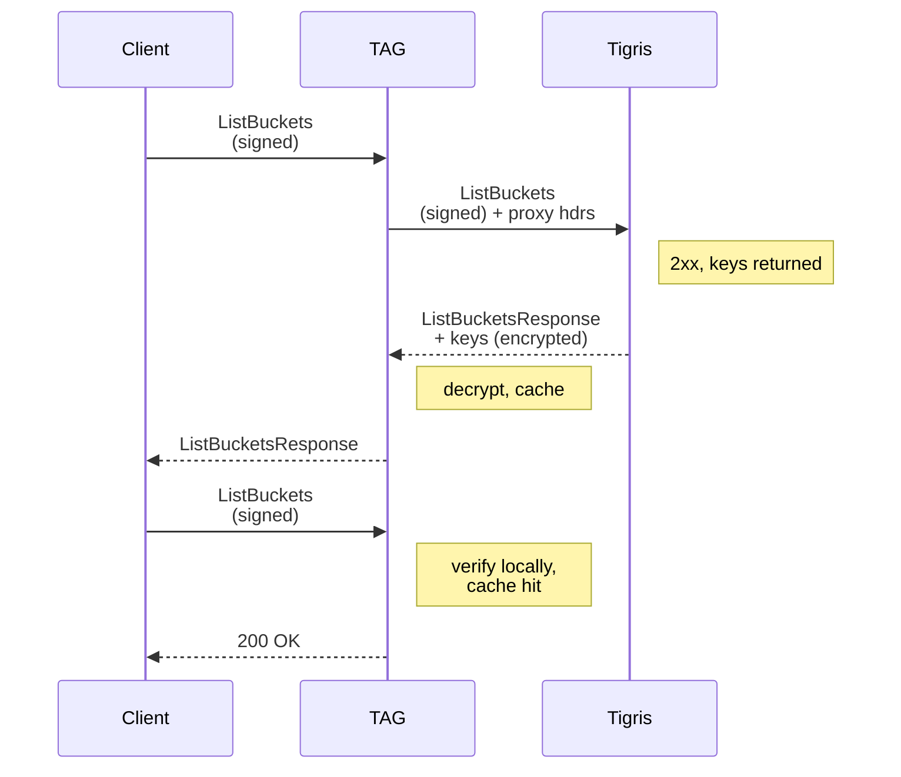

---
categories:
- 研究解读
hide:
- navigation
title: SigV4 认证远比想象中复杂
---
### 文章背景与核心概要
本文探讨了 AWS SigV4 认证协议的内在复杂性。尽管表面上只需签名和验证，但在规范化、时钟偏移和密钥安全处理等方面存在诸多挑战。文章特别结合 Tigris 加速网关（TAG）的构建，介绍了如何利用 SigV4 派生签名密钥的层次结构，在无需访问用户主密钥的情况下实现本地缓存和认证。

---

> # SigV4 Authentication is Surprisingly Complicated
# SigV4 认证远比想象中复杂

> ### Summary
> While the AWS SigV4 authentication protocol appears straightforward at a high level—signing a request and verifying it—the implementation details are deceptively complex. This post explores the challenges of canonicalization, clock skew, and secure key handling, specifically through the lens of building the **Tigris Acceleration Gateway (TAG)**. By leveraging the hierarchical nature of SigV4's derived signing keys, TAG enables local caching and authentication without requiring access to a user's master secret keys.

### 概要
尽管从高层次来看，AWS SigV4 认证协议似乎很简单——对请求进行签名并验证——但其实现细节却复杂得带有欺骗性。本文通过构建 **Tigris 加速网关 (TAG)** 的视角，探讨了规范化、时钟偏移和安全密钥处理等方面的挑战。通过利用 SigV4 派生签名密钥的层次结构特性，TAG 能够在无需访问用户主安全密钥的情况下，实现本地缓存和认证。

---

> ## SigV4 in a Nutshell
## 简述 SigV4

> At its core, SigV4 is a symmetric authentication mechanism. Clients use an **Access Key ID** (username) and **Secret Access Key** (password) to sign requests using HMAC-SHA256.

从核心上看，SigV4 是一种对称认证机制。客户端使用 **访问密钥 ID (Access Key ID)**（即用户名）和 **秘密访问密钥 (Secret Access Key)**（即密码），使用 HMAC-SHA256 对请求进行签名。

> The process involves deriving a signing key through a chain of hashes:

该过程涉及通过哈希链派生出签名密钥：

```go
func HMAC(key, data []byte) []byte {
    h := hmac.New(sha256.New, key)
    h.Write(data)
    return h.Sum(nil)
}

var (
    kDate    = HMAC("AWS4"+secretAccessKey, nowDate)
    kRegion  = HMAC(kDate, region)
    kService = HMAC(kRegion, service)
    kSigning = HMAC(kService, "aws4_request")
)
```

> When a request is sent, the client includes an `Authorization` header and an `X-Amz-Date` header. The server uses these to verify the request's integrity and prevent replay attacks.

当发送请求时，客户端会包含一个 `Authorization` 头和一个 `X-Amz-Date` 头。服务器使用这些头部信息来验证请求的完整性并防止重放攻击。

> > **Note:** This post focuses on *authentication* (identity) rather than *authorization* (permissions).

> **注意：** 本文主要关注*认证*（身份），而不是*授权*（权限）。

> ## Request Canonicalization and Signing
## 请求规范化与签名

> To ensure the signature is deterministic, the request must be converted into a "canonical" form. This process is sensitive to:
> *   **HTTP Method:** (GET, PUT, etc.)
> *   **URI Path:** The resource path.
> *   **Query String:** Must be sorted and formatted exactly as the server expects.
> *   **Signed Headers:** A specific list of headers, sorted and joined by semicolons.
> *   **Body Hash:** A SHA256 checksum of the request body.

为了确保签名的确定性，请求必须被转换为一种“规范化”的形式。该过程对以下内容非常敏感：
*   **HTTP 方法：** (GET、PUT 等)
*   **URI 路径：** 资源路径。
*   **查询字符串：** 必须按照服务器期望的格式进行排序和格式化。
*   **签名的头部 (Signed Headers)：** 特定头部的列表，经过排序并由分号连接。
*   **请求体哈希 (Body Hash)：** 请求体的 SHA256 校验和。

> For example, a request to `/api/list` results in this canonical form:

例如，对 `/api/list` 的请求将产生以下规范形式：

```text
GET
/api/list
count=30&page=0
host:myawesomesite.example
x-amz-date:20260715T204745Z

host;x-amz-date
e3b0c44298fc1c149afbf4c8996fb92427ae41e4649b934ca495991b7852b855
```

> ## SigV4a: The Asymmetric Alternative
## SigV4a：非对称替代方案

> AWS also offers **SigV4a**, which uses asymmetric cryptography. Instead of sharing a secret, the server fetches a public key from IAM to verify the signature. While safer for microservices, it is not yet widely adopted outside of specific services like S3 Express Zones.

AWS 还提供了 **SigV4a**，它使用了非对称加密。与共享密钥不同，服务器从 IAM 获取公钥来验证签名。尽管对于微服务来说更加安全，但它目前在除 S3 Express Zones 等特定服务之外，尚未得到广泛应用。

> ## Replay Attacks and Clock Skew
## 重放攻击与时钟偏移

> Because signatures are time-bound, servers must reject requests that are too old. To account for network latency and clock drift, servers implement a "temporal skew window." While AWS uses 15 minutes, Tigris uses a 5-minute window to balance security and robustness.

因为签名是绑定时间的，所以服务器必须拒绝过期的请求。考虑到网络延迟和时钟漂移，服务器实现了一个“时间偏移窗口”。AWS 使用 15 分钟，而 Tigris 使用 5 分钟的窗口，以平衡安全性和健壮性。

> ## How TAG Changes the Game
## TAG 如何改变游戏规则

> The **Tigris Acceleration Gateway (TAG)** allows users to cache data locally for high-performance AI training. TAG authenticates clients using their existing SigV4 credentials without ever seeing the master secret keys.

**Tigris 加速网关 (TAG)** 允许用户在本地缓存数据，以进行高性能的 AI 训练。TAG 使用客户端现有的 SigV4 凭证对其进行认证，而无需查看主安全密钥。

> TAG uses a proxying feature where it receives a derived signing key from the Tigris cloud. This key is scoped to a specific date, region, and service, allowing TAG to validate requests locally:

TAG 使用代理功能，从 Tigris 云端接收一个派生的签名密钥。这个密钥的作用域被限定为特定的日期、区域和服务，从而允许 TAG 在本地验证请求：



> ## Conclusion
## 结论

> The "happy path" of SigV4 is simple, but the edge cases—canonicalization rules, clock synchronization, and secure key delegation—are where the real engineering challenges lie. By understanding the hierarchical nature of SigV4's derived keys, we can build powerful tools like TAG that maintain the security of the cloud while providing the speed of local infrastructure.

SigV4 的“顺利路径”很简单，但像规范化规则、时钟同步和安全的密钥委托等边界情况，才是真正的工程挑战所在。通过理解 SigV4 派生密钥的层级特性，我们可以构建出诸如 TAG 这样强大的工具，在保持云安全性的同时，提供本地基础设施的速度。
