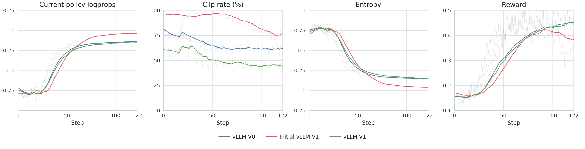
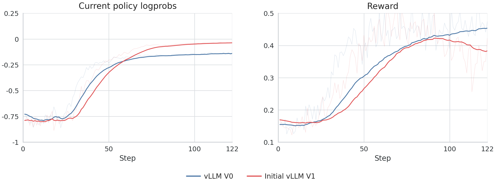
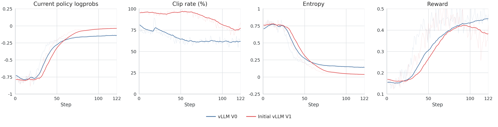
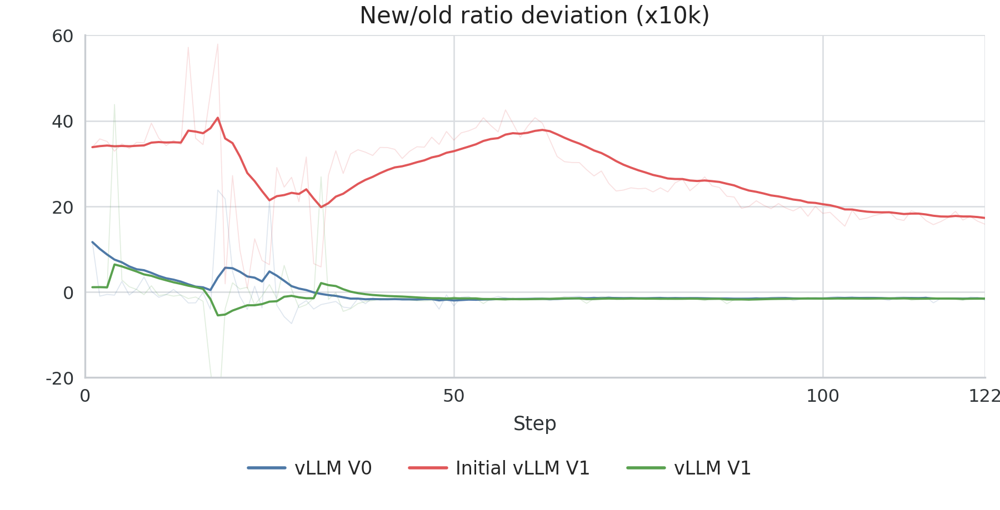
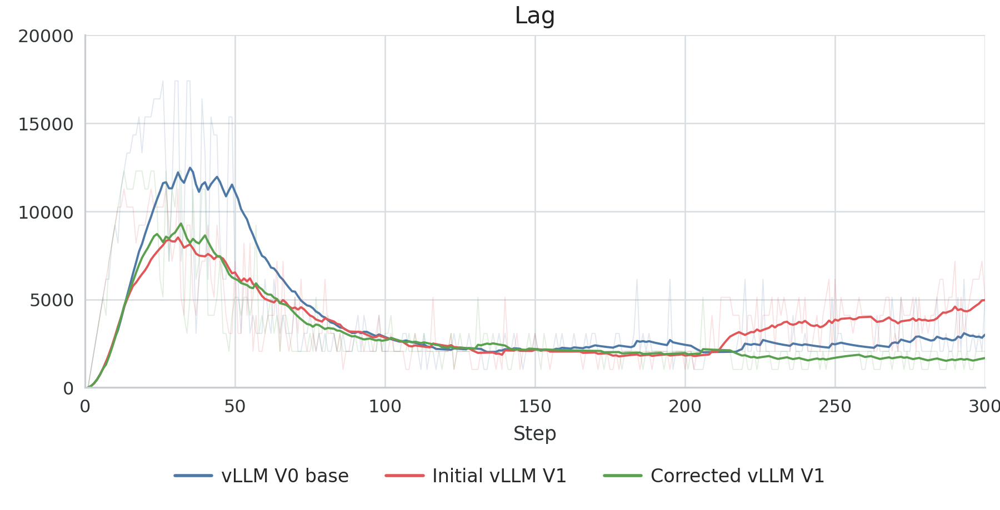
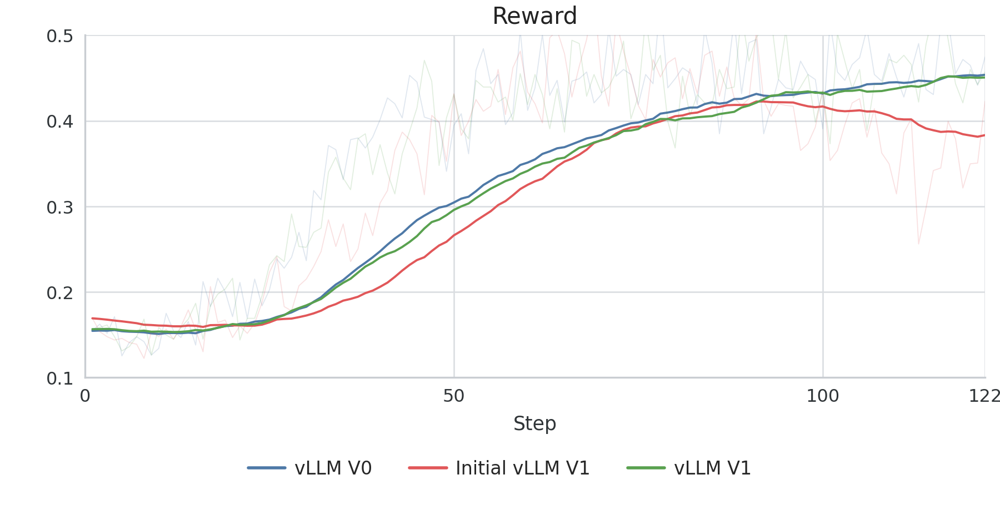

---
authors:
- aitoboxrobot
categories:
- 工具教程
date: 2026-08-07
hide:
- navigation
tags:
- vLLM
- 强化学习
- 模型推理
- 机器学习工程
title: vLLM V0 到 V1 迁移：在强化学习中纠正偏差前，先确保后端正确性
---
### 文章背景与核心概要

在将 [PipelineRL](https://github.com/ServiceNow/PipelineRL/) 推理引擎从 vLLM V0 迁移到 V1 时，我们遇到了明显的训练与推理不匹配问题。与其调整强化学习（RL）目标函数来弥补这些差异，我们选择优先恢复后端的一致性。通过修复对数概率（logprob）语义、对齐运行时默认设置、管理运行中的权重更新（inflight weight updates）以及确保使用 fp32 的 `lm_head` 投影，我们成功匹配了 V0 的训练动态，而无需修改强化学习目标函数本身。

> When migrating the [PipelineRL](https://github.com/ServiceNow/PipelineRL/) inference engine from vLLM V0 to V1, we encountered significant train-inference mismatches. Rather than adjusting the RL objective to compensate for these discrepancies, we prioritized restoring backend parity. By fixing logprob semantics, aligning runtime defaults, managing inflight weight updates, and ensuring an fp32 `lm_head` projection, we successfully matched V0 training dynamics without needing to alter the RL objective itself.

---

### 迁移目标

vLLM V1 是对 V0 引擎的大规模重写。我们的迁移目标非常明确且收敛：
1. 验证 V1 返回的 rollout 对数概率是否符合训练器预期的格式。
2. 针对 V0 参考基准重新运行相同的工作负载。
3. 仅在恢复后端一致性之后，再评估目标层面的更改。

最初的 V1 运行结果显示，与 vLLM `0.8.5` 参考基准相比，`kl_new_old`、`entropy` 和 `reward` 等指标存在明显的发散。

> vLLM V1 is a substantial rewrite of the V0 engine. Our migration target was deliberately narrow:
> 1. Verify that V1 returned rollout logprobs in the format the trainer expected.
> 2. Rerun the same workload against the V0 reference.
> 3. Evaluate objective-level changes only after backend parity was restored.
> 
> Initial V1 runs showed clear divergence in metrics like `kl_new_old`, `entropy`, and `reward` compared to the vLLM `0.8.5` reference.







---

### 故障模式

我们将潜在原因归纳为三个层面：
1. **语义不匹配**：后端返回的对数概率其含义与预期不符。
2. **推理路径不匹配**：不同的运行时默认设置（缓存、调度）导致了不同的执行路径。
3. **目标不匹配**：强化学习目标函数需要对残留的陈旧性（staleness）进行修正。

我们将前两点视为后端行为问题，在考虑目标侧的更改之前先予以排除。

> We categorized potential causes into three layers:
> 1. **Semantic mismatch**: The backend returns logprobs with different meanings than expected.
> 2. **Inference-path mismatch**: Different runtime defaults (caching, scheduling) lead to different execution paths.
> 3. **Objective mismatch**: The RL objective requires correction for remaining staleness.
> 
> We treated the first two as backend behavior problems to be ruled out before considering objective-side changes.

---

### V1 后端修复

#### 对数概率语义

vLLM V1 默认返回原始模型输出。我们需要设置 `logprobs-mode=processed_logprobs`，以确保对数概率与采样器使用的分布相匹配。这消除了策略比率（policy ratios）中的均值偏移。

> vLLM V1 returns raw model outputs by default. We required `logprobs-mode=processed_logprobs` to ensure the logprobs matched the distribution used by the sampler. This eliminated the mean offset in policy ratios.



#### 运行时默认设置

我们显式禁用了与 V0 参考路径不同的功能，以确保一致性：

> We explicitly disabled features that differed from the V0 reference path to ensure parity:

```yaml
vllm_config:
  use_v1: true
  vllm_kwargs:
    logprobs-mode: processed_logprobs
    enable-prefix-caching: false
    async-scheduling: false
```

#### 运行中的权重更新

为了匹配 V0 的行为，我们确保权重更新不会触发显式的缓存失效：

> To match V0 behavior, we ensured that weight updates did not trigger explicit cache invalidation:

```python
await engine.pause_generation(mode="keep", clear_cache=False)
await engine_client.collective_rpc_async(
    "receive_weight_update",
    args=(request.model_dump_json(),),
)
await engine.resume_generation()
```



---

### 最后的差距：fp32 lm_head

实现最终的一致性需要匹配 Logit 计算的数值路径。通过强制 `lm_head` 在 fp32 精度下计算，我们将 rollout 后端与训练器的投影行为进行了对齐，成功弥合了奖励轨迹（reward trajectories）上的差距。

> Final parity required matching the numerical path for logit computation. By forcing the `lm_head` to compute in fp32, we aligned the rollout backend with the trainer's projection behavior, successfully closing the gap in reward trajectories.



---

### 为什么我们首先修复后端正确性

目标侧的修正（例如重要性采样比率重加权）非常强大，但在后端未对齐的情况下应用它们会掩盖根本原因。通过将推理正确性与目标设计分离开来，我们确保了训练曲线的可解释性。给我们的教训很明确：**首先修复后端的正确性，然后针对剩余的不匹配进行修正。**

> Objective-side corrections (like importance-ratio reweighting) are powerful, but applying them while the backend is misaligned masks the root cause. By separating inference correctness from objective design, we ensured that our training curves remained interpretable. The lesson is clear: **fix backend correctness first, then add corrections for the mismatch that remains.**