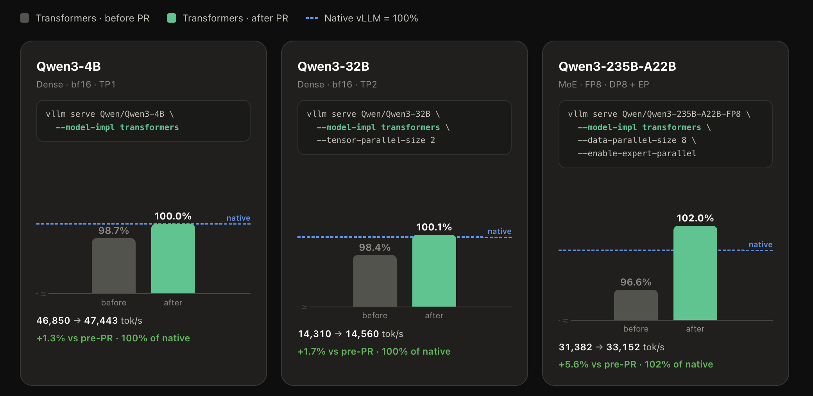
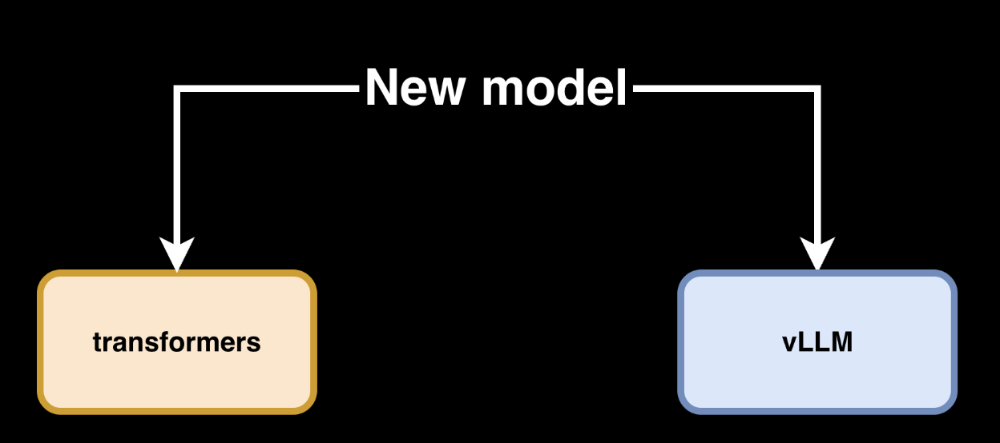
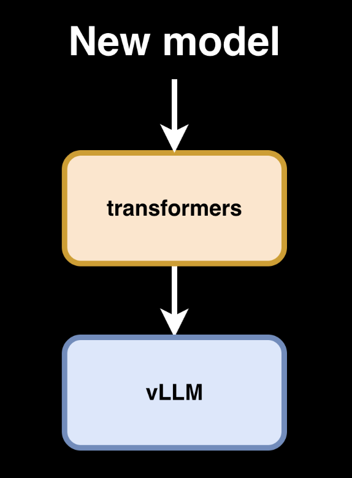

---
authors:
- aitoboxrobot
categories:
- 产品发布
date: 2026-08-07
hide:
- navigation
tags:
- vLLM
- Transformers
- 推理优化
- LLM
- 深度学习
title: vLLM 原生速度 Transformers 模型后端
---
### 文章背景与核心概要

vLLM 团队近期宣布，其 `transformers` 模型后端已实现重大突破，在性能上达到甚至超越了针对特定架构的手写原生 vLLM 实现。这一进展意味着模型开发者无需再为 vLLM 手动移植模型，即可直接利用 `transformers` 库的通用性，同时享受 vLLM 的连续批处理（Continuous Batching）和自定义注意力算子等高性能推理优化。

该技术核心在于利用 `torch.fx` 对模型计算图进行静态分析，通过抽象语法树（AST）重写操作，实现推理时的动态算子融合与并行化支持。这一改进不仅简化了模型部署流程，还确保了模型在训练、评估与推理任务之间的一致性，为大规模模型的高效部署提供了更灵活的路径。

---

## 原生速度 vLLM Transformers 模型后端

**TL;DR**: 对于许多 LLM 架构而言，transformers vLLM 后端现在的速度已经与定制的 vLLM 实现相当（甚至更快）。模型作者可以自动利用他们的 transformers 实现，免费获得超高速的 vLLM 推理能力。

```bash
# 升级 vllm pip 包
uv pip install --upgrade vllm --torch-backend auto
```

> The `transformers` library has become the reference modeling library for Machine Learning, supporting over 450 architectures with consistent APIs. Its design ensures that model implementations are self-contained and easy to understand, making it the ideal starting point for developers to learn architectures before porting them to frameworks like vLLM, SGLang, MLX, or llama.cpp.

`transformers` 库已成为机器学习领域的参考建模库，支持超过 450 种架构，并提供一致的 API。其设计确保了模型实现是自包含且易于理解的，这使其成为开发者在将模型移植到 vLLM、SGLang、MLX 或 llama.cpp 等框架之前，学习架构的理想起点。

> We have invested significant effort into integrating `transformers` as a modeling backend in vLLM. This allows model authors to run transformers models (LLMs and VLMs) inside vLLM without manual porting, combining the accessibility of transformers with vLLM’s optimized inference techniques like continuous batching and custom attention kernels.

我们投入了大量精力将 `transformers` 集成为 vLLM 的建模后端。这使得模型作者无需手动移植，即可在 vLLM 中运行 transformers 模型（LLM 和 VLM），从而将 transformers 的易用性与 vLLM 的优化推理技术（如连续批处理和自定义注意力算子）结合起来。

---

## 展示

我们对比了 vLLM 的 transformers 建模后端与 vLLM 手写原生实现，涵盖了三种不同的 Qwen3 模型：
*   单 GPU 上的 4B 稠密模型
*   使用张量并行（Tensor Parallelism）的 32B 稠密模型
*   在 8×H100 节点上的 235B 参数 FP8 混合专家模型（MoE）

|  |
| :---: |
| 结果：transformers 建模后端在上述所有模型中均**达到或超过了**原生吞吐量。 |

> Running any supported Hugging Face model through the transformers modeling backend requires only a single flag: `--model-impl transformers`.

通过 transformers 建模后端运行任何受支持的 Hugging Face 模型，只需添加一个标志：`--model-impl transformers`。

```bash
# Qwen3-4B 稠密模型，单 GPU
vllm serve Qwen/Qwen3-4B --model-impl transformers

# Qwen3-32B 稠密模型，跨 2 个 GPU 的张量并行
vllm serve Qwen/Qwen3-32B --model-impl transformers --tensor-parallel-size 2

# Qwen3-235B-A22B-FP8 MoE，跨 8 个 GPU 的数据并行 + 专家并行
vllm serve Qwen/Qwen3-235B-A22B-FP8 --model-impl transformers --data-parallel-size 8 --enable-expert-parallel
```

### 测量方法

每个模型都在三种条件下进行了比较：
1.  **native**: `--model-impl vllm` (基准)。
2.  **after**: 使用最新 PR 的 `--model-impl transformers`。
3.  **before**: 未使用该 PR 的 `--model-impl transformers`。

完整的、可复现的运行脚本可作为 [benchmark.sh](https://huggingface.co/datasets/ariG23498/useful-scripts/blob/main/transformers-backend-vllm-benchmark.sh) gist 获取。

---

## 有什么新变化？

此前，transformers 建模后端主要关注将注意力机制作为推理瓶颈。虽然有效，但它缺乏定制 vLLM 端口所提供的专门优化（如自定义并行化和融合算子）。

|  |
| :---: |
| 过去，新模型需要分别针对 transformers 集成一次，并针对 vLLM 进行定制优化集成一次。 |

|  |
| :---: |
| 现在，新模型一旦集成到 transformers 中，即可立即在 vLLM 中使用，并获得原生 vLLM 的实现速度。 |

最新迭代在运行时动态应用了推理特定的层融合，使兼容架构的性能与定制代码实现相匹配。

---

## 它是如何工作的？

该后端现在使用 `torch.fx` 对模型的计算图进行静态分析。它识别已知模式并使用抽象语法树（AST）原地重写操作。

**关键能力：**
*   **融合操作（Fused Operations）**：将操作映射到优化的 vLLM 算子，例如 MoE 模型中用于专家并行（EP）的算子。
*   **并行支持（Parallelism Support）**：使用 `MergedColumnParallelLinear` 和 `QKVParallelLinear` 等模块推断张量并行（TP）和流水线并行（PP）方案。
*   **编译（Compilation）**：处理后的模型与 `torch.compile` 和 CUDA Graphs 完全兼容。
*   **统一代码库（Unified Codebase）**：与专用的 vLLM 实现不同，这些基于 transformers 的模型仍然可以用于训练、评估和 RL 滚动更新。

> **注意**：我们目前正在准备一篇详细的博客文章，深入探讨这些优化的推理方法以及我们模型操作技术的具体技术细节。

---

## 资源
*   [Transformers 模型定义](https://huggingface.co/blog/transformers-model-definition#a-model-definition-library)
*   [vLLM 中的 Transformers 建模后端](https://vllm.ai/blog/2025-04-11-transformers-backend)
*   [大规模服务](https://vllm.ai/blog/2025-12-17-large-scale-serving)
*   [Torch FX](https://docs.pytorch.org/docs/2.12/fx.html)
*   [抽象语法树](https://docs.python.org/3/library/ast.html)