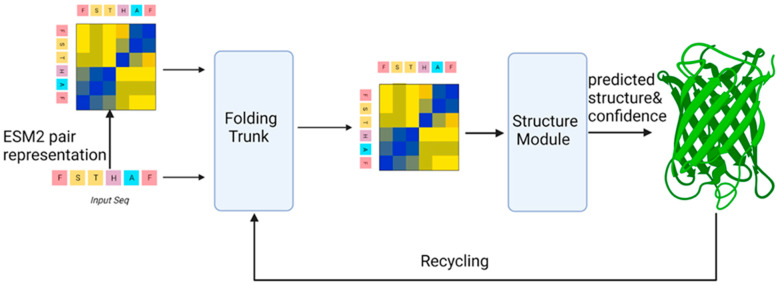
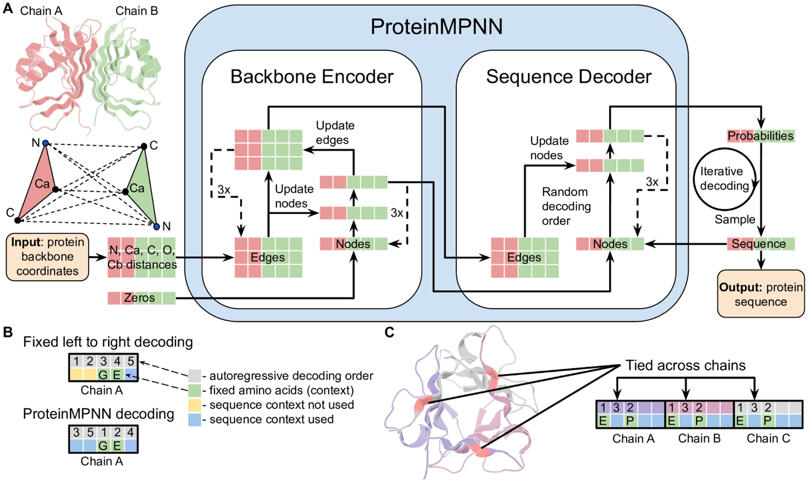
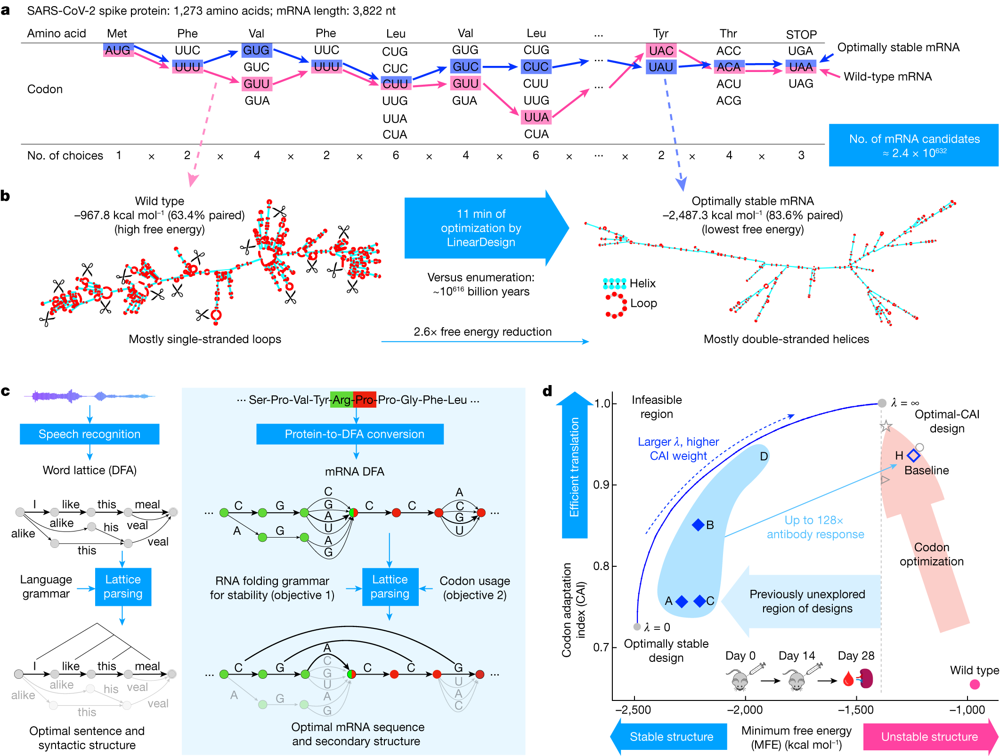
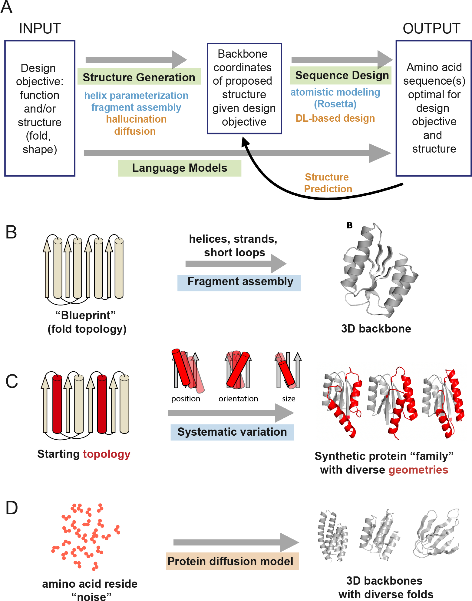

---
authors:
- aitoboxrobot
categories:
- 工具教程
date: 2026-08-07
hide:
- navigation
tags:
- mRNA语言模型
- 蛋白质工程
- 密码子优化
- 深度学习
- 开源AI
title: 仅需 165 美元，跨越 25 个物种训练 mRNA 语言模型
---
### 文章背景与核心概要
本文介绍了医疗与生命科学开源智能体 AI 团队 OpenMed 开发的端到端蛋白质 AI 流水线。该流水线创新性地整合了结构预测（ESMFold）、序列设计（ProteinMPNN）与密码子优化（CodonRoBERTa）三大核心阶段，实现了从蛋白质骨架到高效 mRNA 序列的完整闭环。

在技术实现上，团队通过对多种 Transformer 架构进行深入探索，成功锁定 `CodonRoBERTa-large-v2` 作为密码子级语言建模的最优模型，其困惑度（Perplexity）低至 4.10，且与密码子适应指数（CAI）的 Spearman 相关系数达到 0.40。项目最终将这一方案成功扩展至包含细菌、酵母和哺乳动物等在内的 25 个物种，仅耗费 55 个 GPU 小时、总成本约 165 美元便训练出了一套可用于生产的强大模型矩阵。该成果为开源生物计算领域提供了一种高性价比、高灵活性的端到端解决方案。

---

**By OpenMed, Open-Source Agentic AI for Healthcare & Life Sciences**

> **By OpenMed, Open-Source Agentic AI for Healthcare & Life Sciences**

---

### **Summary**
OpenMed has developed an end-to-end protein AI pipeline that integrates structure prediction, sequence design, and codon optimization. By conducting an extensive architectural exploration, the team identified **CodonRoBERTa-large-v2** as the optimal model for codon-level language modeling, achieving a perplexity of 4.10 and a 0.40 Spearman correlation with the Codon Adaptation Index (CAI). The project successfully scaled to 25 species, training a production-ready suite of models in just 55 GPU-hours for a total cost of approximately $165.

> ### **Summary**
> OpenMed has developed an end-to-end protein AI pipeline that integrates structure prediction, sequence design, and codon optimization. By conducting an extensive architectural exploration, the team identified **CodonRoBERTa-large-v2** as the optimal model for codon-level language modeling, achieving a perplexity of 4.10 and a 0.40 Spearman correlation with the Codon Adaptation Index (CAI). The project successfully scaled to 25 species, training a production-ready suite of models in just 55 GPU-hours for a total cost of approximately $165.

---

## 1. What We Built
该流水线解决了蛋白质工程中的三个关键阶段：
*   **蛋白质折叠：** 使用 ESMFold 预测 3D 结构。
*   **序列设计：** 使用 ProteinMPNN 为特定骨架生成氨基酸序列。
*   **mRNA 优化：** 使用定制的 Transformer 模型为特定的表达宿主优化 DNA 序列。

> ## 1. What We Built
> The pipeline addresses the three critical stages of protein engineering:
> *   **Protein Folding:** Using ESMFold to predict 3D structures.
> *   **Sequence Design:** Using ProteinMPNN to generate amino acid sequences for specific scaffolds.
> *   **mRNA Optimization:** Using custom transformer models to optimize DNA sequences for specific expression hosts.

| 组件 | 我们的工作 | 关键结果 |
| :--- | :--- | :--- |
| **蛋白质折叠** | 在 30 条链上运行 ESMFold v1 | 平均 PTM：0.79 |
| **序列设计** | 在 7K00 骨架上运行 ProteinMPNN | 42% 的序列恢复率 |
| **mRNA 优化** | 跨 25 个物种在 38.1k 条序列上进行训练 | **CodonRoBERTa-large-v2**（困惑度 4.10） |

> | Component | What We Did | Key Result |
> | :--- | :--- | :--- |
> | **Protein Folding** | ESMFold v1 on 30 chains | Avg PTM: 0.79 |
> | **Sequence Design** | ProteinMPNN on scaffold 7K00 | 42% sequence recovery |
> | **mRNA Optimization** | Trained on 381k sequences across 25 species | **CodonRoBERTa-large-v2** (Perplexity 4.10) |

---

## 2. The Architecture Exploration
我们对比了几种 Transformer 架构，以确定哪种架构能最好地捕捉密码子序列的统计特性。

> ## 2. The Architecture Exploration
> We compared several transformer architectures to determine which best captures the statistical properties of codon sequences.

### 候选模型
*   **CodonBERT（基线）：** 600 万参数。
*   **ModernBERT-base：** 9000 万参数（采用 RoPE 的现代化架构）。
*   **CodonRoBERTa（Base/Large/v2）：** 9200 万至 3.12 亿参数（经验证的主力模型）。

> ### The Contenders
> *   **CodonBERT (Baseline):** 6M parameters.
> *   **ModernBERT-base:** 90M parameters (Modern architecture with RoPE).
> *   **CodonRoBERTa (Base/Large/v2):** 92M–312M parameters (Proven workhorse).

### 结果
RoBERTa 系列的表现显著优于 ModernBERT。我们发现，**超参数调优**（具体而言是更低的学习率和更长的预热期）是实现生物学相关性（通过 CAI 相关性衡量）的决定性因素。

> ### The Results
> The RoBERTa family significantly outperformed ModernBERT. We discovered that **hyperparameter tuning** (specifically lower learning rates and longer warmups) was the deciding factor in achieving biological relevance, as measured by CAI correlation.

| 模型 | 困惑度 (Perplexity) | CAI Spearman 相关系数 | 状态 |
| :--- | :--- | :--- | :--- |
| **CodonRoBERTa-large-v2** | 4.10 | **0.404** | **整体最优** |
| **CodonRoBERTa-base** | **4.01** | 0.219 | 效率最高 |
| **ModernBERT-base** | 26.24 | 0.070 | 表现不佳 |

> | Model | Perplexity | CAI Spearman | Status |
> | :--- | :--- | :--- | :--- |
> | **CodonRoBERTa-large-v2** | 4.10 | **0.404** | **Best Overall** |
> | **CodonRoBERTa-base** | **4.01** | 0.219 | Best Efficiency |
> | **ModernBERT-base** | 26.24 | 0.070 | Underperformed |

---

## 3. The Pipeline

### 3.1 使用 ESMFold 进行蛋白质折叠

ESMFold 能够实现快速结构预测，而无需进行耗时的多序列比对（MSA）。我们在 30 条蛋白质链上进行的测试得出了 0.79 的平均 PTM，证实了其具有很高的拓扑置信度。

> ## 3. The Pipeline
> 
> ### 3.1 Protein Folding with ESMFold
> 
> ESMFold allows for rapid structure prediction without the need for time-consuming Multiple Sequence Alignments (MSA). Our tests on 30 protein chains yielded an average PTM of 0.79, confirming high topological confidence.

### 3.2 使用 ProteinMPNN 进行序列设计

ProteinMPNN 将蛋白质骨架视为图结构。通过在 7K00 骨架上运行它，我们实现了约 42% 的序列恢复率，展示了该模型重新发现进化选择残基的能力。

> ### 3.2 Sequence Design with ProteinMPNN
> 
> ProteinMPNN treats the protein backbone as a graph. By running this on scaffold 7K00, we achieved ~42% sequence recovery, demonstrating the model's ability to rediscover evolutionarily selected residues.

### 3.3 mRNA 优化

我们将密码子优化重新构想为掩码语言建模（MLM）任务。通过在 25 万条 CDS 序列上进行训练，我们的模型学会了密码子的“语法”，捕捉到了传统频率表所忽略的长程依赖关系。

> ### 3.3 mRNA Optimization
> 
> We reframed codon optimization as a masked language modeling (MLM) task. By training on 250k CDS sequences, our models learn the "grammar" of codon usage, capturing long-range dependencies that traditional frequency tables miss.

---

## 4. Scaling to Multi-Species
我们将系统扩展到了涵盖细菌、酵母和哺乳动物在内的 25 种生物。我们引入了 **94 词元的词表**（69 个基础词元 + 25 个物种词元），以实现条件物种生成（species-conditioned generation）。

> ## 4. Scaling to Multi-Species
> We expanded our system to cover 25 organisms, including bacteria, yeast, and mammals. We introduced a **94-token vocabulary** (69 base tokens + 25 species tokens) to allow for species-conditioned generation.

### 模型矩阵
*   **通用基础模型：** `OpenMed/CodonRoBERTa-large-multispecies`
*   **人类专用模型：** `OpenMed/CodonRoBERTa-large-human`（最适合 mRNA 治疗药物）
*   **大肠杆菌专用模型：** `OpenMed/CodonRoBERTa-large-ecoli`
*   **CHO 细胞专用模型：** `OpenMed/CodonRoBERTa-large-cho`

> ### The Model Suite
> *   **Universal Base:** `OpenMed/CodonRoBERTa-large-multispecies`
> *   **Human Specialist:** `OpenMed/CodonRoBERTa-large-human` (Best for mRNA therapeutics)
> *   **E. coli Specialist:** `OpenMed/CodonRoBERTa-large-ecoli`
> *   **CHO Specialist:** `OpenMed/CodonRoBERTa-large-cho`

---

## 5. The End-to-End Workflow

该工作流遵循清晰的循环：
1.  **折叠：** 使用 ESMFold 预测结构。
2.  **设计：** 使用 ProteinMPNN 生成序列。
3.  **验证：** 重新折叠候选序列以确保稳定性。
4.  **优化：** 使用 CodonRoBERTa 选择密码子。
5.  **合成：** 进入实验室测试阶段。

> ## 5. The End-to-End Workflow
> 
> The workflow follows a clear cycle:
> 1.  **Fold:** Predict structure with ESMFold.
> 2.  **Design:** Generate sequences with ProteinMPNN.
> 3.  **Verify:** Refold candidates to ensure stability.
> 4.  **Optimize:** Select codons with CodonRoBERTa.
> 5.  **Synthesize:** Proceed to lab testing.

---

## 6. Where This Stands and What's Next
尽管 mRNABERT 和 NUWA 等模型在规模大得多的数据集上进行训练，但 OpenMed 提供了一个**完全开源、支持物种条件的流水线**，它具有更高的参数效率和灵活性。

> ## 6. Where This Stands and What's Next
> While models like mRNABERT and NUWA train on significantly larger datasets, OpenMed provides a **fully open-source, species-conditioned pipeline** that is more parameter-efficient and flexible. 

**未来研究方向：**
*   **CodonJEPA：** 一种使用联合嵌入预测架构（Joint Embedding Predictive Architecture）的新方法，用于学习同义密码子在功能上是等效的。
*   **规模扩展：** 在更大的数据集（3600 万+ 序列）上进行重新训练，并添加 mRNA 稳定性预测头。

> **Future Research:**
> *   **CodonJEPA:** A new approach using Joint Embedding Predictive Architecture to learn that synonymous codons are functionally equivalent.
> *   **Scaling:** Retraining on larger datasets (36M+ sequences) and adding mRNA stability prediction heads.

---

## 7. References
*   Jumper, J. et al. (2021). "Highly accurate protein structure prediction with AlphaFold." *Nature*.
*   Dauparas, J. et al. (2022). "Robust deep learning-based protein sequence design using ProteinMPNN." *Science*.
*   Xiong, Y. et al. (2025). "mRNABERT: advancing mRNA sequence design with a universal language model." *Nature Communications*.

> ## 7. References
> *   Jumper, J. et al. (2021). "Highly accurate protein structure prediction with AlphaFold." *Nature*.
> *   Dauparas, J. et al. (2022). "Robust deep learning-based protein sequence design using ProteinMPNN." *Science*.
> *   Xiong, Y. et al. (2025). "mRNABERT: advancing mRNA sequence design with a universal language model." *Nature Communications*.

*所有模型和数据集均可通过 [OpenMed Hugging Face 组织](https://huggingface.co/OpenMed) 获取。*

> *All models and datasets are available via the [OpenMed Hugging Face organization](https://huggingface.co/OpenMed).*