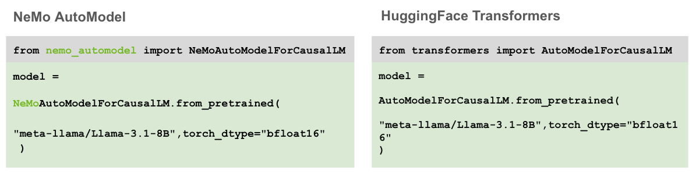
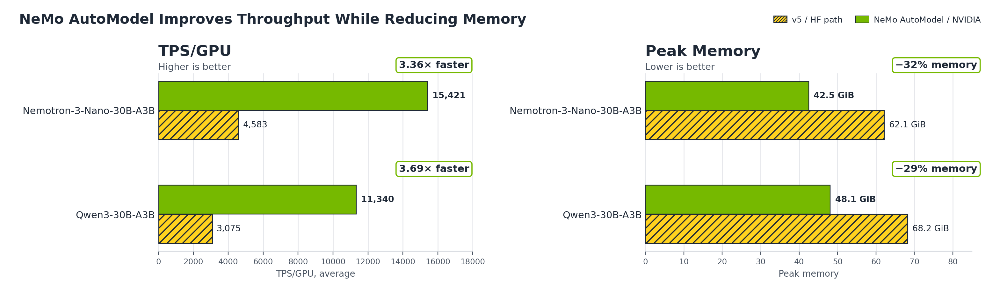

---
authors:
- aitoboxrobot
categories:
- 工具教程
date: 2026-08-07
hide:
- navigation
tags:
- NVIDIA
- NeMo
- Transformers
- MoE
- 模型微调
title: 使用 NVIDIA NeMo AutoModel 加速 Transformer 微调
---
### 文章背景与核心概要

本文探讨了 NVIDIA NeMo AutoModel 如何基于 HuggingFace Transformers v5 构建，为混合专家（MoE）模型提供高性能、可扩展的微调方案。通过将专家并行（Expert Parallelism）、DeepEP 融合 all-to-all 分发以及 TransformerEngine 内核集成到熟悉的 `from_pretrained()` 工作流中，NeMo AutoModel 在无需破坏性 API 变更的前提下，实现了比原生 Transformers v5 高出 3.4–3.7 倍的训练吞吐量，并将 GPU 显存占用降低了 29–32%。

该技术方案解决了 MoE 模型在训练过程中面临的路由调度、算子融合及通信计算重叠等挑战。通过利用 Transformers v5 的动态权重加载机制，NeMo AutoModel 能够无缝支持多种模型架构，同时保持与 HuggingFace 生态的兼容性，确保训练后的模型可直接用于 vLLM 或 SGLang 等推理框架。

---

# 使用 NVIDIA NeMo AutoModel 加速 Transformer 微调

*发布日期：2026年6月24日*  
*作者：Adil Asif, Alexandros Koumparoulis, Wenwen Gao, Sylendran Arunagiri, David Messina, Bernard Nguyen (NVIDIA)*

---

HuggingFace Transformers 已成为开源 AI 生态系统的基石，近期发布的 **Transformers v5** 通过对混合专家（MoE）模型的一流支持进一步巩固了其地位，MoE 架构目前已成为[前沿模型](https://www.nvidia.com/en-us/glossary/frontier-models/)的主流选择。v5 版本提供了 MoE 的基础功能：专家后端、动态权重加载以及分布式执行，使得 MoE 模型更具可扩展性且易于构建。

[NVIDIA NeMo AutoModel](https://github.com/NVIDIA-NeMo/Automodel) 是 [NVIDIA NeMo 框架](https://github.com/NVIDIA-NeMo)的一部分，是一个用于大规模构建定制生成式 AI 模型的开源库。NeMo AutoModel 在 v5 的基础上进行了清晰的构建，增加了专家并行（Expert Parallelism）、DeepEP 融合 all-to-all 分发以及 TransformerEngine 内核，并利用 v5 的动态权重加载功能，将这些优化带给广泛且不断增长的模型系列。其成果是：在微调 MoE 模型时，相比原生 Transformers v5，训练吞吐量提升了 **3.4–3.7 倍**，GPU 显存占用减少了 **29–32%**，且使用的是相同的 `from_pretrained()` API：只需一行导入代码，无需其他代码更改。

本文详细介绍了这种组合的工作原理，以及用户如何在不更改 API 的情况下更快地微调 MoE 模型。

> HuggingFace Transformers has become the foundation of the open-source AI ecosystem, and the recent **Transformers v5** release strengthened it with first-class support for Mixture-of-Experts (MoE) models, now the dominant architecture for [frontier models](https://www.nvidia.com/en-us/glossary/frontier-models/). v5 ships the MoE foundations: expert backends, dynamic weight loading, and distributed execution that make MoE extensible and easy to build on.
>
> [NVIDIA NeMo AutoModel](https://github.com/NVIDIA-NeMo/Automodel) is an open library part of the [NVIDIA NeMo framework](https://github.com/NVIDIA-NeMo) for building custom generative AI models at scale. NeMo AutoModel builds cleanly on top of v5, adding Expert Parallelism, DeepEP fused all-to-all dispatch, and TransformerEngine kernels, and it leans on v5's dynamic weight loading to bring those optimizations to a broad and growing set of model families. The payoff is **3.4–3.7x higher training throughput** and **29–32% less GPU memory** on fine-tuning MoE models than native Transformers v5, using the same `from_pretrained()` API: a single import line, with no other code changes.
>
> This blog details how this combination works and how users can fine-tune MoE models faster without changing their APIs.

---

## 背景

MoE 模型的兴起为高效训练带来了新的挑战：在数百个专家之间路由 Token、将专家矩阵乘法融合到单个内核中、跨 GPU 分片权重以及重叠通信与计算，这些都需要通用库无法直接提供的基础设施支持。

[Transformers v5](https://github.com/huggingface/transformers/releases/tag/v5.0.0)（“v5”）引入了一流的 MoE 支持，例如[专家后端](https://huggingface.co/docs/transformers/en/experts_interface)、[动态权重加载](https://huggingface.co/docs/transformers/en/weightconverter)以及用于分布式执行的张量并行计划。此外，v5 通过将 PyTorch 的 `DeviceMesh` 直接集成到 `from_pretrained()` 中，使分布式训练成为了一等公民。

[NeMo AutoModel](https://github.com/NVIDIA-NeMo/Automodel) 通过继承 `AutoModelForCausalLM` 并添加专家并行（EP）、DeepEP 融合 all-to-all 分发和 TransformerEngine 内核，在 v5 之上进行了构建。DeepEP 是 v5 尚未具备的部分：它实现了通信与专家计算的重叠。由于 NeMo AutoModel 利用 v5 的可逆权重转换来加载每个模型，它可以将其工程重点放在这些可重用的核心操作上，而不是针对每个模型的检查点处理，同时 `save_pretrained()` 仍然会生成标准的 HF 检查点，供 vLLM 和 SGLang 等工具加载。

下一节将介绍两者如何协同工作以及我们测得的性能提升，从跨 16 个节点的 [NVIDIA Nemotron 3 Ultra 550B A55B](https://huggingface.co/nvidia/NVIDIA-Nemotron-3-Ultra-550B-A55B-BF16) 全量微调，到 Qwen3-30B-A3B 和 [Nemotron 3 Nano 30B A3B](https://huggingface.co/nvidia/NVIDIA-Nemotron-3-Nano-30B-A3B-BF16) 等单节点模型。

> The rise of MoE models has introduced new challenges to efficient training: Routing tokens across hundreds of experts, fusing expert matmuls into a single kernel, sharding weights across GPUs, and overlapping communication with computation all require infrastructure beyond what a general-purpose library provides out of the box.
>
> [Transformers v5](https://github.com/huggingface/transformers/releases/tag/v5.0.0) (“v5”) introduced first-class MoE support such as [expert backends](https://huggingface.co/docs/transformers/en/experts_interface), [dynamic weight loading](https://huggingface.co/docs/transformers/en/weightconverter), and tensor parallel plans for distributed execution. In addition, v5 made distributed training first-class by integrating PyTorch's `DeviceMesh` directly into `from_pretrained()`.
>
> [NeMo AutoModel](https://github.com/NVIDIA-NeMo/Automodel) builds on top of v5 by subclassing `AutoModelForCausalLM`, and adding Expert Parallelism (EP), DeepEP fused all-to-all dispatch, and TransformerEngine kernels. DeepEP is the piece v5 doesn't have yet: it overlaps communication with expert compute. And because NeMo AutoModel rides v5's reversible weight conversion to load each model, it can focus its engineering on these reusable core ops instead of per-model checkpoint plumbing, while `save_pretrained()` still emits standard HF checkpoints that tools like vLLM and SGLang can load.
>
> The next section walks through how the two work together and the performance gains we measured, from full fine-tuning [NVIDIA Nemotron 3 Ultra 550B A55B](https://huggingface.co/nvidia/NVIDIA-Nemotron-3-Ultra-550B-A55B-BF16) across 16 nodes down to single-node models such as Qwen3-30B-A3B and [Nemotron 3 Nano 30B A3B](https://huggingface.co/nvidia/NVIDIA-Nemotron-3-Nano-30B-A3B-BF16).

---

## NeMo AutoModel：相同的 API，更高的性能

NeMo AutoModel 的目标之一是与 HuggingFace Transformers 的 API 兼容，以赋能开源社区。`NeMoAutoModelForCausalLM` 继承自 `AutoModelForCausalLM`，因此任何适用于 HF 模型的代码也适用于 AutoModel。

以下是两者加载模型的方式对比。只有导入语句发生了变化：

[](./images/7ae25f01d3a5.png)

这一行导入代码完成了大量工作。对于 Qwen3、[NVIDIA Nemotron](https://developer.nvidia.com/nemotron)、GPT-OSS 和 DeepSeek V3 等流行的 MoE 架构，NeMo AutoModel 提供了[手动调优的实现](https://github.com/NVIDIA-NeMo/Automodel/blob/main/nemo_automodel/_transformers/registry.py)，包含 TransformerEngine 注意力机制、融合线性层和自定义专家内核。对于其他模型，它会回退到原生 HF，同时应用诸如 [Liger kernel](https://github.com/linkedin/Liger-Kernel) 补丁等优化。无论采用哪种路径，生成的模型都已准备好进行扩展：只需传入一个 `device_mesh`，即可在无需重写代码的情况下进行多 GPU 训练。

NeMo AutoModel 在将 MoE 模型扩展到多 GPU 训练时表现尤为出色。要通过专家并行在 8 个 GPU 上训练 [Nemotron 3 Nano 30B A3B](https://huggingface.co/nvidia/NVIDIA-Nemotron-3-Nano-30B-A3B-BF16)，只需添加分布式网格配置：

```python
import os
import torch
import torch.distributed as dist
from nemo_automodel import NeMoAutoModelForCausalLM
from nemo_automodel.recipes._dist_utils import create_distributed_setup_from_config

dist.init_process_group(backend="nccl")
torch.manual_seed(0)
torch.cuda.set_device(int(os.environ.get("LOCAL_RANK", 0)))

dist_setup = create_distributed_setup_from_config(
    {
        "strategy": "fsdp2",
        "ep_size": 8,
    },
)

model = NeMoAutoModelForCausalLM.from_pretrained(
    "nvidia/NVIDIA-Nemotron-3-Nano-30B-A3B-BF16",
    dtype=torch.bfloat16,
    distributed_setup=dist_setup,
)

dist.destroy_process_group()
```

通过 `from_pretrained()` 调用，即可获得 FSDP2、专家并行、TransformerEngine 内核和 DeepEP 分发带来的速度、可扩展性和显存优化。

> One of NeMo AutoModel's goals is API compatibility with HuggingFace Transformers to enable the open-source community. `NeMoAutoModelForCausalLM` subclasses `AutoModelForCausalLM`, so any code that works with HF models works with AutoModel too.
>
> Here's what loading a model looks like in both. Only the import changes:
>
> [](./images/7ae25f01d3a5.png)
>
> That single import does a lot of work. For popular MoE architectures like Qwen3, [NVIDIA Nemotron](https://developer.nvidia.com/nemotron), GPT-OSS, and DeepSeek V3, NeMo AutoModel ships [hand-tuned implementations](https://github.com/NVIDIA-NeMo/Automodel/blob/main/nemo_automodel/_transformers/registry.py) with TransformerEngine attention, fused linear layers, and custom expert kernels. For everything else, it falls back to vanilla HF while still applying optimizations like [Liger kernel](https://github.com/linkedin/Liger-Kernel) patching, among others. And whichever path it takes, the resulting model is ready to scale: pass a `device_mesh` and you have multi-GPU training without further rewrites.
>
> Where NeMo AutoModel really shines is scaling MoE models to multi-GPU training. To train [Nemotron 3 Nano 30B A3B](https://huggingface.co/nvidia/NVIDIA-Nemotron-3-Nano-30B-A3B-BF16) with Expert Parallelism across 8 GPUs, one adds the distributed mesh configuration:
>
> ```python
> import os
> import torch
> import torch.distributed as dist
> from nemo_automodel import NeMoAutoModelForCausalLM
> from nemo_automodel.recipes._dist_utils import create_distributed_setup_from_config
>
> dist.init_process_group(backend="nccl")
> torch.manual_seed(0)
> torch.cuda.set_device(int(os.environ.get("LOCAL_RANK", 0)))
>
> dist_setup = create_distributed_setup_from_config(
>     {
>         "strategy": "fsdp2",
>         "ep_size": 8,
>     },
> )
>
> model = NeMoAutoModelForCausalLM.from_pretrained(
>     "nvidia/NVIDIA-Nemotron-3-Nano-30B-A3B-BF16",
>     dtype=torch.bfloat16,
>     distributed_setup=dist_setup,
> )
>
> dist.destroy_process_group()
> ```
>
> This gives speed, scalability, and memory optimizations with FSDP2, Expert Parallelism, TransformerEngine kernels, and DeepEP dispatch, all from a `from_pretrained()` call.

---

## 性能对比

我们从两个维度评估了 NeMo AutoModel：跨 16 个节点对前沿规模的 550B 模型进行全量微调，以及在单节点上训练两个 30B MoE 模型。550B 的结果展示了专家并行在大规模场景下的必要性；30B 的结果量化了相比 Transformers v5 在每个 GPU 上的加速比。

### Nemotron 3 Ultra 550B A55B（全量微调，多节点）

[Nemotron 3 Ultra 550B A55B](https://huggingface.co/nvidia/NVIDIA-Nemotron-3-Ultra-550B-A55B-BF16) 是一款 550B 参数的混合模型，集成了 Mamba2、LatentMoE 和多 Token 预测（MTP）。我们对其进行了**全量微调**：更新所有参数并实例化 Adam 优化器状态，该规模跨越了 **16 个 H100 节点（128 个 GPU）**。

**方法论：**

| 参数 | 值 |
| :--- | :--- |
| 硬件 | 16x H100 80GB (128 GPUs) |
| 专家并行 | EP=64 |
| 本地批大小 | 2 |
| 序列长度 | 4,096 |
| 特性 | MTP, 激活检查点, 融合线性交叉熵 |
| 内核 | DeepEP 分发 + torch_mm 专家 + TransformerEngine |

| 指标 | NeMo AutoModel (EP=64) |
| :--- | :--- |
| TPS/GPU (平均) | 815 |
| TFLOP/s/GPU | ~293 |
| 峰值显存 | 58.2 GiB |

*注：Transformers v5 在此规模下会耗尽显存，因此没有 v5 的数据可供报告。AutoModel 的专家并行将专家分片到各个 GPU 上，从而将显存占用控制在预算范围内，这使得全量微调得以运行。*

> We evaluated NeMo AutoModel in two regimes: full fine-tuning a frontier-scale 550B model across 16 nodes, and training two 30B MoE models on a single node. The 550B result shows why Expert Parallelism is essential at scale; the 30B results quantify the per-GPU speedup over Transformers v5.
>
> ### Nemotron 3 Ultra 550B A55B (Full Fine-Tune, Multi-Node)
>
> [Nemotron 3 Ultra 550B A55B](https://huggingface.co/nvidia/NVIDIA-Nemotron-3-Ultra-550B-A55B-BF16) is a 550B-parameter hybrid model shipping with Mamba2, LatentMoE, and Multi-Token Prediction (MTP). We benchmark a **full fine-tune**: every parameter is updated and the Adam optimizer state is materialized, which at this scale spans **16 H100 nodes (128 GPUs)**.
>
> **Methodology:**
>
> | Parameter | Value |
> | :--- | :--- |
> | Hardware | 16x H100 80GB (128 GPUs) |
> | Expert Parallelism | EP=64 |
> | Local batch size | 2 |
> | Sequence length | 4,096 |
> | Features | MTP, activation checkpointing, fused linear cross-entropy |
> | Kernels | DeepEP dispatch + torch_mm experts + TransformerEngine |
>
> | Metric | NeMo AutoModel (EP=64) |
> | :--- | :--- |
> | TPS/GPU (avg) | 815 |
> | TFLOP/s/GPU | ~293 |
> | Peak Memory | 58.2 GiB |
>
> *Note: Transformers v5 runs out of memory at this scale, so there is no v5 number to report here. AutoModel's Expert Parallelism shards the experts across GPUs to bring the footprint within budget, which is what lets the full fine-tune run.*

---

### 单节点 30B MoE 基准测试

我们在配备 8x H100 80GB GPU 的单节点上评估了三种方法：HF Transformers v4（hub 代码）、HF Transformers v5（使用最佳可用优化）以及 NeMo AutoModel（EP=8 + 自定义内核）。

**方法论：**

| 参数 | 值 |
| :--- | :--- |
| 硬件 | 8x H100 80GB (single node) |
| 序列长度 | 4,096 |
| 本地批大小 | 1 |

*关于路由门控的说明：以下 NeMo AutoModel 数据使用了平衡路由门控，强制 Token 在专家之间均匀分布。这模拟了 MoE 训练所追求的理想工作点。*



#### Qwen3-30B-A3B

| 指标 | v4 | v5 (FA2 + grouped_mm) | NeMo AutoModel (EP=8) | v5 → NeMo AutoModel |
| :--- | :--- | :--- | :--- | :--- |
| TPS/GPU (平均) | 死锁 | 3,075 | 11,340 | **3.69x** |
| 峰值显存 | — | 68.2 GiB | 48.1 GiB | **-29%** |
| 平均前向+损失 | — | 582 ms | 194 ms | 3.00x |
| 平均反向 | — | 758 ms | 178 ms | 4.26x |

*v4 死锁的原因：Transformers v4 将 Qwen3 MoE 专家存储为 128 个独立 MLP 模块的 ModuleList，每个模块都单独进行了 FSDP 包装。前向传播使用了一个数据依赖循环，仅迭代接收 Token 的专家，导致 FSDP 集合通信不匹配并挂起。Transformers v5 通过将专家存储为融合的 3D 参数张量修复了此问题。*

#### Nemotron 3 Nano 30B A3B

| 指标 | v4 (hub code) | v5 (FA2 + grouped_mm + Mamba CUDA) | NeMo AutoModel (EP=8) | v5 → NeMo AutoModel |
| :--- | :--- | :--- | :--- | :--- |
| TPS/GPU (平均) | 1,807 | 4,583 | 15,421 | **3.36x** |
| 峰值显存 | 61.9 GiB | 62.1 GiB | 42.5 GiB | **-32%** |
| 平均前向+损失 | 1,024 ms | 283 ms | 109 ms | 2.60x |
| 平均反向 | 1,246 ms | 611 ms | 157 ms | 3.89x |

> ### Single-Node 30B MoE Benchmarks
>
> We benchmarked three approaches on a single node with 8x H100 80GB GPUs: HF Transformers v4 (hub code), HF Transformers v5 (with best available optimizations), and NeMo AutoModel (EP=8 + custom kernels).
>
> **Methodology:**
>
> | Parameter | Value |
> | :--- | :--- |
> | Hardware | 8x H100 80GB (single node) |
> | Sequence length | 4,096 |
> | Local batch size | 1 |
>
> *Note on the routing gate:* The NeMo AutoModel numbers below use a balanced routing gate, which forces tokens to be distributed uniformly across experts. This emulates the *ideal* operating point an MoE is trained toward.
>
> 
>
> #### Qwen3-30B-A3B
>
> | Metric | v4 | v5 (FA2 + grouped_mm) | NeMo AutoModel (EP=8) | v5 → NeMo AutoModel |
> | :--- | :--- | :--- | :--- | :--- |
> | TPS/GPU (avg) | deadlock | 3,075 | 11,340 | **3.69x** |
> | Peak Memory | — | 68.2 GiB | 48.1 GiB | **-29%** |
> | Avg Forward+Loss | — | 582 ms | 194 ms | 3.00x |
> | Avg Backward | — | 758 ms | 178 ms | 4.26x |
>
> *Why v4 deadlocks:* Transformers v4 stores Qwen3 MoE experts as a ModuleList of 128 individual MLP modules, each separately FSDP-wrapped. The forward pass uses a data-dependent loop that only iterates experts that received tokens, causing mismatched FSDP collectives and a hang. Transformers v5 fixes this by storing experts as fused 3D parameter tensors.
>
> #### Nemotron 3 Nano 30B A3B
>
> | Metric | v4 (hub code) | v5 (FA2 + grouped_mm + Mamba CUDA) | NeMo AutoModel (EP=8) | v5 → NeMo AutoModel |
> | :--- | :--- | :--- | :--- | :--- |
> | TPS/GPU (avg) | 1,807 | 4,583 | 15,421 | **3.36x** |
> | Peak Memory | 61.9 GiB | 62.1 GiB | 42.5 GiB | **-32%** |
> | Avg Forward+Loss | 1,024 ms | 283 ms | 109 ms | 2.60x |
> | Avg Backward | 1,246 ms | 611 ms | 157 ms | 3.89x |

---

### 速度提升的来源

NeMo AutoModel 相比 Transformers v5 获得 3.4–3.7 倍速度提升的原因有三点：
1. **专家并行减少了显存压力：** EP=8 将专家权重分布到各个 GPU 上，将每个 GPU 的 MoE 占用空间减少了 8 倍。
2. **DeepEP 将通信与计算融合：** 将 Token 分发合并到优化的 GPU 内核中，实现了通信与专家计算的重叠。
3. **TransformerEngine 内核加速核心操作：** TE 的融合注意力、线性层和 RMSNorm 实现为所有层类型提供了持续的速度提升。

> ### Where the Speedup Comes From
>
> The 3.4–3.7x speedup from NeMo AutoModel over Transformers v5 comes from three sources:
> 1. **Expert Parallelism reduces memory pressure:** EP=8 distributes expert weights across GPUs, cutting the per-GPU MoE footprint by 8x.
> 2. **DeepEP fuses communication with computation:** Combines token dispatch into optimized GPU kernels that overlap communication with expert computation.
> 3. **TransformerEngine kernels accelerate core operations:** TE's fused attention, linear layers, and RMSNorm implementations provide consistent speedups across all layer types.

---

## Transformers v5 特性在 HuggingFace AutoModel 中的应用

### 专家后端
Transformers v5 引入了 `experts_implementation` 参数，包含三个后端：
* **eager：** 对选定专家进行循环（最适合调试/正确性验证）。
* **batched_mm：** 复制专家参数，通过 `torch.bmm` 进行单次批处理 GEMM。
* **grouped_mm：** 按专家对 Token 进行排序，通过 `torch.nn.functional.grouped_mm` 进行单次分组 GEMM（训练的关键优化）。

NeMo AutoModel 通过集成 DeepEP 和 TransformerEngine 线性层进一步提升了这一点：
```python
from nemo_automodel.components.models.common.utils import BackendConfig

backend = BackendConfig(
    attn="te",           # TransformerEngine attention
    linear="te",         # TransformerEngine linear layers
    experts="torch_mm",  # Grouped expert matmul
    dispatcher="deepep", # DeepEP fused all-to-all
)
```

### 专家并行与 DeepEP
NeMo AutoModel 将 EP 视为一个与数据并行正交的专用并行维度（`moe_mesh`）。使用 PyTorch 的 `DTensor` 和 `Shard(0)`，每个 GPU 仅持有专家权重的一小部分（例如 `ep_size=8` 时为 1/8）。结合 [DeepEP](https://github.com/deepseek-ai/DeepEP)，Token 路由被融合到优化的 GPU 内核中，从而大幅降低了通信开销。

### 动态权重加载
Transformers v5 通过 `WeightConverter` 和 `WeightRenaming` 引入了动态权重加载系统。NeMo AutoModel 利用此机制原生支持超过 [20 种模型类型](https://github.com/NVIDIA-NeMo/Automodel/blob/main/nemo_automodel/components/checkpoint/conversion_mapping.py)，同时确保 `save_pretrained()` 仍然输出标准的 HuggingFace 兼容 safetensors。

> ### Expert Backends
> Transformers v5 introduces the `experts_implementation` parameter with three backends:
> * **eager:** For-loop over selected experts (best for debugging/correctness).
> * **batched_mm:** Duplicates expert params, single batched GEMM via `torch.bmm`.
> * **grouped_mm:** Orders tokens by expert, single grouped GEMM via `torch.nn.functional.grouped_mm` (key optimization for training).
>
> NeMo AutoModel takes this further by integrating DeepEP and TransformerEngine linear layers:
> ```python
> from nemo_automodel.components.models.common.utils import BackendConfig
>
> backend = BackendConfig(
>     attn="te",           # TransformerEngine attention
>     linear="te",         # TransformerEngine linear layers
>     experts="torch_mm",  # Grouped expert matmul
>     dispatcher="deepep", # DeepEP fused all-to-all
> )
> ```
>
> ### Expert Parallelism and DeepEP
> NeMo AutoModel treats EP as a dedicated parallelism dimension (`moe_mesh`) orthogonal to data parallelism. Using PyTorch's `DTensor` with `Shard(0)`, each GPU holds only a fraction of the expert weights (e.g., 1/8th when `ep_size=8`). Combined with [DeepEP](https://github.com/deepseek-ai/DeepEP), token routing is fused into optimized GPU kernels to slash communication overhead.
>
> ### Dynamic Weight Loading
> Transformers v5 introduced a dynamic weight loading system through `WeightConverter` and `WeightRenaming`. NeMo AutoModel natively supports over [20 model types](https://github.com/NVIDIA-NeMo/Automodel/blob/main/nemo_automodel/components/checkpoint/conversion_mapping.py) using this mechanism, while ensuring `save_pretrained()` still outputs standard HuggingFace-compatible safetensors.

---

## 入门指南

要尝试 NeMo AutoModel，请查看以下官方文档和资源：
* [NeMo AutoModel 安装指南](https://docs.nvidia.com/nemo/automodel/latest/get-started/installation)
* [NeMo AutoModel HuggingFace API 兼容性指南](https://docs.nvidia.com/nemo/automodel/latest/get-started/hf-compatibility)
* [NeMo AutoModel 模型覆盖范围](https://docs.nvidia.com/nemo/automodel/latest/model-coverage/overview)
* [NeMo AutoModel 性能总结](https://docs.nvidia.com/nemo/automodel/latest/performance/performance-summary)
* [HuggingFace 上的 NeMo AutoModel](https://huggingface.co/docs/transformers/en/community_integrations/nemo_automodel_finetuning)

> ### Getting Started
>
> To try NeMo AutoModel, check out the official documentation and resources below:
> * [NeMo AutoModel Installation Guide](https://docs.nvidia.com/nemo/automodel/latest/get-started/installation)
> * [NeMo AutoModel HuggingFace API Compatibility Guide](https://docs.nvidia.com/nemo/automodel/latest/get-started/hf-compatibility)
> * [NeMo AutoModel Model Coverage](https://docs.nvidia.com/nemo/automodel/latest/model-coverage/overview)
> * [NeMo AutoModel Performance Summary](https://docs.nvidia.com/nemo/automodel/latest/performance/performance-summary)
> * [NeMo AutoModel on HuggingFace](https://huggingface.co/docs/transformers/en/community_integrations/nemo_automodel_finetuning)

---

## 结论

NVIDIA NeMo AutoModel 为扩展模型训练的 HuggingFace 用户提供了一条零摩擦的升级路径：只需更改一行导入代码，即可获得高达 **3.7 倍的吞吐量提升**和 **32% 的显存消耗降低**。由于检查点保持标准的 HF 格式，训练好的模型可以无缝部署在 vLLM 和 SGLang 等框架上。

> ### Conclusion
>
> NVIDIA NeMo AutoModel provides a zero-friction upgrade path for HuggingFace users scaling up model training: change one import line and receive up to **3.7x higher throughput** and **32% less memory consumption**. Because checkpoints remain in standard HF format, trained models can be deployed seamlessly on frameworks like vLLM and SGLang.

---

## 致谢

本文的核心贡献者（按姓氏字母顺序排列）：Adil Asif, Hemil Desai, Alexandros Koumparoulis, 和 Huiying Li。

> ### Acknowledgements
>
> Core contributors to this work, listed alphabetically by last name: Adil Asif, Hemil Desai, Alexandros Koumparoulis, and Huiying Li.