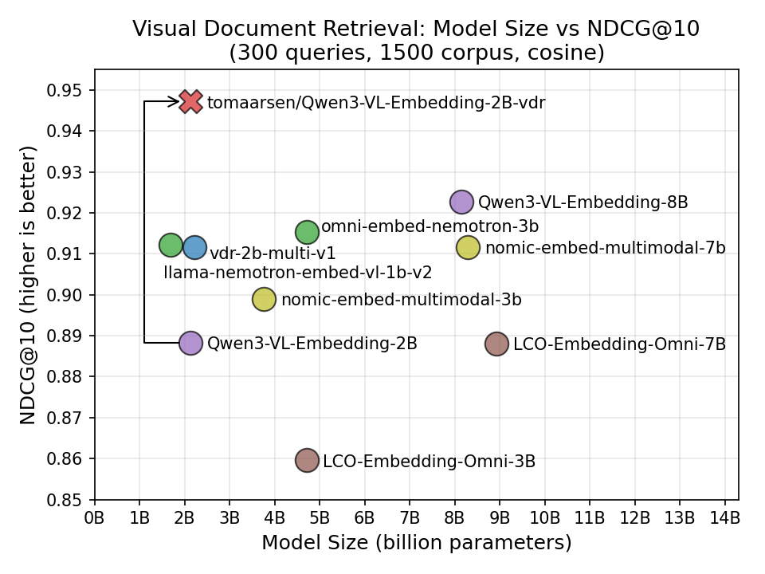
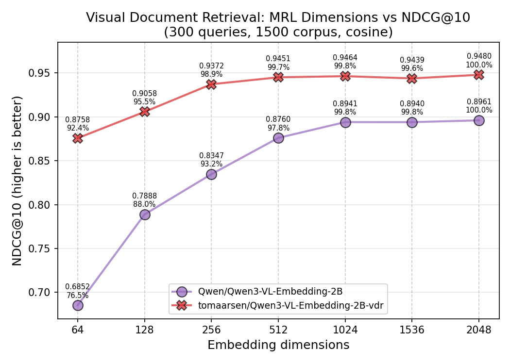

---
authors:
- aitoboxrobot
categories:
- 工具教程
date: 2026-08-07
hide:
- navigation
tags:
- Sentence Transformers
- 多模态
- 微调
- 嵌入模型
- 视觉文档检索
title: 使用 Sentence Transformers 训练和微调多模态嵌入与重排模型
---
### 文章背景与核心概要
本文详细介绍了如何利用 **Sentence Transformers** 框架来训练和微调多模态嵌入（Multimodal Embedding）以及重排（Reranker）模型。文章以视觉文档检索（Visual Document Retrieval, VDR）为实际案例，具体对 `Qwen/Qwen3-VL-Embedding-2B` 模型进行了微调，完整演示了模型配置、数据集处理（涵盖文本、图像及困难负样本）、应用诸如 `CachedMultipleNegativesRankingLoss` 和 `MatryoshkaLoss` 等损失函数、设置评估器（Evaluator）以及使用 `SentenceTransformerTrainer` 的全过程。

通过针对特定领域的微调，最终的模型显著提升了检索性能，在超越更大体积模型的同时，还支持高效的向量维度截断。对于希望构建定制化、高性能多模态检索系统的开发者和研究人员而言，这是一份极具实操价值的技术指南。

---

# 目录

- [为什么要微调？](#为什么要微调)
- [训练组件](#训练组件)
- [模型](#模型)
- [数据集](#数据集)
  - [视觉文档检索数据集](#视觉文档检索数据集)
  - [数据集格式](#数据集格式)
- [损失函数](#损失函数)
  - [CachedMultipleNegativesRankingLoss](#cachedmultiplenegativesrankingloss)
  - [MatryoshkaLoss](#matryoshkaloss)
- [训练参数](#训练参数)
- [评估器](#评估器)
- [训练器](#训练器)
- [结果](#结果)
  - [模型规模与 NDCG@10 的对比](#模型规模与-ndcg10-的对比)
  - [Matryoshka 维度与 NDCG@10 的对比](#matryoshka-维度与-ndcg10-的对比)
- [训练多模态重排模型](#训练多模态重排模型)
- [其他资源](#其他资源)
  - [训练示例](#训练示例)
  - [文档](#文档)
  - [配套博客](#配套博客)

---

## 为什么要微调？

通用的多模态嵌入模型（例如 [`Qwen/Qwen3-VL-Embedding-2B`](https://huggingface.co/Qwen/Qwen3-VL-Embedding-2B)）通常是在多样化的数据上进行训练的，以便在各种语言和任务中表现出色，如：图文匹配、视觉问答、文档理解等。但这种通用性意味着模型很难在任何特定任务上成为最佳选择。

以视觉文档检索为例：给定一个文本查询，如“该公司第三季度的营收是多少？”，模型必须从包含数千个文档的语料库中找出最相关的文档截图。这需要理解文档布局、图表、表格和文本，这与例如将鞋子图片与产品描述进行匹配是一项截然不同的技能。

通过在特定领域的数据上进行微调，模型能够学习到这些专门的模式。在我的实验中，微调将 NDCG@10 从 0.888 提升到了 0.947，超越了我测试的所有近期多模态模型，包括体积大达 4 倍的模型。

> General-purpose multimodal embedding models like [`Qwen/Qwen3-VL-Embedding-2B`](https://huggingface.co/Qwen/Qwen3-VL-Embedding-2B) are trained on diverse data to perform well across a wide range of languages and tasks: image-text matching, visual question answering, document understanding, and more. But this generality means the model is rarely the best choice for any specific task.
>
> Consider Visual Document Retrieval: given a text query like "What was the company's Q3 revenue?", the model must find the most relevant document screenshot from a corpus of thousands. This requires understanding document layouts, charts, tables, and text, which is a very different skill from e.g. matching pictures of shoes with product descriptions.
>
> By finetuning on domain-specific data, the model can learn these specialized patterns. In my experiment, finetuning improved NDCG@10 from 0.888 to 0.947, ahead of every recent multimodal model I tested, including ones up to 4x larger.

---

## 训练组件

训练多模态 Sentence Transformer 模型涉及与纯文本模型相同的组件：

1. **[模型](#模型)**：要训练或微调的多模态模型。
2. **[数据集](#数据集)**：用于训练和评估的数据。
3. **[损失函数](#损失函数)**：量化模型性能并指导优化过程的函数。
4. **训练参数**（可选）：影响训练性能以及跟踪/调试的参数。
5. **[评估器](#评估器)**（optional）：用于在训练前、训练中或训练后评估模型的工具。
6. **[训练器](#训练器)**：将模型、数据集、损失函数和其他组件汇集在一起进行训练。

多模态训练流水线使用与纯文本训练相同的 [`SentenceTransformerTrainer`](https://sbert.net/docs/package_reference/sentence_transformer/trainer.html#sentence_transformers.sentence_transformer.trainer.SentenceTransformerTrainer)。主要的区别在于你的数据集包含图像（或其他模态）以及文本，并且模型的处理器会自动处理图像预处理。

让我们以视觉文档检索（将文本查询与文档截图匹配）作为运行示例，逐一遍历每个组件。

> Training multimodal Sentence Transformer models involves the same components as training text-only models:
>
> 1. **[Model](#model)**: The multimodal model to train or finetune.
> 2. **[Dataset](#dataset)**: The data used for training and evaluation.
> 3. **[Loss Function](#loss-function)**: A function that quantifies the model's performance and guides the optimization process.
> 4. **Training Arguments** (optional): Parameters that influence training performance and tracking/debugging.
> 5. **[Evaluator](#evaluator)** (optional): A tool for evaluating the model before, during, or after training.
> 6. **[Trainer](#trainer)**: Brings together the model, dataset, loss function, and other components for training.
>
> The multimodal training pipeline uses the same [`SentenceTransformerTrainer`](https://sbert.net/docs/package_reference/sentence_transformer/trainer.html#sentence_transformers.sentence_transformer.trainer.SentenceTransformerTrainer) as text-only training. The key difference is that your datasets contain images (or other modalities) alongside text, and the model's processor handles the image preprocessing automatically.
>
> Let's walk through each component, using Visual Document Retrieval (matching text queries to document screenshots) as a running example.

---

## 模型

最常见的方法是微调现有的多模态嵌入模型，或者从视觉语言模型（VLM）检查点开始。[`Transformer`](https://sbert.net/docs/package_reference/base/modules.html#sentence_transformers.base.modules.Transformer) 模块会自动从模型的处理器中检测受支持的模态。

要微调现有的多模态嵌入模型（例如已经具有 `modules.json` 文件的模型），你可以分别传递 `processor_kwargs` 和 `model_kwargs` 来控制预处理和模型加载。`processor_kwargs` 直接传递给 [`AutoProcessor.from_pretrained(...)`](https://huggingface.co/docs/transformers/model_doc/auto#transformers.AutoProcessor.from_pretrained)（例如，图像分辨率边界：更高的 `max_pixels` 意味着更高的质量但占用更多内存），而 `model_kwargs` 传递给相应的 [`AutoModel.from_pretrained(...)`](https://huggingface.co/docs/transformers/model_doc/auto#transformers.AutoModel.from_pretrained) 调用（例如，精度、注意力实现）：

```python
from sentence_transformers import SentenceTransformer

model = SentenceTransformer(
    "Qwen/Qwen3-VL-Embedding-2B",
    model_kwargs={"attn_implementation": "flash_attention_2", "torch_dtype": "bfloat16"},
    processor_kwargs={"min_pixels": 28 * 28, "max_pixels": 600 * 600},
)
```

你也可以从尚未针对嵌入进行训练的全新 VLM 检查点开始。Sentence Transformers 将尝试识别架构，从处理器中推断出支持的模态，并设置相应的前向传播方法和池化（pooling）。如果自动检测对特定模型运行得不是非常完美，可以编辑保存的 `sentence_bert_config.json` 中的配置来调整模态设置、前向传播方法和输出处理：

```python
from sentence_transformers import SentenceTransformer

model = SentenceTransformer("Qwen/Qwen3-VL-2B")
```

在这两种情况下，[`Transformer`](https://sbert.net/docs/package_reference/base/modules.html#sentence_transformers.base.modules.Transformer) 模块都会检查处理器以确定哪些模态可用，如果需要，会自动添加 [`Pooling`](https://sbert.net/docs/package_reference/sentence_transformer/modules.html#sentence_transformers.sentence_transformer.modules.Pooling)。你可以验证支持的模态：

```python
print(model.modalities)
# ['text', 'image', 'video', 'message']

print(model.supports("image"))
# True
```

<details>
<summary>替代方案：使用 Router 构建多模态模型</summary>

你也可以不使用单一的 VLM 骨干网络，而是使用 [`Router`](https://sbert.net/docs/package_reference/base/modules.html#sentence_transformers.base.modules.Router) 模块为不同的模态组合独立的编码器。这使你能够组合任何现有的编码器，并根据检测到的模态将输入路由到适当的编码器：

```python
from sentence_transformers import SentenceTransformer
from sentence_transformers.sentence_transformer.modules import Dense, Pooling, Router, Transformer

# 为不同模态创建独立的编码器
text_encoder = Transformer("sentence-transformers/all-MiniLM-L6-v2")
text_pooling = Pooling(text_encoder.get_embedding_dimension(), pooling_mode="mean")
text_projection = Dense(text_encoder.get_embedding_dimension(), 768)

# SigLIP 直接输出池化后的嵌入，因此不需要单独的 Pooling 模块
image_encoder = Transformer("google/siglip2-base-patch16-224")

# 根据模态路由输入
router = Router(
    sub_modules={
        "text": [text_encoder, text_pooling, text_projection],
        "image": [image_encoder],
    },
)

model = SentenceTransformer(modules=[router])
```

> **警告**
>由于基于 Router 的多模态模型每个模态使用独立的编码器，它们的嵌入空间最初并未对齐。需要进行训练来对齐这些空间，以实现有意义的跨模态相似度。上面显示的 `Dense` 投影层有助于将来自不同编码器的嵌入映射到一个共享空间中。

当你想要使用轻量级、专用的编码器而不是大型 VLM 时，这种方法非常有用。你还可以使用 `route_mappings` 将基于 Router 的多模态与基于任务的路由（例如，针对查询与文档使用不同的编码器）结合起来。有关高级路由场景，请参阅 [`Router`](https://sbert.net/docs/package_reference/base/modules.html#sentence_transformers.base.modules.Router) 文档。

</details>

> The most common approach is to finetune an existing multimodal embedding model, or to start from a Vision-Language Model (VLM) checkpoint. The [`Transformer`](https://sbert.net/docs/package_reference/base/modules.html#sentence_transformers.base.modules.Transformer) module automatically detects supported modalities from the model's processor.
>
> To finetune an existing multimodal embedding model (e.g. one that already has a `modules.json` file), you can pass `processor_kwargs` and `model_kwargs` to control preprocessing and model loading respectively. `processor_kwargs` are passed directly to [`AutoProcessor.from_pretrained(...)`](https://huggingface.co/docs/transformers/model_doc/auto#transformers.AutoProcessor.from_pretrained) (e.g., image resolution bounds: higher `max_pixels` means higher quality but more memory), while `model_kwargs` are passed to the appropriate [`AutoModel.from_pretrained(...)`](https://huggingface.co/docs/transformers/model_doc/auto#transformers.AutoModel.from_pretrained) call (e.g., precision, attention implementation):
>
> ```python
> from sentence_transformers import SentenceTransformer
>
> model = SentenceTransformer(
>     "Qwen/Qwen3-VL-Embedding-2B",
>     model_kwargs={"attn_implementation": "flash_attention_2", "torch_dtype": "bfloat16"},
>     processor_kwargs={"min_pixels": 28 * 28, "max_pixels": 600 * 600},
> )
> ```
>
> You can also start from a fresh VLM checkpoint that hasn't been trained for embeddings yet. Sentence Transformers will attempt to recognize the architecture, infer the supported modalities from the processor, and set up the appropriate forward method and pooling. If the automatic detection doesn't work perfectly for a particular model, the configuration in the saved `sentence_bert_config.json` can be edited to adjust modality settings, forward methods, and output handling:
>
> ```python
> from sentence_transformers import SentenceTransformer
>
> model = SentenceTransformer("Qwen/Qwen3-VL-2B")
> ```
>
> In both cases, the [`Transformer`](https://sbert.net/docs/package_reference/base/modules.html#sentence_transformers.base.modules.Transformer) module inspects the processor to determine which modalities are available, and [`Pooling`](https://sbert.net/docs/package_reference/sentence_transformer/modules.html#sentence_transformers.sentence_transformer.modules.Pooling) is added automatically if needed. You can verify the supported modalities:
>
> ```python
> print(model.modalities)
> # ['text', 'image', 'video', 'message']
>
> print(model.supports("image"))
> # True
> ```
>
> <details>
> <summary>Alternative: Building multimodal models with Router</summary>
>
> Instead of using a single VLM backbone, you can compose separate encoders for different modalities using the [`Router`](https://sbert.net/docs/package_reference/base/modules.html#sentence_transformers.base.modules.Router) module. This lets you combine any existing encoders and route inputs to the appropriate one based on detected modality:
>
> ```python
> from sentence_transformers import SentenceTransformer
> from sentence_transformers.sentence_transformer.modules import Dense, Pooling, Router, Transformer
>
> # Create separate encoders for different modalities
> text_encoder = Transformer("sentence-transformers/all-MiniLM-L6-v2")
> text_pooling = Pooling(text_encoder.get_embedding_dimension(), pooling_mode="mean")
> text_projection = Dense(text_encoder.get_embedding_dimension(), 768)
>
> # SigLIP outputs pooled embeddings directly, so no separate Pooling module is needed
> image_encoder = Transformer("google/siglip2-base-patch16-224")
>
> # Route inputs based on modality
> router = Router(
>     sub_modules={
>         "text": [text_encoder, text_pooling, text_projection],
>         "image": [image_encoder],
>     },
> )
>
> model = SentenceTransformer(modules=[router])
> ```
>
> > **Warning**
> > Since Router-based multimodal models use separate encoders per modality, their embedding spaces are initially unaligned. Training is required to align the spaces for meaningful cross-modal similarity. The `Dense` projection layer shown above helps map embeddings from different encoders into a shared space.
>
> This approach is useful when you want to use lightweight, specialized encoders rather than a large VLM. You can also combine Router-based multimodality with task-based routing (e.g. different encoders for queries vs. documents) using `route_mappings`. See the [`Router`](https://sbert.net/docs/package_reference/base/modules.html#sentence_transformers.base.modules.Router) documentation for advanced routing scenarios.
>
> </details>

---

## Dataset

### 视觉文档检索数据集

对于这个示例，我使用 [`tomaarsen/llamaindex-vdr-en-train-preprocessed`](https://huggingface.co/datasets/tomaarsen/llamaindex-vdr-en-train-preprocessed) 数据集，它是 [`llamaindex/vdr-multilingual-train`](https://huggingface.co/datasets/llamaindex/vdr-multilingual-train) 的预处理英语子集。源数据集随 LlamaIndex 的博客 [Visual Document Retrieval Goes Multilingual](https://huggingface.co/blog/vdr-2b-multilingual) 一同发布，包含从公共互联网 PDF 中收集的约 50k 个多语言查询-图像样本，其查询是通过 VLM（gemini-1.5-pro 和 Qwen2-VL-72B）合成生成的。
我的预处理版本筛选出了 53,512 个英语样本，并将每个样本中 16 个基于 ID 的困难负样本中的 4 个解析为实际的文档截图图像，因此它可以直接用于训练而无需进一步预处理：

```python
from datasets import load_dataset

train_dataset = load_dataset("tomaarsen/llamaindex-vdr-en-train-preprocessed", "train", split="train")
train_dataset = train_dataset.select_columns(["query", "image", "negative_0"])
eval_dataset = load_dataset("tomaarsen/llamaindex-vdr-en-train-preprocessed", "eval", split="train")
```

`train` 配置包含前 10,000 个样本，`eval` 配置包含接下来的 300 个样本（同时也提供包含全部 53,512 个样本的 `full` 配置）。在训练时，我选择 `query`、`image` 和 `negative_0` 来组成（锚点、正样本、困难负样本）三元组。包含额外的困难负样本可能会改善训练信号，但每个额外的负样本也会增加内存使用量和训练时间，所以我只保留一个。对于评估，我保留了每个查询的所有四个困难负样本，以构建更具挑战性的检索语料库。

> ### Visual Document Retrieval Dataset
>
> For this example, I use the [`tomaarsen/llamaindex-vdr-en-train-preprocessed`](https://huggingface.co/datasets/tomaarsen/llamaindex-vdr-en-train-preprocessed) dataset, a preprocessed English subset of [`llamaindex/vdr-multilingual-train`](https://huggingface.co/datasets/llamaindex/vdr-multilingual-train). The source dataset was released alongside the [Visual Document Retrieval Goes Multilingual](https://huggingface.co/blog/vdr-2b-multilingual) blogpost by LlamaIndex, and consists of ~500k multilingual query-image samples collected from public internet PDFs, with queries synthetically generated using VLMs (gemini-1.5-pro and Qwen2-VL-72B). 
> My preprocessed version filters to the 53,512 English samples and resolves 4 of the 16 ID-based hard negatives per sample into actual document screenshot images, so it can be used directly for training without further preprocessing:
>
> ```python
> from datasets import load_dataset
>
> train_dataset = load_dataset("tomaarsen/llamaindex-vdr-en-train-preprocessed", "train", split="train")
> train_dataset = train_dataset.select_columns(["query", "image", "negative_0"])
> eval_dataset = load_dataset("tomaarsen/llamaindex-vdr-en-train-preprocessed", "eval", split="train")
> ```
>
> The `train` config contains the first 10,000 samples, and the `eval` config contains the next 300 samples (a `full` config with all 53,512 samples is also available). For training, I select `query`, `image`, and `negative_0` to form (anchor, positive, hard negative) triplets. Including additional hard negatives would likely improve the training signal, but each extra negative also increases memory usage and training time, so I stick with one. For evaluation, I keep all four hard negatives per query to build a more challenging retrieval corpus.

### 数据集格式

就像纯文本训练一样，数据集格式必须与你选择的损失函数相匹配。规则是相同的：

1. 如果你的损失函数需要*标签*（Label），你的数据集必须包含一个名为 **"label"** 或 **"score"** 的列。
2. 除 **"label"** 或 **"score"** 之外的所有列都被视为*输入*（Inputs）。这些列的数量必须与你选择的损失函数的有效输入数量相匹配。除了标签列之外，列名并不重要，只有顺序才重要。

对于多模态数据集，输入可以包含：
- **文本**：字符串。
- **图像**：PIL 图像、文件路径、URL 或 numpy/torch 数组。
- **音频**：文件路径、numpy/torch 数组、带有 `"array"` 和 `"sampling_rate"` 键的字典，或 `torchcodec.AudioDecoder` 实例。
- **视频**：文件路径、numpy/torch 数组、带有 `"array"` 和 `"video_metadata"` 键的字典，或 `torchcodec.VideoDecoder` 实例。
- **多模态字典**：将模态名称映射到值的字典，例如 `{"text": ..., "image": ...}`。键必须是 `"text"`、`"image"`、`"audio"` 或 `"video"`。

数据整理器（Data Collator）会自动调用 `model.preprocess()`，它会检测每个输入的模态并应用适当的预处理。无需手动进行分词或图像处理。

> **提示**
>许多可以直接与 Sentence Transformers 一起使用的 Hugging Face 数据集都打上了 `sentence-transformers` 标签，你可以通过访问 [https://huggingface.co/datasets?other=sentence-transformers](https://huggingface.co/datasets?other=sentence-transformers) 轻松找到它们。

> ### Dataset Format
>
> Just like text-only training, the dataset format must match your chosen loss function. The rules are the same:
>
> 1. If your loss function requires a *Label*, your dataset must have a column named **"label"** or **"score"**.
> 2. All columns other than **"label"** or **"score"** are considered *Inputs*. The number of these columns must match the number of valid inputs for your chosen loss function. Beyond the label column, the column names don't matter, only the order does.
>
> For multimodal datasets, the inputs can contain:
> - **Text**: strings.
> - **Image**: PIL images, file paths, URLs, or numpy/torch arrays.
> - **Audio**: file paths, numpy/torch arrays, dicts with `"array"` and `"sampling_rate"` keys, or `torchcodec.AudioDecoder` instances.
> - **Video**: file paths, numpy/torch arrays, dicts with `"array"` and `"video_metadata"` keys, or `torchcodec.VideoDecoder` instances.
> - **Multimodal dicts**: a dict mapping modality names to values, e.g. `{"text": ..., "image": ...}`. The keys must be `"text"`, `"image"`, `"audio"`, or `"video"`.
>
> The data collator automatically calls `model.preprocess()`, which detects the modality of each input and applies the appropriate preprocessing. No manual tokenization or image processing is needed.
>
> > **Tip**
> > Many Hugging Face datasets that work out of the box with Sentence Transformers have been tagged with `sentence-transformers`, allowing you to easily find them at [https://huggingface.co/datasets?other=sentence-transformers](https://huggingface.co/datasets?other=sentence-transformers).

---

## 损失函数

### CachedMultipleNegativesRankingLoss

对于这次训练，我使用了 [`CachedMultipleNegativesRankingLoss`](https://sbert.net/docs/package_reference/sentence_transformer/losses.html#cachedmultiplenegativesrankingloss)，这是检索任务的常见选择。它接受包含任意数量额外困难负样本列（从 0 到 n）的（查询，正样本）对，前提是每个样本具有相同数量的负样本。
在训练期间，损失函数会拉高每个查询与其正样本的相似度，并拉低其与每个负样本的相似度。负样本来自两个来源：

1. **困难负样本**：数据集中显式提供的负样本列（在我们的三元组设置中仅为 `negative_0`）。
2. **批次内负样本（In-batch negatives）**：同一批次中每个*其他*样本的正样本和困难负样本，它们被免费重用为该查询的额外负样本。

每个查询有更多的负样本意味着更强的训练信号，因此更大的批次大小（batch size）可以直接提高训练质量。除此之外，损失函数的“缓存”变体利用了梯度缓存（gradient caching），使得即使在 GPU 内存受限的情况下，也能实现较大的有效批次大小。

`mini_batch_size` 参数控制在缓存的前向传递过程中一次处理多少个样本。对于大型多模态模型，将其设置为较小的值（例如 1）对于避免内存溢出（OOM）错误同时不牺牲大有效批次大小的好处非常重要：

```python
from sentence_transformers.sentence_transformer.losses import CachedMultipleNegativesRankingLoss

loss = CachedMultipleNegativesRankingLoss(model, mini_batch_size=1)
```

> ### CachedMultipleNegativesRankingLoss
>
> For this training, I use [`CachedMultipleNegativesRankingLoss`](https://sbert.net/docs/package_reference/sentence_transformer/losses.html#cachedmultiplenegativesrankingloss), a common choice for retrieval tasks. It accepts (query, positive) pairs with any number of additional hard negative columns, from 0 up to n, as long as each sample has the same number of negatives.
> During training, the loss pushes each query's similarity to its positive *up* and its similarity to every negative *down*. The negatives come from two sources:
>
> 1. **Hard negatives**: the negative column(s) explicitly supplied in the dataset (just `negative_0` in our triplet setup).
> 2. **In-batch negatives**: the positives and hard negatives from every *other* sample in the same batch, reused as additional negatives for this query at no extra cost.
>
> More negatives per query means a stronger training signal, so a larger batch size directly improves training quality. Beyond that, the "cached" variant of the loss uses gradient caching to make large effective batch sizes feasible even when GPU memory is limited.
>
> The `mini_batch_size` parameter controls how many samples are processed at once during the cached forward passes. For large multimodal models, setting this to a small value (e.g., 1) is important to avoid out-of-memory errors without sacrificing the benefits of large effective batch sizes:
>
> ```python
> from sentence_transformers.sentence_transformer.losses import CachedMultipleNegativesRankingLoss
>
> loss = CachedMultipleNegativesRankingLoss(model, mini_batch_size=1)
> ```

### MatryoshkaLoss

为了生成在多种维度下都能良好工作的嵌入，我用 [`MatryoshkaLoss`](https://sbert.net/docs/package_reference/sentence_transformer/losses.html#matryoshkaloss) 包装了基础损失函数。这会训练模型，使得将嵌入截断到较少数量的维度时，仍然能产生良好的性能：

```python
from sentence_transformers.sentence_transformer.losses import CachedMultipleNegativesRankingLoss, MatryoshkaLoss

loss = CachedMultipleNegativesRankingLoss(model, mini_batch_size=1)
loss = MatryoshkaLoss(model, loss, matryoshka_dims=[2048, 1536, 1024, 512, 256, 128, 64])
```

这对于多模态模型特别有用，因为多模态模型的嵌入可能很大（Qwen3-VL 为 2048 维）。通过 Matryoshka 训练，你可以在部署时使用截断的嵌入（例如 256 或 128 维），从而以极小的质量损失实现更快的搜索。

> ### MatryoshkaLoss
>
> To produce embeddings that work well at multiple dimensionalities, I wrap the base loss with [`MatryoshkaLoss`](https://sbert.net/docs/package_reference/sentence_transformer/losses.html#matryoshkaloss). This trains the model so that truncating the embedding to a smaller number of dimensions still yields good performance:
>
> ```python
> from sentence_transformers.sentence_transformer.losses import CachedMultipleNegativesRankingLoss, MatryoshkaLoss
>
> loss = CachedMultipleNegativesRankingLoss(model, mini_batch_size=1)
> loss = MatryoshkaLoss(model, loss, matryoshka_dims=[2048, 1536, 1024, 512, 256, 128, 64])
> ```
>
> This is especially useful for multimodal models, where embeddings can be large (2048 dimensions for Qwen3-VL). With Matryoshka training, you can use truncated embeddings (e.g., 256 or 128 dimensions) at deployment time for faster search with minimal quality loss.

---

## 训练参数

[`SentenceTransformerTrainingArguments`](https://sbert.net/docs/package_reference/sentence_transformer/training_args.html#sentencetransformertrainingarguments) 类允许你控制训练超参数。以下是 VDR 微调所使用的配置：

```python
from sentence_transformers.sentence_transformer.training_args import SentenceTransformerTrainingArguments, BatchSamplers

run_name = "Qwen3-VL-Embedding-2B-vdr"
args = SentenceTransformerTrainingArguments(
    output_dir=f"models/{run_name}",
    num_train_epochs=1,
    per_device_train_batch_size=64,
    per_device_eval_batch_size=64,
    learning_rate=2e-5,
    warmup_ratio=0.1,
    fp16=False,
    bf16=True,
    batch_sampler=BatchSamplers.NO_DUPLICATES,
    eval_strategy="steps",
    eval_steps=0.1,
    save_strategy="steps",
    save_steps=0.1,
    save_total_limit=2,
    logging_steps=0.05,
    run_name=run_name,
)
```

> The [`SentenceTransformerTrainingArguments`](https://sbert.net/docs/package_reference/sentence_transformer/training_args.html#sentencetransformertrainingarguments) class lets you control training hyperparameters. Here's the configuration used for the VDR finetuning:
>
> ```python
> from sentence_transformers.sentence_transformer.training_args import SentenceTransformerTrainingArguments, BatchSamplers
>
> run_name = "Qwen3-VL-Embedding-2B-vdr"
> args = SentenceTransformerTrainingArguments(
>     output_dir=f"models/{run_name}",
>     num_train_epochs=1,
>     per_device_train_batch_size=64,
>     per_device_eval_batch_size=64,
>     learning_rate=2e-5,
>     warmup_ratio=0.1,
>     fp16=False,
>     bf16=True,
>     batch_sampler=BatchSamplers.NO_DUPLICATES,
>     eval_strategy="steps",
>     eval_steps=0.1,
>     save_strategy="steps",
>     save_steps=0.1,
>     save_total_limit=2,
>     logging_steps=0.05,
>     run_name=run_name,
> )
> ```

---

## 评估器

为了在训练前、训练中和训练后跟踪检索性能，我使用了 [`InformationRetrievalEvaluator`](https://sbert.net/docs/package_reference/sentence_transformer/evaluation.html#informationretrievalevaluator)：

```python
from sentence_transformers.sentence_transformer.evaluation import InformationRetrievalEvaluator

eval_queries = {qid: sample["query"] for qid, sample in enumerate(eval_dataset)}
eval_corpus = {did: sample["image"] for did, sample in enumerate(eval_dataset)}
num_eval = len(eval_dataset)

negative_columns = ["negative_0", "negative_1", "negative_2", "negative_3"]
for neg_idx, neg_col in enumerate(negative_columns):
    for did, sample in enumerate(eval_dataset):
        eval_corpus[num_eval * (neg_idx + 1) + did] = sample[neg_col]

eval_relevant_docs = {idx: [idx] for idx in range(len(eval_dataset))}

eval_evaluator = InformationRetrievalEvaluator(
    queries=eval_queries,
    corpus=eval_corpus,
    relevant_docs=eval_relevant_docs,
    batch_size=1,
    show_progress_bar=True,
    name="vdr-eval-hard",
)
```

> To track retrieval performance before, during, and after training, I use the [`InformationRetrievalEvaluator`](https://sbert.net/docs/package_reference/sentence_transformer/evaluation.html#informationretrievalevaluator):
>
> ```python
> from sentence_transformers.sentence_transformer.evaluation import InformationRetrievalEvaluator
>
> eval_queries = {qid: sample["query"] for qid, sample in enumerate(eval_dataset)}
> eval_corpus = {did: sample["image"] for did, sample in enumerate(eval_dataset)}
> num_eval = len(eval_dataset)
>
> negative_columns = ["negative_0", "negative_1", "negative_2", "negative_3"]
> for neg_idx, neg_col in enumerate(negative_columns):
>     for did, sample in enumerate(eval_dataset):
>         eval_corpus[num_eval * (neg_idx + 1) + did] = sample[neg_col]
>
> eval_relevant_docs = {idx: [idx] for idx in range(len(eval_dataset))}
>
> eval_evaluator = InformationRetrievalEvaluator(
>     queries=eval_queries,
>     corpus=eval_corpus,
>     relevant_docs=eval_relevant_docs,
>     batch_size=1,
>     show_progress_bar=True,
>     name="vdr-eval-hard",
> )
> ```

---

## 训练器

[`SentenceTransformerTrainer`](https://sbert.net/docs/package_reference/sentence_transformer/trainer.html#sentence_transformers.sentence_transformer.trainer.SentenceTransformerTrainer) 将所有内容汇集在一起。以下是完整的训练脚本：

```python
from datasets import load_dataset
from sentence_transformers import SentenceTransformer
from sentence_transformers.sentence_transformer.evaluation import InformationRetrievalEvaluator
from sentence_transformers.sentence_transformer.losses import CachedMultipleNegativesRankingLoss, MatryoshkaLoss
from sentence_transformers.sentence_transformer.model_card import SentenceTransformerModelCardData
from sentence_transformers.sentence_transformer.trainer import SentenceTransformerTrainer
from sentence_transformers.sentence_transformer.training_args import (
    BatchSamplers,
    SentenceTransformerTrainingArguments,
)

# 1. 加载要微调的模型
model = SentenceTransformer(
    "Qwen/Qwen3-VL-Embedding-2B",
    model_card_data=SentenceTransformerModelCardData(
        language="en",
        license="apache-2.0",
        model_name="Qwen3-VL-Embedding-2B model trained on Visual Document Retrieval query-document screenshot pairs",
    ),
    model_kwargs={"attn_implementation": "flash_attention_2", "torch_dtype": "bfloat16"},
    processor_kwargs={"min_pixels": 28 * 28, "max_pixels": 600 * 600},
)

# 2. 加载数据集
train_dataset = load_dataset("tomaarsen/llamaindex-vdr-en-train-preprocessed", "train", split="train")
train_dataset = train_dataset.select_columns(["query", "image", "negative_0"])
eval_dataset = load_dataset("tomaarsen/llamaindex-vdr-en-train-preprocessed", "eval", split="train")

# 3. 定义损失函数
loss = CachedMultipleNegativesRankingLoss(model, mini_batch_size=1)
loss = MatryoshkaLoss(model, loss, matryoshka_dims=[2048, 1536, 1024, 512, 256, 128, 64])

# 4. 训练参数
run_name = "Qwen3-VL-Embedding-2B-vdr"
args = SentenceTransformerTrainingArguments(
    output_dir=f"models/{run_name}",
    num_train_epochs=1,
    per_device_train_batch_size=64,
    per_device_eval_batch_size=64,
    learning_rate=2e-5,
    warmup_ratio=0.1,
    fp16=False,
    bf16=True,
    batch_sampler=BatchSamplers.NO_DUPLICATES,
    eval_strategy="steps",
    eval_steps=0.1,
    save_strategy="steps",
    save_steps=0.1,
    save_total_limit=2,
    logging_steps=0.05,
    run_name=run_name,
)

# 5. 创建评估器并评估基础模型
eval_queries = {qid: sample["query"] for qid, sample in enumerate(eval_dataset)}
eval_corpus = {did: sample["image"] for did, sample in enumerate(eval_dataset)}
num_eval = len(eval_dataset)
negative_columns = ["negative_0", "negative_1", "negative_2", "negative_3"]
for neg_idx, neg_col in enumerate(negative_columns):
    for did, sample in enumerate(eval_dataset):
        eval_corpus[num_eval * (neg_idx + 1) + did] = sample[neg_col]
eval_relevant_docs = {idx: [idx] for idx in range(len(eval_dataset))}

eval_evaluator = InformationRetrievalEvaluator(
    queries=eval_queries,
    corpus=eval_corpus,
    relevant_docs=eval_relevant_docs,
    batch_size=1,
    show_progress_bar=True,
    name="vdr-eval-hard",
)
eval_evaluator(model)

# 6. 创建训练器并开始训练
trainer = SentenceTransformerTrainer(
    model=model,
    args=args,
    train_dataset=train_dataset,
    eval_dataset=eval_dataset,
    loss=loss,
    evaluator=eval_evaluator,
)
trainer.train()

# 7. 在每个 Matryoshka 维度上进行评估
eval_evaluator(model)
for dim in [2048, 1536, 1024, 512, 256, 128, 64]:
    dim_evaluator = InformationRetrievalEvaluator(
        queries=eval_queries,
        corpus=eval_corpus,
        relevant_docs=eval_relevant_docs,
        truncate_dim=dim,
        batch_size=1,
        show_progress_bar=True,
        name=f"vdr-eval-hard-{dim}d",
    )
    dim_evaluator(model)

# 8. 保存并推送到 Hub
model.save_pretrained(f"models/{run_name}/final")
model.push_to_hub("Qwen3-VL-Embedding-2B-vdr")
```

> The [`SentenceTransformerTrainer`](https://sbert.net/docs/package_reference/sentence_transformer/trainer.html#sentence_transformers.sentence_transformer.trainer.SentenceTransformerTrainer) brings everything together. Here's the complete training script:
>
> ```python
> from datasets import load_dataset
> from sentence_transformers import SentenceTransformer
> from sentence_transformers.sentence_transformer.evaluation import InformationRetrievalEvaluator
> from sentence_transformers.sentence_transformer.losses import CachedMultipleNegativesRankingLoss, MatryoshkaLoss
> from sentence_transformers.sentence_transformer.model_card import SentenceTransformerModelCardData
> from sentence_transformers.sentence_transformer.trainer import SentenceTransformerTrainer
> from sentence_transformers.sentence_transformer.training_args import (
>     BatchSamplers,
>     SentenceTransformerTrainingArguments,
> )
>
> # 1. Load a model to finetune
> model = SentenceTransformer(
>     "Qwen/Qwen3-VL-Embedding-2B",
>     model_card_data=SentenceTransformerModelCardData(
>         language="en",
>         license="apache-2.0",
>         model_name="Qwen3-VL-Embedding-2B model trained on Visual Document Retrieval query-document screenshot pairs",
>     ),
>     model_kwargs={"attn_implementation": "flash_attention_2", "torch_dtype": "bfloat16"},
>     processor_kwargs={"min_pixels": 28 * 28, "max_pixels": 600 * 600},
> )
>
> # 2. Load dataset
> train_dataset = load_dataset("tomaarsen/llamaindex-vdr-en-train-preprocessed", "train", split="train")
> train_dataset = train_dataset.select_columns(["query", "image", "negative_0"])
> eval_dataset = load_dataset("tomaarsen/llamaindex-vdr-en-train-preprocessed", "eval", split="train")
>
> # 3. Define a loss function
> loss = CachedMultipleNegativesRankingLoss(model, mini_batch_size=1)
> loss = MatryoshkaLoss(model, loss, matryoshka_dims=[2048, 1536, 1024, 512, 256, 128, 64])
>
> # 4. Training arguments
> run_name = "Qwen3-VL-Embedding-2B-vdr"
> args = SentenceTransformerTrainingArguments(
>     output_dir=f"models/{run_name}",
>     num_train_epochs=1,
>     per_device_train_batch_size=64,
>     per_device_eval_batch_size=64,
>     learning_rate=2e-5,
>     warmup_ratio=0.1,
>     fp16=False,
>     bf16=True,
>     batch_sampler=BatchSamplers.NO_DUPLICATES,
>     eval_strategy="steps",
>     eval_steps=0.1,
>     save_strategy="steps",
>     save_steps=0.1,
>     save_total_limit=2,
>     logging_steps=0.05,
>     run_name=run_name,
> )
>
> # 5. Create an evaluator & evaluate base model
> eval_queries = {qid: sample["query"] for qid, sample in enumerate(eval_dataset)}
> eval_corpus = {did: sample["image"] for did, sample in enumerate(eval_dataset)}
> num_eval = len(eval_dataset)
> negative_columns = ["negative_0", "negative_1", "negative_2", "negative_3"]
> for neg_idx, neg_col in enumerate(negative_columns):
>     for did, sample in enumerate(eval_dataset):
>         eval_corpus[num_eval * (neg_idx + 1) + did] = sample[neg_col]
> eval_relevant_docs = {idx: [idx] for idx in range(len(eval_dataset))}
>
> eval_evaluator = InformationRetrievalEvaluator(
>     queries=eval_queries,
>     corpus=eval_corpus,
>     relevant_docs=eval_relevant_docs,
>     batch_size=1,
>     show_progress_bar=True,
>     name="vdr-eval-hard",
> )
> eval_evaluator(model)
>
> # 6. Create trainer & train
> trainer = SentenceTransformerTrainer(
>     model=model,
>     args=args,
>     train_dataset=train_dataset,
>     eval_dataset=eval_dataset,
>     loss=loss,
>     evaluator=eval_evaluator,
> )
> trainer.train()
>
> # 7. Evaluate at each Matryoshka dimension
> eval_evaluator(model)
> for dim in [2048, 1536, 1024, 512, 256, 128, 64]:
>     dim_evaluator = InformationRetrievalEvaluator(
>         queries=eval_queries,
>         corpus=eval_corpus,
>         relevant_docs=eval_relevant_docs,
>         truncate_dim=dim,
>         batch_size=1,
>         show_progress_bar=True,
>         name=f"vdr-eval-hard-{dim}d",
>     )
>     dim_evaluator(model)
>
> # 8. Save and push to Hub
> model.save_pretrained(f"models/{run_name}/final")
> model.push_to_hub("Qwen3-VL-Embedding-2B-vdr")
> ```

---

## 结果

### 模型规模与 NDCG@10 的对比

仅经过 1 个周期的训练，微调后的 [`tomaarsen/Qwen3-VL-Embedding-2B-vdr`](https://huggingface.co/tomaarsen/Qwen3-VL-Embedding-2B-vdr) 模型在评估集上取得了 **0.947** 的 NDCG@10。



> After training for just 1 epoch, the finetuned [`tomaarsen/Qwen3-VL-Embedding-2B-vdr`](https://huggingface.co/tomaarsen/Qwen3-VL-Embedding-2B-vdr) model achieves an NDCG@10 of **0.947** on the evaluation set.
>
> 

### Matryoshka 维度与 NDCG@10 的对比

得益于 Matryoshka 训练，微调后的模型在截断到更少维度时依然表现良好：



> Thanks to Matryoshka training, the finetuned model holds up well when truncated to fewer dimensions:
>
> 

---

## 训练多模态重排模型

你还可以使用 [`CrossEncoderTrainer`](https://sbert.net/docs/package_reference/cross_encoder/trainer.html#sentence_transformers.cross_encoder.trainer.CrossEncoderTrainer) 微调多模态交叉编码器（重排）模型：

```python
from sentence_transformers.cross_encoder import CrossEncoder
from sentence_transformers.cross_encoder.losses import BinaryCrossEntropyLoss
from sentence_transformers.cross_encoder.modules import LogitScore, Transformer
from sentence_transformers.cross_encoder.trainer import CrossEncoderTrainer
from sentence_transformers.cross_encoder.training_args import CrossEncoderTrainingArguments

transformer = Transformer(
    "Qwen/Qwen3.5-0.8B",
    transformer_task="any-to-any",
    model_kwargs={"torch_dtype": "bfloat16", "device_map": "auto", "attn_implementation": "flash_attention_2"},
    processing_kwargs={"chat_template": {"add_generation_prompt": True}},
)

transformer.processor.chat_template = transformer.processor.chat_template.replace(
    'message.role == "user"', 'message.role in ["user", "query", "document"]'
)

score_head = LogitScore(
    true_token_id=transformer.tokenizer.convert_tokens_to_ids("1"),
    false_token_id=transformer.tokenizer.convert_tokens_to_ids("0"),
)

model = CrossEncoder(
    modules=[transformer, score_head],
    num_labels=1,
    prompts={
        "image_to_text": "Given the image, judge whether the text matches it. Respond with 1 if they match, 0 if they don't.",
        "text_to_image": "Given the text, judge whether the image matches it. Respond with 1 if they match, 0 if they don't.",
    },
)

loss = BinaryCrossEntropyLoss(model)

trainer = CrossEncoderTrainer(
    model=model,
    args=args,
    train_dataset={"image_to_text": train_image_to_text, "text_to_image": train_text_to_image},
    eval_dataset={"image_to_text": eval_image_to_text, "text_to_image": eval_text_to_image},
    loss=loss,
    evaluator=[image_to_text_evaluator, text_to_image_evaluator],
)
trainer.train()
```

> You also can finetune multimodal Cross Encoder (reranker) models using [`CrossEncoderTrainer`](https://sbert.net/docs/package_reference/cross_encoder/trainer.html#sentence_transformers.cross_encoder.trainer.CrossEncoderTrainer):
>
> ```python
> from sentence_transformers.cross_encoder import CrossEncoder
> from sentence_transformers.cross_encoder.losses import BinaryCrossEntropyLoss
> from sentence_transformers.cross_encoder.modules import LogitScore, Transformer
> from sentence_transformers.cross_encoder.trainer import CrossEncoderTrainer
> from sentence_transformers.cross_encoder.training_args import CrossEncoderTrainingArguments
>
> transformer = Transformer(
>     "Qwen/Qwen3.5-0.8B",
>     transformer_task="any-to-any",
>     model_kwargs={"torch_dtype": "bfloat16", "device_map": "auto", "attn_implementation": "flash_attention_2"},
>     processing_kwargs={"chat_template": {"add_generation_prompt": True}},
> )
>
> transformer.processor.chat_template = transformer.processor.chat_template.replace(
>     'message.role == "user"', 'message.role in ["user", "query", "document"]'
> )
>
> score_head = LogitScore(
>     true_token_id=transformer.tokenizer.convert_tokens_to_ids("1"),
>     false_token_id=transformer.tokenizer.convert_tokens_to_ids("0"),
> )
>
> model = CrossEncoder(
>     modules=[transformer, score_head],
>     num_labels=1,
>     prompts={
>         "image_to_text": "Given the image, judge whether the text matches it. Respond with 1 if they match, 0 if they don't.",
>         "text_to_image": "Given the text, judge whether the image matches it. Respond with 1 if they match, 0 if they don't.",
>     },
> )
>
> loss = BinaryCrossEntropyLoss(model)
>
> trainer = CrossEncoderTrainer(
>     model=model,
>     args=args,
>     train_dataset={"image_to_text": train_image_to_text, "text_to_image": train_text_to_image},
>     eval_dataset={"image_to_text": eval_image_to_text, "text_to_image": eval_text_to_image},
>     loss=loss,
>     evaluator=[image_to_text_evaluator, text_to_image_evaluator],
> )
> trainer.train()
> ```

---

## 其他资源

### 训练示例
- [视觉文档检索训练脚本](https://github.com/huggingface/sentence-transformers/blob/main/examples/sentence_transformer/training/multimodal/training_visual_document_retrieval.py)
- [多模态重排模型（任意到任意）](https://github.com/huggingface/sentence-transformers/blob/main/examples/cross_encoder/training/multimodal/training_doodles_any_to_any.py)
- [多模态重排模型（特征提取）](https://github.com/huggingface/sentence-transformers/blob/main/examples/cross_encoder/training/multimodal/training_doodles_feature_extraction.py)

### 文档
- [Sentence Transformer > 训练概述](https://sbert.net/docs/sentence_transformer/training_overview.html)
- [Sentence Transformer > 损失函数概述](https://sbert.net/docs/sentence_transformer/loss_overview.html)
- [Cross Encoder > 训练概述](https://sbert.net/docs/cross_encoder/training_overview.html)
- [数据集概述](https://sbert.net/docs/sentence_transformer/dataset_overview.html)

### 配套博客
- [使用 Sentence Transformers 构建多模态嵌入与重排模型](https://huggingface.co/blog/multimodal-sentence-transformers)
- [使用 Sentence Transformers 训练和微调嵌入模型](https://huggingface.co/blog/train-sentence-transformers)
- [Matryoshka 嵌入模型简介](https://huggingface.co/blog/matryoshka)

> ### Additional Resources
>
> ### Training Examples
> - [Visual Document Retrieval Training Script](https://github.com/huggingface/sentence-transformers/blob/main/examples/sentence_transformer/training/multimodal/training_visual_document_retrieval.py)
> - [Multimodal Reranker (Any-to-Any)](https://github.com/huggingface/sentence-transformers/blob/main/examples/cross_encoder/training/multimodal/training_doodles_any_to_any.py)
> - [Multimodal Reranker (Feature Extraction)](https://github.com/huggingface/sentence-transformers/blob/main/examples/cross_encoder/training/multimodal/training_doodles_feature_extraction.py)
>
> ### Documentation
> - [Sentence Transformer > Training Overview](https://sbert.net/docs/sentence_transformer/training_overview.html)
> - [Sentence Transformer > Loss Overview](https://sbert.net/docs/sentence_transformer/loss_overview.html)
> - [Cross Encoder > Training Overview](https://sbert.net/docs/cross_encoder/training_overview.html)
> - [Dataset Overview](https://sbert.net/docs/sentence_transformer/dataset_overview.html)
>
> ### Companion Blogposts
> - [Multimodal Embedding & Reranker Models with Sentence Transformers](https://huggingface.co/blog/multimodal-sentence-transformers)
> - [Training and Finetuning Embedding Models with Sentence Transformers](https://huggingface.co/blog/train-sentence-transformers)
> - [Introduction to Matryoshka Embedding Models](https://huggingface.co/blog/matryoshka)