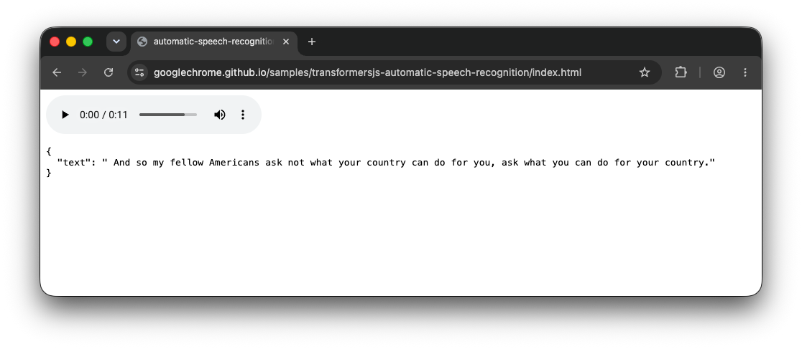
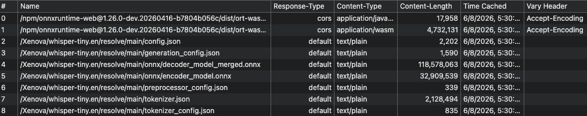
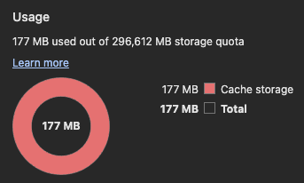
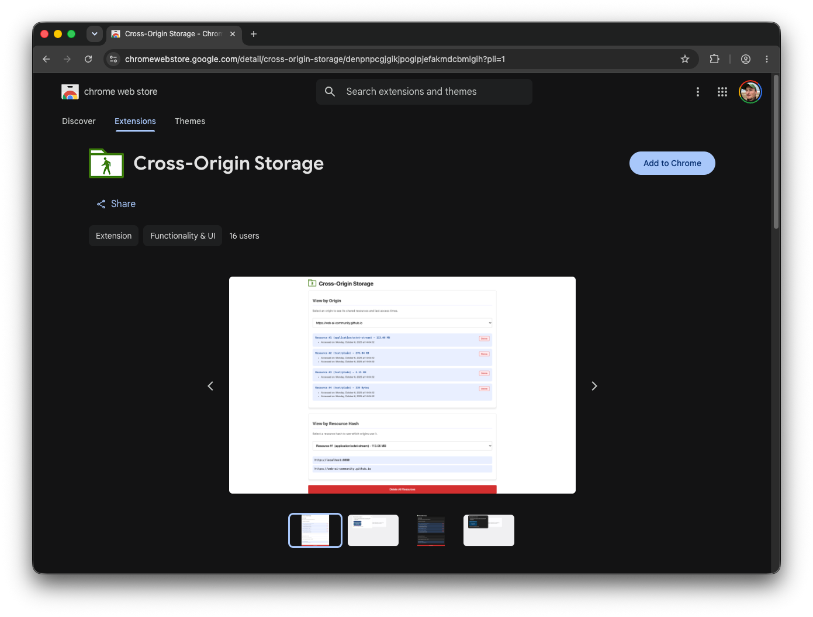

---
authors:
- aitoboxrobot
categories:
- 工具教程
date: 2026-08-07
hide:
- navigation
tags:
- Transformers.js
- WebAI
- 浏览器缓存
- 跨域存储
- 性能优化
title: 在 Transformers.js 中体验提议中的跨域存储 API
---
### 文章背景与核心概要
Transformers.js 使得强大的端侧人工智能（AI）成为可能，但目前它饱受重复下载和存储空间浪费的困扰。由于浏览器出于隐私考虑按来源（Origin）隔离了缓存，每当用户访问使用该库的新网站时，完全相同的 AI 模型和 Wasm 运行时都会被重新下载。为此提出的**跨域存储（Cross-Origin Storage, COS）API** 允许通过密码学哈希跨来源存储和检索文件，从而为通用的 AI 资源提供一个共享、高效且安全的缓存机制。

本文介绍了 Transformers.js 如何利用这一提案解决浏览器缓存隔离的痛点。文章首先指出了当前模型和 Wasm 资源由于跨域无法共享而导致的存储冗余问题，随后详细解释了 COS API 的基本实现流程与核心特性（包括控制、完整性校验和隐私保护），最后展示了如何在 Transformers.js 中通过开启实验性标志来体验这一优化，并呼吁开发者积极尝试和反馈。

---

## 缓存挑战
## The Cache Challenge

Transformers.js 允许开发者通过简单的流水线（Pipeline）在浏览器中运行推理。例如：
> Transformers.js allows developers to run inference in the browser via simple pipelines. For example:

```javascript
import { pipeline } from 'https://cdn.jsdelivr.net/npm/@huggingface/transformers@4.2.0';

const asr = await pipeline(
  'automatic-speech-recognition',
  'Xenova/whisper-tiny.en',
  { device: 'webgpu' },
);
const result = await asr('jfk.wav');
console.log(result);
```


> 

### 模型资源
### Model Resources

当你运行这段代码时，Transformers.js 会通过 Cache API 缓存模型资源。然而，如果你访问另一个也使用该模型的不同网站，浏览器会将其视为一笔新的请求。这会导致大量重复的存储占用（通常达数百兆字节），因为浏览器无法在不同的来源之间共享缓存的文件。
> When you run this, Transformers.js caches model resources via the Cache API. However, if you visit a different website that also uses the same model, the browser treats it as a new request. This leads to massive redundant storage usage—often hundreds of megabytes—because the browser cannot share cached files across different origins.


> 

### Wasm 运行时资源
### Wasm Runtime Resources

这个问题同样延伸到了共享依赖上。不同的 AI 流水线通常依赖于相同的 ONNX Runtime Wasm 文件。即使两个应用使用了不同的模型，它们都会下载相同的 4.7 MB Wasm 运行时，并且会在每个来源下分别进行缓存。
> The issue extends to shared dependencies. Different AI pipelines often rely on the same ONNX Runtime Wasm files. Even if two apps use different models, they both download the same 4.7 MB Wasm runtime, which is cached separately for every origin.


> 

### 缓存隔离
### Cache Isolation

浏览器使用**网络隔离键（Network Isolation Key）**（结合了顶级站点和当前框架站点）来防止诸如计时攻击等安全泄露。由于这些键在不同来源之间各不相同，因此对于共享资源而言根本不存在“缓存命中（Cache Hit）”，这迫使浏览器执行冗余的网络请求。
> Browsers use a **Network Isolation Key** (combining the top-level site and the current-frame site) to prevent security leaks like timing attacks. Because these keys differ between origins, there is no "cache hit" for shared resources, forcing the browser to perform redundant network requests.

---

## 跨域存储 API 登场
## Enter the Cross-Origin Storage API

> **💡 注：** 跨域存储 API 目前仍处于早期提案阶段。你今天就可以通过安装[跨域存储扩展（Cross-Origin Storage extension）](https://chromewebstore.google.com/detail/cross-origin-storage/denpnpcgjgikjpoglpjefakmdcbmlgih)来体验它。
> > **💡 Note:** The Cross-Origin Storage API is an early-stage proposal. You can experiment with it today by installing the [Cross-Origin Storage extension](https://chromewebstore.google.com/detail/cross-origin-storage/denpnpcgjgikjpoglpjefakmdcbmlgih).

**跨域存储（COS）API** 引入了 `navigator.crossOriginStorage`，它通过**密码学哈希（Cryptographic Hash）**而不是 URL 来标识文件。
> The **Cross-Origin Storage (COS) API** introduces `navigator.crossOriginStorage`, which identifies files by a **cryptographic hash** rather than a URL.


> 

### 基本实现流程
### Basic Implementation Flow

```javascript
const hash = {
  algorithm: 'SHA-256',
  value: '8f434346648f6b96df89dda901c5176b10a6d83961dd3c1ac88b59b2dc327aa4',
};

try {
  const handle = await navigator.crossOriginStorage.requestFileHandle(hash);
  const fileBlob = await handle.getFile();
} catch {
  const fileBlob = await fetch('https://cdn.jsdelivr.net/.../ort-wasm-simd-threaded.asyncify.wasm')
    .then(r => r.blob());
  const handle = await navigator.crossOriginStorage.requestFileHandle(
    hash,
    { create: true, origins: '*' },
  );
  const writableStream = await handle.createWritable();
  await writableStream.write(fileBlob);
  await writableStream.close();  
}
```

### 核心特性
### Key Features

*   **控制（Control）：** 开发者可以将 `origins` 设置为 `*` 以实现全局共享，或者限制特定域名的访问权限。
*   **完整性（Integrity）：** 浏览器会在写入时自动验证哈希，确保文件未被篡改。
*   **隐私（Privacy）：** 浏览器可能会对稀有资源的可用性进行门控，以防止它们被用作跨站追踪标识符。
*   *   **Control:** Developers can set `origins` to `*` for global sharing, or restrict access to specific domains.
*   *   **Integrity:** The browser automatically verifies the hash upon writing, ensuring the file hasn't been tampered with.
*   *   **Privacy:** The browser may gate availability for rare resources to prevent them from being used as cross-site tracking identifiers.

---

## 这对 Transformers.js 意味着什么
## What this means for Transformers.js

Transformers.js 已经通过一个实验性标志对此进行了试点：
> Transformers.js is already piloting this via an experimental flag:

```javascript
import { env, pipeline } from "https://cdn.jsdelivr.net/npm/@huggingface/transformers@4.2.0";

// 启用实验性的跨域存储缓存后端。
// Opt in to the experimental Cross-Origin Storage cache backend.
env.experimental_useCrossOriginStorage = true;

const asr = await pipeline('automatic-speech-recognition', 'Xenova/whisper-tiny.en', { device: 'webgpu' });
```

启用此功能后，该库会解析模型文件的 SHA-256 哈希。如果该模型已经在之前访问*任何*站点的过程中被存入 COS 缓存，它就会瞬间加载完成。
> With this enabled, the library resolves the SHA-256 hash of model files. If the model is already in the COS cache from a previous visit to *any* site, it loads instantly.

### 立即体验
### Try it Today

通过安装[跨域存储扩展（Cross-Origin Storage extension）](https://chromewebstore.google.com/detail/cross-origin-storage/denpnpcgjgikjpoglpjefakmdcbmlgih)，你可以亲眼见证共享资源的实际效果。
> By installing the [Cross-Origin Storage extension](https://chromewebstore.google.com/detail/cross-origin-storage/denpnpcgjgikjpoglpjefakmdcbmlgih), you can see the shared resources in action.


> 


> 

---

## 行动呼吁
## Call to Action

如果你正在使用 Transformers.js 进行构建，请启用 `env.experimental_useCrossOriginStorage = true`。这是一个零风险的优化：如果用户没有安装该扩展，或者浏览器不支持该 API，它会自动回退到标准缓存。
> If you are building with Transformers.js, enable `env.experimental_useCrossOriginStorage = true`. It is a risk-free optimization: if the user doesn't have the extension or the browser doesn't support the API, it simply falls back to the standard cache. 

有关更多信息或提供对提案的反馈，请访问[跨域存储 GitHub 仓库](https://github.com/WICG/cross-origin-storage)。
> For more information or to provide feedback on the proposal, visit the [Cross-Origin Storage GitHub repository](https://github.com/WICG/cross-origin-storage).