---
authors:
- aitoboxrobot
categories:
- 工具教程
date: 2026-08-07
hide:
- navigation
tags:
- 大模型推理
- 连续批处理
- GPU优化
- CUDA
- 异步处理
title: 在连续批处理中解锁异步性：将大模型推理速度提升 20% 以上
---
### 文章背景与核心概要

随着大语言模型（LLM）在生产环境中的广泛应用，硬件成本和 GPU 利用率成为了工程落地的核心考量。虽然**连续批处理（Continuous Batching）**技术通过紧凑打包批次消除了填充带来的算力浪费，但默认的批处理模式仍然是**同步的**——这意味着 CPU 和 GPU 必须轮流工作：GPU 计算时 CPU 在等待，而 CPU 准备下一批次时 GPU 则处于闲置状态。这种同步等待带来的闲置间隙甚至能占到总运行时间的近四分之一。

为了解决这一痛点，本文由 Hugging Face 团队的专家详细拆解了如何在连续批处理中实现**异步性（Asynchronicity）**。通过利用 CUDA 流（CUDA Streams）、事件（Events）以及共享内存池（Memory Pool），技术人员能够彻底解耦 CPU 的批处理准备工作与 GPU 的计算负载，使两者并行运行。该方案无需更改任何底层内核或模型架构，仅通过精细的硬件协同，便将 GPU 利用率从 76% 提升至近 100%，并将文本生成速度加快了 22% 以上，为实现长文本生成的 SOTA 吞吐量奠定了坚实基础。

---

## 摘要
> **TL;DR：** 我们解释了如何分离 CPU 和 GPU 的工作负载以消除闲置间隙，从而为大语言模型（LLM）推理带来巨大的性能提升。通过利用 CUDA 流、事件和共享内存池将批处理准备工作与计算解耦，我们可以将 GPU 利用率从 76% 提升至近 100%，并将文本生成速度加快 20% 以上。

---

*这是关于高效 LLM 推理系列文章的第二篇。[第一篇博客](https://huggingface.co/blog/continuous_batching)从第一性原理出发介绍了连续批处理，引入了我们所赖以构建的核心概念：KV 缓存、FlashAttention、注意力掩码等。*

在 [Inference Endpoints](https://endpoints.huggingface.co/) 上，一张 H200 的价格大约是每小时 5 美元。单看一个小时似乎很便宜，但如果用上一整天，你就要支付 120 美元。既然如此，你一定会希望你的 GPU 能够被充分利用。

我们已经知道，连续批处理通过调度紧密打包的批次来提高 GPU 利用率，从而不会将算力浪费在填充（padding）上。但连续批处理并未解决第二个浪费来源：默认情况下，它是**同步的**。这意味着 CPU 和 GPU 轮流工作：GPU 计算时，CPU 等待；CPU 准备下一个批次时，GPU 等待。在一个每秒运行数百个步骤的循环中，这些闲置间隙累加起来，正如我们将要展示的那样，它们几乎可以占到总运行时间的四分之一。为了确保 GPU 100% 的时间都在忙于计算，我们需要摆脱这些间隙。

为了实现这一点，我们可以使用**异步批处理（asynchronous batching）**：我们将 CPU 批处理准备与 GPU 批处理计算剥离开来，使两者可以并行运行，从而让我们始终拥有一个高效工作的 GPU 🔥

---

## 同步批处理（Synchronous Batching）

朴素的同步批处理工作原理如下：

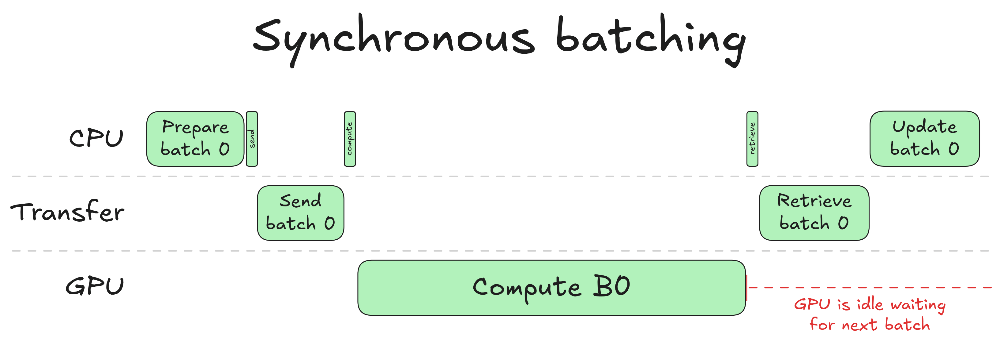

当 CPU 准备一个新批次时，它会选择要包含哪些请求、更新 KV 缓存表、逐出在上一轮中完成的请求，并接纳新请求以填满释放的空间。一旦完成，它就会将准备好的输入传输到 GPU。GPU 运行其前向传播并为每个请求采样（即选择）一个新的 token。结果返回给 CPU，这样它就知道每个请求刚刚产生了什么 token，然后整个循环再次重复。

注意右侧的红色标注：GPU 计算完成后便进入闲置状态。在 CPU 完成其更新步骤（采样输出 token、更新请求状态、重新调度批次）之前，下一个批次无法开始。

这就是同步批处理的核心低效之处：CPU 和 GPU 轮流工作。当 GPU 在计算时，CPU 是闲置的；当 CPU 在更新时，GPU 是闲置的。在任何情况下，它们都不会同时在做有用的工作。对于单次前向传播来说，这似乎是一个很小的代价，但在一个每秒运行数百个步骤的连续批处理循环中，这些闲置间隙累积起来就会造成真正的吞吐量损失。

为了展示这一点，我们使用 8B 模型在批量大小为 32 的情况下生成 8K token 时，对 CPU 和 GPU 花费的时间进行了性能分析（Profiling）：

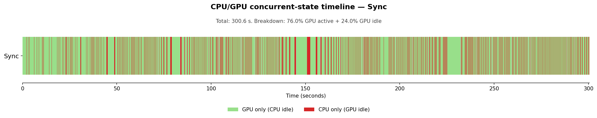

*（如果你想生成同类图表，可以对连续批处理代码进行插桩以转储 CPU 和 GPU 的活动区间，并使用[此脚本](https://gist.github.com/remi-or/8de44738629c4d3c72451aa01df1a2ab)。）*

时间线在绿色（GPU 活跃，CPU 闲置）和红色（CPU 活跃，GPU 闲置）之间交替：两者从不重叠。总生成时间为 300.6 秒，其中 24.0% 的时间花费在 GPU 闲置等待 CPU 完成上。从 GPU 的角度来看，近四分之一的生成时间被浪费了。这是悲观的看法。

乐观的看法是，如果我们能完全消除 CPU 开销，生成时间将从 300 秒降至 228 秒（免费获得 24% 的加速！）。这不需要任何新的内核或模型更改，只需要仔细协调硬件。

从根本上说，这个想法很简单：我们需要弄清楚如何在批次 N 正在计算的同时，运行批次 N+1 的批处理准备工作。但这个简单的想法隐藏了一些技术难点：
* 如何在 GPU 上启动某项任务并将控制权交还给 CPU？
* 如何确保在启动每个任务时，CPU 或 GPU 任务所需的数据已经准备就绪？
* 如果批次 N+1 是基于批次 N 的预测，我们该如何准备它？

通过回答这些问题，我们将从头构建异步批处理。我们在 [transformers](https://github.com/huggingface/transformers) 库中实现连续批处理时，也遵循了相同的步骤。欢迎查看代码并进行对比！

---

## 创建并发（Creating Concurrency）

我们的最终目标是实现 CPU 和 GPU 操作的**并发**执行。我们需要一种对操作进行分类的方法，以便让机器知道哪些操作可以并发运行。我们可以通过 CUDA 流来实现这一点。

### 什么是 CUDA 流？
要理解 CUDA 如何对其操作排序，我们需要讨论 **CUDA 流（CUDA streams）**。流是一个有序的 GPU 操作队列（内核启动、内存复制、同步屏障），这些操作按提交的顺序执行。每个 GPU 操作始终是在某个流中调度的。同一个流中的操作是顺序的：在前面的操作完成之前，GPU 不会开始下一个操作。*不同*流中的操作彼此独立，可以并发运行。举例说明，如果你在 3 个不同的流中启动 3 个操作，执行情况如下：

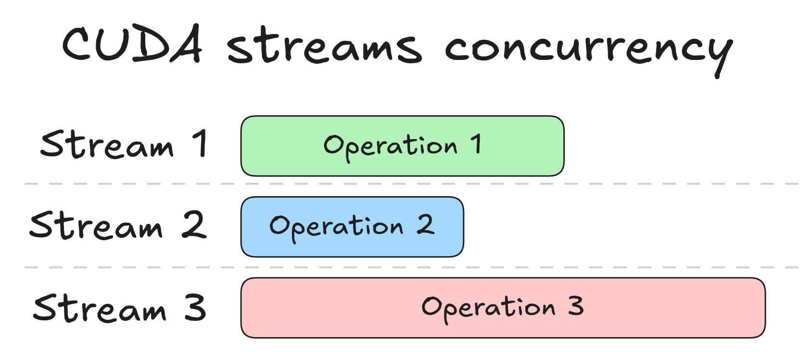

这三个操作同时开始。这是一个轻微的简化：每个 GPU 操作最终都是由 CPU 发起的，而这种发起需要一小段时间：寻找正确的内核、发出调用、将命令从 CPU 传输到 GPU 等。这被称为**CPU 启动开销（CPU launch overhead）**，更真实的图表看起来像这样：

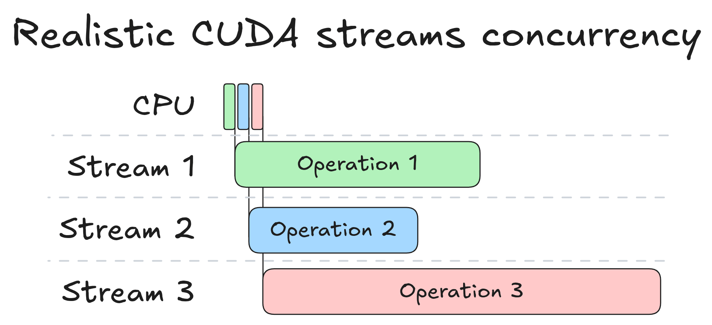

这些操作仍然是并发的，但它们的开始时间被每个 CPU 启动的开销所错开。随着我们转向异步工作流，我们将继续展示这些 CPU 启动事件，因为它们消耗了实际时间，并且有助于我们追踪“什么时间启动了什么”。例如，我们将经常检查一个流是否被**冲刷（flushed）**：这意味着流中的所有操作都已执行完毕。

### 默认流与非默认流
如果你从未在 PyTorch 中显式使用过 CUDA 流，你可能会惊讶于它们的存在。一个典型的 PyTorch 脚本从不提及它们，而且它*感觉*不像 GPU 操作是异步的：CPU 似乎在继续执行之前会等待 GPU 完成。这种感觉是准确的，它来自于**默认流（default stream）**。

当你调用一个未指定流的 PyTorch 操作时，它会落入默认流。默认流有一个特殊的属性：它是**同步的（synchronizing）**。如果在默认流中调度了一个操作，它会等待**所有其他流被冲刷**，即 GPU 上的所有工作必须全部结束，默认流中的单个操作才能开始。反之亦然：任何操作（无论其处于哪个流）在启动之前，都必须等待默认流被冲刷。

因此，如果你将默认流操作的结果传输到 CPU，即使该传输对 CPU 来说应该是无阻塞的，你的 CPU 仍然会阻塞，直到所有 GPU 操作完成，因为这些操作是在默认流中调度的。这实际上破坏了构建并发的任何努力。

这就是我们需要使用非默认流的原因。将内核启动或非阻塞内存复制入队会立即将控制权返回给 CPU。GPU 将在后台运行该操作，但 CPU 不会等待。这就回答了我们的第一个问题：为了在启动 GPU 工作后取回 CPU 控制权，我们使用非默认流。

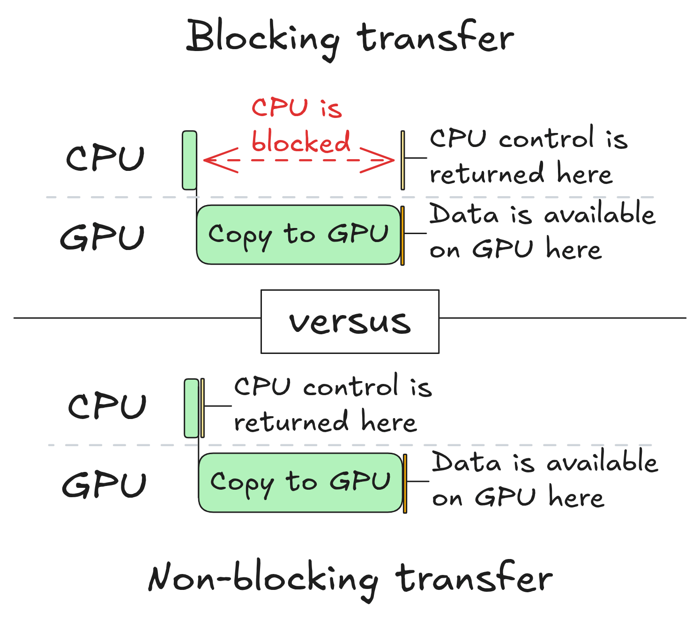

在本文的其余部分，我们将假设从一个设备到另一个设备的所有内存传输都是非阻塞的。因此，我们必须自己对它们进行同步。

### 回到连续批处理
我们已经确定，不应将任何 GPU 操作放入默认流。但问题依然存在：如果不用默认流，我们应该使用什么流？让我们回到同步批处理的图示：

我们可以识别出三种不同的 GPU 操作：
1. 从 CPU 到 GPU 的输入传输
2. 在 GPU 上计算
3. 从 GPU 到 CPU 的输出传输

这意味着我们需要三个流：一个用于计算，一个用于 CPU 到 GPU 的传输，另一个用于 GPU 到 CPU 的传输。这些传输是独立的，没有理由将它们串行化，因此每一个都有自己的流。

> **注意：** 在谈论 CPU 和 GPU 时，CUDA 文档中使用的惯例是将 CPU 称为**主机（host）**，将 GPU 称为**设备（device）**。从现在开始我们将使用该惯例。CPU 到 GPU 的传输称为**主机到设备（H2D）**传输，GPU 到 CPU 的传输称为**设备到主机（D2H）**传输。因此，这三个流分别是 H2D 流、计算流和 D2H 流。

现在让我们尝试使用流在 GPU 上异步启动一个批次并取回 CPU 控制权。在 CPU 端，我们执行以下操作：
1. 在 CPU 上准备批次输入数据（无流，纯 CPU 操作）
2. 将其传输到 GPU（使用 H2D 流）
3. 在 GPU 上运行计算（使用计算流）
4. 检索批次输出（使用 D2H 流）
5. 查看结果（无流）

如果我们仅使用 CUDA 流来做这件事，结果几乎会立即返回，但它们是**错误**的。为了理解原因，让我们看看发生了什么：

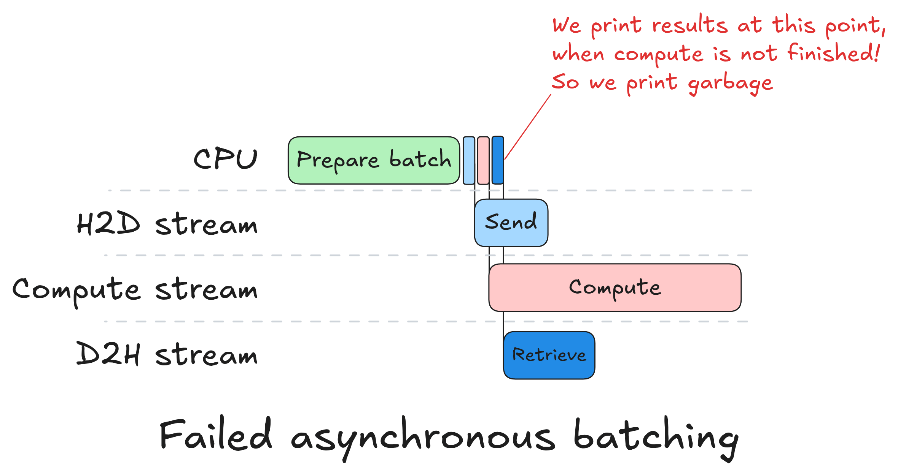

由于流彼此独立，所有三个 GPU 操作几乎同时启动。计算流没有等待 H2D 传输完成，因此前向传播是在 GPU 内存中已有的任意数据上运行的。D2H 流没有等待计算完成，因此它传输了尚未计算出来的结果。第 5 步立即返回，因为没有任何东西阻塞 CPU：没有需要同步的默认流。

这些操作在隔离状态下都能正确运行。问题在于我们从未告诉流去彼此等待。我们知道计算必须在 H2D 完成后开始，而 D2H 必须在计算完成后开始，但我们没有强制执行这种排序。我们需要一种机制，在跨流边界时说：“在那个操作完成之前，不要启动这个操作”。

---

## 强制同步（Enforcing Synchronization）

为了强制流之间的同步，我们将使用 **CUDA 事件（CUDA events）**。

### 什么是 CUDA 事件？
CUDA 事件是可以记录到流中的标记。当 GPU 在执行过程中到达该标记时，它会将该事件设置为已完成。然后可以指示任何其他流在开始其下一个操作之前等待该事件。具体来说，有两个操作：`stream.record(event)`，它在当前位置将标记插入流中；以及 `stream.wait(event)`，它会阻塞流继续进行，直到该事件被标记为完成。重要的是，`wait` 阻塞的是*流*，而不是 CPU 或并行运行的其他流：CPU 调用立即返回，只有等待的流被搁置。

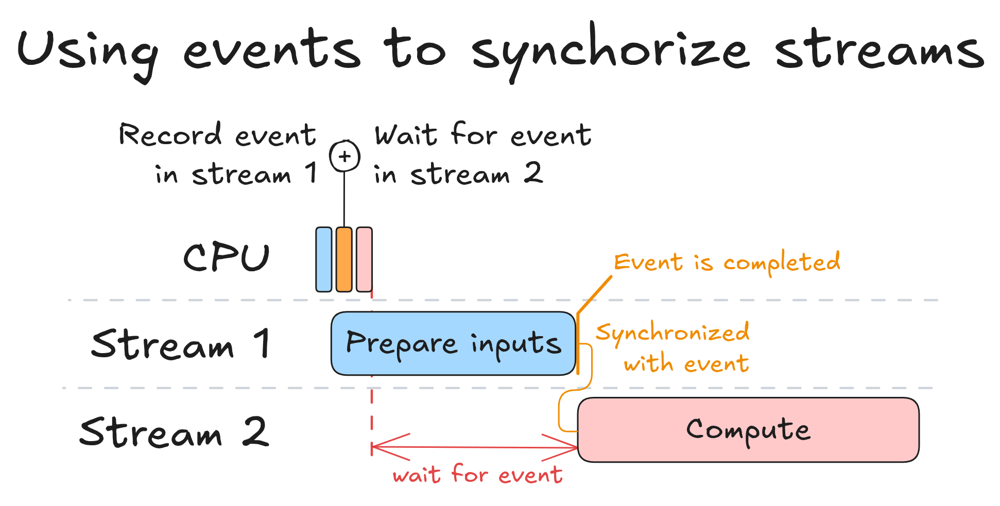

上图展示了单个事件同步两个流的情形。CPU 快速连续发出三个操作（三个小方块）：在流 1 上启动输入准备，在流 1 上记录事件，然后告诉流 2 等待该事件。然后 CPU 立即继续。流 1 运行其操作，当操作完成时，事件被设置。流 2 在整个过程中被停在等待标记处，只有在事件被标记为完成时才开始计算。CPU 没有参与其中：排序完全是在 GPU 端强制执行的。

### 在连续批处理中使用事件
应用于我们的情况，修复方法很简单。在将 H2D 传输入队后，我们调用 `h2d_stream.record(h2d_done)`：该事件仅在传输完成时才会被标记为完成。在将前向传播入队之前，我们调用 `compute_stream.wait(h2d_done)`，因此计算流在 `h2d_done` 设置之前不会启动。我们在计算和 D2H 之间做同样的事情：在使用 `model.forward` 启动前向传播后，我们调用 `compute_stream.record(compute_done)`，然后在将输出传输入队之前调用 `d2h_stream.wait(compute_done)`。其结果是一个具有显式排序的流水线：

1. H2D 传输在 `h2d_stream` 上运行
2. `compute_stream` 等待 `h2d_done`，然后运行前向传播
3. `d2h_stream` 等待 `compute_done`，然后将输出传回

CPU 依次将所有这些入队，然后继续前进。在任何时候它都不会阻塞。GPU 通过事件强制执行排序，并且所有三个流只要其依赖项得到满足就会立即处于活动状态。

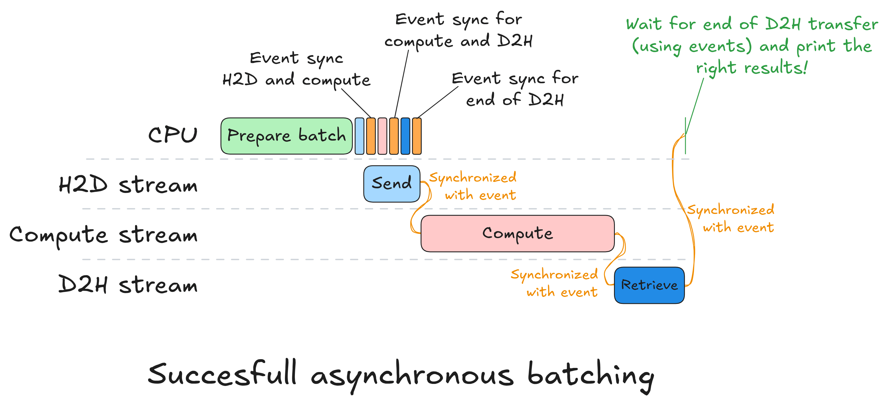

上图展示了这一过程的展开方式。CPU 准备批次，然后迅速将所有 GPU 工作入队：H2D 传输、前向传播、D2H 传输，并在每个阶段之间插入了 `record` 和 `wait` 调用。此后，CPU 就空闲了。GPU 接管，随着其依赖事件的设置，按顺序执行每个流。注意右侧的绿色注释：一旦 D2H 传输完成，CPU 就会返回并读取结果。这最后的同步是整个步骤中 CPU 阻塞的唯一时间点。为了实现这一点，我们在输出传输后在 D2H 流上记录第三个事件，然后在 CPU 端调用 `d2h_done_event.synchronize()`。`synchronize` 会阻塞 CPU，直到 D2H 流到达该标记。

这是与同步批处理的关键区别：以前，CPU 在每个操作之后都会阻塞。现在，当 GPU 工作时，它可以自由去做“某些事情”。  
我们需要弄清楚那“某些事情”是什么，因为从 GPU 利用率的角度来看，目前还没有任何改变。

---

## 填补真空（Filling the Vacuum）

CPU 可用的窗口期位于将批次 N 调度到 GPU 和将批次 N+1 调度到 GPU 之间。其自然用途应该是准备批次 N+1 的输入，这样我们就可以将它们调度到 GPU，并在批次 N 计算结束时准备就绪。让我们看看如何做到这一点。

为了准备批次 N+1，我们可以复用准备批次 N 时所用的同一个 CPU 端对象：当前请求列表、缓存状态、主机端张量缓冲区等。但是，我们需要注意两点：
* **数据破坏：** 批次 N+1 的设备端输入缓冲区不能与批次 N 相同：否则我们会破坏 GPU 仍在读取的数据。
* **数据传输：** 如果一个请求同时在批次 N 和 N+1 中出现，并且它在批次 N 的输出中产生了新的 token，那么该 token 是批次 N+1 的输入所需要的。

我们将在接下来的两部分中解决这些问题——数据破坏和数据传输。

### 竞争条件（Race Conditions）
首先，我们将解决潜在的数据破坏问题。  
想象一下，批次 N 和批次 N+1 共享相同的设备端输入缓冲区，并且批次 N+1 输入的 H2D 传输在批次 N 仍在计算时就开始了。当 GPU 仍在从同一内存中读取批次 N 的数据时，CPU 可能会写入批次 N+1 的输入。因此，GPU 可能会获取到部分被覆盖的数据，从而导致结果损坏。这就是**竞争条件（race condition）**。在主机端也存在同样的风险：在批次 N 的 H2D 拷贝仍在进行中时复用相同的源进行拷贝会破坏传输。

解决方法是使用两套张量并交替使用。当 GPU 从插槽 A 处理批次 N 时，CPU 使用批次 N-1 的结果更新请求状态。接下来，CPU 在输入插槽 B 中准备批次 N+1。下一步，它们互换。下图说明了这一点：

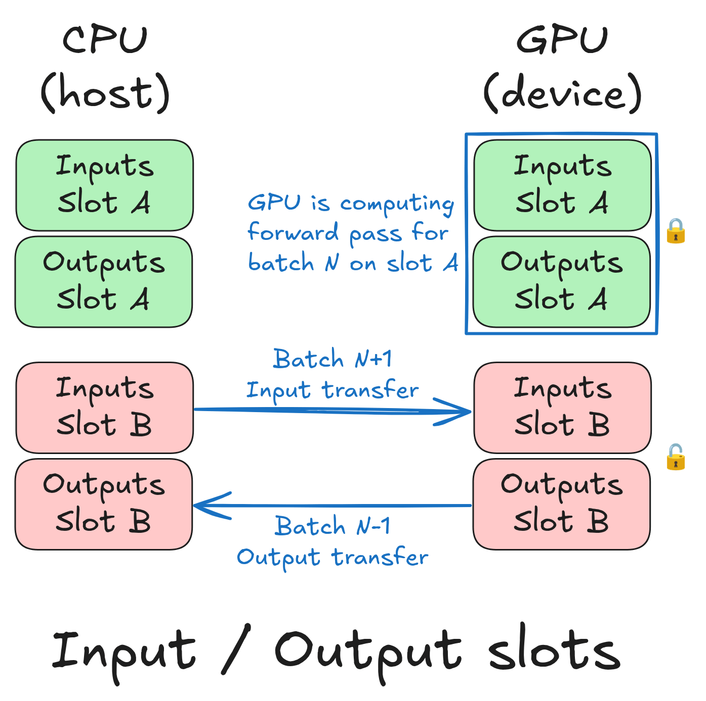

当然，这伴随着代价：它使用于存储输入和输出张量的 RAM 和 VRAM 翻倍。这是一个可以接受的权衡，特别是在使用 [FlashAttention](https://github.com/Dao-AILab/flash-attention) 时，因为它不需要注意力掩码（attention mask），而注意力掩码是迄今为止最大的输入张量。

但拥有两个插槽又带来了另一个问题。在推理中，我们通常使用 **CUDA 图（CUDA graphs）**来减少延迟。简而言之，[CUDA 图](https://pytorch.org/blog/accelerating-pytorch-with-cuda-graphs/)是预先录制的一系列 CUDA 操作序列。它是针对特定内存地址录制的：为插槽 A 捕获的图无法针对插槽 B 的缓冲区进行重放。因此我们需要两个图。如果每个图都有自己的内存缓冲区，那就是 VRAM 再次翻倍。

解决方案是**内存池（memory pool）**：两个图都从中分配的共享内存缓冲区。唯一的限制是同一个池中的两个图绝对不能并发执行。由于批次 N 必须在批次 N+1 开始之前结束，因此情况总是如此。在实践中，两个图加起来使用的 VRAM 几乎与一个图相同。我们只需在初始化时支付两次捕获的开销。  
我们可以在同一个池中创建任意数量的 CUDA 图，并且总内存使用量仍然限制在所有图的最大值以内。这展示如下。

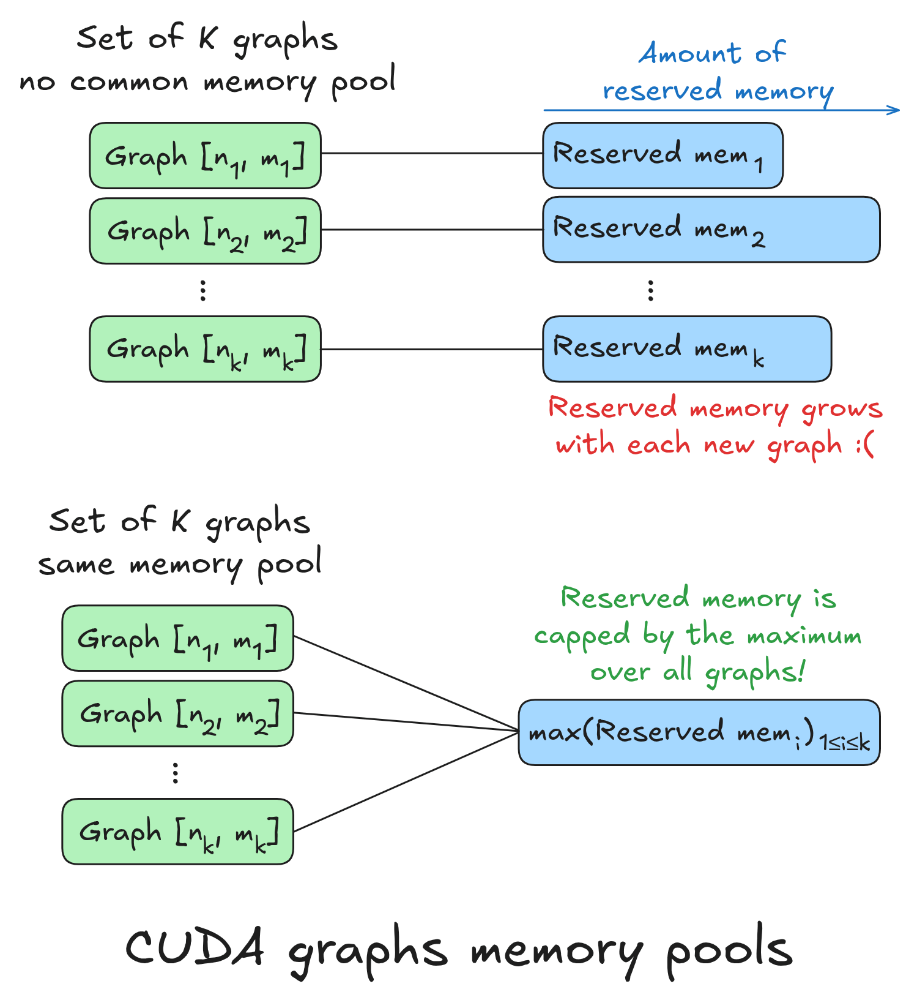

现在我们知道了如何防止数据破坏，我们可以解决第二个问题：将批次 N 的输出 token 放入批次 N+1 的输入中。

### 结转（Carry-Over）
考虑一个同时出现在批次 N 和批次 N+1 中的请求。在批次 N 中，它产生了一个新的 token。该 token 是它在批次 N+1 中的输入。问题是，当我们准备批次 N+1 的输入缓冲区时，我们还没有那个 token：批次 N 仍在运行。  
为了解决这个问题，我们在构建批次 N+1 时使用一个占位符 token。我们将使用 0 作为占位符，原因稍后会变得显而易见。我们在批次 N 完成计算之后、批次 N+1 开始前向传播之前替换该占位符。我们将该步骤称为**结转（carry-over）**，因为我们要将新 token 从批次 N 结转到批次 N+1。结转背后的想法如下图所示：

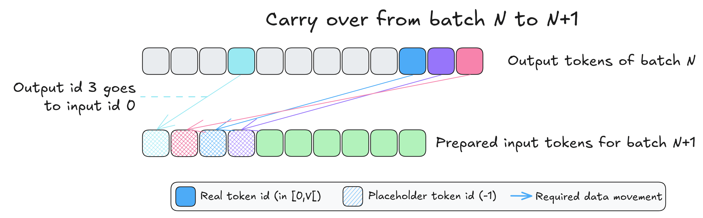

要执行结转，我们只需要三样东西：批次 N 的输出 token ID、批次 N+1 的输入 token ID，以及一个包含如何执行结转指令的张量。我们将这个张量称为**结转掩码（carry-over mask）**。它包含需要结转的 token 的目标位置，对于不需要结转的则包含 -1。我们在下面展示了一个：

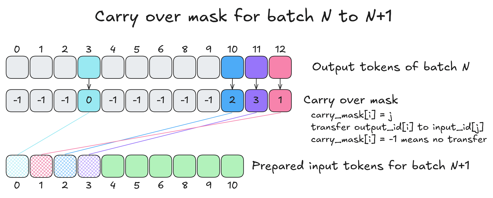

结转本身包含四个操作：
* 我们从批次 N 的输出中选择要结转的 token 到一个新的张量 `T` 中
* 我们将 `T` 中不想结转的 token 清零
* 我们截断 `T` 以匹配批次 N+1 的输入长度
* 我们将 `T` 添加到批次 N+1 的输入 ID 中（这就是为什么占位符输入 ID 的值为零的原因）

由于这四个操作非常廉价，我们在每个新批次的开始时执行它们，并将结转捕获到 CUDA 图中。如果结转掩码仅包含 -1（-1 的意思是：不要结转这个位置），那么最后一步就是与零张量的加法。这种情况并不常见，因为跨越多个批次的解码请求通常被调度在连续的批次中。

---

## 完整的异步循环（The Full Async Loop）

让我们把所有东西组合起来，并追踪前两个步骤。

步骤 0 是冷启动：没有以前运行的批次，因此 CPU 在插槽 A 中准备批次 0 并像同步批处理那样分派它。还没有重叠。

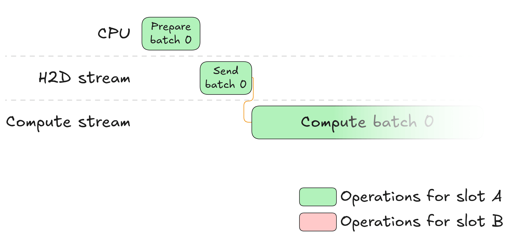

步骤 1 是异步循环开始的地方。GPU 现在正在插槽 A 上运行批次 0，而 CPU 是空闲的。它立即开始在插槽 B 中准备批次 1：逐出已完成的请求、接纳新请求、更新 KV 缓存路由表、构建结转掩码。所有这一切都与 GPU 完全重叠运行。一旦批次 1 的输入准备就绪，CPU 就按顺序将工作入队：它启动插槽 B 的 H2D 传输，记录并等待计算和 D2H 流的事件，然后继续前进。

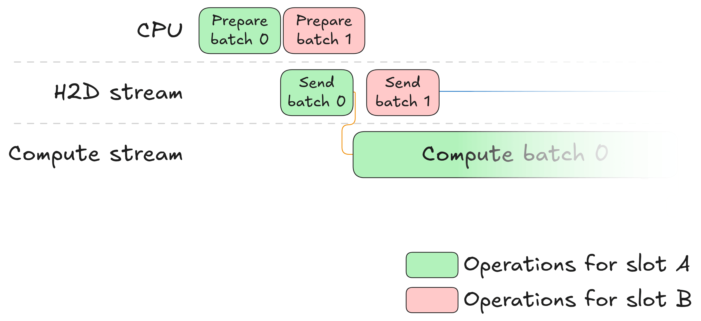

现在 GPU 上同时发生两件事。在插槽 A 上，GPU 完成计算并设置 `compute_done`，这释放了批次 0 输出的 D2H 传输。在插槽 B 上，批次 1 输入的 H2D 传输正在运行。一旦完成，`h2d_done` 事件就被设置，批次 1 的计算开始。从批次 N 到批次 N+1 的结转是该计算的一部分：它发生在常规前向传播之前。由于插槽 A 和插槽 B 是独立的，所有这些都可以自由重叠。

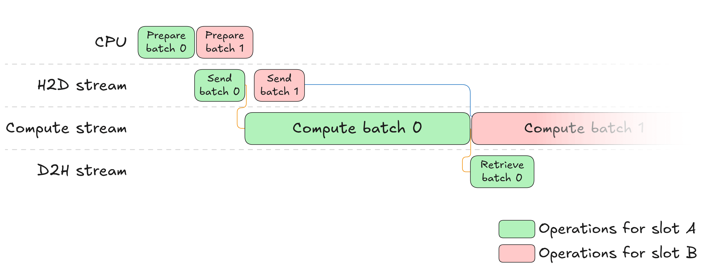

与此同时，CPU 阻塞在 `d2h_done_event.synchronize()` 上，直到批次 0 的输出落地。然后它处理输出，更新批次 0 中所有请求的状态，并开始调度批次 2。循环现在正在运行，随后的每个步骤都遵循完全相同的模式。  
我们在下面展示完整的工作负载。每个插槽都有专门的颜色用于 CPU 和 GPU 操作以及事件（这些也是特定于插槽的）。为了提高可读性，我们没有展示 CPU 对 GPU 操作（如计算或数据移动）的启动，但它们确实发生了。这是合理的，因为与所示的操作相比，启动 GPU 操作的延迟可以忽略不计。

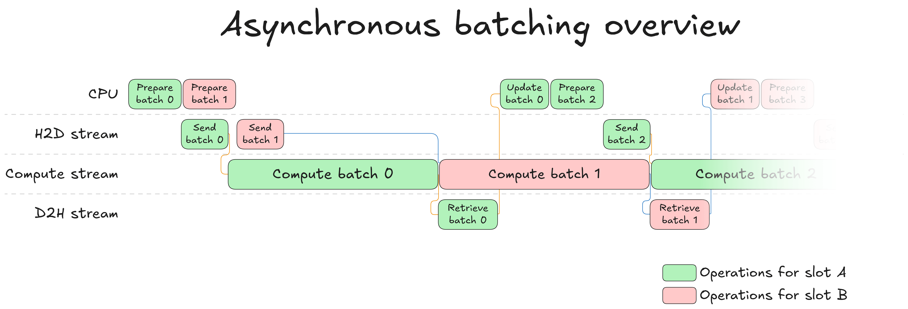

只要批次 N+1 的输入在批次 N 完成时已在 GPU 上准备就绪，GPU 在批次之间就绝不会闲置。唯一的问题是 CPU 是否在 GPU 完成计算之前完成了其工作。通常情况确实如此：模型不断增长，而批次调度保持相对廉价，因此 GPU 计算是瓶颈，而不是 CPU。

---

## 它真的管用吗？

为了找出答案，我们运行与之前相同的实验：8K token，批量大小 32，8B 模型。

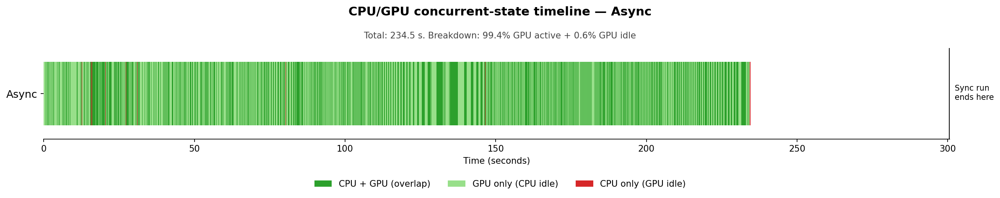

时间线几乎完全是深绿色的：CPU 和GPU 同时运行。偶尔出现的浅绿色条纹是 GPU 活跃但 CPU 已经完成准备工作并处于等待状态的时刻。几乎不可见的红标是批次之间的同步点，此时 CPU 阻塞以采样批次 N 的输出。GPU 活跃时间占总运行时间的 99.4%（从 76.0% 提升）。总生成时间从 300.6 秒下降到 234.5 秒，实现了 22% 的加速。如果完全消除 CPU 开销，我们预测是 24%。剩下的一小部分差距是不可避免的同步点。没有新的内核，没有模型更改：仅仅是让 CPU 和 GPU 同时工作。

---

## 结论

我们从一个 CPU 和 GPU 依次工作的同步工作负载开始，这导致两者都未被充分利用。通过从基于调度的依赖关系转向基于数据的依赖关系并精炼同步点，我们成功地解耦了 CPU 和 GPU 的工作负载，使两个硬件的并行执行成为可能。因此，我们能够饱和 GPU 工作队列并确保它始终在运行。这最终带来了生成速度的大幅提升，同时保持了模型的准确性。可以说是一次大获全胜。

完整的实现位于 [transformers](https://github.com/huggingface/transformers) 库中。如果你想了解这如何转化为实际代码，连续批处理的通用入口点是 [continuous_api.py](https://github.com/huggingface/transformers/blob/main/src/transformers/generation/continuous_batch_ing/continuous_api.py)。更多以异步为中心的代码位于 [`ContinuousBatchingAsyncIOs`](https://github.com/huggingface/transformers/blob/5042bb7eb64b69efd351482a05b3803c48955cb4/src/transformers/generation/continuous_batching/input_outputs.py#L609) 类中。

异步批处理让我们离为长文本生成（例如强化学习中 16K+ 的生成长度）解锁 SOTA 吞吐量更近了一步。但要达到这个目标，还需要一些其他较小的东西。在下一篇文章中，我们将逐一探讨这些内容：请求卸载（offloading）、解码专用内核或细粒度编译等。敬请期待！

---

*致谢：非常感谢 Pedro Cuenca 和 Aritra Roy Gosthipaty 的帮助与富有洞察力的审阅。*