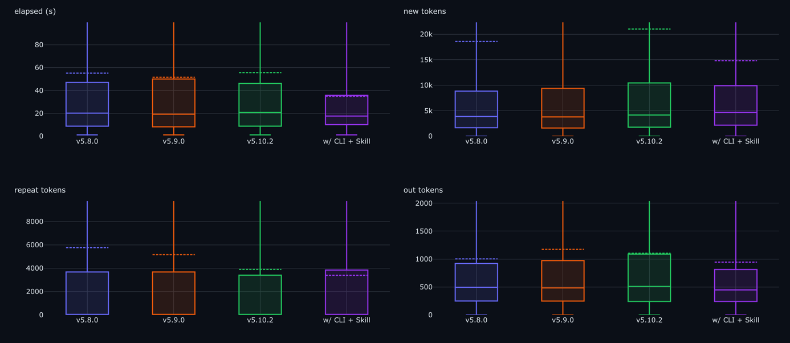
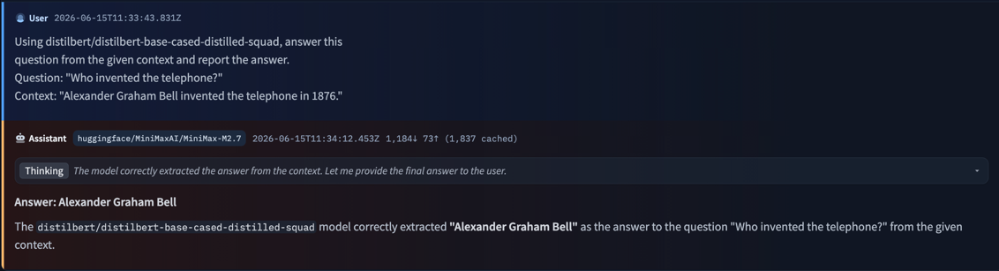
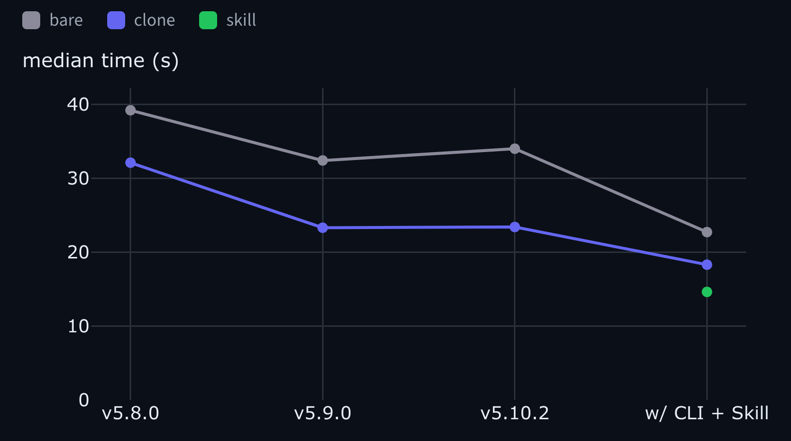
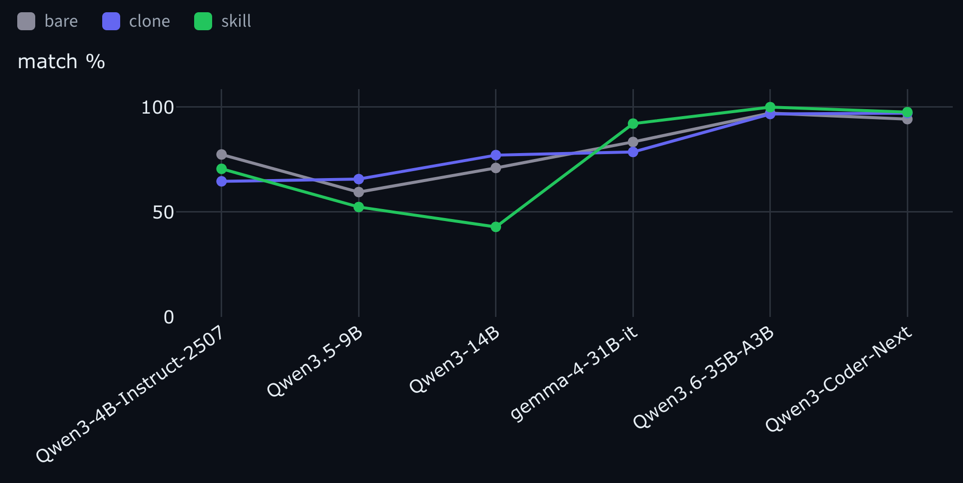
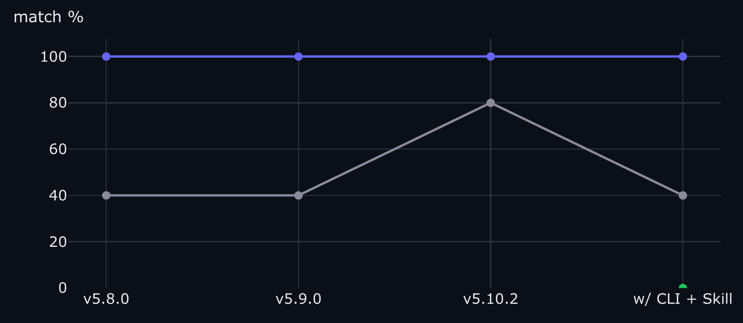

---
authors:
- aitoboxrobot
categories:
- 研究解读
date: 2026-08-07
hide:
- navigation
tags:
- AI基准测试
- 智能体工具
- 开源模型
- Transformers
title: 它够具智能体特性吗？在自有工具上对开源模型进行基准测试
---
### 文章背景与核心概要
随着编程智能体（Coding Agents）越来越多地处理各种软件任务——如选择库、编写代码和进行调试——我们的工具设计也必须随之演进。软件仅仅做到快速且正确已经不够，它必须具备“智能体优化”（agent-optimized）的特性。本文介绍了一种全新的基准测试框架，旨在评估智能体与工具的交互效率，并以 `transformers` 库作为案例进行研究。通过衡量完整的过程而非仅仅关注最终输出，作者们证明了面向智能体的改进（如命令行接口 CLI 和精选文档）可以显著提升大模型的性能，但同时也可能给小模型带来歧义和失败点。

---

*Benchmarking transformers revisions across different metrics*

> 这是一篇由人类撰写、聚焦于智能体（agent）的博客文章。

> This is a human-made, agent-focused blogpost.

编程智能体越来越多地代替我们与软件进行交互：只需描述一个任务，智能体便会挑选库、编写调用代码、运行它们并调试自身的错误。当底层库阻碍其进展时，它会毫不犹豫地绕过库，从头重写逻辑。这为库开发引入了一个新概念：代码不仅需要正确和快速，还必须经过设计，以便智能体能够高效地驱动它。

> Coding agents increasingly work with our software instead of us: describe a task, and the agent picks the library, writes the calls, runs them, and debugs its own mistakes. When the library gets in the way, it will happily bypass it and rewrite the logic from scratch. This introduces a new concept in library development: the code should not only be correct and fast, but should be designed so that an agent can drive it effectively. 

大多数基准测试只关注最终答案。而我们想要的是整个过程：不仅看智能体是否做对了，还要看达成目标需要付出多少工作量，以及这些工作量在不同的模型、库版本和任务之间是如何变化的。我们以 `transformers` 作为案例研究，对这些指标进行了精确测量。

> Most benchmarks just look at the final answer. We wanted the whole process instead: not just whether the agent got it right, but how much work it took to get there, and how that shifts across models, library revisions, and tasks. We measured exactly that, using `transformers` as our case study.

---

### 测试软件的智能体适用性
在整篇博客中，我们将以 `transformers` 为例：智能体*使用*它来解决机器学习任务，而不是为它贡献代码。我们的直觉是，通过引入 CLI（命令行接口）、Skill（技能包）以及自包含的、针对特定任务的示例，可以简化其使用过程。

> ### Testing software for agentic-use
> We'll use `transformers` as an example throughout this blogpost: agents *using* it to solve ML tasks, not contributing code to it. Our intuition was that usage could be simplified with a CLI, a Skill, and self-contained, task-specific examples. 

#### 并非所有的成功都生而平等
两个智能体都可能为一个情感分类任务产生正确的标签，但其中一个可能会编写一个 40 行的 Python 脚本，而另一个只需使用单个 CLI 命令。如果你的评估只检查最终的字符串，你将对成本、延迟、Token 消耗以及失败率方面的差异视而不见。

> #### Not all successes are equal
> Two agents can both produce the correct label for a sentiment-classification task, but one might write a 40-line Python script while the other uses a single CLI command. If your evaluation only checks the final string, you're blind to the differences in cost, latency, token usage, and failure rates.

#### 我们如何运行评估？
我们在三个“层级”（tiers）下运行每个任务：
* **bare（裸环境）：** 仅执行 `pip install transformers`，无其他配置。
* **clone（克隆环境）：** 完整的 `transformers` 源码，在工作目录中进行检出（checked out）。
* **skill（技能包）：** 打包好的 Skill：包含 CLI 的文档 + 任务示例，并加载到上下文中。

每一次运行都是一个 Hugging Face Job，确保了相同的硬件环境和并行执行能力。

> #### How do we run evaluations?
> We run every task under three "tiers":
> * **bare:** `pip install transformers`, and nothing else.
> * **clone:** The full `transformers` source, checked out in the working directory.
> * **skill:** A packaged Skill: the CLI's docs + task examples, loaded in context.
> 
> Every run is a Hugging Face Job, ensuring identical hardware and parallel execution.

#### 选择哪些模型进行基准测试？
* **大型开源模型：** 我们关注达到正确答案所付出的努力（轮数、Token 数、秒数）。
* **本地模型：** 我们关注“匹配率”（match %），以观察模型规模和能力如何影响工具交互。

> #### Which models to benchmark against?
> * **Large open models:** We focus on the effort taken (turns, tokens, seconds) to reach the correct answer.
> * **Local models:** We focus on "match %" to see how model size and capability affect tool interaction.

---

### 调整工具：标记与结果
我们引入了**标记（markers）**——即针对特定行为的一行标签（例如 `cli` 与 `pipeline` 的使用对比）——从而能够透过最终结果，深入理解智能体的运行路径。

> ### Tweaking the tool: markers and results
> We introduced **markers**—one-line labels for specific behaviors (e.g., `cli` vs `pipeline` usage)—to look past the final result and understand the agent's path.

*A run rendered in the Hub's agent-traces viewer: MiniMax-M2.7 on the answer-question task.*

#### 大型开源模型：固定模型，改变版本
我们的测试表明，“Skill”提交显著减少了大模型在任务上花费的时间，因为它们会直接调用 CLI，而不是去调试 Python 代码。

> #### Large open models: hold the model, vary the revision
> Our tests show that the "Skill" commit reduces the time spent on tasks for large models, as they reach for the CLI instead of debugging Python code.

*Median time per revision, by tier: the skill commit (green dot) is the fastest.*

#### 小型模型：固定版本，改变模型
有趣的是，虽然新的便利措施有助于大模型，但它们反而会损害小模型。小模型可能会把文档误认为是可执行的工具，或者难以应付增加的上下文，从而导致匹配率崩溃。

> #### Small models: hold the revision, vary the model
> Interestingly, while new affordances help large models, they can hurt smaller ones. Small models may mistake documentation for an executable tool or struggle with the increased context, leading to a collapse in match rates.

*Match % across models, by tier: the skill tier lifts the larger models but drops the smaller ones.*

*Qwen3-14B on `classify-sentiment`, by tier: `clone` (blue) holds at 100% across revisions, but the Skill variant (green) collapses to 0% at the CLI + Skill revision.*

---

### 亲自尝试
该测试框架仅包含一个 CLI 工具：`agent-eval`。你可以安装它、运行一套测试套件，并将报告发布为 Hugging Face Space。

> ### Trying it yourself
> The harness is one CLI, `agent-eval`. You can install it, run a suite, and publish the report as a Hugging Face Space. 

> **仅限受信的本地使用。** 该评测框架在运行时会绕过权限限制，并执行你所指向的任意版本代码。在继续操作之前，请参阅 [SECURITY.md](https://github.com/huggingface/is-it-agentic-enough/blob/main/SECURITY.md)。
> 
> > **Trusted local use only.** The harness runs a coding agent with bypassed permissions and executes code from whatever revision you point it at. See [SECURITY.md](https://github.com/huggingface/is-it-agentic-enough/blob/main/SECURITY.md) before proceeding.

### 结语
检查最终答案只能告诉你智能体是否*能够*使用你的库，但无法告诉你它付出了什么*代价*。我们的基准测试框架能够衡量交互轮数、Token 消耗、错误以及所走的路径。对于维护者而言，结论显而易见：**面向智能体的 API 应该针对不同规模的模型进行评估**，因为一个有助于强大模型的新功能，可能会破坏较小的模型。

> ### Closing
> Checking the final answer tells you whether an agent *can* use your library, but not what it *costs*. Our harness measures the turns, tokens, errors, and the path taken. For maintainers, the takeaway is clear: **agent-facing APIs should be evaluated across model sizes**, as a new feature that helps a strong model might break a smaller one.