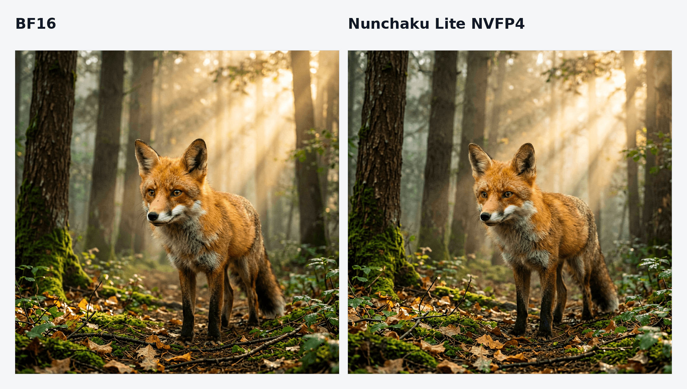
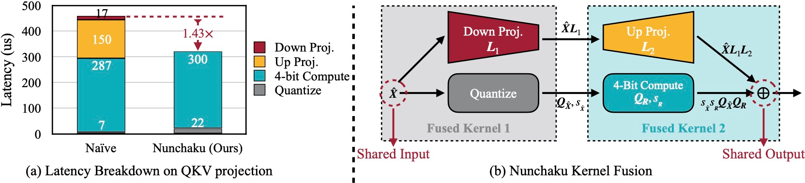
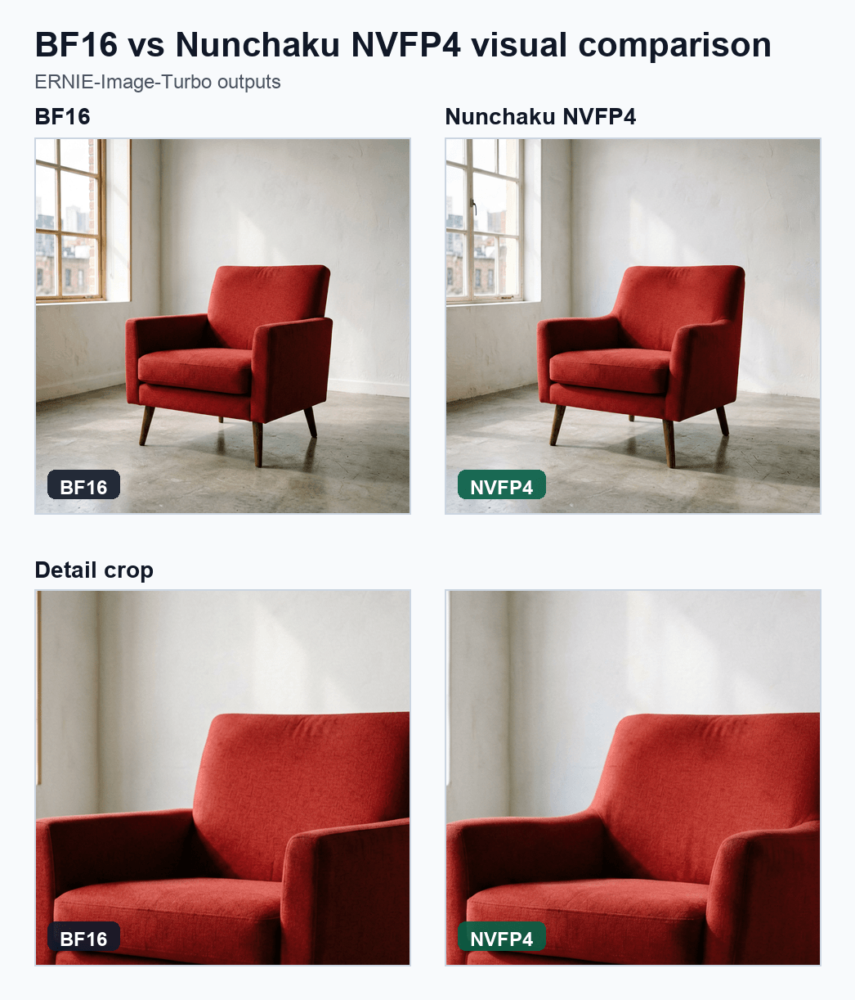

---
authors:
- aitoboxrobot
categories:
- 工具教程
date: 2026-08-07
hide:
- navigation
tags:
- Diffusers
- 量化
- Nunchaku
- SVDQuant
- 性能优化
title: 将 Nunchaku 4-bit 扩散推理引入 Diffusers
---
### 文章背景与核心概要

运行现代文本到图像和扩散变压器（Diffusion Transformers）模型通常需要消耗大量的显存（BF16 模型需要 20–30 GB），这使得绝大多数消费级 GPU 望而却步。虽然现有的量化后端（如 `bitsandbytes`、`GGUF`、`torchao` 和 `Quanto`）能够节省内存，但它们大多属于“仅权重（weight-only）”量化，并不能加速推理过程。

本文介绍了 **Diffusers** 对 **Nunchaku Lite** 的原生支持。得益于 **SVDQuant** 4-bit 权重与激活值（W4A4）量化方法，Nunchaku Lite 在显著降低内存占用的同时，还能带来大约 **30% 的速度提升**（结合 `torch.compile` 时提速甚至可达 **1.8倍**），并且完全不需要本地 CUDA 编译或自定义的 pipeline 类。

---

## 目录

- [Nunchaku Lite 入门指南](#nunchaku-lite-入门指南)
- [背景：SVDQuant 与 Nunchaku](#背景svdquant-与-nunchaku)
- [Nunchaku Lite 简介](#nunchaku-lite-简介)
- [在 Diffusers 中进行原生加载](#在-diffusers-中进行原生加载)
  - [硬件支持](#硬件支持)
- [获得更高的速度与更低的内存占用](#获得更高的速度与更低的内存占用)
- [基准测试](#基准测试)
  - [端到端延迟与内存](#端到端延迟与内存)
  - [图像质量](#图像质量)
- [量化你自己的模型](#量化你自己的模型)
  - [1. 检查将被量化的内容](#1-检查将被量化的内容)
  - [2. 运行量化](#2-运行量化)
  - [3. 打包 Diffusers Pipeline](#3-打包-diffusers-pipeline)
  - [4. 加载、验证并推送到 Hub](#4-加载验证并推送到-hub)
  - [带有结构重写的模型量化](#带有结构重写的模型量化)
- [开箱即用的检查点](#开箱即用的检查点)
- [结论](#结论)
- [致谢](#致谢)

---

## Nunchaku Lite 入门指南

首先，安装相关依赖。你需要较新版本的 Diffusers 以及 Hugging Face `kernels` 软件包：

```bash
pip install -U diffusers transformers accelerate kernels bitsandbytes
```

然后像加载其他 Diffusers 模型一样加载预量化 pipeline：

```python
import torch
from diffusers import ErnieImagePipeline

pipe = ErnieImagePipeline.from_pretrained(
    "lite-infer/ERNIE-Image-Turbo-nunchaku-lite-nvfp4_r32-bnb4-text-encoder",
    torch_dtype=torch.bfloat16,
).to("cuda")

image = pipe(
    prompt="A cinematic portrait of a red fox in a misty forest at sunrise, "
           "detailed fur, volumetric light",
    height=1024,
    width=1024,
    num_inference_steps=8,
    guidance_scale=1.0,
    generator=torch.Generator("cuda").manual_seed(42),
).images[0]
image.save("output.png")
```



这里不需要自定义 pipeline 类或独立的推理引擎，也没有什么需要在本地编译的内容。首次使用时，NVFP4 内核会通过 [Nunchaku Lite kernels 页面](https://huggingface.co/kernels/rootonchair/nunchaku-lite-kernels) 从 Hub 自动下载。

这个特定的检查点将 Nunchaku NVFP4 transformer 与 bitsandbytes NF4 文本编码器配对，在 RTX 5090 上生成 1024×1024 图像仅需约 **1.7 秒**，峰值内存占用约为 **12 GB**（相比之下 BF16 pipeline 约为 ~24 GB）。

> **注意：** NVFP4 检查点需要 NVIDIA Blackwell GPU（RTX 50 系列、RTX PRO 6000、B200）。对于早期世代的 GPU，请使用 INT4 变体。

---

## 背景：SVDQuant 与 Nunchaku

**SVDQuant** 是支撑 **Nunchaku** 的量化技术。标准的 4-bit 量化在处理扩散变压器时往往会遇到困难，因为权重和激活值中都包含大量的异常值（outliers）。SVDQuant 通过以下方式解决了这一问题：
1. 将激活值异常值转移到权重中。
2. 将每个权重矩阵中最困难的部分隔离到一个小的 16-bit 低秩（low-rank）分支中。
3. 将剩余的残差量化为 4-bit。

Nunchaku 通过针对 4-bit 路径和低秩分支的自定义融合内核（fused kernels），使这一过程变得极其高效。

<figure class="image text-center">

<figcaption>Nunchaku 将低秩降维投影与量化内核进行融合，并将低秩升维投影与 4-bit 计算内核进行融合，从而消除了内存访问开销。图片来自 <a href="https://arxiv.org/abs/2411.05007" rel="nofollow">SVDQuant 论文</a>。</figcaption>
</figure>

---

## Nunchaku Lite 简介

原版的 [Nunchaku 引擎](https://github.com/nunchaku-ai/nunchaku)通过特定模型的融合执行路径实现了极致性能。**Nunchaku Lite** 将这一能力直接引入到了 Diffusers 中，而无需依赖自定义引擎。

它使用两个内核系列，在运行时动态地将原生 Diffusers 模型中相关的 `nn.Linear` 模块替换为 SVDQ/AWQ 线性层：
* **`svdq_w4a4`**：4-bit 权重和激活值，带有 SVDQuant 低秩校正（提供 INT4 和 NVFP4 变体）。用于繁重的注意力机制和 MLP 投影。
* **`awq_w4a16`**：4-bit 权重配 16-bit 激活值。用于对精度敏感自适应归一化和调制层（例如 FLUX 的 `adanorm_single` / `adanorm_zero`）。

---

## 在 Diffusers 中进行原生加载

Nunchaku Lite 模型库的功能与标准 Diffusers 库完全一致。transformer 的 `config.json` 包含了一个简单的 `quantization_config` 块：

```json
"quantization_config": {
    "quant_method": "nunchaku_lite",
    "compute_dtype": "bfloat16",
    "svdq_w4a4": {
        "precision": "nvfp4",
        "group_size": 16,
        "rank": 32,
        "targets": [
            "layers.0.self_attention.to_q",
            "layers.0.self_attention.to_k",
            "..."
        ]
    },
    "awq_w4a16": {
        "precision": "int4",
        "group_size": 64,
        "targets": [
            "adaLN_modulation.1",
            "..."
        ]
    }
}
```

由于模块结构与未量化模型完全相同，调度器（schedulers）、LoRA 加载钩子（hooks）、CPU 卸载（offloading）和 `torch.compile` 等下游功能都可以无缝工作。

### 硬件支持

| 方案 | 精度 | 支持的 GPU |
| :--- | :--- | :--- |
| `svdq_w4a4` | `nvfp4` | Blackwell (RTX 50 系列, RTX PRO 6000, B200) |
| `svdq_w4a4` | `int4` | Turing / Ampere / Ada (RTX 30 & 40 系列, A100, L40S) |
| `awq_w4a16` | `int4` | Turing / Ampere / Ada (RTX 30 & 40 系列, A100, L40S) |

> **警告：** 这些 4-bit 内核目前不支持 Volta 和 Hopper GPU。量化器会在加载时检查 CUDA 能力，并直接抛出错误，而不是输出错误的结果。

---

## 获得更高的速度与更低的内存占用

* **`torch.compile`**：编译 transformer 可以将端到端加速比从 ~1.35x 提升至 **1.8x**：
  ```python
  pipe.transformer.compile(fullgraph=True)
  # 或者，编译重复的块以加快编译速度：
  pipe.transformer.compile_repeated_blocks(fullgraph=True)
  ```
* **量化文本编码器**：大型文本编码器（如 T5 或 Qwen3）会消耗数 GB 的显存。使用 bitsandbytes NF4 对它们进行量化可以进一步降低峰值显存占用。
* **CPU 卸载**：内置的 Diffusers 辅助函数（如 `enable_model_cpu_offload()`）在显存受限的环境中仍能正常工作。

---

## 基准测试

基准测试在 NVIDIA RTX PRO 6000 (Blackwell) 上以 1024×1024 分辨率运行，使用的是 [`rootonchair/ERNIE-Image-Turbo-nunchaku-lite-int4-bnb4-text-encoder`](https://huggingface.co/rootonchair/ERNIE-Image-Turbo-nunchaku-lite-int4-bnb4-text-encoder)。

### 端到端延迟与内存

| 配置 | 完整 Pipeline | 去噪循环 | 峰值显存 | 加速比 |
| :--- | :--- | :--- | :--- | :--- |
| **BF16 基线** | 3.00 s | 2.86 s | 31.1 GB | 1.0x |
| **Nunchaku Lite NVFP4** | 2.27 s | 2.13 s | 20.6 GB | 1.35x |
| **Nunchaku Lite NVFP4 + `torch.compile`** | 1.68 s | 1.53 s | 20.6 GB | **1.8x** |
| **Nunchaku Lite NVFP4 + NF4 文本编码器** | 2.29 s | 2.13 s | **16.0 GB** | 1.35x |

### 图像质量

  
*在相同随机种子和设置下，BF16 与 4-bit 输出的对比。*

---

## 量化你自己的模型

[`diffuse-compressor`](https://github.com/rootonchair/diffuse-compressor) 工具包为 Diffusers 模型提供了端到端的 SVDQuant 工作流。

### 1. 检查将被量化的内容
```bash
python examples/text_to_image/quantize_hf.py black-forest-labs/FLUX.2-klein-4B \
  --precision int4 --rank 32 --inspect-config
```

### 2. 运行量化
```bash
python examples/text_to_image/quantize_hf.py black-forest-labs/FLUX.2-klein-4B \
  --precision int4 \
  --output outputs/checkpoints/svdq-int4_r32-flux-2-klein-4b.safetensors
```

### 3. 打包 Diffusers Pipeline
```bash
python examples/convert_nunchaku_lite_diffusers.py \
  --checkpoint outputs/checkpoints/svdq-int4_r32-flux-2-klein-4b.safetensors \
  --model-id black-forest-labs/FLUX.2-klein-4B \
  --bnb4-text-encoder text_encoder \
  --compute-dtype bfloat16 \
  --output-dir outputs/diffusers/FLUX.2-klein-4B-nunchaku-lite-int4-bnb4-text-encoder
```

### 4. 加载、验证并推送到 Hub
```python
import torch
from diffusers import DiffusionPipeline

pipe = DiffusionPipeline.from_pretrained(
    "outputs/diffusers/FLUX.2-klein-4B-nunchaku-lite-int4-bnb4-text-encoder",
    device_map="cuda",
)
image = pipe(
    "A glass robot in a greenhouse, cinematic lighting",
    num_inference_steps=4, guidance_scale=1.0,
    generator=torch.Generator("cuda").manual_seed(12345),
).images[0]
```

---

## 开箱即用的检查点

* [`rootonchair/ERNIE-Image-Turbo-nunchaku-lite-int4-bnb4-text-encoder`](https://huggingface.co/rootonchair/ERNIE-Image-Turbo-nunchaku-lite-int4-bnb4-text-encoder)
* [`rootonchair/ERNIE-Image-Turbo-nunchaku-lite-nvfp4-bnb4-text-encoder`](https://huggingface.co/rootonchair/ERNIE-Image-Turbo-nunchaku-lite-nvfp4-bnb4-text-encoder)
* [`OzzyGT/Krea_2_Turbo_nunchaku_lite_nvfp4`](https://huggingface.co/OzzyGT/Krea_2_Turbo_nunchaku_lite_nvfp4)
* [`lite-infer`](https://huggingface.co/lite-infer) 集合。

---

## 结论

Nunchaku 的 SVDQuant 内核为在消费级硬件上运行扩散模型提供了一种高效的方法，并且它们现在已经在 Diffusers 内部获得了原生支持。如果你量化并发布了新模型，欢迎在 Hub 上分享它！

### 有用链接
* [Diffusers Nunchaku 文档](https://huggingface.co/docs/diffusers/quantization/nunchaku)
* [集成 PR (`huggingface/diffusers#14100`)](https://github.com/huggingface/diffusers/pull/14100)
* [SVDQuant 论文](https://arxiv.org/abs/2411.05007) & [Nunchaku 引擎](https://github.com/nunchaku-tech/nunchaku)
* [diffuse-compressor 工具包](https://github.com/rootonchair/diffuse-compressor)

---

## 致谢

感谢 Diffusers 维护者的指导、MIT HAN Lab / Nunchaku 团队带来的 SVDQuant、Marc Sun 和 Álvaro Somoza 的反馈，以及 SilverAI 对开发环境的支持。