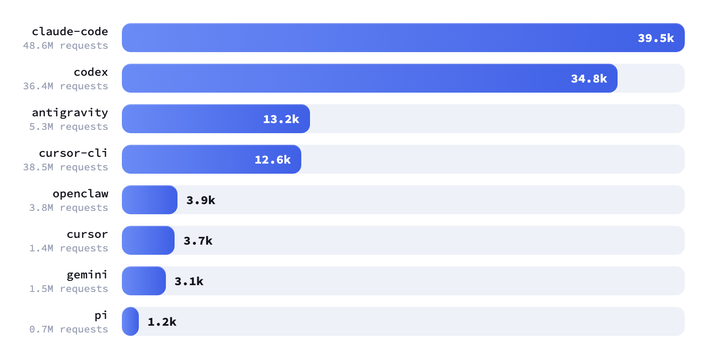
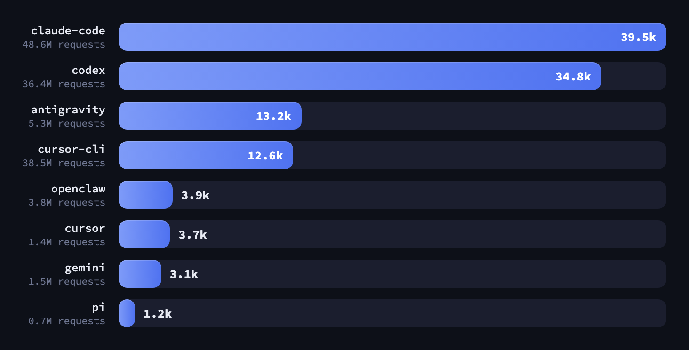
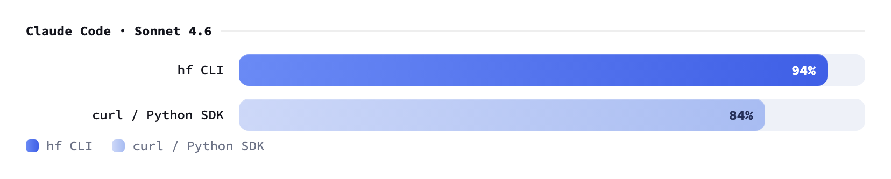
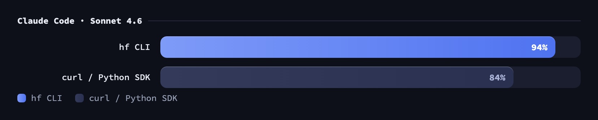
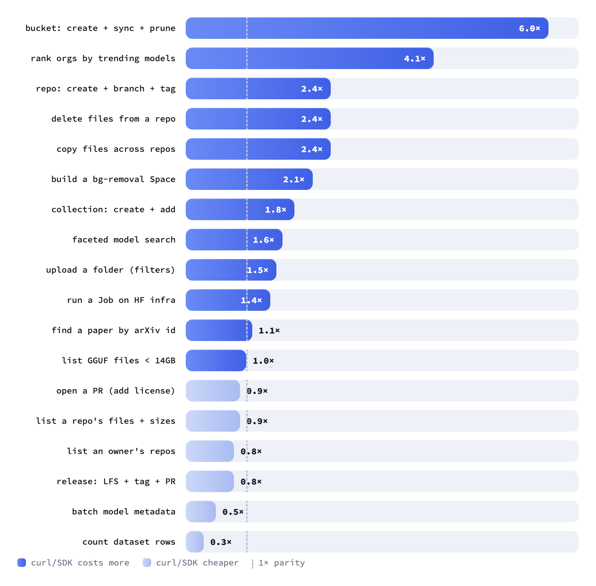
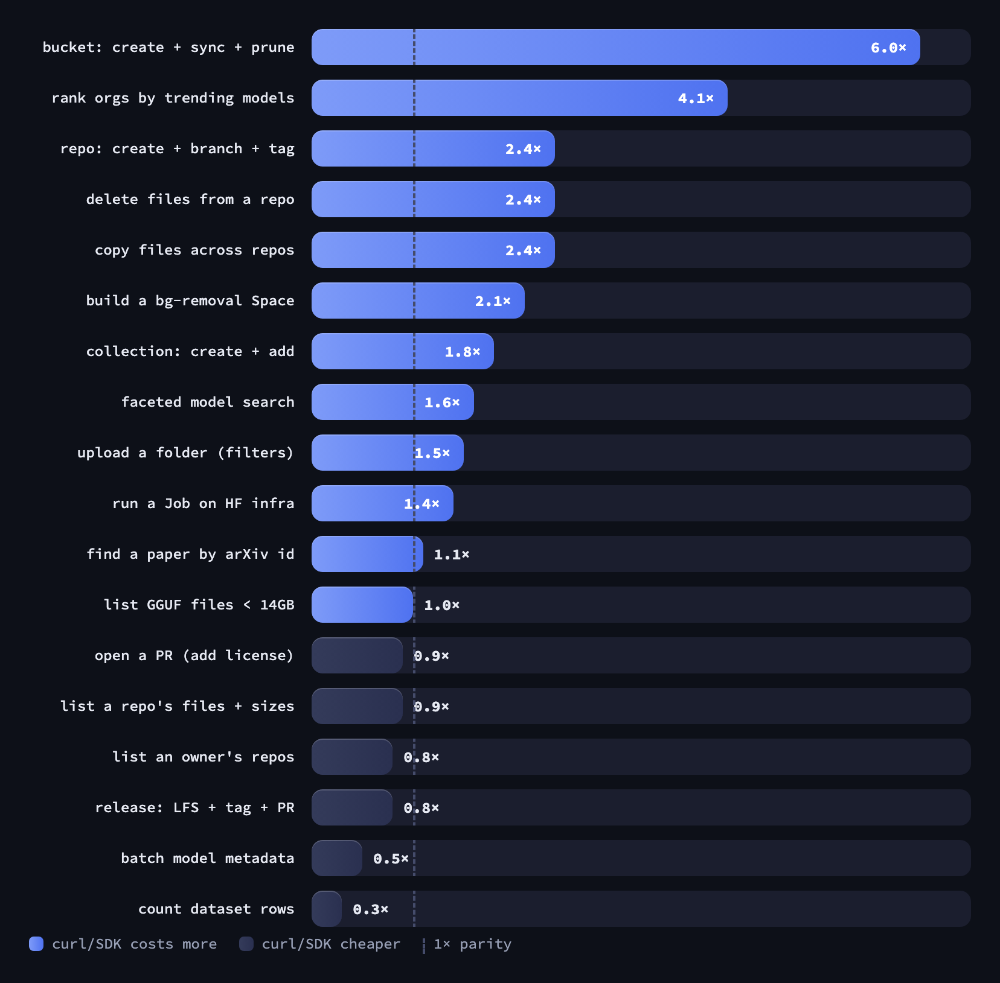
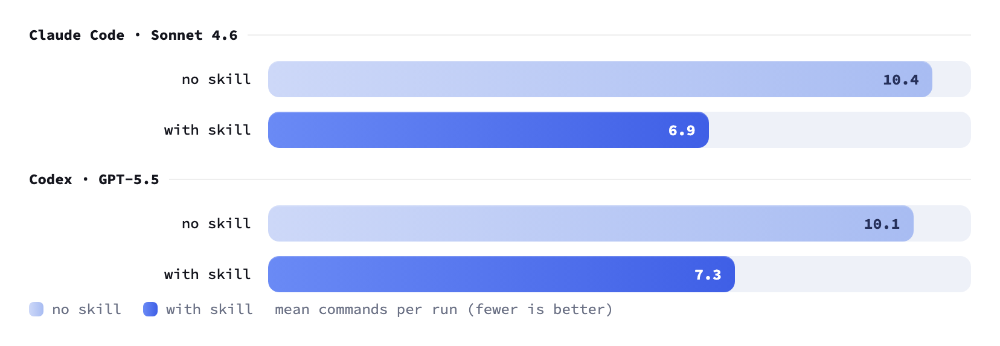
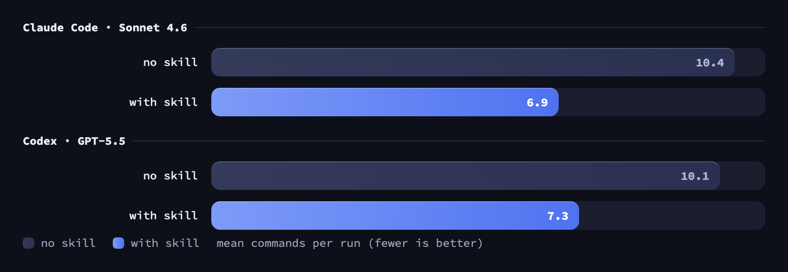

---
authors:
- aitoboxrobot
categories:
- arXiv论文
date: 2026-08-07
hide:
- navigation
tags:
- Hugging Face
- CLI
- AI Agent
- 开发者工具
- 性能优化
title: 将 hf CLI 设计为面向智能体的 Hub 交互优化工具
---
### 文章背景与核心概要
随着 Claude Code、Codex 和 Cursor 等编码智能体（Coding Agents）在 Hugging Face Hub 上的工作流中扮演越来越核心的角色，Hugging Face 对官方的 `hf` 命令行界面（CLI）进行了重新设计，以完美兼顾人类用户与 AI 智能体。该 CLI 通过自动检测智能体环境，能够动态调整输出渲染方式——从适合人类阅读的丰富表格，转变为干净、节省 Token 且易于解析的 TSV 结构。

基准测试表明，在复杂的多步骤工作流中，利用优化后的 `hf` CLI 相比直接使用 `curl` 或 Python SDK 基准，能够将 Token 消耗降低最多 **6 倍**。本文深入探讨了这一面向智能体优化的 CLI 的设计理念、架构特性以及实测表现。

---

## 📌 摘要 (Summary)

> As coding agents (like Claude Code, Codex, and Cursor) increasingly drive workflows on the Hugging Face Hub, Hugging Face has redesigned the official `hf` command-line interface to seamlessly accommodate both human users and AI agents. By detecting agent environments automatically, the CLI adapts its renderings—shifting from rich, human-friendly tables to clean, token-efficient, and parseable TSV structures. Benchmarks reveal that on complex multi-step workflows, leveraging the `hf` CLI reduces token usage by up to **6×** compared to a raw `curl` or Python SDK baseline.

---

## Hub 上的 AI 智能体流量 (AI Agent Traffic on the Hub)

自 2026 年 4 月开始追踪以来，Hugging Face 通过读取本地环境变量（例如 `CLAUDECODE`、`CODEX_SANDBOX` 或通用的 `AI_AGENT`）来监测智能体的使用情况。这不仅能识别出驱动它们的底层框架，还会为发往 Hub 的请求打上归属标头（`agent/<name>`）。

> Since tracking began in April 2026, Hugging Face has monitored agent usage by reading native environment variables (such as `CLAUDECODE`, `CODEX_SANDBOX`, or the universal `AI_AGENT`). This identifies the driving framework and tags inbound Hub requests with an attribution header (`agent/<name>`). 

<div>


</div>

> Claude Code and Codex lead user and request volume by a wide margin, scaling rapidly as developers delegate repository management tasks to autonomous coders.

Claude Code 和 Codex 在用户数和请求量上遥遥领先，随着开发者将仓库管理任务交托给自主编码器，这一数字正在飞速增长。

---

## 为人类与智能体共同打造 (Built for Humans and Agents)

人类需要丰富的视觉反馈（ANSI 颜色、截断并对齐的表格、进度指示器），而智能体则需要完整且未被截断的字符串值、结构化布局以及极低的 Token 消耗。`hf` CLI v1.9.0+ 通过根据执行上下文动态呈现相同的命令，成功弥合了这一鸿沟。

> Humans require rich feedback (ANSI colors, truncated padded tables, progress indicators), whereas agents demand complete, un-truncated string values, structured layouts, and minimal token consumption. The `hf` CLI v1.9.0+ bridges this gap by rendering identical commands differently depending on the execution context.

### 同一命令，多种渲染方式 (One Command, Multiple Renderings)

当检测到智能体环境时，输出会自动切换为干净的 TSV（制表符分隔值）格式，其中包含完整的 ID、精确的 ISO 时间戳以及未经截断的元数据数组。

> When an agent environment is detected, outputs automatically switch to a clean TSV (Tab-Separated Values) format containing full IDs, precise ISO timestamps, and un-truncated metadata arrays.

```text
# human (default in a terminal): aligned table, truncated to fit, with a hint
> hf models ls --author Qwen --sort downloads --limit 3
ID                       CREATED_AT DOWNLOADS LIBRARY_NAME LIKES PIPELINE_TAG    PRIVATE TAGS
------------------------ ---------- --------- ------------ ----- --------------- ------- -------------------------
Qwen/Qwen3-0.6B          2025-04-27  21156913 transformers  1285 text-generation         transformers, safetens...
Qwen/Qwen2.5-1.5B-Ins... 2024-09-17  15143953 transformers   725 text-generation         transformers, safetens...
Qwen/Qwen3-4B            2025-04-27  14808352 transformers   625 text-generation         transformers, safetens...
Hint: Use `--no-truncate` or `--format json` to display full values.

# agent (auto-detected): TSV, full ids + ISO timestamps + every tag, nothing truncated
$ hf models ls --author Qwen --sort downloads --limit 3
id      created_at      downloads       library_name    likes   pipeline_tag    private tags
Qwen/Qwen3-0.6B 2025-04-27T03:40:08+00:00       21156913        transformers    1285    text-generation False   ['transformers', 'safetensors', 'qwen3', 'text-generation', 'conversational', 'arxiv:2505.09388', 'base_model:Qwen/Qwen3-0.6B-Base', 'base_model:finetune:Qwen/Qwen3-0.6B-Base', 'license:apache-2.0', 'text-generation-inference', 'endpoints_compatible', 'deploy:azure', 'region:us']
Qwen/Qwen2.5-1.5B-Instruct      2024-09-17T14:10:29+00:00       15143953        transformers    725     text-generation False['transformers', 'safetensors', 'qwen2', 'text-generation', 'chat', 'conversational', 'en', 'arxiv:2407.10671', 'base_model:Qwen/Qwen2.5-1.5B', 'base_model:finetune:Qwen/Qwen2.5-1.5B', 'license:apache-2.0', 'text-generation-inference', 'endpoints_compatible', 'deploy:azure', 'region:us']
Qwen/Qwen3-4B   2025-04-27T03:41:29+00:00       14808352        transformers    625     text-generation False   ['transformers', 'safetensors', 'text-generation', 'arxiv:2309.00071', 'arxiv:2505.09388', 'base_model:Qwen/Qwen3-4B-Base', 'base_model:finetune:Qwen/Qwen3-4B-Base', 'license:apache-2.0', 'endpoints_compatible', 'deploy:azure', 'region:us']
```

### 下一步命令提示 (Next-Command Hints)

为了简化多步骤工作流，`hf` 命令会自动输出具备上下文感知的提示，指引智能体（或用户）执行所需的下一步确切命令：

> To streamline multi-step workflows, `hf` commands automatically output context-aware hints directing the agent (or user) to the exact subsequent command needed:

```text
$ hf jobs run --detach python:3.12 python train.py
✓ Job started
  id: 6f3a1c2e9b
  url: https://huggingface.co/jobs/celinah/6f3a1c2e9b
Hint: Use `hf jobs logs 6f3a1c2e9b` to fetch the logs.
```

### 非阻塞且支持安全重试 (Non-Blocking and Safe to Retry)

在智能体模式下，如果缺少确认参数，破坏性操作会直接快速失败（`Use --yes to skip confirmation.`），从而防止提示挂起。此外，数据操作支持 `--dry-run`，允许在消耗带宽前安全地预览数据传输。

> Destructive actions fail fast in agent mode when confirmations are omitted (`Use --yes to skip confirmation.`), preventing hanging prompts. Additionally, data operations support `--dry-run` to preview data transfers safely before committing bandwidth.

---

## 针对编码智能体的 hf CLI 基准测试 (Benchmarking the hf CLI for Coding Agents)

我们针对 10 个配置重复运行了 **18 个非平凡的 Hub 任务**，涵盖顶级编码智能体（**Claude Code / Sonnet 4.6** 和 **OpenAI Codex / GPT-5.5**），并在实时 API 检查下评估了输出成功率和 Token 负担。

> We ran **18 non-trivial Hub tasks** across 10 repetitions per configuration using top-tier coding agents (**Claude Code / Sonnet 4.6** and **OpenAI Codex / GPT-5.5**), evaluating output success rates and token burdens against live API checks.

| Agent | Tool | Success Score | Token Usage | Self-Report Error |
| :--- | :--- | :--- | :--- | :--- |
| **Claude Code (Sonnet 4.6)** | `hf` CLI | **0.94** | baseline | **2 / 163** |
| | curl / Python SDK | 0.84 | **1.3–1.6× tokens** | 11 / 163 |
| **Codex (GPT-5.5)** | `hf` CLI | **0.93** | baseline | **3 / 163** |
| | curl / Python SDK | 0.92 | **1.6–1.8× tokens** | 10 / 163 |

### 结果与发现 (Results and Findings)

<div>


</div>

<div>


</div>

* **Token 效率：** 虽然基础读取操作的性能表现相近，但复杂的编排任务（如存储桶同步、仓库克隆、分支创建和文件清除）迫使手动 API 实现消耗比统一的 `hf` 命令多出 **2 倍到 6 倍的 Token**。
* **可靠性：** 先进模型在使用原生代码替代方案时成功率较高，但与抽象的 CLI 调用相比，仍然伴随着沉重的 Token 和认知开销。

> * **Token Efficiency:** While basic read operations perform similarly, complex orchestration tasks (such as bucket synchronization, repository cloning, branching, and file purging) force manual API implementations to burn **2× to 6× more tokens** than the unified `hf` commands.
> * **Reliability:** Advanced models succeed more frequently with raw code alternatives, but still carry heavy token and cognitive overheads compared to abstract CLI calls.

---

## hf-cli 技能包 (The hf-cli Skill)

为了减少试错探索循环，`hf` 内置了一个自动生成的**技能定义（skill definition）**，智能体可以将其加载到上下文中。

> To reduce trial-and-error discovery loops, `hf` ships an auto-generated **skill definition** that agents can load into context.

```bash
# For Codex, Cursor, OpenCode, Pi, etc.
hf skills add

# Includes Claude Code support
hf skills add --claude
```

<div>


</div>

> Integrating this skill reduces mean tool calls per task from roughly **10 down to 7** (~30% fewer iterations) by removing the need for agents to query `--help` documentation dynamically.

通过消除智能体动态查询 `--help` 文档的需求，集成此技能可将每个任务的平均工具调用次数从大约 **10 次降至 7 次**（迭代次数减少约 30%）。

---

## 快速上手 (Get Started)

安装面向智能体优化的 CLI 环境：

> To install the agent-optimized CLI environment:

```bash
# macOS / Linux
curl -LsSf https://hf.co/cli/install.sh | bash

# Windows (PowerShell)
powershell -ExecutionPolicy ByPass -c "irm https://hf.co/cli/install.ps1 | iex"
```

将原生技能包添加至你的智能体：
> Add the native skill package to your agent:
```bash
hf skills add --claude
```

认证并测试：
> Authenticate and test:
```bash
hf auth login
```