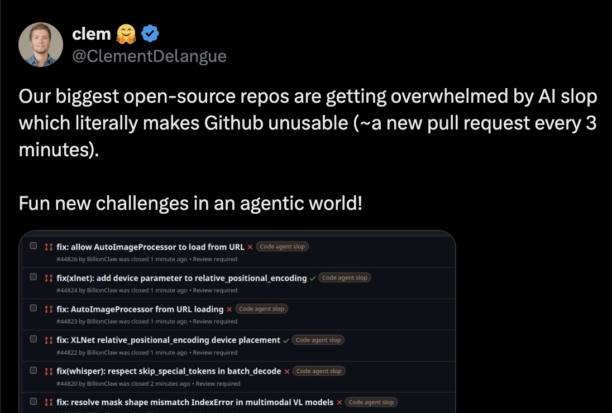
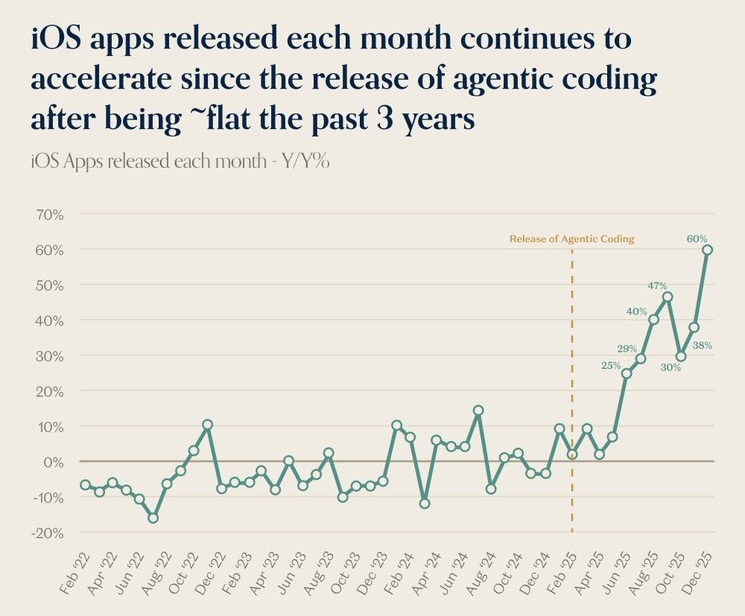
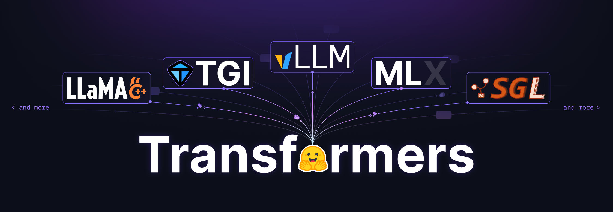
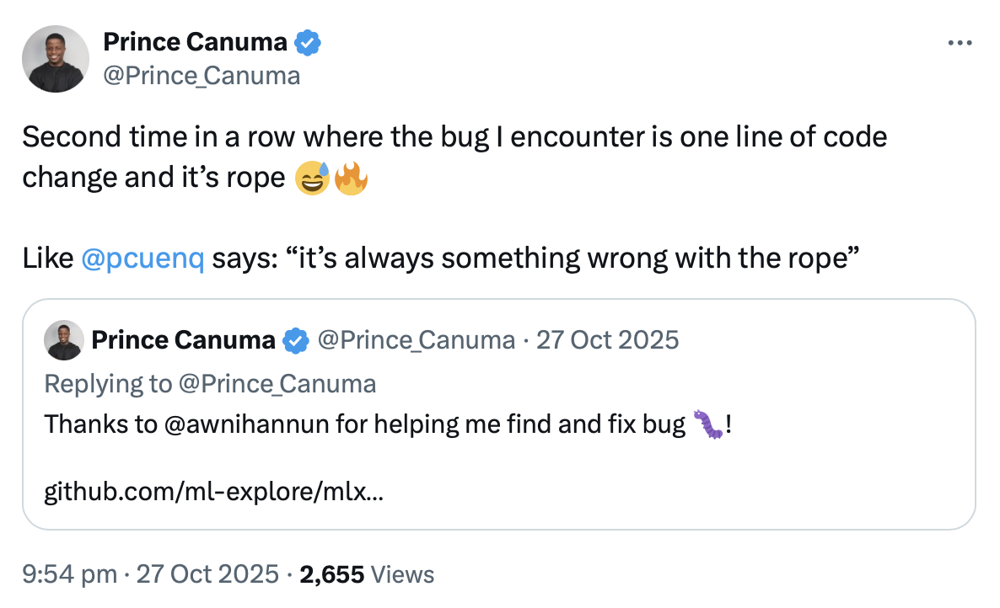

---
authors:
- aitoboxrobot
categories:
- 工具教程
date: 2026-08-07
hide:
- navigation
tags:
- MLX
- Transformers
- AI Agent
- 深度学习
- 代码重构
title: 您自己本来也想提的 Pull Request：用代码智能体加速 MLX 语言模型移植
---
### 文章背景与核心概要
随着以代码智能体（Code Agent）为代表的 AI 编程工具逐渐走向成熟，开源生态正迎来前所未有的海量贡献压力。在如 `transformers` 这类拥有庞大用户基础和严苛代码规范的底层库中，盲目利用智能体提交 PR 往往会因缺乏上下文而引入隐蔽 Bug、破坏性能或违背设计契约。MLX 社区的开发者 Pedro Cuenca 与 Awni Hannun 针对这一痛点，开发了一套专门用于将大语言模型从 `transformers` 移植到 Apple MLX 框架的 **Skill** 与**测试套件（Test Harness）**。

该系统并非全自动的“黑盒”工具，而是作为贡献者与核心维护者的得力助手。它能够自动处理复杂的架构映射（如 RoPE）、对齐数据类型、执行逐层数值对比，并最终产出符合人类审查标准的规范化 PR。通过将“代码智能体+严格测试+人工审查”相结合，该方案在大幅提升模型移植效率的同时，维护了开源社区赖以生存的高质量人际沟通与代码可读性。

---

## 摘要 (TL;DR)

我们提供了一个 **Skill** 和一个**测试套件（Test Harness）**，用于协助将语言模型从 transformers 移植到 `mlx-lm`，从而让这些模型在被加入 transformers 后能够（几乎）即时在 MLX 中可用。该 Skill 旨在作为贡献者和审查者的助手，而不是全自动工具。我们解释了我们为什么这样做、如何做的，以及在智能体时代如何对开源做出有意义的贡献。

> **Summary**
> Making transformer models available in `mlx-lm` can be accelerated using a specialized **Skill** and a **test harness**. This system is designed to help contributors and reviewers port language models efficiently the moment they land in transformers. Rather than automating blindly, the Skill functions as an assistant that enforces code quality, handles complex architecture mapping (like RoPE), runs comprehensive layer-wise comparisons, and leaves human reviewers with clean, maintainable pull requests.

---

## 代码智能体的诞生

到 2026 年，代码智能体开始真正发挥作用。过去编辑器旁边的自动补全，已经演变成能够根据简短规范一次性生成合理解决方案的系统。生成的代码通常可以直接运行，满足你的要求，并对你未指定的细节做出合理的假设。这很棒。正如黄仁勋所说，[世界上瞬间从 3000 万程序员增加到 10 亿程序员](https://www.youtube.com/watch?v=vif8NQcjVf0&t=7324s)。人类的创造力被彻底释放。

但这迫使我们重新思考开源。

以 `transformers` 库为例。它拥有数百名贡献者，被数千个项目使用，下载量超过 10 亿次。突然之间，任何拥有智能体的人都可以指示它去寻找某个开放的 Issue、修复它并提交一个 PR。而这正是正在发生的事情。这些人感到高兴，因为他们在为一个伟大的库做出贡献，但残酷的现实是，大多数时候他们并没有意识到自己其实并未真正帮到忙。

<div style="display: flex; gap: 2em; justify-content: center; align-items: flex-start; flex-wrap: wrap; margin: 1.5em 0;">
<figure style="margin: 0; text-align: center; flex: 1; min-width: 280px; max-width: 480px;">

<figcaption style="margin-top: 0.5em; font-size: 0.9em; color: #6b7280;">
        Source: <a href="https://x.com/ClementDelangue/status/2034294644800974908" rel="nofollow">@ClementDelangue</a>
</figcaption>
</figure>
<figure style="margin: 0; text-align: center; flex: 1; min-width: 280px; max-width: 480px;">

<figcaption style="margin-top: 0.5em; font-size: 0.9em; color: #6b7280;">
        Source: a16z / Sensor Tower
      </figcaption>
</figure>
</div>

为什么没有？智能体生成的 PR 通常忽略了两个前提：

* **像 transformers 这样的代码库极其看重代码本身**。构建那些不在乎代码长相的项目虽然很酷，但 transformers 并非其中之一。由于被数千人使用，transformers 首要构建的是一种通过代码实现的人与人之间的沟通方式。模型文件从上到下阅读，因为我们希望从业者无需跳过复杂的抽象就能理解它们。这种理念渗透[在整个库的设计中](https://huggingface.co/spaces/transformers-community/Transformers-tenets)，这也是为什么例如我们青睐扁平化结构的原因。
* **智能体并不具备这种上下文**。由于设计决策并非显式的，智能体往往通过遵循“最佳实践”来建议重构以“改善”代码库，却没有意识到它们正在打破库与其用户之间的隐式契约。它们往往显得冗长、过早泛化、在改动影响其他区域时毫无察觉、引入隐蔽的 Bug 并破坏性能。它们还具有谄媚性（sycophantic），会接受任何想法并忠实地执行到底，包括那些维护者本会用简短的评论及早拒绝的想法。

少数核心维护者仍然不得不阅读每一个 PR、理解它、决定设计方向是否正确、识别副作用并写出反馈。PR 的数量增长了十倍，但维护者的数量却没有增长（而且无法增长，因为团队协作无法规模化）。

---

## 这与 MLX 有什么关系？

Transformers 是首批由于庞大体量而感受到这种压力的项目之一，但同样的动态正在各地发生。作为另一个领域的例子，App Store 的审查人员正被淹没，因为任何人现在都可以构建并提交应用程序，因此很多人这么做了。

同样的逻辑适用于 MLX：其维护者非常重视代码，并会仔细阅读每一个 PR。我们想要看看智能体是否能够*帮助贡献者*快速落地高质量的模型移植，同时*支持维护者*的工作。我们不仅立志产出能够媲美人工精心提交的 PR，还提供了额外的工件以增加信号（Signal）：生成示例、数值对比以及用于复现的独立非智能体测试套件。

<p align="center">

</p>

Transformers 和 MLX 之间的另一个联系是，大多数时候，`mlx-lm` 模型都是从 transformers 实现移植过来的。由于 transformers 专注于清晰性和可读性，它[已经成为模型定义的真实数据源（source of truth）](https://huggingface.co/blog/transformers-model-definition)。下游贡献者往往要等到 transformers 实现准备就绪后，才会移植到其他框架。从客观上讲，这为智能体提供了一个极佳的环境，因为它自然地限制了范围：智能体无需从头开始实现，而是依赖 transformers 代码作为真实来源。

这种方法支持了我们的目标：当一个模型在 transformers 中落地时，它应该很快就能在 MLX 上使用。

---

## 我们做了什么

我们构建了一个 Skill，`mlx-lm` 贡献者可以使用它将模型从 transformers 移植到 MLX。给定诸如“将 `olmo_hybrid` 架构转换为 MLX”的提示词，该 Skill 会设置一个工作虚拟环境，从 Hub 中发现并下载相关模型，读取 transformers 建模代码，编写 MLX 实现，并运行一系列测试。如果结果看起来不对，它会进行调试和迭代，直到满意为止。

我们在设计时确保它对贡献者和审查者同样有用。

* **对于贡献者**，该 Skill 自然会处理所有的脚手架工作：在 Hub 上寻找模型变体、对比它们的配置以找出在各个变体间变化的参数、下载检查点、设置 `mlx-lm` 和 transformers 的可编辑安装。但它还处理更困难的建模任务。它关注显著的架构细节，并验证如 RoPE 配置等敏感区域，这些区域可能会导致难以发现的 Bug。它能够检测配置何时未声明 `dtype` 并从 safetensors 元数据头部推断出来。它运行 transformers 与 MLX 之间的逐层对比，以精确定位分歧发生的位置。这些都是只有具备移植经验的人才会想到运行的检查。
* **对于审查者**，该 Skill 产出的 PR 会公开表明它是经过智能体辅助的，但看起来就像是一次谨慎的人工提交。审查者会看到代码遵循了 `mlx-lm` 的规范：符合习惯的解决方案、没有不必要的注释、没有盲目的抽象、在没有明确批准的情况下不修改共享工具。鉴于代码是由智能体辅助的，我们尝试包含比中位数 PR *更多*的数据，以提供尽可能多的信号。PR 正文中包含一份报告，其中汇总了变体及其架构差异、生成示例、数值对比、`dtype` 验证以及针对 transformers 基准的逐层对比。PR 始终会披露它是经智能体辅助编写的，并且在贡献者接受结果之前，Skill 不会将其打开。
* **对于验证**，该 Skill 为一个独立的、非智能体的测试套件生成测试清单（test manifest），该套件按设计是易于复现的，且不受 LLM 幻觉或自满情绪的影响（[详见后文](#test-harness)）。

---

## 我们是怎么做的

Skill 是智能体的操作指南：包含指导模型完成复杂任务的简短文本文件。它们并非什么魔法；你可以通过提示词和迭代达到相同的效果。但它们提供了*一致性*（每次运行都遵循相同的流程，而不同的人提示词风格各异），最大程度减少了歧义并充当了文档：任何人都可以阅读 Skill 来了解它的功能、识别缺失的案例并提出改进意见。

我们通过自己动手移植一个模型来引导（bootstrapped）这个 Skill，并在与 Claude 的对话中完成。我让它将 GLM 4.7 从 transformers 移植到 `mlx-lm`，并像在正常会话中一样给出指令。一个小技巧：我让 Claude 指向一个我删除了现有实现的 `mlx-lm` 检查库，这样我就可以将输出与真实标准（ground truth）进行对比。经过几次迭代后，我得到了一个可运行的实现、一段揭示 Claude 如何处理该问题的对话，以及 Skill 的初稿（由 Claude 总结流程创建）。我对其进行了大量编辑，并融入了来自 [@gabegoodhart](https://huggingface.co/gabegoodhart) 的宝贵经验，他慷慨地分享了他们为另一个模型进行的[移植对话](https://github.com/ml-explore/mlx-lm/pull/442#issue-3399360107) 🙌。

我们重复了这个循环数次，Skill 不断成长。在技术方面，我们覆盖了诸如[RoPE Bug](https://x.com/Prince_Canuma/status/1982913823888814334)（可能会产生表面合理但在长序列下退化的输出）、悄悄杀死推理速度的 float32 精度污染（你会惊讶于这些事情发生的频率！）、在实现必须处理的变体之间变化的配置字段，以及不适合单台机器的超大型模型分布式推理。我们教它如何调用 `hf` CLI 来发现和下载模型。最重要的是，我们指示它运行经验丰富的移植者会做的测试，并且在测试通过之前不宣布成功。

<p align="center">

<br>
<em>Source: <a href="https://x.com/Prince_Canuma/status/1982913823888814334" rel="nofollow">@Prince_Canuma</a></em>
</p>

在文化方面，我们涵盖了更*温和*的特征，并解释了使 PR 易于审查的规范：不要使用注释来解释代码（审查者必须同时解析注释*和*代码 🤦‍♂️）、绝不提议重构、未经询问绝不触碰共享工具。这些规则对智能体来说成本为零，但为审查者节省了大量时间。

最终结果是：贡献者输入一个提示词，Skill 就会生成一个类似于[这个 PR](https://github.com/ml-explore/mlx-lm/pull/1023) 的 PR，外加用于外部测试套件的测试清单。

---

## 测试套件 (Test Harness)

Skill 作为 PR 的一部分共享了一份全面的结果报告。所有这些都来自于智能体在转换过程中运行的测试，但我们不希望审查者盲目相信并全盘接受。为了更进一步，我们创建了一个独立的、非智能体的测试套件，对转换后的代码运行系统化测试。这带来了几个好处：

* 消除了关于 LLM 产生幻觉或对结果过于自满的不确定性。
* 保证了可复现性：任何人都可以下载测试套件仓库并运行测试。
* 文档化与透明度。所有结果都以各种级别保存：[汇总报告](https://github.com/pcuenca/mlx-lm-tests/blob/main/results/pr-5/2026-04-14T122120-7ce7a68/summary.md#layers--ran)、[单模型详情](https://github.com/pcuenca/mlx-lm-tests/blob/main/results/pr-5/2026-04-14T122120-7ce7a68/summary.md#allenaiolmo-hybrid-instruct-sft-7b)、以 JSON 文件保存的[原始输入/输出](https://github.com/pcuenca/mlx-lm-tests/tree/main/results/pr-5/2026-04-14T122120-7ce7a68/allenai--Olmo-Hybrid-Instruct-SFT-7B)。[测试脚本](https://github.com/pcuenca/mlx-lm-tests/tree/main/results/pr-5/2026-04-14T122120-7ce7a68/scripts)也会被复制到结果文件夹中，这样即使我们将来对测试套件进行更改，我们也知道当时运行的是什么。

测试套件并不是一个 CI 门禁。有些检查很简单（输出的 dtype 是否正确？），但大多数都是定性的。一个预训练模型在长序列中重复自己是否正常？与 transformers 基准相比，4% 的相对 logits 差异是否可以接受？这些都是基于类似架构经验的判断。该测试套件提供了有用的信号，但最终做出决定的依然是审查者和贡献者。

---

## 如何使用该 Skill

该 Skill 专为那些已经开始在 `mlx-lm` 中提交模型 PR、或者原本就会手动这样做的开发者设计。它不适合大众消费，因为向 `mlx-lm` 提交的 PR 很少能一眼就被接受。典型的周期是：贡献者打开一个 PR，审查者指出改进意见，双方反复迭代直至达到质量标准。如果这对于专家的提交是真实的，那么对于智能体辅助的提交也同样如此。

如果你没有准备好参与这个循环，你可能就不应该提交 PR。审查者会努力理解你的代码（即便知道它是智能体辅助的），所以你也应该这样做。对代码负责，并准备好吸收他们的反馈。特别是，不要把审查者的评论直接扔给智能体，然后把智能体生成的任何东西直接发出来。LLM 会在自己的决定上固执己见、跑题，并且不会进行有效的反驳。一旦你与审查者进行互动，这就变成了一场人与人之间的对话，所以现在轮到你来讨论并尊重他们所投入的时间了。

你也可以使用该 Skill 进行学习；在建立信心和经验之前，你不需要提交任何东西。阅读 Skill 以识别你以前未曾注意到的问题领域：它在 skill 文件、参考文档和工具脚本中包含了近 1.5 万个单词。将其指向你自己的 `mlx-lm` 分叉（fork），尝试一次转换，并在官方仓库落地后将你的输出与被接受的实现进行对比。如果你这样做几次，你将学到大量关于 transformers、MLX 和语言模型架构的知识。

如果你准备好了：

```bash
uv run https://raw.githubusercontent.com/huggingface/transformers-to-mlx/main/install_skill.py
uvx hf skills add --claude
```

我们使用 Claude Code 开发和测试了这个 Skill。相同的方法也适用于 Codex 或其他编码智能体，但我们尚未对其进行测试。如果你在不同的环境中尝试了该 Skill，请让我们知道效果如何！

---

## 下一步计划与已知局限性

该 Skill 对 `mlx-lm` 中的 LLM 效果很好，但仍有很大的成长空间。

### 下一步

* **mlx-vlm**。视觉语言模型（VLM）位于一个[单独的仓库](https://github.com/Blaizzy/mlx-vlm)中，具有不同的规范。除了建模代码之外，`mlx-vlm` 还需要*处理器（processors）*在 LLM 看到输入之前处理图像预处理。我们期待与 [Prince Canuma](https://huggingface.co/prince-canuma) 合作，帮助他做他擅长的事情。
* **llama.cpp**。同样面临一些挑战。处理器要求将图像处理算法在 C++ 中进行复制，数值差异是不可避免的。这是一个范围受限的智能体可能大显身手的领域。
* **测试套件**。我们希望扩大测试电池，并可能探索安全的自动化，以便在我们的基础设施上自动运行测试。

### 尚不支持的功能

* **`mlx-lm` 中的共享工具**。在将通用模式提取到共享函数方面，`mlx-lm` 没有 transformers 那么严格。该 Skill 有意偏向自包含的模型文件（与 transformers 相同），但审查者经常要求进行重构，将重复的代码移动到共享模块中。
* **VLM 和其他架构**，如上所述。
* **量化模型上传**。该 Skill 测试了量化，但不会将量化模型上传到 Hub。我们认为在 PR 审查期间上传没有意义，但我们可以创建一个稍后执行此操作的流程。
* **思考测试（Thinking tests）**。尚未设计针对思考（thinking）过程的特定测试。该 Skill 会转换并验证这些模型的生成，但不会验证其思考结构。

---

## 结论

开源的瓶颈不是打字速度：而是理解代码库并在不破坏与用户的隐式和显式契约的前提下对其进行修改。如果我们教导智能体什么才是重要的，它们就能在这个过程中提供帮助。我们在 `mlx-lm` 的背景下探索了这种形态，并希望它能帮助贡献者和审查者更快地完成高质量的模型转换！

---

## 资源

**贡献：**
* [transformers-to-mlx Skill 仓库](https://github.com/huggingface/transformers-to-mlx)
* [测试套件仓库](https://github.com/pcuenca/mlx-lm-tests)
* [针对 fork 的智能体辅助转换示例](https://github.com/pcuenca/mlx-lm/pull/5)

**相关库：**
* [`mlx-lm`，目标库](https://github.com/ml-explore/mlx-lm)
* [`transformers`，建模代码的真实来源](https://github.com/huggingface/transformers)

**背景资料：**
* [Claude Code Skills 文档](https://code.claude.com/docs/en/skills)
* [Transformers 设计哲学](https://huggingface.co/spaces/transformers-community/Transformers-tenets)
* [Transformers 库：标准化模型定义](https://huggingface.co/blog/transformers-model-definition)

---

## 鸣谢！

非常感谢 [Ben](https://huggingface.co/burtenshaw)、[Shaun](https://huggingface.co/evalstate)、[Aritra](https://huggingface.co/ariG23498) 阅读本文的早期版本并使其变得更加出色 🙌

我们对 Apple 将 MLX 打造成开源项目表示由衷的感谢，也对社区瞬间识别其价值并热情贡献致以崇高的敬意 🙏