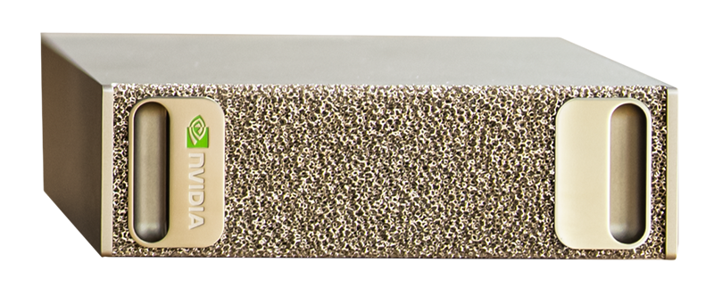
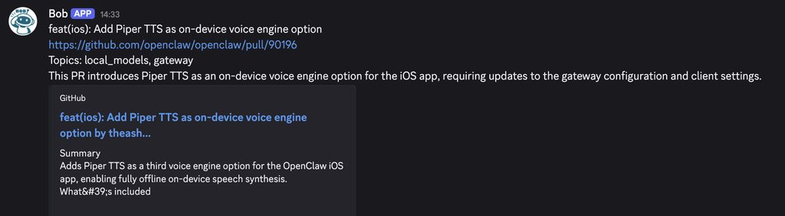

---
authors:
- aitoboxrobot
categories:
- arXiv论文
date: 2026-08-07
hide:
- navigation
tags:
- 本地模型
- 开源大模型
- AI Agent
- GitHub工作流
- 性能压测
title: 我们是如何让本地开源模型免费为 OpenClaw 仓库进行 Issue 和 PR 分流的！
---
### 文章背景与核心概要
随着云端托管 AI API 逐渐暴露出脆弱性以及被随时下架的风险（例如 Anthropic 的 Claude Fable 5 突遭下架），完全掌握自己的 AI 技术栈并在本地运行大模型变得比以往任何时候都更加重要。本文探讨了如何利用本地开源模型（如 Gemma 和 Qwen）结合 `pi` 驱动的本地代理框架（`localpager-agent`），在拥有 128 GB 统一内存（NVIDIA GB10）的硬件上，构建一个实时且零成本（电费和硬件成本除外）的 GitHub Issue 与 Pull Request (PR) 自动分流系统。

文章详细介绍了他们如何通过“代理式分类（agentic classification）”与受限的只读 Shell（`reposhell`）相结合，在防止提示词注入的同时，对高吞吐量的 GitHub 动态进行精准分类。作者不仅展示了整体架构设计，还将本地中等规模模型（如 `gemma-4-26b-a4b` 和 `qwen3.6-35b-a3b`）与云端大模型（如 DeepSeek-V4-Flash）在 330 行评估数据集上进行了基准测试（Benchmark）对比，并阐述了如何利用 OpenClaw 自动化验证本地模型的实时运行表现。

---

# 我们是如何让本地开源模型免费为 OpenClaw 仓库进行 Issue 和 PR 分流的！*

> _*这里的“免费”指的是像啤酒那样免费（Free as in beer），不含电费，且假设你已经拥有了硬件设备_

**发布时间：** 2026年6月22日  
**作者：** Onur Solmaz, ben burtenshaw, shaun smith  

2026年6月将作为人们意识到闭源模型随时可能被剥夺的转折点而被载入史册。回想起 Anthropic 最新旗舰模型 Claude Fable 5 的下架事件还历历在目，大家就能明白为什么掌控自己的 AI 技术栈、能够在本地运行模型变得前所未有地重要，尤其是当你正基于 AI 构建自己的商业业务时。

鉴于此，我们想分享如何将 Gemma 和 Qwen 等本地模型放入代理框架（agent harness）中来执行分类任务^[1]。这种方法不同于使用 BERT 等传统模型进行分类。在像 Pi 这样的代理框架中配合结构化输出（structured outputs），本地模型完全可以用来分派标签。我们之所以选择这种方法，是因为我们手头既有本地模型又有现成的框架，并且坚信随着本地模型能力的提升，类似的配置将会越来越受欢迎^[2]。

我们的起点是 OpenClaw 仓库中的开源贡献。OpenClaw 每天都会收到数百个 Issue 和 PR，这些都需要进行分类、优先级排序并路由给维护者。我（Onur）正致力于让本地模型在 OpenClaw 中发挥良好作用。作为这个特定垂直领域的维护者，我需要对任何 P0 级 Issue 做出快速响应。

对于 GPT-5、Opus 或 Sonnet 等 SOTA（State-Of-The-Art，行业领先）闭源模型来说，这是一项相当简单的任务。但碰巧我手头上有一台拥有 128 GB 统一内存的设备，即 NVIDIA GB10。于是我接下了这个挑战：

> 我能否用本地开源权重模型构建一个实时通知系统，仅筛选并通知我所负责的那些 Issue……？

<figure class="image table text-center m-0 w-full" style="text-align: center;">

<figcaption>这个被称为 DGX Spark 的微型盒子，能够以高并发运行 gemma-4-26b-a4b 并实现每秒生成数百个 Token。</figcaption>
</figure>

如果我让运行在每月 200 美元 ChatGPT Pro 订阅计划上的 OpenClaw 主代理针对每一个新 Issue 或 PR 都触发一次任务，那将会迅速耗尽我的配额。我可能不得不改成每 2 小时或每 6 小时运行一次。这样会将 Issue 批量积压较长时间，从而以牺牲实时通知为代价换取延迟处理。

如果我在现有硬件上运行本地模型，我不仅能获得几乎即时的通知，还能免费完成这一切（准确地说是只需支付电费）。

---

## 对 Issue 和 PR 进行分类

我们制定了一组有限的标签，用来表示需要分流的 Issue 类别，然后利用本地模型将每个 Issue 分类到其中一个类别中，例如 `local_models`、`self_hosted_inference`、`acp`、`agent_runtime`、`codex`、`ui_tui` 等^[3]。

但是我们该如何对 Pull Request 进行分类呢？是通过一个包含主题枚举（enum）的工具 JSON Schema 简单地向“聊天补全（Chat Completions）”端点发送单次请求吗？

差不多是这样。但现在是 2026 年，而不是 2023 年，我们拥有了 AI AGENT（智能体）。我们可以做得更好！

在本地模型的选择上，我们测试了 `gemma-4-26b-a4b` 和 `qwen3.6-35b-a3b`。通过性能优化，两款模型都能够在本地实现每秒生成数百个 Token。

我们使用代理框架来驱动分类运行。为此，我们集成了 [pi](https://pi.dev) 作为能够调用本地模型端点的框架。

代理在默认情况下会在第一个提示词（prompt）中接收到 PR 的标题、正文以及 PR diff 的截断摘要。接着，它既可以选择使用 `bash` 工具对 OpenClaw 仓库执行只读操作（以防它需要查阅代码库），也可以选择使用 `final_json` 工具提交最终的分类结果。

你绝不会希望在这种高吞吐量的环境中赋予本地模型完整的 bash 权限，因为带有提示词注入（prompt-injected）的 Issue 或 PR 可能会诱导模型执行与分类无关的操作。

出于这个原因，我们使用 [`reposhell`](https://github.com/osolmaz/localpager/tree/main/reposhell) 代替了 `bash`：这是一个受限制的、类似 `bash` 的 Shell，仅允许对 OpenClaw 仓库执行只读操作（如 `ls`、`find`、`cat`、`grep` 等）。模型会以为自己在使用 `bash`，但任何未经允许的操作都会被拒绝：

```text
reposhell bound cwd=/repo/openclaw repos=openclaw
type help for allowed commands; exit or quit to leave

reposhell /repo/openclaw> help
allowed: pwd, ls, find, rg, grep, sed -n, cat, head, tail, wc -l, git status --short, git show --name-only, git grep, git ls-files
search: rg -n -i "lm studio" or grep -R -n -i "lm studio" .
files: rg --files -g "*.ts" or git ls-files src
examples: rg -n reposhell README.md | sed is not allowed; use one simple command at a time

reposhell /repo/openclaw> head README.md
# 🦞 OpenClaw — Personal AI Assistant

<p align="center">
    <picture>
        <source media="(prefers-color-scheme: light)" srcset="https://raw.githubusercontent.com/openclaw/openclaw/main/docs/assets/openclaw-logo-text-dark.svg">
        
    </picture>
</p>

<p align="center">

reposhell /repo/openclaw> curl localhost
reposhell policy denied command: unsupported command "curl"
exit_code=2

reposhell /repo/openclaw>
```

这里有一个具体的例子说明了这种设计的重要性。在某次[保存的会话示例](https://huggingface.co/datasets/dutifuldev/openclaw-classification-dataset/blob/main/session-examples/README.md)中，`qwen3.6-35b-a3b` 正在对 [`openclaw/openclaw#84621`](https://github.com/openclaw/openclaw/pull/84621) 进行分类，该 PR 的标题是 `Fix Kimi tool-call rewriting stop reason handling`。思维链（thinking block）显示，模型最初考虑将其归入 `coding_agent_integrations`，因为更改的路径 `extensions/kimi-coding` 让它看起来很像。模型随后通过 reposhell 使用诸如 `ls extensions`、`ls extensions/kimi-coding` 以及 `cat extensions/kimi-coding/package.json` 等简单的只读命令检查了本地仓库。该包元数据显示，该扩展实际上是 `@openclaw/kimi-provider`，即 OpenClaw 的 Kimi 提供商插件。于是模型将最终标签更正为 `inference_api` 和 `tool_calling`，并明确排除了 `coding_agent_integrations`。

我们前面提到过，我们打包了一个特定的 `pi` 配置，该配置只能执行只读操作并返回分类输出。我们将其命名为 [`localpager-agent`](https://github.com/osolmaz/localpager/tree/main/localpager-agent)，得名于本项目的主名称 `localpager`。每个 PR 和 Issue 都会生成一个提示词，然后连同其他参数一起传递给 CLI，如下所示：

```bash
localpager-agent \
  --model "<model-id>" \
  --base-url "<openai-compatible-base-url>" \
  --session-dir "<session-output-dir>" \
  --final-schema "<runtime-schema.json>" \
  --tools bash,final_json \
  --reposhell-socket "<reposhell.sock>" \
  --reposhell-default-repo "<repo-id>" \
  --reposhell-visible-repos "<repo-id>[,<repo-id>...]" \
  -p "$(cat <rendered-prompt.md>)"
```

---

## 处理传入的 PR 与 Issue

那么，究竟是什么在协调传入的 PR/Issue 与 Discord 最终通知之间的整个流程呢？

<figure class="image table text-center m-0 w-full" style="text-align: center;">

<figcaption>这就是最终过滤后的 Discord 通知的样子：有关所需垂直领域的 PR 被路由发送给了我。</figcaption>
</figure>

围绕这一流程的协调逻辑非常简单，只有分类步骤涉及大语言模型（LLM）：

1. 我们使用 [openclaw/gitcrawl](http://github.com/openclaw/gitcrawl) 作为仓库的本地镜像。每当有新的 PR 或 Issue 产生时，每个条目都会被标准化为统一的形态，并写入 localpager 自身的 SQLite 数据库中。如果条目是崭新的，localpager 就会为其创建一个分类任务。
2. 随后，工作线程（worker）从该队列中领取任务。它会构建一个包含 Issue 或 PR 的标题、正文、标签、作者、状态，以及可选的评论、修改文件和选定 diff 摘要的 GitHub 上下文对象。这意味着本地模型在大多数情况下无需自己浏览 GitHub 或打开 URL，所有相关的上下文都已经直接交给了它。
3. 上下文对象被渲染成提示词，并如上一节所述传递给 `localpager-agent`。代理可以进行思考并使用 reposhell，但最终必须输出符合定义 Schema 的分类结果。
4. 输出结果被存回 localpager 的 SQLite 数据库中，并根据用户配置的通知策略（例如：通知我这些主题，但不要通知那些主题）转发到 Discord。

下图展示了 localpager 的整体架构：

<figure class="image table text-center m-0 w-full" style="text-align: center;">

</figure>

这种架构是半代理式（semi-agentic）的。标签赋予过程由 Agent 完成，而发送通知则通过确定性规则处理。这样设计是为了移除任务中最直观部分的推理需求，从而加快通知管道的速度。本地推理虽然是免费的，但每个任务都存在资源争用成本：GPU 带宽应该留给绝对需要推理的任务。这也降低了通知出错的概率。

---

## 本地模型能够对 PR 进行分类吗？

坦白来讲：该系统的早期本地版本存在不少噪声。测试的第一款模型——`gemma-4-e4b-it` 对于让端到端的本地管道跑通很有帮助，但它也有在 PR 或 Issue 上贴上过多不相关标签的倾向。误报标签会使 Discord 动态消息变得嘈杂，无法将我的注意力集中到正确的 Issue 上。这促使我们在下面包含 330 行的评估集上测试了更大的本地模型，包括 `gemma-4-26b-a4b` 和 `qwen3.6-35b-a3b`。

在早期的提示词调优阶段，我们还通过 antirez DS4 实现^[4]使用了 `DeepSeek-V4-Flash` 来创建早期的数据集标签。该设置通过 CUDA 运行 DS4 服务器。我们最终放弃了将 DS4 作为标注工具，因为它在多次运行中的标注不够一致。我们也没有将其作为主要的 `localpager-agent` 模型，因为它体积太大，无法在我们的硬件上获得足够的吞吐量：DS4 服务器给我们的吞吐量约为每秒 14 个 Token，最大并发数为 1。

为了测试模型性能，我们精心挑选并生成了 330 个 GitHub Issue 和 PR 的标签。每个条目都被标注了五次（3次使用 GPT-5.5，2次使用 Opus 4.8），必须达成模型意见一致才会被采纳。这个过程涉及人工裁决、改进标签定义以及向模型突出显示内部产品设计选择。这为我们提供了一套稳定、可复现的标签，用以与我们的较小模型进行对比。

在这一评估集上获得有用的结果之前，我们无需对 `gemma-4-26b-a4b` 或 `qwen3.6-35b-a3b` 进行提示词优化。在使用相同路由提示词的情况下，Gemma 具有更高的召回率和更短的单行响应时间（wall-clock time），而 Qwen 则具有更高的准确率、更高的完全匹配率（exact match）以及更少的误报。我们还在同一数据集上运行了 `DeepSeek-V4-Flash` 作为参考。它的误报最少，但其模型大小和吞吐量使得它无法在 NVIDIA GB10 上实时执行这些任务。由于每行可以有多个标签，因此误报和漏报是指所有行中的总标签数。下文的 Qwen 结果是在模型在调用 `final_json` 之前耗尽输出 Token、导致结构化输出失败并进行重试之后的表现。对于 Gemma 和 Qwen，重复运行的指标报告了三次运行的均值 ± 样本标准差。`DeepSeek-V4-Flash` 仅作为参考运行了一次。

| 指标 | `gemma-4-26b-a4b` | `qwen3.6-35b-a3b` | `DeepSeek-V4-Flash` |
|---|---:|---:|---:|
| 准确率 (Precision) | 0.716 ± 0.010 | 0.831 ± 0.007 | 0.938 |
| 召回率 (Recall) | 0.905 ± 0.004 | 0.818 ± 0.006 | 0.714 |
| F1 值 | 0.800 ± 0.008 | 0.824 ± 0.002 | 0.811 |
| 完全匹配 (Exact match) | 0.410 ± 0.014 | 0.540 ± 0.014 | 0.509 |
| 误报数 (False positives) | 227.0 ± 10.5 | 105.7 ± 6.4 | 30 |
| 漏报数 (False negatives) | 60.0 ± 2.6 | 115.3 ± 4.0 | 181 |
| 单行耗时秒数 (Wall seconds / row) | 1.41 ± 0.04 | 13.51 ± 0.79 | 144.14 |
| 单 worker 输出速度 (Output tok/s / worker) | 25 | 50 | 13 |
| 总输出速度 (Output tok/s aggregate) | 402.6 | 145.3 | 13 |
| 并发数 (Concurrency) | 16 | 4 | 1 |
| 总参数量 (Total parameters) | 26B | 35B | 284B |
| 激活参数量 (Active parameters) | 4B | 3B | 13B |

这里的吞吐量和耗时数据并不是这些模型在此硬件上的最终极限性能。它们是我们当时在现有优化条件下使用的配置。例如，在单独的测试中，`gemma-4-26b-a4b` 还支持 32 的并发，聚合输出速度达到了每秒 700 多个 Token。

<figure class="image table text-center m-0 w-full" style="text-align: center;">

<figcaption>330 行标签集的基准测试对比。每个子图使用其自己的垂直坐标轴刻度；蓝色标出了该指标的最佳值。准确率和召回率上的误差条显示了 Gemma 和 Qwen 三次运行的样本标准差。</figcaption>
</figure>

在 Gemma 的基准测试中，我们使用 vLLM 部署了 `gemma-4-26b-a4b`，并应用了我们为该设置找到的可用优化方案。其中很大一部分归功于 NVFP4 量化：在 GB10 级别的 Blackwell 硬件上，它不仅仅是一个更小的模型文件，而是一种硬件友好型格式，能够比诸如 Q4_K_M 等便携式 GGUF 量化更直接地利用 NVIDIA/vLLM 执行路径。在实践中，这意味着更少的内存流量和更多的批处理空间。我们还启用了前缀缓存（prefix caching）、FP8 KV 缓存、CUTLASS MoE 后端以及纯语言模型模式（language-model-only mode）。完整的 330 行运行在并发数为 16 的情况下大约在 7.5 分钟内完成。

---

## 使用 OpenClaw 跟踪和验证实时性能

我们前面提到过，与其为每个新 Issue 或 PR 运行一次本地模型任务，我们可以每隔 n 小时（例如每 2 小时）运行一次由 SOTA 云端模型（如在 OpenClaw 中运行的 GPT-5.5）驱动的批处理任务来达到相同的目的^[5]。

在这种情况下，我们需要一个 ChatGPT Pro 订阅计划。由于该模型属于行业顶尖水平，尽管把 2 小时内的 Issue/PR 批量打包在一起，我们依然可以期望它表现出相当不错的性能。

为了解本地分类器与 GPT-5.5 相比表现如何，我们让两者同时运行，并每隔 2 小时让 GPT-5.5 来充当裁判，判定误报和漏报情况。

为安全起见，我们在沙箱中运行 OpenClaw 任务，且该任务仅能访问我们汇报结果的[公开仓库](https://github.com/osolmaz/onurclaw)。在我们的案例中，我们让 OpenClaw 任务更新一个机器可读的文件，随后通过一个简单的脚本读取由 Codex 分配的标签，并计算出误报/漏报状态。输出示例：

> 漏报 (False negatives)
> * Issue #88499 openai-responses provider: 404 on previous_response_id when store=false (default)
>   * 盘点领域: OpenAI-compatible/proxy; 通知器主题: agent_runtime, api_surface, sessions; 通知: 无
> 
> 误报 (False positives)
> * PR #88275 fix(models-config): allow self-hosted providers without apiKey in models.json (#88267)
>   * 通知器关注点: i0; 主题: self_hosted_inference, local_model_providers, config; 通知: 已发送
> * PR #88266 refactor: extract model catalog core package
>   * 通知器关注点: i1; 主题: config, api_surface, local_model_providers; 通知: 已发送
> * PR #88247 feat: add hosted model providers
>   * 通知器关注点: i0; 主题: local_model_providers, model_serving, docs, api_surface; 通知: 已发送

有关如何进行分类、编辑机器可读文件、通过脚本获取误报和漏报的说明，都包含在一个[代理技能（agent skill）](https://github.com/osolmaz/onurclaw/blob/main/.agents/skills/openclaw-onur-inventory/SKILL.md)中，该技能被引用在每 2 小时运行一次的 [OpenClaw 定时任务（cron job）](https://docs.openclaw.ai/automation/cron-jobs)中。随后，OpenClaw 代理会摄取任何新的 Issue 或 PR，将它们连同适当的标签一起添加到 JSON 文件中，运行脚本并在同一个 Discord 频道中汇报结果。通过这种方式，我们可以每隔几小时观察一次本地模型的性能，并获得漏报的通知。

---

## 结论

我们认为，Issue/PR 分流任务其实是更广泛的一类任务（我们称之为“高吞吐量分流”）中的一个特定用例。本文探讨了利用本地模型在一个领域（即开源贡献）中实时过滤信息的构想。像 `gemma-4-26b-a4b` 和 `qwen3.6-35b-a3b` 这样中等规模的本地模型，在无需任何微调的情况下就能以高准确率进行零样本（zero-shot）分类，这使它们成为快速原型开发的绝佳首选，在此之后人们再去考虑更具成本效益的传统分类器模型。

然而，同样的方法也可以应用到其他领域：

* 新闻行业的资讯分类
* X（原推特）或 Reddit 等社交媒体和论坛的感兴趣帖子过滤
* 客户支持工单分流
* 内容审核申诉分流
* 销售过程中的潜在客户开拓筛选
* 研究过程中 arXiv 特定主题的过滤

这个列表还可以不断延伸，但我们相信核心理念已经十分清晰。

除了分流之外，我们还探讨了如何通过运行快速本地模型的代理框架以安全的方式执行分类。给这种方法起个好名字的话，可以叫作**代理式分类（agentic classification）**：模型不会预先被喂入全部的庞大信息，而是在返回结构化数据之前可以主动搜索更多上下文。虽然我们不能说这是一种全新颖的方法，但我们希望这篇博客文章能成为特定 [Pi](https://pi.dev) + 受限 Shell + `final_json` 架构组合的优秀参考。

---

## 脚注

1. 对于本文中的用例，我们发现以能够正确理解产品界面并打上标签的方式来拆解 PR/Issue 是一个难题。<a href="#note-1-ref" rel="nofollow">back</a>
2. 尽管在我们的测试中没有这样做——但对于模型来说，得出“下一步去收集信息，然后使用外部分类器”的结论是完全合理的。代理式方法与传统方法并非互不相容。<a href="#note-2-ref" rel="nofollow">back</a>
3. 完整的主题列表和其他配置请参见[此处](https://github.com/osolmaz/localpager/blob/main/examples/profiles/openclaw-routing-topics.json)。<a href="#note-3-ref" rel="nofollow">back</a>
4. 我们使用了来自 [antirez/deepseek-v4-gguf](https://huggingface.co/antirez/deepseek-v4-gguf) 的 `DeepSeek-V4-Flash-IQ2XXS-w2Q2K-AProjQ8-SExpQ8-OutQ8-chat-v2.gguf`。<a href="#note-4-ref" rel="nofollow">back</a>
5. 尽管我们意识到使用 LLM 作为裁判违背了“免费”的初衷，但我们的特定实现出于研究目的才这样做的。在实践中，可以在试用期内使用更大、更昂贵的模型协同进行校准，在此之后系统将完全过渡到较小的模型。在最近的运行中，这个审计循环在每 2 小时的检查中总共消耗了约 4 万个 GPT-5.5 Token（大部分是缓存上下文），按 API 定价计算每次运行成本约为 2 到 3 美分，如果一天运行 12 次则每月约合 9 美元。这是一个针对所有新条目的单次批量审计，而不是针对每个条目的裁判调用；如果按条目逐个调用，成本可能会高出好几倍。<a href="#note-5-ref" rel="nofollow">back</a>