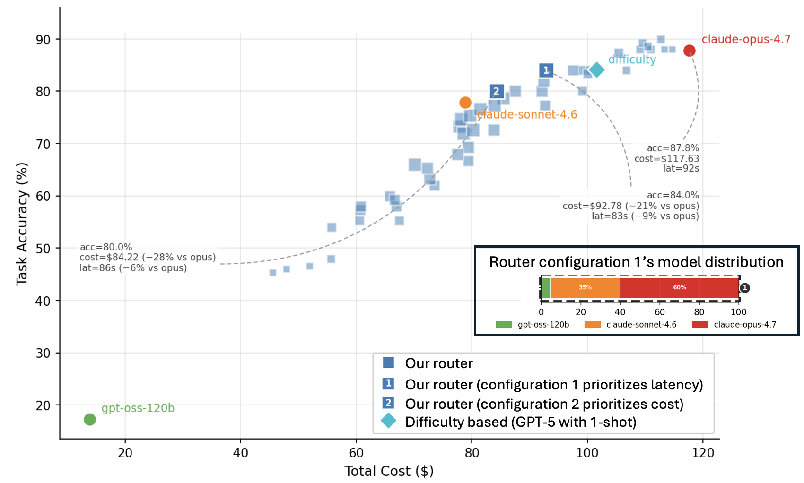

---
authors:
- aitoboxrobot
categories:
- 商业动态
date: 2026-08-07
hide:
- navigation
tags:
- 模型路由
- 系统优化
- 智能体工作流
- 成本控制
- 延迟优化
title: 模型路由看似简单，实则不然
---
### 文章背景与核心概要
在这篇由 IBM Research 研究员（Yara Rizk、Eyal Shnarch、Jason Tsay 和 Merve Unuvar）撰写的企业级技术文章中，作者探讨了在 AI 智能体（Agent）工作流中构建模型路由器的复杂性。虽然许多人最初将模型路由视为一个简单的分类问题（将简单任务分配给廉价模型，复杂任务分配给昂贵模型），但 IBM Research 在实际开发中发现，真正的模型路由本质上是一个**系统优化问题**。

文章深入剖析了三个常被忽视的隐藏维度：**成本不等于模型定价（涵盖缓存机制等动态因素）、复杂度不等于任务难度（涉及执行中变数与合规约束），以及延迟不等于模型速度（受基础设施与路由粒度影响）**。通过将路由视角从“分类”转向“优化”，系统能够在对准确率影响极小的前提下，实现显著的成本和延迟降低。这一研究为企业在构建高效、经济且合规的智能体系统时提供了全新的架构思路。

---

# Model Routing Is Simple. Until It Isn’t.

**Authors:** Yara Rizk, Eyal Shnarch, Jason Tsay, Merve Unuvar (IBM Research)  
**Published:** July 15, 2026  
**Category:** Enterprise Article  

> ## 模型路由看似简单，实则不然
> 
> **作者：** Yara Rizk, Eyal Shnarch, Jason Tsay, Merve Unuvar (IBM Research)  
> **发布日期：** 2026年7月15日  
> **分类：** 企业文章  

---

## Summary
Building a model router into an AI agent is often treated as a straightforward classification problem: route simple tasks to cheap models and complex tasks to expensive ones. However, through building routing systems into agentic workflows, IBM Research discovered that model routing is actually a **systems optimization problem**. True system performance depends on three critical hidden dimensions: total cost dynamics (including caching), real-world task complexity, and multi-faceted latency. By shifting from classification to optimization, systems can achieve significant cost and latency reductions with minimal impact on accuracy.

> ## 摘要
> 在 AI 智能体中构建模型路由器通常被视为一个简单的分类问题：将简单任务路由到廉价模型，将复杂任务路由到昂贵模型。然而，通过在智能体工作流中构建路由系统，IBM Research 发现模型路由实际上是一个**系统优化问题**。真正的系统性能取决于三个关键的隐藏维度：总成本动态（包括缓存）、现实世界的任务复杂度以及多维度的延迟。通过从分类转向优化，系统能够在对准确率影响极小的情况下，实现显著的成本和延迟降低。

---

Building a router into your agent sounds like an easy win. Send simple requests to cheaper models, reserve expensive ones for harder tasks, or route by specialty — Claude for code, Gemini for multimodal, and so on. A classifier or heuristic makes the call, costs go down, performance stays up. Done.

> 在智能体中构建一个路由器听起来是一个唾手可得的胜利。将简单的请求发送给更便宜的模型，将昂贵的模型留给更难的任务，或者按专业领域进行路由——例如用 Claude 编写代码，用 Gemini 处理多模态等。分类器或启发式规则做出决策，成本下降，性能保持不变。搞定。

Except it’s not. Most routing systems assume that model selection is a classification problem. In our experience building routing into agentic systems, what looks like a model-selection problem quickly becomes a systems optimization problem. Three dimensions made this surprisingly hard for us.

> 但事实并非如此。大多数路由系统都假设模型选择是一个分类问题。根据我们在智能体系统中构建路由的经验，看似模型选择的问题很快就变成了一个系统优化问题。以下三个维度让我们发现这出奇地困难。

---

## 1. Cost Is More Than Model Pricing

> ## 1. 成本远不止模型定价那么简单

We expected GPT-4.1 to be cheaper than Claude Sonnet 4.6. It wasn’t.

> 我们曾预计 GPT-4.1 会比 Claude Sonnet 4.6 更便宜。但实际并非如此。

Across 417 tasks on the AppWorld Test Challenge using the same CodeAct agent, Sonnet cost $79 total ($0.19/task) while GPT-4.1 cost $155 ($0.37/task) — nearly double. On paper, this makes no sense. GPT-4.1’s token pricing is lower on both input and output, and Sonnet takes roughly three times as many reasoning steps to finish the same tasks. By sticker price alone, GPT-4.1 should win easily.

> 在使用相同 CodeAct 智能体的 AppWorld Test Challenge 的 417 个任务中，Sonnet 的总成本为 79 美元（0.19 美元/任务），而 GPT-4.1 的成本为 155 美元（0.37 美元/任务）——几乎翻了一番。从纸面上看，这毫无道理。GPT-4.1 的 Token 定价在输入和输出上都较低，并且 Sonnet 完成相同任务所需的推理步骤大约是前者的三倍。仅凭标价来看，GPT-4.1 应该轻松获胜。

The explanation? **Caching** — something most routing discussions ignore entirely. 

> 解释是什么？**缓存**——这是大多数关于路由的讨论完全忽视的一点。

Agent workloads tend to reuse large chunks of context across steps. When cache hit rates are high, effective input costs drop dramatically. Sonnet’s lower cache-read pricing meant it benefited disproportionately from this pattern, enough to overcome both its higher base pricing and its longer trajectories.

> 智能体工作负载往往会在不同的步骤之间复用大块的上下文。当缓存命中率较高时，实际的输入成本会急剧下降。Sonnet 较低的缓存读取定价意味着它从这种模式中获得了不成比例的收益，足以克服其较高的基础定价和更长的执行轨迹带来的劣势。

**The takeaway:** actual cost depends on the interaction between the model, the workload, and the serving infrastructure. A router that only looks at pricing sheets is optimizing against the wrong numbers.

> **核心结论：** 实际成本取决于模型、工作负载以及推理服务基础设施之间的相互作用。一个只看价格表的路由器是在用错误的数字进行优化。

---

## 2. Complexity Is More Than Task Difficulty

> ## 2. 复杂度远超任务难度本身

A common routing strategy is to estimate how hard a task is and send harder tasks to stronger models. Intuitive, but it breaks down in two ways.

> 一种常见的路由策略是评估任务的难度，并将更难的任务发送给更强大的模型。这很直观，但在两个方面会失效。

* **Invisibility:** Difficulty is often invisible at routing time. A request like "summarize this contract" looks simple, but might trigger retrieval, compliance checks, tool use, and multiple rounds of refinement before it’s done. Meanwhile, a highly technical prompt might be handled efficiently by a smaller specialized model. You often don’t know how hard a task actually is until execution is underway.
* **Competing Constraints:** Even if you could perfectly estimate difficulty, it’s only one signal among many. In production, routers need to balance cost, latency, model specialization, and reliability simultaneously. Enterprise deployments pile on more: compliance requirements, data residency rules, privacy constraints, approved model lists. A task that would ideally go to one model might need to go elsewhere because of governance — and the router has to handle that gracefully.

> * **隐蔽性：** 在路由做出决策时，难度往往是不可见的。像“总结这份合同”这样的请求看起来很简单，但在完成之前可能会触发检索、合规检查、工具调用以及多轮完善。同时，一个高度技术的提示词可能可以由更小的专用模型高效处理。在执行进行之前，你往往不知道任务到底有多难。
> * **相互冲突的约束：** 即使你能完美估计难度，它也只是众多信号中的一个。在生产环境中，路由器需要同时平衡成本、延迟、模型专业化和可靠性。企业部署则会增加更多限制：合规要求、数据驻留规则、隐私约束、已批准模型白名单等。由于治理原因，原本理想情况下应流向某个模型的任务可能不得不去往别处——路由器必须优雅地处理这种情况。

Routers aren’t solving one problem. They're constantly juggling cost, quality, latency, compliance, and reliability all at once.

> 路由器并非在解决单一问题。它们必须同时兼顾成本、质量、延迟、合规性和可靠性。

---

## 3. Latency Is More Than Model Speed

> ## 3. 延迟不只是模型速度的问题

It’s tempting to think about latency purely in terms of model size — bigger models are slower, smaller ones are faster. But what the user actually experiences depends on much more than that.

> 人们很容易纯粹从模型大小的角度来思考延迟——大模型较慢，小模型较快。但用户实际体验到的远不止于此。

Routing itself adds overhead. Infrastructure factors — which hardware a model is running on, whether the cache is warm, how busy the endpoint is — often dominate end-to-end response times. A theoretically faster model can still produce a slower experience if the serving conditions aren’t right.

> 路由本身会增加开销。基础设施因素——模型运行在什么硬件上、缓存是否预热、端点有多繁忙——往往决定了端到端的响应时间。如果服务条件不合适，理论上更快的模型仍然会产生较慢的体验。

Then there’s routing granularity. Routing once per task adds minimal overhead. But routing at every step — which gives you more flexibility to adapt mid-execution — means every additional decision point introduces latency and operational complexity.

> 还有路由粒度的问题。每个任务路由一次会增加极小的开销。但在每一步都进行路由（这赋予了你在执行过程中进行调整的灵活性）意味着每一个额外的决策点都会引入延迟和运营复杂度。

A router that ignores the serving system is optimizing against the wrong reality.

> 忽略推理服务系统的路由器是在与现实脱节的错误方向上进行优化。

---

## So How Did We Handle This?

> ## 那么我们是如何应对的？

These lessons shaped how we built our router. The key shift: **we stopped treating routing as a classification problem and started treating it as an optimization problem.** Rather than asking *"which model is best for this task?"*, our algorithm optimizes across cost, quality, and latency simultaneously — while staying lightweight enough to avoid becoming a bottleneck itself.

> 这些经验塑造了我们构建路由器的方式。关键的转变在于：**我们不再把路由当作分类问题，而是将其视为优化问题。** 我们的算法没有去问“哪个模型最适合这个任务？”，而是同时对成本、质量和延迟进行综合优化——同时保持足够的轻量，避免自身成为瓶颈。

The figure below shows the result on the AppWorld Test Challenge with a CodeAct agent. Each blue square is a different configuration of our router, tracing out a cost-accuracy frontier. The important thing isn't any single point — it's that the router gives you a range of operating points to choose from depending on whether you want to prioritize cost, latency, or accuracy. 

> 下图展示了在 AppWorld Test Challenge 上使用 CodeAct 智能体的结果。每个蓝色方块都是我们路由器的不同配置，勾勒出了一条成本-准确率前沿曲线。重要的不是某一个单点——而是该路由器提供了一系列运行点供你选择，你可以根据自己是想优先考虑成本、延迟还是准确率来进行权衡。

Configuration 1 (latency-optimized) lands at 84% accuracy for $93 and 83s — a 21% cost reduction and 9% latency reduction compared to running Opus alone, with only a 4% accuracy drop. Configuration 2 pushes cost even lower.

> 配置 1（延迟优化型）在成本为 93 美元、耗时 83 秒的情况下实现了 84% 的准确率——与单独运行 Opus 相比，成本降低了 21%，延迟降低了 9%，而准确率仅下降了 4%。配置 2 则将成本推得更低。

Notice that a standard difficulty-based router (the teal diamond) lands in a similar accuracy range but at higher cost — it doesn't explore the full tradeoff space the way an optimization-based approach can. And because the optimization itself is lightweight (roughly 6 ms and 2 kB of memory per task), the router doesn't become the bottleneck we warned about earlier.

> 请注意，基于标准难度的路由器（青色菱形）虽然落在了相似的准确率范围内，但成本更高——它无法像基于优化的方法那样探索完整的权衡空间。而且，由于优化过程本身非常轻量（每个任务大约消耗 6 毫秒和 2 kB 内存），路由器并未变成我们前面警告过的系统瓶颈。

---

## The Bigger Picture

> ## 更宏大的视角

The lesson we took away from this work is that routing isn’t really about choosing models. It’s about **optimizing systems**. Models are one variable — an important one, but just one among caching behavior, infrastructure state, compliance constraints, and workload patterns.

> 我们从这项工作中得到的教训是，路由实际上关心的不是选择模型，而是**优化系统**。模型只是其中一个变量——一个很重要的变量，但它只是缓存行为、基础设施状态、合规约束和工作负载模式中的冰山一角。

When routing works well, it’s rarely because it found the "best" model for a given task. It’s because it found the best operating point for the entire system. That’s a harder problem than classification, but it’s the one worth solving.

> 当路由运行良好时，很少是因为它为某个特定任务找到了“最佳”模型，而是因为它找到了整个系统的最佳运行点。这比分类问题更难，但绝对是值得解决的问题。

We’ll be sharing more about the technical details behind our approach in a follow-up post. In the meantime, if you’re building routing into your own agentic systems, we’d love to hear what tradeoffs you’re running into.

> 我们将在后续的文章中分享更多关于我们方法背后的技术细节。同时，如果你正在自己的智能体系统中构建路由，我们非常期待听到你所遇到的权衡取舍和挑战。

---

## Acknowledgement

> ## 致谢

This post was influenced by numerous conversations with colleagues, whose thoughtful questions, feedback, and insights helped refine our thinking.

> 这篇文章受到了与多位同事多次深入交流的启发，他们深刻的问题、反馈和见解帮助我们不断完善了思路。