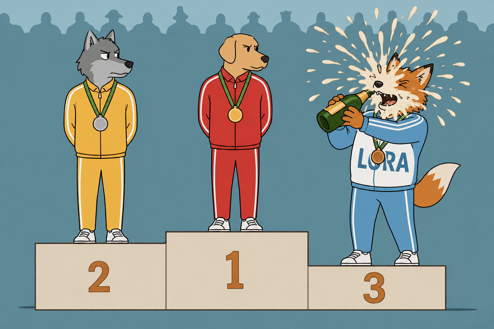
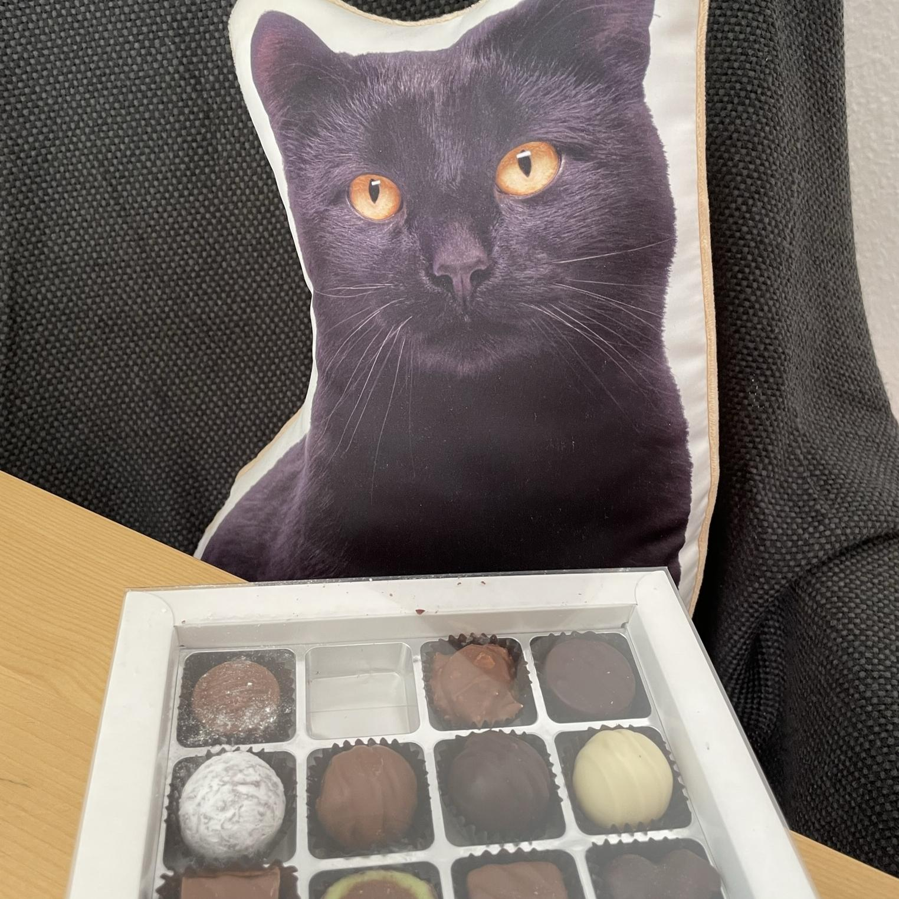
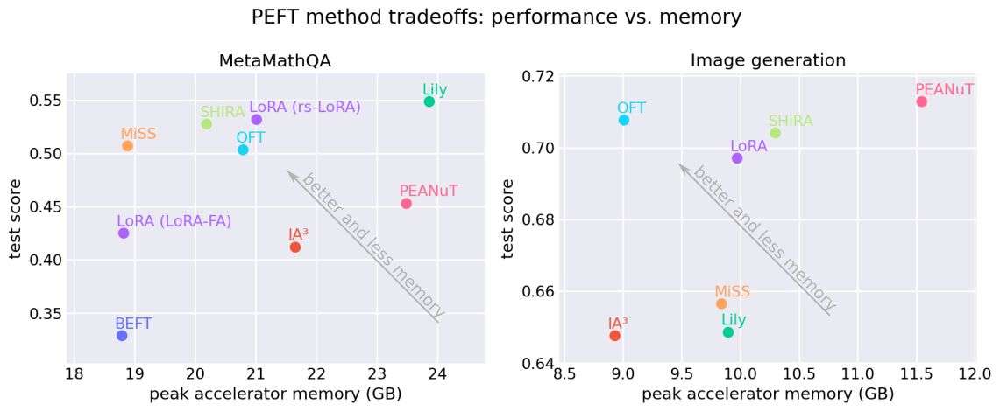
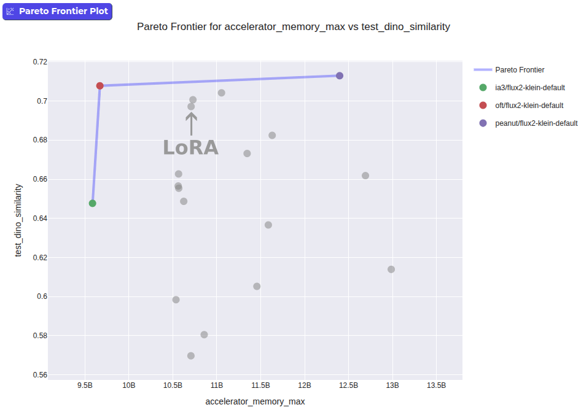

---
authors:
- aitoboxrobot
categories:
- 研究解读
date: 2026-08-07
hide:
- navigation
tags:
- PEFT
- LoRA
- 微调
- Hugging Face
- 模型优化
title: 超越LoRA：你能打败最流行的微调技术吗？
---
### 文章背景与核心概要
虽然LoRA（低秩适应，Low-Rank Adaptation）已成为参数高效微调（PEFT）的行业标准，但它的主导地位很大程度上归因于其早期采用和广泛的生态系统支持，而非绝对的性能优势。本文探讨了当我们默认使用LoRA时，是否在不知不觉中牺牲了更好的性能。通过利用Hugging Face的`PEFT`库进行客观、跨技术的基准测试，作者证明了尽管LoRA是一个强有力的竞争者，但其他方法（如OFT）在内存效率和特定任务准确性方面可以提供更好的权衡。

本文深入剖析了微调技术选择的现状，指出了基于单篇论文结果选择PEFT技术的局限性，并分享了Hugging Face团队在统一标准下进行公平基准测试的发现。最后，文章展示了如何在实际代码中仅需修改几行配置，即可轻松从LoRA切换到其他更具优势的PEFT方法。

---



## When you plan to fine-tune a model in a parameter-efficient way, think beyond LoRA

当你计划以参数高效的方式微调一个模型时，请跳出LoRA的思维框框

> 如果你想在自己的数据上微调一个开源模型，你可能对所谓的参数高效微调（简称 *PEFT*）感兴趣。这个术语描述了一类显著降低模型微调内存需求的红利技术。尽管这类技术有几十种，但几乎每个人都会选择一种名为“LoRA”的方法。在这篇博客文章中，我们探讨了LoRA是否真的是最佳选择，有哪些工具可以帮助你做出明智的决定，以及如何通过将眼光超越LoRA来获得收益。

## What is PEFT and when do you need it

什么是PEFT以及你什么时候需要它

> 市面上有无数的开源模型，但它们往往无法完美契合你的具体用例。提示词工程（Prompting）可能会有所帮助，但通常还不够。与其从头开始训练一个新模型，不如考虑微调现有的模型。
> 
> 然而，微调是一个“内存吞噬者”：你通常需要足够的内存来同时容纳整个模型的多个副本。量化（Quantization）减少了模型的内存占用，但量化后的模型无法直接进行微调。因此，出现了一套旨在削减微调所需内存的技术，被称为“参数高效微调”（Parameter-Efficient Fine-Tuning），简称PEFT。
> 
> 通过PEFT，你只需消耗一小部分内存就能微调模型，甚至还能微调量化后的模型。它还具有其他优势，例如极小的检查点（checkpoint）体积、对灾难性遗忘的更高抵抗力，以及能够从同一个基础模型提供多个微调版本的服务能力。
> 
> 在Hugging Face，我们开发了 [`PEFT` 库](https://github.com/huggingface/peft)，它在一个统一的API背后实现了许多PEFT技术，并与生态系统（例如 [`Transformers`](https://huggingface.co/docs/transformers/main/en/peft) 和 [`Diffusers`](https://huggingface.co/docs/diffusers/main/en/api/loaders/peft)）深度集成。它还支持[多种量化方法](https://huggingface.co/docs/peft/developer_guides/quantization)，进一步提升了参数高效微调的可访问性。无论你是想在自己的数据上进行微调，还是在研究一种新的PEFT方法，`PEFT` 都为你提供了一个良好的起点。

## LoRA: The queen of fine-tuning techniques 👑

LoRA：微调技术中的女王 👑

> 早期涌现出的一种参数高效微调技术被证明相当有效，它被称为“低秩适应”（Low Rank Adaptation），简称 [“LoRA”](https://huggingface.co/papers/2106.09685)。它的工作原理是在基础模型之上添加少量参数，冻结基础模型权重，并仅训练这少量的参数。
> 
> 在所有PEFT技术中，LoRA是迄今为止最受欢迎的。以下是一些数据估计：
> 
> *   在抽样的 20,834 个提及且仅提及一种PEFT技术的 [Hugging Face Hub 模型卡](https://huggingface.co/datasets/librarian-bots/model_cards_with_metadata) 中，有 20,509 个提到了LoRA（占比 98.4%）。
> *   我们还在一个外部网站上检查了图像生成领域中受欢迎的PEFT技术。通过对 10,000 个检查点的样本进行分析，我们发现其中 7,111 个是 LoRA。其他被识别的PEFT技术包括 LoCon（363）和 DoRA（11，本质上是 LoRA 的一个变体）。这意味着 95.0% 的 PEFT 检查点都是 LoRA。
> *   在 GitHub 上搜索代码片段 `from peft import <PEFT CONFIG>`（[示例 GH 查询](https://github.com/search?q=%22from+peft+import+LoraConfig%22&type=code)）时，71.3% 的结果是针对 LoRA 的。紧随其后的是 LoHa（3.7%）和 AdaLoRA（3.5%）。
> 
> 尽管这些估算并非完美无缺，但结论依然是：LoRA 几乎可以说是目前最常见的 PEFT 技术。
> 
> 这可能只是意味着 LoRA 对所有人来说都效果最好，而这一事实反映在其使用统计数据中。然而，还有另一种可能性：LoRA 是较早流行起来的 PEFT 技术之一。因此，它的使用可能产生了自我强化的效果：LoRA 拥有最高的知名度、最多的教程/示例，并且在下游包中获得了最好的支持。因此，LoRA 的流行形成了自我循环。
> 
> 这一切引发了一个问题：*我们是否因为排斥更好的技术而在性能上做出了妥协？* 毕竟，有无数研究人员的论文宣称他们的技术击败了LoRA。这难道不足以证明我们应该超越LoRA，转而支持更新的技术吗？

## Choosing the right PEFT technique based on paper results is problematic

根据论文结果选择正确的PEFT技术存在问题

> 有数十篇论文研究了除LoRA之外的微调技术。仅在 `PEFT` 库中，在撰写本文时就有超过 40 种不同的 PEFT 技术。对于其中几乎所有的技术，你都能找到研究人员声称他们的技术根据其基准测试击败了LoRA。
> 
> 这些说辞的问题在于，研究人员面临着必须产出超越现有基准结果的压力。即使没有恶意，这也可能会使结果产生偏差，例如，与研究人员提出的技术相比，他们花在调整替代技术上的时间更少。[一项研究](https://arxiv.org/abs/2602.04998) 发现，例如，通过仔细调整学习率，LoRA 完全可以匹配那些宣称更优的 PEFT 技术。

## How we approach benchmarking in `PEFT`

我们如何在 `PEFT` 中进行基准测试

> 在 Hugging Face，我们思考了如何帮助用户就使用哪种 PEFT 技术做出明智的决策。我们实施了基准测试，在完全相同的条件下评估各项技术：相同的基准模型、相同的数据集、相同的训练/评估代码以及相同的硬件。

<table align="center">
<tbody><tr>
<td></td>
<td></td>
</tr>
<tr>
<td align="center" colspan="2"><em>左图：MetaMathQA 数据集中的示例问题与答案。右图：猫毛绒玩具数据集中的示例图像。</em></td>
</tr>
</tbody></table>

## Our findings: LoRA works well but is not necessarily the best choice

我们的发现：LoRA 效果很好，但未必是最佳选择

> 在完成基准测试运行后，我们发现虽然 LoRA 运行良好，但其他 PEFT 方法可以在一个或多个维度上超越它。

<table align="center">
<tbody><tr>
<td align="center"></td>
</tr>
<tr>
<td align="center"><em>基准测试的一些结果。在测试性能和内存使用方面，LoRA 不一定是最佳选择。左侧：MetaMathQA 基准测试；右侧：图像生成基准测试。请查阅此 <a href="https://huggingface.co/spaces/peft-internal-testing/PEFT-method-comparison">Space</a> 以获取最新结果。</em></td>
</tr>
</tbody></table>

> 对于图像生成任务，我们发现诸如 **OFT** 之类的技术可以在严格意义上主导 LoRA，在消耗更低内存的同时提供更好的相似度得分。

<table align="center">
<tbody><tr>
<td align="center"></td>
</tr>
<tr>
<td align="center"><em>微调 <code>FLUX.2-klein-base-4B</code> 并将其在测试集上评估的测试准确率与内存使用权衡。其他 PEFT 技术（如 OFT）在测试得分和更低的内存使用方面击败了 LoRA。</em></td>
</tr>
</tbody></table>

## Limitations

局限性

> 对 `PEFT` 基准测试可能提出的一种批评是，超参数的选择可能会偏袒某种技术而牺牲另一种技术。然而，每个人都可以非常轻松地将自己的实验贡献给 `PEFT`。如果你认为某项特定的 PEFT 技术可以改进，[请创建 PR](https://github.com/huggingface/peft/tree/main/method_comparison#creating-new-experiments)！

## Conclusion and what *you* can do

结论以及*你能*做些什么

> 如果你从本文中只能带走一个观点，那就是在选择 PEFT 技术时，LoRA 不应成为自动默认的选项。鉴于 `PEFT` 提供了统一的 API，从一种 PEFT 技术切换到另一种技术就像在代码中切换一个配置一样简单。
> 
> **示例：使用 `PEFT` 从 LoRA 切换到 OFT：**

```diff
from transformers import AutoModelForCausalLM
-from peft import LoraConfig, get_peft_model
+from peft import OFTConfig, get_peft_model

base_model = AutoModelForCausalLM.from_pretrained("meta-llama/Llama-3.2-3B", dtype="bfloat16")
-config = LoraConfig(target_modules=["q_proj", "v_proj"])
+config = OFTConfig(target_modules=["q_proj", "v_proj"])
model = get_peft_model(base_model, config)
```