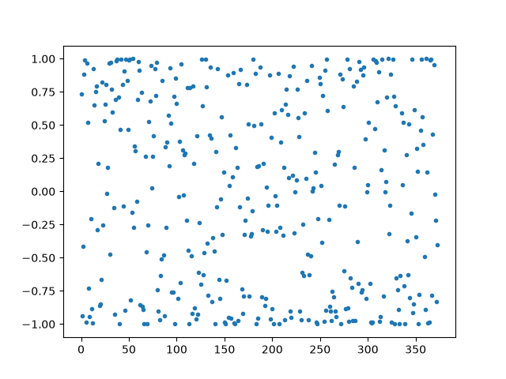

---
authors:
- aitoboxrobot
categories:
- 研究解读
date: 2026-08-08
hide:
- navigation
tags:
- 数学
- 浮点数
- 精度
- Python
- 三角函数
title: cos(200!) 的计算奥秘：为什么大数的三角函数需要高精度算术
---
### 文章背景与核心概要
在处理极其庞大的数字时，例如阶乘 $200!$，Python 的数学库可以仅通过最高有效数字轻松计算出其对数。然而，计算余弦（cosine）则有着根本的不同。因为 $\cos(n)$ 的结果完全取决于 $n \pmod{2\pi}$，这意味着 $n$ 的每一个单独数字都至关重要。

本文探讨了为什么微调超大整数的任意一位数字都会导致其余弦值跃变到一个完全全新且不可预测的值。通过具体的数学推导和图形展示，文章揭示了计算天文数字般的三角函数为何必须依赖扩展精度算术（extended precision arithmetic），并指出了范围约减算法在其中的局限性与必要性。

---

## 大数的对数
## The Logarithm of Large Numbers

在[先前一篇文章](https://www.johndcook.com/blog/2026/08/06/log1000/)的脚注中，我曾指出 Python 的数学库可以计算极大数字的对数，但无法计算其余弦值。本文将进一步展开对这一观测结果的讨论。

> In a footnote to a [previous post](https://www.johndcook.com/blog/2026/08/06/log1000/), I noted that Python’s math library can calculate the logarithm of extremely large numbers, but not the cosine. This post expands on that observation.

在此，我们以 $n = 200!$ 作为示例，而不是 $1000!$。这个 $n$ 值比可表示的最大浮点数还要大，但又足够小，便于进行实际操作。

> Here, let $n = 200!$ as our example rather than $1000!$. This value of $n$ is larger than the largest representable floating-point number, but small enough to be convenient to work with.

假设有人为你计算出了 $200!$ 的值：

> Suppose someone calculates $200!$ for you:

```text
78865786736479050355236321393218506229513597768717326329474253324435\
94499634033429203042840119846239041772121389196388302576427902426371\
05061926624952829931113462857270763317237396988943922445621451664240\
25403329186413122742829485327752424240757390324032125740557956866022\
60319041703240623517008587961789222227896237038973747200000000000000\
00000000000000000000000000000000000
```

你现在可以使用科学计数法来计算 $\log(n)$：

> You could now calculate $\log(n)$ using scientific notation:

$$n = 7.886578673647905 \times 10^{374}$$

因此：

> And so:

$$\log(n) = \log(7.886578673647905 \times 10^{374})$$
$$\log(n) = \log(7.886578673647905) + 374 \log(10) = 863.2319871924055$$

使这一切成为可能的核心在于：$n$ 的最低有效数字只会影响 $\log(n)$ 的最低有效数字。在上述计算中，保留 $n$ 的前 16 位数字就足够了；Python 不需要（也无法利用）更多的数字来计算出达到机器精度的对数。

> The key thing that makes this possible is that the least significant digits of $n$ only affect the least significant digits of $\log(n)$. In the calculation above, keeping the first 16 digits of $n$ was sufficient; Python couldn't make use of (nor did it need) any more digits to produce the logarithm to machine precision.

---

## 为什么余弦函数截然不同
## Why Cosine is Different

余弦函数并非如此运作。$n$ 的余弦值取决于 $n$ 除以 $2\pi$ 的余数，而该余数取决于 $n$ 的**每一个数字**。

> Cosine does not work that way. The cosine of $n$ depends on the remainder when $n$ is divided by $2\pi$, and that remainder depends on **every single digit** of $n$. 

使用 `bc -l` 并将精度（scale）设置为 400，我们可以计算 $n$ 并随后计算：

> Using `bc -l` and setting the scale to 400, we can calculate $n$ and then compute:

$$\cos(n + 10^i)$$

其中 $i$ 从 $0$ 到 $374$ 变化，每次对一个数字进行微调（当数字为 $9$ 导致加法产生进位的情况除外）：

> for $i$ running from $0$ to $374$, tweaking each digit one at a time (except when a digit is a $9$ and the addition results in a carry):

```text
    n = 1
    for (i = 1; i <= 200; i++) n *= i
    scale = 400
    for (i = 1; i <= 374; i++) {
        x = c(n+10^i)
        scale = 16
        print x/1, "\n"
        scale = 400
    }
```

以下是计算结果的绘图：

> Here is what a plot of the results looks like:



$\cos(n)$ 的真实值大约是 $-0.985$，但上述受扰动的值散布在整个取值范围内。我们可以通过将所有点投影到左边缘然后将其旋转四分之一圈，来更清晰地可视化取值范围：

> The true value of $\cos(n)$ is about $-0.985$, but the perturbed values above are scattered all over the map. We can visualize the range more clearly by projecting all the points over to the left edge and then rotating them a quarter turn:


这张图片引人注目的一点是，其中存在清晰可见的间隙——这意味着某些特定的数值是余弦值**根本不会**取到的。

> The remarkable thing about this image is that there are visible gaps—meaning there are a few specific values that the cosine simply *does not* take on.

---

## 结论
## Conclusion

从更高级的视角来看：序列 $10^i \pmod{2\pi}$ 在 $[0, 2\pi]$ 中是稠密的。因此，通过在序列中取足够远的值，我们可以找到一个数值，它能将 $n$ 的相位在任意给定容差内按任意期望的量进行偏移。

> Here is a more sophisticated way to look at it: the sequence $10^i \pmod{2\pi}$ is dense in $[0, 2\pi]$. Therefore, by going far enough out in the sequence, we can find a value that shifts the phase of $n$ by any desired amount within any given tolerance.

$n$ 中的每一个数字都很重要，改变任何一个数字都可以将余弦值推移到基本上任意数值。不使用某种形式的扩展精度算术，就无法计算出庞大数字的余弦值。虽然巧妙的范围约减算法可以最大限度地减少所需的扩展算术量，但它无法被完全消除。

> Every digit in $n$ matters, and changing any digit can shift the cosine to essentially any value. You cannot calculate the cosine of an enormous number without using some kind of extended precision arithmetic. While clever range reduction algorithms can minimize the amount of extended arithmetic necessary, it cannot be completely eliminated.

***

*原文 [cos(200!)](https://www.johndcook.com/blog/2026/08/07/cos200/) 首发于 [John D. Cook](https://www.johndcook.com/blog)。*

> *The post [cos(200!)](https://www.johndcook.com/blog/2026/08/07/cos200/) first appeared on [John D. Cook](https://www.johndcook.com/blog).*
