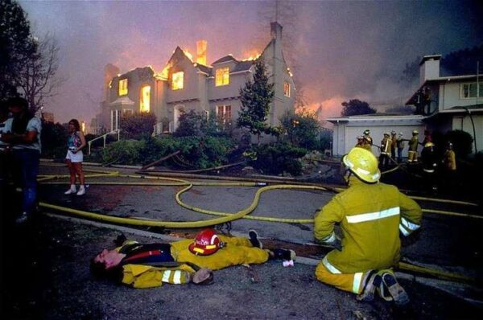
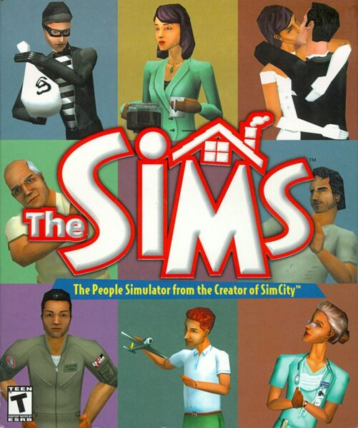
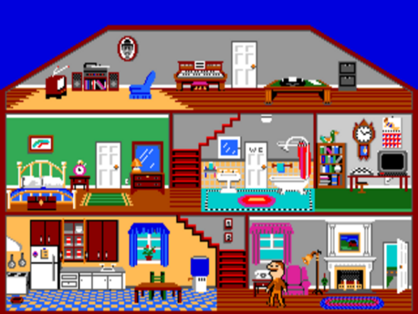
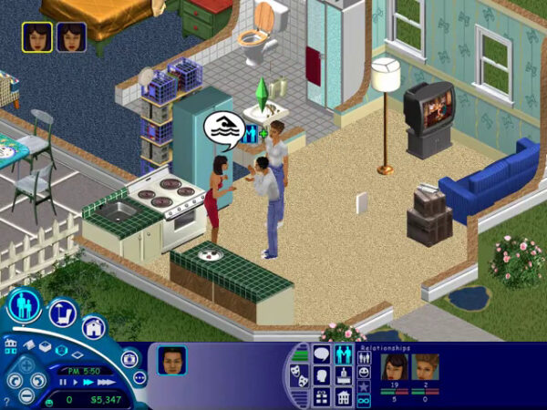
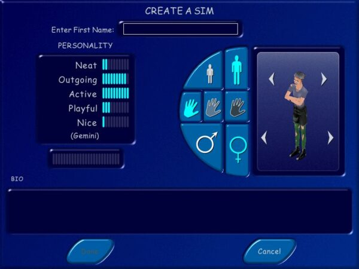
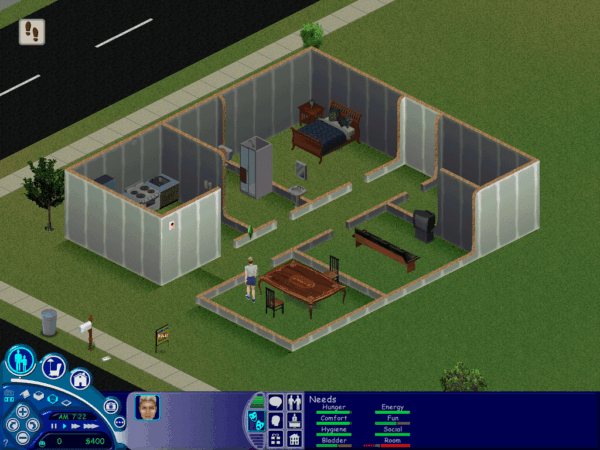
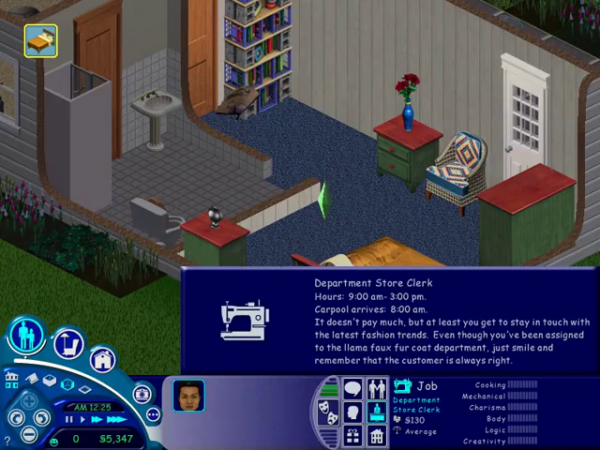
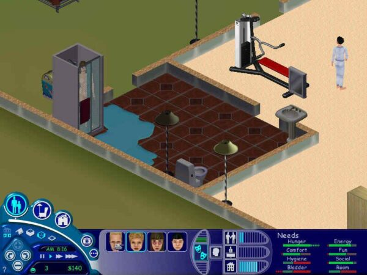
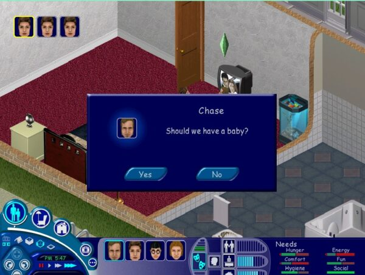

---
authors:
- aitoboxrobot
categories:
- 研究解读
date: 2026-08-09
hide:
- navigation
tags:
- Maxis
- 模拟人生
- Will Wright
- 游戏历史
- 经典回顾
title: Maxis 的生平与时代，第三部分：《模拟人生》
---
### 文章背景与核心概要
本文是《Maxis 的生平与时代》系列文章的第三部分，深入探讨了《模拟人生》（The Sims）这款历史上最畅销的盒装电脑游戏的诞生、演变及其深远文化影响。游戏的灵感源于创始人威尔·莱特（Will Wright）在 1991 年奥克兰大火中遭遇的悲剧。历经八年半的打磨，这款游戏从最初受克里斯托弗·亚历山大（Christopher Alexander）著作《建筑模式语言》启发、偏向建筑设计的玩具（《玩偶之家》），演变成为了对人类需求与行为前所未有的宏大模拟。

在 Maxis 多元化团队的共同努力下，并在电子艺界（Electronic Arts）及管理者吕克·巴尔泰莱（Luc Barthelet）的大力推动下，《模拟人生》打破了行业原有的条条框框。它通过资料片开创了“游戏即服务”（games-as-a-service）的商业模式，将大众玩家引入电子游戏领域，使同性恋关系在主流文化中得到正常化认可，并巩固了威尔·莱特作为历史上最具创新精神的玩具制造者和设计大师之一的不朽传奇。

---

> *"I don’t think people realize how much tactical and strategic forethought goes into their daily lives. There’s a whole subconscious time-efficiency layer in our lives. In essence, real-time strategy is our lives."*
> 
> — **Will Wright**

> *“我觉得人们并没有意识到，他们的日常生活投入了多少战术和战略上的深谋远虑。在我们的生活中，存在着一整层潜意识的时间效率机制。从本质上讲，即时战略就是我们的人生。”*
> 
> — **威尔·莱特（Will Wright）**

---

## Executive Summary
## 执行摘要

Part 3 of **The Life and Times of Maxis** explores the creation, evolution, and cultural impact of *The Sims*, the best-selling line of boxed computer games in history. Triggered by Will Wright's brush with tragedy during the Oakland Firestorm of 1991, the game evolved over eight and a half years from an architectural design toy (*Dollhouse*) inspired by Christopher Alexander’s *A Pattern Language* into an unprecedented simulation of human needs and behaviors. 

> 《Maxis 的生平与时代》第三部分探讨了《模拟人生》（The Sims）的创作、演变及其文化影响，该系列是史上最畅销的盒装电脑游戏。受威尔·莱特在 1991 年奥克兰大火中死里逃生的悲剧启发，这款游戏历经八年半的演变，从一个受克里斯托弗·亚历山大（Christopher Alexander）的《建筑模式语言》（*A Pattern Language*）启发的建筑设计玩具（《玩偶之家》），最终变成了一个对人类需求与行为进行空前模拟的游戏。

Shaped by a diverse team at Maxis—and later supercharged by Electronic Arts and manager Luc Barthelet—*The Sims* broke industry molds. It pioneered the "games-as-a-service" model via expansion packs, introduced mainstream audiences to video games, normalized same-sex relationships, and cemented Will Wright's legacy as one of the most innovative toy-makers and designers in history.

> 在 Maxis 多元化团队的塑造下——后来又得到了电子艺界（Electronic Arts）及其管理者吕克·巴尔泰莱（Luc Barthelet）的大力加持——《模拟人生》打破了行业的陈规。它通过资料片开创了“游戏即服务”（games-as-a-service）模式，将大众玩家引入了电子游戏世界，使同性恋关系趋于日常化，并巩固了威尔·莱特作为历史上最具创新精神的玩具制造商和设计大师之一的传奇地位。

---

## From the Ashes of Oakland
## 战后奥克兰的废墟

On the morning of October 19, 1991, two weeks after finishing *SimAnt*, Will Wright awoke to the smell of smoke in the Oakland Hills. Within hours, a rapidly advancing grass fire forced Wright, his wife Joell, and their five-year-old daughter Cassidy to flee for their lives. They narrowly escaped the disaster that would become known as the **Oakland Firestorm of 1991**.

> 1991 年 10 月 19 日清晨，在完成《模拟蚂蚁》（*SimAnt*）两周后，威尔·莱特在奥克兰山（Oakland Hills）浓烟的气味中醒来。几个小时内，迅速蔓延的草地大火迫使莱特、他的妻子乔尔（Joell）以及他们五岁的女儿卡西迪（Cassidy）仓皇逃生。他们险些未能逃脱那场后来被称为“1991年奥克兰大火”的灾难。

Returning a week later to the charred remnants of his home, Wright found his material possessions entirely destroyed—yet he felt a strange sense of liberation. Stripped to bare essentials, he began to view his life from a macro perspective:

> 一周后，当他回到被烧焦的家园废墟时，莱特发现自己的物质财产全数化为灰烬——但他却感到了一种奇怪的解放感。在被剥夺至仅剩最基本的生活必需品后，他开始从宏观视角审视自己的人生：

> *"What is life made of? Rarely do you do that in your real life. When something like this happens you get a big picture. Where do I want to live? What sort of things do I need to buy? You see your life almost as a project in process..."*

> *“生活是由什么构成的？你在现实生活中很少会去思考这个问题。当这样的事情发生时，你会对全局有一个宏观的认识。我想住在哪里？我需要买什么样的东西？你几乎把自己的生活看作是一个正在进行中的项目……”*

A systems thinker at heart, Wright wondered if there was a simulation lurking in the process of assembling the material components of day-to-day life from scratch. Back at Maxis, he began asking whether he could simulate the spaces and clutter of individual lives, just as he had simulated cities (*SimCity*), planets (*SimEarth*), and ant colonies (*SimAnt*). 

> 骨子里是个系统思考者的莱特开始琢磨，从零开始拼凑日常生活的物质组件这一过程背后，是否潜藏着某种可以被模拟的机制。回到 Maxis 后，他开始思考自己是否能够模拟个人生活的空间和杂物，就像他曾经模拟城市（《模拟城市》）、星球（《模拟地球》）和蚂蚁群（《模拟蚂蚁》）那样。

It would take him eight and a half years to answer that question with *The Sims*.

> 他花了八年半的时间，用《模拟人生》回答了这个问题。

---

## The Evolution of *Dollhouse*
## 《玩偶之家》的演变

The creation of *The Sims* is often mythologized as a lone genius battling corporate suits for a decade. In reality, the project evolved organically and accidentally over years, shifting focus radically from architecture to human behavior.

> 《模拟人生》的诞生常常被神话为一个孤独的天才与公司高管斗争十年的传奇。而在现实中，这个项目在数年间是通过有机且偶然的方式发展起来的，其核心焦点也从建筑发生了根本性的转变，转向了人类行为。

### Architecture as the Star: *Dollhouse*
### 以建筑为主角：《玩偶之家》

Initially, Wright called his concept ***Dollhouse***. He had grown enamored with *A Pattern Language* (1977) by Christopher Alexander, an architectural book focused on arranging living spaces (*feng shui* style) to bring harmony and peace. 

> 最初，莱特将这个概念命名为《玩偶之家》（*Dollhouse*）。他迷上了克里斯托弗·亚历山大（Christopher Alexander）于 1977 年出版的《建筑模式语言》（*A Pattern Language*），这是一本专注于通过布置生活空间（带有风水风格）来带来和谐与平静的建筑学著作。

In early concepts, the "dolls" were merely supporting actors designed to test and score how well the player’s architectural layouts conformed to Alexander's theories. However, when presented to a focus group of self-identified gamers in 1992, the reaction was unmitigated hostility: *"This was probably the most negative focus-group experience I have ever seen,"* Wright recalled.

> 在早期的概念中，“玩偶”仅仅是配角，旨在测试并给玩家的建筑布局符合亚历山大理论的程度进行打分。然而，当在 1992 年向自认为游戏玩家的焦点小组展示这一概念时，得到的反应却是彻头彻尾的敌意：“这可能是我见过的最糟糕的焦点小组体验，”莱特回忆道。

### Shifting Focus to the People
### 将焦点转向人类

After diversions working on *SimCity 2000* and *SimTower*-inspired concepts, Wright brought on a young Stanford graduate named Jamie Doornbos in 1995 to help program the dolls' behaviors. 

> 在经历了一段转向《模拟城市 2000》以及受《模拟大楼》（SimTower）启发概念的工作之后，莱特在 1995 年招募了一位名叫杰米·多恩博斯（Jamie Doornbos）的年轻斯坦福毕业生，来帮助编写玩偶行为的程序。

As Doornbos and Wright spent a year and a half refining the behavior model, they discovered that controlling the lives of the little people was far more compelling than designing their houses. The project inverted its hierarchy: **the dolls became the stars, and their houses became supporting players.**

> 正当多恩博斯和莱特花了一年半时间完善行为模型时，他们发现，控制这些小人的生活比设计他们的房子要吸引人得多。项目的层级结构发生了颠倒：**玩偶成了主角，而他们的房子则变成了配角。**

In doing so, the project began to resemble an obscure 1985 Activision title called ***Little Computer People***, designed by Rich Gold and programmed by David Crane. While *Little Computer People* featured a unique man living on a Commodore 64 floppy disk with a distinct personality, Wright’s project leveraged modern 32-bit machines to execute a vastly deeper simulation.

> 这样做让该项目开始类似于动视（Activision）在 1985 年推出的一款冷门游戏——由里奇·戈德（Rich Gold）设计、大卫·克兰（David Crane）编程的《小电脑人》（*Little Computer People*）。尽管《小电脑人》具备独特个性，且生活在 Commodore 64 软盘上，但莱特的项目则利用了现代 32 位机器来执行更深层次的模拟。

*Little Computer People (1985)*
*《小电脑人》（1985年）*

---

## SimAntics and Maslow’s Hierarchy
## SimAntics 模拟与马斯洛需求层次

Under the codename **Project X**, Wright and Doornbos strove to simulate psychologist Abraham Maslow’s **Hierarchy of Needs**. Chaim Gingold, in his 2024 book *Building SimCity*, detailed how Wright crafted a simulation of a person’s basic needs (hunger, bladder, comfort):

> 在代号为“X项目”（Project X）的研发下，莱特和多恩博斯努力模拟心理学家亚伯拉罕·马斯洛（Abraham Maslow）的“需求层次理论”（Hierarchy of Needs）。海姆·金戈尔德（Chaim Gingold）在其 2024 年出版的《构建模拟城市》（*Building SimCity*）一书中，详细描述了莱特如何打造人类基本需求（饥饿、膀胱、舒适度）的模拟机制：

> *"Objects broadcast advertisements that claimed to service a person’s changing motives. A toilet, for instance, would advertise its ability to relieve the bladder motive... intelligence emerged from the coupling between agent and environment."*

> *“物体会广播‘广告’，声称能够满足个人不断变化的动机。例如，马桶会宣传其缓解膀胱排泄动机的能力……智能正是从智能体与环境的耦合中涌现出来的。”*

This inverted approach—making the people simple and the objects smart—meant new objects could easily plug into the world without rewriting core algorithms. 

> 这种颠倒的方法——使人物变简单而让物体变得智能——意味着新物体可以轻松接入世界，而无需重写核心算法。

However, as Maxis faced financial strain, Wright was pulled away to work on *SimCopter* and proposed *Hindenburg* simulators. In June 1997, **Electronic Arts acquired Maxis**. 

> 然而，正当 Maxis 面临财务压力时，莱特被抽调去开发《模拟直升机》（SimCopter）以及提议中的《兴登堡》模拟器。1997 年 6 月，**电子艺界（Electronic Arts）收购了 Maxis**。

While EA's new manager, Luc Barthelet, demanded top-tier commercial hits, he surprisingly recognized the massive potential of Project X. He allocated roughly half of Maxis’s resources to turn the research project into a proper mass-market product, officially rebranding it ***The Sims***.

> 尽管 EA 的新管理者吕克·巴尔泰莱（Luc Barthelet）要求推出顶级商业热门游戏，但他出人意料地认识到了 X 项目的巨大潜力。他将 Maxis 大约一半的资源分配给了这个研究项目，将其转变为一款适合大众市场的正规产品，并正式更名为《模拟人生》（*The Sims*）。

---

## Humanizing the Simulation
## 模拟的人性化

To transition Project X into a saleable game, a diverse team was brought aboard, including co-designers Claire Curtin and Roxana Wolosenko, and associate producer Chris Trottier. Their influence helped balance the male-dominated engineering culture and injected broad human appeal into the game.

> 为了将 X 项目转变为一款可售卖的游戏，公司引入了一个多元化的团队，包括联合设计师克莱尔·柯廷（Claire Curtin）和罗克珊娜·沃洛森科（Roxana Wolosenko），以及副制片人克里斯·特罗蒂尔（Chris Trottier）。他们的影响有助于平衡男性主导的工程文化，并为游戏注入了广泛的人性魅力。

### Building, Buying, and Living
### 建造、购买与生活

The core gameplay loop settled into three pillars: building a home, buying objects, and living out daily routines. Unlike traditional games, *The Sims* focused on mundane tasks: going to bed, washing dishes, watering plants, and managing bathroom urgency.

> 核心游戏循环确立为三个支柱：建造房屋、购买物品以及过好日常生活。与传统游戏不同，《模拟人生》专注于世俗琐事：上床睡觉、洗碗、浇花以及处理内急。

### Simlish and Hangout Culture
### 模拟语与聚会文化

To handle communication without repetitive voice acting, Maxis invented a nonsense language known as **Simlish**, performed by talented improv actors. 

> 为了在没有重复配音的情况下处理交流问题，Maxis 发明了一种被称为“模拟语”（Simlish）的无意义语言，由才华横溢的即兴表演演员来演绎。

Visually and aurally, *The Sims* rejected bombastic orchestral scores and hardcore sci-fi tropes in favor of breezy, melodic jazz (curated by Jerry Martin) and airbrushed, everyday aesthetics reminiscent of hangout TV shows like *Friends*. It was real life with the sharp edges sanded off—the world's first true "hangout game."

> 在视觉和听觉上，《模拟人生》摒弃了浮夸的管弦乐配乐和硬核科幻套路，取而代之的是轻快、旋律优美的爵士乐（由杰瑞·马丁精心策划）以及令人联想到《老友记》等聚会类电视剧的、经喷枪修饰的日常美学。这是磨平了棱角的现实生活——世界上第一款真正的“闲逛游戏”。

### Accidental Progress: Same-Sex Relationships
### 意外的进步：同性恋关系

*The Sims* made history by normalizing same-sex romantic relationships. This breakthrough happened almost by accident. Programmer Patrick J. Barrett III, unaware of a quiet management rule forbidding gay relationships, implemented planning document algorithms with equal weight for all characters. 

> 《模拟人生》通过使同性恋爱关系正常化而创造了历史。这一突破几乎是个意外。程序员帕特里克·J·巴雷特三世（Patrick J. Barrett III）并不知道一项禁止同性恋关系的内部管理规定，他在编写规划文档算法时，对所有角色给予了相同的权重。

Once in the game, the team lacked the heart to remove them. Barrett noted:
> 一旦进入游戏中，团队便不忍心将它们移除。巴雷特指出：

> *"At the time, it wasn’t considered 'normal' to be gay or lesbian... But in The Sims it was normal and safe to be a gay person. It was the first time we could play a game and be free to be ourselves within."*

> *“在当时，同性恋并不被认为是‘正常’的……但在《模拟人生》中，身为同性恋是正常且安全的。这是我们第一次能够玩一款游戏，并在其中自由地做真实的自己。”*

When *The Sims* debuted at E3 in May 1999—featuring a public onscreen kiss between two female Sims—it stole the show and generated massive mainstream buzz.

> 当《模拟人生》于 1999 年 5 月在 E3 展会上首次亮相时——其中包含两个女性模拟市民在屏幕上的公开亲吻——它惊艳全场，并在主流社会引发了巨大的轰动。

*Sims discussing swimming via Simlish speech bubbles.*
*模拟市民通过模拟语对话框讨论游泳。*

---

## Release and Unprecedented Success
## 发售与空前的成功

*The Sims* shipped in **February 2000** and immediately obliterated sales records. 

> 《模拟人生》于 **2000 年 2 月**正式发售，并迅速打破了销售纪录。

* It shifted 1 million units in its first few months.
* It surpassed *Myst* in 2002 to become the best-selling computer game of all time.
* By 2005, sales reached **16 million copies**, rivaling top-tier pop album sales.

> * 它在发售前几个月内售出了 100 万份。
> * 它在 2002 年超越了《神秘岛》（*Myst*），成为史上最畅销的电脑游戏。
> * 到 2005 年，销量达到了 **1600 万份**，足以媲美顶级流行专辑的销量。

### The Expansion Era and Games as a Service
### 资料片时代与游戏即服务

Maxis capitalized on Wright's modular vision by releasing a steady stream of themed expansion packs:

> Maxis 利用莱特的模块化愿景，通过源源不断地发布主题资料片来获取商业利益：

* 
  *Character Creation*
  *角色创建*
* 
  *House Building and Needs Management*
  *房屋建造与需求管理*
* 
  *Career Tracks and Capitalist Routine*
  *职业道路与资本主义日常*
* 
  *Consequences and Social Workers*
  *后果与社会工作者*
* 
  *Discreetly Blurred Censorship*
  *低调模糊的审查*
* 
  *Romance and Implied WooHoo*
  *浪漫与暗示性的嘿咻*

Along with *Hot Date*, *Vacation*, *Unleashed*, *Superstar*, and *Makin' Magic*, Maxis pioneered the modern "games-as-a-service" model, keeping the community alive with web content, custom mods, and serial-number-locked portals.

> 伴随着《模拟人生：约会派对》（Hot Date）、《度假胜地》（Vacation）、《宠物当家》（Unleashed）、《超级巨星》（Superstar）和《魔幻天地》（Makin' Magic），Maxis 开创了现代“游戏即服务”模式的先河，通过网络内容、自定义模组（mod）以及序列号锁定的门户网站，让社区保持着长久的生命力。

---

## Cultural Critique and Legacy
## 文化批判与遗产

While celebrated for bringing millions of non-gamers into the hobby, *The Sims* also drew sharp academic and journalistic critique. 

> 尽管《模拟人生》因将数百万非玩家带入游戏爱好领域而备受赞誉，但它也招致了激烈的学术界和新闻界批判。

Critics like Russell W. Belk pointed out that the game heavily reinforced 1950s suburban American bourgeois values: working hard, climbing a career ladder, buying consumer goods, and maintaining strict personal hygiene. It reduced human emotion and relationships to transactional numbers on a UI bar graph while entirely omitting deep spiritual, philosophical, or tragic elements of human existence.

> 以罗素·W·贝尔克（Russell W. Belk）为代表的批评家指出，这款游戏严重强化了 20世纪 50 年代美国郊区的资产阶级价值观：努力工作、晋升职业阶梯、购买消费品以及保持严格的个人卫生。它将人类的情感和人际关系简化为用户界面条形图上的交易数字，同时完全忽略了人类生存中深刻的精神、哲学或悲剧元素。

Yet, despite its limitations as a "minutiae simulator," its impact on the gaming industry is undeniable. Alongside early MMORPGs like *EverQuest*, *The Sims* proved that the most lucrative gaming markets lay far beyond the traditional hardcore demographic. 

> 然而，尽管作为一款“细碎事物模拟器”有其局限性，但它对游戏产业的影响是不可否认的。与《无尽的任务》（*EverQuest*）等早期大型多人在线角色扮演游戏（MMORPG）一样，《模拟人生》证明了最具利润的游戏市场远超传统的硬核玩家群体。

In transforming software toys into cultural mirrors, **Will Wright** fundamentally altered how humanity plays, cementing his status as one of the most successful and important figures in interactive entertainment history.

> 通过将软件玩具转变为文化的镜子，**威尔·莱特**根本性地改变了人类的游戏方式，巩固了他作为互动娱乐历史上最成功、最重要的巨匠之一的地位。

---

## Sources
## 数据来源

* **Books:** 
  * *Games That Sell!* by Mark H. Walker
  * *Building SimCity: How to Put the World in a Machine* by Chaim Gingold
  * *Game Design Theory & Practice* (2nd ed.) by Richard Rouse III
  * *Time, Space, and the Market: Retroscapes Rising*, edited by Stephen Brown and John F. Sherry Jr.
  * *A Pattern Language: Towns, Buildings, Construction* by Christopher Alexander et al.
* **Periodicals:** 
  * *Computer Gaming World* (May 2000)
  * *Retro Gamer* (Issue 115)
* **Online Articles:** 
  * *Gamasutra:* Tristan Donovan’s interview with Will Wright
  * *GameSpot:* “SIMply Divine: The Story of Maxis Software” by Geoff Keighley
  * *Berkeleyside:* “Will Wright Inspired to Make The Sims After Losing a Home” by Tracey Taylor
  * *The New Yorker:* “The Kiss That Changed Video Games” by Simon Parkin
  * *Vice:* “The Untold Story of The Sims, Your First Favorite Jazz Record” by Alex Robert Ross
  * *CNN:* Online chat with Will Wright (January 20, 2000)

> * **书籍：**
>   * 马克·H·沃克（Mark H. Walker）的《大卖游戏！》（*Games That Sell!*）
>   * 海姆·金戈尔德（Chaim Gingold）的《构建模拟城市：如何将世界放入机器中》（*Building SimCity: How to Put the World in a Machine*）
>   * 理查德·劳斯三世（Richard Rouse III）的《游戏设计理论与实践》（*Game Design Theory & Practice*，第 2 版）
>   * 斯蒂芬·布朗（Stephen Brown）和约翰·F·谢里（John F. Sherry Jr.）编辑的《时间、空间与市场：复古景观的崛起》（*Time, Space, and the Market: Retroscapes Rising*）
>   * 克里斯托弗·亚历山大（Christopher Alexander）等人的《建筑模式语言：城镇、建筑、建造》（*A Pattern Language: Towns, Buildings, Construction*）
> * **期刊：**
>   * 《计算机游戏世界》（*Computer Gaming World*，2000年5月）
>   * 《复古玩家》（*Retro Gamer*，第 115 期）
> * **网络文章：**
>   * *Gamasutra:* 特里斯坦·多诺万（Tristan Donovan）对威尔·莱特的采访
>   * *GameSpot:* 杰夫·基利（Geoff Keighley）的“SIMply Divine: The Story of Maxis Software”
>   * *Berkeleyside:* 特雷西·泰勒（Tracey Taylor）的“Will Wright Inspired to Make The Sims After Losing a Home”
>   * *The New Yorker:* 西蒙·帕金（Simon Parkin）的“The Kiss That Changed Video Games”
>   * *Vice:* 亚历克斯·罗伯特·罗斯（Alex Robert Ross）的“The Untold Story of The Sims, Your First Favorite Jazz Record”
>   * *CNN:* 与威尔·莱特的在线聊天（2000年1月20日）

**Where to Get It:** *The Sims and all of its expansions can be purchased as a “Legacy Collection” on Steam.*

> **获取渠道：** *《模拟人生》及其所有资料片可以在 Steam 上作为“经典珍藏版”（Legacy Collection）购买。*