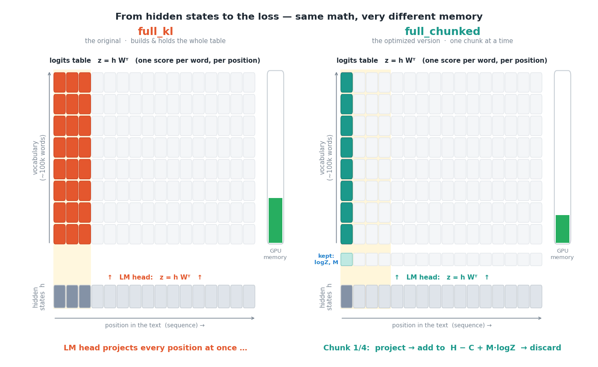
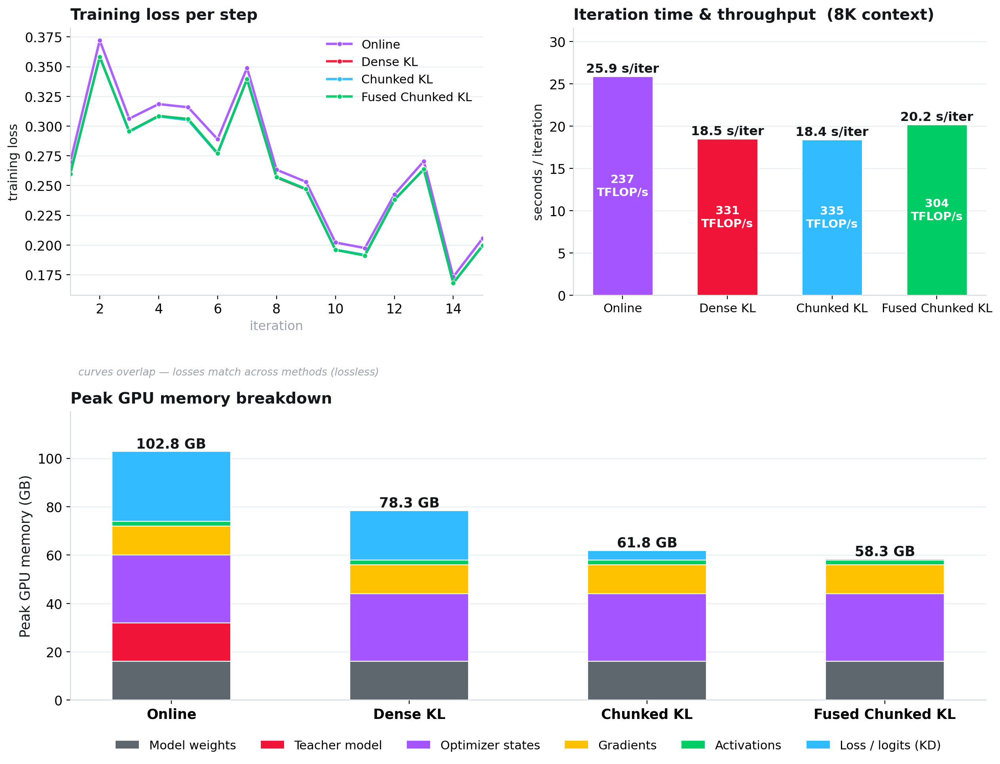
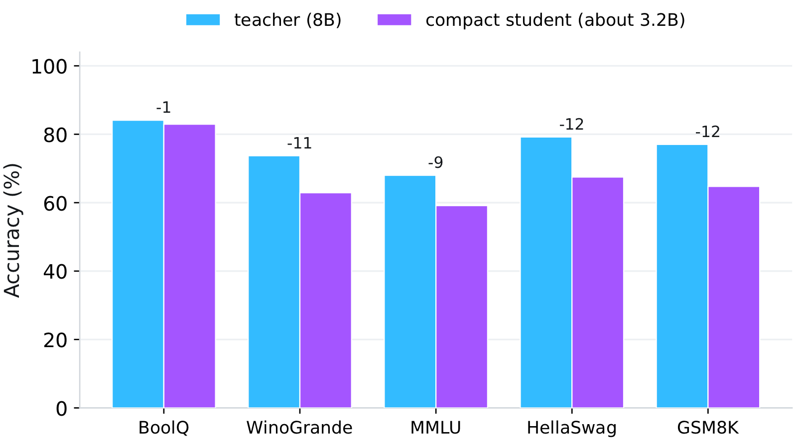

---
authors:
- aitoboxrobot
categories:
- 工具教程
date: 2026-08-11
hide:
- navigation
tags:
- 知识蒸馏
- 大语言模型
- 深度学习优化
- 显存优化
- 算法加速
title: 让知识蒸馏成本大幅降低以实现规模化运行
---
### 文章背景与核心概要
随着开源大语言模型（如 `gpt-oss`、`Qwen`、`GLM` 和 `Kimi`）的广泛普及，知识蒸馏（即训练一个较小的学生模型来模仿较大的教师模型）迎来了显著的复苏。然而，模型的部署和压缩需要消耗极高的资源。例如，拥有 2.8 万亿参数的 Kimi-K3 模型仅加载就需要大约 3TB 的显存（VRAM）。

尽管蒸馏决定了压缩模型的最终质量，但将教师模型和学生模型同时保留在显存中以计算整个词表上的概率分布，会带来巨大的硬件瓶颈。为了解决这一扩展难题，本文引入了两项关键的系统级改进：首先是**离线蒸馏**，通过预先缓存教师模型的 Top-$K$ 对数几率（logits），使教师模型在训练期间无需与学生模型共同驻留内存；其次是**融合分块 KL 损失**，这是一种内存高效的库尔贝克-莱布勒散度（Kullback-Leibler divergence）损失函数，避免了生成庞大的“全词表 × 序列长度”矩阵。

这两项优化结合起来，戏剧性地降低了显存需求，从而使得在单张 GPU 上进行长文本蒸馏成为可能，并让大规模实验变得切实可行。

---

## 为什么蒸馏恢复的成本如此昂贵
> ## Why Distillation Recovery is Expensive

标准的方法——使用 [KL 散度损失](https://docs.pytorch.org/docs/2.13/generated/torch.nn.KLDivLoss.html)的*在线（online）*蒸馏——要求同时将教师和学生模型保留在内存中。在每一步中，教师模型都要执行一次完整的前向传播，这需要消耗海量的显存来为每个 Token 位置保存两个完整的词表张量。

> The standard approach—*online* distillation using [KL divergence loss](https://docs.pytorch.org/docs/2.13/generated/torch.nn.KLDivLoss.html)—requires keeping both teacher and student models in memory simultaneously. At every step, the teacher performs a full forward pass, demanding enormous amounts of VRAM to hold two full-vocabulary tensors per token position.

例如，`gpt-oss-120b` 拥有 201,088 个 Token 的词表。在 32K 序列长度和批量大小为 4 的情况下，仅教师概率张量在 bfloat16 精度下就会占用大约 **50GB 的显存**。如果把梯度、激活值、模型权重和优化器状态考虑在内，单个训练迭代的显存占用可能会飙升至大约 **250GB**，这已经超出了现代 H200 或 B200 GPU 的容量。

> For example, `gpt-oss-120b` features a vocabulary of 201,088 tokens. At a 32K sequence length and a batch size of 4, the teacher-probability tensor alone takes up roughly **50GB of VRAM** in bfloat16. Factoring in gradients, activations, model weights, and optimizer states, a single training iteration can spike to roughly **250GB of VRAM**—exceeding the capacity of modern H200 or B200 GPUs. 

> *密集 KL 损失的显存尖峰达到了约 250GB，超出了单张 H200 的 141GB 容量。而融合分块损失绕过了这一尖峰，峰值约为 128GB。资料来源：论文图 1。*
> *Dense KL spikes to roughly 250GB, exceeding a single H200's 141GB capacity. The fused chunked loss bypasses this spike, peaking at about 128GB. Source: paper Figure 1.*

---

## 两项系统级变更
> ## Two Systems Changes

为了解决这一缩放瓶颈，作者引入了两项根本性的变更：

> To solve this scaling bottleneck, the authors introduce two fundamental changes:

### 1. 离线蒸馏
> ### 1. Offline Distillation

与在每一步都重新计算教师模型不同，其输出只需计算一次。模型会缓存每个位置概率最高的前 100 个 Token，并基于此缓存来训练学生模型。这样在训练期间就可以安全地将教师模型从内存中移除，并且该缓存可以在众多实验中重复使用。

> Rather than recomputing the teacher model at every single step, its output is computed once. The top-100 most likely tokens per position are cached, and the student is trained against this cache. The teacher can be safely removed from memory during training, and the cache can be reused across numerous experiments.

### 2. 融合分块 KL 损失
> ### 2. A Fused, Chunked KL Loss

传统的损失函数会一次性计算“序列位置对词表”的网格，在产生单个标量之前就会占用巨大的内存空间。该论文对比了三种数学上等价的实现方式：
* **密集 KL（Dense KL）：** 教科书式的基线方法。它从缓存的对数几率中重建一个密集的教师概率网格，并将其与学生的密集对数概率进行比较。它在内存中两次保存了完整的“词表 × 序列”网格。
* **前向分块 KL（Forward-chunked KL）：** 保持教师模型的稀疏性（仅使用缓存的前 100 个对数几率），并逐个序列切片进行处理。尽管速度显著加快，但它在反向传播时仍然会实例化学生的完整对数几率网格，导致内存随上下文长度呈陡峭上升趋势。
* **融合分块 KL（Fused chunked KL）：** 将模型的输出投影直接融合到损失计算中。它完全避免了生成学生的完整对数几率网格，端到端地按块处理序列、累加损失并立即丢弃已处理的块。此时的峰值内存消耗随序列长度线性增长，而不是随词表大小呈二次方膨胀。

该实现已在 [github.com/CompactifAI/Full-Chunked-KL-Loss](https://github.com/CompactifAI/Full-Chunked-KL-Loss) 上开源。

> Traditional loss functions calculate sequence-position vs. vocabulary grids all at once, creating an enormous memory footprint before producing a single scalar. The paper contrasts three mathematically equivalent implementations:
> * **Dense KL:** The textbook baseline approach. It rebuilds a dense teacher-probability grid from cached logits and compares it against the student's dense log-probabilities. It holds the full vocabulary × sequence grid twice in memory.
> * **Forward-chunked KL:** Keeps the teacher sparse (using only cached top-100 logits) and processes the sequence slice by slice. While significantly faster, it still materializes the student's full logit grid for the backward pass, causing memory to scale steeply with context length.
> * **Fused chunked KL:** Fuses the model's output projection directly into the loss computation. It avoids generating the student's full logit grid altogether, processing the sequence chunk-by-chunk end-to-end, accumulating the loss, and discarding chunks immediately. Peak memory consumption now grows linearly with sequence length instead of expanding quadratically with vocabulary size.
> 
> The implementation has been open-sourced at [github.com/CompactifAI/Full-Chunked-KL-Loss](https://github.com/CompactifAI/Full-Chunked-KL-Loss).

---

## 实践中的性能表现
> ## Performance in Practice

在单张 H200 GPU 上，使用 [Llama 3.1 8B Instruct](https://huggingface.co/meta-llama/Llama-3.1-8B-Instruct) 作为教师模型、3.2B Llama 作为学生模型、在 8K Token 上下文下对四种设置进行基准测试，结果显示它们的损失曲线几乎完全一致——这证明了使用前 100 个缓存对数几率的离线蒸馏相对于在线蒸馏是**无损的**。

> Benchmarking the four setups using [Llama 3.1 8B Instruct](https://huggingface.co/meta-llama/Llama-3.1-8B-Instruct) as a teacher and a 3.2B Llama student at an 8K token context on a single H200 GPU reveals near-identical loss curves—proving that offline distillation with top-100 cached logits is **lossless** relative to online distillation.

| 方法 (8K 上下文, 单 H200) | 峰值内存 | 迭代时间 | 吞吐量 |
| :--- | :--- | :--- | :--- |
| 在线蒸馏 | 102.8 GB | 25.9 s | 237 TFLOP/s |
| 离线，密集 KL | 78.3 GB | 18.5 s | 331 TFLOP/s |
| 离线，前向分块 KL | 61.8 GB | 18.4 s | 335 TFLOP/s |
| 离线，融合分块 KL | 58.3 GB | 20.2 s | 304 TFLOP/s |

> | Method (8K context, single H200) | Peak Memory | Iteration Time | Throughput |
> | :--- | :--- | :--- | :--- |
> | Online distillation | 102.8 GB | 25.9 s | 237 TFLOP/s |
> | Offline, dense KL | 78.3 GB | 18.5 s | 331 TFLOP/s |
> | Offline, forward-chunked KL | 61.8 GB | 18.4 s | 335 TFLOP/s |
> | Offline, fused chunked KL | 58.3 GB | 20.2 s | 304 TFLOP/s |

### 扩展至长文本上下文
> ### Scaling to Long Context Lengths

融合方法在规模化时的真正威力才得以显现：
* **在 32K Token 下：** 峰值内存从 **85.2 GiB**（密集损失）下降到 **5.45 GiB**（完全分块版本）——实现了 **15.6 倍的缩减**。（密集损失在 64K Token 及以上时直接崩溃无法运行）。
* **在 256K Token 下：** 完全分块的损失仅使用 **11.6 GiB** 的内存（相比之下其他分块变体需要 134.2 GiB），并且每个迭代的运行速度**快了约 3.3 倍**。
* **GPT-OSS 20B 蒸馏 (32K 上下文)：** 内存的减少使得硬件需求从 4 个 GPU 节点缩减到了单节点。单步时间从 57.0 秒加速到 12.23 秒（快了约 5 倍），吞吐量从 74.2 跃升至 345.7 TFLOP/s。

> The true power of the fused approach shines at scale:
> * **At 32K tokens:** Peak memory drops from **85.2 GiB** (dense loss) to **5.45 GiB** (fully chunked version)—a **15.6× reduction**. (The dense loss fails outright from 64K tokens onward).
> * **At 256K tokens:** The fully chunked loss uses only **11.6 GiB** (compared to 134.2 GiB for alternative chunked variants) and runs roughly **3.3× faster** per iteration.
> * **GPT-OSS 20B Distillation (32K context):** Memory reductions allowed hardware requirements to shrink from four GPU nodes down to a single node. Step time accelerated from 57.0s to 12.23s (~5× faster), and throughput surged from 74.2 to 345.7 TFLOP/s.

---

## 最终的学生模型性能
> ## The Resulting Student Performance

这种高效的离线方法使得大规模蒸馏活动变得异常平易近人。压缩后的学生模型（从 Llama 3.1 8B Instruct 蒸馏压缩至约 3.2B 参数）在 BoolQ、WinoGrande、MMLU、HellaSwag 和 GSM8K 等基准测试中保留了教师模型的大部分准确率，而其参数量却不到一半。

> This efficient offline methodology makes large-scale distillation campaigns remarkably accessible. The compressed student model (distilled from Llama 3.1 8B Instruct down to ~3.2B parameters) preserves the majority of the teacher's accuracy across benchmarks like BoolQ, WinoGrande, MMLU, HellaSwag, and GSM8K while operating at less than half the parameter count.

---

## 参考文献与延伸阅读
> ## References & Further Reading

* **研究论文：** [高效大模型知识蒸馏：离线 Top-K 对数几率与融合分块 KL 损失](https://arxiv.org/abs/2608.03796) *(Efficient Knowledge Distillation for LLMs: Offline Top-K Logits and a Fused Chunked KL Loss)*
* **代码库：** [CompactifAI/Full-Chunked-KL-Loss](https://github.com/CompactifAI/Full-Chunked-KL-Loss/tree/main)
* **组织机构：** [Multiverse Computing 研究院](https://multiversecomputing.com/compactifai)

> * **Research Paper:** [Efficient Knowledge Distillation for LLMs: Offline Top-K Logits and a Fused Chunked KL Loss](https://arxiv.org/abs/2608.03796)
> * **Code Repository:** [CompactifAI/Full-Chunked-KL-Loss](https://github.com/CompactifAI/Full-Chunked-KL-Loss/tree/main)
> * **Organization:** [Multiverse Computing Research](https://multiversecomputing.com/compactifai)