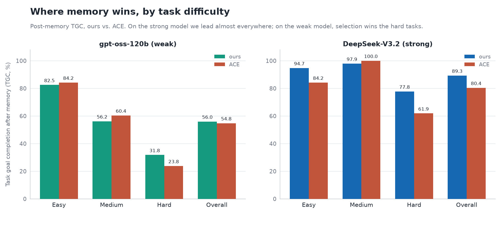

---
authors:
- aitoboxrobot
categories:
- arXiv论文
date: 2026-08-12
hide:
- navigation
tags:
- LLM代理
- 上下文工程
- Token优化
- AI研究
- ALTK-Evolve
title: 考虑使用 ACE？我们能用更少的 Token 实现它
---
### 文章背景与核心概要
本文对比了两种让大语言模型（LLM）代理从自身历史轨迹中学习的主流方法：**ACE**（Agentic Context Engineering）与 **ALTK-Evolve**。这两种系统都无需更新模型权重或人工标注，并均反对过早进行有损压缩，而是保留带有支持指标的具体记忆。然而，它们在**记忆的构建方式以及传递给模型的方式**上存在根本差异。

ACE 在每一步推理中都会注入庞大的完整剧本（Playbook），而 ALTK-Evolve 则采用经过校准的选择性投递策略。在 AppWorld 基准测试中，ALTK-Evolve 在消耗极少推理 Token 的情况下（强模型仅消耗约 40%，小模型仅消耗约 15%），实现了相当或更优的任务完成准确率。这表明，通过更智能的记忆检索与动态投递，我们完全能够以更低的成本解锁大模型代理的高级持续学习能力。

---

*ALKT-Evolve 和 ACE 都可以让代理从其自身的轨迹中学习。两者的区别在于它们如何处理所学到的知识——而这决定了 Token 的开销账单。*

> ALTK-Evolve and ACE both let an agent learn from its own trajectories. The difference is what they do with what they learn — and that decides the token bill.

给出一个现实的多步骤任务——拆分账单、寻找歌曲、在九个模拟应用程序之间对账订单——当 LLM 代理失败时，通常不是因为缺乏知识。它可能是错误地分页了 API、解析了错误的人员、或者在根本不需要返回值时返回了一个值。模型其实知道这些 API，但它没有内化的是*如何可靠地使用它们*。这些都是可以从代理自身的历史中学习的。

两个近期的系统针对同一种代理精准地实现了这一点：**[ACE](https://arxiv.org/abs/2510.04618)**（Agentic Context Engineering）以及我们的 **ALTK-Evolve**（**[在此处介绍](https://huggingface.co/blog/ibm-research/altk-evolve)**）。两者都是**代理记忆（agentic memory）**的一种形式——将代理过去的轨迹转化为可重用的**经验教训（lessons）**，并在推理时将其反馈回去，无需更新权重，也无需人工标注。它们甚至在最困难的部分达成了一致。分歧在于*投递（delivery）*。

顺便说明一下术语，因为这两个系统对事物的命名不同：我们将代理学到的原始事物称为**经验教训（lesson）**。ACE 将其经验教训组织为一个全面且不断演进的**剧本（playbook）**；我们将自己的经验教训合并为可单独检索的**准则（guidelines）**。同样的经验教训，两个不同的容器。

> Give an LLM agent a realistic multi-step task — split a bill, find a song, reconcile an order across nine simulated apps — and when it fails, it usually isn't for lack of knowledge. It mis-paginates an API, resolves the wrong person, or returns a value when none was asked for. The model knows the APIs; what it hasn't internalized is *how to use them reliably*. That's learnable from the agent's own history.
> 
> Two recent systems do exactly this, on the same kind of agent: **[ACE](https://arxiv.org/abs/2510.04618)** (Agentic Context Engineering) and our **ALTK-Evolve** ([introduced here](https://huggingface.co/blog/ibm-research/altk-evolve)). Both are a form of **agentic memory** — turning an agent's past trajectories into reusable **lessons** and feeding them back at inference time, no weight updates, no human labels. They even agree on the hard part. Where they part ways is *delivery*.
> 
> A note on words, because the two systems name things differently: we'll call the raw thing an agent learns a **lesson**. ACE organizes its lessons into one comprehensive, evolving **playbook**; we consolidate ours into individually retrievable **guidelines**. Same lessons, two containers.

---

## 我们的一致之处

## What We Agree On

这两个系统都拒绝压缩。

> Both systems refuse to compress.

ACE 精确指出了失败模式：**简洁偏见（brevity bias）**——优化过程收敛至简短、泛化的指令；以及**上下文崩溃（context collapse）**——当模型被要求在每一步重写其整个上下文时，细节会在总结中丢失。它的应对方法是保留一个内容丰富、逐条列出的剧本，并在每个要点上设置“有帮助/有害”的计数器，让模型在读取时提炼相关性。

我们从另一个方向得出了相同的结论。每个不同的准则都保留了一个**支持计数（support count）**——即有多少个独立的事件产生了它——并且我们绝不会将存储压缩成寥寥数条规则。由五个不同任务发现的经验教训与仅出现过一次的经验教训是不同的对象，这两者都值得保留。

因此，对于核心问题——*是否应该将代理来之不易的经验教训压缩成整洁的摘要？*——ACE 和 ALTK-Evolve 给出了相同的答案：**不要折叠，要统计它们。** ACE 的逐条计数器和我们的支持计数器是同一个想法的两种不同表述。

> ACE names the failure modes precisely: **brevity bias** — optimization collapsing toward short, generic instructions — and **context collapse** — a model asked to rewrite its whole context each step summarizing the detail away. Its answer is to keep a rich, itemized playbook, with a helpful/harmful counter on every bullet, and let the model distill relevance at read time.
> 
> We reach the same conclusion from the other direction. Every distinct guideline keeps a **support count** — how many independent episodes produced it — and we never summarize the store down to a handful of rules. A lesson five different tasks discovered is a different object from one that appeared once, and both are worth keeping.
> 
> So on the core question — *should you compress an agent's hard-won lessons into a tidy summary?* — ACE and ALTK-Evolve give the same answer: **no. Count them, don't collapse them.** ACE's per-bullet counters and our support counts are two spellings of the same idea.

---

## 我们的分歧之处

## Where We Differ

分歧体现在两个地方：记忆是如何**构建**的，以及它是如何被**投递**的——正是投递上的差异体现在了 Token 的开销账单上。

* **整合（存储的构建方式）：** ACE 通过 **Generator（生成器） → Reflector（反思器） → Curator（管理员）** 循环来扩充单个剧本，应用增量 delta 更新并通过嵌入（embedding）进行去重。我们对近似重复的经验教训进行聚类，并在聚类*内部*进行合并，采取**支持保护（support-conserving）**策略——当多个经验教训合并时，幸存者会继承它们的组合计数，因此存储在缩小的同时，并没有丢失支撑每个准则的经验规模记录。我们还提取了*带类型*的准则——策略、恢复和优化——具有因果归因和追溯到源轨迹的来源信息，并精确到子任务粒度，因此在一个应用上学到的经验可以转移到另一个应用。
* **投递（推理时输入给模型的内容）：** 这正是拉开数字差距的关键。ACE 在每一步都会注入**完整的剧本**，无论模型或任务如何，做法都完全相同。我们将投递视为一个可调节的旋钮，而非一个常数：包含一小部分高支持度准则的固定核心，并根据当前任务精选少量准则进行扩展（通过余弦相似度或 LLM 引导、按优先级加权）——或者，当模型有足够余力时，直接使用完全整合的集合。同样的经验教训对两个代理都是*可用*的；区别在于 ACE 总是发送所有内容，而我们只发送特定模型实际能够使用的数量。

> Two places: how the memory is **built**, and how it's **delivered** — and it's the delivery difference that shows up in the token bill.
> 
> * **Consolidation (how the store is built):** ACE grows one playbook through a **Generator → Reflector → Curator** loop, applying incremental delta updates and de-duplicating by embedding. We cluster near-duplicate lessons and merge *within* a cluster, **support-conserving** — when several lessons merge, the survivor inherits their combined count, so the store shrinks without losing the record of how much experience backs each guideline. We also extract *typed* guidelines — strategy, recovery, and optimization — with causal attribution and provenance back to the source trajectory, and at subtask granularity, so a lesson learned on one app can transfer to another.
> * **Delivery (what reaches the model at inference):** This is the one that drives the numbers. ACE injects the **comprehensive playbook** on every step, the same way regardless of model or task. We treat delivery as a dial, not a constant: a small fixed core of high-support guidelines, extended per task with a handful selected for the task at hand (cosine or LLM-guided, priority-weighted) — or, when a model has the headroom to use it, the full consolidated set. The same lessons are *available* to both agents; the difference is that ACE always sends all of them, and we send however many a given model can actually use.

---

## 为什么这很重要

## Why It Matters

在 AppWorld 上，使用*相同*的基础 ReAct 代理，在内部运行两个系统的结果如下：

> On AppWorld, with the *same* base ReAct agent, running both systems in-house:

| Model | System | TGC / SGC | Tokens/task |
| :--- | :--- | :--- | :--- |
| **DeepSeek-V3.2** | ACE | 80.4 / 73.2 | 634K |
| | **ALTK-Evolve** | **89.3 / 80.4** | **263K** |
| **gpt-oss-120b** | ACE | 54.8 / 35.7 | 777K |
| | **ALTK-Evolve** | **56.0 / 37.5** | **116K** |

在强模型上，我们在两项指标上都更优，而推理成本仅为 **ACE 的约 40%**。在弱模型上，我们以 56.0 对 54.8 微弱领先 ACE——这一差距足够小，我们可以将其称为**准确率平局**（我们的一次重复运行落在了 54.8，几乎与 ACE 完全匹配，这在基准测试的运行噪声范围内），而成本**仅为约七分之一**。

关于成本的公正说明：ACE 自身的效率优势在于廉价地*构建*其上下文。而我们的方向则在另一个维度——*服务*它。每个任务检索少数几个准则，而不是在每一步都注入整个剧本，这正是 Token 消耗减少的地方，也是上述投递差异的直接结果。

准确率从何而来？难度细分展示了两个不同的故事：

> On the strong model we're better on both metrics at **~40% of ACE's inference cost**. On the weak model we edge ACE 56.0 to 54.8 — close enough that we call it a **tie on accuracy** (a repeat run of ours landed at 54.8, matching ACE almost exactly, which is within this benchmark's run-to-run noise) — at **about one-seventh** the cost.
> 
> A fair word on cost: ACE's own efficiency story is about *building* its context cheaply. Ours is on a different axis — *serving* it. Retrieving a few guidelines per task instead of injecting the whole playbook on every step is where the tokens go, and it's the direct consequence of the delivery difference above.
> 
> Where does the accuracy come from? The by-difficulty breakdown tells two different stories:

*图 1：记忆增强后的任务目标完成率（按难度划分），我们 vs. ACE。*

> *Figure 1. Post-memory Task Goal Completion by difficulty, ours vs. ACE. On DeepSeek-V3.2 (right) we win Easy, Hard, and Overall; ACE only edges Medium. On gpt-oss-120b (left) ACE leads easy and medium, but per-task selection wins the hard tasks — and the aggregate. Each system improves from its own no-memory baseline (see the by-difficulty reference tables under Method notes below).*

这两个模型讲述了不同的故事。在 gpt-oss-120b 上，ACE 的完整剧本在简单（Easy）和中等（Medium）任务上占据优势——通过通用的指令遵循，有足够多的任务可以被解决，以至于全面的提示词带来的帮助大于干扰。但在困难（Hard）任务上，当模型必须挑选出*正确*的经验教训而不是费力浏览所有内容时，精选检索便脱颖而出——而正是这个层级决定了整体表现。在 DeepSeek-V3.2 上情况则相反：更强的模型能够足够好地吸收 ACE 的完整剧本，从而在中等任务上略胜我们一筹，但在简单、困难和整体表现上我们都处于领先地位——由于有更多的余力，更多（以我们方式投递的）经验教训会持续发挥帮助，而不会相互排斥。

我们为每个模型提供其**最佳配置**——强模型使用完整的整合集合，弱模型使用选择性检索，因为庞大的上下文会压垮弱模型，而不是帮助它。（具体注入*多少*内容，以及它如何在能力谱系中扩展，将是下一篇文章的主题。）

> The two models tell different stories. On gpt-oss-120b, ACE's full playbook has the edge on Easy and Medium — there's enough of the task solved by generic instruction-following that a comprehensive prompt helps more than it distracts. But on Hard tasks, where the model has to pick the *right* lesson rather than wade through all of them, curated retrieval pulls ahead — and that's the tier that decides the aggregate. On DeepSeek-V3.2 the story flips: the stronger model absorbs ACE's full playbook well enough to edge us on Medium, but we lead Easy, Hard, and Overall — with more capacity to spare, more lessons (delivered our way) keep helping instead of crowding each other out.
> 
> We give each model its **best configuration** — the full consolidated set for the strong model, selective retrieval for the weaker one, because a large context overwhelms a weaker model rather than helping it. (Exactly *how much* to inject, and how it scales across the capability spectrum, is the subject of a next post.)

---

## 同样的经验教训，不同的投递方式

## Same Lessons, Different Delivery

两个系统都拒绝将代理来之不易的经验压缩成整洁的摘要——这一点我们达成了一致。区别在于投递方式是固定的还是经过校准的：无论如何，ACE 在每一步都会发送整个剧本；而我们只发送特定模型实际能够使用的准则集部分。这种校准正是上述性能数字的来源——以 ACE 推理成本的一小部分实现相同或更优的准确率，并且在较弱的模型上，它构成了“有帮助的引导”与“碍事的引导”之间的鸿沟。

> Both systems refuse to compress an agent's hard-won experience into a tidy summary — that part, we agree on. The difference is whether delivery is fixed or calibrated: ACE sends the whole playbook every step no matter what; we send however much of the guideline set a given model can actually use. That calibration is what bought the numbers above — same-or-better accuracy at a fraction of ACE's inference cost — and on the weaker model, it was the difference between guidance that helped and guidance that got in the way.

> **试用 [ALTK-Evolve 库](https://github.com/AgentToolkit/altk-evolve)**——其中包含此处使用的提取、整合和检索流水线——**或阅读[完整技术报告](https://arxiv.org/abs/2603.10600)**以获取完整的方法与消融实验。
> 
> > **Try the [ALTK-Evolve library](https://github.com/AgentToolkit/altk-evolve)** — which includes the extraction, consolidation, and retrieval pipeline used here — **or read the [full technical report](https://arxiv.org/abs/2603.10600)** for the complete method and ablations.

---

## 关联构件与参考资料

## Linked Artifacts & References

* **早期文章：** ALTK-Evolve 介绍 — [链接](https://huggingface.co/blog/ibm-research/altk-evolve)
* **ACE**（Agentic Context Engineering）— [链接](https://arxiv.org/abs/2510.04618)
* **AppWorld** 基准测试 — [链接](https://appworld.dev/appworld)
* **ALTK-Evolve** — [链接](https://github.com/AgentToolkit/altk-evolve)
* **完整技术报告** — [链接](https://arxiv.org/abs/2603.10600)

---

## 方法说明

## Method Notes

AppWorld `test_normal`，共 168 个任务。ReAct 代码代理（每一步编写 Python 代码；环境返回输出）。**TGC** = 任务目标完成率（Task Goal Completion）；**SGC** = 场景目标完成率（Scenario Goal Completion），要求场景的*每一个*变体都必须通过。记忆仅从**训练/开发集（train/dev only）**中挖掘；结果为单次运行（pass@1），这也是该基准测试的标准做法。

ACE 的数字是我们自己在内部对 ACE 代理进行运行的结果，并在与 ALTK-Evolve 相同的 AppWorld 划分和相同基础模型（DeepSeek-V3.2 和 gpt-oss-120b）上进行评估的。ACE 论文报告使用的是不同的基础模型（DeepSeek-V3.1），因此我们亲自运行它，以便在模型和运行框架（harness）上保持对照。这两个系统采用的是*相同*的 ReAct 代理，仅在提示词模板上有所不同——这就是为什么两个无记忆基线存在差异的原因（79.8 vs 72.0 TGC）；我们并没有将比较建立在这个基线差距上，而是建立在提示词微调无法触及的宣称上：以极少量的 Token 消耗实现相同或更高的准确率。

> AppWorld `test_normal`, 168 tasks. A ReAct code agent (each step writes Python; the environment returns the output). **TGC** = Task Goal Completion; **SGC** = Scenario Goal Completion, which requires *every* variant of a scenario to pass. Memory is mined from **train/dev only**; results are single runs (pass@1), as is standard on this benchmark.
> 
> The ACE numbers are our own runs of the ACE agent, evaluated in-house on the same AppWorld splits and the same base models as ALTK-Evolve (DeepSeek-V3.2 and gpt-oss-120b). The ACE paper reports on a different base model (DeepSeek-V3.1), so running it ourselves keeps the comparison controlled for model and harness. Both systems are the *same* ReAct agent and differ only in the prompt template — which is why the two no-memory baselines differ (72.0 vs 79.8 TGC); we don't rest the comparison on that baseline gap, only on the claims a prompt tweak can't touch: same-or-better accuracy at a fraction of the tokens.

### 参考表格

### Reference Tables

**DeepSeek-V3.2 — `test_normal`（168 个任务）：**

> **DeepSeek-V3.2 — `test_normal` (168 tasks):**

| System | Guidelines | TGC | SGC | Tokens/task |
| :--- | :--- | :--- | :--- | :--- |
| ReAct, no memory | 0 | 79.8 | 64.3 | 148K |
| ReAct + ACE | 106 | 80.4 | 73.2 | 634K |
| ReAct + ALTK-Evolve | 191 | 89.3 | 80.4 | 263K |

**gpt-oss-120b — `test_normal`：**

> **gpt-oss-120b — `test_normal`:**

| System | Guidelines | TGC | SGC | Tokens/task |
| :--- | :--- | :--- | :--- | :--- |
| ReAct, no memory | 0 | 39.9 | 21.4 | 110K |
| ReAct + ACE | full | 54.8 | 35.7 | 777K |
| ReAct + ALTK-Evolve (selected) | ~29 | 56.0 | 37.5 | 116K |

**gpt-oss-120b — 按难度划分（TGC）：**

> **gpt-oss-120b — by difficulty (TGC):**

| Difficulty | Baseline | ACE | ALTK-Evolve |
| :--- | :--- | :--- | :--- |
| Easy | 66.7 | 84.2 | 82.5 |
| Medium | 35.4 | 60.4 | 56.2 |
| Hard | 19.1 | 23.8 | **31.8** |
| Aggregate | 39.9 | 54.8 | **56.0** |

**DeepSeek-V3.2 — 按难度划分（基线 → +记忆）：** 由于上述提示词模板的差异，两个系统从不同的无记忆基线开始（整体 TGC 为 79.8 vs 72.0）。

> **DeepSeek-V3.2 — by difficulty (baseline → +memory):** The two systems start from different no-memory baselines (79.8 vs 72.0 TGC overall) because of the prompt-template difference above.

| Tier | ALTK TGC | ALTK SGC | ACE TGC | ACE SGC |
| :--- | :--- | :--- | :--- | :--- |
| Overall | 79.8 → 89.3 | 64.3 → 80.4 | 72.0 → 80.4 | 57.1 → 73.2 |
| Easy | 93.0 → 94.7 | 84.2 → 84.2 | 78.9 → 84.2 | 63.2 → 78.9 |
| Medium | 81.2 → 97.9 | 62.5 → 93.8 | 85.4 → 100.0 | 75.0 → 100.0 |
| Hard | 66.7 → 77.8 | 47.6 → 66.7 | 55.6 → 61.9 | 38.1 → 47.6 |