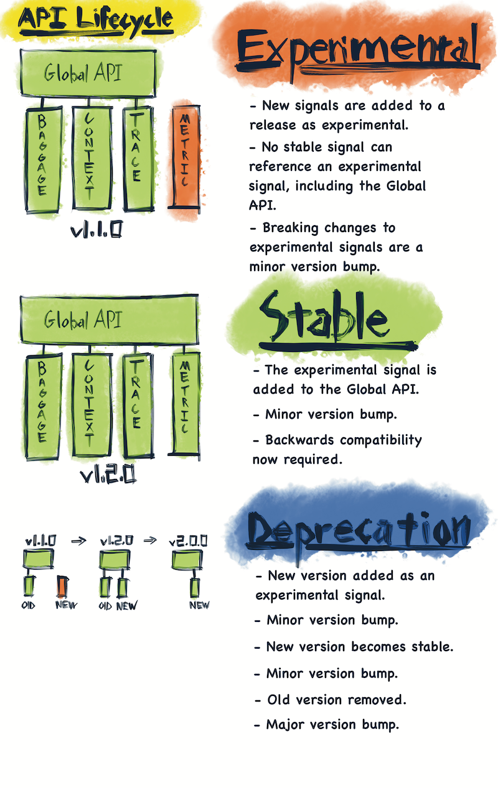

---
authors:
- aitoboxrobot
categories:
- 研究解读
date: 2026-08-13
hide:
- navigation
tags:
- OpenTelemetry
- 可观测性
- 开源治理
- 软件工程
title: OpenTelemetry 进展受阻：一场关于稳定性、规模与维护者的危机
---
### 文章背景与核心概要

多年来，在将团队从特定供应商的 SDK 迁移到 OpenTelemetry (OTel) 时，开发者常会发出疑问：“为什么感觉这项工作永远做不完？”尽管 OTel 成功保持了真正的供应商中立性，但通过对其 GitHub 活动、语义约定（Semantic Conventions）以及维护瓶颈的深入分析，可以发现该项目正陷入一场“三重困境”：严格的二进制稳定性门槛、跨越数十种语言和框架的庞大覆盖范围，以及过度劳累且高度集中的维护者团队。

本文通过数据分析揭示了 OTel 在不同语言 SDK 之间存在的严重维护不平衡问题。虽然 Go 和 .NET 等语言拥有健康的贡献者生态，但 PHP、Ruby 等语言却高度依赖极少数维护者，导致项目生态脆弱。文章最后建议通过引入时间限制的 Beta 层级、透明化维护等级以及公开招募维护者，来缓解当前的发展瓶颈，确保 OTel 的长期健康发展。

---

## OTel 进展受阻（我为此做了一张电子表格）

### 摘要

多年来，在将团队从特定供应商的 SDK 迁移到 OpenTelemetry (OTel) 时，一个常见的抱怨是：“为什么感觉这项工作永远做不完？”

虽然供应商提供的 SDK 能带来“傻瓜式”、即插即用的体验，但 OTel 却以“实验性”标签和多种实现任务的方式迎接开发者。值得称赞的是，OTel 成功地保持了一个真正独立于供应商的系统。然而，仔细观察 GitHub 活动、语义约定和维护瓶颈后会发现，该项目正陷入一场**三重崩溃**：严格的二进制稳定性门槛、跨越数十种语言和框架的庞大范围，以及一个过度劳累且高度集中的维护者团队。

> For years, a common complaint when migrating teams from vendor-specific SDKs to OpenTelemetry (OTel) has been: *"Why does it seem like this isn't done yet?"* 
>
> While vendor SDKs offer an "idiot-proof," plug-and-play experience, OTel greets developers with "experimental" stamps and numerous ways to accomplish tasks. To its credit, OTel has successfully remained a truly vendor-agnostic system. However, a closer look at GitHub activity, semantic conventions, and maintenance bottlenecks reveals a project caught in a **three-way crash**: a strict binary stability gate, a massive scope spanning dozens of languages and frameworks, and an overworked, highly concentrated bench of maintainers.

---

## 核心问题：范围、稳定性和维护者

随着时间的推移，像语义约定这样的存储库中的讨论变得旷日持久，且各语言之间的支持程度差异巨大（Golang 和 .NET 享有顶级地位，而 PHP 和 Ruby 等语言则落后数年）。

OTel 内部的根本问题在于以下因素的结合：
1. **二进制稳定性门槛：** 一旦功能被锁定并作为稳定版发布，就永远无法更改。这产生了一种强烈的动机，导致人们对潜在问题进行无休止的辩论。
2. **庞大的范围：** 试图覆盖令人眼花缭乱的语言、框架和长尾集成。
3. **过度劳累的维护者：** 关键的开源工作对业余爱好者来说过于复杂，迫使项目依赖于那些优先级与母公司利益挂钩的维护者。

> As the years have passed, conversations in repositories like semantic conventions drag on endlessly, and support across languages varies wildly (Golang and .NET enjoy first-class status, while languages like PHP and Ruby lag years behind). 
>
> The underlying issue inside OpenTelemetry is a combination of:
> 1. **Binary Stability Gates:** Once a feature is locked in and shipped as stable, it can never be changed. This creates an intense incentive to endlessly debate potential problems.
> 2. **Massive Scope:** Attempting to cover a dizzying array of languages, frameworks, and long-tail integrations.
> 3. **Overworked Maintainers:** Critical open-source work is too complex for casual hobbyists, forcing the project to rely on maintainers whose priorities are tied to their parent companies.

### OpenTelemetry 的工作方式

OpenTelemetry 将其工作分为两个主要部分：
* **Core（核心）：** 由 OTel 项目直接维护；规模小、稳定、供应商中立，且经过严格审查（定义规范的表面）。
* **Contrib（贡献）：** 由社区和供应商贡献；范围更广、迭代更快，覆盖长尾集成。

> OpenTelemetry splits its work into two main buckets:
> * **Core:** Maintained directly by the OTel project; small, stable, vendor-neutral, and tightly reviewed (spec-defining surface).
> * **Contrib:** Community- and vendor-contributed; broader, faster-moving, covering the long tail of integrations.

```
opentelemetry-python (core)          | The API, SDK, OTLP exporter, context propagation, resource detection primitives
opentelemetry-python-contrib         | Instrumentation libraries for Flask, Django, requests, psycopg2, Redis, Kafka, boto3, etc.
```

---

## 功能生命周期

向 OTel 添加新功能涉及一条严谨且通常漫长的路径：
1. **OpenTelemetry 增强提案 (OTEP)：** 通过 [OTEPs](https://github.com/open-telemetry/opentelemetry-specification/tree/main/oteps/) 提出。
2. **规范：** 被接受的文本移入 Specification 目录。
3. **语义约定：** 进行深入、永久的设计承诺和长期讨论的地方。
4. **SDK 实现：** SDK 实现定义的 API 表面。
5. **Contrib / 插桩：** 独立版本控制以跟踪最新的 API。
6. **Collector + OTLP：** 有线协议和数据发送方处理传输。

> Adding a new feature to OTel involves a rigorous, often lengthy path:
> 1. **OpenTelemetry Enhancement Proposal (OTEP):** Proposed via [OTEPs](https://github.com/open-telemetry/opentelemetry-specification/tree/main/oteps/).
> 2. **Specification:** Accepted text moves into the Specification directory.
> 3. **Semantic Conventions:** Where deep, permanent design commitments and long discussions take place.
> 4. **SDK Implementation:** SDKs implement the defined API surface.
> 5. **Contrib / Instrumentation:** Independent versioning tracks the latest APIs.
> 6. **Collector + OTLP:** The wire protocol and data shippers handle transmission.

---

## 项目健康度与维护者集中度

将 OTel 的语言 SDK 与 Envoy 和 Prometheus 等其他 CNCF 项目进行比较，可以发现维护者分布存在巨大差异。虽然健康的项目拥有广泛的贡献者群体，但许多 OTel 语言 SDK 却深受高度集中的困扰。

> Comparing OTel languages to other CNCF projects like Envoy and Prometheus reveals a stark disparity in maintainer distribution. While healthy projects feature a broad bench of contributors, many OTel language SDKs suffer from extreme concentration.

<figure></figure>

### 存储库维护者集中度（24 个月数据）

| 存储库 | 24个月合并 PR 数 | 不同合并者数量 | 前 1 名合并者占比 | 顶级合并者角色 |
| :--- | :--- | :--- | :--- | :--- |
| `opentelemetry-cpp` | 544 | 4 | **86.1%** | 单人 (`marcalff`) |
| `opentelemetry-kotlin` | 281 | 2 | **79.7%** | 单人 (`fractalwrench`) |
| `opentelemetry-browser` | 102 | 4 | **79.5%** | 单人 |
| `opentelemetry-ruby` | 213 | 5 | **78.7%** | 单人 |
| `opentelemetry-js` | 829 | 14 | **64.9%** | 高度集中 |
| `opentelemetry-python` | 486 | 4 | **61.4%** | 单人 (`xrmx`) |
| `opentelemetry-php` | 181 | 2 | **53.0%** | 总共两人 |
| `semantic-conventions` | 911 | 9 | **49.7%** | 单人 (`lmolkova`) |
| `opentelemetry-go` | 686 | 5 | 36.9% | 分布式团队 |
| `opentelemetry-dotnet` | 657 | 6 | 31.5% | 分布式团队 |
| **`prometheus`** | **1,849** | **31** | **14.4%** | **广泛的团队** |
| **`envoy`** | **5,432** | **28** | **35.8%** | **广泛的团队** |

PHP 和 Ruby 等语言严重依赖一两个人，这使得它们成为脆弱的开源生态系统。

> Languages like PHP and Ruby rely heavily on just one or two people, rendering them fragile open-source ecosystems.

<figure></figure>

<figure></figure>

相比之下，Golang 和 .NET 展示了更健康的贡献者分布。

> In contrast, Golang and .NET showcase a much healthier distribution of contributors.

<figure></figure>

<figure></figure>

---

## 语义约定与瓶颈

查看 [semantic-conventions 存储库](https://github.com/open-telemetry/semantic-conventions)，由于复杂性，一些拉取请求（PR）需要很长时间才能完成。然而，这种减速并没有直接导致 SDK/API 的阻塞；相反，SDK 实现的延迟很大程度上与强制性的审查检查和缺乏可用的维护者有关。

> Looking at the [semantic-conventions repository](https://github.com/open-telemetry/semantic-conventions), some pull requests take significant time to clear due to complexity. However, this slowdown doesn't directly propagate into SDK/API blockages; rather, delays in SDK implementation are heavily tied to mandatory review checks and a lack of available maintainers.

### 语义约定中最慢的 PR

| PR | 天数 | 评论 | 审查 | 标签 | 主题 |
| :--- | :--- | :--- | :--- | :--- | :--- |
| [#2083](https://github.com/open-telemetry/semantic-conventions/pull/2083) | 277.5 | 17 | **115** | area:gen-ai | MCP 语义约定 |
| [#2617](https://github.com/open-telemetry/semantic-conventions/pull/2617) | 258.6 | 29 | 13 | area:gcp | GCE 实例标签 |
| [#1698](https://github.com/open-telemetry/semantic-conventions/pull/1698) | 187.9 | 3 | 7 | area:azure, **breaking** | 重命名 `azure_` → `azure.` |
| [#2619](https://github.com/open-telemetry/semantic-conventions/pull/2619) | 174.6 | 24 | 8 | area:gcp | GCE 实例组管理器 |
| [#3118](https://github.com/open-telemetry/semantic-conventions/pull/3118) | 147.1 | 19 | 8 | area:graphql, **breaking** | GraphQL 推荐 vs 可选 |
| [#1741](https://github.com/open-telemetry/semantic-conventions/pull/1741) | 141.0 | 4 | 23 | changelog.opentelemetry.io | 大型机 |
| [#1784](https://github.com/open-telemetry/semantic-conventions/pull/1784) | 127.3 | 7 | 48 | area:k8s | k8s.container.status 指标 |
| [#2287](https://github.com/open-telemetry/semantic-conventions/pull/2287) | 118.5 | 12 | **95** | area:rpc | ONC/Sun RPC + NFS 指标 |
| [#2179](https://github.com/open-telemetry/semantic-conventions/pull/2179) | 117.0 | 7 | **114** | area:gen-ai, **breaking** | Gen-AI 聊天历史属性 |

---

## 潜在解决方案

为了解决这些障碍并帮助 OTel 成功取代特定供应商的 SDK，应考虑以下几个务实的调整：

1. **引入时间限制的 Beta 层级：** 在“实验性”和“稳定”之间，一个更明显的 Beta 层级（保证 12 个月内不会破坏）将鼓励终端用户反馈，而不会过早锁定不可逆的架构。
2. **透明的维护等级：** 假装存在语言对等性（例如 Go vs. Ruby）会产生隐性的不满。诚实地对待维护水平有助于用户做出明智的选择，并鼓励在最需要帮助的地方进行贡献。
3. **公开信号：需要维护者：** 整个社区需要理解，迫切需要独立的维护者和贡献者来维持该项目庞大的范围。

> To address these hurdles and help OTel successfully replace vendor-specific SDKs, a few pragmatic adjustments should be considered:
>
> 1. **Introduce a Time-Bound Beta Tier:** Between "Experimental" and "Stable," a more visible Beta tier (guaranteed not to break for 12 months) would encourage end-user feedback without locking in irreversible architecture too early.
> 2. **Transparent Maintenance Tiers:** Pretending language parity exists (e.g., Go vs. Ruby) creates quiet resentment. Being honest about maintenance levels helps users make informed choices and encourages contributions where help is needed most.
> 3. **Openly Signal the Need for Maintainers:** The community at large needs to understand that independent maintainers and contributors are urgently needed to sustain the project's massive scope.

<figure></figure>

OpenTelemetry 正在以有限的人员在巨大的规模上进行英勇的工作。然而，在稳定性契约和语言范围方面变得真正务实，对于其长期健康至关重要。

> OpenTelemetry is performing heroic work at a massive scale with limited staff. However, becoming truly pragmatic about stability contracts and language scope is essential for its long-term health.

---

*[下载原始数据存档 (ZIP)](https://matduggan.com/content/files/2026/08/data.zip)*