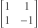
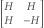

---
authors:
- aitoboxrobot
categories:
- 工具教程
date: 2026-08-14
hide:
- navigation
tags:
- 数学
- 矩阵理论
- 算法
- 组合数学
title: 阿Hadamard矩阵的构造
---
### 文章背景与核心概要
本文探讨了阿达马矩阵（Hadamard matrices）的理论与构造方法，这是一类元素仅为 $1$ 或 $-1$ 的正交矩阵。文章回顾了西尔维斯特（Sylvester）和佩利（Paley）提出的历史基石方法，讨论了关于矩阵阶数（4的倍数）著名的阿达马猜想，并介绍了填补2000阶以内空白的最新研究突破。

阿达马矩阵在密码学、信号处理和统计学等应用中扮演着重要角色。通过掌握其基础构造方法与Python代码实现，读者可以更深入地理解这类特殊矩阵在组合数学中的构造规律及其最新进展。

---

## 介绍与西尔维斯特构造法

阿达马矩阵是一种正交矩阵，其所有元素均为 $1$ 或 $-1$。例如，



就是一个2阶的阿达马矩阵。正如[斯蒂格勒命名定律](https://www.johndcook.com/blog/2019/01/12/stiglers-law/)所言，詹姆斯·约瑟夫·西尔维斯特（James Joseph Sylvester）对阿达马矩阵的研究实际上早于雅克·阿达马（Jacques Hadamard）。西尔维斯特找到了将上述特例扩充为更多矩阵的方法。如果 $H$ 是一个阿达马矩阵，那么根据[分块矩阵](https://www.johndcook.com/blog/2025/05/20/partitioned-matrices/)的理论：



> A Hadamard matrix is an orthogonal matrix whose entries are all either $1$ or $-1$. For example,
> 
> 
> 
> is a Hadamard matrix of order 2. True to [Stigler’s law of eponymy](https://www.johndcook.com/blog/2019/01/12/stiglers-law/), James Joseph Sylvester investigated Hadamard matrices before Jacques Hadamard. Sylvester saw how to bootstrap the example above into more examples. If $H$ is a Hadamard matrix, then the [partitioned matrix](https://www.johndcook.com/blog/2025/05/20/partitioned-matrices/)
> 
> 

西尔维斯特的构造方法可以推广如下：如果 $H_m$ 是 $m$ 阶阿达马矩阵，而 $H_n$ 是 $n$ 阶阿达马矩阵，那么它们的克罗内克积（Kronecker product）$H_m \otimes H_n$ 就是一个 $mn$ 阶的阿达马矩阵。也就是说，你可以通过矩阵 $H_m$ 并将其中的 $\pm 1$ 替换为矩阵 $\pm H_n$ 来构造出一个新的阿达马矩阵。

设 $S$ 是所有可能的阿达马矩阵阶数组成的集合。根据上述构造，该集合对乘法封闭。由于 $2 \in S$，因此 $2$ 的所有幂次也都属于 $S$。阿达马证明了所有属于 $S$ 的 $n \ge 4$ 必然是 $4$ 的倍数。换句话说，条件 $4 \mid n$ 是必要的。他推测这也同样是充分的，尽管这一点尚未得到完全证明。

因此，核心的疑问就在于集合 $S$ 究竟包含哪些元素。是否存在某个 $4$ 的倍数不属于 $S$？在解答这个问题之前，已知不属于 $S$ 的最小 $4$ 的倍数又是多少？由于阿达马矩阵在实际应用中非常有用，因此**构造各种阶数的阿达马矩阵**即便在阿达马猜想仍未解决的情况下，也具有重要的实际意义。

> Sylvester’s construction can be generalized as follows. If $H_m$ is a Hadamard matrix of order $m$ and $H_n$ is a Hadamard matrix of order $n$, then the Kronecker product $H_m \otimes H_n$ is a Hadamard matrix of order $mn$. That is, you can form a new Hadamard matrix by taking the matrix $H_m$ and replacing $\pm 1$ with the matrix $\pm H_n$.
> 
> Let $S$ be the set of all possible Hadamard matrix orders. By the construction above, this set is closed under multiplication. Since $2$ is in $S$, every power of $2$ is in $S$. Hadamard proved that all $n \ge 4$ in $S$ are multiples of $4$. That is, the condition $4 \mid n$ is necessary. He conjectured that it was also sufficient, though that has not been proven.
> 
> So the big question is what is the set $S$. Is there some multiple of 4 not in $S$? Until that question is answered, what is the smallest multiple of 4 not *known* to be in $S$? Hadamard matrices are useful in applications, so **constructing Hadamard matrices of various orders is useful** even while Hadamard’s conjecture remains open.

---

## 佩利法 (Paley’s Method)

雷蒙德·佩利（Raymond Paley）提出了一种方法：如果 $q$ 是一个同余于 $3 \pmod 4$ 的素数幂，则可以构造大小为 $q + 1$ 的阿达马矩阵；如果 $q$ 是一个同余于 $1 \pmod 4$ 的素数幂，则可以构造大小为 $2(q + 1)$ 的阿达马矩阵。让我们来看看能从这种方法中推导出什么结论。

如果 $p$ 是一个同余于 $1 \pmod 4$ 的素数，那么 $p$ 的所有幂次也都同余于 $1 \pmod 4$，因此对于任意的 $k$，都存在阶数为 $2(p^k + 1)$ 的阿达马矩阵。

如果 $p$ 是一个满足 $p \equiv 3 \pmod 4$ 的素数，那么 $p$ 的偶数次幂同余于 $1 \pmod 4$，而奇数次幂同余于 $3 \pmod 4$。因此，存在阶数为 $2(p^{2k} + 1)$ 以及 $p^{2k+1} + 1$ 的阿达马矩阵。

让我们运行一段脚本来看看能从中了解些什么：

```python
from sympy import primerange

s = set()

for p in primerange(20):
    if p % 4 == 1:
        s.update([2*(p**k + 1) for k in range(1, 10)])
    if p % 4 == 3:
        s.update([2*(p**(2*k) + 1) for k in range(1, 6)])
        s.update([p**(2*k + 1) + 1 for k in range(1, 6)])
print(sorted(s)[:20])
```

运行结果输出：

```text
[12, 20, 28, 36, 52, 100, 164, 244, 252, 340]
```

我们可以把 16 加入列表中，因为它是 2 的幂，我们也可以把 24 加入列表中，因为它是 $2 \times 12$，以此类推。但是，似乎没有什么办法能得到 44。其实*确实*有办法构造出一个 44 阶的阿达马矩阵，但它无法从我们目前看到的方法中推导出来。

> Raymond Paley came up with a way of constructing Hadamard matrices of size $q + 1$ if $q$ is a prime power congruent to 3 mod 4, and of size $2(q + 1)$ if $q$ is a prime power congruent to 1 mod 4. Let’s see what we can squeeze out of this.
> 
> If $p$ is a prime congruent to 1 mod 4, every power of $p$ is also congruent to 1 mod 4, and so there exist Hadamard matrices of order $2(p^k + 1)$ for every $k$.
> 
> If $p$ is a prime with $p \equiv 3 \pmod 4$, then even powers of $p$ are congruent to 1 mod 4 and odd powers of $p$ are congruent to 3 mod 4. So there are Hadamard matrices of order $2(p^{2k} + 1)$ and of order $p^{2k+1} + 1$.
> 
> Let’s run a script to see what we can learn from this:
> 
> ```python
> from sympy import primerange
> 
> s = set()
> 
> for p in primerange(20):
>     if p % 4 == 1:
>         s.update([2*(p**k + 1) for k in range(1, 10)])
>     if p % 4 == 3:
>         s.update([2*(p**(2*k) + 1) for k in range(1, 6)])
>         s.update([p**(2*k + 1) + 1 for k in range(1, 6)])
> print(sorted(s)[:20])
> ```
> 
> This prints:
> 
> ```text
> [12, 20, 28, 36, 52, 100, 164, 244, 252, 340]
> ```
> 
> We can add 16 to the list because it’s a power of 2, and we can add 24 because it’s $2 \times 12$, etc. But there doesn’t seem to be any way to get 44. There *is* a way to create a Hadamard matrix of order 44, but it doesn’t follow from anything we’ve seen so far.

---

## 最新记录

我有一本出版于1996年的书，其中提到阿达马猜想已在 $n$ 最高达 428 的范围内得到验证。直到昨天，没有人能找到对应阿达马矩阵的最小 4 的倍数是 668。随后，莱文·阿尔波格（Levent Alpöge）宣布他和合作者们找到了一个 668 阶的矩阵示例，并填补了 2000 以下所有剩余的空白。

因此，现在已知集合 $S$ 包含了 $\{1, 2, 4, 8, 12, 16, \dots, 2000\}$。它还包含通过佩利法以及其他方法可以得到的所有阶数，同时也包含其元素的所有乘积。不过，目前还不知道它是否包含 2004。

> I have a book published in 1996 that says Hadamard’s conjecture had been verified for $n$ up to 428. Until yesterday, the smallest multiple of 4 for which nobody had found a corresponding Hadamard matrix was 668. Then Levent Alpöge announced that he and his collaborators found an example of size 668 and filled in all remaining gaps below 2000. 
> 
> So now the set $S$ is known to contain $\{1, 2, 4, 8, 12, 16, \dots, 2000\}$. It also contains all orders that can be obtained by Paley’s method and other methods. And it contains all products of its elements. But it is not yet known to contain 2004.

---

## 相关文章

* [阿达马行列式不等式](https://www.johndcook.com/blog/2020/07/22/hadamard-inequality/)
* [阿达马的狄利克雷能量示例](https://www.johndcook.com/blog/2020/07/11/dirichlet-principle-counterexample/)

> * [Hadamard’s determinant inequality](https://www.johndcook.com/blog/2020/07/22/hadamard-inequality/)
> * [Hadamard’s Dirichlet energy example](https://www.johndcook.com/blog/2020/07/11/dirichlet-principle-counterexample/)

---

*文章[Constructing Hadamard matrices](https://www.johndcook.com/blog/2026/08/13/constructing-hadamard-matrices/)最初发布于[John D. Cook](https://www.johndcook.com/blog)。*

> *The post [Constructing Hadamard matrices](https://www.johndcook.com/blog/2026/08/13/constructing-hadamard-matrices/) first appeared on [John D. Cook](https://www.johndcook.com/blog).*