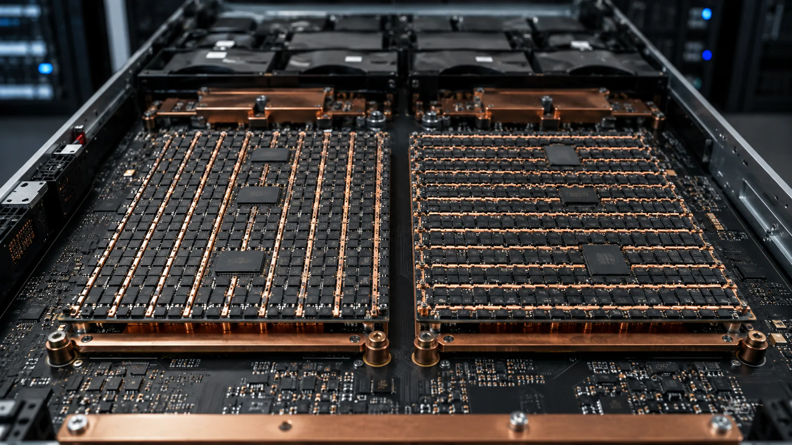

---
authors:
- aitoboxrobot
categories:
- arXiv论文
date: 2026-08-15
hide:
- navigation
tags:
- KV Cache
- 大模型量化
- 注意力机制
- KIVI
- 机器学习
title: 你的 KV 缓存不是比特问题，而是几何问题
---
### 文章背景与核心概要
在大语言模型推理中，KV 缓存（Key-Value Cache）占用了大量的内存带宽和存储空间，因此对其进行量化压缩至关重要。然而，许多工程师和研究人员发现，即使在相同的 2-bit 极低比特精度下，不同的量化轴选择也会导致模型性能从彻底崩塌（基准得分 2.88）到几乎无损（63.53）的天壤之别。

本文深入探讨了为什么 Key（键）和 Value（值）需要截然相反的量化处理方式（Key 按通道量化，Value 按 Token 量化），并指出这种差异并非由硬件限制决定，而是由注意力机制（Attention Equation）的数学本质所决定的。作者还警告了仅凭原始存储重构误差（Reconstruction Error）来验证压缩效果的潜在危险，强调必须在张量被消耗的下游操作中评估误差，这为所有中间激活值的压缩提供了重要的通用设计原则。

---

## 你的 KV 缓存不是比特问题，而是几何问题

*By Himanshu Goel*

<picture><source sizes="(max-width: 1672px) 100vw, 1672px" srcset="./images/a326e0b77ad2.webp.webp" type="image/webp"/></picture>

> *At identical 2-bit precision, one decision about which axis you quantize along swings a benchmark score from 2.88 to 63.53. Keys and values need opposite treatment — and the reason is in the attention equation, not the hardware.*

> 在相同的 2-bit 精度下，关于沿哪个轴进行量化的一项决策，就能让基准测试得分从 2.88 飙升至 63.53。Key 和 Value 需要截然相反的处理方式——其原因在于注意力方程（attention equation），而非硬件限制。

以 Llama-2-13B 为例。将其键值缓存（key-value cache）按 32 的量化分组大小（group size）量化为 2 比特，同时保持其他所有条件不变——相同的模型、相同的比特预算、相同的分组大小以及相同的基准测试。

取决于实现决策中的某一个单一要素，CoQA 准确率测试结果会得出 2.88 或是 63.53。全精度下的得分为 66.37。

这项决策无关乎总共使用了多少比特，问题仅仅在于：在计算每个缩放因子（scale factor）时，你选择沿哪个轴进行分组？当你决定使用通道（channel）作为分组维度（针对 Key），并使用 Token 作为分组维度（针对 Value）时，你的性能最终会落在全精度性能的 4 个百分点之内。如果你颠倒其中任何一个选择，就会遭遇质量损失。如果你把这两个选择同时颠倒，模型将彻底无法工作。

<picture><source sizes="(max-width: 1940px) 100vw, 1940px" srcset="https://www.unite.ai/wp-content/uploads/2026/08/c8b0303fcbb4cd5714abfba7422405b37fcf8a4c.png.webp 1940w, https://www.unite.ai/wp-content/uploads/2026/08/c8b0303fcbb4cd5714abfba7422405b37fcf8a4c-800x404.png.webp 800w, https://www.unite.ai/wp-content/uploads/2026/08/c8b0303fcbb4cd5714abfba7422405b37fcf8a4c-1920x970.png.webp 1920w, https://www.unite.ai/wp-content/uploads/2026/08/c8b0303fcbb4cd5714abfba7422405b37fcf8a4c-567x286.png.webp 567w, https://www.unite.ai/wp-content/uploads/2026/08/c8b0303fcbb4cd5714abfba7422405b37fcf8a4c-768x388.png.webp 768w, https://www.unite.ai/wp-content/uploads/2026/08/c8b0303fcbb4cd5714abfba7422405b37fcf8a4c-1536x776.png.webp 1536w, https://www.unite.ai/wp-content/uploads/2026/08/c8b0303fcbb4cd5714abfba7422405b37fcf8a4c-1200x606.png.webp 1200w" type="image/webp"/></picture>
在相同的缓存上消耗相同的 2 个比特的四种方式。这是在 Llama-2-13B 上进行 KIVI 消融实验、分组大小为 32 时的结果。

> Quantization is usually thought of as just one dial: 8 bits, 4 bits, 2 bits, with smooth cost of accuracy attached. Inside KV cache, it is not like that. It is choosing coordinate systems, and different systems apply to keys and values. This piece explains why. Briefly: quantization error depends on the range of values within groups; keys and values have very different structure; and people often trip up because you can’t derive the right axis from value distribution at all. You have to look at how error changes after attention consumes it. That gives a general principle for compressing intermediate activations and a good reason to doubt reconstruction error as a proxy for quality.

> 人们通常认为量化只是一个刻度盘：8 位、4 位、2 位，并伴随着平滑的准确率代价。但在 KV 缓存内部，情况并非如此。这是在选择坐标系，并且不同的系统适用于 Key 和 Value。本文将解释其中的原因。简而言之：量化误差取决于分组内的数值范围；Key 和 Value 具有非常不同的结构；人们经常踩坑，因为你根本无法从数值分布中推导出来正确的坐标轴。你必须观察误差在注意力机制消耗它之后是如何变化的。这为压缩中间激活值提供了一个通用原则，也为质疑将重构误差作为质量代理指标提供了充分的理由。

## 为什么 KV 缓存是痛点所在

> During the generation phase, a transformer stores all of the key and value projection (KV) data of tokens that it has previously processed into a cache so it does not have to recalculate this data again. That cache grows linearly with context length and batch size. Eventually, this will result in the cache growing larger than the model itself.

> 在生成阶段，Transformer 会将先前处理过的所有 Token 的键和值投影（KV）数据存储到缓存中，这样它就不必再次重新计算这些数据。该缓存随着上下文长度和批处理大小（batch size）呈线性增长。最终，这将导致缓存变得比模型本身还要大。

> This increase in growth can be easily identified when looking at the memory consumption of different parts of the model. In the [KVQuant analysis of LLaMA-7B](https://arxiv.org/abs/2401.18079), weights account for roughly 98 percent of memory at a sequence length of 512, with activations at 2 percent. At 128K context, the ratio inverts to about 16 percent weights and 84 percent KV cache. When we look at an analysis of OPT-175B cited by the [KIVI](https://arxiv.org/pdf/2402.02750) authors, they found similar results. Specifically, at a batch size of 512 with a 512-token prompt, the KV cache reaches 1.2TB — several times the size of the model weights.

> 观察模型不同部分的内存消耗，可以轻易发现这种增长趋势。在针对 [LLaMA-7B 的 KVQuant 分析](https://arxiv.org/abs/2401.18079)中，当序列长度为 512 时，权重约占内存的 98%，激活值占 2%。而在 128K 上下文下，这一比例倒置为约 16% 的权重和 84% 的 KV cache。当我们查看 [KIVI](https://arxiv.org/pdf/2402.02750) 作者引用的 OPT-175B 分析时，他们也发现了类似的结果。具体而言，在批处理大小为 512、提示词长度为 512 个 Token 的情况下，KV 缓存达到了 1.2TB——达到了模型权重大小的数倍之多。

> However, capacity is only half of the issue here. The GPU must read the entire KV cache from device memory for every single token it generates. This means that while the GPU is reading out the KV cache, the compute cores sit idle. As such, reducing the overall size of the cache both increases the available processing headroom and reduces the time spent waiting for transfers of data.

> 然而，容量只是问题的一半。GPU 必须为它生成的每一个 Token 从设备内存中完整读取整个 KV cache。这意味着当 GPU 在读取 KV 缓存时，计算核心处于闲置状态。因此，减小缓存的总大小既能增加可用的处理余量，又能减少等待数据传输的时间。

## 量化误差到底是由什么组成的

> Uniform integer quantization is straightforward mathematically. For a group of numbers, you record the smallest number as a zero point and then divide the range of that group by the number of levels that can be represented to get a step size. You then round each element to the nearest step. Two immediate results follow. First, error per element is bounded by half a step. Second, the step size is the group’s range divided by 2ᴮ − 1. At 2 bits, you have only 4 levels to cover whatever spread exists within that group. So an element that is a hundred times larger compared to its neighbors does not just perform badly. It inflates step size for all other elements sharing the same group, and all of them become coarser together. Group is the unit of damage. Choosing an axis means deciding which elements suffer together. Framing the question differently, it is no longer “how many bits can we afford?” but “where are extreme values and can we isolate them?”

> 均匀整数量化在数学上很简单。对于一组数字，你将其中最小的数字记录为零点（zero point），然后将该组的数值范围除以可表示的级别数，以获得步长（step size）。接着，你将每个元素四舍五入到最近的步长。这里有两个直接的结果。首先，每个元素的误差受限于半个步长。其次，步长等于该组的范围除以 $2^B - 1$。在 2 比特下，你只有 4 个级别来覆盖该组中存在的任何数据离散度。因此，一个比其邻居大上百倍的元素不仅自身表现糟糕，它还会抬高共享同一组的所有其他元素的步长，导致它们整体变粗糙。分组是损害的单位。选择一个轴意味着决定哪些元素共同承受损害。换个角度来看，这不再是“我们买得起多少比特？”的问题，而是“极端值在哪里，我们能否隔离它们？”的问题。

## Key：异常值存在于固定的通道中

> Large language models contain activations that are unusually large compared to most activations. [Sun and colleagues catalogued these very large activations](https://arxiv.org/pdf/2402.17762) across different families of models: in Mixtral 8x7B, the largest magnitude is near 7000 while the median feature magnitude is around 0.3 — roughly four orders of magnitude apart. These are very rare; they stay fixed in dimensions that rarely change with input, and they are not accidental. They act as implicit biases, and they are what focus attention on just a few tokens: attention sinks behavior. In key cache, this structure is very clear: specific channels carry very large magnitudes consistently across every token in a sequence. Group along tokens, and every group contains those outlier channels, so every group’s step size is set by the outliers, and all the ordinary channels pay for it. Group along channels, and the outlier channels form their own groups. Their internal range is large but self-contained; the ordinary channels are left alone. Results match. Averaged across layers and heads on Llama-2-13B, KIVI reports key reconstruction error of 13.67 under per-token grouping against 4.55 per-channel, and — more importantly — attention score error of 47.00 against 9.60. Quantizing keys per token produces roughly five times the score error. Scores then agree with meaningful metrics for keys; channel quantization excels on both fronts.

> 大语言模型包含一些与大多数激活值相比异常巨大的激活值。[Sun 及其同事对不同模型家族中的这些超大激活值进行了分类编目](https://arxiv.org/pdf/2402.17762)：在 Mixtral 8x7B 中，最大幅值接近 7000，而中位数特征幅值约为 0.3——两者相差大约四个数量级。它们非常罕见；它们固定在随输入变化极小的维度上，且并非偶然出现。它们充当了隐式偏置（implicit biases），正是它们将注意力集中在少数几个 Token 上：即注意力汇聚（attention sinks）行为。在 Key 缓存中，这种结构非常清晰：在序列中的每个 Token 上，特定的通道始终承载着非常大的幅值。如果按 Token 进行分组，每个组都包含这些异常值通道，因此每个组的步长都被异常值决定，所有普通通道都为此付出了代价。如果按通道进行分组，异常值通道则会形成它们自己的组。其内部范围虽然很大但自成一体，普通通道则不受影响。结果完全吻合。在 Llama-2-13B 的各层和各注意力头上取平均，KIVI 报告称，在按 Token 分组下，Key 的重构误差为 13.67，而按通道分组下为 4.55；更重要的是，注意力得分误差分别为 47.00 对 9.60。按 Token 量化 Key 产生的得分误差大约是通道量化的五倍。因此，得分结果与 Key 的有意义指标相吻合；通道量化在两个方面都表现出色。

## Value：直觉失效的地方

> The value cache does not show a channel-outlier pattern. It appears to be fairly flat. On its own, by the range argument, we could expect that either of these axes will produce a similar quality of compression.

> Value 缓存并没有表现出通道异常值的模式。它看起来相当平缓。仅从数值范围的论点来看，我们本可以预期这两个轴中的任何一个都会产生相似的压缩质量。

> They do not. Regardless of how key management is implemented (the 2.80 and 2.88 results), compressing per-channel values collapses the model.

> 但事实并非如此。无论 Key 的管理方式如何实现（那组 2.80 和 2.88 的结果），按通道压缩 Value 都会导致模型崩溃。

> And here’s the catch: if you measured this loss using the raw reconstruction error on the original tensor for which each value was compressed, per-channel value quantization actually looks slightly better, at 3.73 against 4.57. If you validated your compression the obvious way, you would pick the configuration that destroys the model.

> 问题就在这里：如果你使用压缩前原始张量的原始重构误差来衡量这种损失，按通道的 Value 量化实际上看起来要稍微好一些（3.73 对比 4.57）。如果你用显而易见的方式来验证你的压缩，你反而会选择那个彻底摧毁模型的配置。

<picture><source sizes="auto, (max-width: 2019px) 100vw, 2019px" srcset="./images/623f8b14ad0d.webp.webp 2019w, https://www.unite.ai/wp-content/uploads/2026/08/7685e3c7ad0596c5a6c37434783fa2d1dc4f12a1-800x332.png.webp 800w, https://www.unite.ai/wp-content/uploads/2026/08/7685e3c7ad0596c5a6c37434783fa2d1dc4f12a1-1920x796.png.webp 1920w, https://www.unite.ai/wp-content/uploads/2026/08/7685e3c7ad0596c5a6c37434783fa2d1dc4f12a1-567x235.png.webp 567w, https://www.unite.ai/wp-content/uploads/2026/08/7685e3c7ad0596c5a6c37434783fa2d1dc4f12a1-768x318.png.webp 768w, https://www.unite.ai/wp-content/uploads/2026/08/7685e3c7ad0596c5a6c37434783fa2d1dc4f12a1-1536x637.png.webp 1536w, https://www.unite.ai/wp-content/uploads/2026/08/7685e3c7ad0596c5a6c37434783fa2d1dc4f12a1-1200x497.png.webp 1200w" type="image/webp"/></picture>
Llama-2-13B 上的 Value 缓存量化误差，通过两种方式测量。存储张量指标与消耗输出指标的结果相差一个多数量级。

> The resolution is that the value cache is never read directly. It is consumed by a matrix product: the attention output is a weighted sum of value vectors across tokens, with softmax attention scores as the weights. Because of this, the relevant error is the one introduced during this process and not within the tensors themselves. Measured in terms of the attention output, the order was completely reversed. Relative error reported by KIVI for the attention output due to per-token value vector quantization was 3.55 compared to 49.89 for per-channel quantization — over fourteen times higher for what seemed like the better choice based on how well it was compressed.

> 问题的关键在于，Value 缓存从来都不是被直接读取的。它是通过矩阵乘积被消耗的：注意力输出是跨 Token 的值向量的加权和，其中 softmax 注意力得分作为权重。正因如此，相关的误差是在这个过程中引入的，而不是在张量本身之中。如果以注意力输出来衡量，顺序完全颠倒了。KIVI 报告称，由于按 Token 的值向量量化而导致的注意力输出相对误差为 3.55，而按通道量化的误差高达 49.89——对于基于压缩程度看起来更好的选择来说，其误差高出了十四倍以上。

> The explanation is attention sparsity, which they measured as 84.3 percent. The majority of the information contained in the output can be attributed to a small number of very important tokens. Per-token quantization confines each token’s error to that token, so errors on unimportant tokens get multiplied by near-zero attention weights and effectively vanish. Per-channel quantization smears every token’s error across a shared channel scale, so badly represented tokens contaminate the representation of the ones that matter. The sparsity that makes attention efficient is the same property that makes per-token quantization safe.

> 解释这一现象的原因是注意力的稀疏性（attention sparsity），他们测得该数值为 84.3%。输出中所包含的大部分信息可以归因于少数几个非常重要的 Token。按 Token 量化将每个 Token 的误差限制在该 Token 内部，因此不重要 Token 上的误差会被乘以接近零的注意力权重，从而实际上消失了。而按通道量化则将每个 Token 的误差涂抹到一个共享的通道缩放尺度上，导致表现糟糕的 Token 污染了那些至关重要的 Token 的表征。使注意力机制高效运行的稀疏性，正是使按 Token 量化安全的同一特质。

> The transferable lesson is broader than the KV cache: measure compression error where the tensor is consumed, not where it is stored. An implicit assumption made by reconstruction error is that every component of a tensor has equal weight when contributing to the final output. Attention explicitly does not. Any downstream operation that weights, gates, or sparsifies its input breaks that assumption. Readers familiar with my previous article regarding [blindspots in evaluation metrics in retrieval systems](https://www.unite.ai/biomedical-rag-contradiction-blindness-structural-prompting/) will recognize that these results are similar to previously described failures: easily computed metrics that report on something other than what was intended.

> 这一可以迁移的经验法则比 KV 缓存本身更为广泛：应该在张量被消耗的地方测量压缩误差，而不是在其被存储的地方。重构误差所做的一个隐式假设是：在对最终输出做出贡献时，张量的每个组件都具有相等的权重。但注意力机制显然并非如此。任何对其输入进行加权、门控（gating）或稀疏化的下游操作都会打破这一假设。熟悉我之前关于[检索系统中评估指标盲点](https://www.unite.ai/biomedical-rag-contradiction-blindness-structural-prompting/)文章的读者会认出，这些结果与先前描述的失败案例类似：即那些易于计算、但却反映了非预期内容的指标。

## 旋转位置编码（RoPE）使 Key 变得复杂

> There are some issues with using Rotary Position Embeddings (RoPE). RoPE rotates pairs of channels based on the relative position of each token. That mixing partially dissolves the fixed-channel structure that made per-channel key quantization work in the first place — an outlier channel gets rotated into its neighbours, and the neighbours inherit the range. KVQuant’s answer is ordering: quantize keys before the rotation is applied, and apply RoPE after dequantization. Alongside per-channel key quantization, non-uniform datatypes, and isolating a small fraction of outliers, this gets them under 0.1 perplexity degradation at 3 bits, and enables serving LLaMA-7B at up to 1 million tokens of context on a single A100-80GB.

> 使用旋转位置编码（RoPE）带来了一些问题。RoPE 根据每个 Token 的相对位置旋转通道对。这种混合部分地瓦解了使按通道 Key 量化得以奏效的固定通道结构——异常值通道被旋转到了其邻居中，而邻居则继承了该范围。KVQuant 的解决方案是调整顺序：在应用旋转之前对 Key 进行量化，并在反量化（dequantization）之后应用 RoPE。结合按通道 Key 量化、非均匀数据类型以及隔离一小部分异常值，这使得他们在 3 比特下的困惑度（perplexity）退化低于 0.1，并使得在单张 A100-80GB 上能够提供高达 100 万 Token 上下文的 LLaMA-7B 服务成为可能。

> It is also important to understand the level of impact from RoPE. The authors of the paper [“RotateKV”](https://www.ijcai.org/proceedings/2025/0690.pdf) reported an increase of 145% in quantization errors once RoPE was added, and noted that outlier channels differ across attention heads — which is why applying one shared rotation matrix everywhere is insufficient, and head-adaptive rotations do better.

> 了解 RoPE 的影响程度也很重要。[“RotateKV”](https://www.ijcai.org/proceedings/2025/0690.pdf) 一文的作者报告称，一旦加入 RoPE，量化误差就会增加 145%，并指出异常值通道在不同的注意力头之间是各不相同的——这就是为什么到处应用一个共享的旋转矩阵是不够的，而头自适应旋转（head-adaptive rotations）表现得更好。

## 系统开销（Systems Tax），以及为什么它不是小细节

> Per-token quantization suits decoding well. Each token arrives; you quantize it, add it to the sequence (along the token dimension), nothing else moves.

> 按 Token 量化非常适合解码阶段。每个 Token 到来；你对其进行量化，将其添加到序列中（沿 Token 维度），其他任何东西都不需要移动。

> However, per-channel quantization does not fit. As a channel’s statistics span tokens that have not been generated yet, you can’t compute a scale factor when a token comes in. KIVI’s workaround is to keep the most recent tokens — up to 128 — in full precision in a residual buffer, and quantize in groups once enough have accumulated.

> 然而，按通道量化则无法完美契合。由于一个通道的统计数据跨越了尚未生成的 Token，因此当一个 Token 到来时，你无法计算出缩放因子。KIVI 的变通方法是：在残差缓冲区（residual buffer）中以全精度保留最近生成的 Token（最多 128 个），一旦积累了足够多的 Token，就按组进行量化。

> As it happens, the residual buffer becomes load-bearing, rather than just an incidental thing. On GSM8K with Llama-2-7B, full precision scores 13.50. Fully quantized to 2 bits with the correct axes, it scores 5.76. The same axes and the same bits, plus the residual buffer of recently produced tokens at full precision, score 12.74. A sliding window of recently produced tokens at full precision will recover much of what was lost due to aggressive quantization on difficult multi-step problems — which would make sense if we consider which tokens were being attended to by a chain of arithmetic operations.

> 巧合的是，这个残差缓冲区变得起到了承重墙（load-bearing）的作用，而不仅仅是一个附带的东西。在运行 Llama-2-7B 的 GSM8K 测试中，全精度得分为 13.50。使用正确的轴完全量化到 2 比特时，得分为 5.76。采用相同的轴、相同的比特数，再加上以全精度保存最近生成的 Token 的残差缓冲区，得分为 12.74。对于困难的多步骤问题，通过全精度保存最近生成 Token 的滑动窗口，可以恢复因激进量化而损失的大部分性能——如果我们考虑到一系列算术运算所关注的是哪些 Token，这就完全讲得通了。

> There is a significant benefit from doing all of these things correctly — as KIVI reports, 2.6 times less peak memory use for Llama-2-7B, allowing for batch sizes up to 4 times larger, as well as 2.35 to 3.47 times better throughput on a real-world service task.

> 正确完成所有这些操作会带来巨大的收益——正如 KIVI 报道的那样，Llama-2-7B 的峰值内存使用量减少了 2.6 倍，允许的批处理大小（batch size）扩大了多达 4 倍，在真实世界的服务任务中吞吐量也提升了 2.35 到 3.47 倍。

## 我们该怎么做

1. **Never use one quantizer for both.** Use different quantizers for keys (per-channel) and for values (per token). A pipeline that applies a single quantizer to “the KV cache” has probably already sacrificed most of the possible quality when using a small number of bits to represent each value.
2. **Quantize keys before RoPE.** This is a matter of correctness as opposed to a matter of preference.
3. **Store a full precision window of recently generated tokens.** Although storing such a window takes very little memory compared to how large a cache can be, it is precisely this area that generates much of the accuracy for difficult tasks.
4. **Do not validate on reconstruction error.** Always validate based upon the attention output or based upon end task performance. The storage metric is not merely noisy — for values it points the wrong way.
5. **Do not validate on short-context multiple-choice benchmarks.** The KIVI authors deliberately avoid closed-ended tasks like MMLU for this evaluation, because a single decoding step reading output logits barely exercises the cache at all. Any evaluation that does not build a cache over time and then perform generation from it will never be able to observe the failures inherent in your system design.

1. **切勿对两者使用同一个量化器。** 应当为 Key（按通道）和 Value（按 Token）使用不同的量化器。任何将单一量化器应用于“整个 KV 缓存”的流水线，在用少量比特表示每个数值时，大概率已经牺牲掉了绝大部分潜在的质量。
2. **在 RoPE 之前量化 Key。** 这是一个正确性问题，而不是一个个人偏好问题。
3. **存储最近生成的 Token 的全精度窗口。** 尽管与庞大的缓存相比，存储这样一个窗口所需的内存微不足道，但正是这一区域为困难任务贡献了大量的准确率。
4. **切勿基于重构误差进行验证。** 始终应当基于注意力输出或最终任务性能进行验证。存储指标不仅存在噪声——对于 Value 来说，它甚至指引了错误的方向。
5. **切勿在短上下文的多项选择基准上进行验证。** KIVI 的作者在评估时刻意避开了 MMLU 这样封闭式的任务，因为单步解码读取输出 logits 的过程几乎完全没有对缓存施加压力。任何不随时间构建缓存然后从中进行生成的评估，都永远无法观察到你系统设计中固有的缺陷。

## 工作的前沿方向

> Although there is still some left to do regarding the geometric nature of the problem, many researchers continue to study ways that outlying channels are distributed among the various transformer heads, and how hardware limitations affect which groupings are cheapest: [InnerQ](https://arxiv.org/html/2602.23200) folds channel-wise key normalization into the key and query weights during prefill. Therefore, no additional overhead is incurred at runtime. Furthermore, InnerQ stores high precision windows for both recently generated tokens and attention sink tokens. In doing so, InnerQ eliminates the opportunity for outliers in the sink channel to contaminate neighboring channels.

> 尽管关于该问题的几何本质仍有一些工作要做，但许多研究人员仍在继续研究异常通道如何在各个 Transformer 注意力头之间分布，以及硬件限制如何影响哪种分组方式成本最低：[InnerQ](https://arxiv.org/html/2602.23200) 在预填充（prefill）阶段将按通道的 Key 归一化折叠到 Key 和 Query 权重中。因此，在运行时不会产生额外的开销。此外，InnerQ 为最近生成的 Token 和注意力汇聚（attention sink）Token 都存储了高精度窗口。通过这样做，InnerQ 消除了汇聚通道中的异常值污染相邻通道的可能性。

> Others propose that instead of storing the entire cache, we should store only enough information to be able to [rematerialize the key and/or value(s) on demand](https://arxiv.org/pdf/2508.10395) from a smaller cached representation.

> 其他人则提出，与其存储整个缓存，我们不如只存储足够的信息，以便能够从较小的缓存表征中[按需重新生成（rematerialize）Key 和/或 Value](https://arxiv.org/pdf/2508.10395)。

> Finally, it’s important to remember that accuracy is not the only parameter that quantization affects. [Recently published research demonstrated alignment degradation](https://arxiv.org/pdf/2606.09864) resulting from quantizing KV caches. Moreover, this research documented alignment degradation even in production vLLM serving environments utilizing FP8 caches along with a training-free recovery protocol that restored up to 97% of what was lost in terms of alignment. As such, while a configuration may hold onto its benchmark results, it does not necessarily mean that it retains all other relevant parameters you care about.

> 最后，务必记住，准确率并不是量化影响的唯一参数。[最近发表的一项研究表明](https://arxiv.org/pdf/2606.09864)，量化 KV 缓存会导致对齐（alignment）性能退化。此外，该研究记录到，即使在使用 FP8 缓存并配合无训练恢复协议（恢复了多达 97% 的对齐损失）的生产级 vLLM 服务环境中，对齐退化依然存在。因此，虽然某个配置可能在基准测试得分上表现良好，但这并不意味着它保留了你关心的所有其他相关参数。

## 通用原则

> The idea of quantization has been framed as a “precision budget”: how many bits can I afford to sacrifice? The KV cache shows that the more useful question is structural. Precision is allocated in groups; the group is the unit of damage, and the axis you group along determines which elements share their fate. The correct axis is the on which your tensor is being consumed, i.e., the way you are using your tensor and NOT how your tensor appears when stored in memory. Keys are used via a dot-product computation against the query. A single corrupted channel will poison all scores. Values are consumed through a sparse-weighted-average computation across tokens. Therefore, a single corrupted token is simply weighted out.

> 量化的概念一直被框定为“精度预算”：我能负担得起牺牲多少比特？而 KV 缓存表明，更有用的问题其实是结构性的。精度是以组为单位分配的；分组是损害的单位，你沿之进行分组的轴决定了哪些元素命运与共。正确的轴是你的张量被消耗时的轴，也就是说，取决于你如何使用张量，而不是你的张量在内存中存储时的外观。Key 是通过与 Query 进行点积计算来使用的。单个受损的通道会毒害所有的得分。Value 则是通过跨 Token 的稀疏加权平均计算来消耗的。因此，单个受损的 Token 会被简单地加权过滤掉。

> Two tensors of identical dimensions and generated by two consecutive layers are treated differently. It is worth asking of any activation you plan to compress: what operation contracts this away, and does my grouping respect it?

> 维度相同且由两个连续层生成的两个张量，却需要受到截然不同的对待。对于你计划压缩的任何激活值，都值得去追问：是什么操作将其收缩（contracts this away）消解的，我的分组方式是否契合了这一操作？