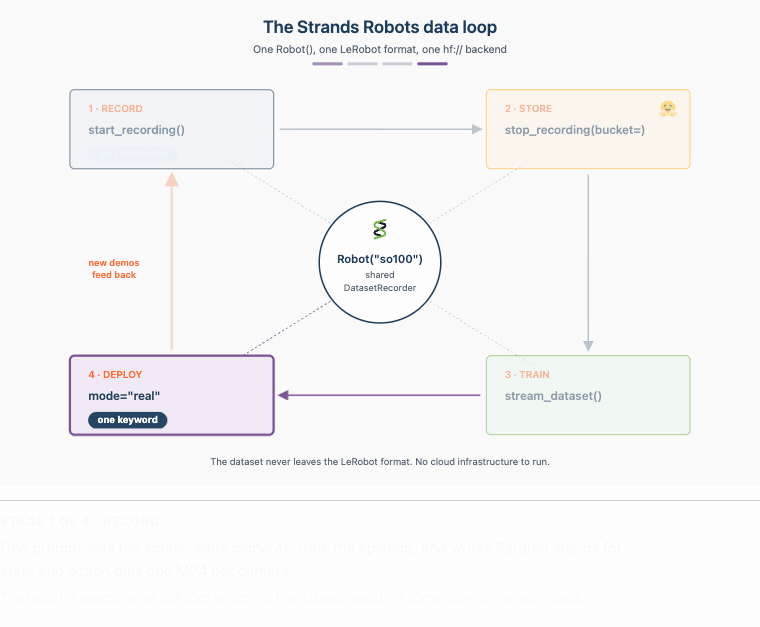
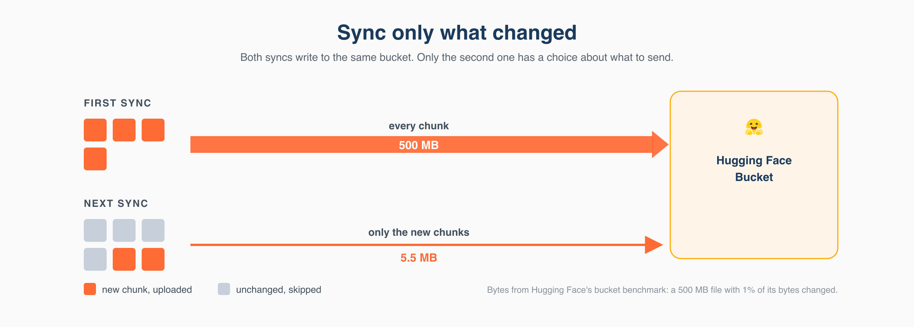
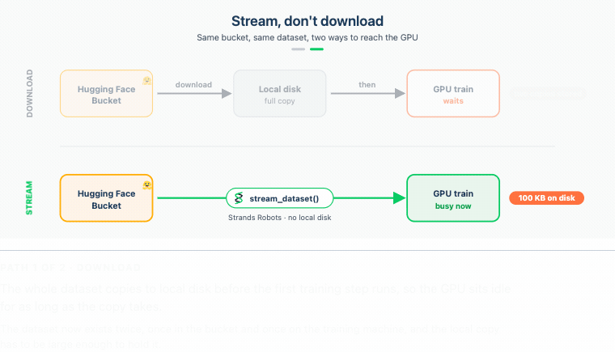

---
authors:
- aitoboxrobot
categories:
- 工具教程
date: 2026-08-15
hide:
- navigation
tags:
- Strands Agents
- LeRobot
- Hugging Face
- 机器人学
- 持续学习
title: 使用 Strands Agents、LeRobot 和 Hugging Face 存储桶在单一平台完成录制、训练与部署
---
### 文章背景与核心概要
物理 AI 系统的持续学习循环长期以来一直受困于巨大的网络开销、冗余的数据传输以及割裂的工具链。本文介绍了一种统一的数据流循环方案，该方案结合了 **Strands Robots**、**LeRobot** 以及 **Hugging Face Storage Buckets（存储桶）**。通过使用统一的 `Robot()` 接口，开发者可以无缝录制机器人演示数据，通过基于字节级去重（由 Xet 技术支持）的存储进行高效同步，直接将数据集流式传输到 GPU 进行训练而无需本地下载，并将训练好的策略重新部署到硬件设备上。

这种方法解决了机器人开发中的核心数据瓶颈：当构建持续学习智能体时，收集、上传、下载海量数据集以及将检查点运回硬件往往会消耗大量时间和带宽。本文详细介绍了如何利用 Hugging Face 存储桶无缝打通从日常数据收集到模型训练的整个链路。

---

## 摘要 (Executive Summary)

物理 AI 系统的持续学习循环长期以来一直受困于巨大的网络开销、冗余的数据传输以及割裂的工具链。本文介绍了一种统一的数据流循环方案，该方案结合了 **Strands Robots**、**LeRobot** 以及 **Hugging Face Storage Buckets**。通过使用单一的 `Robot()` 接口，开发者可以无缝录制机器人演示数据，通过字节级去重（Xet 支持的存储）进行高效同步，直接将数据集流式传输到 GPU 进行训练而无需本地下载，并将生成的策略重新部署到硬件上。

> Continuous learning loops for physical AI systems traditionally suffer from massive network overhead, redundant data transfers, and disconnected tooling. This article walks through a unified streaming data loop using **Strands Robots**, **LeRobot**, and **Hugging Face Storage Buckets**. By utilizing a single `Robot()` interface, developers can seamlessly record robot demonstrations, sync them efficiently via byte-level deduplication (Xet-backed storage), stream datasets straight to GPUs for training without local downloads, and deploy the resulting policy back onto hardware.

---

## 引言 (Introduction)

在为机器人构建持续学习智能体时，你最终会遇到一个累积的数据瓶颈。收集片段、上传它们、将庞大的训练集下载到 GPU，以及将检查点运回，都会消耗宝贵的时间和带宽。

本系列的第一篇文章[（首篇博客）](https://huggingface.co/blog/amazon/strands-lerobot-hub-to-hardware)介绍了 **Strands Robots**，这是一个来自 AWS 的开源 SDK（基于 Apache 2.0 许可证），它将机器人抽象、仿真和 [LeRobot](https://github.com/huggingface/lerobot) 栈统一整合为可组合的 AgentTools。

本文重点介绍反向的数据轨迹：使用 **Hugging Face Storage Buckets**（一种可变、无版本控制且由 [Xet](https://huggingface.co/blog/from-files-to-chunks) 支持的对象存储仓库类型，[于 2026 年 3 月宣布](https://huggingface.co/blog/storage-buckets)）从初始录制的帧返回到已部署的策略。存储桶直接在 `hf://` 命名空间内运行，架起了日常数据收集与训练之间的桥梁。

> When building continuous learning agents for robotics, you eventually face a compounding data bottleneck. Collecting episodes, uploading them, downloading massive training sets to GPUs, and shipping checkpoints back out consumes valuable time and bandwidth. 
> 
> The [first post in this series](https://huggingface.co/blog/amazon/strands-lerobot-hub-to-hardware) introduced **Strands Robots**, an open-source SDK from AWS (Apache 2.0) that unifies robot abstractions, simulation, and the [LeRobot](https://github.com/huggingface/lerobot) stack into composable AgentTools. 
> 
> This post focuses on the reverse data trajectory: moving from the initial recorded frame back to a deployed policy using **Hugging Face Storage Buckets**—a mutable, non-versioned, [Xet](https://huggingface.co/blog/from-files-to-chunks)-backed object-storage repository type [announced in March 2026](https://huggingface.co/blog/storage-buckets). Operating directly within the `hf://` namespace, Storage Buckets bridge the gap between daily data collection and training.

---

## 你将构建什么 (What You'll Build)

该架构将四个不同的阶段连接成一个由单一后端对象管理的统一循环：
1. **录制 (Record)：** 捕获 LeRobotDataset 片段。
2. **存储 (Store)：** 通过字节级去重将数据集同步到 Hugging Face 存储桶中。
3. **训练 (Train)：** 即时将数据直接流式传输到 GPU。
4. **部署 (Deploy)：** 直接在硬件上执行微调后的策略。



**图 1.** *这四个阶段共享一个后端。* `Robot("so100")` *通过共享的* `DatasetRecorder` *录制 LeRobotDataset；* `sync_dataset_to_bucket(...)` *将其同步到存储桶中；* `stream_dataset(...)` *通过 Hub 读取它而无需完全下载；训练好的检查点通过* `mode="real"` *部署到相同的* `Robot` *中。磁盘上的格式与 LeRobot 写入的格式完全一致。*

> The architecture links four distinct phases into a unified loop managed by a single backend object:
> 1. **Record:** Capture LeRobotDataset episodes.
> 2. **Store:** Sync datasets into a Hugging Face Bucket with byte-level deduplication.
> 3. **Train:** Stream data straight to the GPU on-the-fly.
> 4. **Deploy:** Execute the fine-tuned policy directly on hardware.
> 
> 
> 
> **Figure 1.** *The four stages share one backend.* `Robot("so100")` *records a LeRobotDataset through the shared* `DatasetRecorder`; `sync_dataset_to_bucket(...)` *syncs it into a Storage Bucket;* `stream_dataset(...)` *reads it back over the Hub with no full download; and the trained checkpoint deploys to the same* `Robot` *with* `mode="real"`. *The on-disk format stays exactly as LeRobot wrote it.*

### 核心代码循环概览

```python
from strands import Agent
from strands_robots import Robot

sim = Robot("so100")                 # mode="sim" (default - safe, no hardware)
agent = Agent(tools=[sim])

# Record a demonstration and sync it to a bucket.
agent("Record a pick-the-cube demo and sync it to my-org/robot-fave.")

# Stream it back from the bucket to train, without downloading it first.
for batch in sim.stream_dataset("my-org/robot-fave/cube_pick", repo_type="bucket").dataloader(batch_size=64):
    ...
```

> ```python
> from strands import Agent
> from strands_robots import Robot
> 
> sim = Robot("so100")                 # mode="sim" (default - safe, no hardware)
> agent = Agent(tools=[sim])
> 
> # Record a demonstration and sync it to a bucket.
> agent("Record a pick-the-cube demo and sync it to my-org/robot-fave.")
> 
> # Stream it back from the bucket to train, without downloading it first.
> for batch in sim.stream_dataset("my-org/robot-fave/cube_pick", repo_type="bucket").dataloader(batch_size=64):
>     ...
> ```

---

## 前提条件 (Prerequisites)

### 极简配置（默认仿真路径）
* Linux 或 macOS 上的 Python 3.12+（Apple Silicon 经 MuJoCo 测试支持）。
* 与 Strands 兼容的模型提供商（Amazon Bedrock、Anthropic API、OpenAI 或本地 Ollama）。
* 包含数据集扩展的 Strands Robots：
  ```bash
  uv pip install -U "strands-robots[sim-mujoco,lerobot]>=0.5.1"
  ```

> ### Minimal (Default Simulation Path)
> * Python 3.12+ on Linux or macOS (Apple Silicon supported for MuJoCo).
> * A Strands-compatible model provider (Amazon Bedrock, Anthropic API, OpenAI, or local Ollama).
> * Strands Robots with dataset extras: 
>   ```bash
  >   uv pip install -U "strands-robots[sim-mujoco,lerobot]>=0.5.1"
  >   ```

### 高级配置（存储桶、硬件、真实策略）
* 拥有写权限令牌以及 `hf` CLI 的 Hugging Face 账号：
  ```bash
  pip install -U "huggingface-hub>=1.6.0,<2.0.0"
  hf auth login
  ```
* 硬件：SO-101 从动/主动（follower/leader）设备对或 LeRobot 支持的其他硬件。
* 训练环境安装：`uv pip install "lerobot[training]"`

> ### Advanced (Buckets, Hardware, Real Policies)
> * Hugging Face account with write token and the `hf` CLI:
>   ```bash
>   pip install -U "huggingface-hub>=1.6.0,<2.0.0"
>   hf auth login
>   ```
> * Hardware: An SO-101 follower/leader pair or other LeRobot-supported hardware.
> * Training installation: `uv pip install "lerobot[training]"`

---

## 第一步 — 将演示录制到存储桶中 (Step 1 — Record a Demonstration into a Bucket)

录制内容由连续的相机帧和关节遥测数据流组成。与每次追加都会创建一个提交的版本化 Git 仓库不同，收集过程更受益于可变的存储桶：

> Recordings consist of continuous streams of camera frames and joint telemetry. Instead of using versioned Git-backed repos where every append creates a commit, collection benefits from mutable Storage Buckets:

```python
from strands import Agent
from strands_robots import Robot, sync_dataset_to_bucket

sim = Robot("so100")                 # mode="sim" by default
agent = Agent(tools=[sim])

# One prompt drives scene setup, cameras, policy, and recording.
agent(
    "Create a world with the so100 robot, add a red cube and a front camera, "
    "start recording (repo_id='local/cube_pick', root='/tmp/cube_pick', fps=30, "
    "overwrite=True, task='pick up the red cube'), run the mock policy for "
    "60 steps, then stop recording."
)
# Sync the finished on-disk dataset into the bucket
sync_dataset_to_bucket("/tmp/cube_pick", "my-org/robot-fave")
# -> {"status": "success", "bucket_uri": "hf://buckets/my-org/robot-fave/cube_pick"}
```

> ```python
> from strands import Agent
> from strands_robots import Robot, sync_dataset_to_bucket
> 
> sim = Robot("so100")                 # mode="sim" by default
> agent = Agent(tools=[sim])
> 
> # One prompt drives scene setup, cameras, policy, and recording.
> agent(
>     "Create a world with the so100 robot, add a red cube and a front camera, "
>     "start recording (repo_id='local/cube_pick', root='/tmp/cube_pick', fps=30, "
>     "overwrite=True, task='pick up the red cube'), run the mock policy for "
>     "60 steps, then stop recording."
> )
> # Sync the finished on-disk dataset into the bucket
> sync_dataset_to_bucket("/tmp/cube_pick", "my-org/robot-fave")
> # -> {"status": "success", "bucket_uri": "hf://buckets/my-org/robot-fave/cube_pick"}
> ```

---

## 第二步 — 使用字节级去重进行存储 (Step 2 — Store with Byte-Level Deduplication)

将静态相机对准环境数小时，大多数记录的像素都代表相同的静态背景。当发生微小变化时，传统的版本控制系统会重新上传整个多吉字节的分片。

Hugging Face 存储桶使用 **Xet** 进行内容定义的块切分（content-defined chunking）。当追加新录制内容时，仅通过网络传输修改过或新创建的数据块。

> Point static cameras at an environment for hours, and most recorded pixels represent identical static backgrounds. Traditional version control systems re-upload entire multi-gigabyte shards when minor changes occur.
> 
> Hugging Face Buckets use **Xet** for content-defined chunking. When appending new recordings, only modified or newly created data chunks are transmitted over the wire.

[](./images/994f6d7f4c3e.png)

**图 2.** *同步仅上传发生更改的内容。全新数据集的第一次同步会上传每个块；录制更多片段后，Xet 的内容定义块切分意味着下一次同步仅上传新块，并跳过已经存储的块。*

> **Figure 2.** *A sync uploads only what changed. The first sync of a fresh dataset uploads every chunk; after recording more episodes, Xet's content-defined chunking means the next sync uploads only the new chunks and skips the ones already stored.*

---

## 第三步 — 通过从 Hub 流式传输进行训练 (Step 3 — Train by Streaming from the Hub)

GPU 无需等待数小时在本地下载数百吉字节的数据，而是可以通过 `StreamingLeRobotDataset` 直接从远程 Parquet 和 MP4 分片流式传输帧：

> Instead of waiting hours to download hundreds of gigabytes locally, GPUs can stream frames directly from remote Parquet and MP4 shards via `StreamingLeRobotDataset`:



**图 3.** *流式传输，不要下载。下载路径首先将整个数据集复制到本地磁盘，因此 GPU 处于等待状态；`stream_dataset()` 直接从存储桶读取批次，本地磁盘无任何负担，因此 GPU 从第一批次开始即可进行训练。*

> **Figure 3.** *Stream, don't download. The download path copies the whole dataset to local disk first, so the GPU waits;* `stream_dataset()` *reads batches straight from the bucket with nothing on local disk, so the GPU trains from the first batch.*

```python
reader = sim.stream_dataset("my-org/robot-fave/cube_pick", repo_type="bucket",
    shuffle=False, max_num_shards=1, buffer_size=1,
)

for frame in reader:
    frame["observation.images.front"]   # (3, H, W) tensor decoded on the fly
    frame["observation.state"]          # joint vector from Parquet shard
    frame["action"]
    break
```

> ```python
> reader = sim.stream_dataset("my-org/robot-fave/cube_pick", repo_type="bucket",
>     shuffle=False, max_num_shards=1, buffer_size=1,
> )
> 
> for frame in reader:
>     frame["observation.images.front"]   # (3, H, W) tensor decoded on the fly
>     frame["observation.state"]          # joint vector from Parquet shard
>     frame["action"]
>     break
> ```

### 通过 LeRobot Trainer 进行微调

> ### Fine-Tuning via LeRobot Trainer

```python
import os
os.environ["STRANDS_TRUST_REMOTE_CODE"] = "1"

from strands_robots import create_policy
from strands_robots.training import TrainSpec, create_trainer

trainer = create_trainer("lerobot_local", device="cuda")
spec = TrainSpec(dataset_root="/tmp/cube_pick", output_dir="/tmp/cube_pick_ft",
                 base_model="", steps=500, extra={"policy_type": "act"})
result = trainer.train(spec)                    
policy = create_policy(result.checkpoint_dir)   
```

> ```python
> import os
> os.environ["STRANDS_TRUST_REMOTE_CODE"] = "1"
> 
> from strands_robots import create_policy
> from strands_robots.training import TrainSpec, create_trainer
> 
> trainer = create_trainer("lerobot_local", device="cuda")
> spec = TrainSpec(dataset_root="/tmp/cube_pick", output_dir="/tmp/cube_pick_ft",
>                  base_model="", steps=500, extra={"policy_type": "act"})
> result = trainer.train(spec)                    
> policy = create_policy(result.checkpoint_dir)   
> ```

---

## 第四步 — 部署策略并将数据返回循环 (Step 4 — Deploy the Policy and Return Data to the Loop)

训练完成后，只需将 mode 参数切换为 `mode="real"`，即可将检查点直接部署到物理硬件上：

> Once trained, deploy the checkpoint directly to physical hardware by simply switching the mode argument to `mode="real"`:

```python
robot = Robot("so100", mode="real", port="/dev/ttyACM0",
              cameras={"front": {"type": "opencv", "index_or_path": "/dev/video0", "fps": 30}})
agent = Agent(tools=[robot])
agent("Pick up the red cube.")
```

> ```python
> robot = Robot("so100", mode="real", port="/dev/ttyACM0",
>               cameras={"front": {"type": "opencv", "index_or_path": "/dev/video0", "fps": 30}})
> agent = Agent(tools=[robot])
> agent("Pick up the red cube.")
> ```

---

## 安全注意事项 (Security Considerations)

1. **提示词注入 (Prompt Injection)：** 在处理不受信任的输入时限制智能体工具，以防止未经授权的存储修改或安全关键操作。
2. **训练数据完整性 (Training Data Integrity)：** 将收集凭证与只读训练管道隔离。使用不同的 `run_id` 标签追踪单个运行。
3. **存储桶范围界定 (Bucket Scoping)：** 使用严格限定在特定命名空间内的令牌，并对持续收集的机器人数据使用 `--private` 私有存储桶。
4. **覆盖行为 (Overwrite Behavior)：** 存储桶会就地覆盖文件。每次收集运行务必指定唯一的标识符，以防止意外的数据丢失。
5. **远程代码执行 (Remote Code Execution)：** 仅在从经过验证的受信任组织加载检查点时，才将 `STRANDS_TRUST_REMOTE_CODE=1` 设置为 1。

> 1. **Prompt Injection:** Restrict agent tools when processing untrusted inputs to prevent unauthorized storage modifications or safety-critical actions.
> 2. **Training Data Integrity:** Separate collection credentials from read-only training pipelines. Trace individual runs using distinct `run_id` tags.
> 3. **Bucket Scoping:** Use tokens narrowly scoped to specific namespaces and utilize `--private` buckets for ongoing robot data collection.
> 4. **Overwrite Behavior:** Buckets overwrite files in place. Always specify unique identifiers per collection run to prevent accidental data loss.
> 5. **Remote Code Execution:** Set `STRANDS_TRUST_REMOTE_CODE=1` only when loading checkpoints from verified, trusted organizations.

---

## 清理 (Clean Up)

要删除临时存储桶和本地文件：

> To remove temporary buckets and local files:

```bash
hf buckets rm my-org/robot-fave/cube_pick/ --recursive --dry-run
hf buckets rm my-org/robot-fave/cube_pick/ --recursive
hf buckets delete my-org/robot-fave
rm -rf /tmp/cube_pick /tmp/cube_pick_ft /tmp/nb5_dataset /tmp/nb5_ft
```

> ```bash
> hf buckets rm my-org/robot-fave/cube_pick/ --recursive --dry-run
> hf buckets rm my-org/robot-fave/cube_pick/ --recursive
> hf buckets delete my-org/robot-fave
> rm -rf /tmp/cube_pick /tmp/cube_pick_ft /tmp/nb5_dataset /tmp/nb5_ft
> ```

---

## 资源 (Resources)

* **Strands Robots SDK：** [GitHub 仓库](https://github.com/strands-labs/robots) (Apache 2.0)
* **文档：** [Strands Robots 文档](https://strands-labs.github.io/robots/)
* **LeRobot 生态系统：** [GitHub - Hugging Face LeRobot](https://github.com/huggingface/lerobot)
* **存储桶指南：** [Hugging Face 存储文档](https://huggingface.co/docs/hub/storage-buckets)

> * **Strands Robots SDK:** [GitHub Repository](https://github.com/strands-labs/robots) (Apache 2.0)
> * **Documentation:** [Strands Robots Docs](https://strands-labs.github.io/robots/)
> * **LeRobot Ecosystem:** [GitHub - Hugging Face LeRobot](https://github.com/huggingface/lerobot)
> * **Storage Buckets Guide:** [Hugging Face Storage Documentation](https://huggingface.co/docs/hub/storage-buckets)