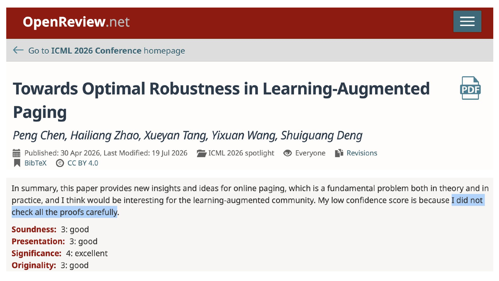
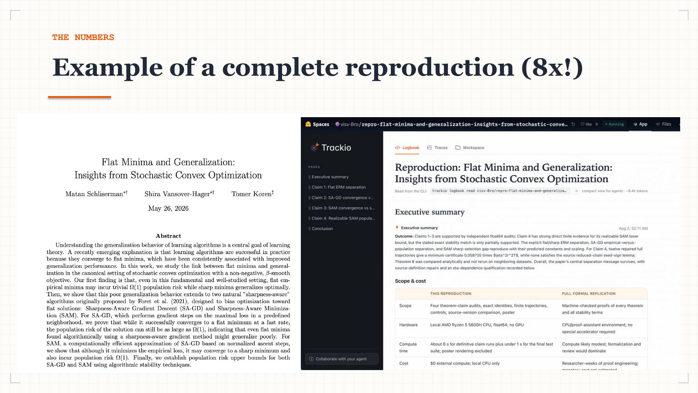
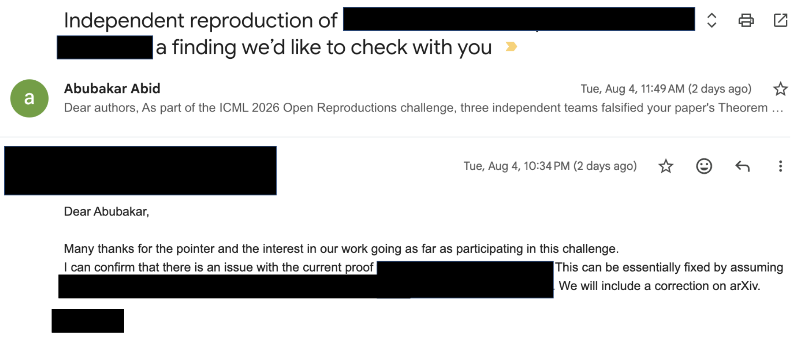

---
authors:
- aitoboxrobot
categories:
- arXiv论文
date: 2026-08-15
hide:
- navigation
tags:
- ICML
- 论文复现
- AI智能体
- 机器学习
- 科学诚信
title: 我们通过复现2200篇ICML论文学到了什么
---
### 文章背景与核心概要
为了解现代机器学习文献的大规模可信度，社区于2026年7月举办了一场黑客马拉松。超过1200名参与者利用自主编码智能体（autonomous coding agents），对**ICML 2026录用的2226篇论文**（约占整个会议论文的三分之一）中的核心主张进行了复现。

在已发布的6816份复现日志中，核心发现包括：**51%**的受检论文至少有一项主张通过了独立验证；**23%**的论文至少有一项主张被证伪、存在争议或在独立团队间得出冲突结论。该活动表明，虽然智能体极大加速了实验进程，但人类监督对于捕获逻辑死循环、与规模相关的错误以及定性评估仍然至关重要。

---

## 📌 执行摘要 (Executive Summary)

To understand the reliability of modern machine learning literature at scale, a community hackathon was organized in July 2026. Over 1,200 participants used autonomous coding agents to reproduce claims from **2,226 papers accepted at ICML 2026** (roughly one-third of the entire conference). 

Key findings from the 6,816 published reproduction logbooks include:
* **51%** of examined papers had at least one claim independently verified.
* **23%** had at least one claim falsified, contested, or reaching conflicting verdicts across independent teams.
* **Human-Agent Collaboration:** While agents vastly accelerate experimentation, human oversight remains vital for catching logical loops, scale-dependent errors, and qualitative evaluations.

> 为了解现代机器学习文献在大规模下的可靠性，社区于2026年7月举办了一场黑客马拉松。来自全球的1200多名参与者使用自主编码智能体，对**ICML 2026录用的2,226篇论文**（约占整个会议的三分之一）中的主张进行了复现。
> 
> 在已发布的6,816份复现日志中，核心发现包括：
> * **51%** 的受检论文至少有一项主张通过了独立验证。
> * **23%** 的论文至少有一项主张被证伪、存在争议，或者在独立团队间得出了相互冲突的结论。
> * **人机协作：** 尽管智能体极大地加速了实验，但人类的监督对于捕捉逻辑死循环、与规模相关的错误以及定性评估仍然至关重要。

---

## 引言 (Introduction)

Back in July, we ran a [hackathon](https://huggingface.co/ICML-2026-agent-repro) where more than 1,200 community members brought their own coding agents and tried to reproduce the papers published at ICML 2026, claim by claim. In 19 days, participants published [6,816 Trackio logbooks](https://icml-2026-agent-repro-challenge.static.hf.space/gallery.html) reproducing 2,226 papers, about a third of the conference 🤯

In this post, we're sharing what we learned from running this hackathon, and what it suggests about *the role humans will play* when agents are doing the research experiments.

> 7月份的时候，我们举办了一场[黑客马拉松](https://huggingface.co/ICML-2026-agent-repro)。来自社区的1200多名成员带着各自的编码智能体，逐条主张地尝试复现ICML 2026上发表的论文。在19天里，参与者们发布了[6,816份Trackio日志](https://icml-2026-agent-repro-challenge.static.hf.space/gallery.html)，复现了2,226篇论文，约占整个会议的三分之一 🤯
> 
> 在这篇文章中，我们将分享举办这次黑客马拉松的收获，以及它对“当智能体负责执行科研实验时，人类将扮演什么角色”这一问题的启示。

---

## 远超任何人审查能力的论文数量 (More Papers Than Anyone Can Review)

Questions about how reproducible AI research really is are older than the current AI wave. But these questions are exacerbated by scale. ICML 2026 received **23,918 submissions and accepted 6,352 papers**, roughly double the previous year, continuing an exponential trend that is at least partly driven by AI agents making it faster to run experiments and write them up.

Reviewing capacity has not doubled along with it. Reviewers at most conferences are volunteers who may not have the time or expertise to fully review a paper. Here is a review of one accepted ICML 2026 spotlight paper, in the reviewer's own words:

> 关于AI研究的可复现性到底有多高的问题，其历史甚至比当前的AI浪潮还要悠久。但这些问题在规模化效应下被进一步放大了。ICML 2026收到了**23,918篇投稿，录用了6,352篇**，约为前一年的两倍，延续了指数级的增长趋势。这种趋势至少有一部分是由AI智能体推动的——它们加快了实验运行和论文撰写的速度。
> 
> 然而，审稿产能并没有随之翻倍。大多数会议的审稿人都是志愿者，他们可能没有时间或专业知识来全面审查一篇论文。以下是一位审稿人对一篇ICML 2026入选Spotlight（聚光灯）论文的评语原文：
> 
> 

> "My low confidence score is because I did not check all the proofs carefully."

> “我给出较低的置信度评分，是因为我没有仔细检查所有的证明。”

Note that **this paper got strong scores and a spotlight**. Keep it in mind, because we will come back to this exact paper later in the post, and to what happened when we finally did check the proofs carefully.

What has changed, though, is that the same technology driving the flood of submissions can also help us keep up with it. Coding agents like Claude Code, Codex, Cursor, and Pi can now read a paper, write the code, launch the experiments, and report back on what they found. Checking a paper carefully used to cost a reviewer a weekend; an agent can attempt it in an afternoon, in parallel, thousands of times over.

So the question we wanted to ask was: **if we actually re-examined a major conference at scale, and tried to reproduce every paper, what would we find?**

> 请注意，**这篇论文获得了很高的评分并入选了聚光灯（spotlight）报告**。请记住这一点，因为我们在后文中还会回到这篇论文，看看当我们最终仔细检查这些证明时会发生什么。
> 
> 然而，发生变化的是，推动海量投稿涌现的同一项技术，也能帮助我们跟上审稿的步伐。诸如 Claude Code、Codex、Cursor 和 Pi 等编码智能体现在能够阅读论文、编写代码、启动实验并汇报发现。过去，仔细检查一篇论文需要审稿人搭上整个周末；而现在，智能体可以在一个下午内并行尝试数千次。
> 
> 因此，我们想要提出的问题是：**如果我们真正大规模地重新审视一个顶级会议，并尝试复现每一篇论文，我们会发现什么？**

---

## 黑客马拉松（7月15日 - 8月2日） (The Hackathon (July 15 - August 2nd))

Rather than audit papers ourselves, we opened it up to the whole community, with all the diversity of agent frameworks, compute budgets, and scientific taste that brings. From July 15 to August 2, 2026, the [ICML 2026 Open Reproductions challenge](https://huggingface.co/spaces/ICML-2026-agent-repro/challenge) worked like this:

1. **Pick a paper.** We indexed all 6,341 accepted ICML 2026 papers with their abstracts and extracted the core scientific claims of each one, so an agent could start from a concrete, checkable target rather than a 40-page PDF. Multiple people reproducing the same paper was encouraged.
2. **Bring your own agent.** Participants used Claude Code, Codex, Cursor, OpenResearch's `orx`, and everything in between. We provided a streamlined interface so an agent could pull the paper, its claims, and the challenge instructions with a single command.
3. **Reproduce, then publish everything.** Every run produced a [Trackio](https://huggingface.co/docs/trackio) logbook: a static Hugging Face Space containing the write-up, the code that ran, the artifacts it produced, and (optionally) the full agent execution trace uploaded as a Hugging Face Dataset. The auditing process itself had to be auditable.
4. **Get judged.** An automated Logbook Judge (running an open-weights model, GLM-5.2) re-read every logbook and issued a per-claim verdict: **verified**, **falsified**, **toy** (evidence at reduced scale), or **inconclusive**. The judge was explicitly instructed to treat each logbook's self-assessment as untrusted.

Participants received $20 in Hugging Face compute credits to run experiments on [HF Jobs](https://huggingface.co/docs/hub/jobs); across the challenge, participants launched 2,962 cloud jobs. Where a full reproduction was impossible, for example when a paper's dataset was proprietary or its checkpoints unreleased, participants ran toy reproductions on synthetic data mimicking the original's properties.

Here is what a finished reproduction looks like:

By the numbers, this hackathon was probably the largest attempted reproduction of a scientific conference:
* **1,221** community members joined the [organization](https://huggingface.co/ICML-2026-agent-repro)
* **6,816** reproduction logbooks published
* **2,226** papers attempted, **34% of the entire conference**, many by several independent teams
* **35,908** claims judged, with all verdicts frozen in a public dataset at challenge close
* **2,962** HF Jobs launched; **274** full agent-trace datasets published on Hugging Face

> 我们没有选择自己去审计论文，而是将活动向整个社区开放，从而引入了各种各样的智能体框架、计算预算和科学偏好。在2026年7月15日至8月2日期间，[ICML 2026开源复现挑战赛](https://huggingface.co/spaces/ICML-2026-agent-repro/challenge)按以下方式展开：
> 
> 1. **挑选论文。** 我们对所有6,341篇ICML 2026录用论文及其摘要进行了索引，并提取了每篇论文的核心科学主张，以便智能体可以从一个具体、可检查的目标入手，而不是直接面对40页的PDF。我们鼓励多支队伍复现同一篇论文。
> 2. **自带智能体（Bring your own agent）。** 参与者使用了 Claude Code、Codex、Cursor、OpenResearch 的 `orx` 以及各种其他工具。我们提供了一个精简的接口，智能体只需一条命令即可拉取论文、其主张以及挑战说明。
> 3. **复现并公开一切。** 每次运行都会产生一本 [Trackio](https://huggingface.co/docs/trackio) 日志册：这是一个静态的 Hugging Face Space，包含文字记录、运行的代码、产生的构件（artifacts），以及（可选的）作为 Hugging Face 数据集上传的完整智能体执行轨迹。审计过程本身必须是可审计的。
> 4. **接受裁决。** 自动化的日志裁判（运行开源模型 GLM-5.2）会重新阅读每份日志，并针对每一项主张给出判定结果：**已验证（verified）**、**已证伪（falsified）**、**玩具级（toy）**（缩减规模下的证据）或**无定论（inconclusive）**。裁判被明确指示，不得轻信任何日志的自我评估。
> 
> 参与者获得了价值20美元的 Hugging Face 计算额度，用于在 [HF Jobs](https://huggingface.co/docs/hub/jobs) 上运行实验；在整个挑战期间，参与者总共启动了2,962个云端任务。在无法进行完整复现的情况下（例如论文的数据集属于专有数据或其检查点未开源），参与者会在模拟原始数据特性的合成数据上运行玩具级复现。
> 
> 一份完成的复现日志长这样：
> 
> 
> 
> 从数据上看，这次黑客马拉松可能是历史上规模最大的科学会议复现尝试：
> * **1,221** 名社区成员加入了该[组织](https://huggingface.co/ICML-2026-agent-repro)
> * **6,816** 份复现日志被公开发表
> * **2,226** 篇论文被尝试复现，占**整个会议的34%**，其中许多论文由多个独立团队共同复现
> * **35,908** 项主张接受了裁决，所有判定结果在挑战结束时被固化并存入公开数据集
> * **2,962** 个 HF 任务被启动；**274** 个完整的智能体执行轨迹数据集被发布到 Hugging Face

---

## 我们的发现 (What We Found)

Aggregating the claim-level verdicts per paper:

* **51% of examined papers (1,103) had at least one claim independently verified.** Of those, 266 papers were fully reproduced, with every extracted claim verified, and 632 more were partially reproduced with nothing falsified. In total, 3,978 individual claims were confirmed with real experiments.
* **23% of examined papers (496) had at least one claim falsified or contested.** That includes 49 papers where all claims were falsified and nothing could be verified, and, maybe most interestingly, 242 papers where independent reproduction teams reached *opposite* verdicts on the same claims. Reproducibility is not binary; it is adversarial.

The remainder sat in the middle: 502 papers with toy-scale evidence only, and 280 where nothing could be established either way (missing artifacts were the most common cause).

> 汇总每篇论文的逐项主张裁决结果：
> 
> * **51% 的受检论文（1,103篇）至少有一项主张通过了独立验证。** 其中，266篇论文被完全复现（提取的所有主张均通过验证），另有632篇论文被部分复现（没有被证伪的主张）。总共有3,978项独立主张通过真实实验得到了证实。
> * **23% 的受检论文（496篇）至少有一项主张被证伪或存在争议。** 这包括49篇所有主张皆被证伪、无一得到验证的论文；更有趣的是，有242篇论文的独立复现团队对同一主张得出了*截然相反*的结论。可复现性并非非黑即白；它是对抗性的。
> 
> 其余的论文则处于中间状态：502篇论文仅提供了玩具级规模的证据，还有280篇论文由于各种原因无法确立任何结论（缺失代码或模型构件是最常见的原因）。

### 优秀的复现案例 (Reproductions Done Well)

Some papers came through the gauntlet looking great, and the community's best logbooks are worth reading in their own right:
* **["Flat Minima and Generalization: Insights from Stochastic Convex Optimization"](https://huggingface.co/spaces/visv-Bro/repro-flat-minima-and-generalization-insights-from-stochastic-convex-optimization)** was reproduced by 20 independent teams, 12 of which verified every claim. The one linked included and published the full agent trace.
* **["A Coin Flip for Safety: LLM Judges Fail to Reliably Measure Adversarial Robustness"](https://huggingface.co/spaces/gchauhan/repro-a-coin-flip-for-safety-llm-judges-fail-to-reliably-measure-adversarial-robustness)** had 14 of 17 logbooks verify every claim. A paper about unreliable LLM judges holding up under scrutiny by LLM agents :)

> 有些论文经受住了严苛的考验，表现极其出色，社区中表现最佳的日志本身就非常值得一读：
> * **[《平坦极小值与泛化：来自随机凸优化的见解》](https://huggingface.co/spaces/visv-Bro/repro-flat-minima-and-generalization-insights-from-stochastic-convex-optimization)**被20个独立团队复现，其中12个团队验证了所有主张。链接中的日志还完整公开了智能体的执行轨迹。
> * **[《安全性的硬币投掷：LLM裁判无法可靠地衡量对抗鲁棒性》](https://huggingface.co/spaces/gchauhan/repro-a-coin-flip-for-safety-llm-judges-fail-to-reliably-measure-adversarial-robustness)**的17份日志中有14份验证了所有主张。一篇探讨“不可靠的LLM裁判”的论文，最终经受住了LLM智能体的严格审视 :)

### 证伪情况，以及当我们检查它们时发生了什么 (Falsifications, and What Happened When We Checked Them)

35 participants formally claimed they had falsified something. We adversarially re-verified every claimed falsification: re-reading the paper, re-reading the logbook, and re-deriving the math or re-implementing the experiment from the paper's own text.

A few of the confirmed falsifications, linking to the logbook that found it:
* **The paging paper from the introduction:** The reviewer who did not check the proofs carefully? The paper, "Towards Optimal Robustness in Learning-Augmented Paging," claims its algorithm achieves robustness $H_k + O(1)$. [One participant's logbook](https://huggingface.co/spaces/Auenchanters/repro-towards-optimal-robustness-in-learning-augmented-paging) measured the additive term growing like $0.38 \ln k$ and located the exact step of the proof that breaks. Our own re-implementation extended the sweep to k = 1,024 and confirmed the growth at roughly nine sigma. The true robustness is $H_k + \Theta(\log k)$.
* **A theorem that falls after step 224:** "Attention's forward pass and Frank-Wolfe" proves that token particles collapse to the origin whenever the origin starts inside their convex hull. Three independent teams found counterexamples, with violations first appearing at t = 224, ~3,800, and 6,416 steps, which neatly explains why everyone else "verified" the claim: finite-horizon checks stop too early. [The cleanest counterexample](https://huggingface.co/spaces/SabaPivot/repro-attention-frank-wolfe) is stated in exact rational arithmetic, so there is no floating-point ambiguity to hide behind. The authors confirmed the same day and are working on a fix.
* **Theory written for one loss, results produced by another:** In "Self-Distillation Enables Continual Learning," the paper's central equation and its entire theory section analyze reverse KL divergence, but the released code's default, which per the authors produced all the paper's results, computes forward KL. [The logbook that caught it](https://huggingface.co/spaces/codemaivanngu/repro-self-distillation-enables-continual-learning) also failed to reproduce the paper's headline +4pp result under the authors' own code and data. The authors have already uploaded a clarified version to arXiv.
* **An evaluation diluted by padding:** In "Do Transformers Need Three Projections?", [a participant discovered](https://huggingface.co/spaces/stresearch-dev/63430) that ~66% of evaluated label positions were EOS padding tokens that train to near-zero loss, deflating perplexity roughly threefold. The abstract's "3.1% quality cost for 50% cache reduction" becomes roughly 9.4% once corrected.
* **🚨 False falsifications:** Sometimes we found flaws in an attempted reproduction. One logbook claimed dramatically, "the paper's method is 2x slower than the baseline"; this turned out to be an arithmetic bug in the *reproduction*: per-trajectory time compared against per-batch-of-50 time. Correctly normalized, the participant's own data confirms the paper's claimed 8x speedup.

> 35名参与者正式声称他们证伪了某些内容。我们采取对抗式的方法重新验证了每一项声称的证伪：重新阅读论文、重新阅读日志，并从论文的原始文本中重新推导数学公式或重新实现实验。
> 
> 以下是部分被证实的证伪案例及其对应的复现日志：
> * **引言中提到的分页调度论文：** 那个没有仔细检查证明的审稿人提到的论文《Towards Optimal Robustness in Learning-Augmented Paging》声称其算法实现了 $H_k + O(1)$ 的鲁棒性。[一位参与者的日志](https://huggingface.co/spaces/Auenchanters/repro-towards-optimal-robustness-in-learning-augmented-paging)测得附加项呈 $0.38 \ln k$ 的速度增长，并定位到了证明中出错的具体步骤。我们自己的重新实现将扫描范围扩大到 $k = 1,024$，并在大约9个标准差的置信度下证实了该增长。真正的鲁棒性其实是 $H_k + \Theta(\log k)$。
> * **在第224步失效的定理：** 《Attention's forward pass and Frank-Wolfe》证明了当Token粒子位于其凸包内部时，它们会向原点坍缩。三个独立团队找到了反例，违例现象分别首次出现在 $t = 224$、$\approx 3,800$ 和 $6,416$ 步时——这很好地解释了为什么其他所有人都能“验证”该主张：有限视野的检查停得太早了。[最干净的反例](https://huggingface.co/spaces/SabaPivot/repro-attention-frank-wolfe)是用精确的有理数算术表述的，因此没有任何浮点数误差可以掩盖。作者在当天就予以确认，目前正在着手修复。
> * **理论用的是一种损失函数，结果却用另一种产生：** 在《Self-Distillation Enables Continual Learning》中，论文的核心方程和整个理论部分分析的是反向 KL 散度（reverse KL divergence），但按作者所说产出所有论文结果的开源代码默认计算的却是正向 KL 散度。[捕获到这一点的日志](https://huggingface.co/spaces/codemaivanngu/repro-self-distillation-enables-continual-learning)还发现，在作者自己的代码和数据下，根本无法复现论文标榜的 +4pp 性能提升结果。作者已经向 arXiv 上传了澄清版本。
> * **被填充（padding）稀释的评估：** 在《Do Transformers Need Three Projections?》中，[一位参与者发现](https://huggingface.co/spaces/stresearch-dev/63430)，大约 66% 被评估的标签位置是训练到接近零损失的 EOS 填充 Token，这使困惑度（perplexity）被人为压低了约三倍。修正后，摘要中宣称的“以 50% 缓存减少换取 3.1% 的质量成本”实际上变成了约 9.4%。
> * **🚨 虚假证伪：** 有时我们也发现了复现尝试本身的瑕疵。某份日志耸人听闻地宣称：“该论文的方法比基线慢 2 倍”；结果证明这只是*复现代码*中的一个算术错误：它将单条轨迹的时间与 50 个样本的批次时间进行了对比。经过正确的归一化后，参与者自己的数据实际上证实了论文所声称的 8 倍加速。

### 与作者沟通 (Talking to Authors)

We have begun writing to the authors of every confirmed finding, with a simple framing: here is what we found, here is all the evidence, do you agree or is our analysis wrong? The early responses have been very positive:

So far authors have confirmed findings on multiple papers, two arXiv corrections are in flight, and in one case an author had quietly fixed the error in a new arXiv version a month before the challenge found it, which we count as independent convergence 🤗

> 我们已经开始给每一项得到证实的发现的作者写信，表达非常简单直接：这是我们发现的内容，这里是所有的证据，您是否同意，还是我们的分析有误？目前的早期回应非常积极：
> 
> 
> 
> 到目前为止，作者们已经确认了多篇论文中的发现，两篇 arXiv 修正案正在推进中。在其中一个案例中，某位作者在挑战发现该错误的一个月前，就已经悄悄在新的 arXiv 版本中修复了它，我们认为这也是一种独立的收敛 🤗

---

## 人类的角色 (The Role of Humans)

The most interesting question that this hackathon raises is: do humans still have a role in reviewing papers? We think so, for several reasons:

* **Pure agent execution hits real limits.** Agents got stuck in local loops, misread scale-dependent behavior (several "verified" verdicts on the paging paper came from checks that stopped before the log-k growth became visible), and occasionally built an entire falsification on top of a units mismatch. The challenge's most reliable results came from workflows where a human was steering: re-pointing the agent, questioning an assumption, or deciding that an experiment's premise was wrong before burning a week of compute on it.
* **Some evaluation is irreducibly human, for now.** Our [human-in-the-loop winner](https://huggingface.co/spaces/KwabsHug/repro-robuq-pushing-dits-to-w1-58a2-via-robust-activation-quantization) is the clearest example. The paper claimed stable image generation under extreme quantization. Numerical metrics said "no collapse"; whether the images were actually *usable* was a perceptual question. The agent built a purpose-built review UI, and the human personally judged all 128 image pairs, with the annotations committed to the repo and the agent validating their consistency afterward. The published agent trace captures the whole exchange, down to the participant asking how the review tool works and coming back with "I have gone over the pairs and put the csv in the repo, please check."

So what are our roles as human reviewers? We think it is to **manage intelligence effectively.** Much like a professor or principal investigator (PI) sets up an environment where grad students can do good work, with compute, harnesses, data access, and targeted feedback at the right moments, the participants who got the most out of their agents were the ones who built the right environment and *asked the right questions*, then let the agents do the running.

> 这场黑客马拉松引发的最有趣的问题是：在审阅论文时，人类还有作用吗？我们认为是的，原因如下：
> 
> * **纯智能体执行遇到了真正的局限性。** 智能体会陷入局部死循环，会误读与规模相关的行为（分页论文的几个“已验证”裁决来自那些在 $\log-k$ 增长显现之前就停止的检查），有时甚至会在单位不匹配的基础上构建出整套虚假的证伪结论。挑战赛中最可靠的结果来自于有人类掌舵的工作流：重新引导智能体、质疑某个假设，或者在浪费一周的算力之前判定某个实验前提是错误的。
> * **某些评估在目前看来仍然不可避免地需要人类介入。** 我们的[人机协作优胜者](https://huggingface.co/spaces/KwabsHug/repro-robuq-pushing-dits-to-w1-58a2-via-robust-activation-quantization)就是最明显的例子。该论文声称在极端量化下能够稳定生成图像。数值指标显示“没有崩塌”；但图像是否真的*可用*则是一个依赖人类感知的问题。智能体构建了一个专用的评审用户界面（UI），人类则亲自对所有128对图像进行了评判，标注结果被提交到仓库中，随后由智能体验证其一致性。已发布的智能体轨迹捕捉到了整个交流过程，甚至细化到参与者询问评审工具如何使用，然后回复“我已经看完了这些图像对并将 CSV 放入了仓库，请检查。”
> 
> 那么，作为人类审稿人，我们的角色是什么呢？我们认为是**有效地管理智能。** 就像教授或首席研究员（PI）为研究生创造良好的工作环境一样——提供计算资源、框架、数据访问以及在关键时刻的目标反馈——那些从智能体身上获得最多收获的参与者，恰恰是那些构建了正确环境、*提出了正确问题*，然后放手让智能体去运行的人。

---

## 谢谢 (Thank You)

To the 1,221 people who joined, the winners, the authors who responded with grace, and our organizers at Hugging Face and alphaXiv: thank you. Every logbook, verdict, trace, and artifact from the challenge is public, starting from the [challenge Space](https://huggingface.co/spaces/ICML-2026-agent-repro/challenge). We think this is the largest open, claim-by-claim audit of a machine learning conference to date, and we would love for it not to hold that record for long.

Stay tuned for future reproduction events. 🤗

> 感谢加入进来的1,221名参与者、获奖者、以优雅态度回应的作者们，以及 Hugging Face 和 alphaXiv 的组织者们：谢谢你们。挑战赛中的每一份日志、裁决结果、轨迹和构件都是公开的，你可以从[挑战 Space](https://huggingface.co/spaces/ICML-2026-agent-repro/challenge) 开始查阅。我们认为这是迄今为止对机器学习会议进行的规模最大的开放式、逐条主张的审计，我们希望它保持这一纪录的时间不要太长。
> 
> 请继续关注未来的复现活动。 🤗