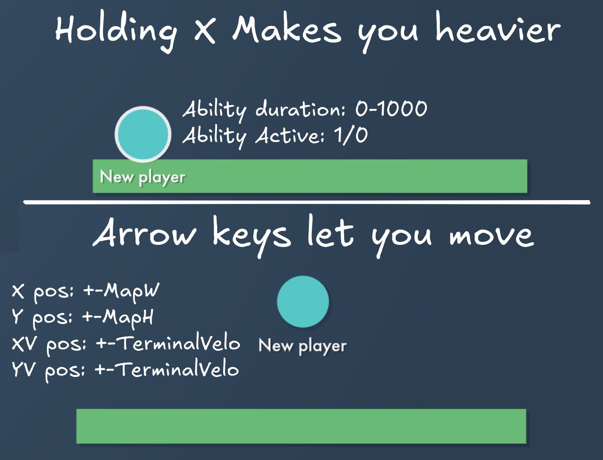
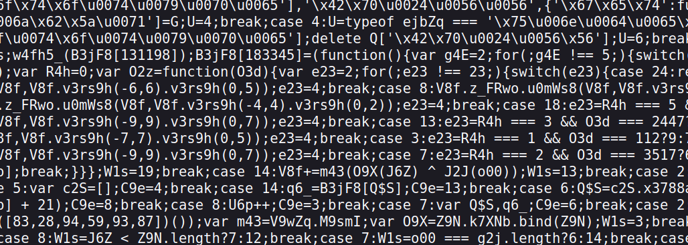
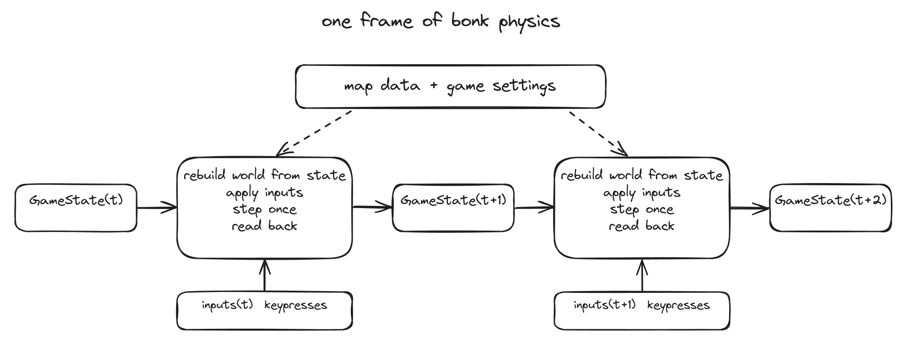
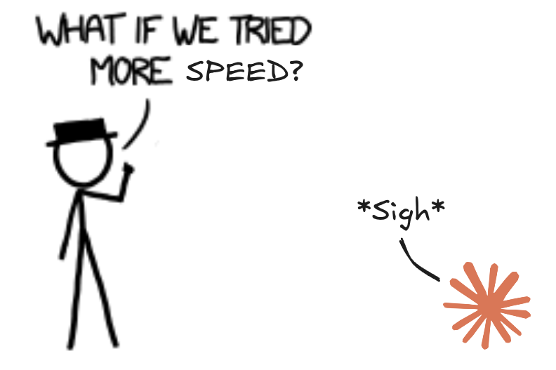
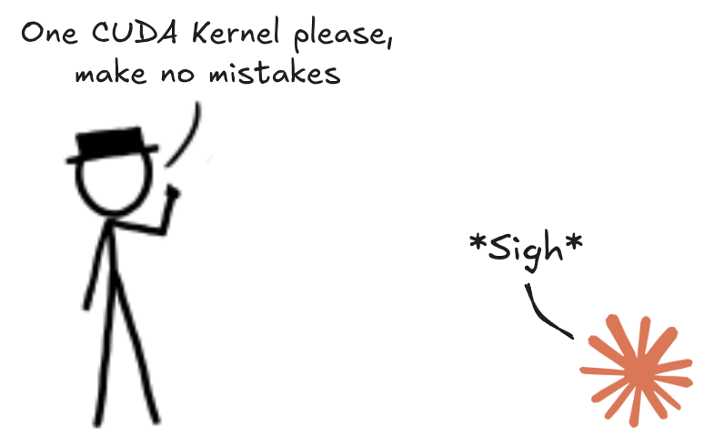
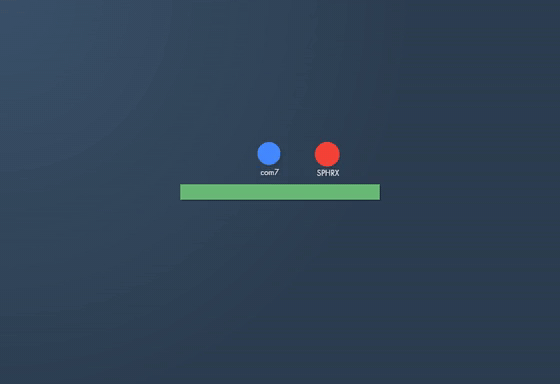

---
authors:
- aitoboxrobot
categories:
- 研究解读
date: 2026-08-16
hide:
- navigation
tags:
- 强化学习
- 游戏AI
- Rust
- PPO
- 逆向工程
title: 训练强化学习模型玩转 Bonk.io
---
### 文章背景与核心概要
本项目详细记录了训练一个神经网络以精通基于物理引擎的网页游戏《Bonk.io》的全过程。由于该游戏使用了高度混淆的 JavaScript 代码，作者通过逆向工程提取了其物理引擎，并将其移植到 Rust 中以实现高性能模拟，从而克服了传统浏览器自动化训练速度过慢的瓶颈。

在训练架构上，作者利用 PPO（近端策略优化）算法结合 CUDA 加速，构建了一个高效的强化学习环境。通过引入联赛机制（League System）让智能体与自身历史版本及专门设计的“对抗者”进行博弈，该模型最终达到了极高的竞技水平，在实时 Elo 排名中位列前茅。

---

## 挑战
《Bonk.io》是一款类似相扑的物理游戏，看似简单却拥有极高的技术上限。为了训练出一个有效的模型，我需要一个能够让智能体进行数百万次自我对战的环境。

> *Bonk.io* is a sumo-style physics game that appears simple but possesses a high skill ceiling. To train an effective model, I needed an environment where the agent could play millions of games against itself. 

输入空间需要追踪玩家的位置、速度和游戏状态，而输出则需要管理移动和“重击”（heavy）机制。

> The input space requires tracking player positions, velocities, and game states, while the output requires managing movement and "heavy" mechanics.

## 构建训练框架
该游戏基于 *Box2DWeb* 构建，并受到 *JScrambler* 的保护，因此代码高度混淆。

> The game is built on *Box2DWeb* and protected by *JScrambler*, making it highly obfuscated. 

### 浏览器操作
虽然使用受控浏览器是最直接的方法，但对于强化学习来说太慢了。训练需要数十亿帧的数据；以 30 FPS 计算，单个浏览器标签页需要十多年才能生成足够的数据。

> While using an instrumented browser is the most straightforward approach, it is too slow for reinforcement learning. Training requires billions of frames; at 30 FPS, a single browser tab would take over a decade to generate sufficient data.

### 物理引擎重构
该游戏使用确定性的锁步网络（lockstep networking），这意味着物理引擎是一个纯函数。我意识到我不需要模拟浏览器，只需要提取引擎即可。

> The game uses deterministic lockstep networking, meaning the physics engine is a pure function. I realized I didn't need to simulate the browser; I just needed to extract the engine.

## 窃取物理引擎
在 [Ciaran](https://exploit.cat/about/ciaran/) 的帮助下，我们对客户端代码进行了去混淆。我发现游戏每一帧都是根据 JSON 状态从零开始重建物理世界的。这让我可以将引擎视为一个纯函数来处理。

> With the help of [Ciaran](https://exploit.cat/about/ciaran/), we deobfuscated the client code. I discovered that the game recreates the physics world from scratch every frame based on a JSON state. This allowed me to treat the engine as a pure function.

*有趣的事实：玩家的摩擦系数是 **0.001337**！*

> *Fun fact: The player's friction constant is **0.001337**!*

## 速度与优化
为了最大化训练速度，我将物理引擎移植到了 Rust。通过镜像原始 JavaScript 的浮点表达式和舍入逻辑（使用游戏的 `SafeTrig` 工具），我在 1,961 张测试地图上实现了 100% 的位级一致性。

> To maximize training speed, I ported the physics engine to Rust. By mirroring the original JavaScript's float expressions and rounding logic (using the game's `SafeTrig` utilities), I achieved 100% bit-identical parity across 1,961 test maps.

## 训练大脑
最终的训练设置使用 TypeScript 和 Bun，并通过 FFI 加载 Rust 引擎。

> The final training setup uses TypeScript and Bun, with the Rust engine loaded via FFI. 

*   **推理：** 我放弃了 TensorFlow.js，转而使用自定义的 PPO CUDA 内核，这显著降低了开销。
*   **状态表示：** 机器人处理 385 个浮点数，包括历史记录、墙壁接近度的射线投射以及速度数据。
*   **联赛系统：** 为了防止机器人陷入弱势策略，它会与过去版本、当前自我以及专门训练用于击败它的“剥削者”进行混合对战。

> *   **Inference:** I moved away from TensorFlow.js to custom CUDA kernels for PPO, which significantly reduced overhead.
> *   **State Representation:** The bot processes 385 floats, including history, raycasts for wall proximity, and velocity data.
> *   **League System:** To prevent the bot from settling into weak strategies, it plays against a mix of its past versions, its current self, and "exploiters" trained specifically to beat it.

## 当前状态
该机器人目前的表现非常出色。在实时 Elo 表中，它在 522 名被追踪的玩家中排名第 5，能够持续击败休闲玩家，并与顶级人类选手抗衡。

> The bot is currently performing exceptionally well. On a live Elo table, it sits 5th out of 522 tracked players, consistently beating casual players and holding its own against top-tier human competitors.

*非常感谢 [legendboss123](https://github.com/LEGENDBOSS123) 在本项目中对我的指导，并为预训练提供了游戏内回放数据。*

> *Big thank you to [legendboss123](https://github.com/LEGENDBOSS123) for guiding me on this project and providing in-game replays for pretraining.*