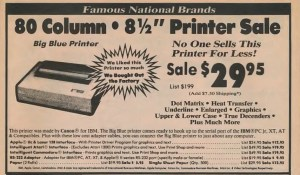
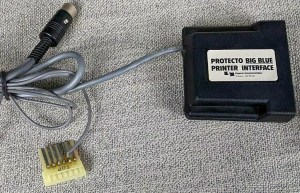

---
authors:
- aitoboxrobot
categories:
- 工具教程
date: 2026-08-17
hide:
- navigation
tags:
- IBM
- 打印机
- 复古计算
- 硬件历史
- 佳能
title: IBM PC 紧凑型打印机 5181 型号
---
### 文章背景与核心概要
本文介绍了 IBM PC 紧凑型打印机（5181 型号）的历史。这款最初由佳能为 IBM PCjr 设计的打印机，在 20世纪 80 年代迎来了它的“第二春”，变身为一款大幅折扣、高度通用的经济型打印机。它在全球范围内以各种别名销售——如美国的 Protecto“大蓝打印机（Big Blue Printer）”和英国的迪克森（Dixons）“串口 8056（Serial 8056）”——并被广泛适配到 Commodore 64、Apple II 和 Sinclair ZX Spectrum 等非 IBM 计算机上。

尽管该打印机极其可靠且购买便宜，但它有一个明显的缺点：它依赖昂贵的热敏纸，而不是传统的色带。通过深入探讨其定价、别名、兼容性及热敏打印的优缺点，本文还原了早期个人电脑普及浪潮中一段有趣的硬件清仓与跨平台适配历史。

---

# IBM PC Compact Printer Model 5181

*By Dave Farquhar | August 15, 2026*

---

## Summary

IBM PC 紧凑型打印机（5181 型号）最初由佳能为 IBM PCjr 制造，在 20 世纪 80 年代迎来了它的第二春，变身为一款大幅降价且高度通用的经济型打印机。它在全球以各种别名销售——比如美国 Protecto 的“大蓝打印机（Big Blue Printer）”和英国迪克森（Dixons）的“串口 8056（Serial 8056）”——并被广泛改装以支持 Commodore 64、Apple II 和 Sinclair ZX Spectrum 等非 IBM 计算机。尽管它异常可靠且购买便宜，但也有一个明显的缺点：它依赖昂贵的热敏纸，而不是传统的墨带。

> ## Summary
>
> The IBM PC Compact Printer (Model 5181), originally built by Canon for the IBM PCjr, found a second act in the 1980s as a heavily discounted, highly versatile budget printer. Sold under various aliases worldwide—such as Protecto's "Big Blue Printer" in the US and Dixons' "Serial 8056" in the UK—it was widely adapted for non-IBM computers like the Commodore 64, Apple II, and Sinclair ZX Spectrum. Though exceptionally reliable and cheap to purchase, it came with a notable catch: it relied on expensive, heat-sensitive thermal paper rather than traditional ink ribbons.

---

## Introduction

IBM PC 紧凑型打印机这个名字其实有点名不副实，因为它原本是为 PCjr 设计的。但作为其“第二春”的一部分，它最终也能够与许多其他计算机一起工作。以下是关于 IBM 廉价的 5181 型打印机的故事，根据清仓商贩和发售大洲的不同，它还有一些别名，包括“大蓝打印机（Big Blue Printer）”和“串口 8056 紧凑型打印机（Serial 8056 Compact Printer）”。

PCjr 专家迈克·布特曼（Mike Brutman）曾推测，IBM 并没有卖出很多这样的打印机，它们最终落入了其他转售商手中，并被改装用于其他用途。我完全可以证实这款打印机确实被重新用于其他计算机。20世纪 80 年代中期，我曾在 Commodore 64 上使用过 IBM PC 紧凑型打印机，我还记得当时的情景。

> ## Introduction
>
> The IBM PC Compact Printer is a bit of a misnomer, as it was really intended for the PCjr. But it ended up working with a bunch of other computers as well as part of its second act. Here’s the story of IBM’s inexpensive model 5181 printer, which also went by some aliases, including the Big Blue Printer and the Serial 8056 Compact Printer, depending on who was liquidating it and on which continent.
> 
> PCjr expert Mike Brutman has speculated that IBM didn’t sell a lot of these printers and they ended up in the hands of other resellers who adapted them for other purposes. I can absolutely confirm this printer got repurposed for other computers. I used an IBM PC Compact Printer with my Commodore 64 in the mid-1980s, and I remember the circumstances.

## The IBM 5181’s Alias: The Protecto Big Blue Printer

Protecto sure did their best to hype up this surplus low end IBM printer in this vintage 1987 ad. They offered interfaces for many popular computers of the era. And they sold it for up to $70 less than Computer Reset charged.

我们在 1984 年 12 月买第一台电脑 Commodore 64 时，就遇到了它。如果你感兴趣的话，它的故事已经在博客上链接过了。随捆绑销售的打印机保修期很短，没多久就坏了，而且不值得维修。我们当时不知道自己会多频繁地使用打印机，所以我们决定在摸清实际打印需求之前，尽可能便宜地买个替代品。

Protecto Enterprizes 是芝加哥附近的一家大型邮购经销商，正好有这方面的货源。他们把这台机器叫做“大蓝打印机（Big Blue Printer）”。我们买的时候价格是 40 美元，听起来简直像个奇迹。它是佳能为 IBM PC 和 PCjr 制造的，他们还提供了适配器使其能够与其他计算机（包括 Commodore）协同工作。适配器售价约为 20 美元。所以花 60 美元，你就能拥有一台打印机了。

根据广告显示，考虑到该打印机最初的零售价为 199 美元，这似乎是一笔划算的买卖。布特曼说它的零售价是 175 美元，我倾向于相信他。Protecto 广告中的零售价有时需要打个折扣来看。

这款打印机被贴上了 IBM 5181 的新标签。Protecto 用他们自己的长方形标签覆盖了原本属于 IBM 徽标的区域。背面的贴纸显示其原始型号为 5181001，FCC ID 为 AZD9MA5181001，并标明产地为日本，不过我们的机器上没有提到 IBM。我见过一些仍然贴有“为 IBM 制造”字样贴纸的机器。

即便加上适配器，这也是 20 世纪 80 年代中期市场上最便宜的打印机。我们说的是几乎你能找到的其他任何东西（包括其他无品牌的清仓特价品）价格的 1/2 到 1/3。

我记得它的价格有所波动，而且我还记得他们对这东西进行了大力的广告宣传。有时他们会把价格提到 50 美元，有时又会降到 30 美元，随着十年代的推移尤其如此。是的，这批库存确实维持了好几年。

既然花了几年时间才把这批仅占原价一小部分的库存卖光，那里面肯定有什么猫腻。在我们谈论“大蓝打印机”的英国别名之后，我会详细说明这一点。

> ## The IBM 5181’s Alias: The Protecto Big Blue Printer
>
> 

> 
> 
Protecto sure did their best to hype up this surplus low end IBM printer in this vintage 1987 ad. They offered interfaces for many popular computers of the era. And they sold it for up to $70 less than Computer Reset charged.

> 

>
> We got our first computer, a Commodore 64, in December 1984. Its story is linked on the blog if you’re interested. The bundled printer had a short warranty and broke soon after, and wasn’t worth repairing. We didn’t know how much we would use a printer, so we opted to replace it as cheaply as we could while we figured out how much we would actually print.
> 
> Protecto Enterprizes, a large mail order dealer near Chicago, had just the thing. They called it the Big Blue Printer. It cost $40 when we got it and it sounded like a miracle. It was made by Canon for the IBM PC and PCjr, and they had adapters to make it work with other computers, including a Commodore. The adapter cost around $20. So for $60, you had a printer.
> 
> Considering the printer originally retailed for $199, according to the ad, it seemed like a great deal. Brutman says it retailed for $175, and I’m inclined to believe him. The retail prices in Protecto ads needed to be taken with a grain of salt sometimes.
> 
> The printer was rebadged IBM 5181. Protecto put their own rectangular label over the area where the IBM badge went. A sticker on the back revealed the original model number of 5181001, FCC ID AZD9MA5181001, and stated it was made in Japan, though there was no mention of IBM on ours. I have seen some that still had a sticker saying it was manufactured for IBM.
> 
> Even with the adapter, this was the cheapest printer on the market in the mid-1980s. We’re talking 1/2 to 1/3 the price of almost anything else you could find, including other no-name closeout specials.
> 
> I remember the price varying, and I remember them advertising the thing heavily. Sometimes they raised the price to $50, and sometimes they would lower it to $30, especially as the decade wore on. And yes, the inventory did last several years.
> 
> Since it took years to sell through the inventory at a fraction of its original cost, there must have been a catch. More on that after we talk about the Big Blue Printer’s British alias.

## The Serial 8056 Printer

在英国，IBM PC 紧凑型打印机变成了“串口 8056 紧凑型打印机（Serial 8056 Compact Printer）”，由高街电子零售商迪克森（Dixons）销售，用于 Amstrad 和 Sinclair 计算机。迪克森有时还会将其与 Sinclair QL 捆绑销售。英国计算机杂志对串口 8056 进行了相当多的报道，分享了技术细节，以帮助 Sinclair 和 Amstrad 用户充分利用该打印机。它通常带有适配器，可将 PCjr 串口插头转换为适用于其他计算机的适当连接器，例如 QL 使用的电话式连接器。

串口 8056 上的贴纸掩盖了它的出身，只标明它产于日本。贴纸上包含“SERIAL 8056”字样，标明它在 240 伏和 50 赫兹下运行，并带有通常的安全警告：切勿打开设备，并使用 3 安培保险丝进行保护。

我也见过带有 5 针 DIN 插头的串口 8056 打印机，可用于 ZX Spectrum 128。至于这项改装是由迪克森、最终用户还是其他人完成的尚不清楚，但卸下定制的 PCjr 串口插头并换成更常见的插头并不是一件非常困难的改装。

它完全有可能在英国的其他计算机上也得到了使用，因为它价格便宜、随处可买并且使用 RS-232 标准。它只是有一个看起来很滑稽的插头，但更换起来既便宜又容易。就像在美国一样，源源不断且便宜的打印机让廉价的家用电脑变得更加实用。

> ## The Serial 8056 Printer
>
> In the UK, the IBM PC Compact Printer became the Serial 8056 Compact Printer, sold by high-street electronics retailer Dixons for use with Amstrad and Sinclair computers. Dixons sometimes bundled it along with a Sinclair QL. UK computer magazines covered the Serial 8056 fairly heavily, sharing technical details to help Sinclair and Amstrad owners get the most out of the printer. It typically came with an adapter to convert the PCjr serial plug into an appropriate connector for other computers, such as the telephone-style connector the QL used.
> 
> The Serial 8056’s sticker concealed its origins, except to say it was made in Japan. The sticker contained the words SERIAL 8056, stated it ran at 240 volts and 50 Hz, and had the usual safety warnings not to open the device and to protect it with a 3 amp fuse.
> 
> I’ve also seen Serial 8056 printers with a 5-pin DIN plug on it for use on a ZX Spectrum 128. Whether Dixons, an end user, or someone else made the modification is unclear, but removing the bespoke PCjr serial plug and replacing it with a more common plug wouldn’t be a terribly difficult modification.
> 
> It’s entirely possible it saw use with other UK computers as well, because it was inexpensive, readily available, and used the RS-232 standard. It just had a funny looking plug, but that was cheap and easy to change. And just like the USA, a ready supply of cheap printers made inexpensive home computers more useful.

## The Catch with the IBM 5181 / Big Blue Printer / Serial 8056

无论你叫它什么名字，这款打印机既实惠又多功能。所以肯定有什么猫腻。我可以证实，确实有猫腻，而且不仅仅是它每秒 50 个字符的缓慢打印速度——这只有 20 世纪 80 年代典型打印机速度的一半到三分之一。

### Print Quality

由于稍后会说明的原因，我没有保留任何打印件，但它的分辨率约为每英寸 70 点。文本是可读的，而且与它竞争的一些打印机不同，像小写字母 g 和小写字母 y 这样的字母尾巴确实延伸到了基线以下，而不是尴尬地悬浮在基线上方。按现代标准来看，这些文本看起来很粗糙，在 1984 年或 1985 年也赢不了任何奖项。但以当时的眼光来看，它的打印质量是可以接受的。

### The Paper

另一个猫腻是纸张。IBM PC 紧凑型打印机/大蓝打印机使用的是热敏纸，就像早期的传真机或收银机一样。这种纸的层与层之间浸渍了墨水，热量会激活它，使其显现出来。这意味着打印机本身不需要色带、墨粉或任何其他类型的墨水。墨水是纸张的一部分。

问题在于纸张很贵。它的价格是当时更常规打印机使用的连续折叠纸的两倍。它可以使用像传真机那样的纸卷，并且可以在内部容纳一个纸卷，不过 IBM 也提供带穿孔的单页纸。Protecto 也延续了这一点，他们可能在纸张上赚到的钱比在打印机上赚到的还要多。*这就是*为什么他们如此喜欢这款打印机以至于买断了整个工厂的原因。

此外，纸张非常敏感。如果你把它暴露在热源下，它会完全变黑，而且墨水会随着时间推移而分解。几年后，墨水就会褪色，无法再阅读。

买这款打印机很便宜，但如果你经常使用它，经济账就不太划算了。

> ## The Catch with the IBM 5181 / Big Blue Printer / Serial 8056
>
> This printer, no matter what you called it, was affordable and versatile. So there must have been a catch. I can verify, indeed there was a catch, and not just its slow 50 character per second print speed, which was half to 1/3 the speed of typical printers in the 1980s.
> 
> ### Print Quality
> 
> I don’t have any surviving printouts, for reasons I’ll get to in a minute, but the resolution was around 70 dots per inch. The text was readable, and unlike some printers it competed with, the tails of characters like the lowercase g and lowercase y did extend below the baseline, rather than sitting awkwardly elevated on the baseline. The text looked crude by modern standards and wouldn’t win any awards in 1984 or 1985. But by the standards of its day, its print quality was acceptable.
> 
> ### The Paper
> 
> The other catch was the paper. The IBM PC Compact printer / Big Blue Printer used thermal paper, just like an early fax machine or a cash register. The paper had ink impregnated in between its layers, and heat would activate it, making it visible. It meant you didn’t need ribbons or toner or any other kind of ink in the printer itself. The ink was part of the paper. 
> 
> The catch was the paper was expensive. It cost twice as much as fanfold paper for the more conventional printers of the day. It could use rolls like a fax machine and could hold a roll inside, but IBM offered perforated sheets as well. Protecto continued that, and they probably made more money on the paper than on the printers. *That’s* why they liked this printer so much they bought out the factory.
> 
> Furthermore, the paper was very sensitive. If you exposed it to heat, it could turn completely black, and the ink would break down over time. After a few years, the ink would fade and no longer be readable.
> 
> The printer was cheap to buy, but if you used it a lot, the economy wasn’t great.

## Compatibility

The IBM 5181 would work with a PC or an Apple II with a simple passive adapter cable. For use with Commodore and Atari computers, Protecto sourced interfaces that converted RS232 to those machines’ bespoke serial buses.

该打印机有一个非标准的 RS-232 连接器，但通过一根简单的电缆或适配器，它可以连接到 IBM PC、Apple II、Sinclair QL、Sinclair Spectrum 128 或任何其他带有 RS-232 端口的计算机的串口上。只要你的软件可以打印到串口，打印纯文本就不会有问题。图形可能会是个问题；它的图形模式类似于爱普生打印机，但兼容性各不相同。

Protecto 采购了适配器，使其能够与包括 Commodore 和 Atari 在内的其他机器配合使用。Commodore 适配器将 RS-232 转换为 Commodore 奇怪的 IEC 串口。Atari 适配器推测是将 RS-232 转换为 Atari SIO。Commodore 适配器模拟了 1525 打印机，包括 ASCII 到 PETSCII 的转换以及图形转换，使其能够与当时的流行软件一起工作，包括每个文字处理器和诸如 *Print Shop* 之类的程序。

Protecto 既单独出售该打印机，也将其与其它计算机捆绑销售。他们经常将 Commodore 64 或 Laser 128 与这款打印机以及他们能搜罗到的任何显示器捆绑在一起，有时还会附带第三方软盘驱动器。

如果你好奇为什么在 Computer Reset 上，其他 IBM PCjr 配件似乎都比 IBM PC 紧凑型打印机更容易买到，原因就在这里：Protecto 买下了大部分配件。我在 1992 年的 Computer Reset 目录中找到了一些 IBM 5181，标价 99 美元，这告诉我 Computer Reset 在某个时候也有一批货源——只是他们没有包揽*全部*。

> ## Compatibility
>
> 

> 
> 
The IBM 5181 would work with a PC or an Apple II with a simple passive adapter cable. For use with Commodore and Atari computers, Protecto sourced interfaces that converted RS232 to those machines’ bespoke serial buses.

> 

>
> The printer had a non-standard RS-232 connector, but with a simple cable or adapter, it could connect to a serial port on an IBM PC, Apple II, Sinclair QL, Sinclair Spectrum 128, or any other computer with an RS-232 port. Printing plain text wouldn’t have been a problem, as long as your software could print to the serial port. Graphics may have been a problem; its graphics mode was similar to Epson printers, but compatibility varied.
> 
> Protecto sourced adapters to make it work with other machines, including Commodore and Atari. The Commodore adapter converted the RS-232 to Commodore’s weird IEC serial interface. The Atari adapter presumably converted RS-232 to Atari SIO. The Commodore adapter emulated a 1525 printer, including ASCII to PETSCII translation and graphics translation, allowing it to work with popular software of the time, including every word processor and programs like *Print Shop*.
> 
> Protecto sold the printer separately and bundled with other computers. They would frequently bundle a Commodore 64 or Laser 128 with this printer and whatever monitor they could scrounge up, sometimes along with a third-party floppy drive.
> 
> If you wonder why every other IBM PCjr accessory seemed to be more readily available at Computer Reset than the IBM PC Compact Printer, this would be why: Protecto bought most of them. I found some IBM 5181s in a 1992 Computer Reset catalog, priced at $99, which tells me Computer Reset had a supply of them too at some point—they just didn’t get *all* of them.

## The Verdict

Protecto hyped up this printer more than even IBM had.

迈克·布特曼说得对：它并不是一台*糟糕*的打印机。物有所值，特别是如果你在十年后以 30 美元的特价买到一台，或者在购买电脑时作为赠品基本零成本打包带走的话。其他便宜的打印机，比如 Leading Edge Gorilla Banana 和 Commodore 1525，打印质量更差；它们的运行成本虽然更低，但看起来同样不够专业。

它也很可靠。当我拥有它的时候，我们用了好几年，打印机从来没有坏过。我在 90 年代初的一个电脑旧货市集上把它卖掉了。它当时依然能正常工作——只是在那个时候已经没有多大用处了。

这些打印机现在偶尔还会出现，但对老式打印机的需求并不大，而且大多数想要复古打印机的人已经拥有了比他们想要或需要的更多的设备。要价五花八门。我上次看到一台售出时，价格是 50 美元——如果不计通货膨胀，这比它们在 1987 年的价值还要高。我曾看到有人开价 100 美元甚至 150 美元买一台，这就实在太离谱了。

> ## The Verdict
>
> 

> 
> 
Protecto hyped up this printer more than even IBM had.

> 

>
> Mike Brutman is right: it wasn’t a *bad* printer. It was a reasonable deal for the money, especially if you got one on sale for $30 later in the decade, or bundled for essentially nothing when you purchased a computer. Other cheap printers like the Leading Edge Gorilla Banana and the Commodore 1525 gave worse print quality; they were cheaper to operate, but they looked just as unprofessional.
> 
> It was also reliable. When I had one, we used it for several years, and the printer never broke. I sold it in the early ’90s at a computer swap meet. It still worked—it just wasn’t useful for much at that point.
> 
> These printers do turn up from time to time, but there isn’t a lot of demand for old printers, and most people who want a vintage printer already have more than they want or need. Asking prices are all over the place. The last time I saw one sell, it went for $50—more than they were worth in 1987, ignoring inflation. I’ve seen people ask $100 or even $150 for one, and that’s way too much.