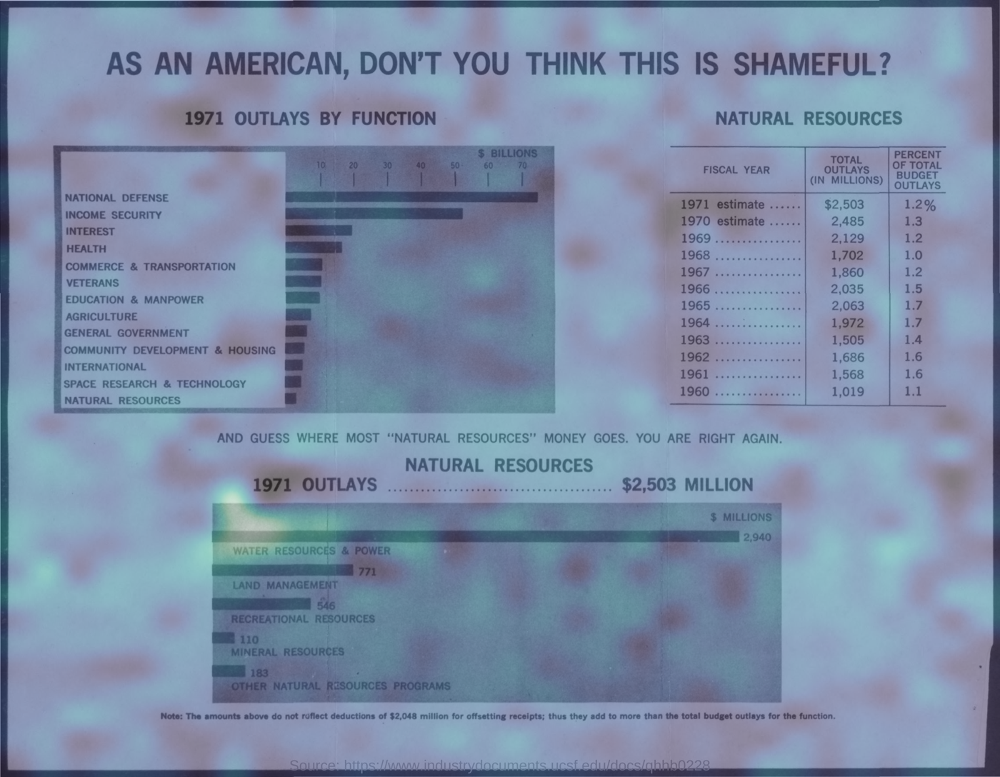
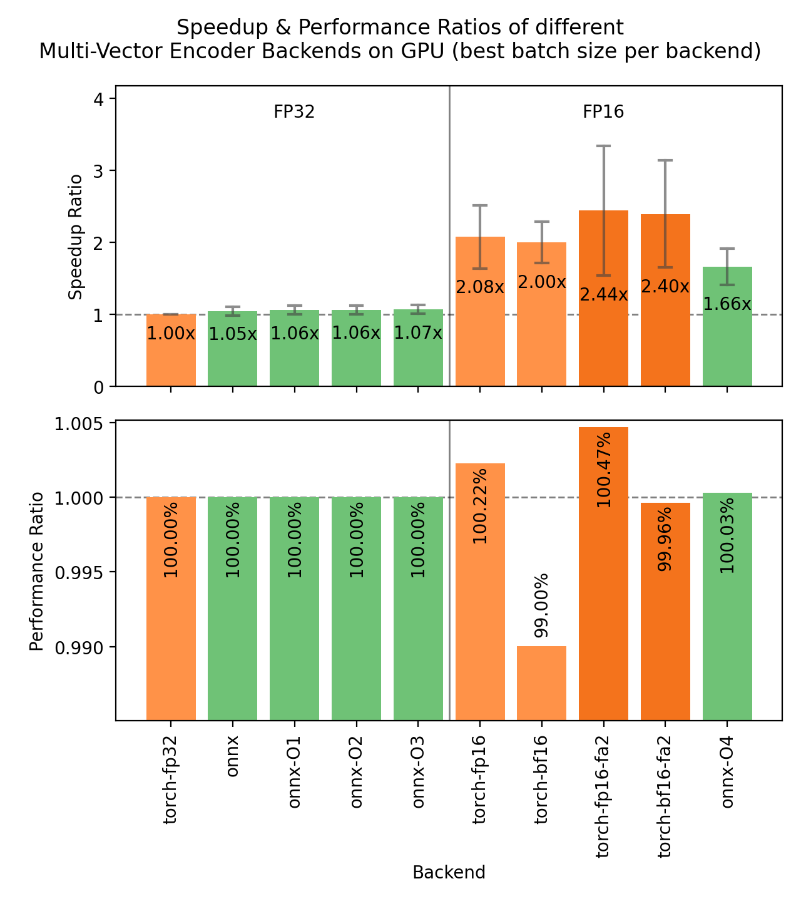
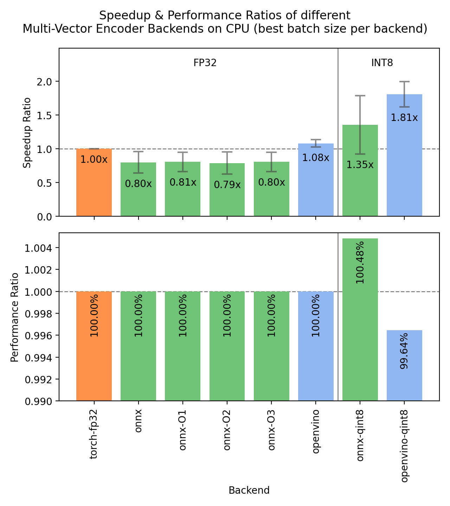

---
authors:
- aitoboxrobot
categories:
- 工具教程
date: 2026-08-19
hide:
- navigation
tags:
- Sentence Transformers
- 多向量模型
- 后期交互
- 语义搜索
- 视觉文档检索
title: 使用 Sentence Transformers 构建多向量（后期交互）嵌入模型
---
### 文章背景与核心概要

随着 **Sentence Transformers** 库引入 `MultiVectorEncoder`，ColBERT 风格的后期交互检索（Late Interaction Retrieval）迎来了原生支持。传统的嵌入模型将整段文本压缩为单个向量，而多向量模型则为**每个 Token 保留一个向量**，并通过 **MaxSim** 运算符来计算查询与文档之间的相似度。

虽然多向量模型对索引存储空间提出了更高的要求，但它显著提升了检索准确率，成为了**视觉文档检索**（无需 OCR 即可将查询直接匹配到页面图像）的行业尖端解决方案，并且全面支持包括文本、图像、音频和视频在内的多模态输入。本文详细介绍了如何在 Sentence Transformers 中加载、编码、检索、索引及优化多向量模型。

---

## 目录

- [什么是多向量模型？](#什么是多向量模型)
  - [MaxSim 运算符](#maxsim-运算符)
  - [收益与代价](#收益与代价)
- [安装](#安装)
- [加载模型](#加载模型)
  - [检查检查点的配置](#检查检查点的配置)
- [编码查询与文档](#编码查询与文档)
- [使用 MaxSim 进行评分](#使用-maxsim-进行评分)
  - [分数幅值与 MeanMaxSim](#分数幅值与-meanmaxsim)
- [语义搜索](#语义搜索)
- [检索与重排](#检索与重排)
- [索引构建](#索引构建)
- [视觉文档检索](#视觉文档检索)
- [音频检索](#音频检索)
- [视频检索](#视频检索)
- [可解释性](#可解释性)
- [Token 池化](#token-池化)
- [加速推理](#加速推理)
- [模型评估](#模型评估)
- [从 PyLate 或 colpali-engine 迁移](#从-pylate-或-colpali-engine-迁移)
- [支持的模型](#支持的模型)
- [致谢](#致谢)
- [其他资源](#其他资源)

---

## 什么是多向量模型？

稠密嵌入模型（Dense Embedding Models）读取文本并将所有特征压缩为一个固定大小的单个向量。虽然效率很高，但这种压缩是有损的：罕见的实体、精确的标识符或多个从句必须在同一个向量空间中争夺空间。

多向量模型（后期交互或 ColBERT 风格的模型）保留了所有的 Token 嵌入，并将每个嵌入投影到较小的维度（通常为 128）。因此，一个包含 9 个 Token 的文档会被转换为一个 $9 \times 128$ 的矩阵。

后期交互将查询与文档的交互推迟到评分阶段。文档被独立编码（允许离线构建索引），而评分过程则是将每一个查询 Token 与每一个文档 Token 进行比较。


### MaxSim 运算符

评分使用 MaxSim：对于每个查询 Token，取其与任何文档 Token 的最高相似度，然后将这些最大值在整个查询中求和。

$$\text{MaxSim}(Q, D) = \sum_{Q_i \in Q} \max_{D_j \in D} Q_i \cdot D_j$$

由于 Token 嵌入经过了 L2 归一化，这些点积在 $[-1, 1]$ 范围内充当余弦相似度。由于 Token 嵌入具有上下文关联性，对齐操作能够捕获语义等价性，而无需精确的字符匹配（例如，将查询 Token `live` 与文档 Token `inhabit` 相匹配）。

### 收益与代价

* **收益：** 在多条件查询、稀有关键词以及稠密压缩力所不逮的领域外文本上，具有更强的检索质量。
* **代价：** 显著更大的索引占用空间。存储每个 Token 一个向量会生成更多数据，不过索引方法和 **Token 池化**（Token Pooling）有助于缓解这一问题。

---

## 安装

```bash
pip install -U sentence-transformers
```

对于 ColPali 风格的视觉文档检索，请安装图像依赖项：

```bash
pip install -U "sentence-transformers[image]"
```

> **注意：** Sentence Transformers v6.0 需要 `transformers` v5.x、`torch` 2.2+ 以及 `huggingface-hub` v1.x。

---

## 加载模型

```python
from sentence_transformers import MultiVectorEncoder

model = MultiVectorEncoder("lightonai/LateOn")
```

在底层，`MultiVectorEncoder` 原生支持 PyLate、Stanford-NLP ColBERT 以及 ColPali 系列检查点：

```python
from sentence_transformers import MultiVectorEncoder

# 原生 Sentence Transformers 与 PyLate 检查点
model = MultiVectorEncoder("lightonai/LateOn")
model = MultiVectorEncoder("mixedbread-ai/mxbai-edge-colbert-v0-17m")
model = MultiVectorEncoder("LiquidAI/LFM2.5-ColBERT-350M", trust_remote_code=True)

# Stanford-NLP ColBERT 检查点
model = MultiVectorEncoder("colbert-ir/colbertv2.0")
model = MultiVectorEncoder("answerdotai/answerai-colbert-small-v1")
```

### 检查检查点的配置

您可以通过 `print(model)` 查看配置：

```python
from sentence_transformers import MultiVectorEncoder

model = MultiVectorEncoder("colbert-ir/colbertv2.0")
print(model)
print(model.prompts)
```

---

## 编码查询与文档

由于查询和文档是不对称的，请使用专用的编码方法：

```python
from sentence_transformers import MultiVectorEncoder

model = MultiVectorEncoder("lightonai/mLateOn")

queries = ["What is the capital of France?"]
documents = [
    "Paris is the capital of France.",
    "Berlin is the capital and largest city of Germany, by both area and population.",
]

query_embeddings = model.encode_query(queries)
document_embeddings = model.encode_document(documents)

print(query_embeddings[0].shape)  # (10, 128)
print(document_embeddings[0].shape, document_embeddings[1].shape)  # (10, 128) (19, 128)
```

---

## 使用 MaxSim 进行评分

使用 `model.similarity()` 计算完整的全对（all-pairs）MaxSim 矩阵：

```python
from sentence_transformers import MultiVectorEncoder

model = MultiVectorEncoder("lightonai/LateOn")

query_embeddings = model.encode_query(["Which planet is known as the Red Planet?"])
document_embeddings = model.encode_document([
    "Venus is often called Earth's twin because of its similar size and proximity.",
    "Mars, known for its reddish appearance, is often referred to as the Red Planet.",
    "Jupiter, the largest planet in our solar system, has a prominent red spot.",
    "Saturn, famous for its rings, is sometimes mistaken for the Red Planet.",
])

scores = model.similarity(query_embeddings, document_embeddings)
print(scores)
# tensor([[10.7942, 11.1104, 10.9743, 11.0811]])
```

### 分数幅值与 MeanMaxSim

由于 MaxSim 对查询 Token 进行求和，分数的幅值会随着查询长度的增加而变大。切换到 **MeanMaxSim** 可以实现有界缩放：

```python
model = MultiVectorEncoder("lightonai/LateOn", similarity_fn_name="meanmaxsim")
print(model.similarity(query_embeddings, document_embeddings))
```

---

## 语义搜索

对于小型语料库，穷举评分可以无缝运行：

```python
import time
from datasets import load_dataset
from sentence_transformers import MultiVectorEncoder

dataset = load_dataset("sentence-transformers/natural-questions", split="train[:5000]")
corpus = list(dict.fromkeys(dataset["answer"]))

model = MultiVectorEncoder("lightonai/LateOn")
corpus_embeddings = model.encode_document(corpus, show_progress_bar=True)

query = "when did richmond last play in a preliminary final"
query_embeddings = model.encode_query([query])
scores = model.similarity(query_embeddings, corpus_embeddings)[0]
top_scores, top_indices = scores.topk(3)

for score, index in zip(top_scores.tolist(), top_indices.tolist()):
    print(f"{score:.4f}  {corpus[index][:100]}")
```

---

## 检索与重排

将用于初始候选选择的快速双编码器（bi-encoder）与用于精确重排的多向量模型结合使用：

```python
from datasets import load_dataset
from sentence_transformers import MultiVectorEncoder, SentenceTransformer
from sentence_transformers.util import semantic_search

dataset = load_dataset("sentence-transformers/natural-questions", split="train[:50000]")
corpus = list(dict.fromkeys(dataset["answer"]))

retriever = SentenceTransformer("jinaai/jina-embeddings-v5-text-nano-retrieval")
reranker = MultiVectorEncoder("perplexity-ai/pplx-embed-v1-late-0.6b", trust_remote_code=True)

corpus_embeddings = retriever.encode_document(corpus, convert_to_tensor=True, show_progress_bar=True)

query = "when did richmond last play in a preliminary final"
hits = semantic_search(retriever.encode_query([query], convert_to_tensor=True), corpus_embeddings, top_k=50)[0]
candidates = [corpus[hit["corpus_id"]] for hit in hits]

query_embeddings = reranker.encode_query([query])
document_embeddings = reranker.encode_document(candidates)
scores = reranker.similarity(query_embeddings, document_embeddings)[0]
```

---

## 索引构建

向量数据库（如 **Qdrant**、**Weaviate**、**Vespa**、**LanceDB**、**VectorChord** 和 **Milvus**）以及 LightOn 的 **fast-plaid** 均原生支持多向量索引。

---

## 视觉文档检索

ColPali 模型直接将页面图像嵌入为文档，并针对其评估查询：

```python
from sentence_transformers import MultiVectorEncoder

model = MultiVectorEncoder("vidore/colqwen2.5-v0.2")

queries = [
    "What is the variable represented on the y-axis of the graph?",
    "Total outlay is maximum in which year?",
]
images = [
    "https://huggingface.co/datasets/sentence-transformers/example-documents/resolve/main/doc1.jpg",
    "https://huggingface.co/datasets/sentence-transformers/example-documents/resolve/main/doc2.jpg",
]

query_embeddings = model.encode_query(queries)
document_embeddings = model.encode_document(images)
scores = model.similarity(query_embeddings, document_embeddings)
print(scores)
```

---

## 音频检索

诸如 `vidore/colqwen-omni-v0.1` 的多模态模型支持零样本音频查询：

```python
import torch
from datasets import Audio, load_dataset
from sentence_transformers import MultiVectorEncoder

model = MultiVectorEncoder("vidore/colqwen-omni-v0.1", model_kwargs={"dtype": torch.bfloat16})

dataset = load_dataset("eustlb/dailytalk-conversations-grouped", split="train[:20]")
dataset = dataset.cast_column("audio", Audio(sampling_rate=16_000))
audio = [row["array"] for row in dataset["audio"]]

query_embeddings = model.encode_query(["medicine for car nausea"])
document_embeddings = model.encode_document(audio, batch_size=2)
scores = model.similarity(query_embeddings, document_embeddings)[0]
```

---

## 视频检索

采样视频帧以在检索过程中管理显存（VRAM）使用：

```python
import torch
from sentence_transformers import MultiVectorEncoder

model = MultiVectorEncoder("vidore/colqwen-omni-v0.1", model_kwargs={"dtype": torch.bfloat16})
model[0].processing_kwargs.update(
    {"video": {"max_pixels": 32 * 28 * 28, "do_sample_frames": True, "fps": 0.5}}
)

query_embeddings = model.encode_query(["How to cook Mapo Tofu?"])
document_embeddings = model.encode_document([
    "https://huggingface.co/datasets/sentence-transformers/example-documents/resolve/main/mapo_tofu.mp4"
], batch_size=1)
```

---

## 可解释性

由于 MaxSim 将分数贡献分解到单个的“查询-文档 Token 对”，您可以生成详细的分析报告，或者为基于图像的文档可视化空间热力图：



---

## Token 池化

`HierarchicalTokenPooling` 通过 Ward 链接（Ward linkage）对 Token 向量进行聚类，从而消除冗余并大幅减小索引大小：

```python
from sentence_transformers import MultiVectorEncoder
from sentence_transformers.multi_vector_encoder.modules import HierarchicalTokenPooling

model = MultiVectorEncoder("lightonai/LateOn")
pooling = HierarchicalTokenPooling(pool_factor=2)

document_embeddings = model.encode_document(documents, token_pooling=pooling)
```

---

## 加速推理

为了优化推理，请在 GPU 上使用 **Flash Attention** 和 **fp16** 精度：

```python
from sentence_transformers import MultiVectorEncoder

model = MultiVectorEncoder(
    "lightonai/GTE-ModernColBERT-v1",
    model_kwargs={"attn_implementation": "flash_attention_2", "dtype": "float16"},
)
```

<div style="display: flex; flex-wrap: wrap; gap: 16px; justify-content: center;">
<figure style="flex: 1 1 300px; min-width: 0; margin: 0; text-align: center;">
<a href="./images/d4caef6455b2.png"></a>
<figcaption>GPU</figcaption>
</figure>
<figure style="flex: 1 1 300px; min-width: 0; margin: 0; text-align: center;">
<a href="./images/1ba76663c2b2.png"></a>
<figcaption>CPU</figcaption>
</figure>
</div>

---

## 模型评估

使用内置评估器（如 `MultiVectorNanoBEIREvaluator`）来测试 NanoBEIR 基准数据集上的性能：

```python
from sentence_transformers import MultiVectorEncoder
from sentence_transformers.multi_vector_encoder.evaluation import MultiVectorNanoBEIREvaluator

model = MultiVectorEncoder("lightonai/GTE-ModernColBERT-v1")
evaluator = MultiVectorNanoBEIREvaluator(batch_size=16)
results = evaluator(model)
print(f"{evaluator.primary_metric}: {results[evaluator.primary_metric]:.4f}")
```

---

## 从 PyLate 或 colpali-engine 迁移

| PyLate | Sentence Transformers |
| :--- | :--- |
| `pylate.models.ColBERT(...)` | `MultiVectorEncoder(...)` |
| `model.encode(..., is_query=True)` | `model.encode_query(...)` |
| `model.encode(..., is_query=False)` | `model.encode_document(...)` |
| `pylate.scores.colbert_scores` | `model.similarity` |

---

## 支持的模型

广泛的文本、代码以及多模态/视觉文档检索模型（包括 **ColPali** 和 **ColQwen** 系列）均与 Sentence Transformers 完全兼容。有关特定模型的参数和配置标签，请参阅原出版物。

---

## 致谢

特别感谢 Omar Khattab 和 Matei Zaharia 开发了 **ColBERT**，LightOn 团队开发的 **PyLate** 和 **fast-plaid**，**ColPali** 团队提供的先进视觉文档检索框架，以及 Benjamin Clavié、Antoine Chaffin 和 Griffin Adams 在 Token 池化研究方面做出的贡献。