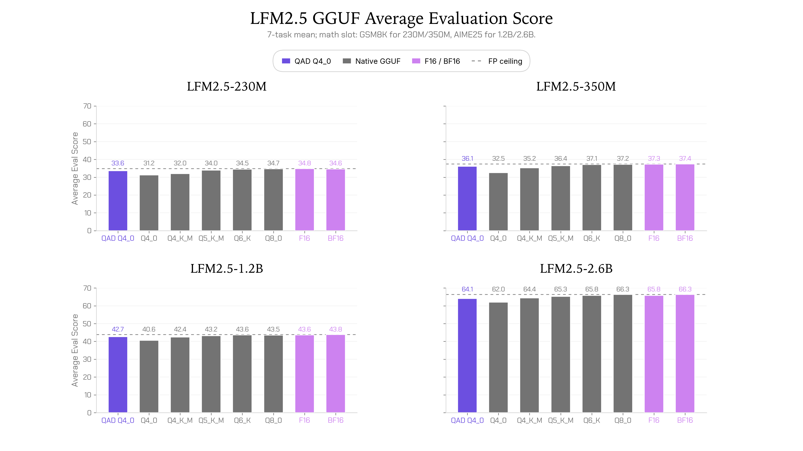
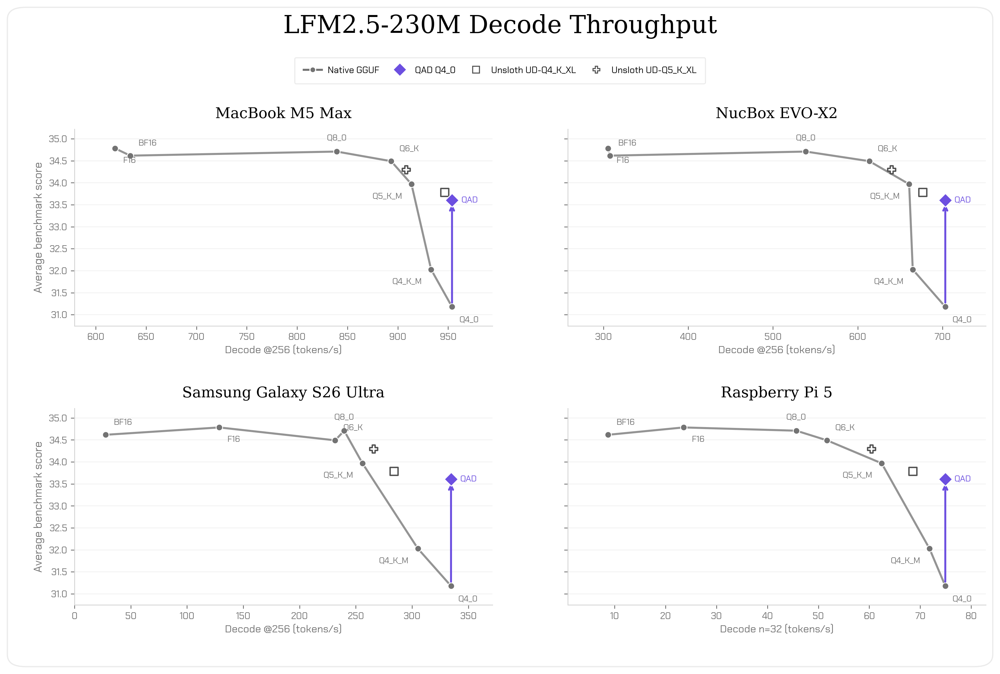
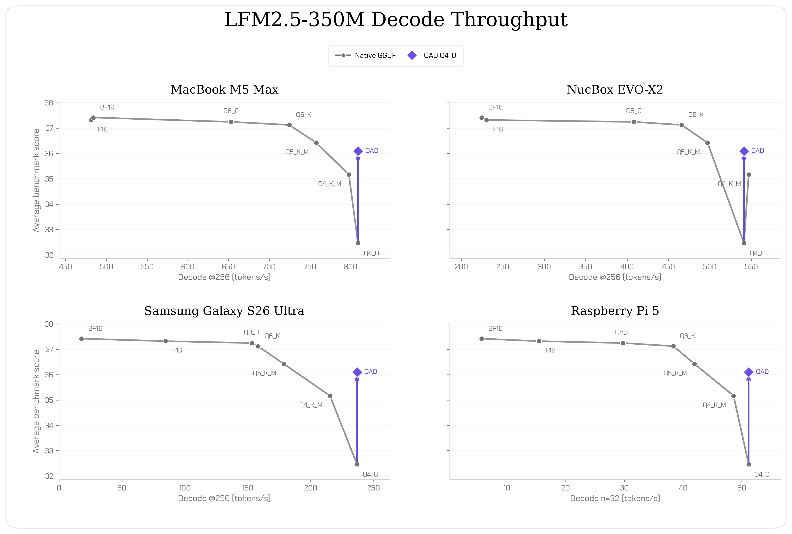
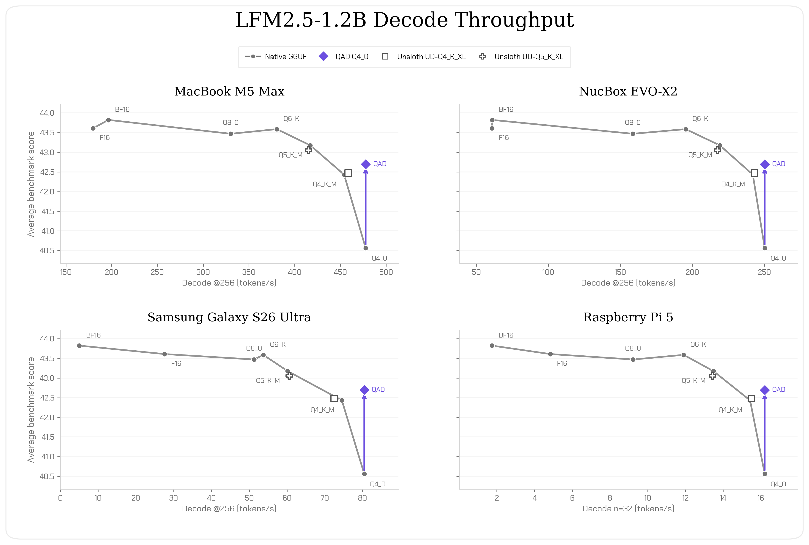
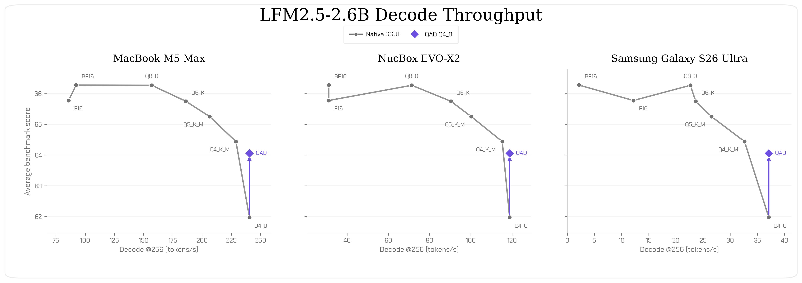

---
authors:
- aitoboxrobot
categories:
- 产品发布
date: 2026-08-20
hide:
- navigation
tags:
- LiquidAI
- LFM2.5
- GGUF
- 量化感知蒸馏
- 边缘计算
title: 基于量化感知蒸馏的 LFM2.5 Q4_0 检查点发布
---
### 文章背景与核心概要
本文介绍了 Liquid AI 针对 LFM2.5 模型系列（包括 230M、350M、1.2B-Instruct 和 2.6B）全新发布的 QAD Q4_0 GGUF 检查点。通过采用量化感知蒸馏（QAD）技术——即将高精度教师模型的知识蒸馏至量化学生模型中——这些更新后的 4 位检查点恢复了标准量化过程中通常会损失的约 97% 的 BF16 平均准确率，同时保留了原生 `Q4_0` GGUF 极小的内存占用和高吞吐量优势。

这一技术突破使得开发者能够在各类真实边缘硬件（如 MacBook Pro、NucBox、三星 Galaxy 手机及树莓派 5）上运行模型时，既能享受极致的速度与低内存开销，又不会遭遇传统量化带来的质量下降问题。

---

# LFM2.5 Q4_0 Checkpoints from Quantization-Aware Distillation

*Published: August 19, 2026 by Aditya Tadimeti and Leonie Monigatti (Liquid AI)*

---

## 📌 Executive Summary

> Liquid AI has released new **QAD Q4_0 GGUF checkpoints** for the **LFM2.5** model family (`230M`, `350M`, `1.2B-Instruct`, and `2.6B`). Utilizing **Quantization-Aware Distillation (QAD)**—where a high-precision teacher model is distilled into a quantized student model—these updated 4-bit checkpoints recover approximately **97% of the BF16 average accuracy** typically lost during standard quantization, while maintaining the minimal memory footprint and high throughput of native `Q4_0` GGUFs.

---

## 概述

Liquid AI 今日发布了全新的 QAD Q4_0 GGUF 检查点。这些是针对 LFM2.5-230M、LFM2.5-350M、LFM2.5-1.2B-Instruct 和 LFM2.5-2.6B 的更新版 4 位检查点。它们允许开发者在运行 LFM2.5 模型时享受 Q4_0 的内存占用和运行速度，同时避免了通常的质量下降：

* **使用量化感知蒸馏（QAD）训练**：将高精度教师模型的知识蒸馏到量化学生模型中。
* **与原生 Q4_0 相同的内存和速度**：保持了 Q4_0 GGUF 极低的内存占用和高吞吐量。
* **准确率恢复**：恢复了因量化而损失的 BF16 平均准确率的 97%。

> Today, we release QAD Q4_0 GGUFs. These are updated 4-bit checkpoints for LFM2.5-230M, LFM2.5-350M, LFM2.5-1.2B-Instruct, and LFM2.5-2.6B. They allow developers to run LFM2.5 models at Q4_0 memory and speed without the usual quality drop:
> 
> * **Trained with Quantization-Aware Distillation (QAD)**: A high-precision teacher model is distilled into a quantized student model.
> * **Same memory and speed as native Q4_0**: They keep the low memory footprint and high throughput of Q4_0 GGUFs.
> * **Accuracy Recovery**: 97% of their BF16 average accuracy lost to quantization is recovered.

---

## 基准测试结果

对于所有四个模型，我们在涵盖推理、遵循指令、工具使用和智能体能力的基准测试套件（GPQA Diamond、MMLU-Pro、IFEval、IFBench、Multi-IF 和 BFCLv4）上，将通过训练后量化（PTQ）生成的 GGUF 与训练好的 QAD Q4_0 检查点进行了对比。BF16 GGUF 用作格式内的性能上限。

我们还针对不同规模添加了一项相匹配的数学评估：针对 LFM2.5-230M 和 LFM2.5-350M 使用 **GSM8K**，针对 LFM2.5-1.2B-Instruct 和 LFM2.5-2.6B 使用 **AIME25**。我们报告了五次重复测试的平均值。

[](./images/6b57a7e03626.png)

在所有四个模型中，**QAD 显着改善了 Q4_0 检查点。** QAD 检查点分别保留了其对应 BF16 基线性能的 97.1%、96.5%、97.4% 和 96.6%。

> For all four models, we compare their released GGUFs produced with post-training quantization (PTQ) against the trained QAD Q4_0 checkpoints on a benchmark suite spanning reasoning, instruction-following, tool use, and agentic capabilities: GPQA Diamond, MMLU-Pro, IFEval, IFBench, Multi-IF, and BFCLv4. The BF16 GGUF serves as the in-format ceiling. 
> 
> We also add one scale-appropriate math evaluation: **GSM8K** for LFM2.5-230M and LFM2.5-350M, and **AIME25** for LFM2.5-1.2B-Instruct and LFM2.5-2.6B. We report the mean across five repeats.
> 
> [](./images/6b57a7e03626.png)
> 
> Across all four models, **QAD substantially improves the Q4_0 checkpoint.** The QAD checkpoints retain 97.1%, 96.5%, 97.4%, and 96.6% of their respective BF16 baseline performance.

---

## 真实边缘硬件上的速度与尺寸

我们在四个目标平台上测量了四个模型的解码吞吐量：**MacBook Pro**、**NucBox EVO-X2**、**三星 Galaxy S26 Ultra** 和 **树莓派 5（Raspberry Pi 5）**。MacBook Pro 和 NucBox 使用 GPU 推理，而三星和树莓派使用 Arm CPU 推理。BF16 和 F16 在有评测的情况下显示为全精度参考。

[](./images/4a718425a1b8.png)
[](./images/c8a0202997a3.png)
[](./images/f0160e63d981.png)
[](./images/a882e62c7961.png)

* **230M** 和 **350M** QAD Q4_0 检查点在评估方差范围内匹配了 `Q5_K_M` 的质量，同时解码吞吐量**提高了 4–33%**。
* **1.2B** 和 **2.6B** QAD Q4_0 检查点在**高出 3–14% 的吞吐量**下匹配了 `Q4_K_M` 的质量。
* QAD Q4_0 检查点还匹配了 Unsloth 的 `UD-Q4_K_XL`（适用于 230M 和 1.2B 模型，如果适用），这是一个表现出色的外部训练后量化检查点。

> We measure decode throughput for the four models across four targets: **MacBook Pro**, **NucBox EVO-X2**, **Samsung Galaxy S26 Ultra**, and **Raspberry Pi 5**. MacBook Pro and NucBox use GPU inference, while Samsung and Raspberry Pi use Arm CPU inference. BF16 and F16 are shown as full-precision references where profiled.
> 
> [](./images/4a718425a1b8.png)
> [](./images/c8a0202997a3.png)
> [](./images/f0160e63d981.png)
> [](./images/a882e62c7961.png)
> 
> * The **230M** and **350M** QAD Q4_0 checkpoints match `Q5_K_M` quality within evaluation variance at a **4–33% higher decode throughput**.
> * The **1.2B** and **2.6B** QAD Q4_0 checkpoints match `Q4_K_M` quality at a **3–14% higher throughput**.
> * The QAD Q4_0 checkpoints also match Unsloth's `UD-Q4_K_XL` (where applicable, for the 230M and 1.2B), a strong external post-training quantization checkpoint.

---

## 如何使用 QAD GGUF

请结合 `llama.cpp` 或任何支持 GGUF Q4_0 制品的运行时使用这些文件。

```shell
llama-cli -hf LiquidAI/LFM2.5-350M \
  --hf-file LFM2.5-350M-QAD-Q4_0.gguf \
  -p "What is C. elegans?"
```

> ## How to Use QAD GGUFs
> 
> Use the files with `llama.cpp` or any runtime that supports GGUF Q4_0 artifacts.
> 
> ```shell
> llama-cli -hf LiquidAI/LFM2.5-350M \
>   --hf-file LFM2.5-350M-QAD-Q4_0.gguf \
>   -p "What is C. elegans?"
> ```

---

## 快速上手 QAD GGUF

QAD GGUF 现已在 Hugging Face 上线：
* [LFM2.5-230M](https://huggingface.co/LiquidAI/LFM2.5-230M-GGUF)
* [LFM2.5-350M](https://huggingface.co/LiquidAI/LFM2.5-350M-GGUF)
* [LFM2.5-1.2B-Instruct](https://huggingface.co/LiquidAI/LFM2.5-1.2B-Instruct-GGUF)
* [LFM2.5-2.6B](https://huggingface.co/LiquidAI/LFM2.5-2.6B-GGUF)

我们迫不及待地想看到您的精彩创作。

> ## Get Started with QAD GGUFs
> 
> The QAD GGUFs are available on Hugging Face today:
> * [LFM2.5-230M](https://huggingface.co/LiquidAI/LFM2.5-230M-GGUF)
> * [LFM2.5-350M](https://huggingface.co/LiquidAI/LFM2.5-350M-GGUF)
> * [LFM2.5-1.2B-Instruct](https://huggingface.co/LiquidAI/LFM2.5-1.2B-Instruct-GGUF)
> * [LFM2.5-2.6B](https://huggingface.co/LiquidAI/LFM2.5-2.6B-GGUF)
> 
> We can't wait to see what you build.

---

## 引用

如需引用，请使用以下参考信息或 BibTeX：

```text
Liquid AI, "LFM2.5 Q4_0: Quantization-Aware Distillation for Edge Deployment", Liquid AI Blog, Aug 2026.
```

```bibtex
@article{liquidAI2026Q40,
  author = {Liquid AI},
  title = {LFM2.5 Q4_0: Quantization-Aware Distillation for Edge Deployment},
  journal = {Liquid AI Blog},
  year = {2026},
  note = {www.liquid.ai/blog/qad},
}
```

> ## Citation
> 
> For citations, please use the following reference or BibTeX:
> 
> ```text
> Liquid AI, "LFM2.5 Q4_0: Quantization-Aware Distillation for Edge Deployment", Liquid AI Blog, Aug 2026.
> ```
> 
> ```bibtex
> @article{liquidAI2026Q40,
>   author = {Liquid AI},
>   title = {LFM2.5 Q4_0: Quantization-Aware Distillation for Edge Deployment},
>   journal = {Liquid AI Blog},
>   year = {2026},
>   note = {www.liquid.ai/blog/qad},
> }
> ```