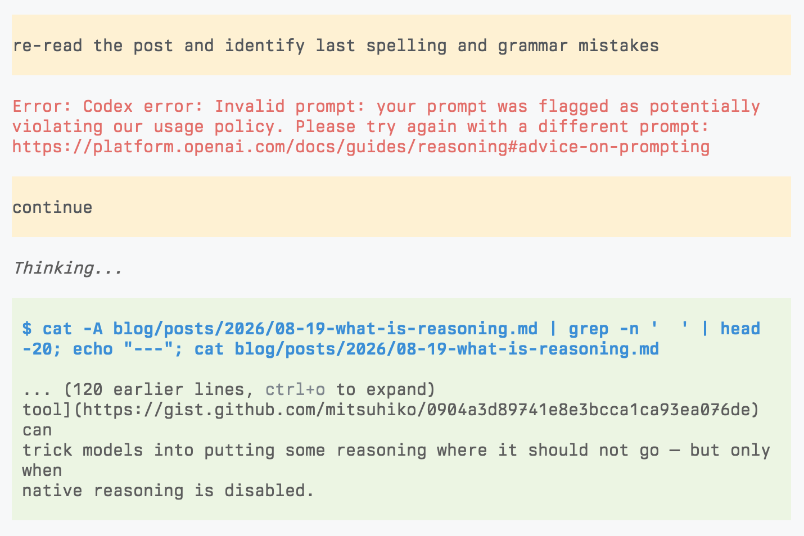

---
authors:
- aitoboxrobot
categories:
- 研究解读
date: 2026-08-21
hide:
- navigation
tags:
- AI推理
- 大语言模型
- 思考过程
- 提示词工程
title: 什么是推理？
---
### 文章背景与核心概要

这篇文章探讨了AI推理轨迹（Reasoning Traces）背后的底层机制，其灵感来源于最近关于从闭源模型中提取这些轨迹的研究。文章去除了AI推理神秘的外衣，指出推理轨迹本质上只是在指定的草稿纸（Scratchpad）通道中生成的文本，而非某种神奇或奇特的处理过程。

此外，文章还讨论了如何通过系统提示词（System Prompts）来控制推理强度、模型如何被训练以区分内部思考与最终输出，以及操纵这些通道如何导致模型泄露其内部的推理轨迹。

---

## Hiding Traces
## 隐藏推理轨迹

Reasoning traces are usually hidden from us. [We have lamented this](https://earendil.com/posts/session-portability/), but mostly have to accept it. Open-weight models thankfully reveal them, and from their behavior you can see that their traces can be long and confusing. This is probably a good reason to separate them from what is normally shown to users.

> 推理轨迹通常对我们是隐藏的。[我们曾对此表示遗憾](https://earendil.com/posts/session-portability/)，但大部分情况下只能接受现实。幸运的是，开源权重模型向我们揭示了这些内容，从它们的行为中你可以看出，其推理轨迹可能既冗长又令人费解。这大概也是将它们与常规向用户展示的内容相隔离的一个很好理由。

At minimum, UIs need to detect them. The industry has done a good job at making reasoning traces sound special and exotic, but they really are just text: the model is trained to emit its thinking into a scratchpad as part of its response, before its final answer.

> 至少，UI（用户界面）需要能够检测到它们。业界在将推理轨迹包装得听起来特殊而奇特方面做得很好，但它们实际上只是文本：模型在输出最终答案之前，被训练将其思考过程作为响应的一部分输出到一个草稿纸区域中。

GPT-OSS’s Harmony response format makes this easy to see:

> GPT-OSS 的 Harmony 响应格式使这一点一目了然：

```xml
<|channel|>analysis<|message|>
I need to work this out ...
<|end|><|start|>assistant<|channel|>final<|message|>
The answer is ...
<|return|>
```

The markers are special tokens, but the reasoning between them uses “the same text” as the final answer (just that GPT chain-of-thought text sounds really funny). When the model samples the `analysis` channel token, a parser routes the following text into a separate stream exposed through the Responses API. For closed models, presumably a simple model redacts and summarizes it.

> 这些标记是特殊的 token，但它们之间的推理过程使用的其实是与最终答案“相同的文本”（只是 GPT 的思维链文本听起来非常滑稽）。当模型采样到 `analysis` 通道 token 时，解析器会将后续文本路由到一个单独的流中，并通过 Responses API 暴露出来。对于闭源模型，推测会有一个简单的模型对其进行修订和总结。

## Reasoning Effort
## 推理强度

How much budget goes to reasoning? Earlier APIs exposed reasoning token budgets, making it seem like a property of the sampling process. In reality, reasoning effort is baked into the system prompt. GPT-OSS puts this into the system prompt:

> 多少预算会分配给推理？早期的 API 暴露了推理 token 预算，这让人觉得它是采样过程的一个属性。实际上，推理强度是内置在系统提示词中的。GPT-OSS 将这一点写入了系统提示词：

```text
Reasoning: low
```

That’s it. Training produces the resulting behavior, such as emitting the token sequence that switches to the `analysis` channel. This also explains why changing the effort invalidates the KV cache. I think closed GPT models call reasoning effort “juice,” since you can ask most models how much juice they have.

> 就是这样。训练会产生相应的行为，例如发出切换到 `analysis` 通道的 token 序列。这也解释了为什么改变推理强度会导致 KV 缓存失效。我想闭源的 GPT 模型把推理强度称为“动力（juice）”，因为你可以问大多数模型它们还有多少动力。

In [DwarfStar](https://github.com/antirez/ds4) for DeepSeek with max reasoning this is added to the system prompt:

> 在支持最大推理强度的 DeepSeek 版 [DwarfStar](https://github.com/antirez/ds4) 中，系统提示词会添加以下内容：

```text
Reasoning Effort: Absolute maximum with no shortcuts permitted.
You MUST be very thorough in your thinking and comprehensively decompose the
problem to resolve the root cause, rigorously stress-testing your logic against
all potential paths, edge cases, and adversarial scenarios.
```

## Don’t Think
## 不要思考

The destination of reasoning tokens is therefore a learned convention: the model is trained to keep scratch work out of the `final` channel. Trick it into thinking it is in that channel and it may leak tokens. We have even seen older models, when thinking is disabled, reason into the bash tool and echo their thoughts to `/dev/null`.

> 因此，推理 token 的归宿是一种通过学习达成的约定：模型经过训练，被要求将草稿内容排除在 `final` 通道之外。如果你欺骗模型让它误以为自己正处于该通道中，它可能会泄露 token。我们甚至见过一些旧模型在禁用思考时，将推理过程写进 bash 工具中，并把它们的想法回显到 `/dev/null`。

So in some sense the only “special” behavior for some models is not to think. That at times is done by “mechanically” removing the model’s usual ways to think. In [DwarfStar](https://github.com/antirez/ds4), disabled thinking uses the prefill `</think>`, while enabled thinking uses `<think>`, which are the tokens that close and start thinking. GPT-OSS doesn’t prefill but lets the model decide either way on its own.

> 从某种意义上说，某些模型唯一“特殊”的行为就是不去思考。有时这是通过“机械地”移除模型通常的思考方式来完成的。在 [DwarfStar](https://github.com/antirez/ds4) 中，禁用思考时使用预填充的 `</think>`，而启用思考时使用 `<think>`，这些正是关闭和开启思考的 token。GPT-OSS 不进行预填充，而是让模型自行决定采用哪种方式。

But presumably, some inference APIs prefill the opening token when reasoning is enabled, so the model never samples it itself and might prevent the sampling of the reasoning token when disabled since it can be trivially detected. This may explain why a [custom `think` tool](https://gist.github.com/mitsuhiko/0904a3d89741e8e3bcca1ca93ea076de) can trick models into putting some reasoning where it should not go — but only when native reasoning is disabled.

> 但可以推测，当启用推理时，某些推理 API 会预填充起始 token，因此模型永远不会亲自对其进行采样；而在禁用时，由于可以轻松检测到，它们可能会阻止推理 token 的采样。这或许可以解释为什么一个[自定义的 `think` 工具](https://gist.github.com/mitsuhiko/0904a3d89741e8e3bcca1ca93ea076de)能够诱骗模型将某些推理内容放到不该去的地方——但前提是必须禁用原生推理。

<small>Fun fact: this blog post triggered safety checks</small>

> <small>趣事：这篇博客文章触发了安全检查</small>

Hilariously enough I was unable to use GPT 5.6 terra for spell and grammar checking on this blog post because of safety filters. Had to switch to Kimi.

> 非常搞笑的是，由于安全过滤器的限制，我无法使用 GPT-5.6 terra 来对这篇博客文章进行拼写和语法检查。最后不得不切换到 Kimi。

