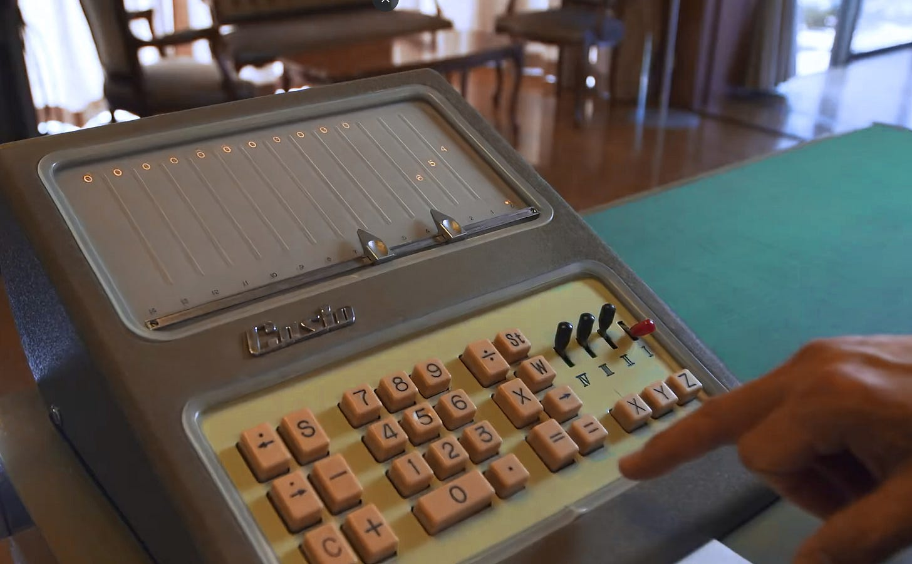
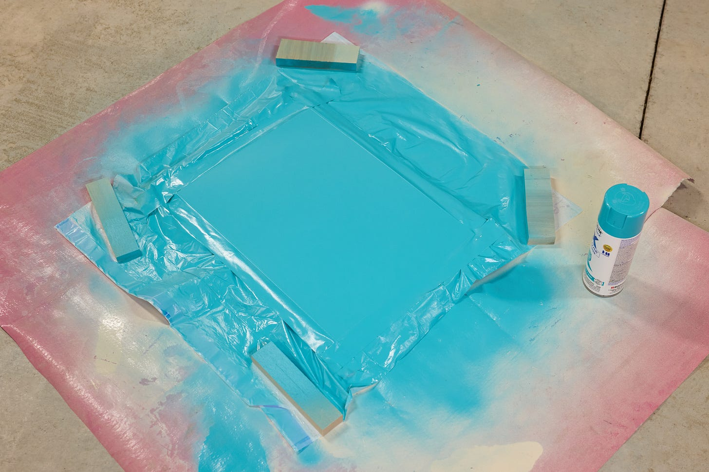
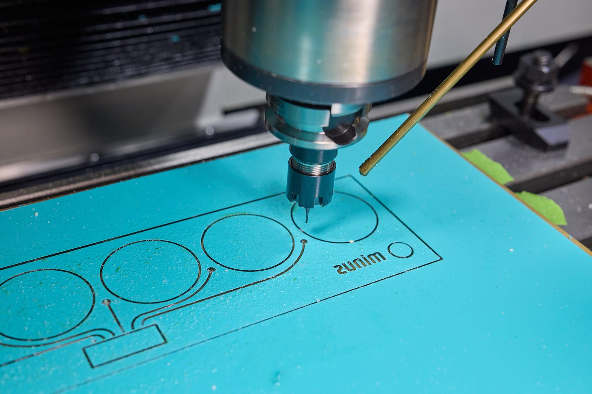
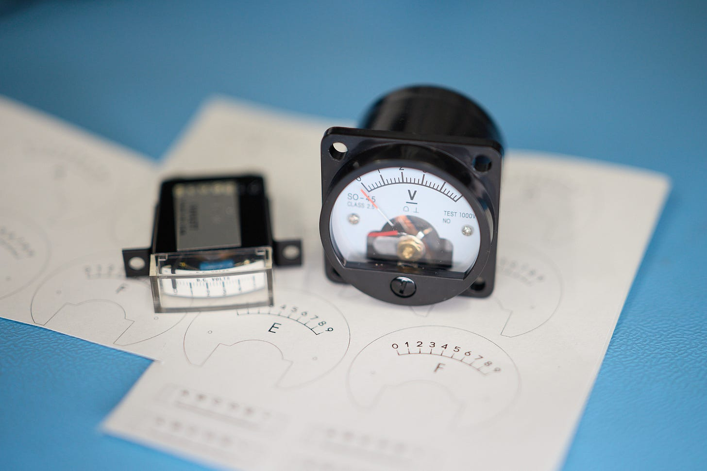
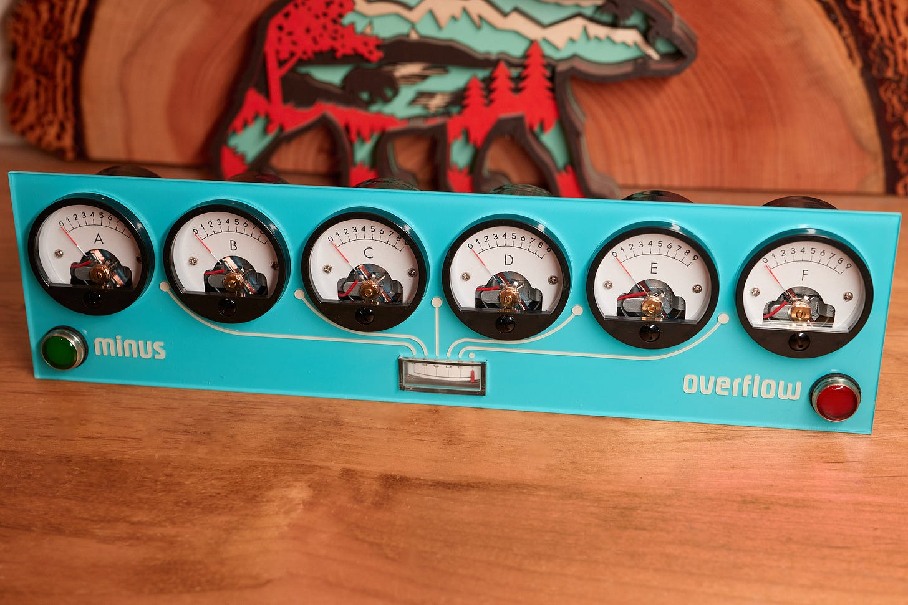
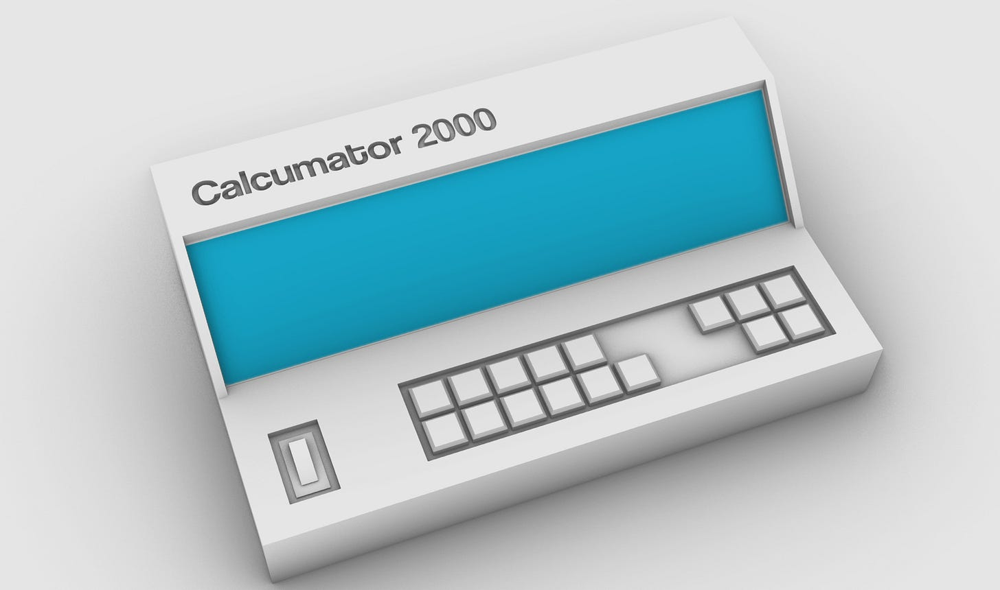
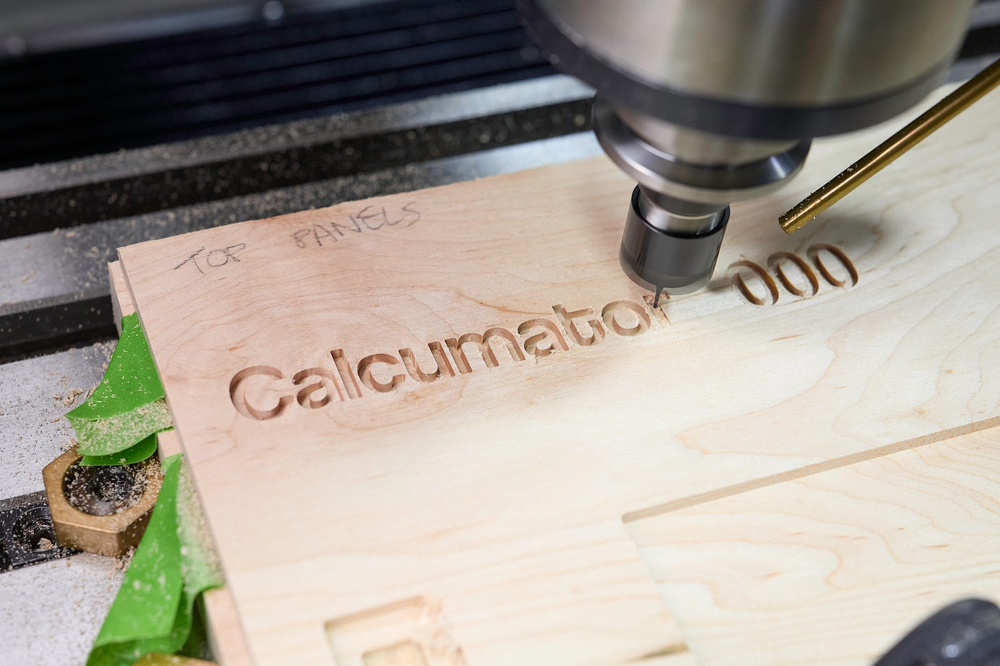
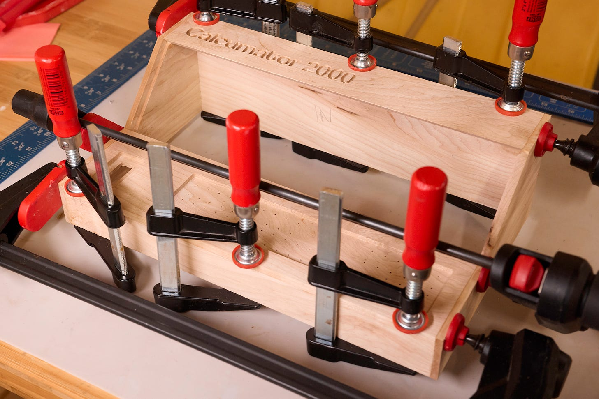
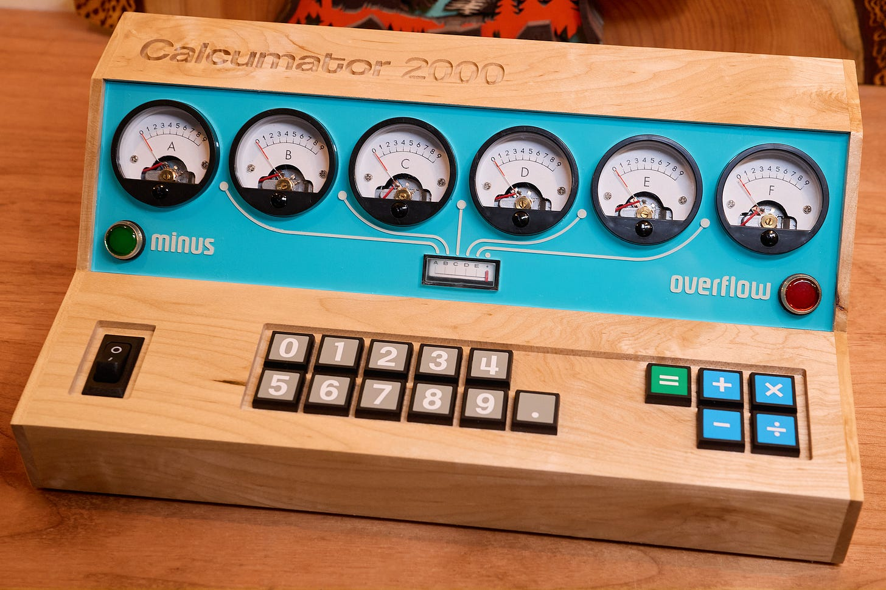

---
authors:
- aitoboxrobot
categories:
- 工具教程
date: 2026-08-21
hide:
- navigation
tags:
- 嵌入式
- AVR
- 硬件设计
- 复古电子
- 计算器
title: 带浮点运算功能的指针式仪表计算器
---
### 文章背景与核心概要
本项目展示了一款名为“Calcumator 2000”的定制机电计算器，它巧妙地将复古工业美学与现代嵌入式编程相结合。该设备摒弃了传统的数字显示屏，转而使用模拟电压表作为显示输出，并配以CNC加工的枫木外壳和高品质NKK触觉开关。

在技术实现上，该计算器基于AVR128DA28微控制器，通过脉冲宽度调制（PWM）驱动多个模拟仪表。为了克服浮点运算的精度问题，作者采用了定点算术逻辑，并设计了专门的指示灯来处理负数和溢出状态。这不仅是一次对早期计算设备显示技术的致敬，也是对嵌入式系统UI设计与硬件交互的一次深度探索。

---

## 简介与灵感
不同寻常的时钟是电子DIY项目中常见的创意，但如何让它们看起来美观大方始终是一个真正的挑战。除了计时设备，人们对计算器的历史也怀有浓厚的兴趣。早期的计算设备由于缺乏合适的显示技术，往往落后于通用计算，只能依赖纸带、阴极射线管或白炽灯面板（例如1957年的卡西欧14-A）。

> Unusual clocks are a common idea for electronics DIY projects, but making them look presentable is always the real challenge. Beyond timekeeping, there is a deep fascination with the history of calculators. Early calculating devices often lagged behind general-purpose computing due to a lack of suitable display technology, relying instead on ticker tape, cathode ray tubes, or incandescent lightbulb panels (such as the 1957 Casio 14-A). 

令人惊讶的是，很少有计算器使用机电面板仪表作为显示器。为了填补这一空白，作者设计了一款独特的仪表式计算器。

> Surprisingly, very few calculators utilized electromechanical panel meters as displays. To address this gap, a unique meter-based calculator was designed.

---

## 制作显示面板
制作过程始于一张3毫米厚的亚克力板，背面喷涂蓝色油漆：

> The build began with a 3 mm sheet of acrylic, spray-painted blue on the back side:

使用CNC铣床，有选择地去除了油漆并切割出开口，以创建精确的框架：

> Using a CNC mill, the paint was selectively removed and openings were cut to create precise framing:

字母区域再次上漆，以增加对比度和立体感。显示屏本身由六个来自亚马逊的通用“SO-45”面板电压表组成，并配有一个从eBay采购的复古边缘式电压表，用于处理浮点值。每个仪表都有一个打印在不干胶纸上的定制表盘（[模板文件可在此处获取](http://lcamtuf.coredump.cx/soft/embedded/meter_calc.pdf)）：

> The lettered areas were painted again for contrast and a three-dimensional appearance. The display itself comprises six generic "SO-45" panel voltmeters from Amazon, paired with a vintage edgewise voltmeter sourced from eBay to handle floating-point values. Each meter features a custom face printed on adhesive paper ([template file available here](http://lcamtuf.coredump.cx/soft/embedded/meter_calc.pdf)):

完成后的面板还集成了两个Dialight 656系列面板指示灯（[产品目录页](https://www.dialight.com/wp-content/uploads/2021/07/Dialight_PMI_catalog_April2021.pdf)），用于指示负数结果和系统溢出：

> The completed panel also integrates two Dialight 656 series panel indicators ([catalog page](https://www.dialight.com/wp-content/uploads/2021/07/Dialight_PMI_catalog_April2021.pdf)) to signal negative results and system overflows:

---

## 设计与构建外壳
由于显示面板非常大，因此采用了非标准的键盘布局：左侧两行排列着十个数字键和一个小数点键，右侧则是一组五个操作键。

> Because the display panel is quite massive, a non-standard keyboard layout was implemented: ten digits and a decimal point arranged in two rows on the left, alongside a cluster of five operator keys on the right.

外壳由车间里重新切割的薄枫木板制成，排版和凹陷的按键矩阵均由CNC路由器加工而成：

> The enclosure was constructed from thin maple lumber stock resawn in the workshop, with typography and the recessed key matrix machined on the CNC router:

粘合过程中使用了大量的夹具以确保紧密贴合：

> The glue-up utilized plenty of clamps to ensure a secure fit:

键盘依赖于16个优质的18×18毫米NKK JF系列触觉开关（[产品目录](https://www.nkkswitches.com/pdf/JFnonilluminated.pdf)），并配有定制的乙烯基按键贴纸。

> The keypad relies on sixteen premium 18×18 mm NKK JF series tactile switches ([catalog](https://www.nkkswitches.com/pdf/JFnonilluminated.pdf)) paired with custom vinyl key decals. 

---

## 电子与软件架构
计算器的大脑由一个8位[AVR128DA28 MCU](https://lcamtuf.substack.com/p/psa-if-youre-a-fan-of-atmega-try)组成，直接由5V电源适配器供电。
* **显示控制：** 使用跨越七条数字线（`PD0-PD6`）的脉冲宽度调制（PWM）来驱动仪表。
* **键盘扫描：** 实现了一个4×4的感应驱动网格（`PA0-PA3` / `PA4-PA7`）。
* **指示灯：** 使用两条控制线（`PC0`，`PC1`）来控制状态灯。

为了避免标准浮点类型固有的精度问题，作者实现了定点（6+5位）算术运算。完整的带注释[源代码可供下载](https://lcamtuf.coredump.cx/soft/embedded/meter_calc.c)。

> The brains of the calculator consist of an 8-bit [AVR128DA28 MCU](https://lcamtuf.substack.com/p/psa-if-youre-a-fan-of-atmega-try), powered directly by a 5V wall wart. 
> * **Display Control:** Uses pulse-width modulation across seven digital lines (`PD0-PD6`) to drive the meters.
> * **Keypad Scanning:** Implements a 4×4 sense-drive grid (`PA0-PA3` / `PA4-PA7`).
> * **Indicators:** Uses two control lines (`PC0`, `PC1`) for status lamps.
>
> To avoid precision issues inherent to standard floating-point types, fixed-point (6+5 digit) arithmetic was implemented. The fully commented [source code is available for download](https://lcamtuf.coredump.cx/soft/embedded/meter_calc.c).

### 用户界面的怪癖
正如之前关于[计算器UI设计](https://lcamtuf.substack.com/p/ui-is-hell-four-function-calculators)的文章所探讨的那样，在没有专用清除（`C`）按钮的情况下处理输入需要创造性的逻辑：
* 连续按两次 `+`、`×` 或 `÷` 可以触发重复操作。
* `-` 键兼作改变符号的前缀（除非在按下等号键后立即按下）。
* 按两次 `=` 键作为清除计算器状态的指令。

> As explored in previous writings on [calculator UI design](https://lcamtuf.substack.com/p/ui-is-hell-four-function-calculators), handling inputs without a dedicated clear (`C`) button required creative logic:
> * Repeated operations can be triggered by pressing `+`, `×`, or `÷` twice.
> * The `-` key doubles as a prefix for changing signs (unless pressed immediately after the equals key).
> * Pressing `=` twice acts as an instruction to clear the calculator state.

---

## 演示视频
以下视频演示了该计算器处理分数、负值和系统错误条件的过程：

> The following video demonstrates the calculator processing fractions, negative values, and system error conditions:

<iframe src="https://player.vimeo.com/video/1209311182?autoplay=0&amp;h=c32321048f&amp;dnt=1" frameborder="0" allowfullscreen="true" sandbox="allow-scripts allow-same-origin allow-popups allow-popups-to-escape-sandbox" loading="lazy"></iframe>

---

## 关于作者
如果您喜欢这篇文章，请查看《电路的秘密生活》（*The Secret Life of Circuits*）——这是一本图文并茂、通俗易懂的电子学入门书，内容涵盖从导电物理到嵌入式系统，包含超过420页的原创内容，且完全没有使用AI。

> If you liked this article, check out ***The Secret Life of Circuits***—a richly illustrated, lucid introduction to electronics ranging from conduction physics to embedded systems, featuring over 420 pages of original content and zero AI.

*我撰写关于电子学、[数学基础](https://lcamtuf.substack.com/p/monkeys-typewriters-and-busy-beavers)、[技术史](https://lcamtuf.substack.com/p/a-brief-history-of-counting-stuff)以及其他极客兴趣的内容。[立即订阅](https://blog.coredump.cx/subscribe?)。*

> *I write about electronics, [the foundations of mathematics](https://lcamtuf.substack.com/p/monkeys-typewriters-and-busy-beavers), [the history of technology](https://lcamtuf.substack.com/p/a-brief-history-of-counting-stuff), and other geek interests. [Subscribe now](https://blog.coredump.cx/subscribe?).*