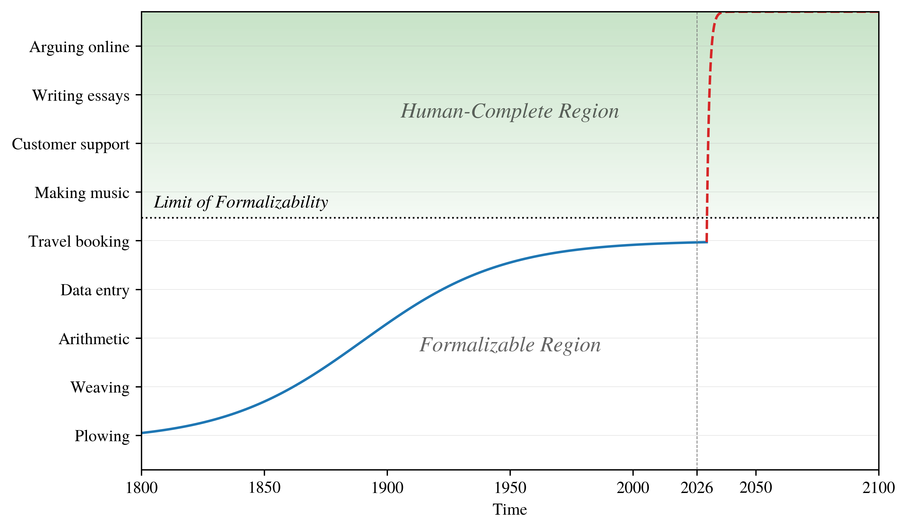

---
authors:
- aitoboxrobot
categories:
- 研究解读
date: 2026-08-21
hide:
- navigation
tags:
- 人工智能
- AGI
- 自动化
- 经济学
- 社会学
title: 我们的仆人会代劳：自动化与人类工作的未来
---
### 文章背景与核心概要

现代自动化愿景承诺，通过消除日常琐事，人类将获得自由去追求更有意义、更具英雄色彩且智力充实的活动，重现《星际迷航》式的理想未来。然而，本文指出这一愿景忽略了两个关键缺陷：一是“复杂性陷阱”，即能够自动化繁琐任务的技术必然也能自动化所谓“有意义”的工作；二是“唯我论偏好”，即人类在选择时往往表现出对交易型、去人性化便利的压倒性偏好，而非对人际关系和劳动过程的珍视。

随着通用人工智能（AGI）的临近，经济激励机制正威胁着几乎所有传统职业。当技术能够以极低成本提供同等甚至更优的产出时，人类劳动在经济价值上将面临被彻底边缘化的风险，最终可能只剩下纯粹依赖人际关系的经济领域作为避难所。

---

## 任务复杂性与 AGI

在过去的 250 年里，社会系统性地逐一自动化各项任务。如果人类能够设计出一台机器或程序来执行某项任务，那么该任务本质上就属于“琐事”。自动化带来的经济激励一直推动着人类的繁荣，使工作变得更安全、报酬更高、更健康且更具智力启发性。

我们可以通过一个图表来概念化这种进步：$x$ 轴代表时间，$y$ 轴代表任务复杂性。在某个阈值之下是“可形式化区域”（Formalizable Region）——即我们能够成功编程让机器执行的任务。在该阈值之上则是“人类完备区域”（Human-Complete Region），涵盖了有意义的努力（如撰写文章）和繁琐的人类行政工作。

> For the past 250 years, society has systematically automated tasks one by one. If a human can design a machine or procedure to perform a task, that task inherently qualifies as drudgery. Economic incentives for automation have consistently driven human flourishing, making work safer, higher-paying, healthier, and more intellectually stimulating.
>
> We can conceptualize this progress through a graph where the $x$-axis represents time and the $y$-axis represents task complexity. Below a certain threshold lies the "Formalizable Region"—tasks we can successfully program machines to execute. Above this threshold lies the "Human-Complete Region," encompassing both meaningful endeavors (like essay writing) and tedious human administration.

![A line plot. The X axis is time, ranging from the year 1800 to the year 2100. A vertical dotted line marks the year 2026. The Y axis is qualitative, showing a list of tasks, sorted from top to bottom by increasing complexity. A horizontal dotted line marks the 'Limit of Formalizability'. The region above this line is labeled 'Human-Complete Region'. The region below this line is labeled 'Formalizable Region'. A sigmoid curve, representing technological progress, is drawn starting from just above the origin in the year 1800, to just below the limit of formalizability in 2026.](./images/3c87256797b6.png)

至关重要的是，自然界并没有在 $y$ 轴上划定一条“琐事界限”。AGI 的到来——定义为在大多数具有经济价值的工作中表现优于人类的高度自主系统——创造了一个剧烈的断层。突然之间，技术能力飙升至 100% 自动化，将琐事和有意义的劳动一并压缩进自动化层级中。

> Crucially, nature does not draw a "Limit of Drudgery" along the $y$-axis. The arrival of AGI—defined as highly autonomous systems outperforming humans at most economically valuable work—creates a sharp discontinuity. Suddenly, technological capability surges to 100% automation, compressing both drudgery and meaningful labor into the automated tier.

在这一节点上，经济激励机制[开始与人类利益背道而驰](https://borretti.me/article/no-one-escapes-the-permanent-underclass)。唯一剩下的职业利基市场是关系经济，即人类面孔成为工作描述中不可或缺的一部分。

> At this juncture, economic incentives [work against humanity](https://borretti.me/article/no-one-escapes-the-permanent-underclass). The only remaining occupational niche is the relational economy, where a human face forms an indispensable part of the job description.

---

## 唯我论

第二个主要挑战在于人类的偏好。虽然个人认为自己的劳动具有独特的意义，但在评估他人的工作时，他们严格从工具性角度出发——优先考虑结果而非人际联系。在销售时，人们强调声誉、信任和关系；但在购买时，他们要求廉价、快速和便捷的解决方案。当有选择时，消费者总是倾向于交易效率而非人类摩擦（例如，尽管有真人驾驶的替代方案，人们仍倾向于选择 Waymo 等自动驾驶交通工具）。

> The second major challenge lies in human preferences. While individuals view their own labor as uniquely meaningful, they evaluate everyone else's work strictly in instrumental terms—prioritizing outcomes over human connection. When selling, people emphasize reputation, trust, and relationships; when buying, they demand cheap, fast, and convenient solutions. Given the choice, consumers consistently prefer transactional efficiency over human friction (e.g., preferring autonomous transport like Waymo despite human-driven alternatives).

如果我们汇总人们希望自动化的工作，这些愿望的并集几乎涵盖了所有工作。什么都不会剩下。这种趋势在消费者服务、知识工作和创意领域显而易见：

> If we aggregate the jobs people wish to see automated, the union of those desires covers nearly all work. Nothing is left. This trend is visible across consumer services, knowledge work, and creative fields:

* **软件工程：** 虽然开发者认为编程在智力上是有益的，但用户只想要能运行的软件。当 AI 能以象征性的费用瞬间生成功能性代码时，为什么还要去应付一个有主见的人类？软件工程工作之所以正在演变为“AI 驯服”角色，仅仅是因为当前 AI 模型存在局限性（如缺乏长期记忆或结构化组织能力）。一旦数万亿美元的研究克服了这些障碍，这一职业本身可能会消失。
* **数学：** 数学家们正在经历[同样的轨迹](https://kirwinhampshire.substack.com/p/the-dark-night-of-mathematics)，尽管许多人[对该领域的去智力化感到愤慨](https://tasmin.substack.com/p/mathematicians-need-to-act)，而科技文化往往欢迎这种转变：*我们的仆人会代劳。*
* **艺术：** 艺术将具体的制品（文本、绘画、歌曲）与人类背景（历史、意图、话语）结合在一起。如果 AI 能瞬间以零成本生成审美等价物，那么大部分受众可能会乐于绕过人类创作者，转而选择即时、定制化的媒体。

> * **Software Engineering:** While developers find coding intellectually rewarding, users simply want working software. Why deal with an opinionated human when an AI can generate functional code instantly for a nominal fee? Software engineering jobs are evolving into AI-wrangling roles only because current AI models possess limitations (such as lack of long-term memory or structural organization). Once trillions of dollars in research overcome these hurdles, the profession itself may vanish.
> * **Mathematics:** Mathematicians are experiencing an [identical trajectory](https://kirwinhampshire.substack.com/p/the-dark-night-of-mathematics), though many [resent the de-intellectualization of their field](https://tasmin.substack.com/p/mathematicians-need-to-act) compared to tech culture, which often welcomes the shift: *Our servants will do that for us.*
> * **Art:** Art combines a concrete artifact (text, painting, song) with a human context (history, intent, discourse). If an AI can generate aesthetic equivalents instantly and at zero cost, much of the audience may happily bypass the human creator in favor of instant, custom-tailored media.

最终，我们可能会发现，人类的偏好远没有我们自认为的那样具有人文主义色彩，反而更具唯我论倾向。

> Ultimately, we may discover that human preferences are far less humanist and far more solipsistic than we care to admit.

---

## 致谢

埃米·诺特（Emmy Noether）曾观察到“一切都已包含在戴德金（Dedekind）的著作中”。至于我，我所写关于 AI 的一切，[J. D. Pressman](https://jdpressman.com/) 都已经说过了。

> Emmy Noether once observed that "everything is already in Dedekind." As for me, everything I write about AI was already said by [J. D. Pressman](https://jdpressman.com/).

---

## 脚注

1. 这是一个极其严重的简化，因为我把所有的复杂性都塞进了“同等或更好结果”的概念中。所以让我们再试一次，用[*几何学方式*](https://en.wikipedia.org/wiki/Spinoza%27s_Ethics)并加上不必要的 LaTeX。你想购买一件商品。你环顾四周，收集一系列选项，按效用排序并挑选赢家。你可以把效用看作是一个加权和：

$$\mathfrak{u}(x) = \sum\limits_{a \in A} \alpha_a x_a$$

其中 $a$ 是你权衡的方面（价格、运输速度、品牌信任度、我从这件东西中获得的社会地位等），变量量化了这些方面，而 $\alpha$ 是系数。所以如果你是一个潮流追随者，你的 $\alpha_\text{clout}$（影响力系数）远高于你的 $\alpha_\text{price}$（价格系数）；如果你是一个极客，一台破旧 ThinkPad 的 $x_\text{clout}$ 比 MacBook 更高。

现在，由于生物学原因，人类很慢；而且由于[鲍莫尔效应](https://en.wikipedia.org/wiki/Baumol_effect)，我们随着时间的推移变得越来越昂贵。计算机既快又便宜。最重要的是，AI 的进步速度远超人类。因此，自动化生产的效用被拉高，而人类生产的效用被拉低，最终它们相差甚远，以至于你必须是一个拥有极高 $\alpha_\text{human}$ 系数的极端分子，才会选择人类替代方案。[↩](#fnref:fn1)

2. 我很谨慎地使用“文本或图像”而不是“艺术”，使用“审美价值”而不是“质量”，因为你可能会反驳说机器制造的艺术不是艺术。我想说的是，它不必是艺术。它可以仅仅是一幅令人愉悦的图像、一段令人愉悦的文字，等等。[↩](#fnref:fn2)

> 1. This is a horrendous oversimplification, because I’ve stuffed all the complexity into the notion of “same outcome or better”. So let’s try it again, [*more geometrico*](https://en.wikipedia.org/wiki/Spinoza%27s_Ethics) and with unnecessary LaTeX. You want to buy a good. You look around, assemble a set of options, sort them by utility and pick the winner. And you can think of the utility as like a weighted sum:
>
> $$\mathfrak{u}(x) = \sum\limits_{a \in A} \alpha_a x_a$$
>
> Where the a’s are the aspects you are weighing (price, shipping speed, trust in the brand, how much social status I get from this thing, etc.), the variables quantify these aspects, and the alphas are the coefficients. So if you’re a hypebeast your $\alpha_\text{clout}$ is much higher than your $\alpha_\text{price}$, and if you’re a neckbeard the $x_\text{clout}$ of a busted ThinkPad is higher than that of a MacBook.
>
> Now, humans are slow, because biology; and because of [Baumol](https://en.wikipedia.org/wiki/Baumol_effect) we get more expensive over time. Computers are fast and cheap. On top of that, the pace of improvement in AI is vastly greater than the pace of improvement in humans. So the utility of automated production gets pulled up, and the utility of human production gets pulled down, and eventually they are so far apart that you have to be an extremist with a very high $\alpha_\text{human}$ coefficient to choose the human alternative. [↩](#fnref:fn1)
>
> 2. I’m being careful to say “texts or images” rather than “art”, and “aesthetic value” rather than “quality”, because you might object that machine-made art is not art. And what I’m trying to say is that is doesn’t have to be art. It can just be a pleasing image, a pleasing text, and so on. [↩](#fnref:fn2)