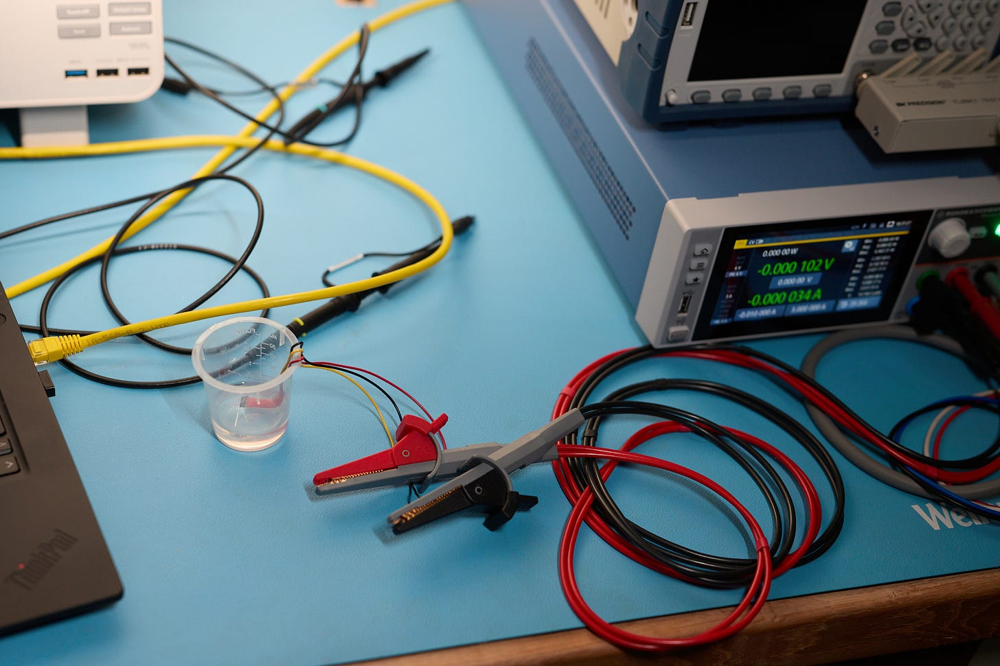
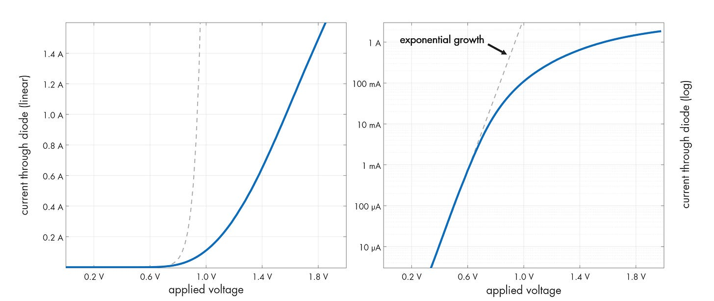
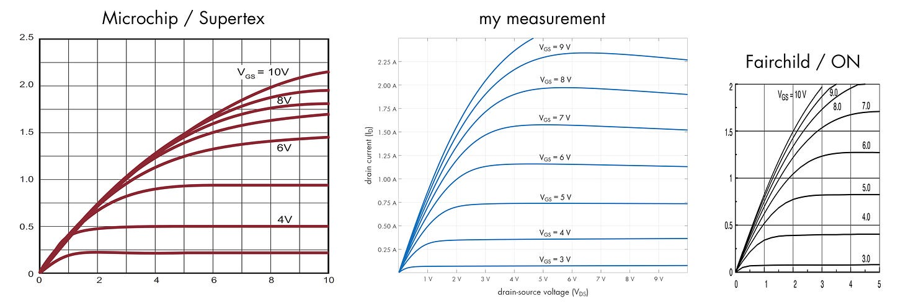

---
authors:
- aitoboxrobot
categories:
- 工具教程
date: 2026-08-21
hide:
- navigation
tags:
- 电子工程
- 测量技术
- SMU
- SCPI
- 硬件测试
title: 技术笔记：在家自制 V-I 特性曲线图
---
### 文章背景与核心概要

在撰写《电路的秘密生活》（*The Secret Life of Circuits*）一书时，作者为了避免使用教科书中常见的“虚构”或“理想化”图表，决定通过实测获取真实数据。本文详细探讨了在测量电压-电流（V-I）特性时面临的挑战，如热漂移和器件损坏风险，并介绍了如何利用源测量单元（SMU）和符合 SCPI 标准的仪器构建一套可靠的自动化测量系统。

该文的核心在于强调实测数据对于电子设计的必要性。通过采用脉冲电源、液体冷却以及基于 SCPI 的自动化采集方案，作者成功捕捉到了半导体器件在真实工作环境下的细微特征，揭示了理想模型与实际物理表现之间的显著差异，为工程师提供了更具参考价值的电路设计依据。

---

### “教科书式”数据的局限性
大多数电子教程都依赖于反复引用且不够精确的图表。为了确保《电路的秘密生活》一书的真实性，作者手动收集了从石英晶体到真空管等各类元器件的数据。然而，捕捉半导体器件的 V-I 曲线却困难重重：
*   **灵敏度：** 电流可能过低，导致标准示波器无法精确测量。
*   **热漂移：** 半导体结的特性会随温度变化，即使在低电流（1 mA）下也是如此。
*   **损坏风险：** 高电流会迅速导致器件烧毁，产生“魔法烟雾”。

> Most electronics tutorials rely on rehashed, inaccurate diagrams. To ensure authenticity in *The Secret Life of Circuits*, the author manually collected data for everything from quartz crystals to vacuum tubes. However, capturing V-I plots for semiconductors proved difficult:
> *   **Sensitivity:** Currents can be too low for standard oscilloscopes to measure accurately.
> *   **Thermal Drift:** Semiconductor junctions change characteristics with temperature, even at low currents (1 mA).
> *   **Destruction:** High currents can quickly lead to "magic smoke."

### 解决方案：自动化与冷却
为了缓解上述问题，作者放弃了示波器，转而采用以下方案：
1.  **台式万用表 (DMM)：** 用于精确的微安/微伏级测量。
2.  **脉冲电源：** 使用短脉冲供电以防止器件自热。
3.  **液体冷却：** 将器件浸没在非导电液体（如矿物油）中，以保持热稳定性。

> To mitigate these issues, the author moved away from oscilloscopes in favor of:
> 1.  **Benchtop Multimeters (DMMs):** For precise microamp/microvolt measurements.
> 2.  **Pulsed Power:** Using short pulses to prevent self-heating.
> 3.  **Liquid Cooling:** Submerging devices in non-conductive liquid (like mineral oil) to maintain thermal stability.

<figure><figcaption><em>A close-up of the final setup.</em></figcaption></figure>

### 利用 SCPI 和 SMU
手动收集数据非常繁琐。许多台式仪器支持 **SCPI（可编程仪器标准命令）**，允许通过 RS-232、USB 或以太网（端口 5025）进行计算机控制的数据采集。

对于高级需求，作者推荐使用 **源测量单元 (SMU)**。虽然新设备价格昂贵，但在二手市场上往往能以极低的价格购得。作者使用了 Rohde & Schwarz NGU401，并利用其“FastLog”功能进行高速数据流传输。

> Manual data collection is tedious. Many benchtop instruments support **SCPI (Standard Commands for Programmable Instruments)**, allowing for computer-controlled data acquisition via RS-232, USB, or Ethernet (port 5025).
>
> For advanced needs, the author recommends a **Source Measure Unit (SMU)**. While expensive new, they are often available at a fraction of the cost on the second-hand market. The author utilized a Rohde & Schwarz NGU401, employing its "FastLog" feature to stream high-speed data.

### 实际测量结果
作者提供了用于捕捉二极管和 MOSFET 曲线的 C 语言实现，并强调真实世界的数据往往会揭示出理想模型所忽略的细微差别（例如衬底电阻）。

> The author provides C implementations for capturing curves for diodes and MOSFETs, emphasizing that real-world data often reveals nuances (like substrate resistance) that idealized models miss.

<figure><figcaption><em>Forward bias of 1N4148.</em></figcaption></figure>

#### MOSFET 击穿与差异
在测量 BS170 等晶体管时，作者发现教科书中描绘的“尖锐”击穿在现实中要平缓得多。此外，将实测数据与制造商数据手册进行对比，往往会发现显著差异，这证明了“真实世界”的测试对于精确的电路设计至关重要。

> When measuring transistors like the BS170, the author found that the "sharp" breakdown often depicted in textbooks is far more gradual in reality. Furthermore, comparing captured data against manufacturer datasheets often reveals significant differences, proving that "real-world" testing is essential for accurate circuit design.

<figure><figcaption><em>2N7000: Microchip spec (left) vs reality (middle).</em></figcaption></figure>

---
*欲了解更多技术见解，您可以查看作者的 [原始博客文章](https://lcamtuf.coredump.cx/electronics/) 或浏览 [样章](https://nostarch.com/download/samples/secret-life-of-circuits_chapter-9.pdf)。*

> *For more technical insights, you can view the author's [original blog post](https://lcamtuf.coredump.cx/electronics/) or explore the [sample chapter](https://nostarch.com/download/samples/secret-life-of-circuits_chapter-9.pdf).*