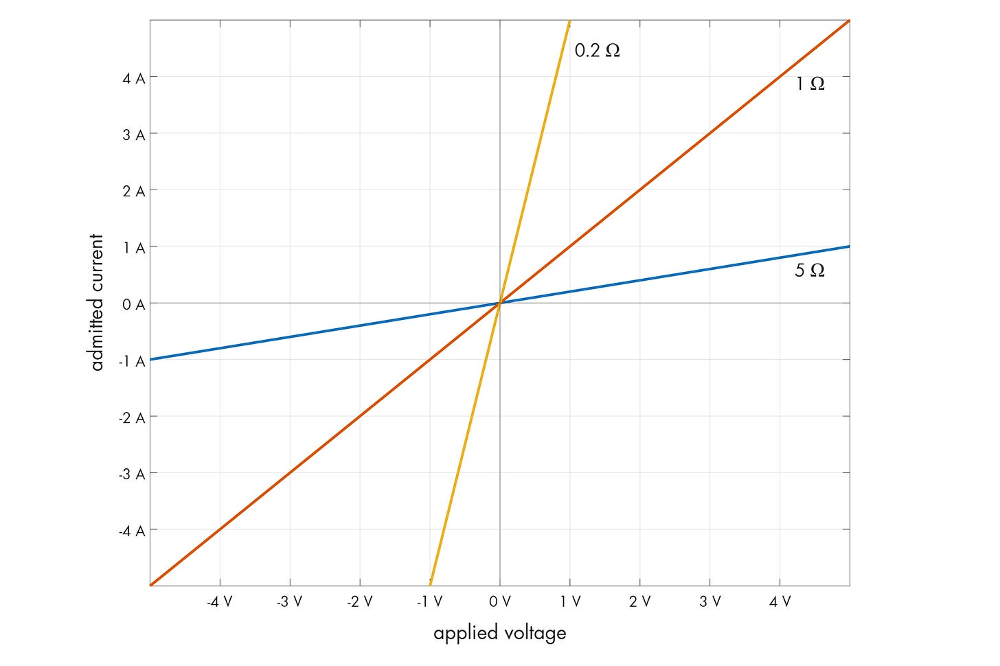
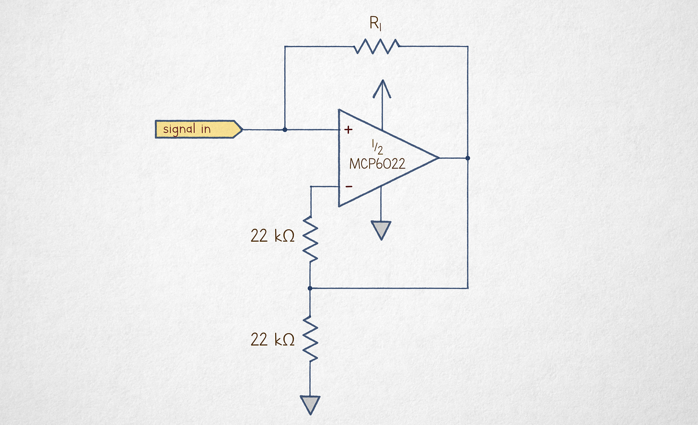
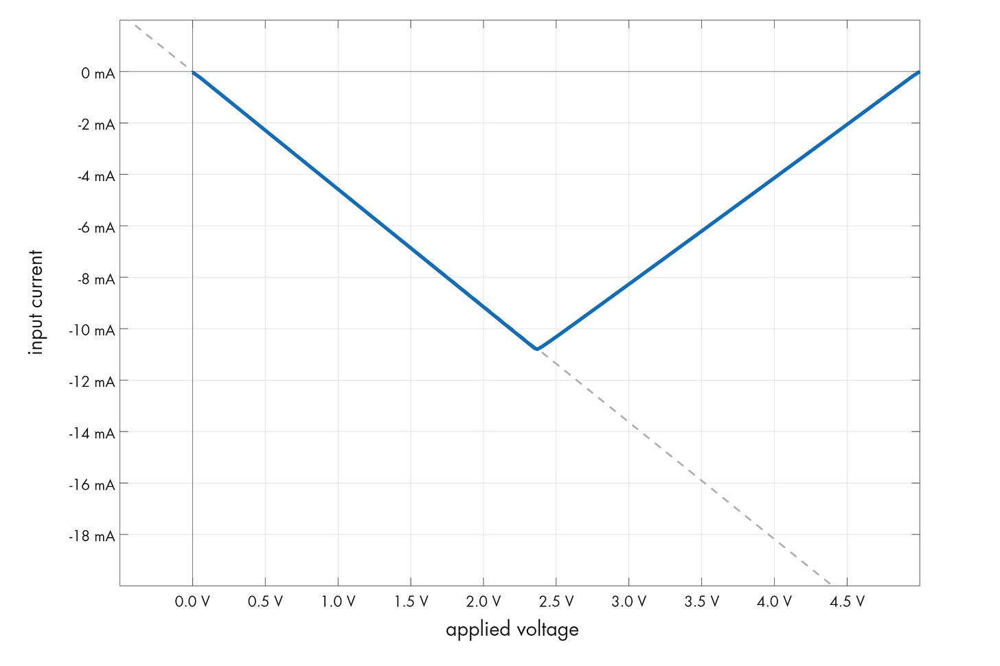
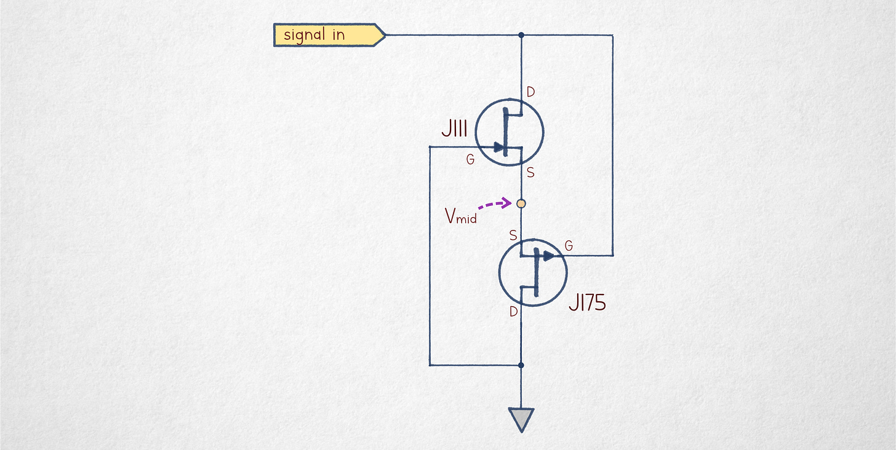
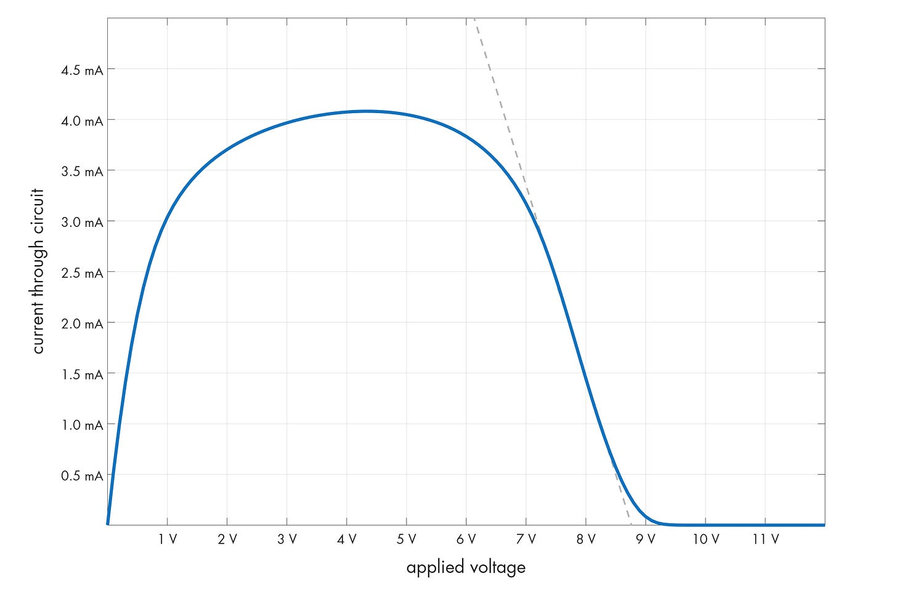
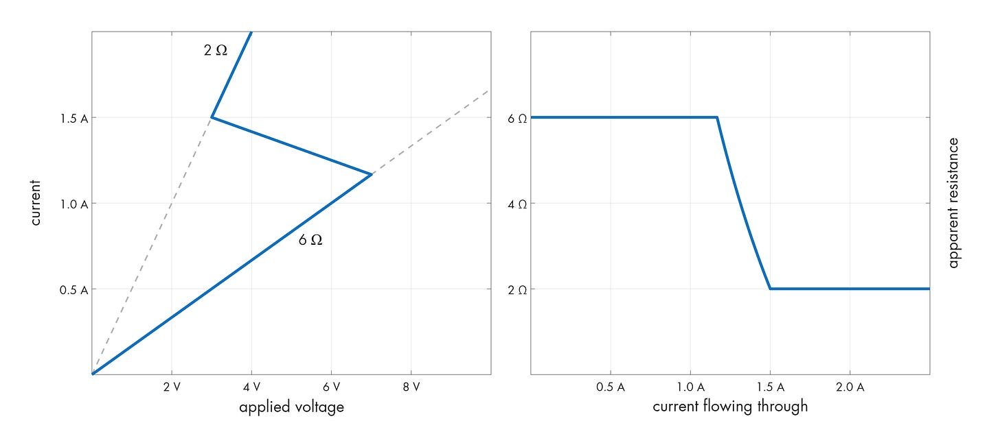

---
authors:
- aitoboxrobot
categories:
- 工具教程
date: 2026-08-21
hide:
- navigation
tags:
- 模拟电子
- 负电阻
- 负微分电阻
- 运算放大器
- 电子电路
title: 理解负电阻
---
### 文章背景与核心概要
本文探讨了模拟电子学中一个反直觉的概念——“负电阻”。传统的电阻遵循欧姆定律（$I = V/R$），而负电阻则描述了电流与电压关系违背传统预期的电路。文章区分了“真正的”负电阻（这需要外部电源才能运作）以及“负微分电阻”（这是一种电路的 $V-I$ 曲线呈现向下斜率或“折返”的现象，常见于结型场效应管（JFET）或晶体管等专用组件中）。

通过本文，读者可以深入了解负电阻的物理本质、如何利用运放构建真正的负电阻转换器，以及负微分电阻（如厄米特/Lambda二极管和水平回跳现象）在实际电路中的表现与应用。

---

### Defining Resistance
电阻（$R$）是对稳定电流流动的阻碍。在纯电阻组件中，电压（$V$）与电流（$I$）之间的关系是线性的，由 $I = V/R$ 定义。

> ### Defining Resistance
> Resistance ($R$) is the opposition to the flow of steady current. In a purely resistive component, the relationship between voltage ($V$) and current ($I$) is linear, defined by $I = V/R$.

对于二极管等非线性组件，我们使用**微分电阻**，它用于模拟在特定偏置点附近对小信号偏差（$\Delta v / \Delta i$）的响应，而不是组件的体电阻。

> For non-linear components like diodes, we use **differential resistance**, which models the response to small signal deviations ($\Delta v / \Delta i$) around a specific bias point rather than the bulk resistance of the component.

---

### True Negative Resistance
理论上，“负阻器件”（具有 $R < 0$ 的组件）会产生与所加电压方向相反的电流。然而，由于功率耗散定义为 $P = V^2 / R$，负电阻意味着该组件正在产生能量。

> ### True Negative Resistance
> A "negistor" (a component with $R < 0$) would theoretically produce current in the opposite direction of the applied voltage. However, because power dissipation is defined as $P = V^2 / R$, a negative resistance would imply the component is generating energy. 

真正的负电阻只能通过使用有源电路（例如运算放大器配置）将能量反馈回信号源来达到。

> True negative resistance can only be achieved by using an active circuit (such as an op-amp configuration) to feed energy back into the signal source.

通过使用具有特定增益的运算放大器，我们可以创建一个在信号源和地之间充当负电阻的电路。

> By using an op-amp with a specific gain, we can create a circuit that acts as a negative resistor between the signal source and ground.

---

### Negative Differential Resistance (NDR)
“负电阻”的大多数实际应用都是指**负微分电阻（NDR）**。当 $V-I$ 曲线具有负斜率区段时，就会出现这种情况，这意味着在特定范围内，电压的增加会导致电流的减少。

> ### Negative Differential Resistance (NDR)
> Most practical applications of "negative resistance" refer to **Negative Differential Resistance (NDR)**. This occurs when a $V-I$ curve has a section with a negative slope, meaning that within a specific range, an increase in voltage leads to a decrease in current.

#### The Lambda Diode
NDR 的一个经典例子是“Lambda 二极管”，这是一种由两个互补型 JFET 构成的电路。

> #### The Lambda Diode
> A classic example of NDR is the "lambda diode," a circuit constructed from two complementary JFETs.

在这种配置下，晶体管的偏置使得它们在输入电压增加时开始截止，从而导致电流急剧下降。

> In this configuration, the transistors are biased such that they begin to cut off as the input voltage increases, resulting in a sharp decrease in current.

#### Horizontal Snapback
NDR 的另一种形式是“回跳（Snapback）”，一旦跨越特定的阈值，电路就会在更低的电压下维持更高的电流。这种行为常见于双极型晶体管，它不同于垂直折返式 NDR，因为它允许多个电流水平存在于单个电压点。

> #### Horizontal Snapback
> Another form of NDR is "snapback," where a circuit sustains higher currents at lower voltages once a specific threshold is crossed. This behavior is often observed in bipolar transistors and is distinct from the vertical-kink NDR, as it allows multiple current levels to exist at a single voltage point.

