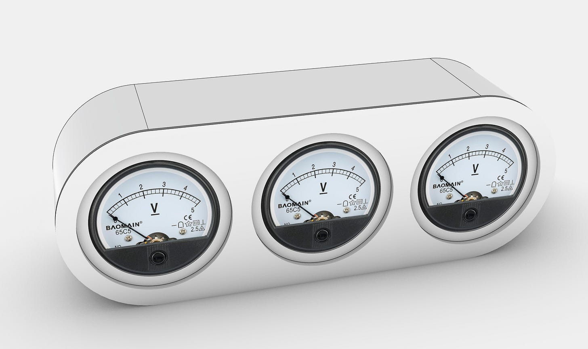
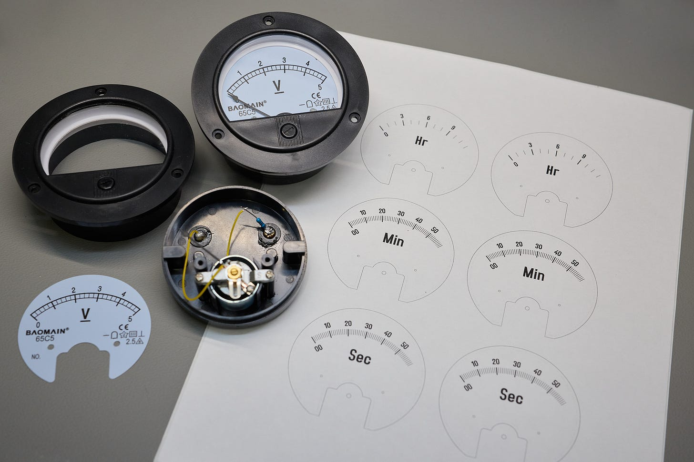
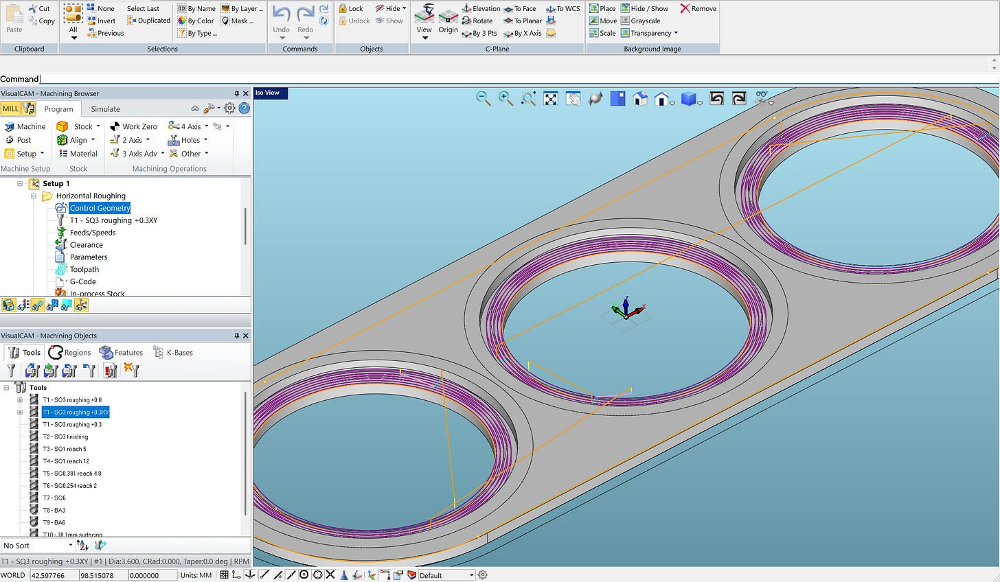
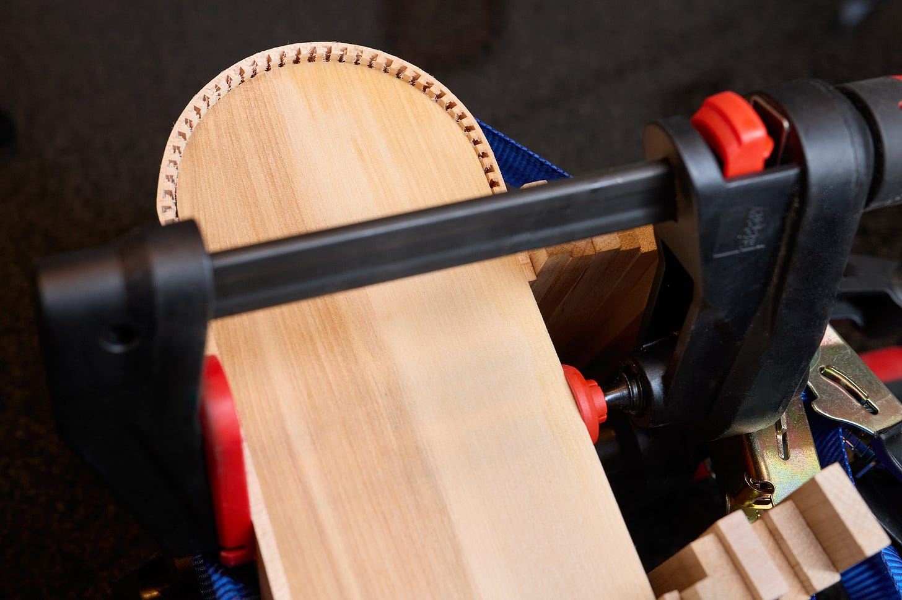
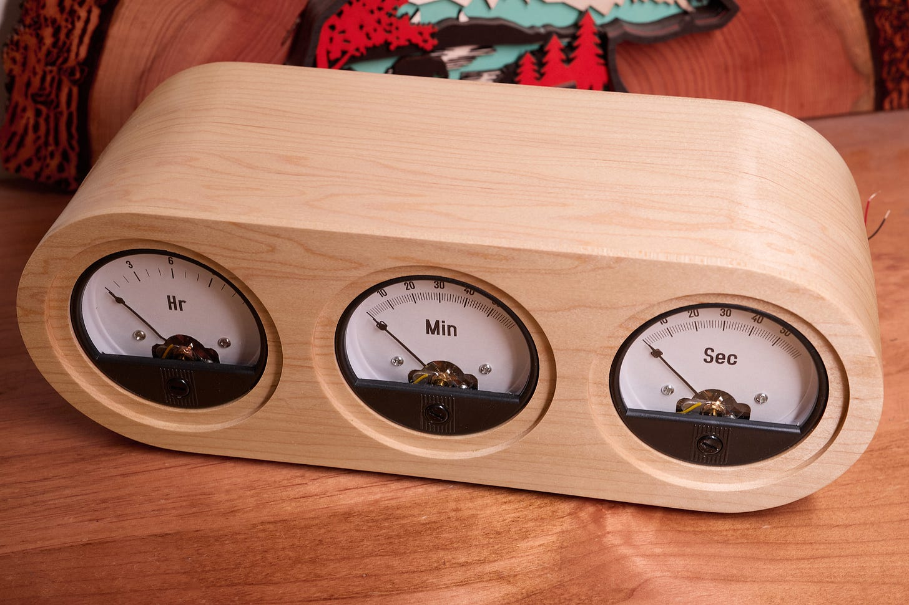
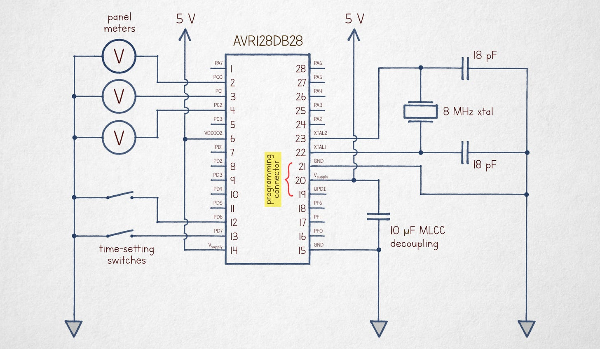

---
authors:
- aitoboxrobot
categories:
- 产品发布
date: 2026-08-21
hide:
- navigation
tags:
- 硬件制作
- 嵌入式开发
- 模拟仪表
- CNC加工
- AVR
title: 精美的指针式伏特表时钟
---
### 文章背景与核心概要
本文记录了一款模拟伏特表时钟（Voltmeter Clock）的演变与制作过程。作者在改进 2019 年粗糙原型机的基础上，设计出了一款更加精致的版本：采用定制铣削的枫木外壳、精密打印的表盘贴花以及精简的微控制器电路。

该时钟利用连续运动的电表来显示时间，由 AVR128DB28 单片机通过简单的脉冲宽度调制（PWM）技术驱动。文章详细介绍了从 Rhino3D 三维建模、表盘定制、CNC 外壳加工到软硬件实现的完整流程，为硬件爱好者提供了一份极具参考价值的制作指南。

---

# A Nicer Voltmeter Clock

> # A Nicer Voltmeter Clock

### Summary
> ### Summary
> 
> This project documents the evolution of an analog voltmeter clock. Moving beyond a "janky" 2019 prototype, the author designed a refined version featuring a custom-milled maple enclosure, precision-printed dial decals, and a streamlined microcontroller circuit. The clock utilizes continuous-motion gauges to display time, driven by a simple pulse-width modulation technique on an AVR128DB28 MCU.

---

### The Design Process
> ---
> 
> ### The Design Process
> Back in 2019, I built a simple voltmeter clock using analog panel voltmeters. While the concept is popular, many existing designs feel unrefined. I decided to document a more polished approach, starting with a 3D mockup in Rhino3D.

> 

### Customizing the Gauges
> ### Customizing the Gauges
> I sourced three generic 90° panel voltmeters (approx. $9 each). I disassembled them to create custom, high-quality decals. 
> *   **Templates:** Printable PDF templates are available [here](https://lcamtuf.coredump.cx/soft/embedded/meter_clock2.pdf).
> *   **Continuous Motion:** The hour gauge features 13 divisions (0–12), while minutes and seconds feature 61 (00–60). This allows the hands to move continuously toward the next increment rather than jumping abruptly.

> 

### Enclosure Fabrication
> ### Enclosure Fabrication
> To hide the unsightly plastic flanges of the stock meters, I designed a recessed pattern for the front panel. I used a CNC mill to cut the maple lumber for a precise, professional finish.

> 

For the curved side walls, I employed a "kerf-bending" technique, notching the wood to allow it to conform to a template without requiring a steam-bending rig.
> For the curved side walls, I employed a "kerf-bending" technique, notching the wood to allow it to conform to a template without requiring a steam-bending rig.

> 

The final assembly was sanded and finished with a coat of nitrocellulose lacquer.
> The final assembly was sanded and finished with a coat of nitrocellulose lacquer.

> 

### Electronics and Code
> ### Electronics and Code
> The circuit is intentionally simple:
> *   **MCU:** AVR128DB28.
> *   **Drive Method:** Instead of complex DACs, I used a high-frequency, 1-bit digital pulse train. The inertia of the meter coils naturally smooths the signal, allowing for precise positioning via duty cycle control.
> *   **Timekeeping:** Synchronized via an 8 MHz crystal (a 32.768 kHz crystal would also suffice).
> *   **Source Code:** The well-commented code can be viewed [here](https://lcamtuf.coredump.cx/soft/embedded/meter_clock2.c).

> 

### The Result
> ### The Result
> Here is the clock in action, captured during the transition at 11:59:59:

<iframe src="https://player.vimeo.com/video/1192897862?autoplay=0&amp;h=5c9c9e28be&amp;dnt=1" frameborder="0" allowfullscreen="true" sandbox="allow-scripts allow-same-origin allow-popups allow-popups-to-escape-sandbox" loading="lazy"></iframe>
> <iframe src="https://player.vimeo.com/video/1192897862?autoplay=0&amp;h=5c9c9e28be&amp;dnt=1" frameborder="0" allowfullscreen="true" sandbox="allow-scripts allow-same-origin allow-popups allow-popups-to-escape-sandbox" loading="lazy"></iframe>

***
> ***

*PS: A build from a reader, combining the appearance of the v1 clock with the circuitry of v2, can be found [here](https://github.com/mike4192/voltmeter_clock/).*
> *PS: A build from a reader, combining the appearance of the v1 clock with the circuitry of v2, can be found [here](https://github.com/mike4192/voltmeter_clock/).*