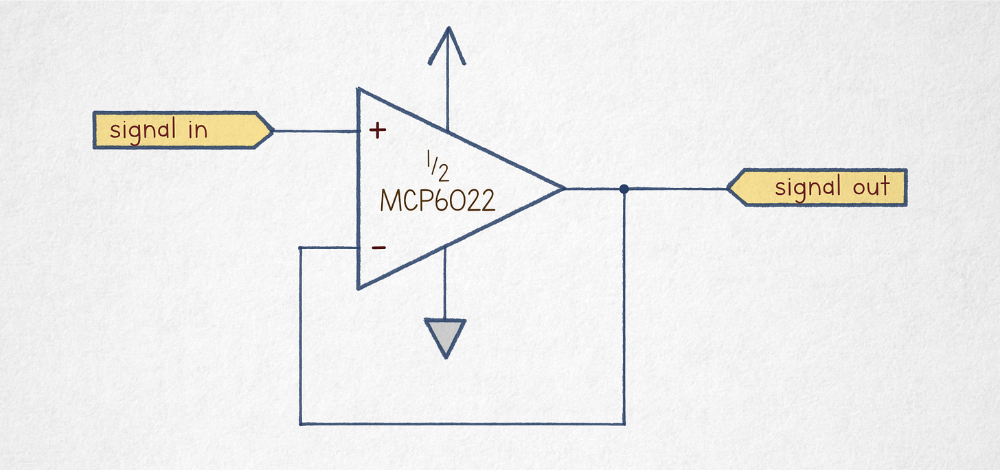
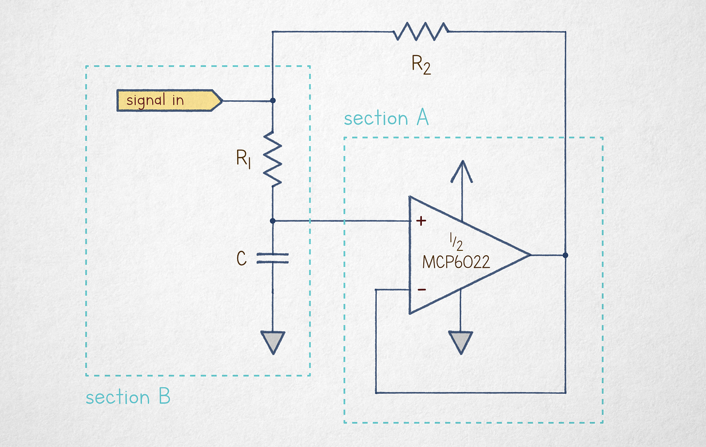
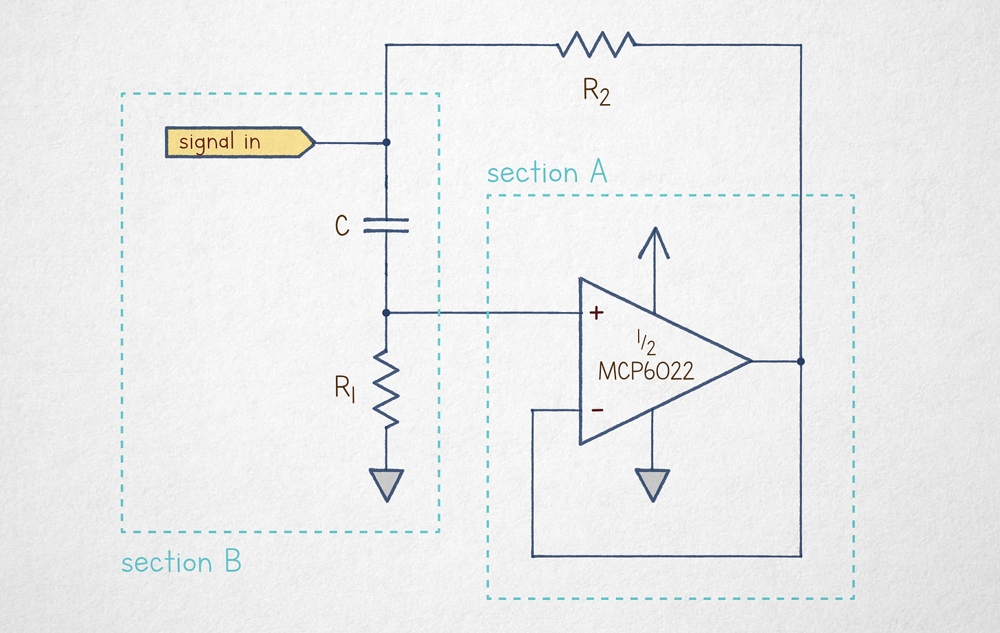

---
authors:
- aitoboxrobot
categories:
- 工具教程
date: 2026-08-21
hide:
- navigation
tags:
- 运算放大器
- 电路理论
- 电容倍增器
- 模拟电路
title: '被诅咒的电路 #5：电容倍增器'
---
### 文章背景与核心概要
本文探讨了一种被称为“电容倍增器”的经典电子电路。该电路巧妙地利用运算放大器（Op-amp）和电阻网络，使一个小容量电容表现出远大于其标称值的电容特性。

从技术核心来看，该电路通过电压跟随器配置，强制电容两端的电压变化与输入信号保持特定比例，从而改变了电容充放电的电流路径，实现了等效电容值的放大。虽然在现代电子设计中，随着高性能电容和数字方案的普及，这种技巧的应用已有所减少，但它依然是理解电路理论、阻抗变换及反馈机制的绝佳教学案例。

---

## 导言

电子电路理论是我博客中的[常客](https://lcamtuf.substack.com/p/electronics-curriculum)。作为该“准课程”的一部分，我发布过许多关于运算放大器的文章。我之所以不断回到这个话题，原因有二：

1. 这些组件通常解释得不够清晰，导致它们成为初学者学习过程中的主要绊脚石。
2. 运算放大器现在已经变得非常优秀、廉价且小巧，因此应该得到更广泛的应用。

如果这些组件对你来说仍然是个谜，那么这篇文章可能不是最好的起点。我们将涵盖一些基础知识，但我建议你抽出时间阅读我 2023 年发表的另外两篇文章。

我还将在《[电路的秘密生活](https://lcamtuf.coredump.cx/electronics/)》一书中深入探讨运算放大器理论（以及更多内容！），这是一本精心制作的书籍，目前已开放抢先体验，并将于 2026 年 9 月上架。

今天，我想谈谈一个没能入选该书的电路。它不像[跨阻放大器](https://lcamtuf.substack.com/p/building-a-decent-microphone-amplifier)、[积分器](https://lcamtuf.substack.com/p/cursed-circuits-3-true-mathematics)或 [Sallen-Key 滤波器](https://lcamtuf.substack.com/p/analog-filters-part-2-let-it-ring)那样实用，所有这些电路在书中都得到了基于第一性原理的深入讲解。但同时，它又太酷了，不分享实在可惜。

> Electronic circuit theory is a [frequent theme](https://lcamtuf.substack.com/p/electronics-curriculum) on this blog. As a part of this *sorta-*curriculum, I published a number of articles about operational amplifiers. I keep coming back to this topic for two reasons. 
>
> 1. These components are usually explained poorly, making them a major stumbling block for folks trying to learn the craft.
> 2. Op-amps have gotten really good, inexpensive, and small, so they should be used more.
>
> If these components are still a mystery to you, this article is probably not the best place to start. We’ll cover the very basics, but I recommend carving out some time to go over two other write-ups from 2023. 
>
> I also cover op-amp theory (and a lot more!) in *[The Secret Life of Circuits](https://lcamtuf.coredump.cx/electronics/)*, a lovingly-crafted book that’s available in early access and will be hitting the shelves in September 2026.
>
> Today, I’d like to talk about a circuit that didn’t make the cut for the book. It’s not nearly as useful as a [transimpedance amplifier](https://lcamtuf.substack.com/p/building-a-decent-microphone-amplifier), an [integrator](https://lcamtuf.substack.com/p/cursed-circuits-3-true-mathematics), or a [Sallen-Key filter](https://lcamtuf.substack.com/p/analog-filters-part-2-let-it-ring), all of which get in-depth treatments from first principles. At the same time, it’s just too cool not to share.

---

## 运算放大器快速回顾

我知道大多数读者不喜欢点击链接，所以在深入探讨之前，让我们先回顾一下运算放大器的作用。如果你认为它是一种通过“读取”一对外部电阻值来配置内部增益的可变增益放大器，那么最好忘掉这些，从头开始。

理想的运算放大器只做一件事：计算其两个输入引脚（$Vin-$ 和 $Vin+$）之间的电压差，将其乘以一个巨大的常数因子（$A_{OL}$，通常为 1,000,000 或更高），然后输出相对于电源中点（$Vmid$）的电压。

实际上，这意味着如果 $Vin-$ 明显小于 $Vin+$，输出电压会向芯片的正电源摆动。相反，如果 $Vin-$ 超过 $Vin+$，输出会向负轨下沉。中间输出电压仅在 $Vin- \approx Vin+$ 的极窄微伏级线性区域内才可能存在。

最简单的运算放大器电路——也是我们今天唯一需要的电路——是电压跟随器：

该电路将输出电压反馈到其差分输入引脚之一。如果 $Vin+$ 上的输入信号相对于 $Vin-$ 升高，这会使放大的差分信号更正，迫使输出电压上升，直到恢复 $Vin- \approx Vin+$ 的平衡。同样，如果 $Vin-$ 下降，差值变得更负，将放大信号推向较低的平衡点。实际上，输出电压以亚毫伏级的精度跟踪输入信号。

为了理解下一节，我们只需要另外两个电子理论知识点：
1. **欧姆定律：** 流过电阻的电流与施加在其端子上的电动势（电压）成正比，并与组件的值（电阻）成反比：$I = V/R$。
2. **电容：** 在电容两端施加电压时，它会接纳充电电流，直到积累电荷产生的反作用力与外部电压相匹配。更高的电容意味着在响应相同的电动势时，可以移动更多的电子（$C$ 意味着随时间推移有更多的电流）。

*（如果上面的段落听起来令人困惑，你应该在继续阅读之前先复习关于[电子电路核心概念](https://lcamtuf.substack.com/p/primer-core-concepts-in-electronic)的文章。）*

> I know that most readers don’t click links, so before we dive in, let’s recap what an op-amp does. If you have it pegged as some sort of a variable-gain amplifier that “reads” the value of a pair of external resistors to configure internal gain, it’s best to forget all that and start afresh.
>
> An ideal op-amp does one thing and one thing only: it calculates the difference between the voltages on its two input pins ($Vin-$ and $Vin+$), multiplies it by a humongous constant factor ($A_{OL}$, typically 1,000,000 or more), and then outputs the resulting voltage in relation to the midpoint of the supply ($Vmid$).
>
> In practical terms, it means that if $Vin-$ is noticeably less than $Vin+$, the output voltage swings toward the positive supply of the chip. Conversely, if $Vin-$ exceeds $Vin+$, the output dives toward the negative rail. Intermediate output voltages are possible only in a very narrow, microvolt-range linear region of $Vin- \approx Vin+$.
>
> The simplest op-amp circuit — and the only one we need today — is the voltage follower:
>
> 
>
> The circuit loops the output voltage onto one of its differential input pins. If the input signal on $Vin+$ creeps higher in relation to $Vin-$, this makes the amplified differential signal more positive, forcing the output voltage to rise until the $Vin- \approx Vin+$ equilibrium is restored. In the same vein, if $Vin-$ drops, the difference becomes more negative, sending the amplified signal toward a lower equilibrium point. In effect, the output voltage tracks the input signal with sub-millivolt accuracy.
>
> To make sense of the next section, we need just two other tidbits of electronic theory:
> 1. **Ohm’s law:** The current flowing through a resistor is proportional to the electromotive force (voltage) applied to its terminals, divided by the component’s value (resistance): $I = V/R$.
> 2. **Capacitance:** A capacitor subjected to a voltage across its terminals will admit charging current until the pushback force created by the accumulated charge matches the external voltage. Higher capacitance means proportionately more electrons can be shuffled around in response to the same electromotive force ($C$ means more current over time).
>
> *(If the above paragraph sounds confusing, you should review the article on [core concepts in electronic circuits](https://lcamtuf.substack.com/p/primer-core-concepts-in-electronic) before venturing forth.)*

---

## 电容，带点“花样”

这把我们带到了今天的主角：电容倍增器。这是一种乍看之下通常让人摸不着头脑的电路，因为我们无法将其与已知的任何模式匹配：

为了揭开这个谜团，将其分解为两个基本独立的构建模块就足够了：
* **A 部分**只是一个配置为电压跟随器的运算放大器。无论电路中发生什么，它都会从 B 部分获取电压，并在其输出端镜像该信号。
* **B 部分**是一个通过电阻充电的电容。虽然电容两端的电压（$Vcap$）会随时间变化，但让我们在定格画面中对其进行建模。在这种设置下，运算放大器正在镜像电容当前的充电状态；$R2$ 右端子的电压几乎与 $Vcap$ 完全相同。

转向 $R1$，根据欧姆定律，我们可以得出结论：流过电阻的电流仅取决于组件的值及其端子上的瞬时电压。无论电路中发生什么， $R1$ 的上端子电压与输入引脚（$Vsignal$）相同，而下端子始终处于 $Vcap$。因此，电阻电流为：

为了清晰起见，我们将 $Vsignal - Vcap$ 表达式简写为 $v$。这给了我们：

接下来，让我们看看另一个电阻 $R2$。该组件的左端子处于 $Vsignal$；通过电压跟随器的作用，右端子必须处于 $Vcap$。这意味着流过该电阻的电流仅仅是：

本质上，我们在输入引脚和 $Vcap$ 之间并联了两个电阻。

自然地，流过电阻的电流方向相同。如果 $Vsignal > Vcap$，电流通过输入端流入。反之，它会反馈回信号源。在这两种情况下，总输入电流为：

接下来，让我们计算 $Itotal$ 与通过 $R1$ 实际分流到电容的电流之比。我们将此比率标记为 $n$：

这告诉我们，电容充电的速度比我们根据移动电荷量所预期的要慢 $n$ 倍。另一种看待方式是，这种情况与通过一对并联电阻 $R1$ 和 $R2$ 对一个更大的电容（$n \cdot C$）充电没有区别。如果 $R1 \gg R2$，这可以近似为通过 $R2$ 对 $n \cdot C$ 充电的模型。

就是这样：通过加入一个运算放大器和两个精心选择值的电阻，你可以将一个廉价的 1 µF 电容变成一个高级的 1 mF 电容。该电路并不模拟能量存储的增加——你不能将其用于备用电源——但在信号滤波或计时等应用中，这在概念上是一个非常巧妙的技巧。你可以使用更小、成本更低且规格更好的组件。

在实践中，它的用处不如以前了。电容技术在过去 20-30 年中取得了巨大进步。如果你确实需要超低频滤波器或长间隔定时器，那么很有可能使用数字芯片可以以更高的灵活性和保真度实现相同的想法。

不过——它还是很酷，对吧？

> This brings us to our guest of honor: the capacitance multiplier. It’s the kind of circuit that usually doesn’t make sense at first glance because we can’t pattern-match it to anything we know:
>
> 
>
> To unravel the mystery, it suffices to break it down into two mostly-separate building blocks:
> * **Section A** is just an op-amp configured as a voltage follower. No matter what else is going on in the circuit, it takes some voltage from section B and then mirrors that signal on its output leg.
> * **Section B** is a capacitor that’s charging through a resistor. Although the voltage across the capacitor’s terminals ($Vcap$) will change over time, let’s model this in a freeze-frame view. In this setting, the op-amp is mirroring the capacitor’s current charge state; the voltage on the right terminal of $R2$ is almost exactly the same as $Vcap$.
>
> Moving onto $R1$, we can conclude from Ohm’s law that the current flowing through the resistor depends only on the component’s value and the momentary voltage across its terminals. No matter what else is going on in the circuit, the upper terminal of $R1$ is at the same voltage as the input leg ($Vsignal$) and the lower terminal is always at $Vcap$. Therefore, the resistor current is:
>
> For clarity, let’s shorten the $Vsignal - Vcap$ expression to $v$. This gives us:
>
> Next, let’s have a look at the other resistor, $R2$. The component’s left terminal is at $Vsignal$; the right terminal must be at $Vcap$ by the operation of the voltage follower. This means that the current flowing through the resistor is just:
>
> In essence, we have two resistors in parallel between the input leg and $Vcap$.
>
> Naturally, the currents through the resistors are flowing in the same direction. If $Vsignal > Vcap$, the current flows in via the input terminal. In the inverse case, it feeds back into the signal supply. In both cases, the total input current is:
>
> Next, let’s calculate the ratio of $Itotal$ to the current actually diverted to the capacitor via $R1$. We’ll label this ratio $n$:
>
> This tells us that the capacitor is charging $n$ times more slowly than we would expect looking at the amount of charge moved. Another way to look at it is that the situation is indistinguishable from charging a proportionately larger capacitance — $n \cdot C$ — through a pair of parallel resistors $R1$ and $R2$. If $R1 \gg R2$, this can be approximated as a model of $n \cdot C$ charging via $R2$.
>
> And that’s it: you can turn a cheap 1 µF capacitor into a fancy 1 mF by tossing in an op-amp and two resistors with carefully-chosen values. The circuit doesn’t emulate increased energy storage — you can’t use this for backup power — but in applications such as signal filtering or timekeeping, it’s notionally a pretty neat trick. You can use components that are smaller, cost less, and have better specs.
>
> In practice, it is less useful than it used to be. Capacitor technology has improved dramatically over the past 20–30 years. And if you truly need an ultra-low-frequency filter or a long-interval timer, chances are, the same idea can be realized with greater flexibility and fidelity using a digital chip.
>
> Still — it’s neat, right?

---

## 后记：互换位置

作为一项自愿的家庭作业，请考虑上述设计的以下变体：

唯一的改变是 $C$ 和 $R1$ 互换了位置。你的任务（如果你接受的话）是弄清楚这个电路的作用。

如果你感到困惑，请注意，电容要充电，必须在*两个*端子上都有相应的电荷运动——即必须有一些电流“流过”该组件。在该电路中，如果电容最初是放电的，而输入电压突然跳变到 5 V，充电过程会受到 $R1$ 的阻碍，因此电容两端的电压保持在 0 V 附近；电动势只是通过电介质间隙耦合，使 $Vin+$ 处于 5 V - 0 V。只有过了一段时间，足够多的电子才能通过 $R1$，推动 $Vcap$ 趋向 5 V，$Vin+$ 趋向 0 V。

> As a voluntary homework assignment, consider the following variant of the earlier design:
>
> 
>
> The only change is that $C$ and $R1$ are swapped. Your mission, should you accept it, is to figure out what this circuit does.
>
> If you’re stumped, note that for a capacitor to charge, there must be a matching motion of charges on *both* terminals — i.e., some current must flow “through” the component. In the circuit, if the capacitor is initially discharged and the input voltage suddenly jumps to 5 V, the charging process is hindered by $R1$, so the voltage across the capacitor stays near 0 V; the electromotive force simply couples across the dielectric gap, putting $Vin+$ at 5 V - 0 V. It’s only after a while that a sufficient number of electrons can make their way through $R1$, nudging $Vcap$ toward 5 V and $Vin+$ toward 0 V.

---

# 📖

如果你喜欢这篇文章，你会喜欢《[电路的秘密生活](https://lcamtuf.coredump.cx/electronics/)》。这是一本图文并茂、通俗易懂的电子学入门书——从导电物理学到嵌入式系统编程。它包含 290 多张彩色图表、420 多页原创内容，且完全没有 AI 生成内容。

> If you liked the article, you’ll enjoy *[The Secret Life of Circuits](https://lcamtuf.coredump.cx/electronics/)*. It’s a richly illustrated, lucid introduction to electronics — from the physics of conduction to embedded system programming. It features 290+ color diagrams, 420+ pages of original content, and zero AI.

---

*本系列的其他文章：*

*我撰写关于电子学、[数学基础](https://lcamtuf.substack.com/p/monkeys-typewriters-and-busy-beavers)、[技术史](https://lcamtuf.substack.com/p/a-brief-history-of-counting-stuff)以及其他极客兴趣的内容。如果你喜欢，请订阅。*

[立即订阅](https://blog.coredump.cx/subscribe?)

> *Some other articles in this series:*
>
> *I write about electronics, [the foundations of mathematics](https://lcamtuf.substack.com/p/monkeys-typewriters-and-busy-beavers), [the history of technology](https://lcamtuf.substack.com/p/a-brief-history-of-counting-stuff), and other geek interests. If you like it, please subscribe.*
>
> [Subscribe now](https://blog.coredump.cx/subscribe?)